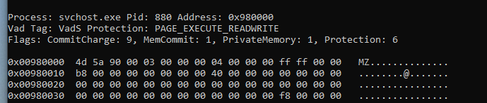

Q1 Which volatility profile would be best for this machine?


```c++
PS C:\Users\cuong_nguyen\Desktop\CyberDefender\temp_extract_dir> vol2 -f .\CYBERDEF-567078-20230213-171333.raw imageinfo
Volatility Foundation Volatility Framework 2.6
INFO    : volatility.debug    : Determining profile based on KDBG search...
          Suggested Profile(s) : WinXPSP2x86, WinXPSP3x86 (Instantiated with WinXPSP2x86)
                     AS Layer1 : IA32PagedMemory (Kernel AS)
                     AS Layer2 : FileAddressSpace (C:\Users\cuong_nguyen\Desktop\CyberDefender\temp_extract_dir\CYBERDEF-567078-20230213-171333.raw)
                      PAE type : No PAE
                           DTB : 0x39000L
                          KDBG : 0x8054cde0L
          Number of Processors : 1
     Image Type (Service Pack) : 3
                KPCR for CPU 0 : 0xffdff000L
             KUSER_SHARED_DATA : 0xffdf0000L
           Image date and time : 2023-02-13 18:29:11 UTC+0000
     Image local date and time : 2023-02-13 10:29:11 -0800
```


```c++
PS C:\Users\cuong_nguyen\Desktop\CyberDefender\temp_extract_dir> vol2 -f .\CYBERDEF-567078-20230213-171333.raw --profile=WinXPSP2x86 kdbgscan
Volatility Foundation Volatility Framework 2.6
**************************************************
Instantiating KDBG using: Kernel AS WinXPSP2x86 (5.1.0 32bit)
Offset (V)                    : 0x8054cde0
Offset (P)                    : 0x54cde0
KDBG owner tag check          : True
Profile suggestion (KDBGHeader): WinXPSP3x86
Version64                     : 0x8054cdb8 (Major: 15, Minor: 2600)
Service Pack (CmNtCSDVersion) : 3
Build string (NtBuildLab)     : 2600.xpsp.080413-2111
PsActiveProcessHead           : 0x80561358 (25 processes)
PsLoadedModuleList            : 0x8055b1c0 (104 modules)
KernelBase                    : 0x804d7000 (Matches MZ: True)
Major (OptionalHeader)        : 5
Minor (OptionalHeader)        : 1
KPCR                          : 0xffdff000 (CPU 0)
```


Q2 How many processes were running when the image was acquired?


dùng pslist đếm thằng nào chưa exit 


19


Q3 What is the process ID of `cmd.exe`?


1960


Q4 What is the name of the most suspicious process?


rootkit.exe


Q5 Which process shows the highest likelihood of code injection?





4d 5a là MZ biểu hiện rõ ràng nhất của file exe


Q6 There is an odd file referenced in the recent process. Provide the full path of that file.


```c++
 vol2 -f .\CYBERDEF-567078-20230213-171333.raw --profile=WinXPSP2x86 -g 0x8054cde0 handles -p 880 -t process
Volatility Foundation Volatility Framework 2.6
Offset(V)     Pid     Handle     Access Type             Details
---------- ------ ---------- ---------- ---------------- -------
0x89a9f6f8    880      0x148   0x1f0fff Process          svchost.exe(968)
0x89a98da0    880      0x2a0   0x1f0fff Process          csrss.exe(592)
0x89a88da0    880      0x2a4   0x1f0fff Process          winlogon.exe(616)
```


```c++
PS C:\Users\cuong_nguyen\Desktop\CyberDefender\temp_extract_dir> vol2 -f .\CYBERDEF-567078-20230213-171333.raw --profile=WinXPSP2x86 -g 0x8054cde0 handles -p 880 -t file
Volatility Foundation Volatility Framework 2.6
Offset(V)     Pid     Handle     Access Type             Details
---------- ------ ---------- ---------- ---------------- -------
0x89a28890    880        0xc   0x100020 File             \Device\HarddiskVolume1\WINDOWS\system32
0x89a1a6f8    880       0x50   0x100001 File             \Device\KsecDD
0x89937358    880       0x68   0x100020 File             \Device\HarddiskVolume1\WINDOWS\WinSxS\x86_Microsoft.Windows.Common-Controls_6595b64144ccf1df_6.0.2600.5512_x-ww_35d4ce83
0x899d0250    880       0xbc   0x12019f File             \Device\NamedPipe\net\NtControlPipe2
0x89a17a50    880      0x100   0x100000 File             \Device\Dfs
0x89732cb8    880      0x158   0x12019f File             \Device\NamedPipe\lsarpc
0x8969fee0    880      0x274   0x12019f File             \Device\Termdd
0x89ab3478    880      0x294   0x12019f File             \Device\Termdd
0x89ab3978    880      0x29c   0x12019f File             \Device\Termdd
0x896bcd18    880      0x2b8   0x12019f File             \Device\NamedPipe\Ctx_WinStation_API_service
0x8997a248    880      0x2bc   0x12019f File             \Device\NamedPipe\Ctx_WinStation_API_service
0x899a24b0    880      0x304   0x12019f File             \Device\Termdd
0x89a00f90    880      0x33c   0x12019f File             \Device\{9DD6AFA1-8646-4720-836B-EDCB1085864A}
0x89af0cf0    880      0x340   0x12019f File             \Device\HarddiskVolume1\WINDOWS\system32\drivers\str.sys
0x89993f90    880      0x3d8   0x100020 File             \Device\HarddiskVolume1\WINDOWS\WinSxS\x86_Microsoft.Windows.Common-Controls_6595b64144ccf1df_6.0.2600.5512_x-ww_35d4ce83
0x89958b78    880      0x3e4   0x12019f File             \Device\HarddiskVolume1\WINDOWS\system32\config\systemprofile\Local Settings\Temporary Internet Files\Content.IE5\index.dat
0x899fe2e0    880      0x3f8   0x12019f File             \Device\HarddiskVolume1\WINDOWS\system32\config\systemprofile\Cookies\index.dat
0x89a492e8    880      0x400   0x12019f File             \Device\HarddiskVolume1\WINDOWS\system32\config\systemprofile\Local Settings\History\History.IE5\index.dat
0x896811d8    880      0x424   0x100020 File             \Device\HarddiskVolume1\WINDOWS\WinSxS\x86_Microsoft.Windows.Common-Controls_6595b64144ccf1df_6.0.2600.5512_x-ww_35d4ce83
0x89bbc028    880      0x488   0x100020 File             \Device\HarddiskVolume1\WINDOWS\WinSxS\x86_Microsoft.Windows.Common-Controls_6595b64144ccf1df_6.0.2600.5512_x-ww_35d4ce83
0x89999980    880      0x4a8   0x1200a0 File             \Device\NetBT_Tcpip_{B35F0A5F-EBC3-4B5D-800D-7C1B64B30F14}
```


\Device\HarddiskVolume1\WINDOWS\system32\drivers\str.sys


the file name, `str.sys`, stands out as unusual, as it does not conform to standard naming conventions for system driver files


Q7 What is the name of the injected DLL file loaded from the recent process?


Dumpfiles phát hiện


```c++
\WINDOWS\system32\config\systemprofile\Local Settings\Temporary Internet Files\Content.IE5\index.dat
\WINDOWS\system32\config\systemprofile\Cookies\index.dat
\WINDOWS\system32\config\systemprofile\Local Settings\History\History.IE5\index.dat
```


một dịch vụ hệ thống thông thường **không có lý do gì để lướt web, lưu Cookie hay lưu lịch sử duyệt web (History)**.

- `ws2_32.dll` & `mswsock.dll`: Các thư viện cơ bản để mở kết nối mạng (Sockets).
- `wininet.dll`: Thư viện cung cấp các hàm API cho HTTP/FTP.
- `urlmon.dll`: Thư viện cực kỳ phổ biến được mã độc dùng để tải file từ một URL về máy (hàm `URLDownloadToFile`).

```c++
PS C:\Users\cuong_nguyen\Desktop\CyberDefender\temp_extract_dir> vol2 -f .\CYBERDEF-567078-20230213-171333.raw --profile=WinXPSP2x86 malfind -p 880
Volatility Foundation Volatility Framework 2.6
Process: svchost.exe Pid: 880 Address: 0x980000
Vad Tag: VadS Protection: PAGE_EXECUTE_READWRITE
Flags: CommitCharge: 9, MemCommit: 1, PrivateMemory: 1, Protection: 6

0x00980000  4d 5a 90 00 03 00 00 00 04 00 00 00 ff ff 00 00   MZ..............
0x00980010  b8 00 00 00 00 00 00 00 40 00 00 00 00 00 00 00   ........@.......
0x00980020  00 00 00 00 00 00 00 00 00 00 00 00 00 00 00 00   ................
0x00980030  00 00 00 00 00 00 00 00 00 00 00 00 f8 00 00 00   ................

0x00980000 4d               DEC EBP
0x00980001 5a               POP EDX
0x00980002 90               NOP
0x00980003 0003             ADD [EBX], AL
0x00980005 0000             ADD [EAX], AL
0x00980007 000400           ADD [EAX+EAX], AL
0x0098000a 0000             ADD [EAX], AL
0x0098000c ff               DB 0xff
0x0098000d ff00             INC DWORD [EAX]
0x0098000f 00b800000000     ADD [EAX+0x0], BH
0x00980015 0000             ADD [EAX], AL
0x00980017 004000           ADD [EAX+0x0], AL
0x0098001a 0000             ADD [EAX], AL
0x0098001c 0000             ADD [EAX], AL
0x0098001e 0000             ADD [EAX], AL
0x00980020 0000             ADD [EAX], AL
0x00980022 0000             ADD [EAX], AL
0x00980024 0000             ADD [EAX], AL
0x00980026 0000             ADD [EAX], AL
0x00980028 0000             ADD [EAX], AL
0x0098002a 0000             ADD [EAX], AL
0x0098002c 0000             ADD [EAX], AL
0x0098002e 0000             ADD [EAX], AL
0x00980030 0000             ADD [EAX], AL
0x00980032 0000             ADD [EAX], AL
0x00980034 0000             ADD [EAX], AL
0x00980036 0000             ADD [EAX], AL
0x00980038 0000             ADD [EAX], AL
0x0098003a 0000             ADD [EAX], AL
0x0098003c f8               CLC
0x0098003d 0000             ADD [EAX], AL
0x0098003f 00               DB 0x0
```


Ta có thể dump cái tiến trình ra bằng 


`vol2 -f .\CYBERDEF-567078-20230213-171333.raw --profile=WinXPSP2x86 malfind -p 880 -D .\dump`


Xem giải: dùng ldrmodules


```c++
PS C:\Users\cuong_nguyen\Desktop\CyberDefender\temp_extract_dir> vol2 -f .\CYBERDEF-567078-20230213-171333.raw --profile=WinXPSP2x86 ldrmodules -p 880
Volatility Foundation Volatility Framework 2.6
Pid      Process              Base       InLoad InInit InMem MappedPath
-------- -------------------- ---------- ------ ------ ----- ----------
     880 svchost.exe          0x009a0000 False  False  False \WINDOWS\system32\msxml3r.dll
 
```


`msxml3r.dll`


Q8 What is the base address of the injected DLL?


0x980000


`0x00980000` từ `malfind` và `0x009a0000` từ `ldrmodules`)


# Tổng kết {#34d7b0eb61a480049d05c0b8a38aaa2e}


### Một chút về mutex {#34d7b0eb61a480e9926fc94b31b6a89d}


:::tip

Nếu trong linux mọi thứ đều là file, thì trong windows mọi thứ đều là object:
File và process cũng vậy

Nếu dùng plugin handles thì ta còn tìm ra mutant, semaphore, event, …..

- Mutant/mutex: đảm bảo 1 process/thread chỉ truy cập vào một tài nguyên, tránh race condition

- Key: registry key

- Thread, named pipe

- desktop và windowstation:

- Event / Semaphore / Timer: đồng bộ hóa

:::


### Phân biệt ldrmodules và dllist {#34d7b0eb61a480519f61dd4c8bb76bdc}


Đều liệt kê dll nạp vào trong bộ nhớ khi tiến trình chạy

- dllist: đọc PEB - trong đó chứa InLoadOrderModuleList
	- Khi win nạp một dll hợp lệ thì ghi vào đây
	- Hacker có thể dùng PEB unlinking để xóa thằng dll này → dlllist thua
- ldrmodules: đọc VAD (virtual address descriptor) - thứ quản lý bộ nhớ vật lý, bất cứ đoạn code nào muốn chạy trên RAM đều bắt buộc phải có mặt trong VAD, không thể xóa khỏi nó vì như vậy thì sẽ bị crash.
	- Khi có danh sách thì so sánh inload, inInit, Inmem ở user-space

```c++
PS C:\Users\cuong_nguyen\Desktop\CyberDefender\temp_extract_dir> vol2 -f .\CYBERDEF-567078-20230213-171333.raw --profile=WinXPSP2x86 ldrmodules -p 880
Volatility Foundation Volatility Framework 2.6
Pid      Process              Base       InLoad InInit InMem MappedPath
-------- -------------------- ---------- ------ ------ ----- ----------
     880 svchost.exe          0x6f880000 True   True   True  \WINDOWS\AppPatch\AcGenral.dll
     880 svchost.exe          0x01000000 True   False  True  \WINDOWS\system32\svchost.exe
     880 svchost.exe          0x77f60000 True   True   True  \WINDOWS\system32\shlwapi.dll
     880 svchost.exe          0x74f70000 True   True   True  \WINDOWS\system32\icaapi.dll
     880 svchost.exe          0x76f60000 True   True   True  \WINDOWS\system32\wldap32.dll
     880 svchost.exe          0x77c00000 True   True   True  \WINDOWS\system32\version.dll
     880 svchost.exe          0x5ad70000 True   True   True  \WINDOWS\system32\uxtheme.dll
     880 svchost.exe          0x76e80000 True   True   True  \WINDOWS\system32\rtutils.dll
     880 svchost.exe          0x771b0000 True   True   True  \WINDOWS\system32\wininet.dll
```

- Inload (InLoadOrderModuleList): 
DLL nào được hệ điều hành gọi vào trước thì đứng trước. Thông thường, file `.exe` gốc (chủ nhà) luôn đứng đầu danh sách, tiếp theo là `ntdll.dll` (quản gia của hệ thống), rồi tới `kernel32.dll`
- **InMem (InMemoryOrderModuleList) - "Sơ đồ chỗ ngồi"**
	- **Ý nghĩa:** Đây là danh sách sắp xếp các DLL theo **địa chỉ bộ nhớ** (Base Address) mà chúng được cấp phát, thường xếp từ thấp lên cao.
	- **Cách hoạt động:** Hệ điều hành tìm thấy khoảng trống nào trên RAM thì nhét DLL vào đó. Nó giống như việc khách mời được xếp vào các bàn số 1, số 2, số 3... Vậy nên thứ tự trong InMem sẽ khác hoàn toàn so với InLoad.
- **InInit (InInitializationOrderModuleList) - "Danh sách phát biểu"**
	- **Ý nghĩa:** Ghi nhận thứ tự các DLL đã thực thi thành công hàm khởi tạo của chúng (gọi là hàm `DllMain`).
	- **Sự khác biệt quan trọng:** Khác với hai danh sách trên, file `.exe` gốc **KHÔNG BAO GIỜ** có mặt trong danh sách `InInit`. Tại sao? Vì `.exe` là chương trình chính, nó chạy hàm `main()` chứ không chạy `DllMain()` như các thư viện phụ trợ.

:::tip

Vậy dllist hơn chỗ nào:
- dllist còn đọc một vùng nữa trong PEB gọi là ProcessParameters: chứa câu lệnh gốc gọi vùng đó lên

- dùng để triage nhanh

:::


