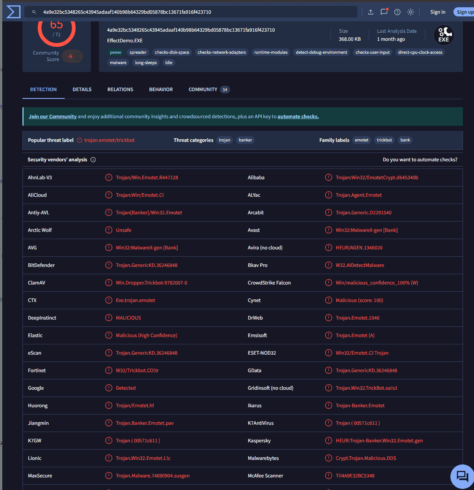
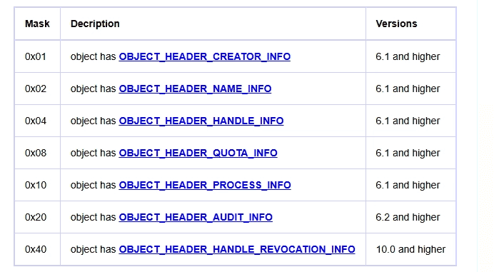
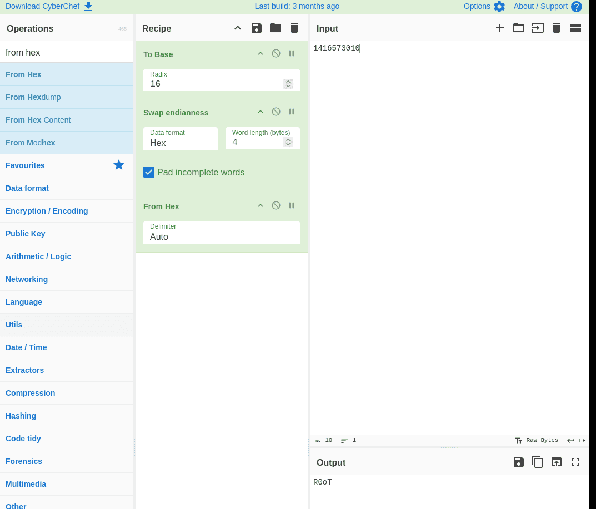
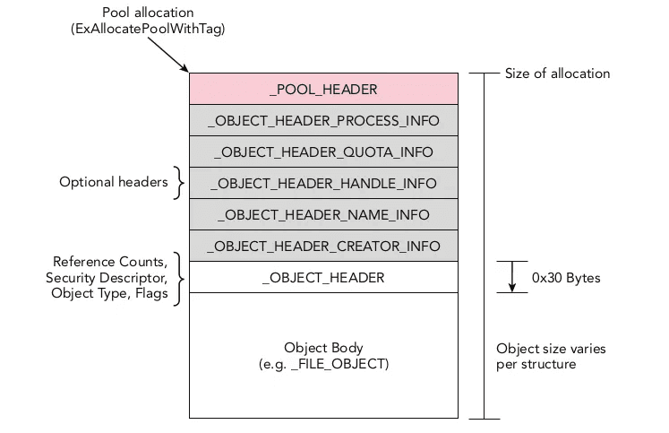

---


[https://cyberdefenders.org/blueteam-ctf-challenges/deepdive/](https://cyberdefenders.org/blueteam-ctf-challenges/deepdive/)


[https://www.geoffchappell.com/studies/windows/km/ntoskrnl/inc/ntos/ob/object_header/infomask.htm](https://www.geoffchappell.com/studies/windows/km/ntoskrnl/inc/ntos/ob/object_header/infomask.htm)


vol2 -f banking-malware.vmem --profile=Win7SP1x64 -g 0xf80002bef120 pstree -v &gt; pstreev.txt


### Q1 What profile should you use for this memory sample? {#3527b0eb61a480ce9942c8f35f6dccef}


Win7SP1x64


### Q2 What is the KDBG virtual address of the memory sample? {#3527b0eb61a4809c9070d9cca7ce0d0c}


0xf80002bef120


### Q3 There is a malicious process running, but it's hidden. What's its name? {#3527b0eb61a480db8d25df12b4c59466}


dùng psxview


vds_ps.exe 


0x000000007d336950 vds_ps.exe             2448 False  False  False    True   True  True    True 


Tiến trình `vds_ps.exe` của bạn đang có 3 cột `False False False`. Điều này có nghĩa là mã độc đã sử dụng kỹ thuật tàng hình **DKOM (Direct Kernel Object Manipulation)** để tự cắt đứt liên kết (unlink) của nó khỏi danh sách quản lý tiến trình của Windows nhằm qua mặt Task Manager và các phần mềm diệt virus cơ bản.


### Q4 What is the physical offset of the malicious process? {#3527b0eb61a4802c83edc857809b45c8}


### Q5 What is the full path (including executable name) of the hidden executable? {#3527b0eb61a4803d9d46e5ee181a230d}


0x000000007d0d57e0     16      0 R--r-d \Device\HarddiskVolume1\Users\john\AppData\Local\api-ms-win-service-management-l2-1-0\vds_ps.exe


### Q6 Which malware is this? {#3527b0eb61a4805f84cbeb66ba6f904c}





Emotet


### Q7 The malicious process had two PEs injected into its memory. What's the size in bytes of the Vad that contains the largest injected PE? Answer in hex, like: 0xABC {#3527b0eb61a480b99b33d995dd343227}


Quay lại câu chuyện về VAD, mỗi node VAD (trong kernel) sẽ lưu trữ thông tin về: start, end, quyền truy cập


Ta dùng malfind và offset của nó vì không tìm theo pid được, đã tách khỏi psActiveProcessHead rồi


```c++
0x02a10000  4d 5a 90 00 03 00 00 00 04 00 00 00 ff ff 00 00   MZ..............
0x02a10010  b8 00 00 00 00 00 00 00 40 00 00 00 00 00 00 00   ........@.......
0x02a10020  00 00 00 00 00 00 00 00 00 00 00 00 00 00 00 00   ................
0x02a10030  00 00 00 00 00 00 00 00 00 00 00 00 b0 00 00 00   ................


Process: vds_ps.exe Pid: 2448 Address: 0x2a80000
Vad Tag: VadS Protection: PAGE_EXECUTE_READWRITE
Flags: CommitCharge: 55, MemCommit: 1, PrivateMemory: 1, Protection: 6

0x02a80000  4d 5a 90 00 03 00 00 00 04 00 00 00 ff ff 00 00   MZ..............
0x02a80010  b8 00 00 00 00 00 00 00 40 00 00 00 00 00 00 00   ........@.......
0x02a80020  00 00 00 00 00 00 00 00 00 00 00 00 00 00 00 00   ................
0x02a80030  00 00 00 00 00 00 00 00 00 00 00 00 c8 00 00 00   ................


```


Ta biết đó là địa chỉ 2 vùng 0x02a80000, là 2 vùng bị inject 0x02a10000. Dùng VADinfo


`VAD node @ 0xfffffa800589cc00 Start 0x0000000002a10000 End 0x0000000002a2cfff Tag VadS
Flags: CommitCharge: 29, MemCommit: 1, PrivateMemory: 1, Protection: 6
Protection: PAGE_EXECUTE_READWRITE
Vad Type: VadNone`


	0x1CFFF


`VAD node @ 0xfffffa8002f1b640 Start 0x0000000002a80000 End 0x0000000002ab6fff Tag VadS
Flags: CommitCharge: 55, MemCommit: 1, PrivateMemory: 1, Protection: 6
Protection: PAGE_EXECUTE_READWRITE
Vad Type: VadNone`


	**0x36FFF**


### Q8 This process was unlinked from the ActiveProcessLinks list. Follow its forward link. Which process does it lead to? Answer with its name and extension {#3527b0eb61a480898b13e7a57bdfb065}


Trong Windows, mỗi tiến trình đều có một thẻ căn cước tên là cấu trúc `_EPROCESS`. Bên trong cấu trúc này có một trường tên là `ActiveProcessLinks`. Nó chứa 2 mũi tên (con trỏ):

- **Flink** (Forward Link): Trỏ tới tiến trình sinh ra ngay sau nó.
- **Blink** (Backward Link): Trỏ về tiến trình sinh ra ngay trước nó.
Tất cả tạo thành một vòng tròn nắm tay nhau liên tục gọi là danh sách liên kết đôi (Doubly-linked list).
- Hacker sửa Flink của người đứng trước và Blink của người đứng sau để họ nắm tay chéo qua mặt nó. Thế là nó biến mất khỏi hàng lối!

```c++
>>> cc(offset=0x000000007d336950, physical=True)
Current context: vds_ps.exe @ 0xfffffa8004536950, pid=2448, ppid=2260 DTB=0x59728000
>>> flink = proc().ActiveProcessLinks.Flink
>>> fproc = flink - 0x188
>>> cc(fproc)

```


Vấn đề là flink không trỏ vào thẳng đầu tiến trình mà trỏ vào cánh tay của nó tức là ActiveProcessLinks của nó. Mà trong windows 7 64 bit thì địa chỉ base trừ đi phải là 0x188 bytes


> next_ep = obj.Object("_EPROCESS", offset=flink_vaddr - 0x188, vm=addrspace())  
> print next_ep.ImageFileName


SearchIndexer.exe


```c++
import  volatility . plugins . common  as  common
import  volatility . plugins . registry . registryapi  as  registryapi
import  volatility . utils  as  utils
import  volatility . win32  as  win32
 
class  GetProcByAcLin(common.AbstractWindowsCommand):
         """ Get ActiveP list T """
         def  __init__( self ,  config ,  *args ,  **kwargs ):
                 common.AbstractWindowsCommand.__init__( self ,  config ,  *args ,  **kwargs )
                 self._config.add_option ( 'Search' , short_option = 't' , default = None , help = 'Ac Point Search For', action = 'store' )
         def  calculate(self):
                 addr_space = utils.load_as(self._config)
                 tasks = win32.tasks.pslist(addr_space)
                 T  =  self._config.Search
                 return T , tasks
         def  render_text( self ,  outfd ,  data ):
                 T , tas = data
                 try :
                         ishex  = T.find("0x")
                         ishex2 = T.find("0X")
                         if(ishex>-1 or ishex2>-1 ):
                                 T = int(T, 16)
                         else :
                                 T = int(T)
                         for i in tas :
                                 AcLin = i.ActiveProcessLinks
                                 if T == AcLin :
                                         print (i.ImageFileName)
                 except :
                         print("ActiveProcessLinks is a memory location : use number" )

`vol.py --plugins="plug/" -f banking-malware.vmem --profile Win7SP1x64_24000 getprocbyaclin -t <Fprocess_ActiveLink_value>`
```


### Q9 What is the pooltag of the malicious process in ascii? (HINT: use volshell) {#3527b0eb61a4804d95b4c137227cdf6a}


Pool tag là chuỗi 4 ký tự ASCII được sử dụng để đánh dấu các vùng nhớ trong bộ nhớ nhân (kernel pool)


&gt;&gt;&gt; pool_header = obj.Object("_POOL_HEADER", offset=0x7d336950 - 0x60, vm=addrspace().base)


&gt;&gt;&gt; print pool_header.PoolTag


> import struct  
> print struct.pack("&lt;I", pool_header.PoolTag)


R0ot


Hiện tại ta đang ở vị trí `0x7d336950` là vị trí của _EPROCESS tại phần OBJECT BODY, phải lùi lại 0x30 bytes để tới phần OBJECT HEADER


```c++
>>> dt("_OBJECT_HEADER", 0x7d336950 - 0x30, space=addrspace().base)
[_OBJECT_HEADER _OBJECT_HEADER] @ 0x7D336920
0x0   : PointerCount                   149
0x8   : HandleCount                    5
0x8   : NextToFree                     5
0x10  : Lock                           2100521264
0x18  : TypeIndex                      7
0x19  : TraceFlags                     0
0x1a  : InfoMask                       8
0x1b  : Flags                          0
0x20  : ObjectCreateInfo               18446738026461179264
0x20  : QuotaBlockCharged              18446738026461179264
0x28  : SecurityDescriptor             18446735964826813854
0x30  : Body                           2100521296

```


Mà phần object header lại là phần chứa info mask





Ta thấy cờ infomask giá trị là 8 → _OBJECT_HEADER_QUOTA_INFO


Chỉ gắn  Quota Info. Các toa phụ khác (như Name Info, Handle Info...) không tồn tại.


Ta sẽ trừ đi 0x30 - 0x20 - 0x10

- Lùi `0x30` byte để vượt qua `_OBJECT_HEADER`.
- Lùi tiếp `0x20` byte để vượt qua toa phụ `_OBJECT_HEADER_QUOTA_INFO` (toa này dài 0x20 byte trên bản 64-bit, như hình chụp trang web Geoff Chappell mà bạn thấy).
- Lùi tiếp `0x10` byte để trỏ đúng vào vạch xuất phát của chính đầu tàu `_POOL_HEADER` (đầu tàu này dài 0x10 byte).

```c++
>>> dt("_POOL_HEADER",0x7d336950 -0x60, space=addrspace().base)
[_POOL_HEADER _POOL_HEADER] @ 0x7D3368F0
0x0   : BlockSize                      86
0x0   : PoolIndex                      0
0x0   : PoolType                       2
0x0   : PreviousSize                   10
0x0   : Ulong1                         39190538
0x4   : PoolTag                        1416573010
0x8   : AllocatorBackTraceIndex        0
0x8   : ProcessBilled                  0
0xa   : PoolTagHash                    0

```


Ta thấy pooltag `1416573010` dạng thập phân chuyển sang cơ số 16 do windows lưu trữ dạng LE và chuyển sang hex, rồi chuyển về ASCII





### Q10 What is the physical address of the hidden executable's pooltag? (HINT: use volshell) {#3527b0eb61a48014a3b1e04a2311a716}


```c++
>>> dt("_POOL_HEADER",0x7d336950 -0x60, space=addrspace().base)
[_POOL_HEADER _POOL_HEADER] @ 0x7D3368F0
0x0   : BlockSize                      86
0x0   : PoolIndex                      0
0x0   : PoolType                       2
0x0   : PreviousSize                   10
0x0   : Ulong1                         39190538
0x4   : PoolTag                        1416573010
0x8   : AllocatorBackTraceIndex        0
0x8   : ProcessBilled                  0
0xa   : PoolTagHash                    0

```


Ở trên ta đã có địa chỉ của [_POOL_HEADER _POOL_HEADER] @ 0x7D3368F0. Ta thấy pool tag cách pool_header 4 bytes nên chỉ cần + 4 vào là xong


0x7D3368F4


# Tổng kết {#3527b0eb61a480fe86c9fae05d6c2dc8}


## Cấu trúc một object {#3527b0eb61a480b984eee7980ff0e91a}





### Pool allocation và ___POOL_HEADER {#3527b0eb61a480d49a70fe98fcf2f1c0}

- Pool allocation: mỗi khi windows cần tạo một object mới, nó sẽ gọi hàm ExAllocatePoolWithTag để xin một vùng nhớ trống trong RAM (thường là non-paged pool)
- _POOL_HEADER: là khối dữ liệu_ đầu tiên của vùng nhớ xin được. Chứa thông tin quản lý bộ nhớ của chính hệ điều hành
	- Các công cụ Forensics hay dùng Pool Tagging để tìm các đối tượng bị ẩn (kỹ thuật Pool Scanning).

### Optional headers {#3527b0eb61a480c7b442db6c25321625}

- Là phần liên quan tới infomask. Và optional vì không phải object nào cũng cần

Các Optional Headers được hiển thị trong hình bao gồm:

- **`_OBJECT_HEADER_PROCESS_INFO`****:** Chứa thông tin liên quan đến tiến trình.
- **`_OBJECT_HEADER_QUOTA_INFO`****:** Thông tin về hạn mức sử dụng tài nguyên.
- **`_OBJECT_HEADER_HANDLE_INFO`****:** Thống kê số lượng handle (kết nối) đang mở tới Object này.
- **`_OBJECT_HEADER_NAME_INFO`****:** Chứa tên của Object (Rất quan trọng để định danh mã độc).
- **`_OBJECT_HEADER_CREATOR_INFO`****:** Chứa thông tin về ai/tiến trình nào đã tạo ra Object này.

### 3. `OBJECT_HEADER` (Phần bắt buộc - Nơi chứa `InfoMask`) {#3527b0eb61a480fda6e8d95b022a6824}

- Là trung tâm điều khiển object, kích thước cố định là 0x30 bytes (64 bit)
- Chứa các thông tin như:
	- Reference count: Số lượng tiến trình đang sử dụng object này. Khi số này về 0 thì windows sẽ dọn dẹp object khỏi RAM
	- Security descriptor: Ai có quyền truy cập
	- Object type: file, process, mutex,…
	- Flags: các cờ trạng thái
	- **Và quan trọng nhất:** Trong `_OBJECT_HEADER` này có chứa **`InfoMask`** (1 byte). Như tôi đã giải thích trước đó, `InfoMask` giúp hệ thống biết được những Optional Header nào (phần màu xám ở trên) đang thực sự tồn tại trong bộ nhớ và ở vị trí này

:::tip

### Về infomask

- Trong hệ điều hành windows (process, thread, mutex, event, file,..) tất cả đều được coi là object bởi thành phần object manager

- Mỗi object nằm trogn RAM sẽ có object body và một phần là object header. Ngoài phần header bắt buộc thì windows cho phép gắn thêm các thông tin optional header như:

Với trước windows vista:

- Các optional header này được sắp xếp khá vững chắc, dẫn đến hao phí tài nguyên của vùng non-page pool.

Từ vista

- Microsoft quyết định tối ưu hóa bộ nhớ. Họ thay đổi cấu trúc `OBJECT_HEADER` và giới thiệu một trường mới dài đúng 1 byte (8 bit) mang tên **`InfoMask`**.

Bài viết của Geoff Chappell phân tích cốt lõi cách 1 byte này hoạt động. `InfoMask` là một **Bitmask** (mặt nạ bit). Trong đó, mỗi bit sẽ làm nhiệm vụ "giơ tay điểm danh" xem một Optional Header cụ thể có tồn tại trong RAM hay không.

Theo nghiên cứu của Geoff Chappell qua các đời Windows, các bit này thường được quy định như sau:


- **Bit 0 (****`0x01`****):** `OBJECT_HEADER_CREATOR_INFO` (Thông tin tiến trình gốc).

- **Bit 1 (****`0x02`****):** `OBJECT_HEADER_NAME_INFO` (Chứa tên của đối tượng - Cực kỳ quan trọng).

- **Bit 2 (****`0x04`****):** `OBJECT_HEADER_HANDLE_INFO` (Thông tin Handle).

- **Bit 3 (****`0x08`****):** `OBJECT_HEADER_QUOTA_INFO` (Hạn mức bộ nhớ).

- **Bit 4 (****`0x10`****):** `OBJECT_HEADER_PROCESS_INFO` (Thêm vào từ Windows 8).

- Các bit cao hơn được bổ sung dần trong Windows 8.1 và Windows 10 (như Audit Info, Extended Info...).

### "Cú lừa" mang tên `ObpInfoMaskToOffset`

Đây là phần "đau não" nhất trong bài viết của Geoff Chappell và cũng là điểm thể hiện sự xuất sắc của ông khi dịch ngược (reverse-engineering) nhân Windows.

Vì các Optional Header không còn nằm ở vị trí cố định nữa (chúng nằm sát vào nhau để tiết kiệm RAM), làm sao nhân Windows biết chính xác phải lùi lại bao nhiêu byte từ `OBJECT_HEADER` để đọc được `NAME_INFO`?

- **Cách Windows làm:** Nó dùng giá trị của `InfoMask` làm chỉ mục (Index) để tra vào một mảng nội bộ không được công bố của Windows có tên là **`ObpInfoMaskToOffset`** (đây là mảng lưu trữ khoảng cách offset).

- **Ví dụ:** Nếu `InfoMask` là `0x03` (tức là có cả Creator Info và Name Info), Windows sẽ tra mảng ở vị trí số 3 để lấy ra một con số (ví dụ lùi lại 32 byte). Từ đó nó nhảy chính xác đến vùng chứa Tên.

### Giá trị của bài viết đối với người làm Forensics

Geoff Chappell nổi tiếng vì ông bỏ thời gian theo dõi sự thay đổi của từng byte, từng bit qua **mọi phiên bản Windows** (từ Vista, Win 7, Win 8 đến các bản build của Win 10).

Đối với những người làm như bạn (giải lab CyberDefenders, viết công cụ phân tích mã độc), bài viết này là **kim chỉ nam**:

1. **Chống Rootkit:** Mã độc (đặc biệt là Rootkit chạy ở tầng Kernel) thường tìm cách xóa tên của nó khỏi `NAME_INFO` hoặc sửa đổi `OBJECT_HEADER` để tàng hình khỏi Task Manager. Nếu không hiểu `InfoMask`, bạn không thể dùng kỹ thuật quét chữ ký (Pool Scanning) để bới móc Rootkit ra từ RAM.

2. **Sự lệ thuộc vào phiên bản HĐH:** Bài viết chỉ ra rằng kích thước của các Header này và cấu trúc mảng `ObpInfoMaskToOffset` thay đổi liên tục qua các bản cập nhật Windows. Đó là lý do tại sao khi dùng Volatility, bắt buộc bạn phải truyền đúng **`-profile=Win7SP1x64`** (như bạn đã làm ở các câu lệnh trước). Nếu bạn truyền sai profile, Volatility sẽ áp dụng sai cấu trúc `InfoMask`, lùi sai số byte và trả về toàn dữ liệu rác!

:::


:::tip

### "Nếu có tất cả các trường thì InfoMask là bao nhiêu và làm sao để trừ?"

Nếu một tiến trình "giàu có" và nó mua đủ cả 7 toa phụ trợ, hệ điều hành sẽ làm một phép cộng nhị phân tất cả các mã số trên lại:
`InfoMask = 0x01 + 0x02 + 0x04 + 0x08 + 0x10 + 0x20 + 0x40 = 0x7F`

Vậy nếu `InfoMask` hiện là `0x7F`, bạn phải lùi bao nhiêu bước để lên đến đầu tàu `_POOL_HEADER`?
Quy tắc trừ rất đơn giản: **Tính tổng kích thước (số byte) của tất cả các toa đang có mặt.**

1. Lùi `0x30` byte để vượt qua chính cái `_OBJECT_HEADER`.

2. Cộng dồn kích thước thực tế của 7 toa kia (VD: `0x20` + `0x20` + `0x20` + `0x20` + `0x10` + `0x20` + `0x20` = `0xD0` byte). Lùi tiếp đoạn này.

3. Lùi tiếp `0x10` byte nữa để vào cửa `_POOL_HEADER`.

:::


### Object body {#3527b0eb61a480c3814bf95b050d2af0}

- Phần dưới cùng, lớn nhất là "Thân" của đối tượng.
- Kích thước của nó thay đổi tùy thuộc vào loại cấu trúc (như ghi chú bên phải: "Object size varies per structure").
- Ví dụ: Nếu đây là một đối tượng File, phần body sẽ là cấu trúc `_FILE_OBJECT` (chứa đường dẫn file, quyền đọc/ghi). Nếu là đối tượng Process, phần body sẽ là cấu trúc `_EPROCESS`.

## Nói thêm chút về base {#3527b0eb61a480fbbc27fe1d33aaabd9}


### 1. Khái niệm "Base" (Cơ số) là gì? {#3527b0eb61a48062a0dade0ec349d870}


"Base" trong toán học và tin học có nghĩa là **Cơ số**. Nó chỉ ra số lượng các ký tự hoặc chữ số được sử dụng để đếm hoặc biểu diễn thông tin trong một hệ thống.

- **Base2 (Hệ nhị phân):** Dùng 2 ký tự là `0` và `1`. Đây là ngôn ngữ gốc của máy tính.
- **Base10 (Hệ thập phân):** Dùng 10 ký tự từ `0` đến `9`. Đây là cách con người chúng ta đếm hàng ngày.
- **Base16 (Hệ thập lục phân - Hexadecimal):** Dùng 16 ký tự từ `0-9` và `A-F`.

---


### 2. Base64 là gì? (Phổ biến nhất) {#3527b0eb61a48090b7bcd204c3f7a2fe}


Base64 là hệ thống sử dụng **64 ký tự** để biểu diễn dữ liệu.

- **Bộ ký tự:** Gồm 26 chữ cái in hoa (`A-Z`), 26 chữ cái in thường (`a-z`), 10 chữ số (`0-9`), và 2 ký tự đặc biệt (thường là `+` và `/`). Dấu `=` thường được dùng ở cuối chuỗi để làm ký tự đệm (Padding).
- **Cách hoạt động:** Nó lấy 3 byte dữ liệu (mỗi byte 8 bit, tổng cộng 24 bit) và chia nhỏ chúng thành 4 phần (mỗi phần 6 bit). Sau đó, nó dịch 4 phần này thành 4 ký tự trong bảng mã Base64.
- **Ví dụ:** Chữ "M" trong mã ASCII (01001101) sau khi qua Base64 có thể biến thành `TQ==`.
- **Đặc điểm nhận dạng:** Các chuỗi Base64 thường có vẻ ngoài lộn xộn, phân biệt chữ hoa chữ thường và **rất hay kết thúc bằng một hoặc hai dấu** **`=`**.

---


### 3. Base32 là gì? {#3527b0eb61a480569428d267153b45a6}


Tương tự như Base64, nhưng Base32 chỉ sử dụng **32 ký tự**.

- **Bộ ký tự:** Gồm 26 chữ cái in hoa (`A-Z`) và 6 chữ số (`2-7`). Nó **không** phân biệt chữ hoa chữ thường và cố tình loại bỏ các số như `0`, `1` hoặc `8`, `9` để tránh con người đọc nhầm với chữ `O`, `I`, `B`...
- **Cách hoạt động:** Nó lấy 5 byte dữ liệu (40 bit) chia thành 8 phần (mỗi phần 5 bit) và dịch sang 8 ký tự.
- **Đặc điểm:** Chuỗi kết quả sẽ dài hơn so với Base64 (vì dùng ít ký tự biểu diễn hơn), và cũng thường có dấu `=` ở cuối.

---


### 4. Tại sao chúng ta lại cần Base32 và Base64? {#3527b0eb61a480849cf6e32bf3998db6}


Đây là câu hỏi quan trọng nhất! Tại sao máy tính không truyền luôn file nhị phân (0101) hoặc mã Hex cho xong mà phải bày trò đổi ra Base64?


**Lý do chính: Truyền tải an toàn qua các giao thức cũ (như Email)**

- Hãy nhớ lại bài Lab TeamSpy bạn vừa làm, file mã độc được gửi qua Email (Outlook). Giao thức gửi Email (SMTP) ban đầu được thiết kế **chỉ để gửi văn bản thuần (Text) chuẩn ASCII** (tiếng Anh không dấu).
- Nếu bạn đính kèm một file hình ảnh, file âm thanh, hay một con mã độc `.exe` (đều là dữ liệu nhị phân) vào email, hệ thống mail sẽ bị "bối rối", đọc sai ký tự nhị phân và làm hỏng toàn bộ file.
- **Giải pháp:** Người ta dùng Base64 để "gói" cái file nhị phân đó lại thành một chuỗi ký tự Text an toàn (chỉ toàn A-Z, 0-9). Giao thức Email nhìn thấy chuỗi Text này thì rất vui vẻ gửi đi. Khi sang đến máy người nhận, chương trình mail sẽ "mở gói" (Decode Base64) để trả lại file nhị phân ban đầu.
