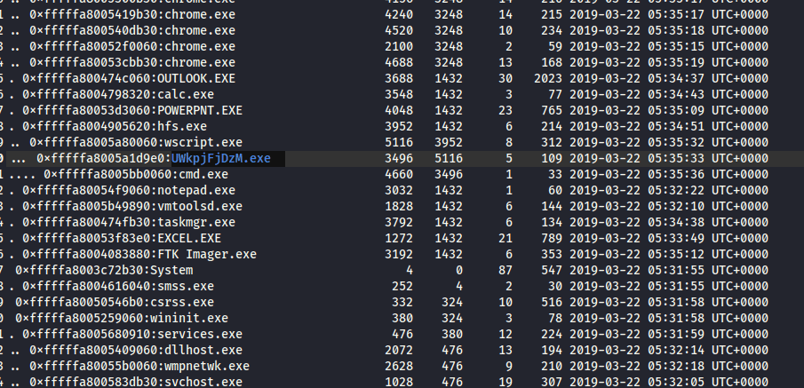
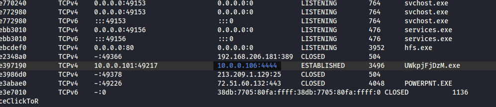
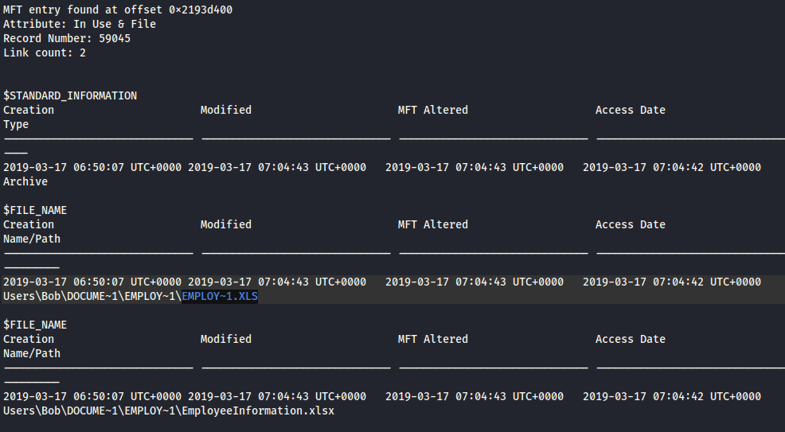
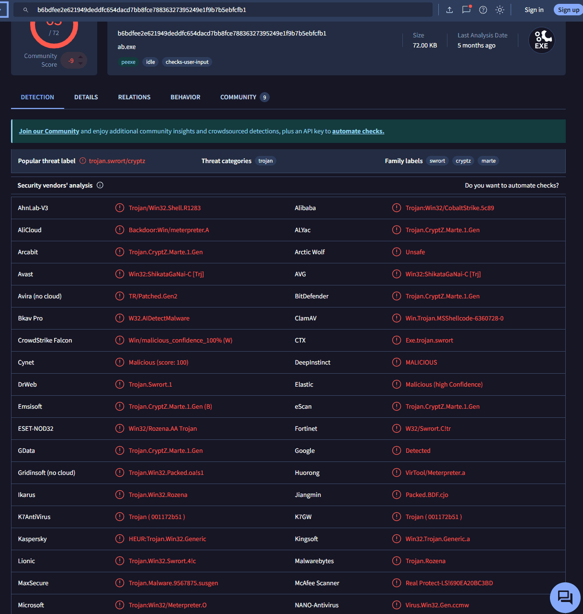

---


[https://cyberdefenders.org/blueteam-ctf-challenges/dumpme/](https://cyberdefenders.org/blueteam-ctf-challenges/dumpme/)


### Q1 What is the SHA1 hash of Triage-Memory.mem (memory dump)? {#3507b0eb61a48021817ad0325d4a2e76}


c95e8cc8c946f95a109ea8e47a6800de10a27abd


### Q2 What volatility profile is the most appropriate for this machine? (ex: Win10x86_14393) {#3507b0eb61a480a48060e8be14ac37fe}


### Q3 What was the process ID of notepad.exe? {#3507b0eb61a4809e9817e3cc15a7480a}


### Q4 Name the child process of wscript.exe. {#3507b0eb61a480d79d36c4900b920df2}





### Q5 What was the IP address of the machine at the time the RAM dump was created? {#3507b0eb61a48054b393e4977ff5b8d4}


Ta có thể dùng netscan hoặc dùng đường dẫn SYSTEM\ControlSet001\Services\Tcpip\Parameters\Interfaces rồi tìm cái interfaces có chứa thông tin


```c++
Values:
REG_DWORD     UseZeroBroadcast : (S) 0
REG_DWORD     EnableDeadGWDetect : (S) 1
REG_DWORD     EnableDHCP      : (S) 1
REG_SZ        NameServer      : (S) 
REG_SZ        Domain          : (S) 
REG_DWORD     RegistrationEnabled : (S) 1
REG_DWORD     RegisterAdapterName : (S) 0
REG_SZ        DhcpServer      : (S) 10.0.0.2
REG_DWORD     Lease           : (S) 7197
REG_DWORD     LeaseObtainedTime : (S) 1553232726
REG_DWORD     T1              : (S) 1553236324
REG_DWORD     T2              : (S) 1553239023
REG_DWORD     LeaseTerminatesTime : (S) 1553239923
REG_DWORD     AddressType     : (S) 0
REG_DWORD     IsServerNapAware : (S) 0
REG_DWORD     DhcpConnForceBroadcastFlag : (S) 0
REG_MULTI_SZ  IPAddress       : (S) ['', '']
REG_MULTI_SZ  SubnetMask      : (S) ['', '']
REG_MULTI_SZ  DefaultGateway  : (S) ['', '']
REG_MULTI_SZ  DefaultGatewayMetric : (S) ['', '']
REG_SZ        DhcpIPAddress   : (S) 10.0.0.101
REG_SZ        DhcpSubnetMask  : (S) 255.255.255.0
REG_BINARY    DhcpInterfaceOptions : (S) 
```


### Q6 Based on the answer regarding the infected PID, can you determine the IP of the attacker? {#3507b0eb61a4807e85eaf909f26816b1}





### Q7 How many processes are associated with VCRUNTIME140.dll? {#3507b0eb61a48090bf63e66b664faef2}


Dùng dlllist và grep cái dll ở trên ta ra kết quả


### Q8 After dumping the infected process, what is its md5 hash? {#3507b0eb61a480688c08d0e9f6d49ee7}


phải dùng procdump


```c++
└─$ vol2 -f Triage-Memory.mem --profile=Win7SP1x64 -g 0xf800029f80a0 procdump -p 3496 -D .
Volatility Foundation Volatility Framework 2.6
Process(V)         ImageBase          Name                 Result
------------------ ------------------ -------------------- ------
0xfffffa8005a1d9e0 0x0000000000400000 UWkpjFjDzM.exe       OK: executable.3496.exe
                                                                                                                                  
┌──(cuong_nguyen㉿Kali)-[~/Desktop/cyberdefenders.org/temp_extract_dir]
└─$ md5sum executable.3496.exe 
690ea20bc3bdfb328e23005d9a80c290  executable.3496.exe

```


### Q9 What is the LM hash of Bob's account? {#3507b0eb61a4802b8e83e5f189cd55bb}


```c++
vol2 -f Triage-Memory.mem --profile=Win7SP1x64 -g 0xf800029f80a0 hashdump           
Volatility Foundation Volatility Framework 2.6
Administrator:500:aad3b435b51404eeaad3b435b51404ee:31d6cfe0d16ae931b73c59d7e0c089c0:::
Guest:501:aad3b435b51404eeaad3b435b51404ee:31d6cfe0d16ae931b73c59d7e0c089c0:::
Bob:1000:aad3b435b51404eeaad3b435b51404ee:31d6cfe0d16ae931b73c59d7e0c089c0:::
```


### Q10 What memory protection constants does the VAD node at 0xfffffa800577ba10 have? {#3507b0eb61a480c898bec4ece6e64e10}


vaddump         Dumps out the vad sections to a file
vadinfo         Dump the VAD info
vadtree         Walk the VAD tree and display in tree format
vadwalk         Walk the VAD tree


└─$ vol2 -f Triage-Memory.mem --profile=Win7SP1x64 vadinfo | grep -A 5 -B 5 "0xfffffa800577ba10"
Volatility Foundation Volatility Framework 2.6
NumberOfMappedViews:                2 NumberOfUserReferences:          3
Control Flags: Commit: 1
First prototype PTE: fffff8a001021f78 Last contiguous PTE: fffff8a001021ff0
Flags2:


VAD node @ 0xfffffa800577ba10 Start 0x0000000000030000 End 0x0000000000033fff Tag Vad
Flags: NoChange: 1, Protection: 1
Protection: `PAGE_READONLY`
Vad Type: VadNone
ControlArea @fffffa8005687a50 Segment fffff8a000c4f870


### Q11 What memory protection did the VAD starting at 0x00000000033c0000 and ending at 0x00000000033dffff have? {#3507b0eb61a480128d26effbfd1a57d7}


VAD node @ 0xfffffa80052652b0 Start 0x00000000033c0000 End 0x00000000033dffff Tag VadS
Flags: CommitCharge: 32, PrivateMemory: 1, Protection: 24
Protection: `PAGE_NOACCESS`
Vad Type: VadNone


### Q12 There was a VBS script that ran on the machine. What is the name of the script? (submit without file extension) {#3507b0eb61a480d4ab1cd05ced961441}


vhjReUDEuumrX.vbs


Dùng string tìm trong wscript.exe sau khi memdump nó ra


┌──(cuong_nguyen㉿Kali)-[~/Desktop/cyberdefenders.org/temp_extract_dir]
└─$ strings 5116.dmp| grep "vbs"


"C:\Windows\System32\wscript.exe" //B //NOLOGO %TEMP%\vhjReUDEuumrX.vbs


### Q13 An application was run at 2019-03-07 23:06:58 UTC. What is the name of the program? (Include extension) {#3507b0eb61a48050af8ff076fea5c9d4}


Tôi đã thử tìm prefetch nhưng không có: vì windows 7 nếu là ssd thì sẽ tự động vô hiệu hóa prefetch và superfetch


──(cuong_nguyen㉿Kali)-[~/Desktop/cyberdefenders.org/temp_extract_dir]
└─$ vol2 -f Triage-Memory.mem --profile=Win7SP1x64 dumpfiles --regex .pf$ --ignore-case -D prefetch


┌──(cuong_nguyen㉿Kali)-[~/Desktop/cyberdefenders.org/temp_extract_dir]
└─$ vol2 -f Triage-Memory.mem --profile=Win7SP1x64 amcache | grep -i "2019-03-07 23:06:58"


┌──(cuong_nguyen㉿Kali)-[~/Desktop/cyberdefenders.org/temp_extract_dir]
└─$ vol2 -f Triage-Memory.mem --profile=Win7SP1x64 shimcache | grep -i "2019-03-07 23:06:58"
Volatility Foundation Volatility Framework 2.6
`2019-03-07 23:06:58 UTC+0000   \??\C:\Program Files (x86)\Microsoft\Skype for Desktop\Skype.exe`


windows 7 chưa có amcache (chỉ có win8 trở lên)


### Q14 What was written in notepad.exe at the time when the memory dump was captured? {#3507b0eb61a4807c8284f0b30e60c18a}


└─$ strings -e l 3032.dmp | grep "flag"
flag&lt;REDBULL_IS_LIFE&gt;


### Q15 What is the short name of the file at file record 59045? {#3507b0eb61a480f2834dc5a3338583e4}


EMPLOY~1.XLS





### Q16 This box was exploited and is running meterpreter. What was the infected PID? {#3507b0eb61a48066bd79fd6a580e681d}


3496 - tìm hash để biết là metasploit


Meterpreter is an advanced, dynamically extensible payload within the [**Metasploit Framework**](https://www.metasploit.com/) used in cybersecurity for post-exploitation testing. It acts as a sophisticated, interactive command shell that allows ethical hackers to take control of a compromised system, navigate it, and gather data while remaining largely undetected





# Tips and tricks {#3507b0eb61a4805e8b6afe6035e77dea}

- Dùng **`strings <file.dmp>`**: Để tìm kiếm các file cấu hình, giao thức mạng mạng, hoặc mã nguồn do các phần mềm bên thứ 3 hoặc mã độc tự viết (thường dùng ASCII).
- Dùng **`strings -el <file.dmp>`**: Để "bắt quả tang" những gì hacker gõ trên giao diện dòng lệnh của Windows, tên file hệ thống, hoặc các tham số truyền vào API của Windows.

## Các plugin liên quan tới VAD {#3507b0eb61a480e3b1dcd250820d3915}

- vadinfo: in ra từng vùng nhớ của một process
	- Địa chỉ bắt đầu (Start), địa chỉ kết thúc (End), Quyền bảo vệ (Protection: `PAGE_READWRITE`, `PAGE_EXECUTE_READWRITE`...), cờ (Flags), và tên file nếu vùng nhớ đó được ánh xạ từ một file trên ổ cứng
	- Khi vùng nhớ có quyền PAGE_EXECUTE_READWRITE hoặc PAGE_EXECUTE_WRITECOPY mà không có file nào đính kfy thì nghi vấn

	```c++
	VAD node @ 0xfffffa8005c18dc0 Start 0x0000000000400000 End 0x0000000000415fff Tag Vad 
	Flags: CommitCharge: 9, Protection: 7, VadType: 2
	Protection: PAGE_EXECUTE_WRITECOPY
	Vad Type: VadImageMap
	ControlArea @fffffa8005b55ba0 Segment fffff8a003e11070
	NumberOfSectionReferences:          1 NumberOfPfnReferences:          15
	NumberOfMappedViews:                1 NumberOfUserReferences:          2
	Control Flags: Accessed: 1, File: 1, Image: 1
	FileObject @fffffa8005a55f20, Name: \Device\HarddiskVolume2\Users\Bob\AppData\Local\Temp\rad93398.tmp\UWkpjFjDzM.exe
	First prototype PTE: fffff8a003e110b8 Last contiguous PTE: fffffffffffffffc
	Flags2: Inherit: 1
	```

	- `VAD node @ 0xfffffa8005c18dc0`
		- Đây là địa chỉ ở kernel của Windows, nơi lưu trữ cấu trúc dữ liệu của bản ghi VAD này. Không liên quan đến bộ nhớ của chính tiến trình.
	- `Start 0x0000000000400000 End 0x0000000000415fff`
		- Không gian địa chỉ ảo, và start `0x0000000000400000`  là base đặc trưng của exe
	- `Tag Vad`
		- Đây là Pool Tag của Windows, một dạng "nhãn dán" hệ thống để phân loại bộ nhớ trong Kernel.
	- `Flags: CommitCharge: 9, Protection: 7, VadType: 2`
		- **CommitCharge:** Hệ thống đã thực sự cấp phát bao nhiêu trang RAM (Pages) vật lý cho vùng ảo này.
		- **VadType: 2:** Mã số ám chỉ đây là một file được ánh xạ (Mapped File), khớp với dòng `VadImageMap` bên dưới.
	- `Protection: PAGE_EXECUTE_WRITECOPY` : quyền của vùng nhớ này
		- `PAGE_EXECUTE_WRITECOPY` (WCX) là một cơ chế cực kỳ thông minh của Windows. Nó cho phép mã lệnh được thực thi (Execute). Tuy nhiên, nếu mã độc (hoặc debugger) cố tình _ghi_ (Write) sửa đổi đoạn code này, Windows sẽ không cho phép sửa trực tiếp vào file gốc trên đĩa cứng. Thay vào đó, nó âm thầm copy vùng nhớ đó ra một chỗ khác trên RAM, sửa trên bản copy đó, và cho tiến trình dùng bản copy. Quyền này thường được dùng hợp pháp khi hệ thống nạp các file `.exe` hoặc `.dll` thông thường.
	- `Vad Type: VadImageMap`
		- Xác nhận rằng vùng nhớ này được sinh ra bằng cách "bê" nội dung của một file thực thi (Image/PE file) trên ổ cứng và trải ra (Map) trên RAM.
	- `ControlArea @...` và `Segment...`
		- Các con trỏ trỏ tới các cấu trúc nội bộ của Windows (Object Manager) dùng để quản lý việc ánh xạ file và chia sẻ bộ nhớ. Blue Team thường hiếm khi phải đào sâu vào các tham số này trừ khi phân tích cấu trúc Kernel chuyên sâu.
	- `NumberOfSectionReferences`, `NumberOfPfnReferences`, `NumberOfMappedViews`, `NumberOfUserReferences`
		- Đây là các "Bộ đếm" (Reference Counters) của hệ thống. Nó đếm xem có bao nhiêu luồng, bao nhiêu tiến trình đang đọc, sử dụng hoặc trỏ tới vùng nhớ này. Khi các số này về 0, Windows sẽ dọn dẹp vùng nhớ đó đi để giải phóng RAM.
	- `Control Flags: Accessed: 1, File: 1, Image: 1`
		- Các cờ trạng thái cho biết: vùng nhớ này đã bị truy cập (`Accessed`), nó được liên kết với một file vật lý (`File`) và file đó là file chạy (`Image`).
	- `FileObject @fffffa8005a55f20, Name: \Device\HarddiskVolume2\Users\Bob\AppData\Local\Temp\rad93398.tmp\UWkpjFjDzM.exe`
		- Đường dẫn
	- `First prototype PTE... Last contiguous PTE...`
		- **PTE (Page Table Entry):** Dịch địa chỉ ảo sang địa chỉ vậtl ý. Con trỏ này cho biết hệ thống phải nhìn vào đâu trong bảng PTE để dịch các địa chỉ từ `Start` đến `End` ở trên.
	- `Flags2: Inherit: 1`
		- Nếu tiến trình này đẻ ra một tiến trình con (Child process), tiến trình con đó sẽ được kế thừa (Inherit) quyền truy cập vào vùng nhớ này.
- vadwalk: ngắn gọn hơn vadinfo dùng để lướt nhanh qua toàn bộ kiến trúc bộ nhớ của cây nhị phân AVL tiến trình mà không bị rối mắt bởi quá nhiều thông số kỹ thuật phụ.
	- node:
	- parent
	- left/right
	- Start/end

```c++
┌──(cuong_nguyen㉿Kali)-[~/Desktop/cyberdefenders.org/temp_extract_dir]
└─$ vol2 -f Triage-Memory.mem --profile=Win7SP1x64 vadwalk -p 3496
Volatility Foundation Volatility Framework 2.6
************************************************************************
Pid:   3496
Address            Parent             Left               Right              Start              End                Tag 
------------------ ------------------ ------------------ ------------------ ------------------ ------------------ ----
0xfffffa8005af78f0 0xfffffa8005a1de28 0xfffffa8005a19b00 0xfffffa8005ac3400 0x0000000068540000 0x0000000068597fff Vad 
0xfffffa8005a19b00 0xfffffa8005af78f0 0xfffffa8005c18dc0 0xfffffa8005af67e0 0x0000000002150000 0x000000000218ffff VadS

```

- `vadtree` (Kẻ vẽ sơ đồ tư duy)

	Thay vì in dạng bảng, `vadtree` sẽ dùng các ký tự thụt lề (như dấu `.` hoặc `|--`) để **vẽ lại hình dáng thực sự của cái Cây Nhị Phân** đó.

	- **Tác dụng:** Công cụ này thiên về nghiên cứu kiến trúc bộ nhớ sâu (Memory Internals) hơn là săn mã độc trực tiếp. Đôi khi, một số loại Rootkit hoặc mã độc tiêm vào Kernel có thể làm "gãy" cấu trúc của cây VAD này. `vadtree` giúp chuyên gia phân tích trực quan hóa xem cây có bị biến dạng hay không.
- `vaddump` dump vad ra
	- **Cú pháp thường dùng:** `vol.py -f file.mem vaddump -p <PID> -D ./output_dir/`
	- **Tác dụng:** Bạn có nhớ lệnh `malfind -D .` mà bạn từng dùng không? Thực chất `malfind` là một công cụ tự động hóa: Nó tự động chạy `vadinfo` tìm các vùng RWX, rồi tự động gọi `vaddump` để xuất vùng đó ra file. Tuy nhiên, nếu mã độc cố tình giấu mình dưới quyền `PAGE_READONLY`, `malfind` sẽ mù. Lúc này, bạn dùng `vaddump` để hút toàn bộ các vùng nhớ của tiến trình đó ra ngoài, sau đó dùng lệnh `strings` hoặc Yara rules quét qua các file dump đó để tìm những chuỗi ký tự khả nghi (như IP C2, tên file).

### Sự khác biệt của hollowfind và malfind {#3507b0eb61a480169d3fce27fc4f6c36}


:::tip

quyền RWX (vừa cho phép ghi dữ liệu, vừa cho phép thực thi mã lệnh trên cùng một vùng nhớ) là một điều cấm kỵ vì lý do bảo mật theo nguyên tắc DEP (data execution prevention) trên windows
- **Vùng nhớ chứa Mã lệnh (Code):** có quyền RX, nhưng không thể write để tránh hacker đè code

- **Vùng nhớ chứa Dữ liệu (Heap/Stack):** quyền RW, nhưng không được chứa X để tránh ghi mã độc vào rồi thực thi

⇒ Sự xuất hiện của RWX là dấu hiệu số 1 của kỹ thuật Process Injection, JIT Exploitation hoặc Unpacking mã độc.

:::


- Process injection là một kĩ thuật đơn giản: inject vào một vùng nhớ và có quyền `PAGE_EXECUTE_READWRITE` hoặc `PAGE_EXECUTE_READ`
	- Như vậy chỉ cần malfind tìm vùng nhớ riêng tư (vads)  chứa các quyền đó thì nó báo là process injection
- Process hollowing là kĩ thuật nâng cao: kẻ tấn công vứt ruột của tiến trình hợp pháp đi và ghi đè mã độc lên. Nó có thể hạ quyền vùng nhớ thành `PAGE_EXECUTE_WRITECOPY` (giống hệt file bình thường) để qua mặt `malfind`.
	- **Sai lệch Loại bộ nhớ (VadType Discrepancy):** * Theo PEB, tiến trình này là `svchost.exe`, nạp ở Cửa chính (Base Address) là `0x400000`.
		- Đáng lẽ, VAD tại `0x400000` phải là `VadImageMap` (nghĩa là một file được ánh xạ từ đĩa cứng). Nhưng kẻ tấn công đã "khoét rỗng" (Unmap) và tự xin cấp phát một vùng nhớ mới. Do đó, VAD lúc này sẽ hiển thị là `VadS` (Private Memory - Bộ nhớ riêng tư, không gắn với file nào). `hollowfind` phát hiện sự lừa dối này ngay lập tức.
	- **Sai lệch Đường dẫn File (Path Discrepancy):**
		- PEB khai báo rằng Base Address đang chạy file ở `C:\Windows\System32\svchost.exe`.
		- Nhưng khi kiểm tra VAD tại Base Address đó, nó lại hoàn toàn không có tham chiếu đến `FileObject` nào, hoặc trỏ đến một đường dẫn kỳ lạ (như thư mục Temp).
	- **Quyền hạn bất thường tại Base Address:**
		- Một file `.exe` hợp pháp khi nạp vào Base Address thường có quyền `PAGE_EXECUTE_WRITECOPY`. Nếu `hollowfind` thấy Base Address có quyền `PAGE_EXECUTE_READWRITE`, nó biết chắc chắn khu vực này đã bị kẻ tấn công thao túng để ghi mã độc vào.

:::tip

Lưu ý đối với hệ điều hành windows thì dll hay exe là một - module
1. **Trong VAD (Kernel-Mode):** Windows sẽ dọn một khu đất trên RAM, bưng nguyên cái file `svchost.exe` từ ổ cứng đặt vào đó (gọi là Base Address), sau đó nó bưng tiếp các file thư viện như `ntdll.dll`, `kernel32.dll` nạp vào các khu đất xung quanh. Tất cả những lần nạp này đều được ghi vào "Sổ đỏ" VAD với nhãn `VadImageMap`.

2. **Trong PEB (User-Mode):** Windows duy trì một cấu trúc gọi là `PEB_LDR_DATA` (Loader Data). Cấu trúc này là một **danh sách liên kết kép** (Doubly-linked list) ghi sổ lại tất cả các Module đã được nạp.

=> **Kết luận:** File `.exe` thực chất chỉ là "Module đầu tiên và quan trọng nhất"

:::


### Dll hijacking và sideloading {#3507b0eb61a48054b056fe28ed625281}


Khác với Injection/Hollowing là phải dùng API can thiệp thô bạo vào RAM, Hijacking và Sideloading lại là nghệ thuật **"mượn gió bẻ măng"**. Chúng lợi dụng một tính năng hợp pháp của Windows gọi là **DLL Search Order** (Thứ tự tìm kiếm thư viện).


Khi một phần mềm (ví dụ `Zalo.exe`) cần dùng hàm mạng, nó sẽ gọi hệ điều hành: _"Cho tôi xin file_ _`ws2_32.dll`__"_. Windows không đi tìm lung tung mà tìm theo một thứ tự ưu tiên nghiêm ngặt:

1. Thư mục chứa file `Zalo.exe` (Thư mục hiện tại).
2. Thư mục hệ thống `C:\Windows\System32\`.
3. ...các thư mục khác trong biến môi trường PATH.
- **DLL Hijacking (Không tặc thư viện):** Hacker biết phần mềm sẽ tìm ở thư mục hiện tại đầu tiên. Nên hacker thả một file mã độc, đổi tên thành `ws2_32.dll` và đặt nó nằm ngay cạnh file `.exe` của phần mềm. Khi phần mềm chạy, nó "mù quáng" vơ ngay lấy file mã độc ở gần nhất để chạy, thay vì lấy file chuẩn ở System32.
- **DLL Sideloading:** Bản chất y hệt Hijacking, đem theo một file exe chuẩn**, có chữ ký số uy tín** (ví dụ: một file `.exe` cũ của phần mềm Antivirus) và đặt cạnh file DLL mã độc của chúng. Chúng sẽ lợi dụng biện pháp nào đó để bắt nạn nhân chạy file exe này. Nhờ cái "vỏ" là phần mềm uy tín chạy và tự động load DLL mã độc, hệ thống EDR/Antivirus trên máy nạn nhân sẽ bị đánh lừa và bỏ qua.

:::tip

LL Proxying (Để không bị nghi ngờ)
Nếu `msteams.exe` gọi `version.dll` mà con mã độc không trả về đúng các hàm (functions) mà ứng dụng cần, ứng dụng sẽ bị crash (báo lỗi) ngay lập tức. Nạn nhân sẽ nghi ngờ.

Để giải quyết, kẻ tấn công dùng **DLL Proxying**. Con mã độc `version.dll` sẽ nhận lệnh từ ứng dụng, sau đó nó ngoan ngoãn "chuyển tiếp" (forward) các lệnh đó đến file `version.dll` thật của hệ thống trong `System32`

:::


ldrmodules không thể phát hiện **DLL Hijacking/Sideloading**, phần mềm hợp pháp đã **tự nguyện** gọi hàm `LoadLibrary` để nạp DLL mã độc vào vì tưởng đó là DLL xịn. Do đó, Windows sẽ tự động ghi danh file DLL mã độc này vào cả VAD và PEB một cách hoàn toàn hợp lệ, công khai. Kẻ tấn công không cần (và không thèm) giấu nó.


Trớ trêu thay, plugin "ngây thơ" **`dlllist`** lại là vũ khí tốt nhất trong trường hợp này. Chuyên gia phân tích sẽ nhìn vào `dlllist` để soi **Đường dẫn (Path)**.

- Nếu thấy file hệ thống `ws2_32.dll` được load từ `C:\Windows\System32\` -&gt; Bình thường.
- Nếu chạy `dlllist` và thấy `ws2_32.dll` được load từ `C:\Users\Bob\Downloads\` hoặc `C:\Temp\` -&gt; 100% là DLL Hijacking/Sideloading!

:::tip

Khi các lập trình viên viết một phần mềm (ví dụ như một ứng dụng Antivirus hoặc một tool của Microsoft), họ thường cần gọi các thư viện DLL để chạy.
Tuy nhiên, thay vì chỉ định một đường dẫn tuyệt đối cực kỳ dài và cứng nhắc (Hardcoded) kiểu như:
`LoadLibrary("C:\Windows\System32\helper.dll");`

Họ thường viết mã một cách tương đối để phần mềm dễ linh hoạt trên nhiều máy tính khác nhau:
`LoadLibrary("helper.dll");`

:::


