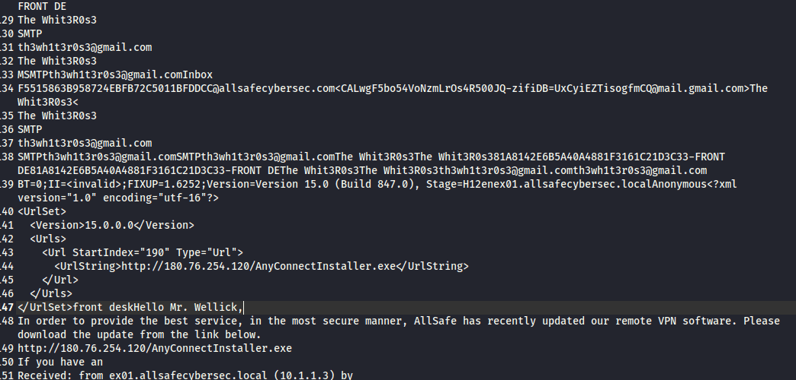
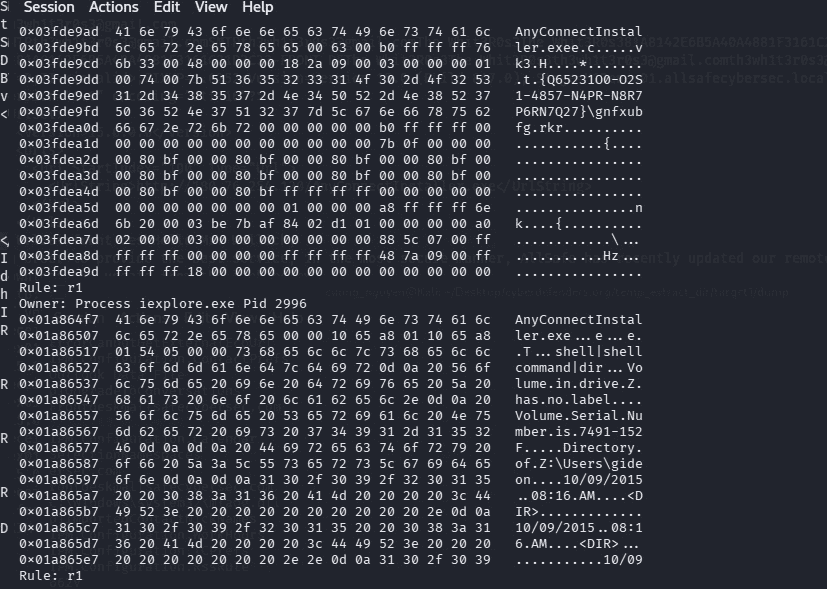
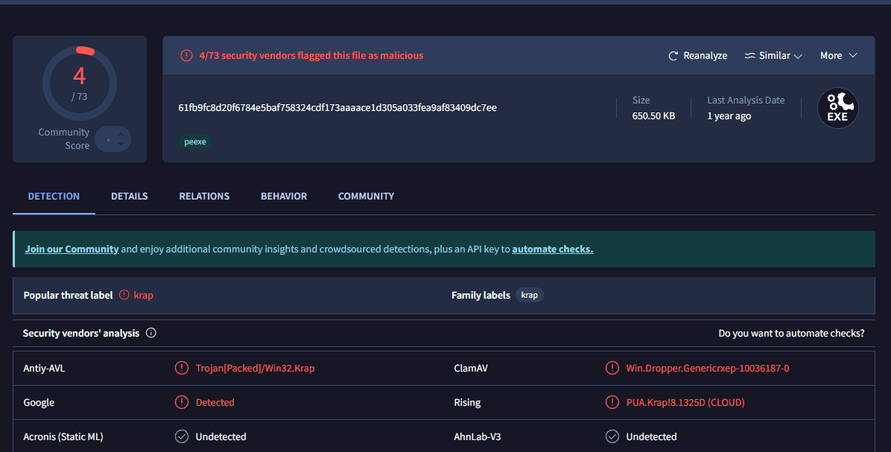
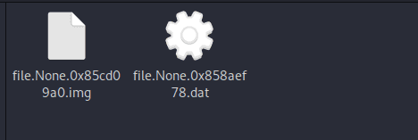
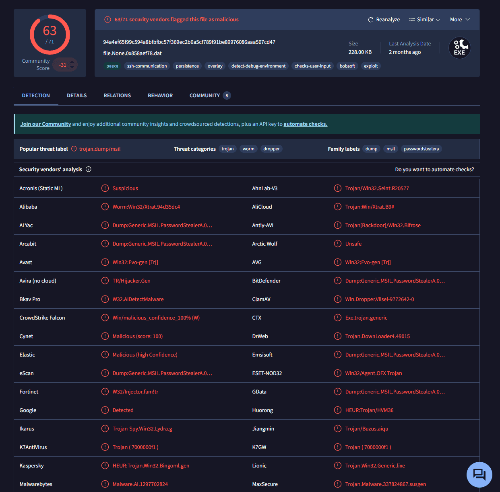
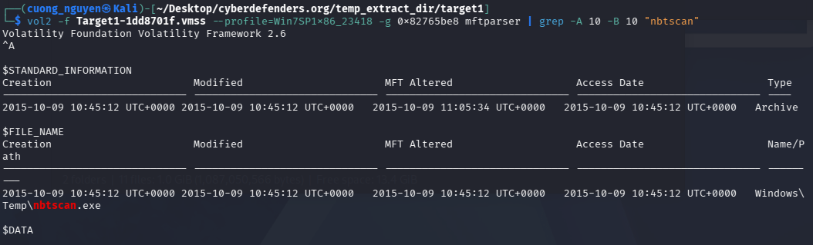
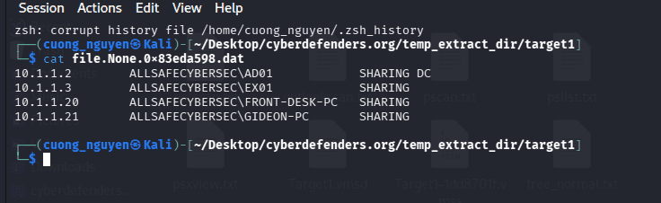
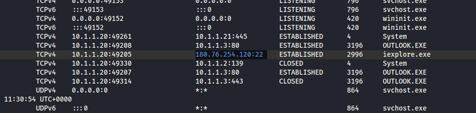
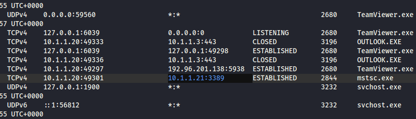
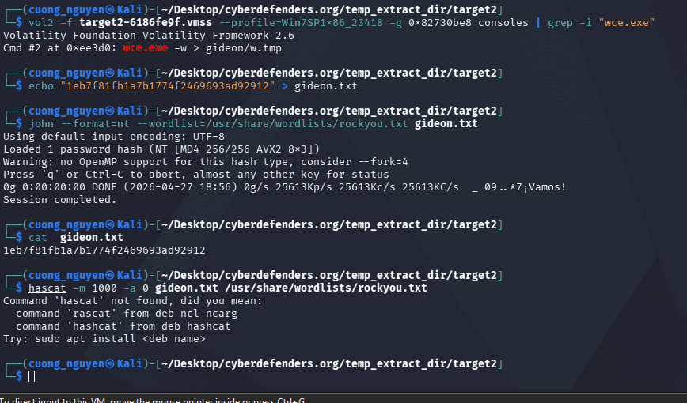

<!-- notion-metadata-start -->
*📅 Published: 2026-04-25 16:53 | 🔄 Last Updated: 2026-05-08 13:26*
<!-- notion-metadata-end -->
---


[https://cyberdefenders.org/blueteam-ctf-challenges/mrrobot/](https://cyberdefenders.org/blueteam-ctf-challenges/mrrobot/)


# 1. Tổng quan {#34f7b0eb61a4807fb8c3eab291275c84}


Đây là một vụ tấn công spear-phishing nhắm vào công ty allsafecybersec.


Đối tượng kết hợp 2 loại mã độc

- XtremeRAT: đóng vai trò điều khiển từ xa, phục vụ execution, thao tác file, chỉnh sửa registry nhằm đạt được persistence, tải thêm các công cụ bên ngoài (wce.exe, nbtscan, **`getlsasrvaddr.exe),`**thiết lập kết nối C2
- Dexter: là mã độc sinh ra cho POS (Point-of-Sale malware), mục đích ăn cắp số thẻ tín dụng
	- **Kỹ thuật lõi (RAM Scraping):** Dữ liệu thẻ tín dụng khi quẹt ở máy POS thường được mã hóa khi gửi đi, nhưng sẽ có một khoảnh khắc rất ngắn nó nằm dưới dạng clear-text trên bộ nhớ RAM của phần mềm tính tiền. Dexter liên tục quét (scrape) RAM để dò tìm các chuỗi số khớp với định dạng thẻ tín dụng. Việc nó dùng Whitelist (loại trừ `allsafe_protector.exe` hay `svchost.exe`) là để tránh quét nhầm vào phần mềm bảo mật gây báo động, hoặc quét nhầm tiến trình hệ thống gây màn hình xanh (BSOD) làm gián đoạn việc thanh toán.

# 2. The attack chain {#34f7b0eb61a48099ba56d924ae5ece7e}


**Phạm vi hệ thống:**

- **Target 1 (Front Desk):** Điểm bùng phát lây nhiễm (Initial Foothold).
- **Target 2 (Gideon PC):** Máy tính của Security Admin, bàn đạp leo thang đặc quyền.
- **Target 3 (POS):** Mục tiêu tài chính cuối cùng.
- **Domain Controller (AD01 - 10.1.1.2):** Máy chủ lưu trữ dữ liệu nhạy cảm.

### Giai đoạn 1: Xâm nhập và Thiết lập chỗ đứng (Initial Access & Execution) {#34f7b0eb61a4807a80e3db2cf0670f7e}

- **Phishing & Social Engineering:** Kẻ tấn công gửi email lừa đảo từ `th3wh1t3r0s3@gmail.com` đến nhân viên Front Desk, giả mạo yêu cầu cập nhật phần mềm VPN nội bộ.
- **Payload Delivery:** Liên kết trong email dẫn nạn nhân tải file mã độc `AnyConnectInstaller.exe` từ IP `http://180.76.254.120`.
- **Execution & Evasion:** Mã độc XtremeRAT thực thi, sử dụng kỹ thuật **Process Hollowing** để "khoét rỗng" và tiêm mã độc vào tiến trình hợp lệ `iexplore.exe` nhằm tàng hình trước EDR. Nó tạo Mutex `fsociety0.dat` để đánh dấu lây nhiễm.

### Giai đoạn 2: Duy trì quyền truy cập (Persistence & C2) {#34f7b0eb61a4809b89defee8fe38fb52}

- **Tại Front Desk:** Hacker thiết lập Registry Run key `MrRobot` để XtremeRAT tự khởi động. Khôn ngoan hơn, chúng sử dụng kỹ thuật "Living off the Land" bằng cách cài đặt thêm phần mềm hợp pháp `TeamViewer.exe` để làm backdoor thứ cấp, dễ dàng qua mặt tường lửa.
- **Tại Gideon PC:** Kẻ tấn công thiết lập Persistence thông qua Scheduled Tasks (tạo task `At1` trỏ đến file `1.bat`).
- **Command & Control (C2):** Mã độc XtremeRAT mở luồng giao tiếp C2 kết nối ngược về IP của hacker `180.76.254.120` qua cổng `22`.

### Giai đoạn 3: Trinh sát và Đánh cắp định danh (Discovery & Credential Access) {#34f7b0eb61a4808ba247c055759b5bcf}

- Hacker tải các công cụ vào thư mục Temp: `wce.exe`, `nbtscan.exe`, `getlsasrvaddr.exe`, `rar.exe`.
- **Dò quét mạng:** Dùng `nbtscan.exe` quét dải mạng nội bộ, lập bản đồ các máy tính đang hoạt động (lưu kết quả vào `nbs.txt`), phát hiện ra máy `Gideon-PC` và Domain Controller `AD01`.
- **Vét cạn mật khẩu:** Sử dụng `wce.exe -w` can thiệp vào bộ nhớ tiến trình LSASS trên Front Desk, đánh cắp thành công mật khẩu clear-text của tài khoản Local Admin (`flagadmin@1234`).

### Giai đoạn 4: Di chuyển ngang (Lateral Movement & Privilege Escalation) {#34f7b0eb61a4806d8a51e8de347ac7f5}

- **Lỗ hổng cấu hình:** Kẻ tấn công phát hiện lỗi tái sử dụng mật khẩu (Password Reuse) — máy Gideon và máy Front Desk dùng chung một mật khẩu quản trị cục bộ.
- **Lateral Movement:** Không cần dùng kỹ thuật khai thác phức tạp, hacker dùng chính mật khẩu `flagadmin@1234` (lỗi thiết lập trùng mật khẩu) để kết nối Remote Desktop (`mstsc.exe`) hợp lệ thẳng sang máy Gideon (IP `10.1.1.21`).
- Từ máy Gideon (vốn là máy của Admin bảo mật), hacker tiếp tục chạy `wce.exe` để lấy được mật khẩu cá nhân của Gideon (`t76fRJhS`), mở đường thâm nhập vào Domain Controller và hệ thống máy tính tiền (POS).

### Giai đoạn 5: Đánh cắp dữ liệu và Xóa dấu vết (Collection, Exfiltration & POS Compromise) {#34f7b0eb61a480d38a48c5e8ac4dd999}

- **Đánh cắp tài liệu:** Từ máy Gideon, hacker truy cập vào ổ đĩa chia sẻ gốc của Domain Controller (`\\10.1.1.2\c$`), gom 3 file tài liệu nội bộ `SecretSauce.txt`.
- **Nén dữ liệu:** Dùng `rar.exe` nén các file này lại thành `crownjewlez.rar` kèm theo mật khẩu bảo vệ (`123qwe!@#`) để chuẩn bị tuồn ra ngoài, tránh bị hệ thống DLP (Data Loss Prevention) bắt luồng văn bản.
- **Tấn công máy tính tiền (POS):** Hacker tải xuống payload của mã độc Dexter dưới một cái tên ngụy trang tinh vi là `allsafe_update.exe` (từ IP `http://54.84.237.92`). Mã độc Dexter kích hoạt tính năng RAM Scraping với danh sách Whitelist chứa `allsafe_protector.exe` (phần mềm nội bộ của công ty) để âm thầm vơ vét thẻ tín dụng mà không bị phát hiện.

### Một số thao tác cơ bản {#34f7b0eb61a48020b61beea741271bd4}


Instantiating KDBG using: Kernel AS Win7SP1x86_23418 (6.1.7601 32bit)
Offset (V)                    : 0x82765be8
Offset (P)                    : 0x2765be8


Dùng psxview phát hiện


```c++
0x3f447d40 vmtoolsd.exe           4072 False  False  True     False  False False   False    
0x3e091030 d                         1 False  False  True     False  False False   False    
0x3e3ed030                       15440 False  False  True     False  False False   False    
0x3f035450 u?                     108 False  False  True     False  False False   False    
0x3f443ab0 explorer.exe           3932 False  False  True     False  False False   False    
0x3ed4e030                          4 False  False  True     False  False False   False    
```


`vmtoolsd.exe` is the executable for the VMware Tools Service in Windows guest virtual machines, responsible for enhancing performance and integration between the host and guest OS


với pid 4072


netscan


```c++

0x3fa72a80         TCPv4    127.0.0.1:6039                 127.0.0.1:49298      ESTABLISHED      2680     TeamViewer.exe 
0x3fa95df8         TCPv4    10.1.1.20:49297                192.96.201.138:5938  ESTABLISHED      2680     TeamViewer.exe 
0x3fb7a560         TCPv4    10.1.1.20:49301                10.1.1.21:3389       ESTABLISHED      2844     mstsc.exe      
0x3fc426a8         TCPv4    10.1.1.20:49291                107.6.97.19:5938     ESTABLISHED      2680     TeamViewer.exe 
0x3fcdd8b0         TCPv4    127.0.0.1:49298                127.0.0.1:6039       ESTABLISHED      1092     TeamViewer_Des 
```


`mstsc.exe` (Microsoft Terminal Services Client) is the **official Windows executable for the Remote Desktop Connection app**


pstree


	Teamviewer không có người đẻ ra


```c++
0x85d0d030:iexplore.exe                             2996   2984      6    463 2015-10-09 11:31:27 UTC+0000
. 0x83f105f0:cmd.exe                                 1856   2996      1     33 2015-10-09 11:35:15 UTC+0000
0x83fb2d40:cmd.exe                                  3784   2196      1     24 2015-10-09 11:39:22 UTC+0000

Ie gọi cmd

0x84013598:TeamViewer.exe                           2680   1696     28    632 2015-10-09 12:08:46 UTC+0000
. 0x858bc278:TeamViewer_Des                          1092   2680     16    405 2015-10-09 12:10:56 UTC+0000
```


   Câu lệnh của teamviewr_des  cmd: "c:\users\frontd~1\appdata\local\temp\teamviewer\TeamViewer_Desktop.exe" --IPCport 6039


0x84017d40:tv_w32.exe                              4064   2680      2     83 2015-10-09 12:08:47 UTC+0000
`audit: \Device\HarddiskVolume2\Users\FRONTD~1\AppData\Local\Temp\TeamViewer\tv_w32.exe
cmd: "C:\Users\FRONTD~1\AppData\Local\Temp\TeamViewer\tv_w32.exe" -`


# 3. Trả lời các câu hỏi {#34f7b0eb61a48015bf40fb368715a9b4}


### Q1 Machine:Target1 What email address tricked the front desk employee into installing a security update? {#34d7b0eb61a48006a71ef33d7694ac2f}


0x85cd3d40 OUTLOOK.EXE            3196   2116     22     1678      1      0 2015-10-09 11:31:32 UTC+0000  `strings '/home/cuong_nguyen/Desktop/cyberdefenders.org/temp_extract_dir/target1/Target1-1dd8701f.vmss' | grep -Ei "^[a-zA-Z0-9._%+-]+@[a-zA-Z0-9.-]+\.[a-zA-Z]{2,}$" | sort | uniq -c`
Ta dump cái outlook ra rồi kiểm tra trong nó dùng yarascan


```c++
└─$ vol2 -f Target1-1dd8701f.vmss --profile=Win7SP1x86_23418 -g 0x82765be8 yarascan -p 3196 -Y "From:" 
Volatility Foundation Volatility Framework 2.6
Rule: r1
Owner: Process OUTLOOK.EXE Pid 3196
0x086dffe1  46 72 6f 6d 3a 20 54 68 65 20 57 68 69 74 33 52   From:.The.Whit3R
0x086dfff1  30 73 33 20 3c 74 68 33 77 68 31 74 33 72 30 73   0s3.<th3wh1t3r0s
0x086e0001  33 40 67 6d 61 69 6c 2e 63 6f 6d 3e 0d 0a 54 6f   **3@gmail.com**>..To
0x086e0011  3a 20 3c 66 72 6f 6e 74 64 65 73 6b 40 61 6c 6c   :.<frontdesk@all
0x086e0021  73 61 66 65 63 79 62 65 72 73 65 63 2e 63 6f 6d   safecybersec.com
0x086e0031  3e 0d 0a 43 6f 6e 74 65 6e 74 2d 54 79 70 65 3a   >..Content-Type:
0x086e0041  20 6d 75 6c 74 69 70 61 72 74 2f 61 6c 74 65 72   .multipart/alter
0x086e0051  6e 61 74 69 76 65 3b 20 62 6f 75 6e 64 61 72 79   native;.boundary
0x086e0061  3d 22 30 30 31 61 31 31 33 34 33 32 37 38 62 64   ="001a11343278bd
0x086e0071  61 30 64 36 30 35 32 31 61 36 31 65 39 35 22 0d   a0d60521a61e95".
0x086e0081  0a 52 65 74 75 72 6e 2d 50 61 74 68 3a 20 74 68   .Return-Path:.th
0x086e0091  33 77 68 31 74 33 72 30 73 33 40 67 6d 61 69 6c   3wh1t3r0s3@gmail
0x086e00a1  2e 63 6f 6d 0d 0a 58 2d 4d 53 2d 45 78 63 68 61   .com..X-MS-Excha
0x086e00b1  6e 67 65 2d 4f 72 67 61 6e 69 7a 61 74 69 6f 6e   nge-Organization
0x086e00c1  2d 4e 65 74 77 6f 72 6b 2d 4d 65 73 73 61 67 65   -Network-Message
0x086e00d1  2d 49 64 3a 20 34 35 35 36 64 33 61 34 2d 33 38   -Id:.4556d3a4-38

```


th3wh1t3r0s3@gmail.com


frontdesk@allsafecybersec.com


có thể dùng strings nhưng hơi cồng kềnh


```c++
strings -a -el Target1-1dd8701f.vmss > strings_utf16.txt
strings -a Target1-1dd8701f.vmss > strings_ascii.txt
┌──(cuong_nguyen㉿Kali)-[~/Desktop/cyberdefenders.org/temp_extract_dir/target1]
└─$ strings '/home/cuong_nguyen/Desktop/cyberdefenders.org/temp_extract_dir/target1/Target1-1dd8701f.vmss' | grep -Ei "[a-zA-Z0-9._%+-]+@[a-zA-Z0-9.-]+\.[a-zA-Z]{2,}" | sort | uniq -c | grep "gmail"
      1 Message-ID: <CALwgF5bo54VoNzmLrOs4R500JQ-zifiDB=UxCyiEZTisogfmCQ@mail.gmail.com>
      1 Return-Path: th3wh1t3r0s3@gmail.com
      1 s3@gmail.com>

```


### Q2 Machine:Target1 What is the filename that was delivered in the email? {#34d7b0eb61a4800bb1f7d749600a75b0}


Ta dùng memdump để dump file ra rồi tìm trên cái file dump đó


strings -el 3196.dmp | grep -i -A 20 -B 20 "th3wh1t3r0s3@gmail.com"





AnyConnectInstaller.exe


Hoặc có thể dùng yarascan với tìm kiếm file .exe hoặc file malicious chẳng hạn 


### Q3 Machine:Target1 What is the name of the rat's family used by the attacker? {#34d7b0eb61a48098bd3fd3356cfcfa8d}


Sau khi dùng yarascan với tên của file exe 





Ta thấy nó chạy bằng ie. Thử dump IE ra và dùng foremost
└─$ `vol2 -f Target1-1dd8701f.vmss --profile=Win7SP1x86_23418 -g 0x82765be8 memdump -p 2996 -D dump`


```c++
foremost -t exe -i 2996.dmp -o ie
foremost -t exe -i 3196.dmp -o outlook
```





Không tìm được tên


Quay lại dùng filescan rồi dumpfiles nó ra


```c++
Volatility Foundation Volatility Framework 2.6
0x000000003debbf80      8      0 R--r-- \Device\HarddiskVolume2\Windows\Prefetch\ANYCONNECTINSTALLER.EXE-BF8040D4.pf
0x000000003df12dd0      2      0 RW-rwd \Device\HarddiskVolume2\Users\anyconnect\AnyConnect\AnyConnectInstaller.exe
0x000000003df1cf00      4      0 R--r-d \Device\HarddiskVolume2\Users\anyconnect\AnyConnect\AnyConnectInstaller.exe
0x000000003e0bc5e0      7      0 R--r-d \Device\HarddiskVolume2\Users\frontdesk\Downloads\AnyConnectInstaller.exe
0x000000003e2559b0      8      0 R--rwd \Device\HarddiskVolume2\Users\frontdesk\Downloads\AnyConnectInstaller.exe
0x000000003e2ae8e0      8      0 RWD--- \Device\HarddiskVolume2\Users\anyconnect\AnyConnect\AnyConnectInstaller.exe
0x000000003ed57968      4      0 R--r-d \Device\HarddiskVolume2\Users\frontdesk\Downloads\AnyConnectInstaller.exe
0x000000003fc3c8c0      8      0 R--r-- \Device\HarddiskVolume2\Windows\Prefetch\ANYCONNECTINSTALLER.EXE-F5AF5299.pf

```


0x000000003e0bc5e0 


```c++
vol2 -f Target1-1dd8701f.vmss --profile=Win7SP1x86_23418 -g 0x82765be8 dumpfiles -Q 0x000000003e0bc5e0 -D AnyConnect
Volatility Foundation Volatility Framework 2.6
ImageSectionObject 0x3e0bc5e0   None   \Device\HarddiskVolume2\Users\frontdesk\Downloads\AnyConnectInstaller.exe
DataSectionObject 0x3e0bc5e0   None   \Device\HarddiskVolume2\Users\frontdesk\Downloads\AnyConnectInstaller.exe

```


Do filescan trả về địa chỉ vật lý nên phải dùng `-Q` là viết tắt của `--physoffset` (Physical Offset).


:::tip

`filescan` sử dụng một kỹ thuật cào thô bạo gọi là **Pool Scanning**. Nó quét qua từng byte một trên thanh RAM vật lý để tìm cấu trúc dữ liệu `_FILE_OBJECT` của Windows.


:::





Ta tính hash và ra kết quả **XtremeRAT**





### Q4 Machine:Target1 The malware appears to be leveraging process injection. What is the PID of the process that is injected? {#34d7b0eb61a480c6a0d4fcf6b3a9604a}


Thông thường thì ta hay dùng malfind để tìm kiếm injected code. malfind quét qua VAD của từng process để tìm kiếm vùng nhớ có 

	- quyền PAGE_EXECUTE_READWRITE
	- Trạng thái sao lưu: vùng nhớ dạng mem_private (không được ánh xạ từ một file vật lý trên đĩa cứng như exe hay dll)
- Khi đó thì malware sẽ lợi dụng: bằng cách process hollowing
	- CreateProcess ở trạng thái suspend
	- NtUnmapViewOfSelection để unmap code hợp lệ của process đó khỏi bộ nhớ
	- Cấp phát bộ nhớ mới (VirtualAllocEx) và ghi malicious code vào
	- Điều chỉnh entry point và ResumeThread

:::tip

Những mã độc tinh vi (như Extreme RAT trong bài lab này) sẽ **không** để vùng nhớ chứa payload của chúng ở trạng thái `PAGE_EXECUTE_READWRITE` (RWX). Sau khi ghi payload, chúng sẽ dùng `VirtualProtectEx` để đổi quyền vùng nhớ thành `PAGE_EXECUTE_READ` (RX) hoặc bắt chước giống hệt quyền `PAGE_EXECUTE_WRITECOPY` của một tiến trình bình thường.
Vì vùng nhớ lúc này không có cờ `RWX`, bộ lọc của `malfind` sẽ bỏ qua nó hoàn toàn. Bức ảnh thứ nhất bạn cung cấp cho thấy `malfind` chỉ tìm thấy `explorer.exe` (PID 2116) vì nó có vùng nhớ Protection: 6 (`PAGE_EXECUTE_READWRITE`), nhưng hoàn toàn không thấy `iexplore.exe` (PID 2996).

:::


- Hollowfind không đi tìm các vùng nhớ có quyền RWX của mỗi VAD mà còn kiểm tra cả PEB (Process Environment Block)

```c++
Hollowed Process Information:
        Process: iexplore.exe PID: 2996
        Parent Process: NA PPID: 2984
        Creation Time: 2015-10-09 11:31:27 UTC+0000
        Process Base Name(PEB): iexplore.exe
        Command Line(PEB): "C:\Program Files\Internet Explorer\iexplore.exe"
        Hollow Type: Process Base Address and Memory Protection Discrepancy

VAD and PEB Comparison:
        Base Address(VAD): 0x12d0000
        Process Path(VAD): \Program Files\Internet Explorer\iexplore.exe
        Vad Protection: PAGE_EXECUTE_WRITECOPY
        Vad Tag: Vad 

        Base Address(PEB): 0x13400000
        Process Path(PEB): C:\Program Files\Internet Explorer\iexplore.exe
        Memory Protection: PAGE_READWRITE
        Memory Tag: VadS

0x13400000  4d 5a 50 00 02 00 00 00 04 00 0f 00 ff ff 00 00   MZP.............
0x13400010  b8 00 00 00 00 00 00 00 40 00 1a 00 00 00 00 00   ........@.......
0x13400020  00 00 00 00 00 00 00 00 00 00 00 00 00 00 00 00   ................
0x13400030  00 00 00 00 00 00 00 00 00 00 00 00 00 01 00 00   ................

Similar Processes:
        iexplore.exe(2996) Parent:NA(2984) Start:2015-10-09 11:31:27 UTC+0000

Suspicious Memory Regions:
        0x771c0000(No PE/Possibly Code)  Protection: PAGE_EXECUTE_WRITECOPY  Tag: Vad 

```


### Q5 Machine:Target1 What is the unique value the malware is using to maintain persistence after reboot? {#34d7b0eb61a480bdb1cacf83b8f3e895}


```c++
┌──(cuong_nguyen㉿Kali)-[~/Desktop/cyberdefenders.org/temp_extract_dir/target1]
└─$ vol2 -f Target1-1dd8701f.vmss --profile=Win7SP1x86_23418 -g 0x82765be8 printkey -K "Microsoft\Windows\CurrentVersion\Run"
Volatility Foundation Volatility Framework 2.6
Legend: (S) = Stable   (V) = Volatile

----------------------------
Registry: \SystemRoot\System32\Config\SOFTWARE
Key name: Run (S)
Last updated: 2015-10-09 10:36:11 UTC+0000

Subkeys:

Values:
REG_SZ        VMware User Process : (S) "C:\Program Files\VMware\VMware Tools\vmtoolsd.exe" -n vmusr
REG_EXPAND_SZ MrRobot         : (S) c:\users\anyconnect\AnyConnect\AnyConnectInstaller.exe

```


Để tìm service thì ta tìm bằng key `CurrentControlSet\ServicesEach subkey under CurrentControlSet\Services` 


Ta dùng winesap cũng ra


```c++
┌──(cuong_nguyen㉿Kali)-[~/Desktop/cyberdefenders.org/temp_extract_dir/target1]
└─$ vol2 -f Target1-1dd8701f.vmss --profile=Win7SP1x86_23418 -g 0x82765be8 winesap
Volatility Foundation Volatility Framework 2.6
------------------------------
HKCU\Software\Microsoft\Windows\CurrentVersion\Run
Sidebar: REG_EXPAND_SZ: %ProgramFiles%\Windows Sidebar\Sidebar.exe /autoRun
------------------------------
HKCU\Software\Microsoft\Windows\CurrentVersion\RunOnce
mctadmin: REG_SZ: C:\Windows\System32\mctadmin.exe
------------------------------
HKLM\Software\Microsoft\Windows\CurrentVersion\Run
VMware User Process: REG_SZ: "C:\Program Files\VMware\VMware Tools\vmtoolsd.exe" -n vmusr
------------------------------
HKLM\Software\Microsoft\Windows\CurrentVersion\Run
MrRobot: REG_EXPAND_SZ: c:\users\anyconnect\AnyConnect\AnyConnectInstaller.exe
```


:::tip

Sẽ có những trường hợp tham số `-K` bị lỗi do Volatility không tự động tìm được đúng Registry Hive (do bộ nhớ bị phân mảnh). Lúc đó, bạn làm theo 2 bước:
1. Chạy plugin `hivelist` để xem danh sách các file Registry đang nằm ở đâu trên RAM. Tìm địa chỉ Offset của file `\SystemRoot\System32\Config\SOFTWARE`.

2. Chạy `printkey` kết hợp offset:
`vol.py -f <file> --profile=<profile> printkey -o <Địa_chỉ_Offset_từ_bước_1> -K "Microsoft\Windows\CurrentVersion\Run"`

:::


### Q6 Machine:Target1 Malware often uses a unique value or name to ensure that only one copy runs on the system. What is the unique name the malware is using? {#34d7b0eb61a48056965dee3729ab8fc7}


Hacker sử dụng mutant cố định để tránh việc lây nhiễm chồng lên một máy trạm gây crash. Ta đã biết mutant là điều phối sao cho một thread chỉ truy cập vào một tài nguyên, semaphore là để sắp xếp việc truy cập tài nguyên của thread/process. Nhưng tại sao điều này lại có thể giúp hacker chỉ nhiễm một lần trên một máy mà thôi? Và điều này có áp dụng cho semaphore không hay chỉ mutant


```c++
┌──(cuong_nguyen㉿Kali)-[~/Desktop/cyberdefenders.org/temp_extract_dir/target1]
└─$ vol2 -f Target1-1dd8701f.vmss --profile=Win7SP1x86_23418 -g 0x82765be8 handles -p 2996 -t mutant
Volatility Foundation Volatility Framework 2.6
Offset(V)     Pid     Handle     Access Type             Details
---------- ------ ---------- ---------- ---------------- -------
0x85c80238   2996       0x18   0x1f0001 Mutant           
0x8560f0c0   2996       0xa4   0x100000 Mutant           RasPbFile
0x85d1be20   2996       0xe4   0x1f0001 Mutant           
0x85d1bd90   2996       0xec   0x1f0001 Mutant           
0x85d11500   2996      0x118   0x1f0001 Mutant           
0x85d118d0   2996      0x124   0x1f0001 Mutant           
0x85d1b0f0   2996      0x14c   0x1f0001 Mutant           
0x85d11700   2996      0x150   0x1f0001 Mutant           fsociety0.dat

```


fsociety0.dat


### Q7 Machine:Target1 It appears that a notorious hacker compromised this box before our current attackers. Name the movie he or she is from. {#34d7b0eb61a480b2a8e5d2c35c71b7e8}


Ta dùng filesscan và grep “Users” để tìm các user tìm các users khác biệt


`\Device\HarddiskVolume2\Users\zerocool\AppData\Roaming\Microsoft\Window`


### Q8 Machine:Target1 What is the NTLM password hash for the administrator account? {#34d7b0eb61a48022a1afedeffe5b1cc8}


Có thể dùng plugin hashdump


```c++
┌──(cuong_nguyen㉿Kali)-[~/Desktop/cyberdefenders.org/temp_extract_dir/target1]
└─$ vol2 -f Target1-1dd8701f.vmss --profile=Win7SP1x86_23418 -g 0x82765be8 hashdump
Volatility Foundation Volatility Framework 2.6
Administrator:500:aad3b435b51404eeaad3b435b51404ee:79402b7671c317877b8b954b3311fa82:::
Guest:501:aad3b435b51404eeaad3b435b51404ee:31d6cfe0d16ae931b73c59d7e0c089c0:::
front-desk:1000:aad3b435b51404eeaad3b435b51404ee:2ae4c526659523d58350e4d70107fc11:::

```

- **`aad3b435b51404eeaad3b435b51404ee`** **(LM Hash):** Mật khẩu băm theo chuẩn LAN Manager cũ.
	- _Lưu ý quan trọng:_ Chuỗi `aad3b...` này là một chuỗi tĩnh, đại diện cho giá trị **Trống (Blank)**. Bắt đầu từ Windows Vista/Windows 7, Microsoft đã mặc định vô hiệu hóa LM Hash vì nó có lỗ hổng thiết kế, rất dễ bị bẻ khóa. Do đó, bạn sẽ luôn thấy chuỗi `aad3b...` này lặp lại ở mọi user. Chúng ta có thể phớt lờ nó.
- **`2ae4c526659523d58350e4d70107fc11`** **(NT Hash / NTLM Hash):** Đây là "kho báu". Nó chính là mật khẩu thực sự của user `front-desk` đã được băm bằng thuật toán NTLM mạnh hơn. Đây là mục tiêu để bạn mang đi bẻ khóa (cracking).
- **`:::`** **(Các trường trống):** Các thông tin về Comment hay Home Directory không có nên nó để trống.

### Q9 Machine:Target1 The attackers appear to have moved over some tools to the compromised front desk host. How many tools did the attacker move? {#34d7b0eb61a48058ba99fd178ee2b43d}


Do tôi làm câu 10 trước nên biết hacker đã xâm nhập và thả file vào folder temp, ta thử tìm kiếm tỏng đó


```c++
┌──(cuong_nguyen㉿Kali)-[~/Desktop/cyberdefenders.org/temp_extract_dir/target1]
└─$ vol2 -f Target1-1dd8701f.vmss --profile=Win7SP1x86_23418 -g 0x82765be8 filescan | grep -i "Temp" | grep -i "\.exe"
Volatility Foundation Volatility Framework 2.6
0x000000003df31038      8      0 R--r-- \Device\HarddiskVolume2\Windows\Temp\wce.exe
0x000000003e1eee10      7      0 R--r-d \Device\HarddiskVolume2\Windows\Temp\getlsasrvaddr.exe
0x000000003e25eca8      5      0 R--r-d \Device\HarddiskVolume2\Windows\Temp\wce.exe
0x000000003fa1edb0      8      0 R--r-d \Device\HarddiskVolume2\Users\FRONTD~1\AppData\Local\Temp\TeamViewer\TeamViewer_Desktop.exe
0x000000003fa4f5d0      4      0 R--r-d \Device\HarddiskVolume2\Users\FRONTD~1\AppData\Local\Temp\TeamViewer\tv_w32.exe
0x000000003fa633f0      1      0 R--rw- \Device\HarddiskVolume2\Windows\Temp\Rar.exe
0x000000003fc3fb80      6      0 R--r-d \Device\HarddiskVolume2\Windows\Temp\nbtscan.exe
0x000000003fc5af80      7      0 R--r-d \Device\HarddiskVolume2\Windows\Temp\Rar.exe
0x000000003fd03dd0      6      0 R--rwd \Device\HarddiskVolume2\Users\front-desk\AppData\Local\Temp\ose00000.exe
0x000000003fd57ae8      6      0 R--r-d \Device\HarddiskVolume2\Users\FRONTD~1\AppData\Local\Temp\TeamViewer\TeamViewer.exe
0x000000003fdd4ca0      7      0 R--r-- \Device\HarddiskVolume2\Windows\Temp\nbtscan.exe

```

- **`wce.exe`**: Công cụ đánh cắp mật khẩu (Windows Credentials Editor)
- **`nbtscan.exe`**: Công cụ rà quét mạng (Network Scanner) dùng để dò tìm các máy tính khác trong mạng nội bộ (phục vụ Lateral Movement).
- **`getlsasrvaddr.exe`**: Một công cụ bổ trợ (helper utility) thường đi kèm với các trình dump mật khẩu để định vị địa chỉ bộ nhớ của tiến trình LSASS.
- **`Rar.exe`**: Trình nén file quen thuộc. Hacker mang nó theo để gom các file tài liệu nhạy cảm lại, nén và đặt mật khẩu trước khi tuồn (Exfiltrate) ra ngoài mạng.
- `ose00000.exe` is a legitimate, critical component of the **Microsoft Office Suite**, specifically the **Office Source Engine (OSE), which manages installation files and updates**
- `TeamViewer.exe` :

3 - không tính rar


### Q10 Machine:Target1 What is the password for the front desk local administrator account? {#34d7b0eb61a480ec9504c41d167ec290}


Ta dùng john the ripper


```c++
echo "2ae4c526659523d58350e4d70107fc11" > frontdesk_hash.txt
```


giải nén rockyou


```c++
sudo gzip -d /usr/share/wordlists/rockyou.txt.gz
```


```c++
john --format=nt --wordlist=/usr/share/wordlists/rockyou.txt frontdesk_hash.txt
```


hoặc dùng hashcat


```c++
hashcat -m 1000 -a 0 frontdesk_hash.txt /usr/share/wordlists/rockyou.txt
```

- `m 1000`: Mode 1000 trong Hashcat tương ứng với thuật toán NTLM. (Hashcat dùng số để định nghĩa thuật toán thay vì chữ như John).
- `a 0`: Attack mode 0 nghĩa là tấn công kiểu từ điển (Dictionary/Straight Attack).

nhưng lại không ra kết quả vì không tồn tại trong rockyou


Ta phải dùng plugin console để xem hacker đã gõ gì, khả năng cao đã dùng wce.exe


```c++
vol2 -f Target1-1dd8701f.vmss --profile=Win7SP1x86_23418 -g 0x82765be8 consoles | grep -A 5 -B 5 "wce"

```


```c++
C:\Windows\Temp>wce.exe -w                                                      
WCE v1.42beta (Windows Credentials Editor) - (c) 2010-2013 Amplia Security - by 
Hernan Ochoa (hernan@ampliasecurity.com)                                        
Use -h for help.                                                                
                                                                                
                                                                                
Administrator\front-desk-PC:flagadmin@1234                                      
frontdesk\ALLSAFECYBERSEC:THzV7mpz                                              
FRONT-DESK-PC$\ALLSAFECYBERSEC:o0&77qj:^zctL2T]ljn3<niK2Kbqi`(:LeBoO7zE>'d8<>J"P
K;\*5IS@Oxg:rC:P:z Y!%fUiIX0y_J& uNUTJ?%:Y;qJY,xq/:)%5^f&zDK.)F%H;V?.^Z  
```


front-desk-PC:flagadmin@1234

- Tài khoản **Administrator** có mật khẩu là: `flagadmin@1234` (Đây chính là đáp án cho nhiều thử thách CTF).
- Tài khoản **frontdesk** có mật khẩu là: `THzV7mpz`
- wce.exe là một công cụ post-exploitation tương tự mimikatz, tham số -w là để hiện cleartext

| **Tiêu chí**           | **cmdline (Command Line)**                                                                                                | **consoles (Console Buffer)**                                                                                                                                                     |
| ---------------------- | ------------------------------------------------------------------------------------------------------------------------- | --------------------------------------------------------------------------------------------------------------------------------------------------------------------------------- |
| **Nguồn dữ liệu**      | Đọc từ **PEB** (Process Environment Block) của từng tiến trình riêng lẻ.                                                  | Đọc từ tiến trình **`conhost.exe`** (Console Host Window) - nơi quản lý giao diện cửa sổ đen của CMD.                                                                             |
| **Thông tin thu được** | Chỉ lấy được **đầu vào ban đầu**: Câu lệnh chính xác dùng để khởi động tiến trình đó lên.                                 | Lấy được **toàn bộ phiên làm việc**: Lịch sử gõ phím, câu lệnh đầu vào, đường dẫn thư mục hiện tại (Prompt) và quan trọng nhất là **Output (đầu ra) in trên màn hình**.           |
| **Ví dụ thực tế**      | Nó chỉ báo cho bạn biết tiến trình PID 3784 được khởi chạy bằng lệnh: `wce.exe -w > w.tmp`                                | Nó cho bạn xem lại "bức ảnh chụp màn hình" cửa sổ dòng lệnh. Bạn thấy được chữ `C:\Windows\Temp>`, thấy logo WCE v1.42beta, và thấy danh sách mật khẩu được in ra.                |
| **Khi nào sử dụng?**   | Dùng để dò quét nhanh trên diện rộng xem có process nào chạy với tham số mờ ám (ví dụ: chạy powershell với cờ `-Hidden`). | Dùng khi đã khoanh vùng được cửa sổ CMD khả nghi và muốn biết chính xác hacker đã gõ gì, kết quả trả về ra sao (đặc biệt hữu dụng để tìm mật khẩu, đường dẫn file bị tải lén...). |


### Q11 Machine:Target1 What is the std create data timestamp for the nbtscan.exe tool? {#34d7b0eb61a48071aba3c0ab79dd3504}


2015-10-09 10:45:12 UTC


`vol2 -f Target1-1dd8701f.vmss --profile=Win7SP1x86_23418 -g 0x82765be8 mftparser | grep -A 10 -B 10 "nbtscan"`





### Q12 Machine:Target1 The attackers appear to have stored the output from the nbtscan.exe tool in a text file on a disk called nbs.txt. What is the IP address of the first machine in that file? {#34d7b0eb61a480fb8e7eff3ef06127dd}


Ta tìm file đó bằng filescan (file nbs.txt) rồi dump nó ra dùng offset với flag -Q





### Q13 Machine:Target1 What is the full IP address and the port was the attacker's malware using? {#34d7b0eb61a4808babbdcbd8d5f59a5f}


180.76.254.120:22 





### Q14 Machine:Target1 It appears the attacker also installed legit remote administration software. What is the name of the running process? {#34d7b0eb61a480f482c7f44ed9d911ba}


teamviewer.exe


### Q15 Machine:Target1 It appears the attackers also used a built-in remote access method. What IP address did they connect to? {#34d7b0eb61a480f9b596cc18ec709a76}


10.1.1.21





Move laterally form Frontdesk to Gideon_pc như đã xác định ở câu số 12


### Q16 Machine:Target2 It appears the attacker moved latterly from the front desk machine to the security admins (Gideon) machine and dumped the passwords. What is Gideon's password? {#34d7b0eb61a480fe9a45c0503aed2413}


```c++
└─$ vol2 -f target2-6186fe9f.vmss --profile=Win7SP1x86_23418 -g 0x82730be8 hashdump
Volatility Foundation Volatility Framework 2.6
^[[2;5~Administrator:500:aad3b435b51404eeaad3b435b51404ee:79402b7671c317877b8b954b3311fa82:::
Guest:501:aad3b435b51404eeaad3b435b51404ee:31d6cfe0d16ae931b73c59d7e0c089c0:::
gideon:1000:aad3b435b51404eeaad3b435b51404ee:1eb7f81fb1a7b1774f2469693ad92912:::

```





ta dùng john không thành công nên phải chuyển qua cat file w.tmp ra


┌──(cuong_nguyen㉿Kali)-[~/Desktop/cyberdefenders.org/temp_extract_dir/target2]
└─$ cat file.None.0x85a35da0.dat
`WCE v1.42beta (Windows Credentials Editor) - (c) 2010-2013 Amplia Security - by Hernan Ochoa (`[`hernan@ampliasecurity.com`](mailto:hernan@ampliasecurity.com)`)
Use -h for help.`


`gideon\ALLSAFECYBERSEC:t76fRJhS
GIDEON-PC$\ALLSAFECYBERSEC:s9O3t%sd1q>:u5Za8Xrx_3Eg;(\qapu<"Rn$#QQJlsD m#;z2hbJkr*tLe>0)F[S)'USh3BKJILn3-?vt]q=s-Cp.ws9wVik[]5?#F\*l/J19+`PYco:au;T`

- **Tài khoản:** `gideon`
- **Domain/Workgroup:** `ALLSAFECYBERSEC`
- **Mật khẩu gốc (Clear-text):** `t76fRJhS`

### Q17 Machine:Target2 Once the attacker gained access to "Gideon," they pivoted to the AllSafeCyberSec domain controller to steal files. It appears they were successful. What password did they use? {#34d7b0eb61a480d78dacc010438eceb6}


 `123qwe!@#` là mật khẩu dùng để encrypt file rar


### Q18 Machine:Target2 What was the name of the RAR file created by the attackers? {#34d7b0eb61a480b3969fdc26a4c1e287}


`└─$ vol2 -f target2-6186fe9f.vmss --profile=Win7SP1x86_23418 -g 0x82730be8 consoles | grep -i ".rar"
CommandHistory: 0xea408 Application: Rar.exe Flags:
Cmd #12 at 0xf2418: copy c:\users\gideon\rar.exe z:\crownjewels
Cmd #15 at 0xe6f38: rar
Cmd #16 at 0xf2478: rar crownjewlez.rar *.txt -hp123qwe!@#
Cmd #17 at 0xf24d0: rar a -hp123!@#qwe crownjewlez.rar *.txt`


### Q19 Machine:Target2 How many files did the attacker add to the RAR archive? {#34d7b0eb61a480e09ac7cfa8ab5ce7e9}


Ta biết được ở câu trên là hacker chọn hết tất cả các file txt. Ta chỉ cần tìm file txt trong ổ C:\users\gideon mà thôi


tìm được 6 file txt


```c++
┌──(cuong_nguyen㉿Kali)-[~/Desktop/cyberdefenders.org/temp_extract_dir/target2]
└─$ vol2 -f target2-6186fe9f.vmss --profile=Win7SP1x86_23418 -g 0x82730be8 filescan | grep -i "Users" | grep -i "gideon" | grep ".txt"
Volatility Foundation Volatility Framework 2.6
0x000000003e1941a0     17      1 RW-r-- \Device\HarddiskVolume2\Users\gideon.ALLSAFECYBERSEC\AppData\Local\Microsoft\MSOIdentityCRL\Tracing\msoidLiteTrace{9317BCB6-314B-442F-A5DA-9BC2BEBC271D}.txt
0x000000003e3fad08      1      1 -W-rw- \Device\HarddiskVolume2\Users\GIDEON~1.ALL\AppData\Local\Temp\FXSAPIDebugLogFile.txt
0x000000003fb5d5b8      8      0 -W---- \Device\HarddiskVolume2\Users\gideon.ALLSAFECYBERSEC\AppData\Roaming\Microsoft\Windows\Cookies\Low\gideon@google[1].txt
0x000000003fb8dd98      8      0 -W---- \Device\HarddiskVolume2\Users\gideon.ALLSAFECYBERSEC\AppData\Roaming\Microsoft\Windows\Cookies\Low\gideon@microsoft[2].txt
0x000000003fb96788      8      0 -W---- \Device\HarddiskVolume2\Users\gideon.ALLSAFECYBERSEC\AppData\Roaming\Microsoft\Windows\Cookies\Low\gideon@www.msn[1].txt
0x000000003fd01438      8      0 -W---- \Device\HarddiskVolume2\Users\gideon.ALLSAFECYBERSEC\AppData\Roaming\Microsoft\Windows\Cookies\Low\gideon@google[3].txt

```


Không đúng kết quả


Chuyển qua dò conhost.exe phát hiện có 2 conhost


0x841ce638 cmd.exe                3488   3624      1       20      1      0 2015-10-09 11:40:49 UTC+0000


0x84a6d8f0 conhost.exe            2888    420      2       50      1      0 2015-10-09 11:40:50 UTC+0000


0x83fe9940 cmd.exe                 416   3624      1       20      1      0 2015-10-09 12:01:26 UTC+0000


0x8460e030 conhost.exe            3048    420      2       50      1      0 2015-10-09 12:01:26 UTC+0000


Nhưng ta biết trước đó conhost.exe với pid số 3048 được hacker sử dụng


```c++
C:\Users\gideon.ALLSAFECYBERSEC>                                                
**************************************************
ConsoleProcess: conhost.exe Pid: 3048
Console: 0x4a81c0 CommandHistorySize: 50
ProcessHandle: 0x60
Cmd #0 at 0xe6030: cd C:\Users
Cmd #1 at 0xe6ea8: dir
Cmd #2 at 0xee3d0: wce.exe -w > gideon/w.tmp
Cmd #3 at 0xe0170: who ami
Cmd #4 at 0xe0188: whoami
Cmd #5 at 0xea3c8: net use z: \\10.1.1.2\c$
Cmd #6 at 0xe01b8: cd z:
Cmd #7 at 0xe6ed8: dir
Cmd #8 at 0xe6070: cd gideon
Cmd #9 at 0xe6ef8: dir
Cmd #10 at 0xe6f08: z:
Cmd #11 at 0xe6f18: dir
Cmd #12 at 0xf2418: copy c:\users\gideon\rar.exe z:\crownjewels
Cmd #13 at 0xe0cb8: cd crownjewels
Cmd #14 at 0xe6f28: dir
Cmd #15 at 0xe6f38: rar
Cmd #16 at 0xf2478: rar crownjewlez.rar *.txt -hp123qwe!@#
Cmd #17 at 0xf24d0: rar a -hp123!@#qwe crownjewlez.rar *.txt
----
```


Ta dump tiến trình này ra và tìm file txt bằng strings


```c++
strings -el 3048.dmp | grep -i -C 10 "crownjewlez"
CROWNJ~1.RAR
crownjewlez.rar
Rar.exet
SECRET~1.TXT
SecretSauce1.txt
SECRET~2.TXT
SecretSauce2.txt
SECRET~3.TXT
SecretSauce3.txt

```


:::tip

`conhost.exe` không chỉ lưu "dòng lệnh do hacker gõ vào" (Input), mà nó lưu TOÀN BỘ "những gì hiển thị trên cái cửa sổ đen CMD" (Output). 
- Khi hacker nén file vào rar, cái file đó phải hiển thị ra màn hình stdout trước, những cái này được conhost.exe lưu lại

- Nhưng không phải lưu file.

- Consoles không nhiều bằng conhost

:::


### Q20 Machine:Target2 The attacker appears to have created a scheduled task on Gideon's machine. What is the name of the file associated with the scheduled task? {#34d7b0eb61a480c5b70ec49dda9236be}


└─$ vol2 -f target2-6186fe9f.vmss --profile=Win7SP1x86_23418 -g 0x82730be8 filescan | grep -F -i "Windows\System32\Tasks"


0x000000003fc399b8      8      0 R--r-d \Device\HarddiskVolume2\Windows\System32\Tasks\At1
Ta dumpfiles ra


```c++
┌──(cuong_nguyen㉿Kali)-[~/Desktop/cyberdefenders.org/temp_extract_dir/target2]
└─$ cat file file.None.0x85a86af0.dat 
cat: file: No such file or directory
��<?xml version="1.0" encoding="UTF-16"?>
<Task version="1.0" xmlns="http://schemas.microsoft.com/windows/2004/02/mit/task">
  <RegistrationInfo />
  <Triggers>
    <TimeTrigger>
      <StartBoundary>2015-10-09T08:00:00</StartBoundary>
    </TimeTrigger>
  </Triggers>
  <Principals>
    <Principal id="Author">
      <UserId>@AtServiceAccount</UserId>
      <LogonType>InteractiveTokenOrPassword</LogonType>
      <RunLevel>HighestAvailable</RunLevel>
    </Principal>
  </Principals>
  <Actions Context="Author">
    <Exec>
      <Command>c:\users\gideon\1.bat</Command>
    </Exec>
  </Actions>
</Task>       
```


### Q21 Machine:POS What is the malware CNC's server? {#34d7b0eb61a480248ef6fce6ef42f783}


54.84.237.92


10.1.1.10:58751                54.84.237.92:80      CLOSE_WAIT       3208     iexplore.exe 


### Q22 Machine:POS What is the common name of the malware used to infect the POS system? {#34d7b0eb61a4807d8855d650eb8e2fa9}


Ta dùng malfind với 3208 ở trên. RỒi dùng malfind và trích xuất ra


`┌──(cuong_nguyen㉿Kali)-[~/Desktop/cyberdefenders.org/temp_extract_dir/pos01]
└─$ vol2 -f POS-01-c4e8f786.vmss --profile=Win7SP1x86_23418 -g 0x82763be8 malfind -p 3208 -D .`


`Volatility Foundation Volatility Framework 2.6
Process: iexplore.exe Pid: 3208 Address: 0x50000
Vad Tag: VadS Protection: PAGE_EXECUTE_READWRITE
Flags: CommitCharge: 11, MemCommit: 1, PrivateMemory: 1, Protection: 6`


`0x00050000  4d 5a 90 00 03 00 00 00 04 00 00 00 ff ff 00 00   MZ..............
0x00050010  b8 00 00 00 00 00 00 00 40 00 00 00 00 00 00 00   ........@.......
0x00050020  00 00 00 00 00 00 00 00 00 00 00 00 00 00 00 00   ................
0x00050030  00 00 00 00 00 00 00 00 00 00 00 00 d8 00 00 00   ................`


`┌──(cuong_nguyen㉿Kali)-[~/Desktop/cyberdefenders.org/temp_extract_dir/pos01]
└─$ md5sum *.dmp`


`491e1a4b51a09d234c9356822cf521a7  process.0x83f324d8.0x50000.dmp`

- Nếu gặp process injection thì procdump sai
- malfind dùng để trị process injection
- Nhưng nếu process hollowing thì dùng hollowfind, nhưng procdump cũng trích được
	- `procdump`: Sẽ trích xuất được file mã độc **NẾU** kẻ tấn công sử dụng kỹ thuật Hollowing (ghi đè lên file gốc).
	- `malfind`: Sẽ phát hiện được mã độc **NẾU** kẻ tấn công sử dụng kỹ thuật Injection (tiêm vào một vùng nhớ ngẫu nhiên).

### Q23 Machine:POS In the POS malware whitelist. What application was specific to Allsafecybersec? {#34d7b0eb61a480869cdff3dac6b75cf9}


Whitelist của mã độc là gì? Mã độc POS như dexter thường xuyên quét vào RAM để tìm kiếm thông tin

- Nếu quét nhầm vào các tiến trình lõi của Windows, hệ thống có thể bị màn hình xanh (BSOD).
- Nếu quét vào các phần mềm Diệt Virus (Antivirus/EDR), mã độc sẽ kích hoạt hệ thống phòng thủ và bị tiêu diệt ngay lập tức.

Cho nên phải viết whitelist để loại ra những exe quan trọng, hoặc AV


```c++
┌──(cuong_nguyen㉿Kali)-[~/Desktop/cyberdefenders.org/temp_extract_dir/pos01]
└─$ strings process.0x83f324d8.0x50000.dmp | grep "exe"
allsafe_protector.exe
svchost.exe
iexplore.exe
explorer.exe
smss.exe
csrss.exe
winlogon.exe
lsass.exe
spoolsv.exe
alg.exe
wuauclt.exe
.exe;.bat;.reg;.vbs;
iexplore.exe
lHost.exe

```


F!D=
C:\Users\Administrator\Documents\d2\source\Release\POSGrabber.pdb


Khi lập trình viên viết code (thường là bằng C/C++ trên Visual Studio) và bấm nút biên dịch (Build) ra file `.exe`, nếu họ quên không tắt chế độ Debug, trình biên dịch sẽ nhúng một đường dẫn trỏ tới thư mục chứa code trên chính máy tính của hacker vào file mã độc.


Đường dẫn đó có chứa chữ `POSGrabber.pdb`.

- Nó "bán đứng" kẻ viết mã độc, tiết lộ rằng tên gốc của dự án này trong máy tính của hacker là **POSGrabber** (Kẻ vơ vét máy tính tiền POS).
- Nhờ cái tên này, các nhà nghiên cứu bảo mật đối chiếu với cơ sở dữ liệu toàn cầu và dễ dàng khẳng định đây chính là biến thể của dòng mã độc **Dexter** khét tiếng chuyên nhắm vào ngành bán lẻ.

### Q24 Machine:POS What is the name of the file the malware was initially launched from? {#34d7b0eb61a480fa9c74f54cd79d44ad}


Dùng plugin iehistory


plugin này thực chất quét bộ nhớ đệm của **WinINet** (Windows Internet API) và lịch sử của **Windows Shell**.


```c++
┌──(cuong_nguyen㉿Kali)-[~/Desktop/cyberdefenders.org/temp_extract_dir/pos01]
└─$ vol2 -f POS-01-c4e8f786.vmss --profile=Win7SP1x86_23418 -g 0x82763be8 iehistory                       
Volatility Foundation Volatility Framework 2.6
**************************************************
Process: 1836 explorer.exe
Cache type "DEST" at 0x510182b
Last modified: 2015-10-09 08:35:57 UTC+0000
Last accessed: 2015-10-09 12:35:58 UTC+0000
URL: pos@http://54.84.237.92/allsafe_update.exe
**************************************************
Process: 1836 explorer.exe
Cache type "DEST" at 0x5101b93
Last modified: 2015-10-09 08:35:57 UTC+0000
Last accessed: 2015-10-09 12:35:58 UTC+0000
URL: pos@http://54.84.237.92/allsafe_update.exe

```


Đối với chrome thì cứ scan tới file history rồi dumpfiles -Q ra mà thôi

- WinInet là API được tích hợp vào nhân windows: là API để gọi ra internet, xử lý proxy, cookies,…  và Internet explorer cũng xài thằng này.

**Windows Shell** chính là cái lớp giao diện mà bạn tương tác hàng ngày (do tiến trình `explorer.exe` quản lý). Nó bao gồm thanh Taskbar, màn hình Desktop, cửa sổ duyệt file (File Explorer), và hộp thoại Run (Win + R).

- **Thói quen "ghi sổ" của Shell:** Windows Shell mắc một "căn bệnh" là lưu trữ quá mức (Over-logging) để phục vụ cho tính năng tiện lợi.
	- Bất cứ khi nào bạn gõ một đường dẫn vào thanh địa chỉ của thư mục.
	- Bất cứ khi nào bạn mở hộp thoại Run và gõ một lệnh (ví dụ: `http://54.84.237.92/allsafe_update.exe`).
	- Bất cứ tài liệu nào bạn vừa nhấp đúp chuột mở ra (Most Recently Used - MRU files).
- Tất cả những hành động này đều được `explorer.exe` ghi lại vào Registry hoặc các file hệ thống (như `NTUSER.DAT`).
- Khi plugin `iehistory` chạy, nó không hề mở lịch sử của phần mềm trình duyệt Internet Explorer ra xem. Thay vào đó, nó lặn xuống bộ nhớ để tìm kiếm các cấu trúc dữ liệu của **WinINet cache** và **Shell MRU**.

# Một số kiến thức rút ra {#34f7b0eb61a4807e8abef8716e55f8f7}

- Sử dụng combo filescan và dumpfiles -Q để dump ra một file cần thiết sau đó phục vụ phân tích
- malfind cũng có thể dùng -D để xuất ra cái malicious code (payload) được inject vào trong process
- hashdump dùng để lấy được NTLM hash và có thể dùng johntheripper hoặc hashcat tính toán
- dùng consoles như Consolehost_log trên disk để tìm lệnh đã gõ trong powershell/cmd
