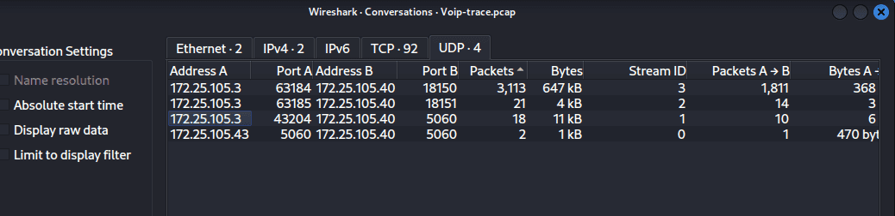
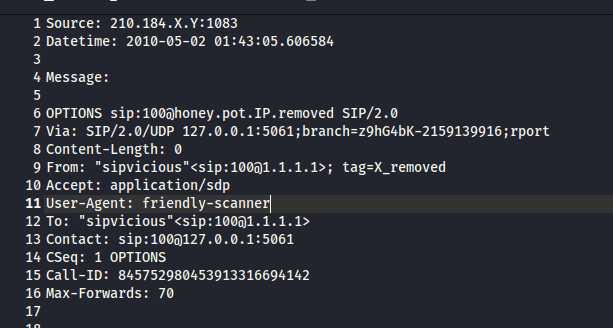
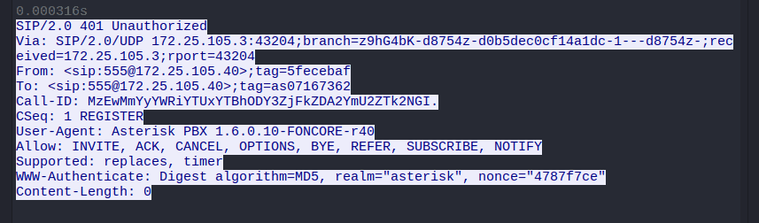
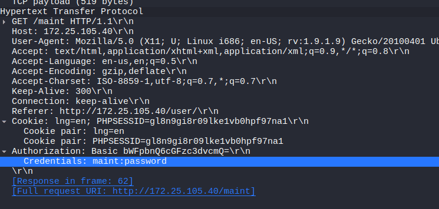
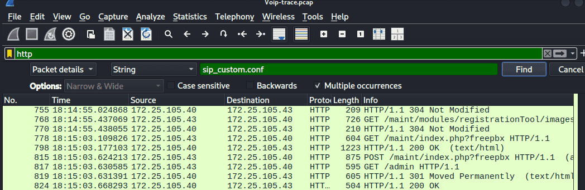
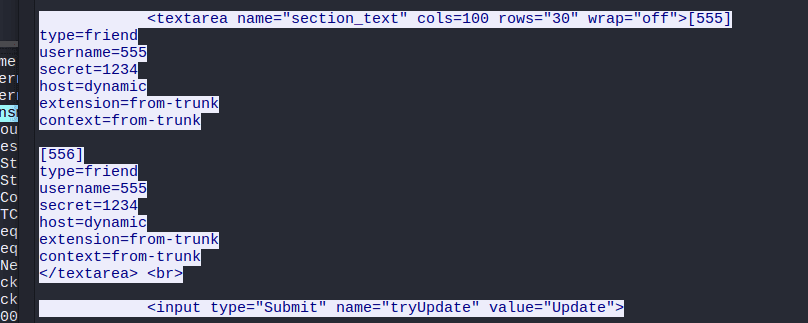
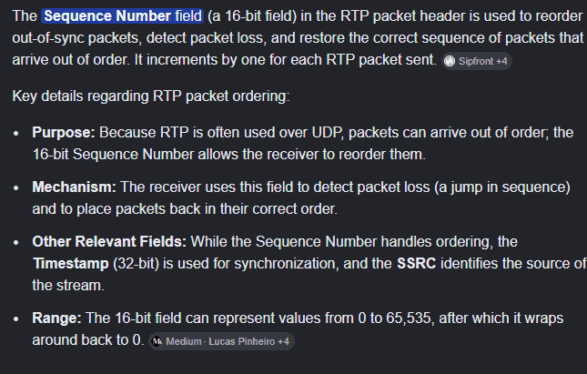

---


[https://cyberdefenders.org/blueteam-ctf-challenges/acoustic/](https://cyberdefenders.org/blueteam-ctf-challenges/acoustic/)


## SIP and SIPVicious {#35e7b0eb61a4808491c2f390ac646026}


### SIP {#35e7b0eb61a480eabe31db3aa6207902}


SIP (Session Initiation Protocol) acts like a "receptionist" for a VoIP PBX system. It does not transmit audio (voice) directly; instead, it is responsible for establishing, controlling, and terminating calls. Below are the most common methods used by SIP devices to communicate with each other:

- **REGISTER:** Similar to arriving at a hotel and telling the receptionist: 'I am employee 101, and I am currently at this IP address. If anyone calls 101, please route the call to me.' Attackers often abuse this method to brute-force passwords.
- **INVITE:** This is the action of picking up the phone and dialing a number. It conveys the message: 'Ring ring! I want to establish a call with you, are you available?'.
- **ACK:** After the receiving end picks up (responding with a `200 OK` code), the initiator sends an ACK to confirm the connection.
- **BYE:** The action of hanging up to terminate the call.
- **CANCEL:** Used when you call someone, the phone is ringing, but you change your mind and hang up before they answer.
- **OPTIONS:** Similar to a ping command. It is used to query whether the other end is online or to find out what features it supports. Attackers frequently use this command to scan a network for IPs running SIP servers.

### SIPVicious {#35e7b0eb61a48080ae7bfec9ee1fd9e7}


SIPVicious is a Python-based security suite designed to audit and attack SIP-based VoIP PBX systems. It is one of the most widely abused tools for automatically scanning and cracking VoIP systems globally, typically for toll fraud or eavesdropping. It consists of 5 main modules:

- **svmap:** Scans the network to discover active SIP devices or servers. It sends SIP OPTIONS requests everywhere and analyzes the responses to map the targets.
- **svwar:** Used for enumeration. Once a PBX system is found, it scans to identify valid extensions or usernames existing on that system.
- **svcrack:** An online password brute-force cracker. It continuously sends SIP REGISTER packets to guess passwords.
- **svreport:** Extracts and formats the results from the scanning and cracking sessions into a report file.
- **svcrash:** Sends deliberately malformed SIP packets to cause a Denial of Service (DoS). Attackers can also use this to counter-attack honeypots or malware analysis systems trying to trap them.

Detection Methods:

- User-Agent: Look for 'friendly-scanner' or 'SIPVicious'. Note that attackers can easily spoof or change this string.
- Network Anomalies: Monitor for sudden spikes in UDP traffic on Port 5060 or 5061. An `svcrack` attack will generate a 'storm' of rejected REGISTER requests (returning `401 Unauthorized` or `403 Forbidden` HTTP/SIP error codes) originating from a single IP address.
- PBX System Logs: When analyzing logs on PBX systems like Asterisk, FreePBX, or 3CX, a massive number of authentication attempts across sequential user ranges (e.g., scanning continuously from extension 1000 to 1999) is clear evidence of `svwar` activity

```c++
-------------------------
Source: 210.184.X.Y:5209
Datetime: 2010-05-02 01:49:56.063150

Message:

REGISTER sip:honey.pot.IP.removed SIP/2.0
Via: SIP/2.0/UDP 127.0.0.1:5089;branch=z9hG4bK-149719434;rport
Content-Length: 0
From: "102" <sip:102@honey.pot.IP.removed>
Accept: application/sdp
User-Agent: friendly-scanner
To: "102" <sip:102@honey.pot.IP.removed>
Contact: sip:123@1.1.1.1
CSeq: 1 REGISTER
Call-ID: 3489261283
Max-Forwards: 70


-------------------------
Source: 210.184.X.Y:5209
Datetime: 2010-05-02 01:49:56.693011

Message:

REGISTER sip:honey.pot.IP.removed SIP/2.0
Via: SIP/2.0/UDP 127.0.0.1:5089;branch=z9hG4bK-2386985930;rport
Content-Length: 0
From: "102" <sip:102@honey.pot.IP.removed>; tag=X_removed
Accept: application/sdp
User-Agent: friendly-scanner
To: "102" <sip:102@honey.pot.IP.removed>
Contact: sip:123@1.1.1.1
CSeq: 2 REGISTER
Call-ID: 680412875
Max-Forwards: 70
Authorization: Digest username="102",realm="localhost",nonce="2932135223",uri="sip:honey.pot.IP.removed",response="MD5_hash_removedXXXXXXXXXXXXXXXX",algorithm=MD5


```


This is an example of two consecutive packets sent by the attacker. Packet 1 is sent to trigger a response from the server, which replies with a `401 Unauthorized` error. For Packet 2, the attacker initiates the brute-force attempt: the tool takes the `nonce` string provided in the server's previous response, combines it with a guessed password (from a dictionary), and hashes everything using the MD5 algorithm to generate the `response` string sent back to the server."


## Basic triage {#35e7b0eb61a48047bfaff89d5a86c5e7}


| 172.25.105.3 - victim            | 172.25.105.40             |   |
| -------------------------------- | ------------------------- | - |
| 172.25.105.43 (Linux) - attacker | 172.25.105.40 (honey pot) |   |
|                                  |                           |   |


maint:password


172.25.105.43 (Linux)


ip.src==172.25.105.43 && http


### Q1 What is the transport protocol being used? {#3477b0eb61a4802ca841cba0323447e4}





Connection between 172.25.105.3 and 172.25.105.40 use mostly UDP 


UDP


### Q2 The attacker used a bunch of scanning tools that belong to the same suite. Provide the name of the suite. {#3477b0eb61a4806da7e3cc5417708be6}


Use provided logs: `"Friendly-scanner"` is a well-known User-Agent string associated with "SIPVicious," a set of open-source security tools used to scan and audit VoIP (Voice over IP) systems, often for malicious purposes





SIPVicious


### Q3 What is the User-Agent of the victim system? {#3477b0eb61a4802eb12ac37e38b6cf17}


filter: ip.addr==172.25.105.3 and follow UDP stream





Asterisk PBX 1.6.0.10-FONCORE-r40


### Q4 Which tool was only used against the following extensions: 100,101,102,103, and 111? {#3477b0eb61a48003bcbfeedb1b08aebc}


I use this command to find out attack pattern


```powershell
grep -E 'friendly-scanner' -A 1 log.txt | grep -oE "sip:(100|101|102|103|111)@" | sort | uniq -c
      4 sip:100@
    173 sip:101@
    171 sip:102@
    193 sip:103@
   1060 sip:111@          
```


There’s a clear sign of brute forcing into those accounts above. So the answer should be


svcrack.py


### Q5 Which extension on the honeypot does NOT require authentication? {#3477b0eb61a48068b8adfb0daa087bc8}


this authorization field is for user 101.


```powershell
Authorization: Digest username="101",realm="localhost",nonce="3711809134",uri="sip:honey.pot.IP.removed",response="MD5_hash_removedXXXXXXXXXXXXXXXX",algorithm=MD5

```


I use this command


```powershell
grep -oP 'Authorization: Digest username="\d+"' log.txt | sort | uniq
Authorization: Digest username="101"
Authorization: Digest username="102"
Authorization: Digest username="103"
Authorization: Digest username="111"
```


There is no Authorization field for username: 100


> 100 


### Q6 How many extensions were scanned in total? {#35e7b0eb61a480e6bff1e11d8378331c}


```c++
REGISTER sip:9994@honey.pot.IP.removed SIP/2.0
                                                                                                                                  
┌──(cuong_nguyen㉿Kali)-[~/Desktop/cyberdefenders.org/temp_extract_dir/Acoustic]
└─$ grep -Ei "REGISTER sip:" log.txt | grep -v "sip:honey.pot" | wc -l
2652

```


### Q7 There is a trace for a real SIP client. What is the corresponding user-agent? (two words, once space in between) {#3477b0eb61a48062b1bacdb5eadfb1a8}


i use this command to find all the user agent


```powershell
grep -Ei "User-agent" log.txt| uniq
User-Agent: friendly-scanner
User-Agent: Zoiper rev.6751
```


Zoiper rev.6751


### Q8 Multiple real-world phone numbers were dialed. What was the most recent 11-digit number dialed from extension 101? {#3477b0eb61a4801f944bff9830029dee}


Check for INVITE request type as we learned before. The “Uknown” is default value when creating INVITE request.


```c++
└─$ grep -Ei 'From: "Unknown"<sip:101' log.txt -B8 | grep INVITE
INVITE sip:900114382089XXXX@honey.pot.IP.removed;transport=UDP SIP/2.0
INVITE sip:00112322228XXXX@honey.pot.IP.removed;transport=UDP SIP/2.0
INVITE sip:00112524021XXXX@honey.pot.IP.removed;transport=UDP SIP/2.0

```


The most recent one is:


> 00112524021XXXX


### Q9 What are the default credentials used in the attempted basic authentication? (format is username:password) {#3477b0eb61a48041844fecbf29c98d0b}


search for `“password”` or `“credentials”` in the wireshark packet search box.





maint:password


### Q10 Which codec does the RTP stream use? (3 words, 2 spaces in between) {#3477b0eb61a4803faff6deb582dee766}


**ITU-T:** International Telecommunication Union (the agency that issued this standard).

- **G.711:** The code name for the audio codec standard designed for the human voice.
- **PCM (Pulse Code Modulation):** A technique that converts analog (natural) sound waves into digital signals (0s and 1s).
- **U (µ-law or Mu-law):** A specific companding (compressing and expanding) algorithm. _Note: There are two global versions of G.711: PCMU (µ-law, used mainly in North America and Japan) and PCMA (A-law, used in Europe and other regions)._
- **Sample Rate:** 8,000 Hz (8kHz). It only samples within the human voice frequency range (300Hz to 3400Hz) to save bandwidth.
- **Bitrate:** 64 kbps.
- **Quality:** It does not compress files like MP3, meaning the audio quality is lossless for voice. It sounds very clear, like a standard landline call. However, it consumes significantly more network bandwidth compared to modern codecs (like G.729 or Opus).

> **ITU-T G.711 PCMU**


### Q11 How long is the sampling time (in milliseconds)? {#3477b0eb61a480509b86cef5b1b79c11}


**Sample Rate (Frequency):** G.711 PCMU uses a frequency of 8,000 Hz (meaning 8,000 samples are taken per second). **Sampling Time (Period):** This is the duration required to take a single sample. The basic physics formula is T = 1/f."


> 1/8000=0.000125 = 0.125 ms


### Q12 What was the password for the account with username 555? {#3477b0eb61a48042a4d3f11a3a93afeb}


PBX systems like Asterisk or FreePBX need to download configuration files from a server to determine extension numbers and passwords. These are usually transmitted via FTP or HTTP. The vulnerability here is that the server allows downloading these `.conf` files without authentication. Attackers hunt for these files to extract passwords

- sip_custom.conf
- http.request.uri contains "sip_custom.conf”




Follow the TCP stream





> 1234


### Q13 Which RTP packet header field can be used to reorder out of sync RTP packets in the correct sequence? {#3477b0eb61a480baab62f69f0e7b6b2d}


I used google to do a search





But the Sequence number is not the answer. I tried the `timestamp` And turns out it is the correct one.


> timestamp


### Q14 The trace includes a secret hidden message. Can you hear it? {#3477b0eb61a4802c93b1ea153841c037}


Navigate to Telephony → VoIP calls → play streams. There are 2 voice streams. Listen you’ll find out the answer.


> mexico

