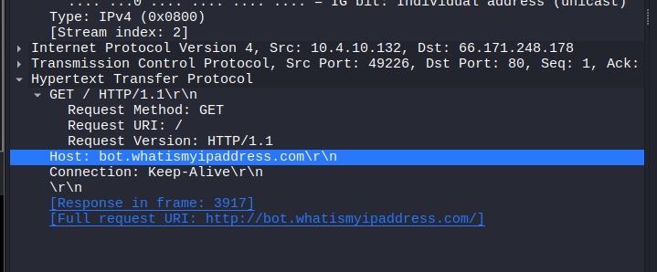

**Hawkeye** (hay đầy đủ là **HawkEye Keylogger / Stealer**) là một dòng mã độc đánh cắp thông tin (InfoStealer) và ghi lại thao tác bàn phím (Keylogger) khét tiếng. Nó đã tồn tại và hoạt động hơn 14 năm, ban đầu được bán công khai như một phần mềm theo dõi thương mại (crimeware) trên các diễn đàn ngầm.

- Hawkeye đã tiến hóa thành một InfoStealer toàn diện và có khả năng đóng vai trò như một phần mềm trung gian ("Loader") để tải thêm các mã độc khác xuống máy tính nạn nhân.
- **Mục tiêu chính:** Mã độc này thường nhắm vào các doanh nghiệp vừa và nhỏ (SMBs) thông qua các chiến dịch thư rác (malspam/phishing) quy mô lớn trên toàn cầu để đánh cắp tài khoản và thông tin nội bộ.

### Hành vi và Khả năng (Capabilities) {#3467b0eb61a4806f9b98cb9f71d0e292}


Một khi xâm nhập thành công hệ thống, Hawkeye sẽ "nằm vùng" và tiến hành các hoạt động giám sát ngầm:

- Ghi lại mọi thao tác gõ phím, đánh cắp mật khẩu được lưu trữ trong trình duyệt web và các ứng dụng email của nạn nhân.
- Bí mật chụp ảnh màn hình, giám sát các hoạt động mạng, hoặc thậm chí kích hoạt camera/microphone trên thiết bị bị nhiễm.
- Toàn bộ dữ liệu thu thập được sẽ được đóng gói và lén lút gửi về cho máy chủ điều khiển (C2 Server) của kẻ tấn công thông qua Email (SMTP), giao thức FTP hoặc Web panel.

### 3. Phương thức Lây nhiễm (Infection Vector) {#3467b0eb61a480b4b09de4913e9fa918}


Hawkeye chủ yếu phát tán thông qua việc lừa đảo thao tác của người dùng:

- **Email ngụy trang:** Kẻ tấn công gửi các email lừa đảo đội lốt hóa đơn thương mại, biên lai thanh toán hoặc thông báo khẩn cấp từ ngân hàng.
- **Tệp đính kèm độc hại:** Mã độc thường nấp dưới dạng các file tài liệu như `.docx` hoặc `.xls`. Ví dụ, Hawkeye thường xuyên khai thác lỗ hổng bảo mật của Microsoft Equation Editor (CVE-2017-11882). Khi nạn nhân vô tình mở file tài liệu này, mã độc sẽ tự động trích xuất vào thư mục `%temp%` và âm thầm thực thi.
- **Kỹ thuật lẩn tránh (Evasion):** Hawkeye lợi dụng các tiến trình hợp lệ của Windows (như `mshta.exe` hoặc PowerShell) để vượt qua các lớp phòng thủ của phần mềm diệt virus, đồng thời can thiệp vào Registry để tự động khởi chạy cùng hệ điều hành.

| 10.4.10.132 | 217.182.138.150 |   |
| ----------- | --------------- | - |
|             | 10.4.10.4       |   |
|             | 23.229.162.69   |   |
|             | 239.255.255.250 |   |
|             | 224.0.0.252     |   |
|             | 216.58.193.131  |   |


Q1 How many packets does the capture have?


Q2 At what time was the first packet captured (UTC)?


Q3 What is the duration of the capture?


Q4 What is the most active computer at the link level?


00:08:02:1c:47:ae


Q5 Manufacturer of the NIC of the most active system at the link level?


Hewlett-Packard


Q6 Where is the headquarter of the company that manufactured the NIC of the most active computer at the link level?


Q7 The organization works with private addressing and netmask /24. How many computers in the organization are involved in the capture?


3


Q8 What is the name of the most active computer at the network level?


10.4.10.132 [BEIJING-5CD1-PC] [beijing-5cd1-pc] [Beijing-5cd1-PC] (Windows)


Q9 What is the IP of the organization's DNS server?


Q10 What domain is the victim asking about in packet 204?


proforma-invoices.com: type A, class IN


Q11 What is the IP of the domain in the previous question?


[proforma-invoices.com](http://proforma-invoices.com/): type A, class IN, addr 217.182.138.150


Q12 Indicate the country to which the IP in the previous section belongs.


france


Q13 What operating system does the victim's computer run?


Q14 What is the name of the malicious file downloaded by the accountant?


Request URI: /proforma/tkraw_Protected99.exe


Q15 What is the md5 hash of the downloaded file?


Q16 What software runs the webserver that hosts the malware?


Q17 What is the public IP of the victim's computer?





Q18


In which country is the email server to which the stolen information is sent?


Q19 Analyzing the first extraction of information. What software runs the email server to which the stolen data is sent?


Q20 To which email account is the stolen information sent?


```c++
HawkEye Keylogger - Reborn v9
Passwords Logs
roman.mcguire \ BEIJING-5CD1-PC

==================================================
URL               : https://login.aol.com/account/challenge/password
Web Browser       : Internet Explorer 7.0 - 9.0
User Name         : roman.mcguire914@aol.com
Password          : P@ssw0rd$
Password Strength : Very Strong
User Name Field   : 
Password Field    : 
Created Time      : 
Modified Time     : 
Filename          : 
==================================================

==================================================
URL               : https://www.bankofamerica.com/
Web Browser       : Chrome
User Name         : roman.mcguire
Password          : P@ssw0rd$
Password Strength : Very Strong
User Name Field   : onlineId1
Password Field    : passcode1
Created Time      : 4/10/2019 2:35:17 AM
Modified Time     : 
Filename          : C:\Users\roman.mcguire\AppData\Local\Google\Chrome\User Data\Default\Login Data
==================================================

==================================================
Name              : Roman McGuire
Application       : MS Outlook 2002/2003/2007/2010
Email             : roman.mcguire@pizzajukebox.com
Server            : pop.pizzajukebox.com
Server Port       : 995
Secured           : No
Type              : POP3
User              : roman.mcguire
Password          : P@ssw0rd$
Profile           : Outlook
Password Strength : Very Strong
SMTP Server       : smtp.pizzajukebox.com
SMTP Server Port  : 587
==================================================


```


Q21 What is the password used by the malware to send the email?


[sales.del@macwinlogistics.in](mailto:sales.del@macwinlogistics.in)


Sales@23


Q22 Which malware variant exfiltrated the data?


Q23 What are the bankofamerica access credentials? (username:password)


Q24 Every how many minutes does the collected data get exfiltrated?


`smtp.req.command == "EHLO”` :


**EHLO (Extended HELLO):** Trong giao thức SMTP, khi một máy tính (Client) muốn gửi email, việc đầu tiên nó bắt buộc phải làm khi kết nối với máy chủ Email (Server) là gửi một lệnh chào hỏi để tự xưng danh. Lệnh đó chính là `EHLO` (hoặc `HELO` ở các bản cũ).


Mỗi phiên thì phải gửi một helo

