[https://cyberdefenders.org/blueteam-ctf-challenges/hawkeye/](https://cyberdefenders.org/blueteam-ctf-challenges/hawkeye/)


HawkEye is a type of credential-stealing Trojan malware (spyware) that functions primarily as a keylogger, designed to steal sentitive data from victims. It’s have been active since 2013 and is sold on dark web forum as MaaS.


## Basic triage {#3597b0eb61a480e5ad46fc8a86fc6979}


| 10.4.10.132 | 217.182.138.150 |   |
| ----------- | --------------- | - |
|             | 10.4.10.4       |   |
|             | 23.229.162.69   |   |
|             | 239.255.255.250 |   |
|             | 224.0.0.252     |   |
|             | 216.58.193.131  |   |


### Q1 How many packets does the capture have? {#3467b0eb61a48013bd38e42eb2098aac}


4003


### Q2 At what time was the first packet captured (UTC)? {#3467b0eb61a4802c9f34e0e9ec8e8126}


`2019-04-10 20:37:07 UTC`


### Q3 What is the duration of the capture? {#3467b0eb61a48072aa88c64d5df71cb7}


`01:03:41`


### Q4 What is the most active computer at the link level? {#3467b0eb61a480b99489e2e28baddf76}


00:08:02:1c:47:ae


### Q5 Manufacturer of the NIC of the most active system at the link level? {#3467b0eb61a480f4b7feea58fbf22b87}


Hewlett-Packard


### Q6 Where is the headquarter of the company that manufactured the NIC of the most active computer at the link level? {#3467b0eb61a480df9b7fcdf2e1191e31}


Palo Alto


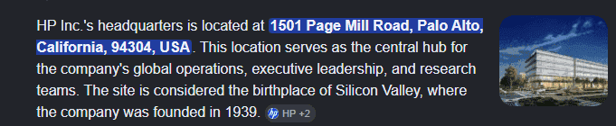


### Q7 The organization works with private addressing and netmask /24. How many computers in the organization are involved in the capture? {#3467b0eb61a48013a983ed208afee1ed}


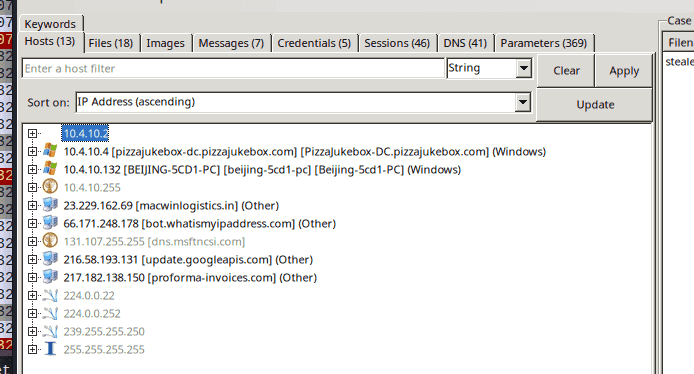


3


### Q8 What is the name of the most active computer at the network level? {#3467b0eb61a4805db041e5cf52a96044}


`10.4.10.132 [BEIJING-5CD1-PC] [beijing-5cd1-pc] [Beijing-5cd1-PC] (Windows)`


### Q9 What is the IP of the organization's DNS server? {#3467b0eb61a480ef8b30e904c9d98266}


Using the dns filter, check for the destination IP, we can easily figure out:


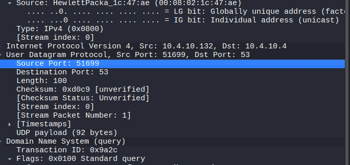


`10.4.10.4`


### Q10 What domain is the victim asking about in packet 204? {#3467b0eb61a48078a0a1f795f7ad0c91}


proforma-invoices.com: type A, class IN


### Q11 What is the IP of the domain in the previous question? {#3467b0eb61a480acbc9ed95b3b8b786e}


proforma-invoices.com: type A, class IN, addr 217.182.138.150


### Q12 Indicate the country to which the IP in the previous section belongs. {#3467b0eb61a480fc924bc10679e808d9}


using whois website like: ipinfo


`france`


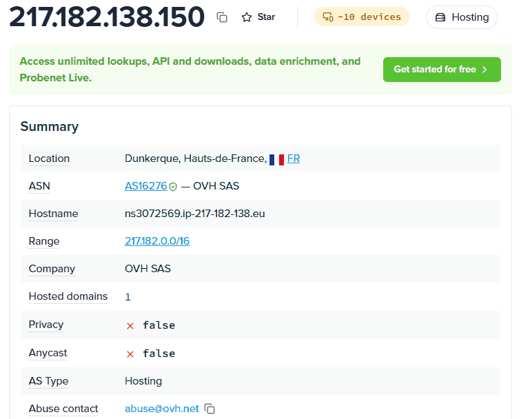


### Q13 What operating system does the victim's computer run? {#3467b0eb61a48072a8f1d63f235f2b57}


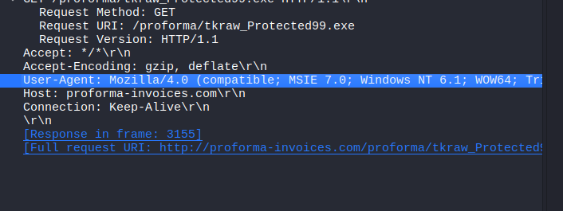


### Q14 What is the name of the malicious file downloaded by the accountant? {#3467b0eb61a480bbb7e5e5aa47d87ea8}


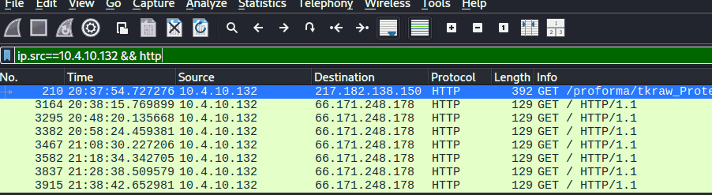


Request URI: /proforma/tkraw_Protected99.exe


### Q15 What is the md5 hash of the downloaded file? {#3467b0eb61a48085ae5de665d7115de4}


Using networkminer to extract the file


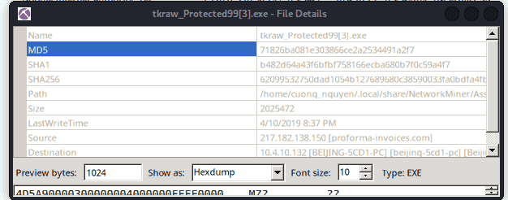


`71826ba081e303866ce2a2534491a2f7`


### Q16 What software runs the webserver that hosts the malware? {#3467b0eb61a48066adeeccba2ec49398}


`http contains "This program”` to find the packet with executable file follow TCP stream


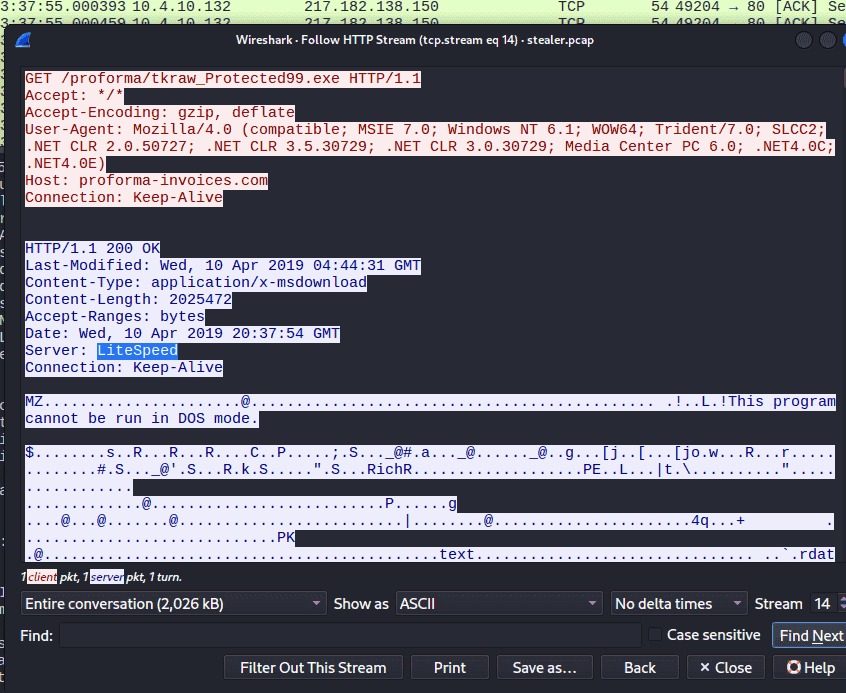


> `LiteSpeed`


### Q17 What is the public IP of the victim's computer? {#3467b0eb61a48004a69cd65339d95e5c}


To know the public ip, attacker have to navigate to the internet:


`http contains "ip”`


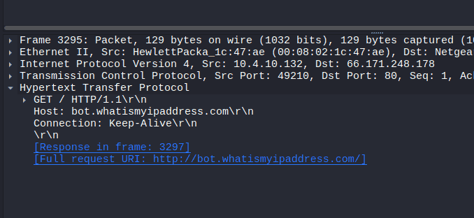


Then follow the TCP stream


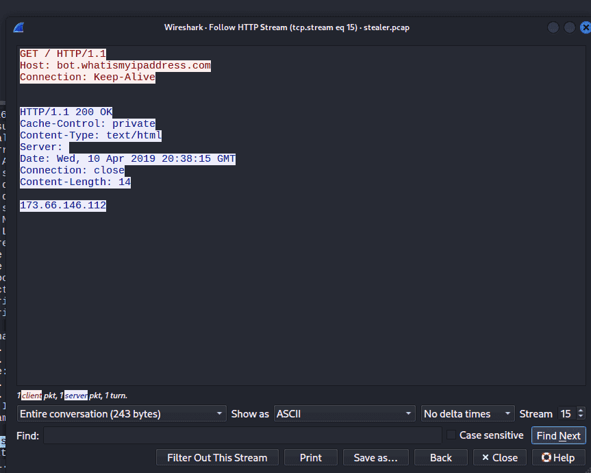


`173.66.146.112`


### Q18 In which country is the email server to which the stolen information is sent? {#3467b0eb61a480448d7dde9106f795ce}


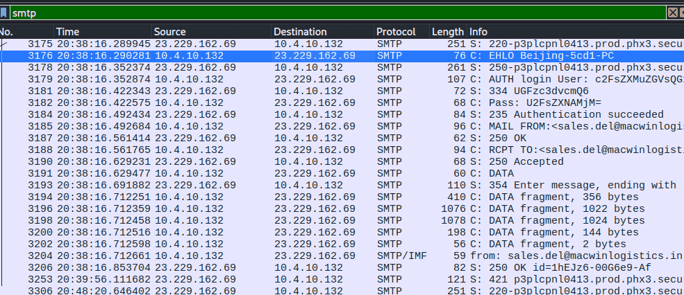


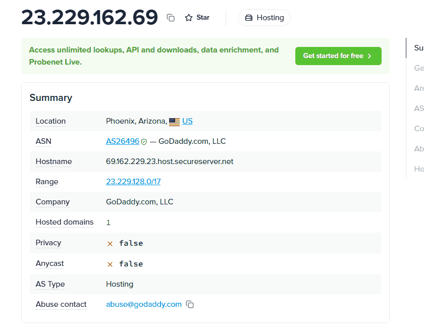


United States


### Q19 Analyzing the first extraction of information. What software runs the email server to which the stolen data is sent? {#3467b0eb61a480c4b578c9a2b4689366}


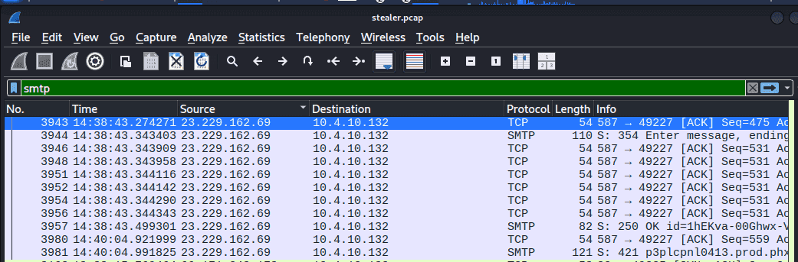


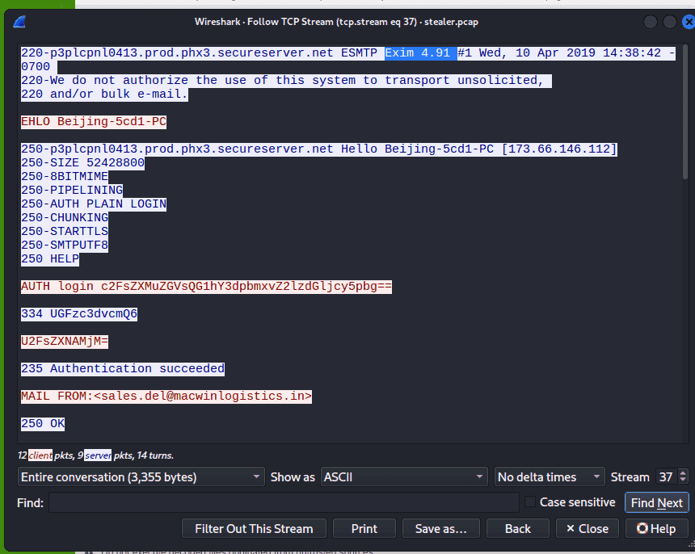


### Q20 To which email account is the stolen information sent? {#3467b0eb61a480dcb8a1d801867dc748}


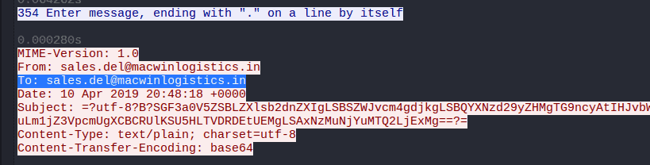


### Q21 What is the password used by the malware to send the email? {#3467b0eb61a480c883a0d1c28d8d981c}


The password is encoded with base64


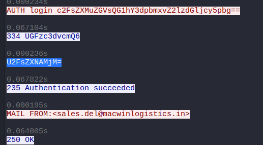


Sales@23


i also extracted the email and decode the content


```c++
HawkEye Keylogger - Reborn v9
Passwords Logs
roman.mcguire \ BEIJING-5CD1-PC

==================================================
URL               : https://login.aol.com/account/challenge/password
Web Browser       : Internet Explorer 7.0 - 9.0
User Name         : roman.mcguire914@aol.com
Password          : P@ssw0rd$
Password Strength : Very Strong
User Name Field   : 
Password Field    : 
Created Time      : 
Modified Time     : 
Filename          : 
==================================================

==================================================
URL               : https://www.bankofamerica.com/
Web Browser       : Chrome
User Name         : roman.mcguire
Password          : P@ssw0rd$
Password Strength : Very Strong
User Name Field   : onlineId1
Password Field    : passcode1
Created Time      : 4/10/2019 2:35:17 AM
Modified Time     : 
Filename          : C:\Users\roman.mcguire\AppData\Local\Google\Chrome\User Data\Default\Login Data
==================================================

==================================================
Name              : Roman McGuire
Application       : MS Outlook 2002/2003/2007/2010
Email             : roman.mcguire@pizzajukebox.com
Server            : pop.pizzajukebox.com
Server Port       : 995
Secured           : No
Type              : POP3
User              : roman.mcguire
Password          : P@ssw0rd$
Profile           : Outlook
Password Strength : Very Strong
SMTP Server       : smtp.pizzajukebox.com
SMTP Server Port  : 587
==================================================


```


### Q22 Which malware variant exfiltrated the data? {#3467b0eb61a4803a8fefdd47bfc2ed50}


```powershell
HawkEye Keylogger - Reborn v9
```


### Q23 What are the bankofamerica access credentials? (username:password) {#3467b0eb61a480e9bc0acef25e87f453}


```powershell
User Name         : roman.mcguire
Password          : P@ssw0rd$
```


### Q24 Every how many minutes does the collected data get exfiltrated? {#3467b0eb61a4809ca85bdd637ff7601c}


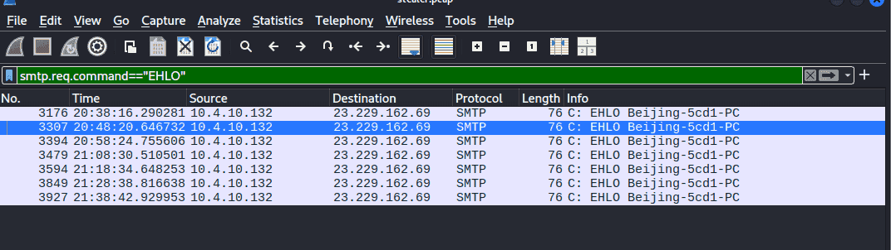


In SMTP, when a client want to send an email, first they need to connect with the email server and send a HELLO (for earlier version) or EHLO (extended HELLO). So we use the filter`smtp.req.command == "EHLO”` to extract when the attacker initial a new session. We can see each session is 10 minutes apart.


> 10

