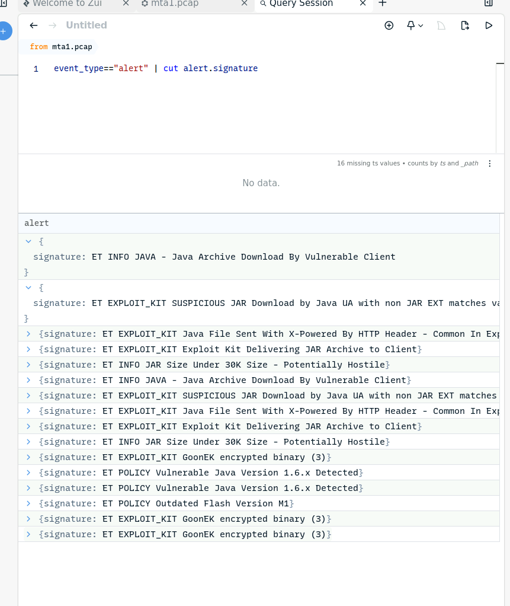
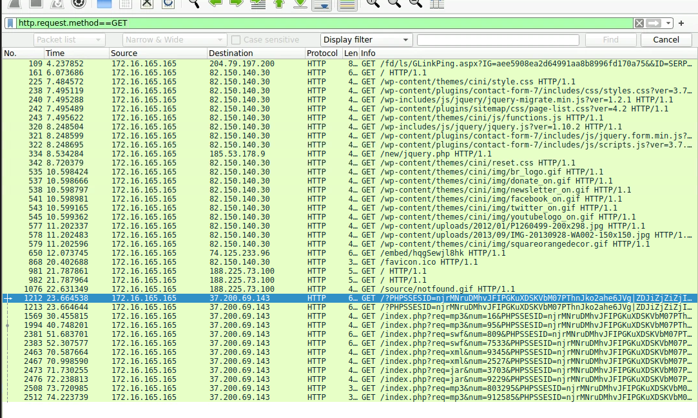

172.16.165.165: 37.200.69.143

74.125.233.96

82.150.140.30

204.79.197.200

188.225.73.100

172.16.165.254

### 3 {#3447b0eb61a480f485cdc7bed09c556e}

2014-11-16T02:13:10.986516Z   37.200.69.143

### Q1 What is the IP address of the Windows VM that gets infected? {#3447b0eb61a480eda822e8ab8f838b38}

2014-11-16T02:13:10.986516Z

	src_ip:37.200.69.143

	src_port: 80

	dest_ip: 172.16.165.165

### Q2 What is the IP address of the compromised web site? {#3447b0eb61a480f0b468dbb6c7ea3e69}

**Mục tiêu:** Kẻ tấn công đang cố gắng đẩy các file khai thác lỗi (Exploits) khác nhau (Flash - `.swf`, Java - `.jar`, Silverlight...) xuống máy nạn nhân (`172.16.165.165`).

**IP** **`82.150.140.30`****:** Có vẻ là một trang WordPress bị chiếm quyền (compromised). Bạn thấy rất nhiều yêu cầu đến `/wp-content/themes/...`.

	**Sự chuyển hướng:** Khả năng cao trang web này đã bị chèn mã độc (mã iframe hoặc script ẩn), tự động chuyển hướng người dùng từ trang web sạch sang "ổ kiến lửa" ở IP `37.200.69.143`.
	

### Q3 What is the IP address of the server that delivered the exploit kit and malware? {#3447b0eb61a480a790a0d2f9500fe73a}

37.200.69.143

### Q4 What is the FQDN of the compromised website? {#3447b0eb61a480ec877ddce4b9bb7815}

82.150.140.30 [www.ciniholland.nl] (Other)

### Q5 What is the FQDN that delivered the exploit kit and malware? {#3447b0eb61a48065b494e375afbdd2c7}

37.200.69.143 [stand.trustandprobaterealty.com] (Other)

### Q6 What is the redirect URL that points to the exploit kit (EK) landing page? {#3447b0eb61a4806ea153c7a6ca72e50f}

Referer: [http://24corp-shop.com/](http://24corp-shop.com/)

### Q7 Other than CVE-2013-2551 IE exploit, another application was targeted by the EK and starts with "J". Provide the full application name. {#3447b0eb61a4802780ebf299149c1d36}

### Q8 How many times was the payload delivered? {#3447b0eb61a48041baa9d20b92d5bf34}

- **Dòng 2394 & 2415 (****`application/x-shockwave-flash`****):** Máy chủ gửi về các file Flash (.swf). Đây là kỹ thuật khai thác lỗi Adobe Flash Player cực kỳ phổ biến trong các bộ EK (như Angler hoặc Neutrino).
- **Dòng 2489 & 2502 (****`application/java-archive`****):** Kẻ tấn công gửi tiếp các file Java (.jar) để khai thác nếu Flash không thành công.
- **Dòng 1991, 2379 và đặc biệt là 2977 (****`application/x-msdownload`****):** Đây chính là "nhân vật chính". Sau khi các file Flash hoặc Java khai thác thành công lỗ hổng trình duyệt, chúng sẽ tự động tải các file thực thi này về.
	- **MTA Tip:** Thông thường, dòng `application/x-msdownload` cuối cùng (dòng 2977) chính là file mã độc thực sự (như Ransomware hoặc Trojan) sẽ chạy trên máy nạn nhân.

### Q9 The compromised website has a malicious script with a URL. What is this URL? {#3447b0eb61a4807ea6e0f0b7c0be40c0}

[http://24corp-shop.com/](http://24corp-shop.com/)

### Q10 Extract the two exploit files. What are the MD5 file hashes? (comma-separated ) {#3447b0eb61a480d0954ee29748721ff0}

7b3baa7d6bb3720f369219789e38d6ab  index.php.swf
1e34fdebbf655cebea78b45e43520ddf index.php[1].jar

# Tổng kết {#3447b0eb61a480fd8646da3f5ecfd177}

### Cơ chế tấn công của Exploit kit {#3447b0eb61a480928cf2df1767445715}

- Khi nạn nhân 172.16.165.165 truy cập vào wordpress 82.150.140.30 thông qua tìm kiếm trên bing. Kẻ tấn công đã chiếm quyền trang web từ trước và chèn các mã độc javascript ẩn
- Chuyển hướng ngầm: khi nạn nhân tải trang thì script ẩn sẽ tự động kích hoạt và điều hướng sang [24corp-shop](http://24corp-shop.com/)[.]com mà người dùng không biết
- Từ máy chủ trung gian, nạn nhân tiếp tục bị đẩy tới máy chủ chứa exploit kit thực sự 37.200.69.143
	- Mục tiêu EK là dò xem trình duyệt có đang sử dụng lỗ hổng lỗi thời không. Các hệ thống suricata bắt được hành vi này qua cảnh báo vulnerable java version và outdated flash version
- **Xuyên thủng trình duyệt:** Nếu máy nạn nhân dính lỗ hổng (ví dụ: dùng bản Flash cũ), hai file mã khai thác (có mã băm MD5 là `7b3baa7d6bb3720f369219789e38d6ab` cho file `.swf` và `1e34fdebbf655cebea78b45e43520ddf` cho file `.jar`) sẽ thực thi thành công shellcode ngay trên bộ nhớ máy.
