[https://cyberdefenders.org/blueteam-ctf-challenges/malware-traffic-analysis-1/](https://cyberdefenders.org/blueteam-ctf-challenges/malware-traffic-analysis-1/)

---

## Basic triage {#3597b0eb61a4804ba93defafb1f2b6d5}

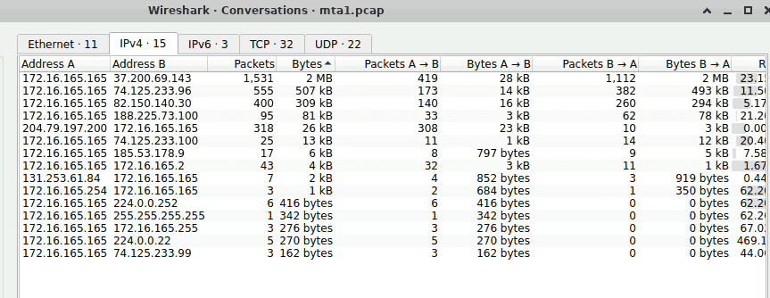

First we extract all the related ip, and use networkminer to extract host name:

| 172.16.165.165 [K34EN6W3N-PC] (Windows) |                |                                                |
| --------------------------------------- | -------------- | ---------------------------------------------- |
|                                         | 37.200.69.143  | `[stand.trustandprobaterealty.com]`            |
|                                         | 74.125.233.96  | youtube                                        |
|                                         | 82.150.140.30  | `82.150.140.30 [www.ciniholland[.]nl] (Other)` |
|                                         | 204.79.197.200 | Bings                                          |
|                                         | 188.225.73.100 | `[24corp-shop[.]com] (Other)`                  |
|                                         | 172.16.165.254 | none                                           |

Base on 172.16.165.165 is a windows pc and should be the victim.

Take look at Zui Alert using: `event_type=="alert" alert.severity==1 | cut src_ip,dest_ip, alert.signature`

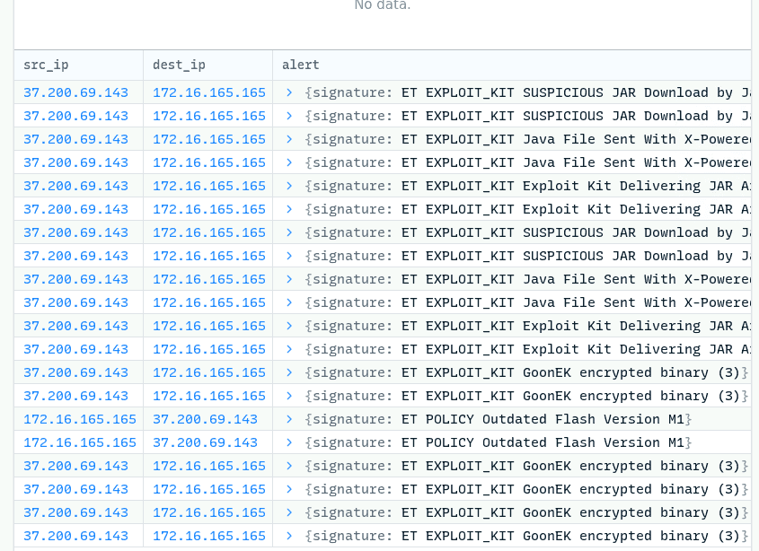

All the alerts also relate to 172.16.165.165 

### Q1 What is the IP address of the Windows VM that gets infected? {#3447b0eb61a480eda822e8ab8f838b38}

2014-11-16T02:13:10.986516Z

	src_ip:37.200.69.143

	src_port: 80

	dest_ip: `172.16.165.165`

### Q2 What is the IP address of the compromised web site? {#3447b0eb61a480f0b468dbb6c7ea3e69}

Gotta use the basic query: `ip.addr==172.16.165.165 &&http` then follow TCP stream

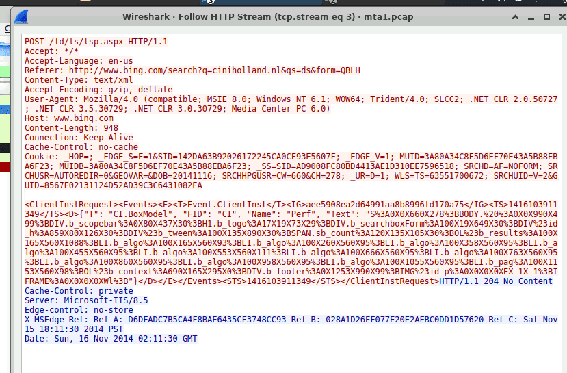

Seem like the user access to: 82.150.140.30 `[www.ciniholland[.]nl]` after searching on Bing

To actually check `[www.ciniholland[.]nl]` is compromised, i used this query: `http.referer contains "http://www.ciniholland.nl"` 

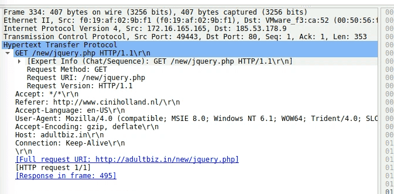

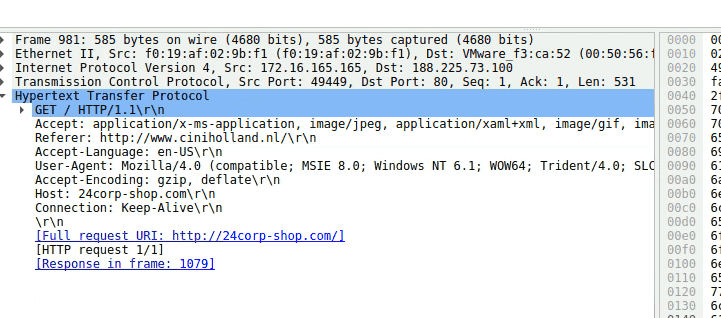

The website redirect to `188.225.73.100[24corp-shop[.]com]`  and 

`185.53.178.9`	`[adultbiz[.]in` 	GET /new/jquery.php HTTP/1.1 

in which jquery.php is Javascript library, and legitimate requests always end in `.js` not `.php`

→ the compromised website is `82.150.140.30 [www.ciniholland[.]nl]` 

### Q3 What is the IP address of the server that delivered the exploit kit and malware? {#3447b0eb61a480a790a0d2f9500fe73a}

Exploit kit often times deliver with .swf (shockwave flash file), which is famous with a lot of vulnerabilities that can be exploited by EK (famously Angler EK)

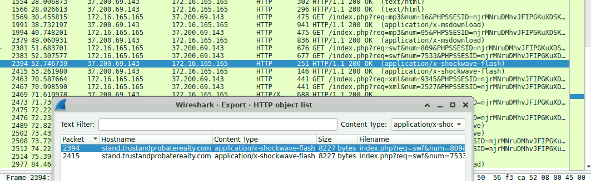

Using export HTTP object and choose x-shockwave-flash we got the ip `37.200.69.143` as the suspicious one.

using `http.host == "stand.trustandprobaterealty.com"` filter

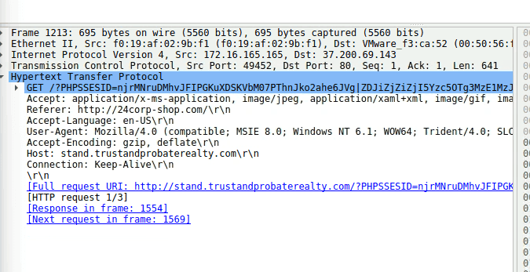

we see that the page was directed from `188.225.73.100[24corp-shop[.]com]`  as in the previous question

→ `37.200.69.143`

### Q4 What is the FQDN of the compromised website? {#3447b0eb61a480ec877ddce4b9bb7815}

82.150.140.30 [www.ciniholland.nl] (Other)

### Q5 What is the FQDN that delivered the exploit kit and malware? {#3447b0eb61a48065b494e375afbdd2c7}

37.200.69.143 [stand.trustandprobaterealty.com] (Other)

### Q6 What is the redirect URL that points to the exploit kit (EK) landing page? {#3447b0eb61a4806ea153c7a6ca72e50f}

Referer: http://24corp-shop.com/

### Q7 Other than CVE-2013-2551 IE exploit, another application was targeted by the EK and starts with "J". Provide the full application name. {#3447b0eb61a4802780ebf299149c1d36}

`Java`

The answer is obvious - jar - package format based on the ZIP file format, used to bundle multiple Java class files, associated metadata, and resources (text, images, audio) into a single file

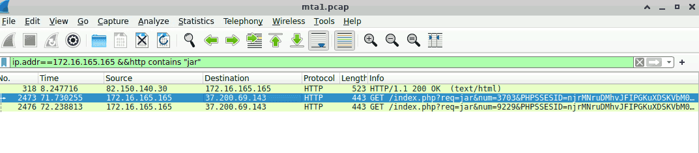

### Q8 How many times was the payload delivered? {#3447b0eb61a48041baa9d20b92d5bf34}

We knew that attacker employed `http&&ip.src==37.200.69.143` to deliver EK

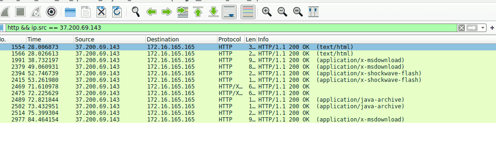

- **`application/x-shockwave-flash`** **: exploiting Adobe flash player**
- **`application/java-archive`** **: JAVA exploit**
- `application/x-msdownload:`  the main payload
- calculate the hash show that it a data file

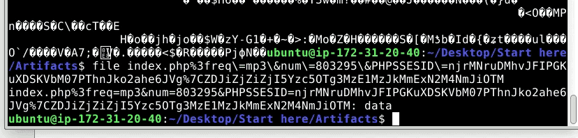

### Q9 The compromised website has a malicious script with a URL. What is this URL? {#3447b0eb61a4807ea6e0f0b7c0be40c0}

Using `ip.addr==82.150.140.30 && http contains "<script>”` filter, i found only one packet that have the script lead to: `http://24corp-shop[.]com/`

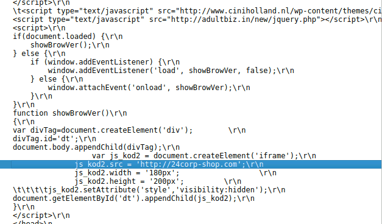

### Q10 Extract the two exploit files. What are the MD5 file hashes? (comma-separated ) {#3447b0eb61a480d0954ee29748721ff0}

Using networkminer and extract the respective hashes

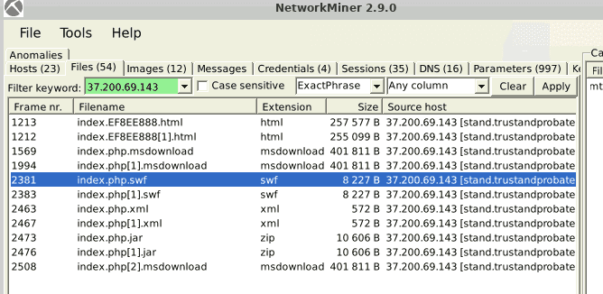

7b3baa7d6bb3720f369219789e38d6ab  index.php.swf
1e34fdebbf655cebea78b45e43520ddf index.php[1].jar

## The Attack chain {#3447b0eb61a480fd8646da3f5ecfd177}

- The user access 82.150.140.30 `[www.ciniholland[.]nl]` (which was already compromised and taken over by attacker - waiting for the prey) by searching the website from Bings.
	- The website then silently redirect user to 2 malicious website:
		- `188.225.73.100[24corp-shop[.]com]` -  transfer station
		- `185.53.178.9 adultbiz[.]in`  - initial malicious script loader (jquery.php)
- From  `188.225.73.100[24corp-shop[.]com]` attacker continue to redirect user to `37.200.69.143 [stand.trustandprobaterealty[.]com]`  - the attacker base camp
	- Attacker then try to exploit adobe flash and java vulnerabilities by sending swf, jar
	- then send the payload index.php.msdownload to proceed other malicious intention.
