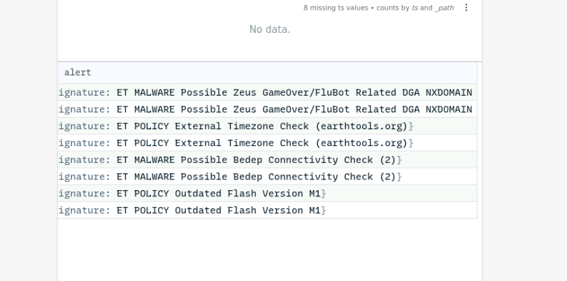
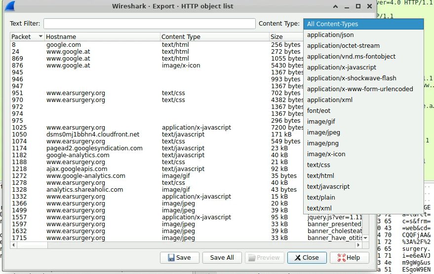
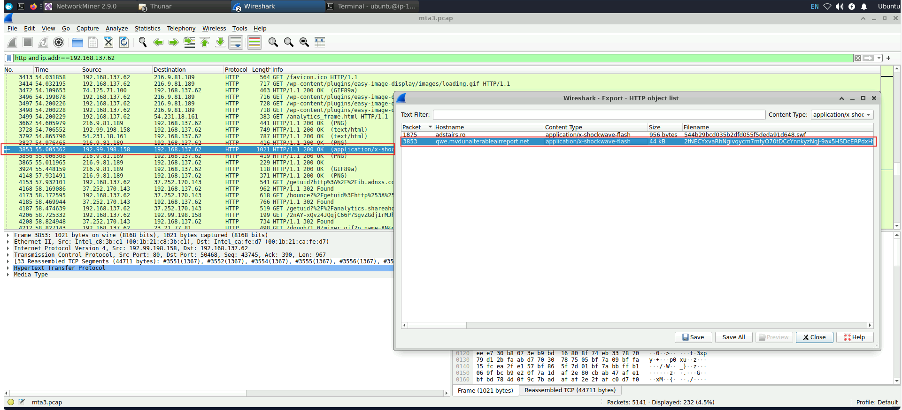
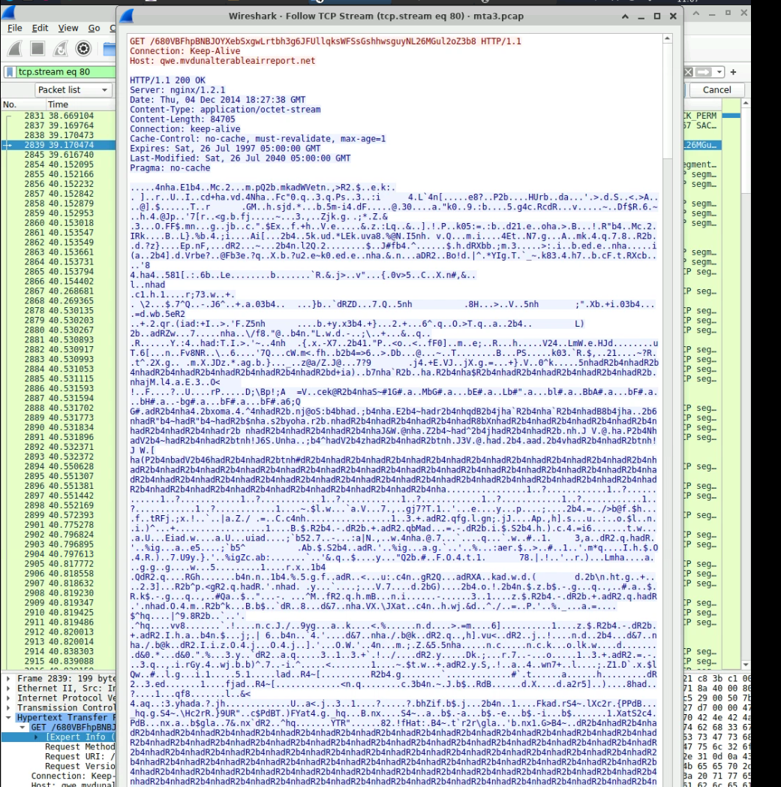

192.168.137.62 216.9.81.189


| source         | des              |                                                                                                                                                               |
| -------------- | ---------------- | ------------------------------------------------------------------------------------------------------------------------------------------------------------- |
| 192.168.137.62 | 216.9.81.189     |                                                                                                                                                               |
|                | 74.125.232.69    |                                                                                                                                                               |
|                | 209.126.97.209   |                                                                                                                                                               |
|                | 173.194.116.111  |                                                                                                                                                               |
|                | `192.99.198.158` |                                                                                                                                                               |
|                | 192.168.137.1    |                                                                                                                                                               |
|                | 173.194.116.109  | http post:’ ghi vào thông tin nạn nhân                                                                                                                        |
| 192.168.137.62 | 93.114.64.118    | ET POLICY Outdated Flash Version M1"<br/>,<br/>category:<br/>"Potential Corporate Privacy Violation"<br/>Dùng flash cũ                                        |
| 192.168.137.62 | 208.113.226.171  | ET MALWARE Possible Bedep Connectivity Check (2)"<br/>category:<br/>"A Network Trojan was detected"<br/>Lợi dụng tải trojan                                   |
| 192.168.137.1  | 192.168.137.62   | signature:<br/>"ET MALWARE Possible Zeus GameOver/FluBot Related DGA NXDOMAIN Responses"<br/>,<br/>category:<br/>"A Network Trojan was detected"<br/>,<br/>C2 |





### Q1 What is the IP address of the infected Windows host? {#3447b0eb61a480569056f98f9897c117}


192.168.137.62


Trong network miner tìm một host windows: thấy một host với lưu lượng kết nối nhiều file, ongoing session là 137 → có thể là C2


### Q2 What is the Exploit kit (EK) name? (two words) {#3447b0eb61a48013adf3e90979d329fe}


**Angler EK**


Nhìn chung exploit kit là công cụ exploit, lợi dụng việc người dùng vào một trang web đã nhiễm độc, và lợi dụng lỗ hổng trên trình duyêt, plugins, hoặc app để tấn công. Các công cụ nổi tiếng là Angler, RIG, Neutrino.





ta tính hash và biết nó được ek nào


Một chi tiết nữa là trong HTTP POST ta phát hiện


`ip=`6gS5EYVkyXL3vjVSQg%3D%3D&`ua=`tlP7Vt89hmr0vjdAW8YqmDT%2FsGFiyxROsPBX45R6HhinEeZC%2BYGrgEA0mmA3NDIJUYzgWXCjQvX0Bz9J7EQJgwkNdqBPbg%3D%3D&`furl=`s0j1T4l%2ByDS29SkNBcEwmyXysG1yxhMZ9fxN%2BIM%2FV1nlXuhb9Zvg3E8jwD0hd3xEWA%3D%3D

ip= ip nạn nhân


ua= user-agent


furl= found url hoặc referer url


"đặc sản" của các bộ **Exploit Kit (EK)**, đặc biệt là **Angler EK**.


### Q3 What is the FQDN that delivered the exploit kit? {#3447b0eb61a480e9a249d44abfde4a11}


192.99.198.158 [qwe.mvdunalterableairreport.net]


Ta bấm vào exploit kit thì tìm ra được IP





### Q4 What is the redirect URL that points to the exploit kit landing page? {#3447b0eb61a4805d8a33d59d04402c49}


Thông thường thì EK không bao giờ hoạt động một mình mà dựa trên traffic distribution system và malvertising compaign để chuyển người dùng từ website bình thường tới website độc hại


Trong đó cái redirect thường được embedded trong cái website bị nhiễm (compromised) ở trong javascript, hoặc iframe links


Ta dùng bộ lọc: http.host == qwe.mvdunalterableairreport.net và tìm trường http referer


http://lifeinsidedetroit.com/02024870e4644b68814aadfbb58a75bc.php?q=e8bd3799ee8799332593b0b9caa1f426


Tức là nạn nhân không gửi redirect tới EK’server mà được redirect từ thằng lifeindetroit (compromised). 


TDS: phân phối lưu lượng mạng

	- Kiểm tra IP, trình duyệt, phiên bản flash/java của nạn nhân
	- Nếu nhận ra người dùng có lỗ hổng thì sẽ redirect tới trang web có cái EK
- Malvertising: có thể trang web lifeindetroit vô hại nhưng chủ web lại có đặt quảng cáo độc hại (hacker mua khung iframe đó). Nạn nhân chỉ cần vào web thôi banner hiện lên là người dùng bị redirect rồi.

### Q5 What is the FQDN of the compromised website? {#3447b0eb61a480b7a8bed48302a11983}


Referer: [http://www.earsurgery.org/](http://www.earsurgery.org/)


http.host=="lifeinsidedetroit.com"


http://adstairs.ro/544b29bcd035b2dfd055f5deda91d648.swf


Tiếp tục dùng: http.host=="[adstairs.ro](http://adstairs.ro/)


http://www.earsurgery.org/


Ta tìm đến cuối cùng thì thôi không thấy thằng nào nữa. Vậy compromised website là http://www.earsurgery.org/


### Q6 Which TCP stream shows the malware payload being delivered? Provide stream number {#3447b0eb61a48074a6eadb85f9ff9a5f}


80 


mã độc được download dưới dạng octect-stream. ta vào tìm file octet rồi follow tcp stream là ra





### Q7 What is the IP address of the C&C server? {#3447b0eb61a4806f9386ff22a233d67e}


ta dùng bộ lọc ip.addr==192.168.137.62 để xem kết nối của ip bị hại sang thằng nào nhiều nhất


ta loại 216.9.81.189 vì nó là earsurgery.org, 


74.125.232.69: cũng của google


173.194/116.111 là google


192.99.198.158 [qwe.mvdunalterableairreport.net]: là thằng EK server


Trong Zui ta dùng: _path=="notice" dst==209.126.97.209


phát hiện là một self sign domain.


Còn lại 209.126.97.209 [aemmiphbweeuef59.com]: nhìn domain thấy nghi vấn rồi
 kết hợp Tên miền DGA rác (`aemmiphbweeuef59.com`) + Lưu lượng kết nối duy trì (Port 443) + Chứng chỉ SSL tự ký giả mạo (Zeek Notice), bạn đã có bằng chứng không thể chối cãi để kết luận `209.126.97.209` chính là C&C Server.


:::tip

- `_path=="conn"`: Log ghi lại tất cả các kết nối TCP/UDP/ICMP (Ai kết nối với ai, port nào, dung lượng bao nhiêu).

- `_path=="http"`: Log chuyên ghi lại các thông tin của giao thức lướt web (URL, User-Agent, Status Code...).

- `_path=="dns"`: Log chuyên ghi lại các truy vấn phân giải tên miền.

- `_path=="files"`: Log ghi lại thông tin về các file được truyền qua mạng (như file `.swf` hay `.octet-stream` ở các câu trước).

:::


### Q8 The malicious domain served a ZIP archive. What is the name of the DLL file included in this archive? {#3447b0eb61a48008bd41c06c8788952d}


icVsx1qBrNNdnNjRI.dll


Dùng http contains “.dll”


Thay vì cách trên ta có thể chọn cách tìm file zip trong network miner


`xPF_HAXN7TK9bMAgBjZD.html` giả dạng html nhưng là file zip


Lấy file đó ra và extract là được


`AppManifest.xaml` và `icVsx1qBrNNdnNjRI.dll`


`AppManifest.xaml` và `.dll` là dấu hiệu kinh điển của một **mã khai thác lỗ hổng Microsoft Silverlight** (CVE-2016-0034)


Trình duyệt của nạn nhân tải cái html giả này về, plugin Silverlight sẽ đọc file XAML và tự động load cái file mã độc DLL kia lên RAM để chạy. Sau khi file DLL này chạy xong (giai đoạn phá cửa), nó mới bắt đầu tải cái file `.octet-stream` (Trojan Bedep)


### Q9 Extract the malware payload, deobfuscate it, and remove the shellcode at the beginning. This should give you the actual payload (a DLL file) used for the infection. What's the MD5 hash of the payload? {#3447b0eb61a48007b704d6a5620e3586}


Ở câu trên ta đã biết trang web: 192.99.198.158 [qwe.mvdunalterableairreport.net]: là thằng EK server và tải payload là file `680VBFhpBNBJOYXebSxgwLrtbh3g6JFUllqksWFSsGshhwsguyNL26MGul2oZ3b8`


```c++
def xor_file(input_file, output_file, key):
    key_bytes = key.encode()
    key_length = len(key_bytes)

    with open(input_file, 'rb') as infile, open(output_file, 'wb') as outfile:
        data = infile.read()
        xored_data = bytearray(len(data))

        for i in range(len(data)):
            xored_data[i] = data[i] ^ key_bytes[i % key_length]

        outfile.write(xored_data)

if __name__ == "__main__":
    input_filename = "680VBFhpBNBJOYXebSxg.octet-stream"
    output_filename = "output.bin"
    key = "adR2b4nh"

    xor_file(input_filename, output_filename, key)
    print(f"File '{input_filename}' processed and saved as '{output_filename}'.")
```


```c++
dd if=output.bin of=mz.bin bs=1 skip=[OFFSET]
```


```c++
ubuntu@ip-172-31-17-190:~/Desktop/Start here/Artifacts$ dd if=output.bin of=mz bs=1 skip=1425
83280+0 records in
83280+0 records out
83280 bytes (83 kB, 81 KiB) copied, 0.400628 s, 208 kB/s
ubuntu@ip-172-31-17-190:~/Desktop/Start here/Artifacts$ dd if=output.bin of=mz.bin bs=1 skip=1425
83280+0 records in
83280+0 records out
83280 bytes (83 kB, 81 KiB) copied, 0.382075 s, 218 kB/s
ubuntu@ip-172-31-17-190:~/Desktop/Start here/Artifacts$ md5sum mz.bin 
3dfa337e5b3bdb9c2775503bd7539b1c  mz.bin

```


### Q10 What were the two protection methods enabled during the compilation of the PE file? (comma-separated) {#3447b0eb61a48063aca7e0e93fafed70}


```c++
ubuntu@ip-172-31-17-190:~/Desktop/Start here/Artifacts$ pesec mz.bin
ASLR:                            no
DEP/NX:                          no
SEH:                             yes
Stack cookies (EXPERIMENTAL):    yes

```


Chào bạn, để trả lời chính xác và hiểu sâu sắc câu hỏi này, chúng ta cần bóc tách công cụ `pesec` và các khái niệm về "lớp giáp" bảo vệ (Binary Protections) của một file thực thi trên Windows.


Nhìn vào bức ảnh Terminal của bạn, lệnh `pesec mz.bin` trả về 4 thông số. Có 2 thông số mang giá trị "no" và 2 thông số mang giá trị "yes".


Đáp án của hệ thống là **`SEH, Canary`**.


:::tip

_Nguồn gốc thú vị:_ Tên gọi "Canary" xuất phát từ việc thợ mỏ ngày xưa thường mang theo một con chim hoàng yến (canary) xuống hầm lò. Chim hoàng yến rất nhạy cảm với khí độc. Nếu có rò rỉ khí độc, con chim sẽ chết trước, báo hiệu cho thợ mỏ chạy thoát. Stack Canary trong máy tính cũng hoạt động y hệt như vậy.

:::


Kẻ tấn công khi viết mã độc cũng muốn phần mềm của mình chạy ổn định, không bị crash (văng lỗi) giữa chừng khi đang lây nhiễm. Do đó, khi biên dịch (compile) mã độc ra file `.dll` (cái file `mz.bin` của bạn), trình biên dịch (như Visual Studio) đã tự động bật 2 tính năng bảo vệ này:

- **SEH (Structured Exception Handling):** Nó là cơ chế xử lý lỗi mặc định của Windows. Khi phần mềm gặp lỗi (ví dụ chia một số cho 0), SEH sẽ nhảy ra can thiệp để tắt phần mềm êm đẹp thay vì làm sập cả hệ điều hành.
	- Kẻ tấn công thường gây ra lỗi tràn bộ nhớ (buffer overflow) để đè lên địa chỉ của SEH, bắt nó phải nhảy đến đoạn mã độc hại thay vì nhảy đến hàm xử lý lỗi.
	- **Bảo vệ SEH (SafeSEH):** Khi bật tính năng này (như trong ảnh là `yes`), file PE sẽ duy trì một danh sách các "người xử lý lỗi hợp lệ". Nếu xảy ra lỗi và hệ thống thấy hàm xử lý không nằm trong danh sách này (do bị hacker ghi đè), nó sẽ từ chối thực thi.
- **Bảo vệ 2: Stack Cookies / Canary**
	- Đây là lớp giáp chống lại kỹ thuật tấn công kinh điển nhất: **Stack-based Buffer Overflow** (Tràn bộ nhớ đệm).
	- **Cách hoạt động:** Khi một hàm trong phần mềm được gọi, máy tính sẽ lưu địa chỉ quay về (Return Address) vào bộ nhớ (Stack) để biết đường đi tiếp sau khi chạy xong hàm. Hacker thường nhồi một lượng lớn dữ liệu rác để làm tràn bộ nhớ, ghi đè lên cái Return Address này hòng điều hướng máy tính chạy shellcode của chúng.
	- **Canary xuất hiện:** Trình biên dịch sẽ đặt một mã số ngẫu nhiên (chính là Cookie/Canary) chèn vào giữa vùng dữ liệu của người dùng và địa chỉ Return Address.
	- Khi hacker làm tràn bộ nhớ, dữ liệu rác sẽ buộc phải **ghi đè qua con chim Canary này trước** rồi mới tới được Return Address. Trước khi hàm kết thúc, máy tính sẽ kiểm tra lại Canary. Nếu thấy Canary bị thay đổi (chim đã chết), chương trình sẽ ngay lập tức tự sát (tắt ngay lập tức) để ngăn không cho mã của hacker được chạy.
- **ASLR (Address Space Layout Randomization):** Tính năng xáo trộn ngẫu nhiên vị trí các thành phần của phần mềm trên RAM mỗi lần chạy.
- **DEP (Data Execution Prevention):** Tính năng cấm chạy mã thực thi ở những khu vực RAM chỉ dành để chứa dữ liệu.

	Mã độc thường cố tình **tắt** hai tính năng này khi biên dịch. Lý do là vì mã độc cần sự chính xác tuyệt đối để cấy mã (inject) vào các tiến trình khác của Windows. Nếu ASLR xáo trộn địa chỉ liên tục, hoặc DEP chặn không cho mã độc thực thi payload trên RAM, thì bản thân con mã độc đó sẽ thất bại trong việc lây nhiễm. Do đó, tắt đi là cách để malware dễ thở hơn trên máy nạn nhân


### Q11 A Flash file was used in conjunction with the redirect URL. What URL was used to retrieve this flash file? {#3447b0eb61a480e8885af0ac76861457}


Referer: http://adstairs.ro/544b29bcd035b2dfd055f5deda91d648.swf


### Q12 What is the CVE of the exploited vulnerability? {#3447b0eb61a480b8a0c0d5095961bd01}


**`CVE-2013-2551`**.


**Giải thích thêm:**
Trong chuỗi lây nhiễm của Angler Exploit Kit ở bài lab này, **CVE-2013-2551** là một lỗ hổng Use-After-Free (UAF) rất nổi tiếng nhắm vào thành phần VML (Vector Markup Language) của trình duyệt Internet Explorer.


The string **`adR2b4nh`** is a specific XOR key used to decrypt malicious payloads within certain infections of the **Angler Exploit Kit (EK)**, particularly in campaigns observed around 2014 and highlighted in malware traffic analysis exercises (e.g., Malware Traffic Analysis 3). **Medium +1**


- **Function:** This key is used in a XOR cipher to protect the payload of an Internet Explorer exploit, specifically **CVE-2013-2551**.

# Tổng kết quy trình tấn công {#3457b0eb61a4806991f8ed78a99d9c3d}

- Ban đầu người dùng vào trang web [earsurgery.org](http://earsurgery.org/)  `216.9.81.189` (đã bị nhiễm mã độc bằng malvertise, hoặc javascript,…)
- Bị redirect tới nhiều trang web khác nhau ([lifeinsidedetroit.com](http://lifeinsidedetroit.com/) là các trang web trung gian có vai trò kiểm tra xem người dùng có lỗ hổng trong browser không, có plugins bị có lỗ hổng không. Quá trình này hoàn toàn ngầm và người dùng không thể biết được
- Cuối cùng bị redirect tới 192.99.198.158 [qwe.mvdunalterableairreport.net] chứa Angler EK.
	- Hacker ban đầu gửi một `544b29bcd035b2dfd055f5deda91d648.swf` để làm bước đệm, kích hoạt lỗ hổng và tải file `680VBFhpBNBJOYXebSxgwLrtbh3g6JFUllqksWFSsGshhwsguyNL26MGul2oZ3b8`   (mã độc bedep) là payload chính. Payload này sau đó kích hoạt C2 tới 209.126.97.209 [aemmiphbweeuef59.com]
	- Payload này được mã hóa bằng XOR với mã khóa **`adR2b4nh`** và obfuscate từ đầu tới vị trí 0x591
	- Ngoài ra hacker còn tải về một file zip: trong đó chứa 2 file `AppManifest.xaml` và `icVsx1qBrNNdnNjRI.dll`

:::tip

File .swf có vai trò lợi dụng lỗ hổng, khi nạn nhân tải file này về thì nó sẽ kích hoạt lỗ hổng và giúp kẻ tấn công chiếm quyền thực thi trên máy
- Sau đó nó sẽ thêm shellcode vào RAM rồi tạo kết nối mạng kéo thằng thứ 2 là file octect-stream: `680VBFhpBNBJOYXebSxgwLrtbh3g6JFUllqksWFSsGshhwsguyNL26MGul2oZ3b8`

- Cục này là file dữ liệu nhị phân không có định dạng: bị mã hóa xor để firewall không chặn. Sau khi về máy shellcode giải mã file này XOR ra và thành một file thực thi .dll

- FIle dll này sẽ lây nhiễm, thực thi các phase tiếp theo

- `AppManifest.xaml` và `icVsx1qBrNNdnNjRI.dll` dấu hiệu của một **mã khai thác lỗ hổng Microsoft Silverlight** (CVE-2016-0034

:::


