<!-- notion-metadata-start -->
*📅 Published: 2026-04-16 17:19 | 🔄 Last Updated: 2026-05-08 20:18*
<!-- notion-metadata-end -->
[https://cyberdefenders.org/blueteam-ctf-challenges/malware-traffic-analysis-3/](https://cyberdefenders.org/blueteam-ctf-challenges/malware-traffic-analysis-3/)


---


## Basic triage {#3447b0eb61a48088bea4dd31bd892d63}


Let’s take a look at `statistics → conversation` in wireshark


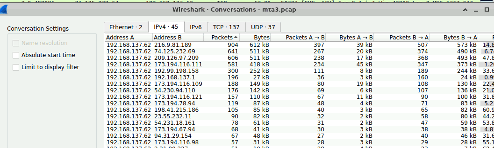


On Zui


`event_type=="alert" alert.severity==1 | cut src_ip,dest_ip, alert.signature`


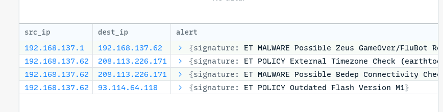


And with networkminer to get the host names and domains


| source                                    | des                                                                                                        |                                                                                                                                                  |
| ----------------------------------------- | ---------------------------------------------------------------------------------------------------------- | ------------------------------------------------------------------------------------------------------------------------------------------------ |
| 192.168.137.62 [StevePowers-PC] (Windows) | 216.9.81.189 [www.earsurgery.org]                                                                          |                                                                                                                                                  |
|                                           | 74.125.232.69                                                                                              |                                                                                                                                                  |
|                                           | 209.126.97.209 [aemmiphbweeuef59.com]                                                                      |                                                                                                                                                  |
|                                           | 173.194.116.111 - google                                                                                   |                                                                                                                                                  |
|                                           | `192.99.198.158 [qwe.mvdunalterableairreport.net]`                                                         |                                                                                                                                                  |
|                                           | 192.168.137.1                                                                                              |                                                                                                                                                  |
|                                           | 173.194.116.109 [pagead46.l.doubleclick.net] [pagead2.googlesyndication.com] [googleads.g.doubleclick.net] |                                                                                                                                                  |
| 192.168.137.62                            | `93.114.64.118 [adstairs.ro]`                                                                              | ET POLICY Outdated Flash Version M1"<br/>,<br/>category:<br/>"Potential Corporate Privacy Violation"                                             |
| 192.168.137.62                            | `208.113.226.171 [www.earthtools.org]`                                                                     | ET MALWARE Possible Bedep Connectivity Check (2)"<br/>category:<br/>"A Network Trojan was detected"                                              |
| 192.168.137.1                             | 192.168.137.62                                                                                             | signature:<br/>"ET MALWARE Possible Zeus GameOver/FluBot Related DGA NXDOMAIN Responses"<br/>,<br/>category:<br/>"A Network Trojan was detected" |


We can be sure that the attack revolve around these 3 domain: 216.9.81.189 [www.earsurgery.org], `93.114.64.118 [adstairs.ro], 208.113.226.171 [www.earthtools.org]` or more


And the victim should 192.168.137.62 [StevePowers-PC] (Windows)


### Q1 What is the IP address of the infected Windows host? {#3447b0eb61a480569056f98f9897c117}


`192.168.137.62`


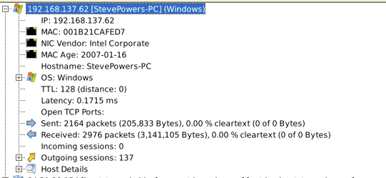


Take a look at the networkminer information about the `93.114.64.118`  : there are a lot sessions: 137 and huge amount of exchange packets.


These evidence add up to our analysis above. So the answer should be: `192.168.137.62`


### Q2 What is the Exploit kit (EK) name? (two words) {#3447b0eb61a48013adf3e90979d329fe}


From the Zui alert we know that two malwares attacking the host are Zeus and Bedep, i did some research on Google and found that:

- Zeus (or Zbot) is a notorious Trojan horse malware family, primarily targeting Windows systems to steal banking information, credentials, and personal data
- Bedep is a destructive family of Trojans primarily targeting Windows systems, designed to act as a backdoor and downloader, often for ad-fraud campaigns. First detected in late 2014, it is closely associated with the **Angler Exploit Kit**, which is used to silently install Bedep onto computers via malicious websites.

To be sure, i headed to the export object list


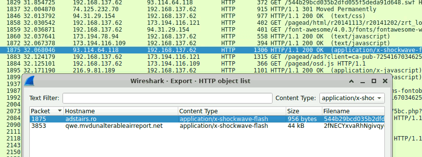


The exploit kit domain should be: adstairs.ro and qwe.mvdunalterableairreport.net


Using this filter: `ip.addr==192.168.137.62 && http.request.method==POST`


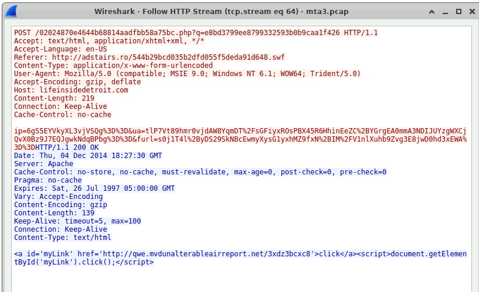


`ip=`6gS5EYVkyXL3vjVSQg%3D%3D&`ua=`tlP7Vt89hmr0vjdAW8YqmDT%2FsGFiyxROsPBX45R6HhinEeZC%2BYGrgEA0mmA3NDIJUYzgWXCjQvX0Bz9J7EQJgwkNdqBPbg%3D%3D&`furl=`s0j1T4l%2ByDS29SkNBcEwmyXysG1yxhMZ9fxN%2BIM%2FV1nlXuhb9Zvg3E8jwD0hd3xEWA%3D%3D

- ip=victim’s ip
- ua= user-agent
- furl= found url/referer url

These are the signatures of EK - especially `Angler EK`


### Q3 What is the FQDN that delivered the exploit kit? {#3447b0eb61a480e9a249d44abfde4a11}


From the analysis from the previous question: `192.99.198.158 [qwe.mvdunalterableairreport.net]`


### Q4 What is the redirect URL that points to the exploit kit landing page? {#3447b0eb61a4805d8a33d59d04402c49}


To find what website rederect to the EK domain i used `http.host == qwe.mvdunalterableairreport.net` and look into the http referer field: 


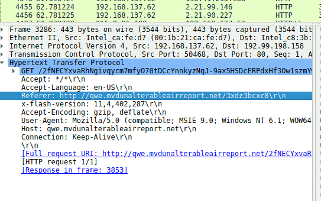


> `http://lifeinsidedetroit.com/02024870e4644b68814aadfbb58a75bc.php?q=e8bd3799ee8799332593b0b9caa1f426`


The victim was redirect from `http://lifeinsidedetroit.com/`  to `qwe.mvdunalterableairreport.net`


### Q5 What is the FQDN of the compromised website? {#3447b0eb61a480b7a8bed48302a11983}


Similar to the previous question: http.host=="lifeinsidedetroit.com"


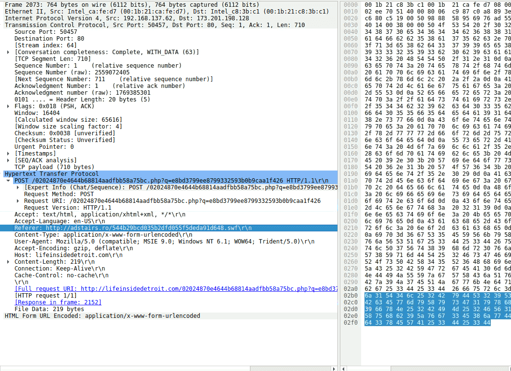


`http://adstairs.ro/544b29bcd035b2dfd055f5deda91d648.swf`


continue to trace back:  `http.host=="adstairs.ro"`


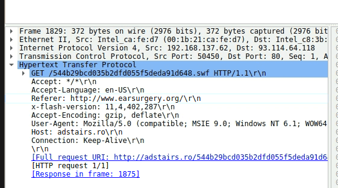


`http.host contains "www.earsurgery.org"`


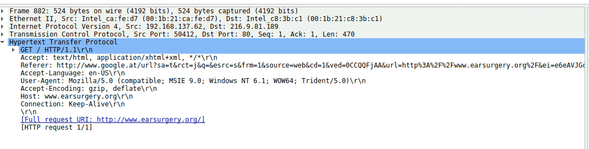


The user query for `www.earsurgery.org` on google and clicked it. 


So `http://www.earsurgery.org/` should be the answer


### Q6 Which TCP stream shows the malware payload being delivered? Provide stream number {#3447b0eb61a48074a6eadb85f9ff9a5f}


The payload should be executable file, which is label as octet-stream in packets context.


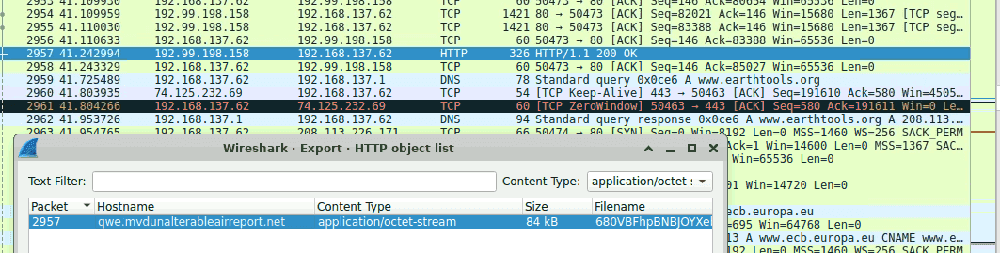


so we know `192.99.198.158 [qwe.mvdunalterableairreport.net]` host the payload


Follow tcp stream:


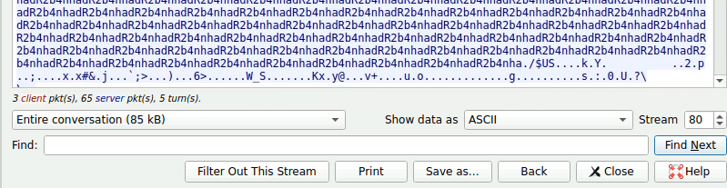


> 80


### Q7 What is the IP address of the C&C server? {#3447b0eb61a4806f9386ff22a233d67e}


Using the filter: `ip.addr==192.168.137.62` and check the conversations: 


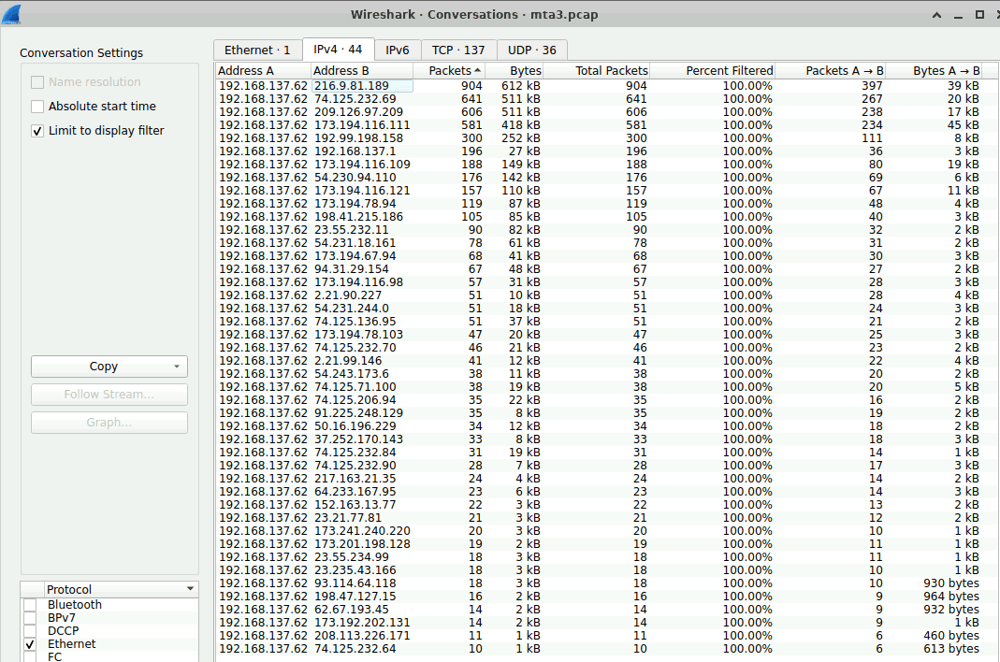


 we can eliminate: 

- 216.9.81.189 because it’s  [earsurgery.org](http://earsurgery.org/) - the compromised website
- 74.125.232.69: google
- 173.194/116.111: google
- 192.99.198.158 [qwe.mvdunalterableairreport.net]: the EK server

Only `209.126.97.209` is suspicious


Filter: `_path=="notice" dst==209.126.97.209` 


→ it was using a self sign certificate.


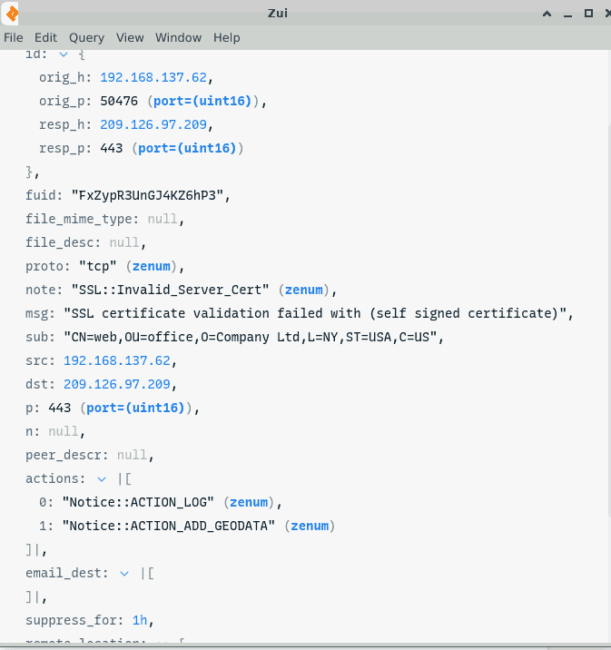


209.126.97.209 [aemmiphbweeuef59.com]: and the domain’s name itself is quite peculiar


→ using 443 port (defense evasion), and a self sign cert, suspicious domain name


> `209.126.97.209` 


:::tip

- Other useful path:

:::


### Q8 The malicious domain served a ZIP archive. What is the name of the DLL file included in this archive? {#3447b0eb61a48008bd41c06c8788952d}


Oftentimes for quick answer i would use:  `http contains “.dll”` and sroll through the packets


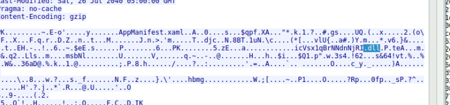


There’s another solution for this: navigate to the files tab in networkminer and search for .zip files


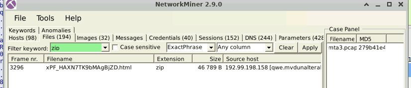


The `xPF_HAXN7TK9bMAgBjZD.html` seems to be faking its extension


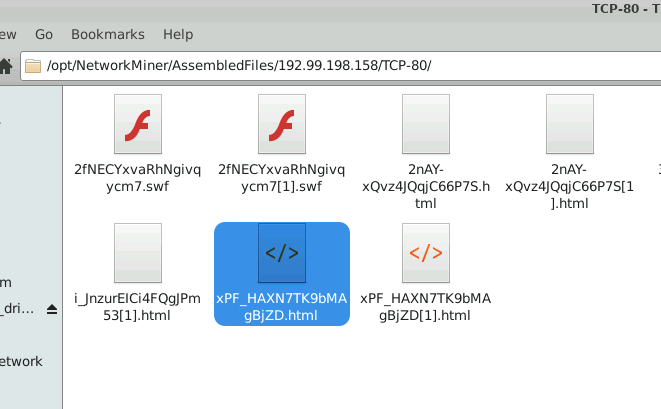


Unzip it and we got: 


`AppManifest.xaml` and `icVsx1qBrNNdnNjRI.dll` which are well known for the **Microsoft Silverlight** vulnerability (CVE-2016-0034)


> `icVsx1qBrNNdnNjRI.dll`


### Q9 Extract the malware payload, deobfuscate it, and remove the shellcode at the beginning. This should give you the actual payload (a DLL file) used for the infection. What's the MD5 hash of the payload? {#3447b0eb61a48007b704d6a5620e3586}


> This question is quite challenging, because i have no prior experience in malware analysis at all, tried all kind of method though. Finally i resorted to the official walkthrough


We already knew that : `192.99.198.158 [qwe.mvdunalterableairreport.net]`: is the EK server and the payload is `680VBFhpBNBJOYXebSxgwLrtbh3g6JFUllqksWFSsGshhwsguyNL26MGul2oZ3b8`


I try to extract it using networkminer


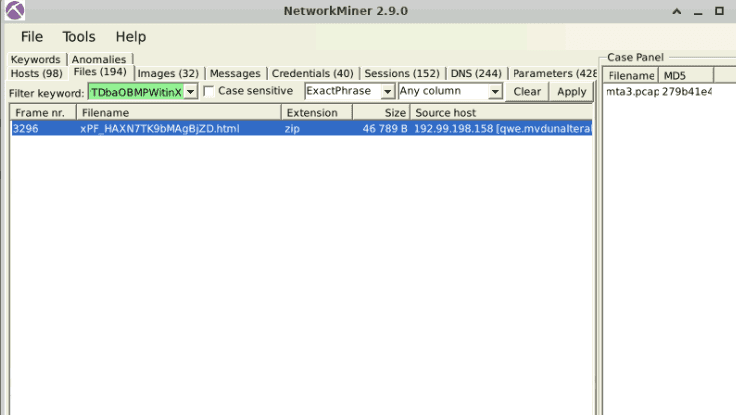


After extracted the file, i used the hex editor tool provided in the lab to find out the XOR key attacker employed to obfuscate. Which is: adR2b4nh


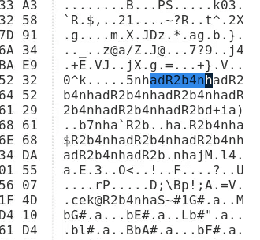


Also wrote a small python script (with the help of AI): 


```c++
def xor_file(input_file, output_file, key):
    key_bytes = key.encode()
    key_length = len(key_bytes)

    with open(input_file, 'rb') as infile, open(output_file, 'wb') as outfile:
        data = infile.read()
        xored_data = bytearray(len(data))

        for i in range(len(data)):
            xored_data[i] = data[i] ^ key_bytes[i % key_length]

        outfile.write(xored_data)

if __name__ == "__main__":
    input_filename = "680VBFhpBNBJOYXebSxg.octet-stream"
    output_filename = "output.bin"
    key = "adR2b4nh"

    xor_file(input_filename, output_filename, key)
    print(f"File '{input_filename}' processed and saved as '{output_filename}'.")
```


Basically the code means:

	- takes the key adR2b4nh → turning into raw byte. This is necessary because bitwise operations must be performed on raw binary data, not text characters.
	- read the input as binary, creates a mutable buffer (`bytearray`) of the exact same size to hold the decrypted result.

	```powershell
	for i in range(len(data)):
	xored_data[i] = data[i] ^ key_bytes[i % key_length]
	```

	- This loop iterates through every single byte of the scrambled file.
	- The `^` symbol is the bitwise XOR operator. It compares the bits of the encrypted file byte against the bits of the key byte.
	- The `[i % key_length]`  to XOR until the end of fle.

We get the output and look for the sign: “This program cannot be run in DOS mode” 


	This is a brillant method to find the beginning of executable file (exe, dll, sys,…)


	Modern Windows programs are **32-bit or 64-bit**, while DOS is a **16-bit** operating system. When you try to run a Windows program in an environment that only understands DOS (like a Command Prompt in an old OS or a recovery console), the file runs a tiny piece of code called a **DOS Stub** that displays that specific error message instead of crashing the system.


	The exe file structure is described as below: 

	- Start with magic bytes: MZ
	- DOS stub: This program cannot be run in DOS mode
	- PE header and data,….

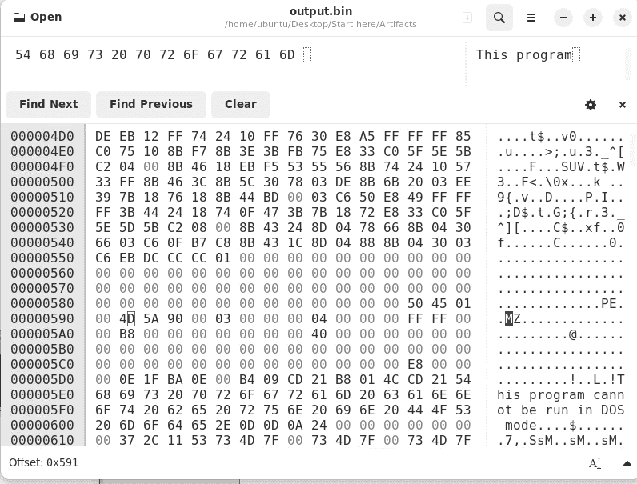


The offset of MZ = 0x591 = 1425 in decimal


Using dd


```c++
dd if=output.bin of=mz.bin bs=1 skip=1425
```


```c++
ubuntu@ip-172-31-17-190:~/Desktop/Start here/Artifacts$ dd if=output.bin of=mz bs=1 skip=1425
83280+0 records in
83280+0 records out
83280 bytes (83 kB, 81 KiB) copied, 0.400628 s, 208 kB/s
ubuntu@ip-172-31-17-190:~/Desktop/Start here/Artifacts$ dd if=output.bin of=mz.bin bs=1 skip=1425
83280+0 records in
83280+0 records out
83280 bytes (83 kB, 81 KiB) copied, 0.382075 s, 218 kB/s
ubuntu@ip-172-31-17-190:~/Desktop/Start here/Artifacts$ md5sum mz.bin 
3dfa337e5b3bdb9c2775503bd7539b1c  mz.bin

```


> `3dfa337e5b3bdb9c2775503bd7539b1c`  


### Q10 What were the two protection methods enabled during the compilation of the PE file? (comma-separated) {#3447b0eb61a48063aca7e0e93fafed70}


`pesec` is a command-line tool used in malware analysis to analyze Windows Portable Executable (PE) binary files, specifically for checking security mitigations. It is part of the `readpe` toolkit (often used within **Kali Linux** or similar forensics environments), allowing analysts to verify if a binary was compiled with security features intended to thwart exploitation.


```c++
ubuntu@ip-172-31-17-190:~/Desktop/Start here/Artifacts$ pesec mz.bin
ASLR:                            no
DEP/NX:                          no
SEH:                             yes
Stack cookies (EXPERIMENTAL):    yes

```

- **SEH (Structured Exception Handling):**
	- it throw an exception to avoid system crash when encounter an error.
	- hacker epxloit this for buffer overflow, force SEH to jump to malicious code
- **Stack Cookies / Canary:** When a function returns, the program verifies the canary; if it has been modified, the program terminates to prevent exploitation. They are highly effective at stopping stack-smashing attacks.
- **ASLR (Address Space Layout Randomization):** this feature allow to ramble the virtual address every time processs run. Attacker turn it off for the payload to be loaded in predictable base address - easy for process injection.
- **DEP (Data Execution Prevention):** important security feature in windows kernel. It prevents code segment from having write right, and heap/stack segment from being able to execute.
	- Of course hacker would turn it off for process injection and process hollowing

	:::tip
	
	Fun fact: The name "Canary" originates from the old practice where miners would carry a canary down into the coal mines with them. Canaries are highly sensitive to toxic gases. If there was a gas leak, the bird would die first, acting as an early warning signal for the miners to escape. The **Stack Canary** in CS operates in the exact same way.
	
	:::
	
	


> The answers are **`SEH, Canary`**.


### Q11 A Flash file was used in conjunction with the redirect URL. What URL was used to retrieve this flash file? {#3447b0eb61a480e8885af0ac76861457}


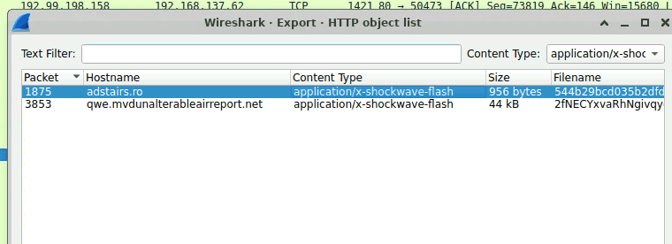


In previous question we already knew `http://adstairs.ro` also host a swf file


> http://adstairs.ro/544b29bcd035b2dfd055f5deda91d648.swf


### Q12 What is the CVE of the exploited vulnerability? {#3447b0eb61a480b8a0c0d5095961bd01}


Did some research on Google


The string **`adR2b4nh`** is a specific XOR key used to decrypt malicious payloads within certain infections of the **Angler Exploit Kit (EK)**, particularly in campaigns observed around 2014


- **Function:** This key is used in a XOR cipher to protect the payload of an Internet Explorer exploit, specifically **CVE-2013-2551**.

> **`CVE-2013-2551`**


## The Attack chain {#3597b0eb61a480c1aa08c605570db8ed}

- Initially, the user visits the website `earsurgery.org` at IP `216.9.81[.]189` (which had been compromised via malvertising, injected JavaScript, etc.).
- The user is then redirected through various intermediate websites (e.g., `[adstairs.ro]` at `93.114.64[.]118`, and `lifeinsidedetroit.com`). These intermediary sites act as a screening mechanism to check if the user's browser or installed plugins have any vulnerabilities. This entire process happens silently in the background without the user's knowledge.
- Finally, the user is redirected to `192.99.198[.]158` `[qwe.mvdunalterableairreport.net]`, which hosts the Angler Exploit Kit (EK). The attacker first delivers a Flash file (`544b29bcd035b2dfd055f5deda91d648.swf`) to act as a stepping stone. This file triggers the vulnerability and facilitates the download of the main payload: `680VBFhpBNBJOYXebSxgwLrtbh3g6JFUllqksWFSsGshhwsguyNL26MGul2oZ3b8` (Bedep malware). Upon execution, this payload establishes Command and Control (C2) communication with `209.126.97.209` `[aemmiphbweeuef59.com]`.
- This main payload is encrypted using XOR with the key `adR2b4nh` and is obfuscated from the beginning of the file up to offset `0x591`.
- Additionally, the attacker downloads a ZIP file containing two files: `AppManifest.xaml` and `icVsx1qBrNNdnNjRI.dll`.
- The `.swf` file is responsible for exploiting the vulnerability. When the victim downloads this file, it triggers the exploit, allowing the attacker to gain execution privileges on the machine.

	Following this, it injects shellcode into the RAM and creates a network connection to pull down the second component: an octet-stream file named `680VBFhpBNBJOYXebSxgwLrtbh3g6JFUllqksWFSsGshhwsguyNL26MGul2oZ3b8`.
	This component is a formatless binary data file. It is XOR-encrypted to bypass firewall detection. Once it reaches the victim's machine, the shellcode decrypts this XORed file, revealing an executable `.dll` file.
	This DLL file then infects the system and executes the subsequent phases of the attack.
	The presence of `AppManifest.xaml` and `icVsx1qBrNNdnNjRI.dll` is indicative of an exploit targeting a Microsoft Silverlight vulnerability (CVE-2016-0034).


### Some newly encountered concepts {#3597b0eb61a480a0ae4ddd622b25e0aa}

- TDS (Traffic Direction System): Network Traffic Distribution
	- Checks the victim's IP address, browser, and Flash/Java versions.
	- If it detects that the user has a vulnerable environment, it redirects them to the Exploit Kit landing page.
- Malvertising: A website like `lifeinsidedetroit.com` might be inherently harmless, but the website owner may host a malicious advertisement (the attacker purchased that iframe space). The victim merely needs to visit the website; once the banner loads, the user is automatically redirected.
