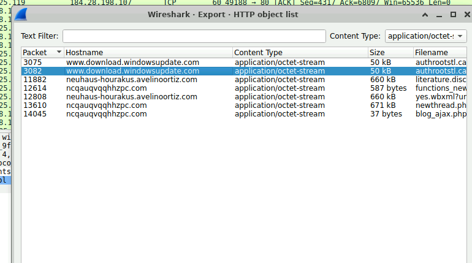
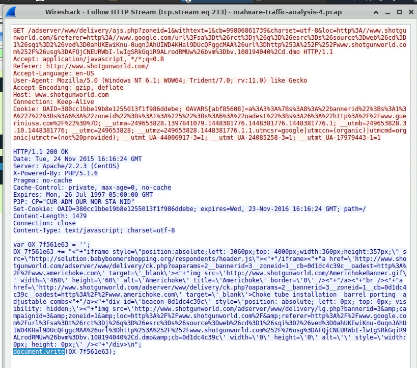

_d16ad130daed5d4f3a7368ce73b87a8f84404873cbfc90cc77e967a83c947cd2_


CVE-2011-3230


# Analysis {#3467b0eb61a4804d8554cf2a65f7f522}


| 10.1.25.119 | 184.28.198.107 | 184.28.198.107 [[e7650.x.akamaiedge.net](http://e7650.x.akamaiedge.net/)] [[cabelas.com.edgekey.net](http://cabelas.com.edgekey.net/)] [[www.cabelas.com](http://www.cabelas.com/)] [[assets.cabelas.com](http://assets.cabelas.com/)] [[images.cabelas.com](http://images.cabelas.com/)]                                                                                                                                 |
| ----------- | -------------- | ------------------------------------------------------------------------------------------------------------------------------------------------------------------------------------------------------------------------------------------------------------------------------------------------------------------------------------------------------------------------------------------------------------------------- |
|             | 162.216.4.20   | 162.216.4.20 [neuhaus-hourakus.avelinoortiz.com]                                                                                                                                                                                                                                                                                                                                                                          |
|             | 74.125.226.180 | 74.125.226.180 [[www.google.com](http://www.google.com/)]                                                                                                                                                                                                                                                                                                                                                                 |
|             | 23.235.40.193  | 23.235.40.193 ] [[i.imgur.com](http://i.imgur.com/)]                                                                                                                                                                                                                                                                                                                                       |
|             | 23.9.102.155   | 23.9.102.155 [[e7090.a.akamaiedge.net](http://e7090.a.akamaiedge.net/)] [[sportsmansguide.com.edgekey.net](http://sportsmansguide.com.edgekey.net/)] [[www.sportsmansguide.com](http://www.sportsmansguide.com/)] [[image.sportsmansguide.com](http://image.sportsmansguide.com/)]                                                                                                                                        |
|             | 192.229.163.16 | 192.229.163.16 [[cs464.wac.upsiloncdn.net](http://cs464.wac.upsiloncdn.net/)] [[i262.photobucket.com](http://i262.photobucket.com/)] [[i781.photobucket.com](http://i781.photobucket.com/)]                                                                                                                                                                                                                               |
|             | 184.84.243.49  | 184.84.243.50 [[a767.dspw65.akamai.net](http://a767.dspw65.akamai.net/)] [[download.windowsupdate.com.edgesuite.net](http://download.windowsupdate.com.edgesuite.net/)] [[www.download.windowsupdate.com](http://www.download.windowsupdate.com/)] [[a1859.g1.akamai.net](http://a1859.g1.akamai.net/)] [[e.monetate.net.edgesuite.net](http://e.monetate.net.edgesuite.net/)] [[e.monetate.net](http://e.monetate.net/)] |
|             | 184.84.243.50  | 184.84.243.50 [[a767.dspw65.akamai.net](http://a767.dspw65.akamai.net/)] [[download.windowsupdate.com.edgesuite.net](http://download.windowsupdate.com.edgesuite.net/)] [[www.download.windowsupdate.com](http://www.download.windowsupdate.com/)] [[a1859.g1.akamai.net](http://a1859.g1.akamai.net/)] [[e.monetate.net.edgesuite.net](http://e.monetate.net.edgesuite.net/)] [[e.monetate.net](http://e.monetate.net/)] |
|             | 95.211.205.229 | 95.211.205.229 [[ncqauqvqqhhzpc.com](http://ncqauqvqqhhzpc.com/)]                                                                                                                                                                                                                                                                                                                                                         |
|             |                |                                                                                                                                                                                                                                                                                                                                                                                                                           |


Q1 What is the victim IP address?


Ta thấy đa số IP ra ngoài là thằng này


Q2 What is the victim's hostname?


Turkey-Tom


Q3 What is the exploit kit name?


Tìm hash đã cho 


The string `d16ad130daed5d4f3a7368ce73b87a8f84404873cbfc90cc77e967a83c947cd2` is **a SHA256 hash representing a malicious executable file, frequently associated with the Angler Exploit Kit**. It was featured in a 2015 malware traffic analysis exercise (Goofus and Gallant)


Có thể dùng http export hết file swf ra và tính hash rồi dò xét virustotal


Q4 What is the IP address that served the exploit?


162.216.4.20





Q5 What is the HTTP header that is used to indicate the flash version?


The HTTP header typically used by Adobe Flash Player to indicate its version is **`x-flash-version`**


Dùng http contains flash cũng được


Q6 What is the malicious URL that redirects to the server serving the exploit?


http && ip.addr==162.216.4.20


```c++
GET /forums/viewforum.php?f=15&sid=0l.h8f0o304g67j7zl29 HTTP/1.1
Accept: text/html, application/xhtml+xml, */*
Referer: http://solution.babyboomershopping.org/respondents/header.js
Accept-Language: en-US
User-Agent: Mozilla/5.0 (Windows NT 6.1; WOW64; Trident/7.0; rv:11.0) like Gecko
Accept-Encoding: gzip, deflate
Host: neuhaus-hourakus.avelinoortiz.com
Connection: Keep-Alive
```


Q7 What is The CAPEC ID corresponding to the technique used to redirect the victim to the exploit server? More info at capec.mitre.org


CAPEC-222


Trong các chiến dịch tấn công bằng Exploit Kit (như Angler EK mà bạn đang phân tích), kỹ thuật phổ biến nhất để chuyển hướng (redirect) nạn nhân từ một trang web hợp pháp bị xâm nhập sang máy chủ chứa mã độc một cách âm thầm là sử dụng thẻ **`iframe`**.

- **Cách thức hoạt động:** Kẻ tấn công sẽ tiêm (inject) một đoạn mã HTML chứa thẻ `<iframe>` vào mã nguồn của trang web bị thỏa hiệp. Thẻ iframe này thường bị ẩn đi (bằng cách set kích thước 1x1 pixel, hoặc làm trong suốt).
- **Hậu quả:** Khi nạn nhân truy cập vào trang web đọc báo bình thường, trình duyệt của họ sẽ tự động load cái khung iframe ẩn đó ở dưới nền, từ đó âm thầm kết nối đến bãi đáp Exploit Kit (`qwe...`) và bắt đầu chuỗi lây nhiễm mà không cần nạn nhân phải click vào bất cứ đường link nào (Drive-by Download).

Q8 What is the FQDN of the compromised website?


tìm theo http.host==solution.babyboomershopping.org


www.shotgunworld.com/


Q9 The compromised website contains a malicious js that redirect the user to another website. What is the variable name passed to the "document.write" function?


heck HTTP requests of the 'adserver' directory.


Adserver là gì: là malvertise?

- **`adserver`**: Trang web này tự chạy một hệ thống phân phối quảng cáo riêng (thường là dùng các mã nguồn mở như OpenX hoặc Revive Adserver).
- **`ajs.php`**: Chữ `ajs` thường là viết tắt của **Ad JavaScript**. Đây là một file script có nhiệm vụ "bơm" banner quảng cáo vào trang web.




Q10 What is the Compilation Timestamp of the malware found on the machine? Use your host for this question as the machine does not have an internet connection.


Tìm trên virustotal với hash `d16ad130daed5d4f3a7368ce73b87a8f84404873cbfc90cc77e967a83c947cd2:`  2007-08-01 18:16:48

