---

[https://cyberdefenders.org/blueteam-ctf-challenges/packetmaze/](https://cyberdefenders.org/blueteam-ctf-challenges/packetmaze/)

## Basic triage {#35a7b0eb61a480039269eaeef41b3dc3}

| 192.168.1.26 (windows) | 172.67.162.206  | 172.67.162.206 [dfir.science]            |
| ---------------------- | --------------- | ---------------------------------------- |
|                        | 192.168.1.20    |                                          |
|                        | 185.70.41.130   | 185.70.41.130 [mail.protonmail.com]      |
|                        | 23.51.191.35    | 23.51.191.35 [e10370.g.akamaiedge.net]   |
|                        | 185.70.41.35    | 185.70.41.35 [protonmail.com]            |
|                        | 142.250.190.132 | 142.250.190.132 [www.google.com]         |
|                        | 159.65.89.65    | 159.65.89.65 [www.7-zip.org] [7-zip.org] |

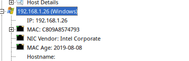

### Q1 What is the FTP password? {#3467b0eb61a48019b11cde938075911c}

use the filter: ftp

192.168.1.26	192.168.1.26	192.168.1.20	FTP	kali	AfricaCTF2021	Unknown	2021-04-30 01:01:26 UTC+00

> AfricaCTF2021	

### Q2 What is the IPv6 address of the DNS server used by `192.168.1.26`? {#3467b0eb61a480729911f7a36e9f454e}

use the filter: dns → figure out the DNS server ipv4 is: 192.168.1.10

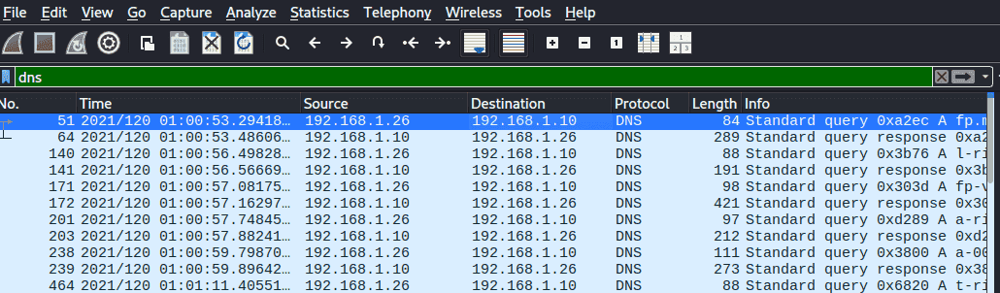

We can also extract the mac address is: Destination: ca:0b:ad:ad:20:ba
`eth.addr == ca:0b:ad:ad:20:ba && ipv6`

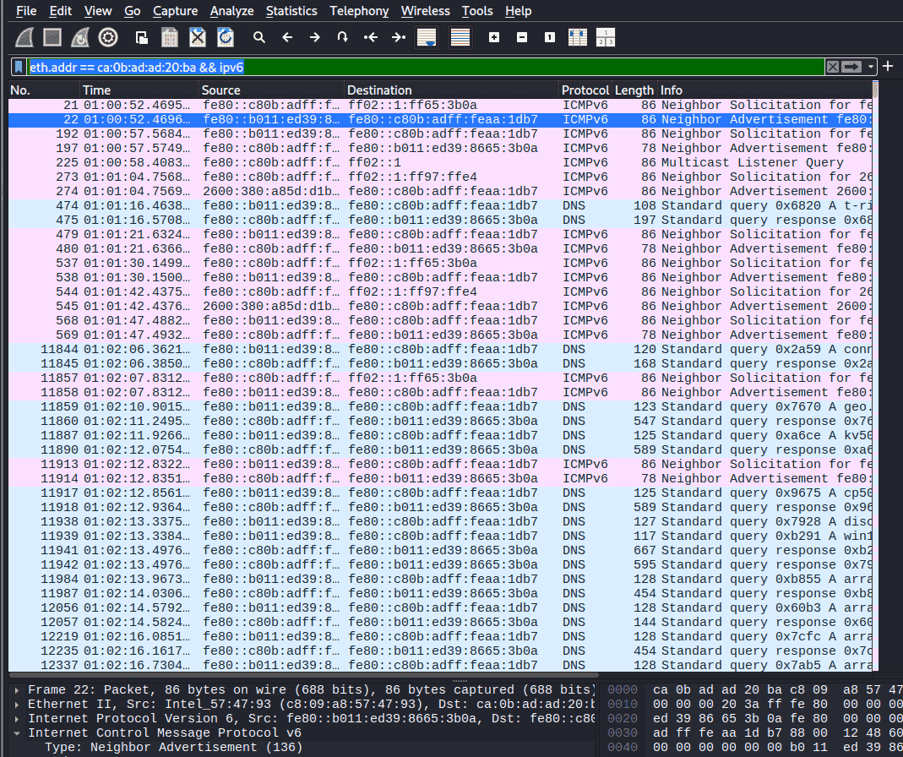

`fe80::c80b:adff:feaa:1db7`

### Q3 What domain is the user looking up in packet `15174`? {#3467b0eb61a48026a165f2b944d0d998}

www.7-zip.org: type A, class IN

### Q4 How many UDP packets were sent from `192.168.1.26` to `24.39.217.246`? {#3467b0eb61a48032ad17f21de195e089}

`ip.src == 192.168.1.26 && ip.dst==24.39.217.246`

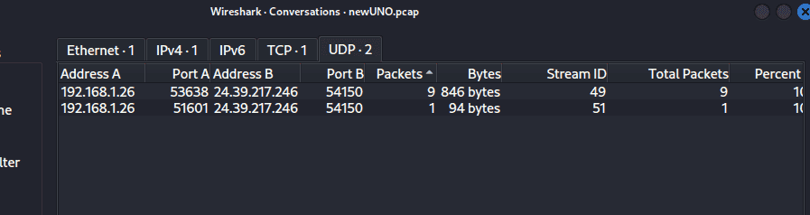

> 10

### Q5 What is the MAC address of the system under investigation in the PCAP file? {#3467b0eb61a480bcb8edc54b8645f32f}

From Q2 we can also find out the MAC of 192.168.1.26 (windows)

Ethernet II, Src: Intel_57:47:93 (c8:09:a8:57:47:93), Dst: ca:0b:ad:ad:20:ba (ca:0b:ad:ad:20:ba)

> c8:09:a8:57:47:93

### Q6 What was the camera model name used to take picture `20210429_152157.jpg`? {#3467b0eb61a4805996dafa5b1722f7bf}

use networkminer to find the image, then view the image’s properties

> LM-Q725K

### Q7 What is the ephemeral public key provided by the server during the TLS handshake in the session with the session ID: `da4a0000342e4b73459d7360b4bea971cc303ac18d29b99067e46d16cc07f4ff`? {#3467b0eb61a480a9a03de2c2dedaaabc}

`tls.handshake.session_id == da4a0000342e4b73459d7360b4bea971cc303ac18d29b99067e46d16cc07f4ff`

Look for  `pubkey` in packet detail

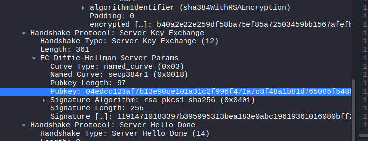

Pubkey: `04edcc123af7b13e90ce101a31c2f996f471a7c8f48a1b81d765085f548059a550f3f4f62ca1f0e8f74d727053074a37bceb2cbdc7ce2a8994dcd76dd6834eefc5438c3b6da929321f3a1366bd14c877cc83e5d0731b7f80a6b80916efd4a23a4d`

### Q8 What is the first `TLS 1.3` client random that was used to establish a connection with `protonmail.com`? {#3467b0eb61a48016b790e5050bb40b55}

I use google and search for: tls version wireshark filter

- **TLS 1.3:** `tls.handshake.version == 0x0304` or `tls.version == 0x0304`
- **TLS 1.2:** `tls.handshake.version == 0x0303` or `tls.version == 0x0303`

But it doesn’t work. So i brute force it using filter: tls and discover the true filter:

- _ws.col.protocol == "TLSv1.3”
- _ws.col.protocol == "TLSv1.3" && tls.handshake.type==1 && tls contains "protonmail.com"

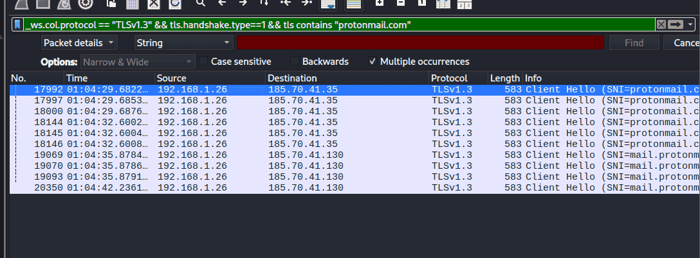

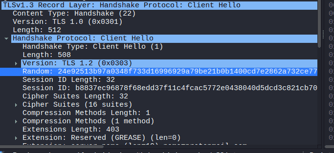

`24e92513b97a0348f733d16996929a79be21b0b1400cd7e2862a732ce7775b70`

### Q9 Which country is the manufacturer of the `FTP server’s MAC` address registered in? {#3467b0eb61a480e6ac35fd640a7cc0db}

use the filter: ftp

⇒ 192.168.1.20 FTP server and find the MAC address. 

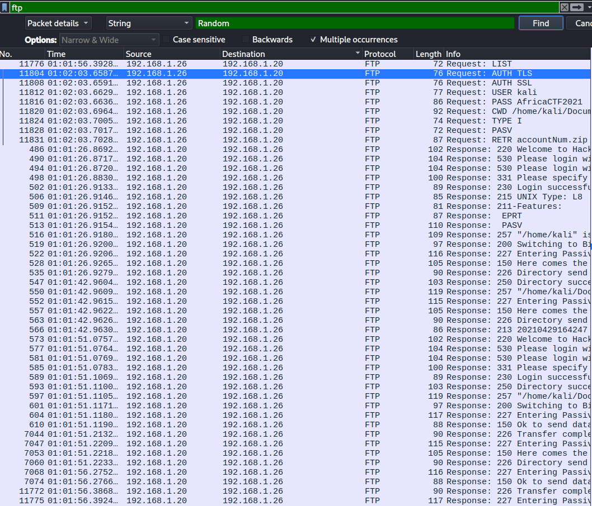

`Destination: PCSSystemtec_a6:1f:86 (08:00:27:a6:1f:86)`

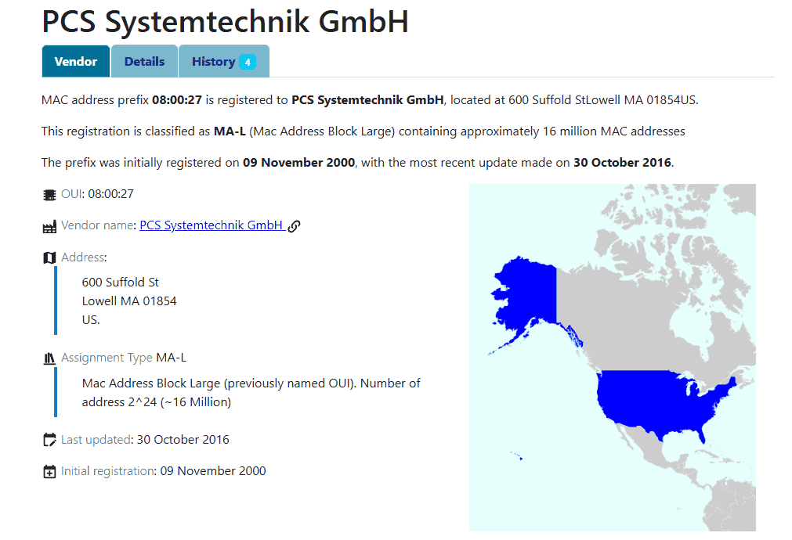

> United States

### Q10 What time was a `non-standard folder` created on the FTP server on the 20th of April? {#3467b0eb61a4800bb7fafe10e6cfdd93}

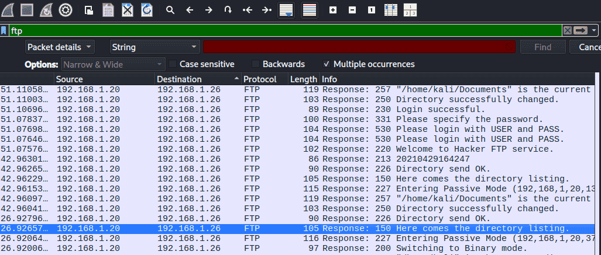

i found a message: “Here comes the directory listing” → follow tcp stream

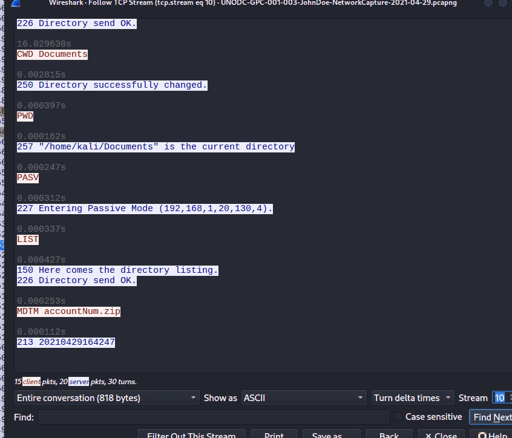

Check the next stream

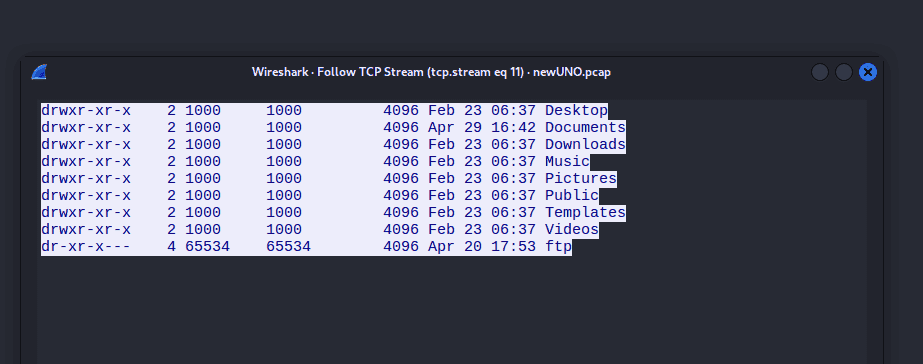

17:53

### Q11 What URL was visited by the user and connected to the IP address `104.21.89.171`? {#3467b0eb61a4802cb30ed95979bc9a90}

ip.addr==104.21.89.171 && http

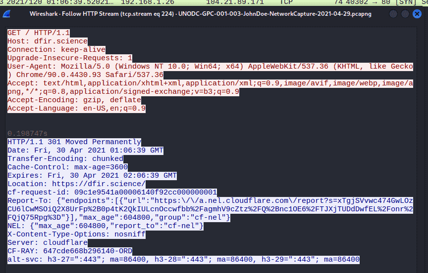

> http://dfir.science/

