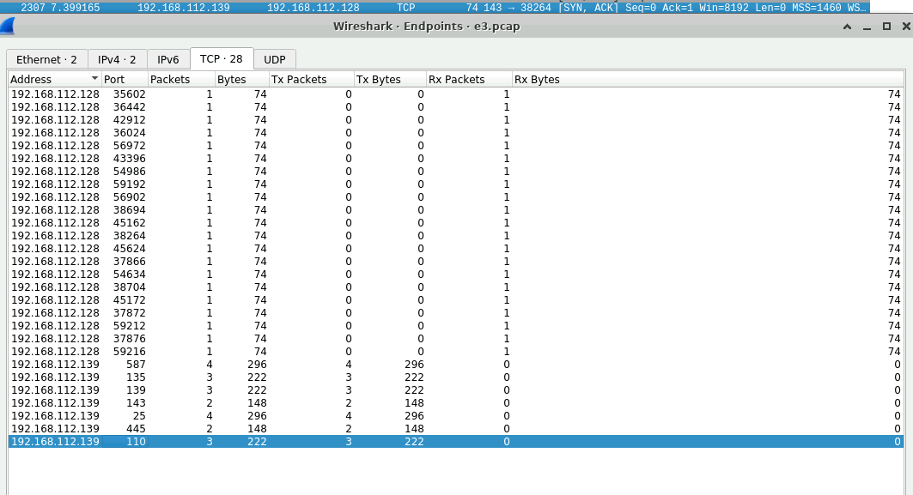
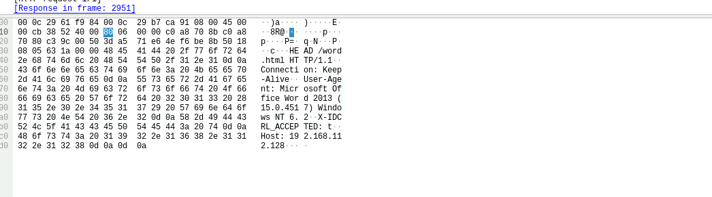
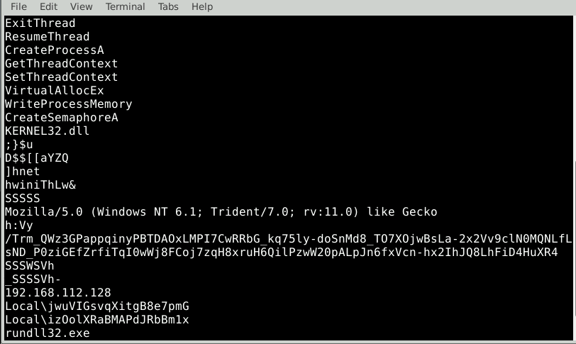
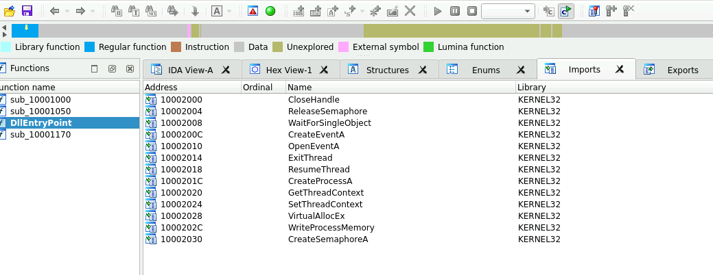
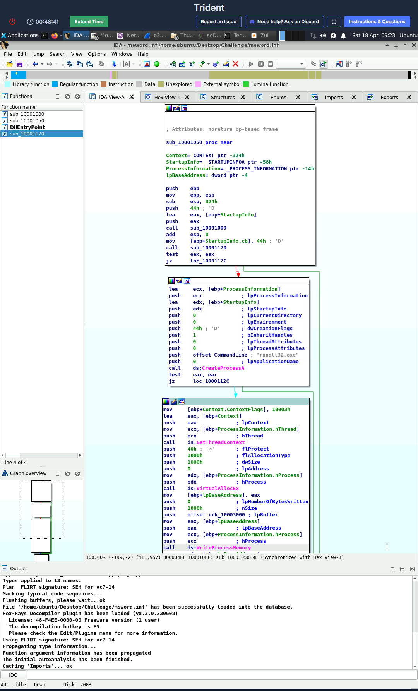
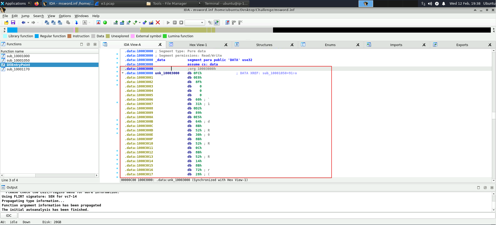
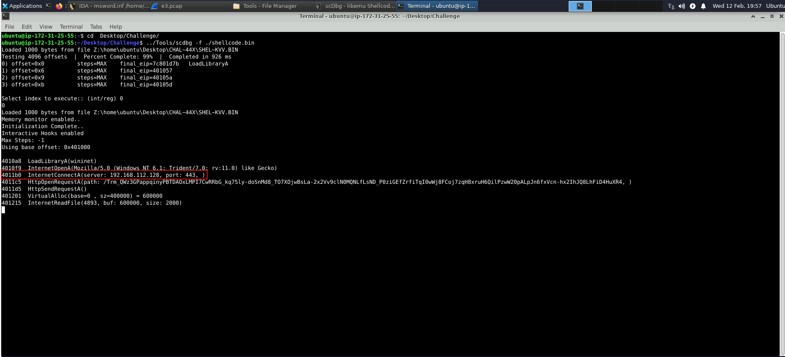

Trong giới an toàn thông tin, khi nhắc đến **Trident**, chúng ta thực chất không nói về một mã độc (malware) độc lập, mà đang nói về một **chuỗi khai thác lỗ hổng (exploit chain)** cực kỳ tinh vi. Chuỗi này được thiết kế đặc biệt để xuyên thủng hệ điều hành iOS của Apple và cài đặt phần mềm gián điệp khét tiếng **Pegasus**.


Dưới đây là bức tranh chi tiết về Trident:


### 1. Nguồn gốc và Mục đích {#3467b0eb61a4802db69ed2973b854bdc}

- **Kẻ đứng sau:** Trident và phần mềm Pegasus được tạo ra bởi **NSO Group**, một tập đoàn của Israel. Các công cụ này được bán với giá rất cao cho các chính phủ, nhưng thực tế đã bị lạm dụng để theo dõi các nhà báo, các nhà hoạt động nhân quyền, nhà ngoại giao và chính trị gia đối lập trên toàn cầu.
- **Phát hiện:** Mối đe dọa này được đưa ra ánh sáng vào tháng 8 năm 2016 bởi nỗ lực nghiên cứu chung của Citizen Lab và công ty bảo mật Lookout.
- **Sức mạnh:** Trident có khả năng "Jailbreak" (bẻ khóa) iPhone hoàn toàn ngầm mà nạn nhân không hề hay biết. Nó đã phá vỡ niềm tin rằng hệ sinh thái đóng và sandbox của Apple là bất khả xâm phạm.

### 2. Phân tích Kỹ thuật (Chuỗi 3 lỗ hổng Zero-day) {#3467b0eb61a48036a7e0ce80780f7067}


Trident được đặt tên như vậy (nghĩa là "Đinh ba") vì nó kết hợp sức mạnh của 3 lỗ hổng Zero-day (chưa từng được Apple biết đến trước đó). Quy trình tấn công diễn ra theo một kịch bản hoàn hảo như sau:

1. **Khâu mồi nhử (Delivery):** Kẻ tấn công gửi một đường link độc hại đến mục tiêu thông qua SMS, iMessage, email hoặc mạng xã hội. Nạn nhân chỉ cần nhấp vào liên kết này để mở trang web.
2. **Khâu xâm nhập (CVE-2016-4657):** Khai thác một lỗ hổng trong WebKit (công cụ kết xuất trang web của Safari), cho phép kẻ tấn công thực thi mã từ xa (RCE) ngay trong trình duyệt.
3. **Khâu định vị Kernel (CVE-2016-4655):** Từ quyền truy cập bước đầu, mã độc tiếp tục khai thác một lỗi rò rỉ thông tin trong Kernel (nhân hệ điều hành) để xác định chính xác vị trí của Kernel trong bộ nhớ.
4. **Khâu chiếm quyền hoàn toàn (CVE-2016-4656):** Sau khi xác định được tọa độ, bước cuối cùng là khai thác lỗ hổng hỏng bộ nhớ (Memory Corruption) trong Kernel để qua mặt các lớp bảo mật, cho phép tự động Jailbreak thiết bị.

### 3. Hậu quả sau khi "Đinh ba" cắm xuống (Payload: Pegasus) {#3467b0eb61a480e39da4d7f18ef68ef5}


Một khi chuỗi Trident chạy thành công, thiết bị sẽ bị cấy phần mềm gián điệp Pegasus và chính thức trở thành "gián điệp" trong túi của nạn nhân:

- **Kiểm soát toàn diện:** Kẻ tấn công có thể bật micro để ghi âm cuộc gọi, truy cập camera lén lút, theo dõi vị trí GPS theo thời gian thực và thu thập mọi mật khẩu/thao tác gõ phím.
- **Xuyên thủng mã hóa:** Điểm đáng sợ nhất là Pegasus lấy dữ liệu ở tầng hệ điều hành. Do đó, nó có thể trích xuất các cuộc trò chuyện từ WhatsApp, Telegram hay iMessage trước cả khi dữ liệu bị ứng dụng mã hóa gửi đi.
- **Khả năng tự hủy:** Pegasus được trang bị một cơ chế tự hủy (self-destruct) rất nhạy. Nếu cảm thấy bị đe dọa hoặc có nguy cơ bị phát hiện, nó sẽ tự động gỡ bỏ chính nó cùng các cơ chế duy trì (persistence) để xóa sạch dấu vết pháp y.

| 23.205.48.23    | 192.168.112.139 |   |
| --------------- | --------------- | - |
| 192.168.112.128 |                 |   |
| 40.77.226.250   |                 |   |
| 192.168.112.2   |                 |   |
| 51.104.136.2    |                 |   |
| 2.23.28.86      |                 |   |


TeamCymruMalwareHashRegistry:


### Q1 The attacker conducted a port scan on the victim machine. How many open ports did the attacker find? {#3467b0eb61a4803d9144eb87bdc9c39c}


ip.dst==192.168.112.128 && tcp.flags.syn==1 && tcp.flags.ack==1
Vào menu **Statistics** -&gt; **Endpoints** -&gt; Chuyển sang tab **TCP** -&gt; Đánh dấu tick vào ô _"Limit to display filter"_ ở góc dưới.





Hoặc dùng network miner: Open TCP Ports: 587 (Smtp) 135 139 (NetBiosSessionService) 143 (Imap) 25 (Smtp) 445 (NetBiosSessionService) 110 (Pop3)


2686	2686	192.168.112.128 (Linux)	192.168.112.139 [WIN-D2TSDEME6NN] (Windows)	"[support@cyberdefenders.org](mailto:support@cyberdefenders.org)" [support@cyberdefenders.org](mailto:support@cyberdefenders.org)	"joshua@cyberdefenders.org" [joshua@cyberdefenders.org](mailto:joshua@cyberdefenders.org)	Immediate respones	Smtp	2021-10-01 12:31:54 UTC	19077


### Q2 What is the victim's email address? {#3467b0eb61a480d8bb1bc14b66069ce7}


[joshua@cyberdefenders.org](mailto:joshua@cyberdefenders.org)


### Q3 The malicious document file contains a URL to a malicious HTML file. Provide the URL for this file. {#3467b0eb61a480bcabbee94cf022e04c}


grep -r -F ".html" "web server"/


[http://192.168.112.128/word.html](http://192.168.112.128/word.html)


### Q4 What is the Microsoft Office version installed on the victim machine? {#3467b0eb61a480249a27da8f6e9f47f1}


http.request.uri contains "/word.html”





### Q5 The malicious HTML contains a js code that points to a malicious CAB file. Provide the URL to the CAB file? {#3467b0eb61a4800d955dca9ca832996b}


Ta grep file word.html


[http://192.168.112.128/word.cab](http://192.168.112.128/word.cab)


### Q6 The exploit takes advantage of a CAB vulnerability. Provide the vulnerability name? {#3467b0eb61a480f79a3dcfad7e70dbdc}


**CAB** (viết tắt của **Cabinet**) là định dạng tệp lưu trữ và nén dữ liệu gốc của hệ điều hành Microsoft Windows (khá giống với `.zip` hay `.rar`). Có nhiều vulnerabilities bị lợi dụng


A. Rửa sạch dấu vết "Mark of the Web" (MotW): windows defender sẽ cảnh báo trường hợp tải từ web, tuy nhiên với file cab đôi khi không bị cảnh báo


B. Lợi dụng các công cụ hợp pháp của Windows (LOLBins)

- **Khai thác:** Chúng sử dụng các công cụ dòng lệnh có sẵn và hợp pháp như `extrac32.exe`, `expand.exe`, hoặc `wusa.exe` (Windows Update Standalone Installer) để âm thầm giải nén file mã độc từ file `.cab` vào các thư mục hệ thống. Do `wusa.exe` là file chuẩn của Microsoft, các hệ thống giám sát (EDR) thường bỏ qua hành vi này.

C. Lỗ hổng Path Traversal (Trượt thư mục)


D. Chuỗi khai thác MSHTML / Internet Explorer (Ví dụ thực tế)


Ngay cả trong năm 2024, file CAB vẫn là tâm điểm của các lỗ hổng Zero-day. Gần đây nhất là lỗ hổng **CVE-2024-38112** (bị khai thác bởi nhóm hacker Void Banshee):

- Kẻ tấn công lừa nạn nhân tải một file `.url` (Internet Shortcut) giả mạo.
- Khi bấm vào, file `.url` này gọi engine MSHTML cũ kỹ (lõi của Internet Explorer) vốn vẫn còn ẩn bên trong Windows 10/11.
- MSHTML sau đó tự động tải và thực thi một file `.cab` chứa mã độc mà không cần nạn nhân đồng ý, từ đó lây nhiễm phần mềm tống tiền hoặc Trojan.

Kết quả: `zipslip`


### Q7 Analyzing the dll file what is the API used to write the shellcode in the process memory? {#3467b0eb61a48099b1e5e1c6b822cfac}





`WriteProcessMemory` là API kinh điển chuyên dùng để tiêm (inject) shellcode hoặc mã độc thẳng vào bộ nhớ của một tiến trình hợp lệ (giúp nó trốn tránh sự phát hiện của phần mềm diệt virus).





### Q8 Extracting the shellcode from the dll file. What is the name of the library loaded by the shellcode? {#3467b0eb61a480849eb0d168ab2d6feb}


Trong IDA, bạn bấm đúp vào hàm `WriteProcessMemory` để xem nó ghi dữ liệu từ đâu vào RAM. Hàm này có cấu trúc `WriteProcessMemory(hProcess, lpBaseAddress, lpBuffer, nSize, ...)`.

- Tham số `lpBuffer` chính là địa chỉ của Shellcode.
- Đi tới địa chỉ đó trong IDA, quét khối toàn bộ đống dữ liệu (Hex) đó và xuất ra một file nhị phân (ví dụ lưu tên là `shellcode.bin` ra Desktop).
- 

BOOL (__stdcall *WriteProcessMemory)(HANDLE hProcess, LPVOID lpBaseAddress, LPCVOID lpBuffer, SIZE_T nSize, SIZE_T *lpNumberOfBytesWritten)
.idata:1000202C                 extrn WriteProcessMemory:dword
.idata:1000202C                                         ; CODE XREF: sub_10001050+9E↑p
.idata:1000202C                                         ; DATA XREF: sub_10001050+9E↑r

Hàm `WriteProcessMemory` đang bị gọi ra để sử dụng ở bên trong hàm `sub_10001050` (tại dòng lệnh cách điểm bắt đầu 9E byte)





push    offset unk_10003000 ; lpBuffer


_"Hãy lấy 0x1000 byte dữ liệu bắt đầu từ vị trí 10003000 và bơm thẳng vào RAM của tiến trình rundll32.exe"_.
Sau đó shift+E





Sau đó dùng dd để tách malware


```c++
dd if=msword.inf of=shellcode.bin bs=1 skip=3072 count=4096
```

- **`dd`**: Tên lệnh (Data Duplicator), chuyên dùng để sao chép, cắt ghép và chuyển đổi dữ liệu ở tầng thấp nhất (Raw data).
- **`if=msword.inf`** _(Input File)_: Chỉ định file đầu vào chứa dữ liệu gốc cần cắt (chính là file DLL chứa mã độc của bạn).
- **`of=shellcode.bin`** _(Output File)_: Chỉ định file đầu ra. Kết quả sau khi cắt sẽ được đổ vào file này.
- **`bs=1`** _(Block Size)_: Cài đặt kích thước của một khối dữ liệu là **1 byte**. Điều này nói với `dd` rằng: _"Hãy đếm và cắt chính xác từng byte một nhé"_. Nếu không có tham số này, mặc định `dd` sẽ cắt theo khối lớn (ví dụ 512 byte), làm sai lệch kích thước Shellcode.
- **`skip=3072`**: Yêu cầu `dd` **bỏ qua 3072 byte đầu tiên** của file gốc rồi mới bắt đầu copy.
	- _Tại sao lại là 3072?_ Con số 3072 trong hệ thập phân chính là **`0xC00`** trong hệ thập lục phân (Hex). Địa chỉ `10003000` mà bạn thấy trong IDA là địa chỉ ảo khi file được nạp lên RAM (Virtual Address). Còn khi file đang nằm im trên ổ cứng, vị trí vật lý (File Offset) của đoạn Shellcode đó chính xác nằm ở byte thứ `0xC00` (tức 3072). Lệnh này giúp "nhảy" đúng đến vị trí bắt đầu của Shellcode.
- **`count=4096`**: Yêu cầu `dd` chỉ **copy đúng 4096 khối** (tương đương 4096 byte vì `bs=1`) rồi dừng lại ngay lập tức.
	- _Tại sao lại là 4096?_ Bạn có nhớ tham số `push 1000h` (Kích thước `nSize`) trong IDA mà chúng ta phân tích không? **`1000h`** (Hex) đổi ra thập phân chính là **4096**!

### Q9 Which port was configured to receive the reverse shell? {#3467b0eb61a480fda4cdf525e7c14393}





# Tổng kết {#3467b0eb61a4805ab65be4cda65b8f14}


### Câu lệnh {#3467b0eb61a480749a76e705c67031ca}


```c++
dd if=msword.inf of=shellcode.bin bs=1 skip=3072 count=4096
```


`grep -r -F ".html" "web server"/`

