<!-- notion-metadata-start -->
*📅 Published: 2026-04-18 17:02 | 🔄 Last Updated: 2026-05-11 17:20*
<!-- notion-metadata-end -->
---


[https://cyberdefenders.org/blueteam-ctf-challenges/l337-s4uc3/](https://cyberdefenders.org/blueteam-ctf-challenges/l337-s4uc3/)


## Intro {#35c7b0eb61a48045a7c7c21252e50378}


Zeus aka Zbot is one type of banking trojan and one of the most notoriously malicious trojans. 


Malicious capabilities:

- Man-in-the-middle (MITM) and web injects: when a victim accesses a legitimate banking website, Zeus directly intercepts the browser workflow and inject fake data into the genuine website
- Form grabbing: hooking deep into the browser, Zeus can grab any data user inputs into web forms right before that data is encrypted by HTTPS
- Botnet Expansion: Computers infected with Zeus are silently enrolled into a massive Botnet network. From C2 server, attackers can issue commands to these infected machines to download new malware updates, retrieve new web inject configurations or weaponize the machines to execute DDoS attacks.

## Basic triage {#35c7b0eb61a480e393efca39e00efb08}


Using the statistics → conversation in wireshark, correlating with Networkminer host tabs. We can deduce these following host and ip information: 


| 172.16.0.109 (windows) | 198.116.65.32                                               | 198.116.65.32 [www.hq.nasa.gov]                                                          |
| ---------------------- | ----------------------------------------------------------- | ---------------------------------------------------------------------------------------- |
|                        | 128.156.253.24                                              | 128.156.253.24 [web.grc.nasa.gov] [exploration.grc.nasa.gov] [microgravity.grc.nasa.gov] |
|                        | 74.208.237.164                                              | 74.208.237.164 [www.technosapiens.us]                                                    |
|                        | 88.198.6.20                                                 | 88.198.6.20 (Windows)                                                                    |
|                        | 204.79.197.200                                              | 204.79.197.200 [any.edge.bing.com] [www.bing.com]                                        |
|                        | 205.168.3.71                                                | 205.168.3.71 [www.estesrockets.com]                                                      |
| 172.16.0.1             | 172.16.0.108 [74.204.41.73] [development.wse.local] (Linux) |                                                                                          |


Use Zui and query for suricata alerts


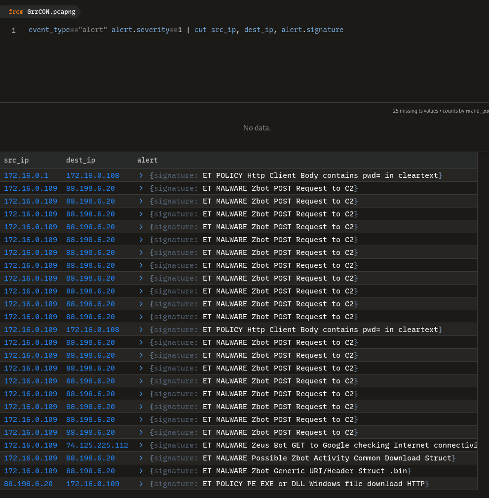


### Q1 PCAP: Development.wse.local is a critical asset for the Wayne and Stark Enterprises, where the company stores new top-secret designs on weapons. Jon Smith has access to the website and we believe it may have been compromised, according to the IDS alert we received earlier today. First, determine the Public IP Address of the webserver? {#3467b0eb61a480ba9a47d84f6bbef609}


As we have triaged in the table above: 172.16.0. is the local network. Find the one host with 2 IPs: internal and public one.


⇒  172.16.0.108 [74.204.41.73] [development.wse.local] (Linux)


### Q2 PCAP: Alright, now we need you to determine a starting point for the timeline that will be useful in mapping out the incident. Please determine the arrival time of frame 1 in the "GrrCON.pcapng" evidence file. {#3467b0eb61a48088aec6c1e84f9d4770}


Don’t have much to say with this question


`22:51:07 UTC`


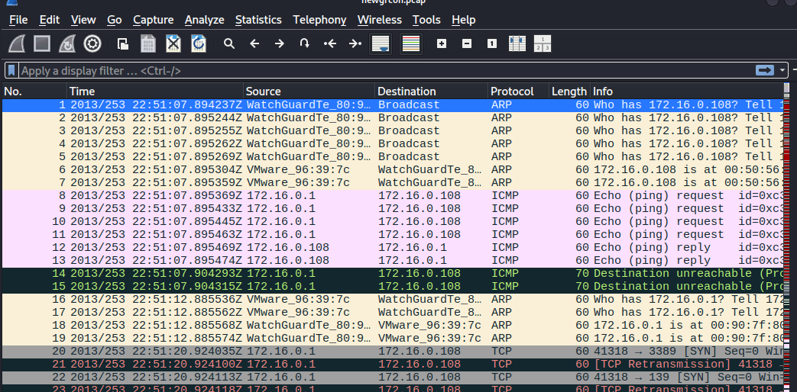


### Q3 PCAP: What version number of PHP is the development.wse.local server running? {#3467b0eb61a4800cbc87fcd81e389fca}


Aim for the development.wse.local server’s HTTP protocol packets. Then follow HTTP stream, we get: 


```powershell
HTTP/1.1 200 OK
Date: Tue, 10 Sep 2013 22:51:28 GMT
Server: Apache/2.2.14 (Ubuntu)
X-Powered-By: PHP/5.3.2-1ubuntu4.20
X-Pingback: http://development.wse.local/xmlrpc.php
Vary: Accept-Encoding
Content-Length: 7174
Connection: close
Content-Type: text/html; charset=UTF-8
```


> 5.3.2


### Q4 PCAP: What version number of Apache is the development.wse.local web server using? {#3467b0eb61a480268325f4b263b2e202}


> 2.2.14


### Q5 IR: What is the common name of the malware reported by the IDS alert provided? {#3467b0eb61a48076af0ac3b27edf68e6}


As in the Zui alert, we can confirm the result is: 


> zeus


### Q6 PCAP: Please identify the Gateway IP address of the LAN because the infrastructure team reported a potential problem with the IDS server that could have corrupted the PCAP {#3467b0eb61a480728a72efab26a6b518}


The gateway IP often ends with .1


→ using networkminer


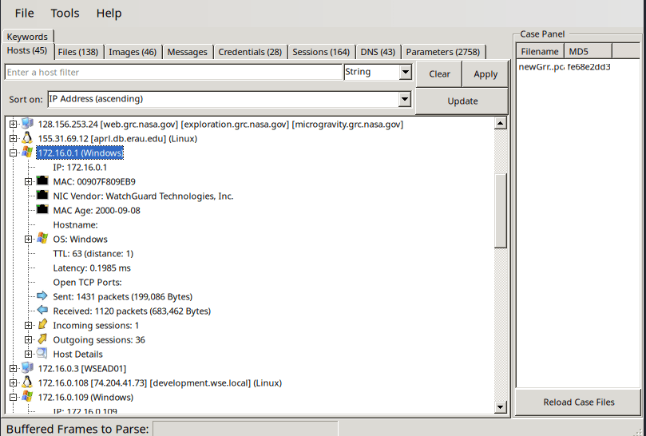


> 172.16.0.1


### Q7 IR: According to the IDS alert, the Zeus bot attempted to ping an external website to verify connectivity. What was the IP address of the website pinged? {#3467b0eb61a480f6aadbe010abcd75d4}


The result’s already given: 


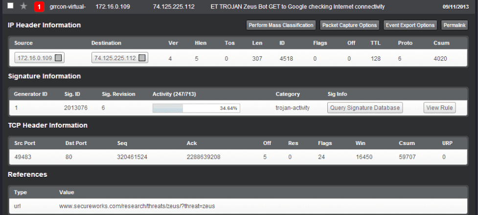


74.125.225.112


### Q8 PCAP: It’s critical to the infrastructure team to identify the Zeus Bot CNC server IP address so they can block communication in the firewall as soon as possible. Please provide the IP address? {#3467b0eb61a480878365d02f7674c0d0}


Use the alert Zui alert:


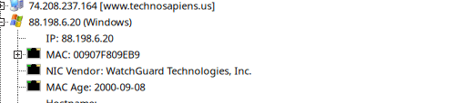


88.198.6.20


### Q9 PCAP: The infrastructure team also requests that you identify the filename of the “.bin” configuration file that the Zeus bot downloaded right after the infection. Please provide the file name? {#3467b0eb61a4800c8df0f216b85108dc}


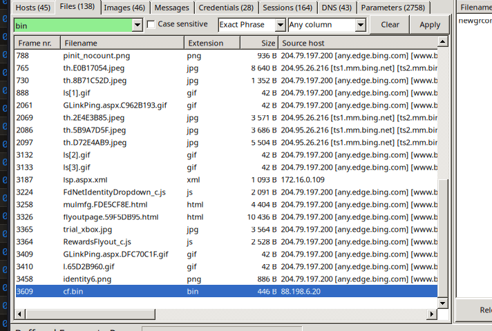


Check files tab in networkminer, the cf.bin was downloaded from 88.198.6.20 on 172.16.0.109 (windows)


> cf.bin


### Q10 PCAP: No other users accessed the development.wse.local WordPress site during the timeline of the incident and the reports indicate that an account successfully logged in from the external interface. Please provide the password they used to log in to the WordPress page around 6:59 PM EST? {#3467b0eb61a48024a954dea19c3219ca}


Again check the credentials tab in networkminer:


During summer time (Daylight Saving Time), 6:59 PM EDT (Eastern Daylight Time) is **22:59 UTC** (10:59 PM).


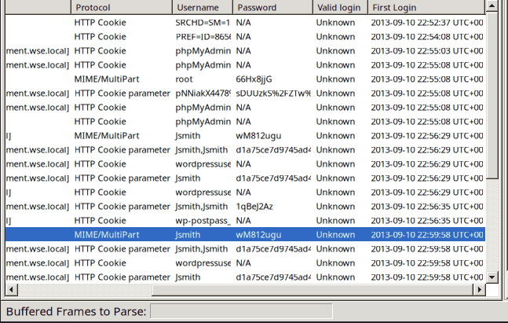


172.16.0.109	172.16.0.109	172.16.0.108 [development.wse.local]	MIME/MultiPart	Jsmith	wM812ugu	Unknown	2013-09-10 22:56:29 UTC+00


> wM812ugu


### Q11 PCAP: After reporting that the WordPress page was indeed accessed from an external connection, your boss comes to you in a rage over the potential loss of confidential top-secret documents. He calms down enough to admit that the design's page has a separate access code outside to ensure the security of their information. Before storming off he provided the password to the designs page “1qBeJ2Az” and told you to find a timestamp of the access time or you will be fired. Please provide the time of the accessed Designs page? {#3467b0eb61a480ca8ba9cc3eb36527ed}


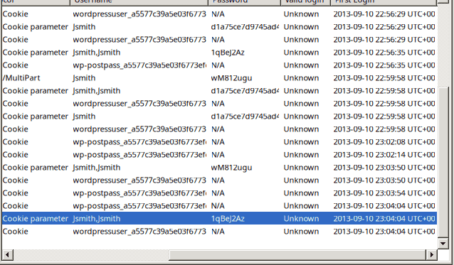


23:04:04 UTC


### Q12 PCAP: What is the source port number in the shellcode exploit? Dest Port was 31708 IDS Signature GPL SHELLCODE x86 inc ebx NOOP {#3467b0eb61a4809ab455edd24f2e3651}


The alert triggered was `GPL SHELLCODE x86 inc ebx NOOP`. This signature scans packet payloads looking for a massive block of `0x43` bytes. In x86 assembly, `0x43` translates to `inc ebx` (increment the EBX register), which attackers frequently use as an alternative "NOP sled" to evade basic security tools that only look for the standard `0x90` NOP sled.

- NOP - No operation: `0x90` . If the packets have a chunk of `0x90909090` ⇒ IDS will block it
- Attacker knew that, so he changed to chunk into `0x43` for defense evasion.

In Zui i use the query: `id.resp_p==31708`


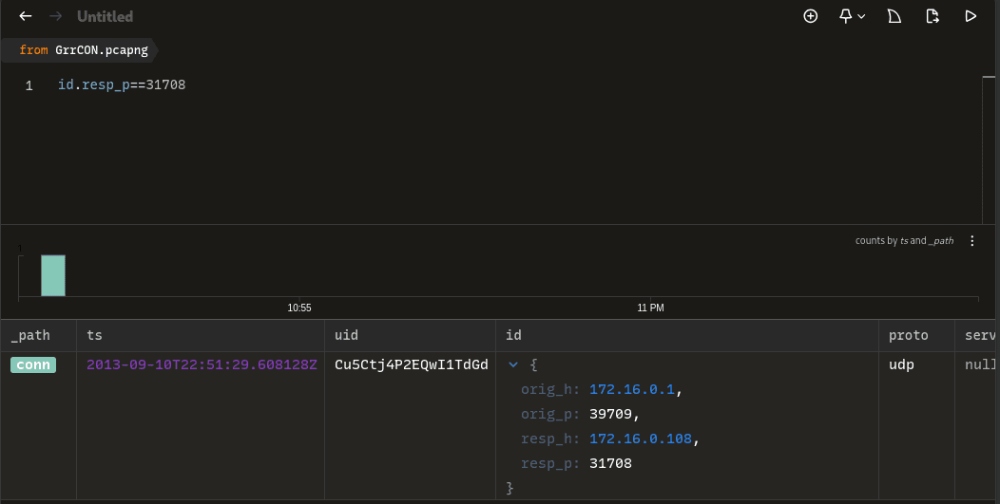


We can also confirm that hacker use UDP, which is less common than TCP.


> 39709


### Q13 PCAP: What was the Linux kernel version returned from the meterpreter sysinfo command run by the attacker? {#3467b0eb61a480428779ef7faa0f5fe0}


using the filter: `ip.addr==172.16.0.108 && tcp contains “sysinfo”`


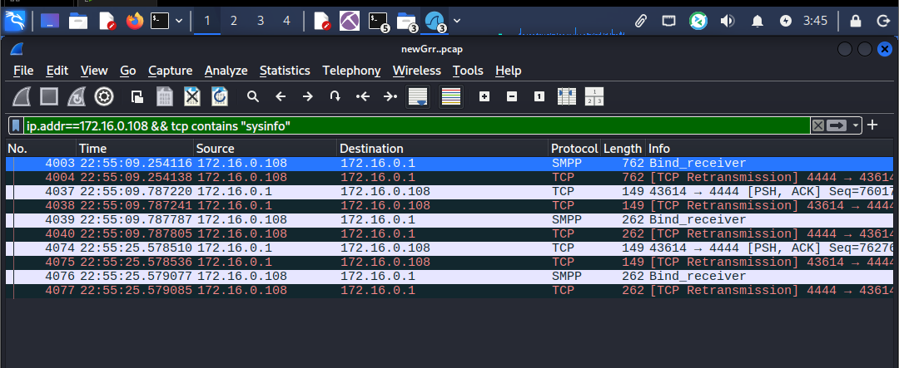


We can see the 4444 ports aka Metasploit’s default port (meterpreter bind/reverse shell) between linux (172.16.0.108) and attacker (172.16.0.1)


Follow TCP stream resulted in: 


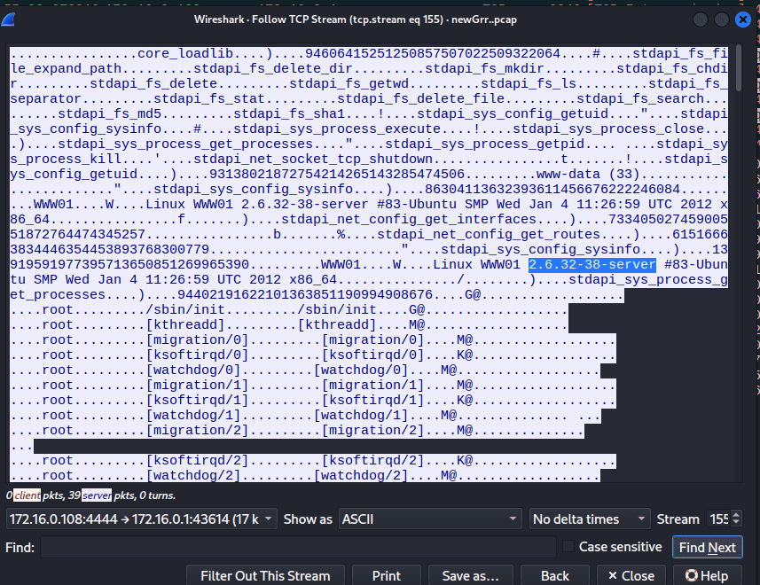


> `2.6.32-38-server`


### Q14 PCAP: What is the value of the token passed in frame 3897? {#3467b0eb61a4804e8e78d2f4dd556c47}


Form item: "token" = "b7aad621db97d56771d6316a6d0b71e9”


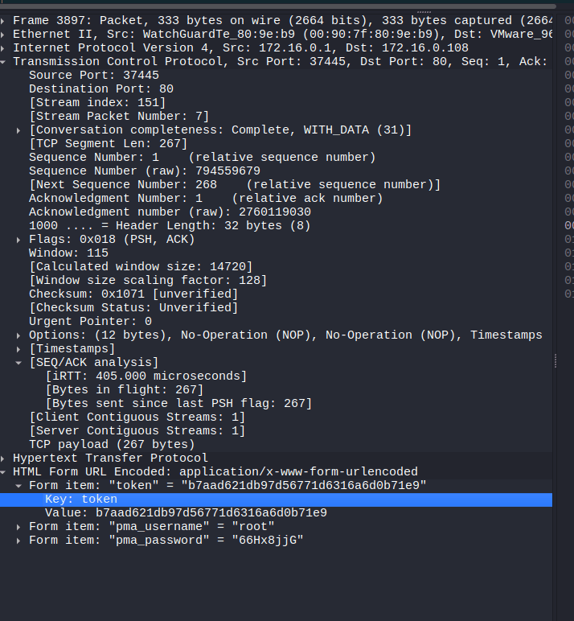


### Q15 PCAP: What was the tool that was used to download a compressed file from the webserver? {#3467b0eb61a480f6ad0edd9d8cfdec94}


Skim through networkminer’s files tab. I can conclude the compressed type is: gz


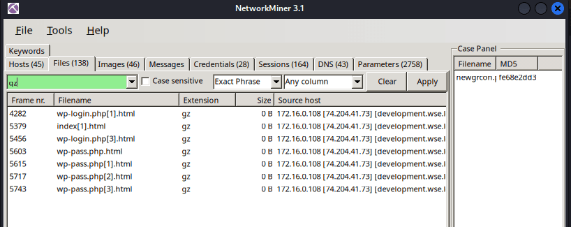


Then i switch to Wireshark and use the filter: http.request.uri contains “gz”


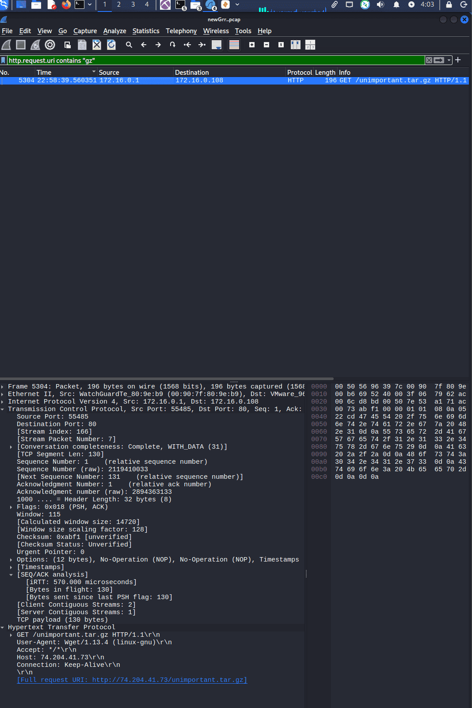


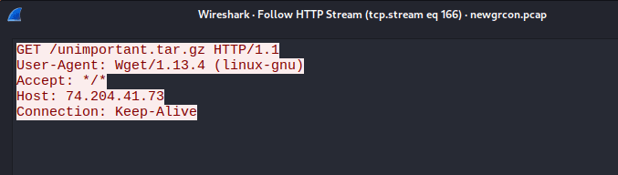


wget


### Q16 PCAP: What is the download file name the user launched the Zeus bot? {#3467b0eb61a480a5a2b8f0e71a37b73f}


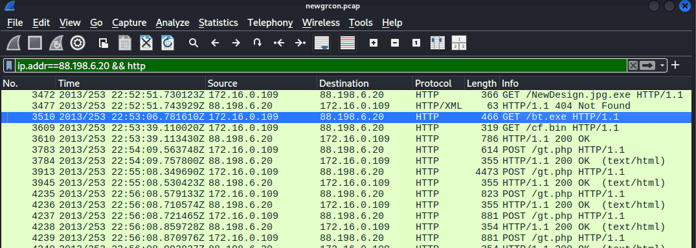


bt.exe


### Q17 Memory: What is the full file path of the system shell spawned through the attacker's meterpreter session? {#3467b0eb61a48093bd69f88f9eea76be}


Analyzing linux memory with volatility 2 is quite tricky. You have to create another folder and put the provided plugin DFIRwebsvr.zip into it. Mine is `~/.volatility/plugins/overlays/linux`


First we use linux_psaux  which is equivalent to typing ps aux on the CLI


```powershell
 vol2  --plugins=/home/cuong_nguyen/.volatility/plugins -f webserver.vmss --profile=LinuxDFIRwebsvrx64 linux_psaux

```


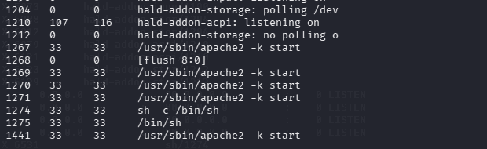


We focus on two suspicious processes:

- PID 1274: `sh -c /bin/sh` (UID 33)
- PID 1275: `/bin/sh` (UID 33)

In Linux, **`sh`** (short for **shell**) is **a command-line interpreter that executes commands from the terminal or a script file**. It is based on the original **Bourne Shell**


If an attacker injects `whoami` into Apache, Apache might run it and throw the answer into a log file, but the attacker won't see it on their screen because there is no interactive prompt.


When the attacker injects `sh -c /bin/sh`, they are forcing that blind, deaf Apache background process to suddenly wake up, create a TTY (interactive prompt), and connect it back to the attacker's machine.


so the answer should be


> /bin/sh


### Q18 Memory: What is the Parent Process ID of the two 'sh' sessions? {#3467b0eb61a4804ea72eda2bbaa23214}


use the linux_pstree plugin, we can see that the apache2 process created 2 sh sessions.


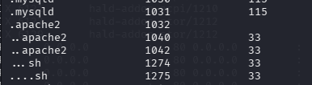


> `1042`


### Q19 Memory: What is the latency_record_count for PID 1274? {#3467b0eb61a480a4b28cd79458db3a69}


Use pslist we get the offset: 0xffff880006dd8000


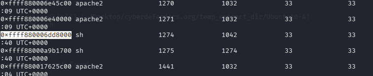


```c++
dt("task_struct", 0xffff880006dd8000)
```


Use the linux_volshell plugin and use the Display Type command to parse task_struct, the Linux equivalent of Windows _EPROCESS. It contains everything OS need to know about the process.


Include: 


`0x7b0 : latency_record_count               0`


Here is how to read this:

- **`0x7b0`** **(offset):** 0x7b0 away from the starting address of the process.
- **`latency_record_count`** **(The Field):** the variable name defined by the Linux kernel developers inside the `task_struct` C code.
- **`0`** **(The Value):** This is the actual data sitting in memory at that exact moment for PID 1274.

> 0


### Q20 Memory: For the PID 1274, what is the first mapped file path? {#3467b0eb61a480beb5dfdbfb87bfc8b6}


use the `linux_proc_maps -p 1274` to figure out.


the `linux_proc_maps` plugin reconstructs the executables, external libraries of the process. The equivalent’s for windows is `vadinfo` , which check the virtual address description (the start, and end of the address range, check for proctection type: `PAGE_EXECUTE_READWRITE` ,…)


```c++
┌──(cuong_nguyen㉿Kali)-[~/Desktop/cyberdefenders.org/temp_extract_dir/Ubuntu10-4]
└─$ vol2 --plugins=/home/cuong_nguyen/.volatility/plugins -f webserver.vmss --profile=LinuxDFIRwebsvrx64 linux_proc_maps -p 1274
Volatility Foundation Volatility Framework 2.6
Offset             Pid      Name                 Start              End                Flags               Pgoff Major  Minor  Inode      File Path
------------------ -------- -------------------- ------------------ ------------------ ------ ------------------ ------ ------ ---------- ---------
0xffff880006dd8000     1274 sh                   0x0000000000400000 0x0000000000418000 r-x                   0x0      8      1     651536 /bin/dash
0xffff880006dd8000     1274 sh                   0x0000000000617000 0x0000000000618000 r--               0x17000      8      1     651536 /bin/dash
0xffff880006dd8000     1274 sh                   0x0000000000618000 0x0000000000619000 rw-               0x18000      8      1     651536 /bin/dash
0xffff880006dd8000     1274 sh                   0x0000000000619000 0x000000000061c000 rw-                   0x0      0      0          0 
0xffff880006dd8000     1274 sh                   0x000000000151a000 0x000000000153b000 rw-                   0x0      0      0          0 [heap]
0xffff880006dd8000     1274 sh                   0x00007f878ac5f000 0x00007f878addc000 r-x                   0x0      8      1     652393 /lib/libc-2.11.1.so
0xffff880006dd8000     1274 sh                   0x00007f878addc000 0x00007f878afdb000 ---              0x17d000      8      1     652393 /lib/libc-2.11.1.so
0xffff880006dd8000     1274 sh                   0x00007f878afdb000 0x00007f878afdf000 r--              0x17c000      8      1     652393 /lib/libc-2.11.1.so
0xffff880006dd8000     1274 sh                   0x00007f878afdf000 0x00007f878afe0000 rw-              0x180000      8      1     652393 /lib/libc-2.11.1.so
0xffff880006dd8000     1274 sh                   0x00007f878afe0000 0x00007f878afe5000 rw-                   0x0      0      0          0 
0xffff880006dd8000     1274 sh                   0x00007f878afe5000 0x00007f878b005000 r-x                   0x0      8      1     652382 /lib/ld-2.11.1.so
0xffff880006dd8000     1274 sh                   0x00007f878b1f2000 0x00007f878b1f5000 rw-                   0x0      0      0          0 
0xffff880006dd8000     1274 sh                   0x00007f878b202000 0x00007f878b204000 rw-                   0x0      0      0          0 
0xffff880006dd8000     1274 sh                   0x00007f878b204000 0x00007f878b205000 r--               0x1f000      8      1     652382 /lib/ld-2.11.1.so
0xffff880006dd8000     1274 sh                   0x00007f878b205000 0x00007f878b206000 rw-               0x20000      8      1     652382 /lib/ld-2.11.1.so
0xffff880006dd8000     1274 sh                   0x00007f878b206000 0x00007f878b207000 rw-                   0x0      0      0          0 
0xffff880006dd8000     1274 sh                   0x00007fff5f643000 0x00007fff5f659000 rw-                   0x0      0      0          0 [stack]
0xffff880006dd8000     1274 sh                   0x00007fff5f7a1000 0x00007fff5f7a2000 r-x                   0x0      0      0          0 [vdso]

```


`bin/sh` is not an actual program; it is merely a symbolic link (a shortcut) pointing to `/bin/dash` (the Debian Almquist shell). When the operating system actually executes the process and maps it into memory, it resolves the shortcut and loads the _real_ binary (`/bin/dash`). This is a classic DFIR trivia point that proves you are looking at the true execution state.


> /bin/dash


### Q21 Memory:What is the md5hash of the receive.1105.3 file out of the per-process packet queue? {#3467b0eb61a4806a8adefe2fea762625}


`vol2 --plugins=/home/cuong_nguyen/.volatility/plugins -f webserver.vmss --profile=LinuxDFIRwebsvrx64 linux_pkt_queues -D output_packets/`


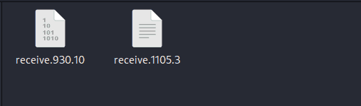


When a computer communicates over a network, packets don’t instantly teleport from the network cable into an application. They sit in temporary areas in the kernel’s mem called “packet queues” (sk_buff in Linux)


The plugin: linux_pkt_queues scours the memory dump looking for the sk_buff structures and reconstructs the network packets trapped inside them, essentially recovering a mini-PCAP file directly out of the RAM. 


> 184c8748cfcfe8c0e24d7d80cac6e9bd


## Key takeway {#3467b0eb61a48027becfdcd4f7b430fd}


This lab highlights the importance of memory forensics in uncovering post-exploitation activities that network traffic alone cannot fully reveal. The following Volatility plugins were crucial for analyzing the compromised Linux web server:

- `linux_psaux`: Replicates the live `ps aux` command. It lists all processes running at the time of the memory dump, revealing their command-line arguments and user IDs. This is critical for spotting anomalous shells spawned by web service accounts.
- `linux_pstree`: Maps the parent-child relationships between running processes. It helps analysts trace the execution flow, such as proving that an interactive shell session was spawned directly by the compromised `apache2` service.
- `linux_volshell` (with the `dt` command): An advanced interactive shell for memory parsing. Using the `dt` (Display Type) command allows an analyst to overlay C data structures (like `task_struct`, the Linux equivalent of Windows' `_EPROCESS`) onto raw memory addresses. This is used to inspect deep kernel-level process profiling and statistics.
- `linux_proc_maps`: Reconstructs the memory mappings of a specific process ID. It shows the exact paths of the executables and shared libraries loaded into memory. This reveals the true execution state of the payload, such as showing that `/bin/sh` dynamically resolves to the actual `/bin/dash` binary during execution.
- `linux_pkt_queues`: Scours kernel memory for `sk_buff` structures to recover network packets trapped in temporary queues. By using the `-D` flag, analysts can extract these packets into a mini-PCAP or carve out files that were actively in transit at the exact millisecond the RAM was captured.
