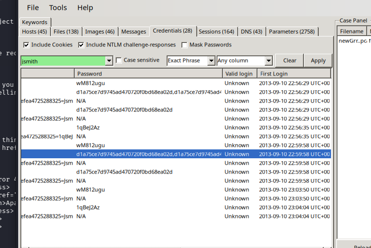
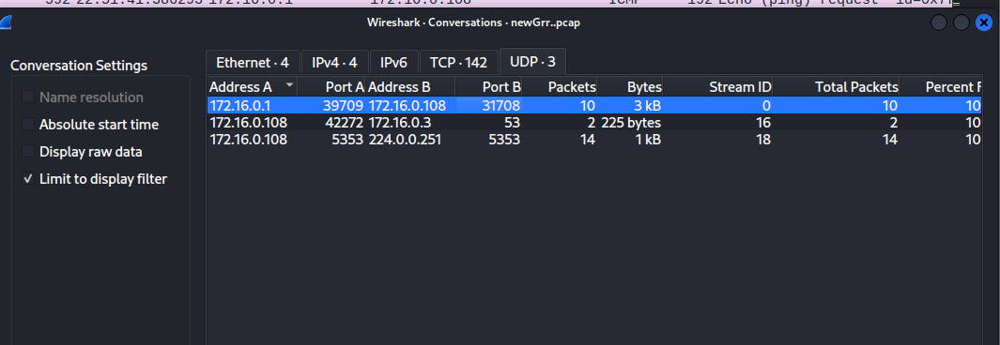
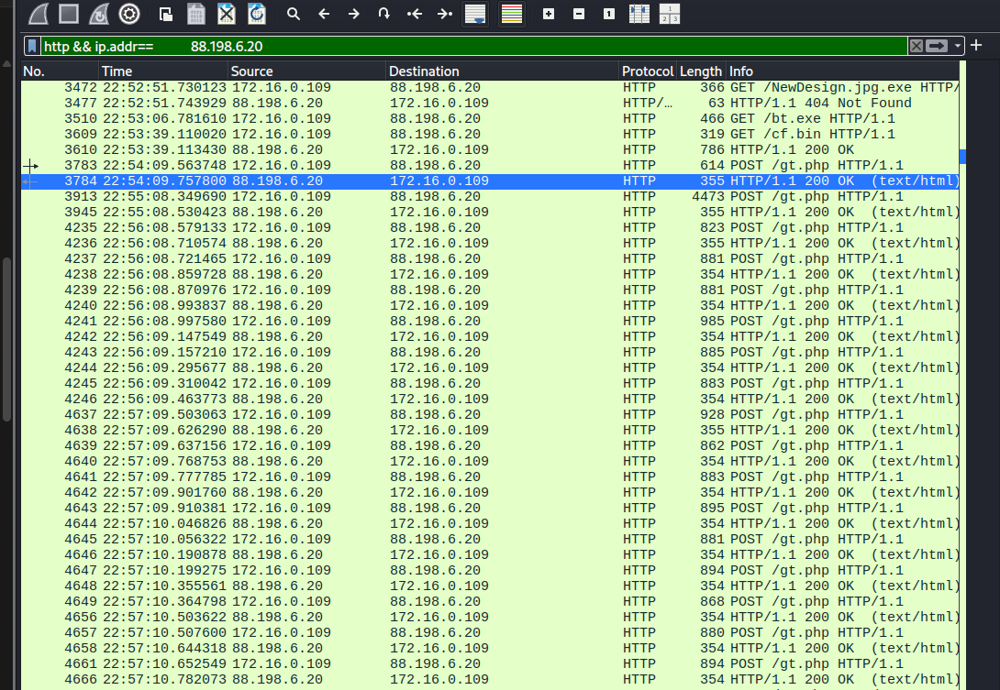
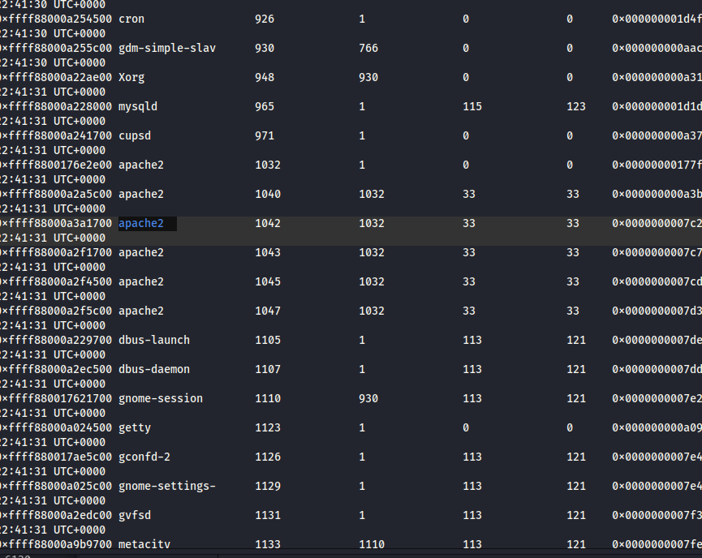
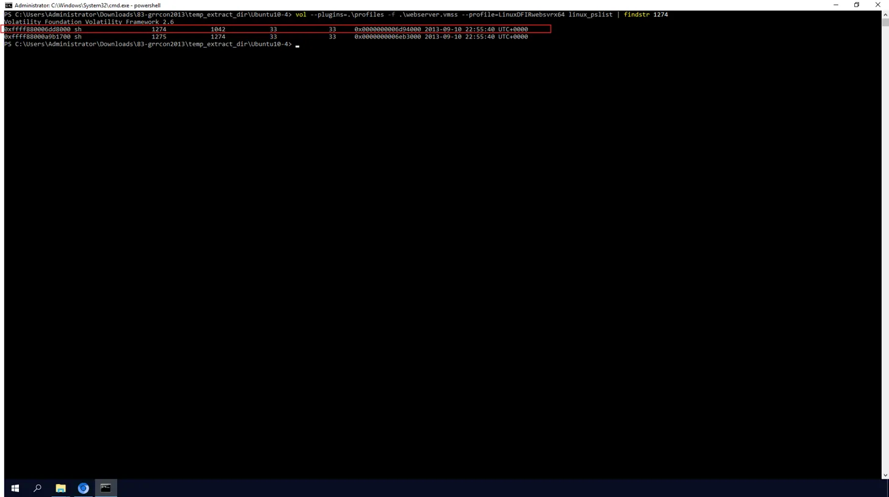

**Zeus** (hay còn được biết đến với tên gọi **Zbot**).


### 1. Phân loại và Mục tiêu {#3467b0eb61a480b3a9a2d3c500487fce}

- **Loại mã độc:** Zeus là một **Banking Trojan** (Trojan nhắm vào mảng tài chính/ngân hàng) thuộc hàng khét tiếng, tinh vi và có tầm ảnh hưởng lớn nhất trong lịch sử an ninh mạng.
- **Mục tiêu chính:** Nhiệm vụ cốt lõi của nó là lây nhiễm vào các hệ thống Windows để đánh cắp thông tin tài chính, thông tin đăng nhập ngân hàng trực tuyến và chi tiết thẻ tín dụng của nạn nhân.

### 2. Cách thức hoạt động và Tính năng nguy hiểm {#3467b0eb61a4808aa3e3ddaed5a27dd1}


Vũ khí khiến Zeus trở thành một huyền thoại nằm ở khả năng thao túng trình duyệt một cách hoàn hảo:

- **Man-in-the-Browser (MitB) & Web Injects:** Khi nạn nhân truy cập vào trang web ngân hàng hợp pháp, Zeus sẽ can thiệp trực tiếp vào luồng hoạt động của trình duyệt. Nó có thể "tiêm" (inject) thêm các trường dữ liệu giả mạo ngay trên giao diện trang web thật để lừa nạn nhân nhập các thông tin nhạy cảm (như mã số bảo mật thẻ, mã OTP) mà giao diện trông vẫn hoàn toàn đáng tin cậy.
- **Form Grabbing:** Nhờ việc nằm sâu trong trình duyệt, Zeus có thể "chộp" lấy mọi dữ liệu mà người dùng điền vào các biểu mẫu (form) trên web _ngay trước khi_ dữ liệu đó kịp được mã hóa bằng giao thức HTTPS để gửi đi.
- **Mở rộng Botnet:** Máy tính bị nhiễm Zeus sẽ bị âm thầm gia nhập vào một mạng lưới Botnet khổng lồ. Từ máy chủ điều khiển (C2 Server), kẻ tấn công có thể ra lệnh cho các máy tính này tải thêm các bản cập nhật mã độc mới, cấu hình web inject mới, hoặc sử dụng máy tính đó để thực hiện các cuộc tấn công DDoS.

| 172.16.0.109 (windows) | 198.116.65.32                                               | 198.116.65.32 [[www.hq.nasa.gov](http://www.hq.nasa.gov/)]                                                                                                                                    |
| ---------------------- | ----------------------------------------------------------- | --------------------------------------------------------------------------------------------------------------------------------------------------------------------------------------------- |
|                        | 128.156.253.24                                              | 128.156.253.24 [[web.grc.nasa.gov](http://web.grc.nasa.gov/)] [[exploration.grc.nasa.gov](http://exploration.grc.nasa.gov/)] [[microgravity.grc.nasa.gov](http://microgravity.grc.nasa.gov/)] |
|                        | 74.208.237.164                                              | 74.208.237.164 [[www.technosapiens.us](http://www.technosapiens.us/)]                                                                                                                         |
|                        | 88.198.6.20                                                 | 88.198.6.20 (Windows)                                                                                                                                                                         |
|                        | 204.79.197.200                                              | 204.79.197.200 [[any.edge.bing.com](http://any.edge.bing.com/)] [[www.bing.com](http://www.bing.com/)]                                                                                        |
|                        | 205.168.3.71                                                | 205.168.3.71 [[www.estesrockets.com](http://www.estesrockets.com/)]                                                                                                                           |
| 172.16.0.1             | 172.16.0.108 [74.204.41.73] [development.wse.local] (Linux) |                                                                                                                                                                                               |


Q1 PCAP: Development.wse.local is a critical asset for the Wayne and Stark Enterprises, where the company stores new top-secret designs on weapons. Jon Smith has access to the website and we believe it may have been compromised, according to the IDS alert we received earlier today. First, determine the Public IP Address of the webserver?


172.16.0.108 [74.204.41.73] [development.wse.local] (Linux)


Q2 PCAP: Alright, now we need you to determine a starting point for the timeline that will be useful in mapping out the incident. Please determine the arrival time of frame 1 in the "GrrCON.pcapng" evidence file.


22:51:07 UTC


Q3 PCAP: What version number of PHP is the development.wse.local server running?


HTTP/1.1 200 OK
Date: Tue, 10 Sep 2013 22:51:28 GMT
Server: Apache/2.2.14 (Ubuntu)
X-Powered-By: PHP/5.3.2-1ubuntu4.20
X-Pingback: [http://development.wse.local/xmlrpc.php](http://development.wse.local/xmlrpc.php)
Vary: Accept-Encoding
Content-Length: 7174
Connection: close
Content-Type: text/html; charset=UTF-8


Q4 PCAP: What version number of Apache is the development.wse.local web server using?


2.2.14


Q5 IR: What is the common name of the malware reported by the IDS alert provided?


zeus


Q6 PCAP: Please identify the Gateway IP address of the LAN because the infrastructure team reported a potential problem with the IDS server that could have corrupted the PCAP


Q7 IR: According to the IDS alert, the Zeus bot attempted to ping an external website to verify connectivity. What was the IP address of the website pinged?


74.125.225.112


Q8 PCAP: It’s critical to the infrastructure team to identify the Zeus Bot CNC server IP address so they can block communication in the firewall as soon as possible. Please provide the IP address?


88.198.6.20


Q9 PCAP: The infrastructure team also requests that you identify the filename of the “.bin” configuration file that the Zeus bot downloaded right after the infection. Please provide the file name?


cf.bin


Do thằng 88.198.6.20 tải về máy 172.16.0.109 (windows)


Q10 PCAP: No other users accessed the development.wse.local WordPress site during the timeline of the incident and the reports indicate that an account successfully logged in from the external interface. Please provide the password they used to log in to the WordPress page around 6:59 PM EST?


172.16.0.109	172.16.0.109	172.16.0.108 [development.wse.local]	MIME/MultiPart	Jsmith	wM812ugu	Unknown	2013-09-10 22:56:29 UTC+00





Q11 PCAP: After reporting that the WordPress page was indeed accessed from an external connection, your boss comes to you in a rage over the potential loss of confidential top-secret documents. He calms down enough to admit that the design's page has a separate access code outside to ensure the security of their information. Before storming off he provided the password to the designs page “1qBeJ2Az” and told you to find a timestamp of the access time or you will be fired. Please provide the time of the accessed Designs page?


23:04:04 UTC


Q12 PCAP: What is the source port number in the shellcode exploit? Dest Port was 31708 IDS Signature GPL SHELLCODE x86 inc ebx NOOP


`udp.dstport == 31708`





Q13 PCAP: What was the Linux kernel version returned from the meterpreter sysinfo command run by the attacker?


 ta có thể thấy rõ port **4444** xuất hiện. Đây là cổng mặc định "huyền thoại" của Metasploit (dùng cho Meterpreter Bind/Reverse Shell). Gói tin cũng hiển thị cuộc giao tiếp qua lại giữa IP `172.16.0.1` (khả năng cao là Hacker) và `172.16.0.108` (máy nạn nhân Linux).


2.6.32-38-server


Q14 PCAP: What is the value of the token passed in frame 3897?


Form item: "token" = "b7aad621db97d56771d6316a6d0b71e9”


Q15 PCAP: What was the tool that was used to download a compressed file from the webserver?


wget


Q16 PCAP: What is the download file name the user launched the Zeus bot?


bt.exe





Q17 Memory: What is the full file path of the system shell spawned through the attacker's meterpreter session?


/bin/sh


1275   33     33     /bin/sh 


Q18 Memory: What is the Parent Process ID of the two 'sh' sessions?





Q19 Memory: What is the latency_record_count for PID 1274?


Từ pslist ta lấy được địa chỉ offset: 0xffff880006dd8000


Sau đó vào linux_volshell (plugin) và dùng lệnh


```c++
dt("task_struct", 0xffff880006dd8000)
```


```c++
0x678 : io_context                     0
0x680 : ptrace_message                 0
0x688 : last_siginfo                   0
0x690 : ioac                           18446612132429399696
0x6c8 : acct_rss_mem1                  10000
0x6d0 : acct_vm_mem1                   20000
0x6d8 : acct_timexpd                   1
0x6e0 : mems_allowed                   18446612132429399776
0x6e8 : cpuset_mem_spread_rotor        0
0x6f0 : cgroups                        18446744071589404320
0x6f8 : cg_list                        18446612132429399800
0x708 : robust_list                    0
0x710 : compat_robust_list             0
0x718 : pi_state_list                  18446612132429399832
0x728 : pi_state_cache                 0
0x730 : perf_event_ctxp                0
0x738 : perf_event_mutex               18446612132429399864
0x758 : perf_event_list                18446612132429399896
0x768 : mempolicy                      0
0x770 : il_next                        0
0x774 : fs_excl                        18446612132429399924
0x778 : rcu                            18446612132429399928
0x788 : splice_pipe                    0
0x790 : delays                         0
0x798 : dirties                        18446612132429399960
0x7b0 : latency_record_count           0
0x7b8 : latency_record                 -
0x16b8: timer_slack_ns                 50000
0x16c0: default_timer_slack_ns         50000
0x16c8: scm_work_list                  0
0x16d0: curr_ret_stack                 -1
0x16d8: ret_stack                      0
0x16e0: ftrace_timestamp               0
0x16e8: trace_overrun                  18446612132429403880
0x16ec: tracing_graph_pause            18446612132429403884
0x16f0: trace                          0
0x16f8: trace_recursion                0

```


Q20 Memory: For the PID 1274, what is the first mapped file path?


```c++
┌──(cuong_nguyen㉿Kali)-[~/Desktop/cyberdefenders.org/temp_extract_dir/Ubuntu10-4]
└─$ vol2 --plugins=/home/cuong_nguyen/.volatility/plugins -f webserver.vmss --profile=LinuxDFIRwebsvrx64 linux_proc_maps -p 1274
Volatility Foundation Volatility Framework 2.6
Offset             Pid      Name                 Start              End                Flags               Pgoff Major  Minor  Inode      File Path
------------------ -------- -------------------- ------------------ ------------------ ------ ------------------ ------ ------ ---------- ---------
0xffff880006dd8000     1274 sh                   0x0000000000400000 0x0000000000418000 r-x                   0x0      8      1     651536 /bin/dash
0xffff880006dd8000     1274 sh                   0x0000000000617000 0x0000000000618000 r--               0x17000      8      1     651536 /bin/dash
0xffff880006dd8000     1274 sh                   0x0000000000618000 0x0000000000619000 rw-               0x18000      8      1     651536 /bin/dash
0xffff880006dd8000     1274 sh                   0x0000000000619000 0x000000000061c000 rw-                   0x0      0      0          0 
0xffff880006dd8000     1274 sh                   0x000000000151a000 0x000000000153b000 rw-                   0x0      0      0          0 [heap]
0xffff880006dd8000     1274 sh                   0x00007f878ac5f000 0x00007f878addc000 r-x                   0x0      8      1     652393 /lib/libc-2.11.1.so
0xffff880006dd8000     1274 sh                   0x00007f878addc000 0x00007f878afdb000 ---              0x17d000      8      1     652393 /lib/libc-2.11.1.so
0xffff880006dd8000     1274 sh                   0x00007f878afdb000 0x00007f878afdf000 r--              0x17c000      8      1     652393 /lib/libc-2.11.1.so
0xffff880006dd8000     1274 sh                   0x00007f878afdf000 0x00007f878afe0000 rw-              0x180000      8      1     652393 /lib/libc-2.11.1.so
0xffff880006dd8000     1274 sh                   0x00007f878afe0000 0x00007f878afe5000 rw-                   0x0      0      0          0 
0xffff880006dd8000     1274 sh                   0x00007f878afe5000 0x00007f878b005000 r-x                   0x0      8      1     652382 /lib/ld-2.11.1.so
0xffff880006dd8000     1274 sh                   0x00007f878b1f2000 0x00007f878b1f5000 rw-                   0x0      0      0          0 
0xffff880006dd8000     1274 sh                   0x00007f878b202000 0x00007f878b204000 rw-                   0x0      0      0          0 
0xffff880006dd8000     1274 sh                   0x00007f878b204000 0x00007f878b205000 r--               0x1f000      8      1     652382 /lib/ld-2.11.1.so
0xffff880006dd8000     1274 sh                   0x00007f878b205000 0x00007f878b206000 rw-               0x20000      8      1     652382 /lib/ld-2.11.1.so
0xffff880006dd8000     1274 sh                   0x00007f878b206000 0x00007f878b207000 rw-                   0x0      0      0          0 
0xffff880006dd8000     1274 sh                   0x00007fff5f643000 0x00007fff5f659000 rw-                   0x0      0      0          0 [stack]
0xffff880006dd8000     1274 sh                   0x00007fff5f7a1000 0x00007fff5f7a2000 r-x                   0x0      0      0          0 [vdso]

```


Q21 Memory:What is the md5hash of the receive.1105.3 file out of the per-process packet queue?


`mkdir output_packets
vol2 --plugins=/home/cuong_nguyen/.volatility/plugins -f webserver.vmss --profile=LinuxDFIRwebsvrx64 linux_pkt_queues -D output_packets/`


184c8748cfcfe8c0e24d7d80cac6e9bd





# Tổng kết {#3467b0eb61a48027becfdcd4f7b430fd}


Câu lệnh hay


`udp.dstport == 31708`


Lịch sử gõ lệnh


	/opt/volatility_2.6_lin64_standalone/volatility_2.6_lin64_standalone --plugins=/home/cuong_nguyen/.volatility/plugins -f webserver.vmss --profile=LinuxDFIRwebsvrx64 linux_bash


	vol2  --plugins=/home/cuong_nguyen/.volatility/plugins -f webserver.vmss --profile=LinuxDFIRwebsvrx64 linux_bash


kết nối mạng:


/opt/volatility_2.6_lin64_standalone/volatility_2.6_lin64_standalone --plugins=/home/cuong_nguyen/.volatility/plugins -f webserver.vmss --profile=LinuxDFIRwebsvrx64 linux_netstat


Kiểm tra danh sách tiến trình


/opt/volatility_2.6_lin64_standalone/volatility_2.6_lin64_standalone --plugins=/home/cuong_nguyen/.volatility/plugins -f webserver.vmss --profile=LinuxDFIRwebsvrx64 linux_psaux

