---


[https://cyberdefenders.org/blueteam-ctf-challenges/boss-of-the-soc-v1/](https://cyberdefenders.org/blueteam-ctf-challenges/boss-of-the-soc-v1/)


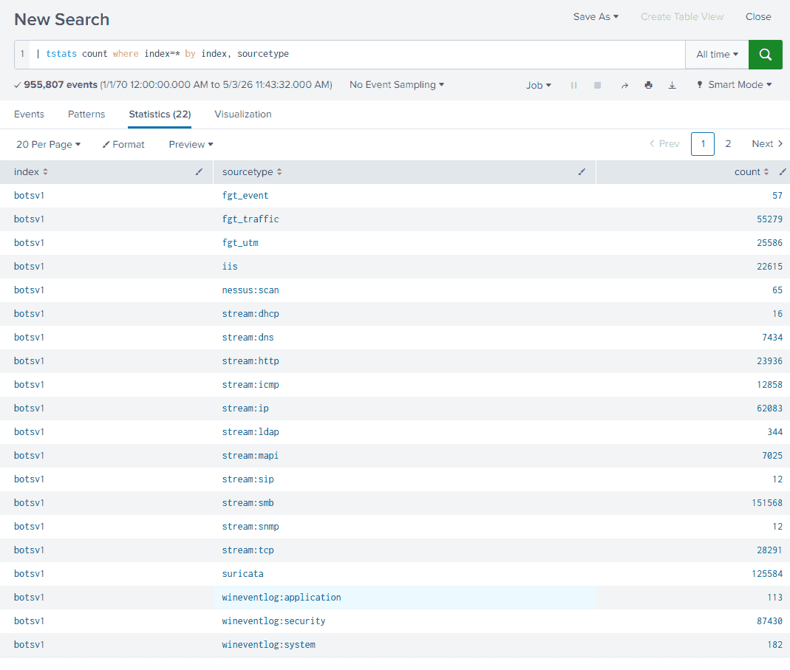


## Artifact {#3557b0eb61a4806dbe91c1b9e71b314f}


| host      | IP                                                           | exe  |
| --------- | ------------------------------------------------------------ | ---- |
| we1149srv | 192.168.250.70                                               |      |
|           | 23.22.63.114 Host: prankglassinebracket.jumpingcrab.com:1337 | 3791 |
|           | `40.80.148.42`                                               |      |


### Q1: This is a simple question to get you familiar with submitting answers. What is the name of the company that makes the software that you are using for this competition? Just a six-letter word with no punctuation. {#3557b0eb61a48066a490eebe5b308a32}


### Q2: Web Defacement: What content management system is [imreallynotbatman.com](http://imreallynotbatman.com/) likely using? (Please do not include punctuation such as . , ! ? in your answer. We are looking for alpha characters only.) {#3557b0eb61a48088a3adedce87d41b69}


sourcetype=* "http.hostname"="imreallynotbatman.com" và tìm http.url


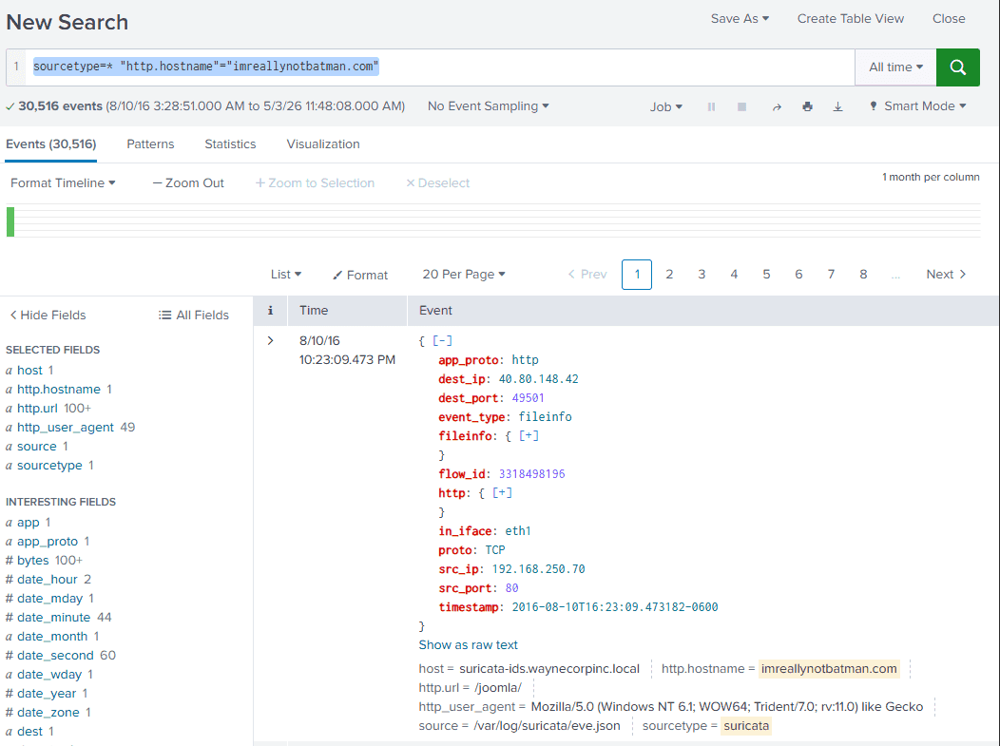


joomla


### Q3: Web Defacement: What is the likely IP address of someone from the Po1s0n1vy group scanning imreallynotbatman.com for web application vulnerabilities? {#3557b0eb61a4809f9443e614676d931d}


sourcetype=suricata AND http.hostname="imreallynotbatman.com" event_type=alert alert.signature=_scan_


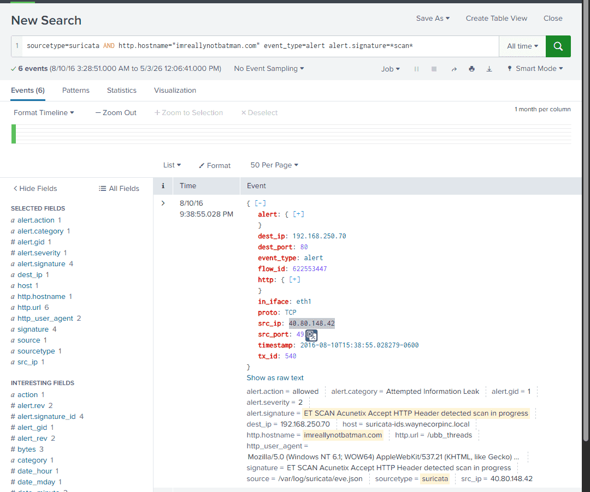


192.168.250.70 -splunk-02


Vì trước đó ta phát hiện hacker sử dụng cmd.exe để thực hiện hành vi. Như vậy phải có tiến trình gọi cmd đó. Ta dùng câu query sau


index="botsv1" source="wineventlog:microsoft-windows-sysmon/operational" EventCode=1 Image="*cmd.exe"   ParentImage!="C:\\Program Files\\SplunkUniversalForwarder\\bin\\splunk.exe" | table  _time host ParentImage CommandLine   | sort  _time


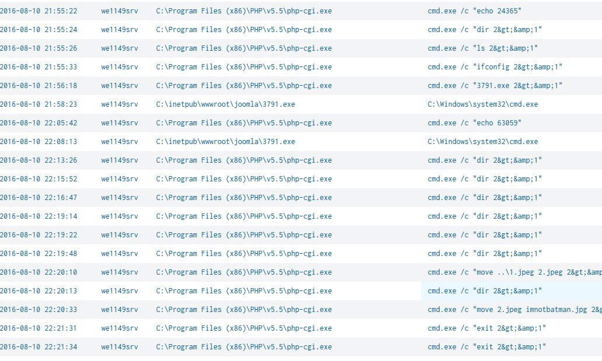


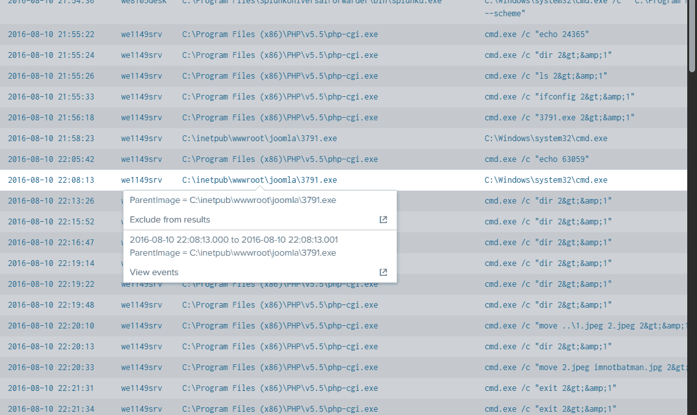


| 2016-08-10 21:58:23 | we1149srv | C:\inetpub\wwwroot\joomla\3791.exe | C:\Windows\system32\cmd.exe |
| ------------------- | --------- | ---------------------------------- | --------------------------- |


**`C:\Program Files (x86)\PHP\v5.5\php-cgi.exe`** **liên tục gọi** **`cmd.exe`**.

- **Bản chất:** `php-cgi.exe` là tiến trình xử lý mã PHP của máy chủ web. Trong điều kiện bình thường, tiến trình này chỉ xử lý code PHP trả về HTML. Nó **không bao giờ** tự động mở Command Prompt (`cmd.exe`) để gõ lệnh hệ thống.
- **Kết luận:** Hacker đã khai thác thành công một lỗ hổng **RCE (Remote Code Execution - Thực thi mã từ xa)** hoặc tải lên thành công một **Web Shell** (một tệp PHP độc hại đóng vai trò như một cửa hậu).

### Q4: Web Defacement: What company created the web vulnerability scanner used by Po1s0n1vy? Type the company name. (For example, "Microsoft" or "Oracle") {#3557b0eb61a480d7b1baf269481220eb}


Acunetix


### Q5: Web Defacement: What IP address is likely attempting a brute force password attack against imreallynotbatman.com? {#3557b0eb61a4802a8d56e8681643c3e8}


23.22.63.114


Trong log chỉ có 2 ip thì khong phải 40.80.148.42 phải là thằng này mà thôi


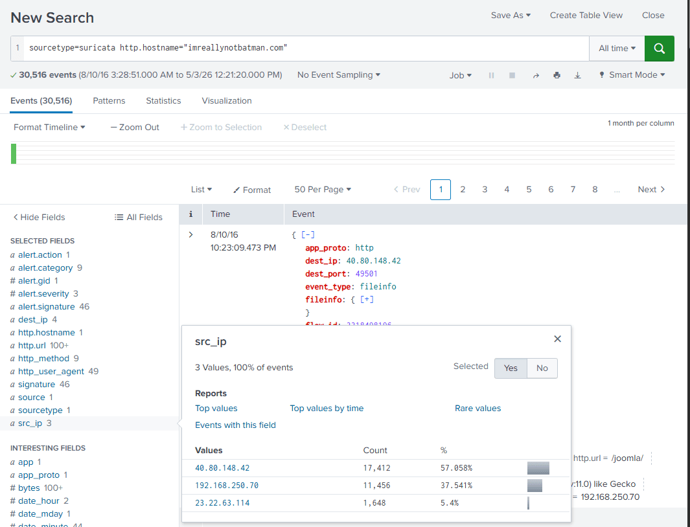


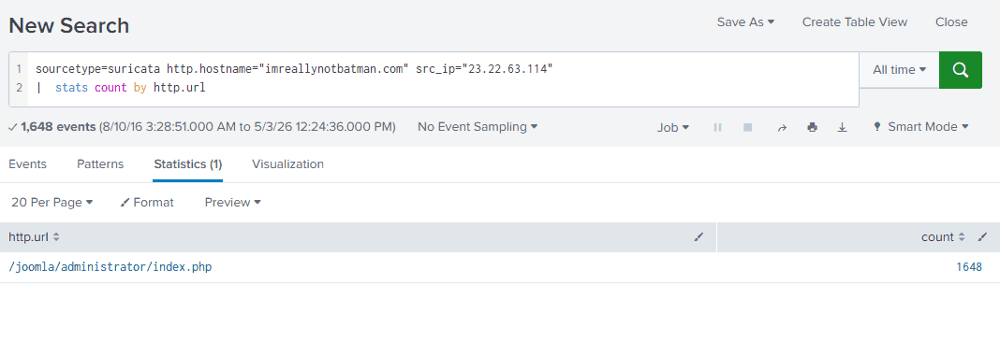


### Q6: Web Defacement: What was the first brute force password used? {#3557b0eb61a4800aaf66d78b48dc9db9}


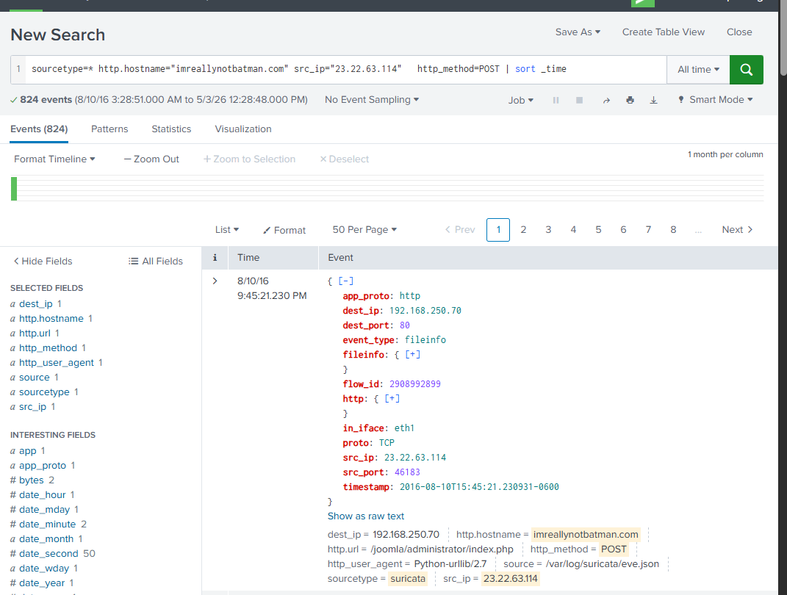


Đi tìm ở suricata thì không thấy log đâu hết vì chỉ lưu metadata


```c++
sourcetype=stream:http dest_ip=192.168.250.70 src_ip=23.22.63.114 http_method=POST 
| sort _time 
|  table _time src_ip http_user_agent form_data
```


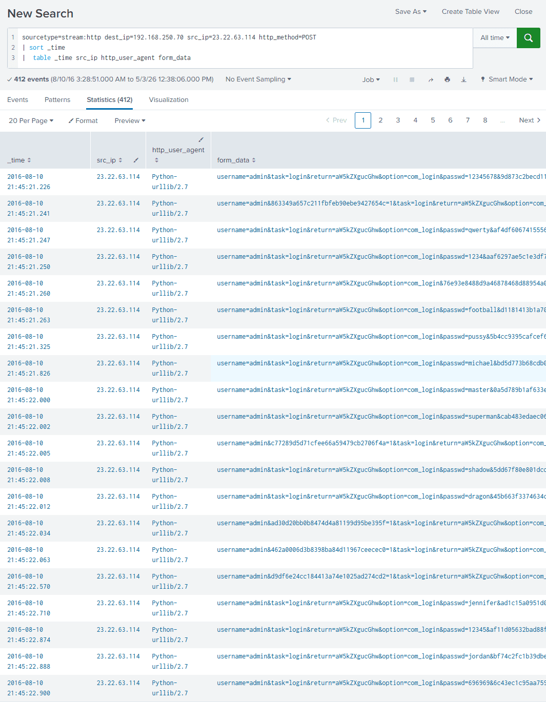


### Q7: Web Defacement: What is the name of the executable uploaded by Po1s0n1vy? Please include the file extension. (For example, "notepad.exe" or "favicon.ico") {#3557b0eb61a480028f5cc24188d86d85}


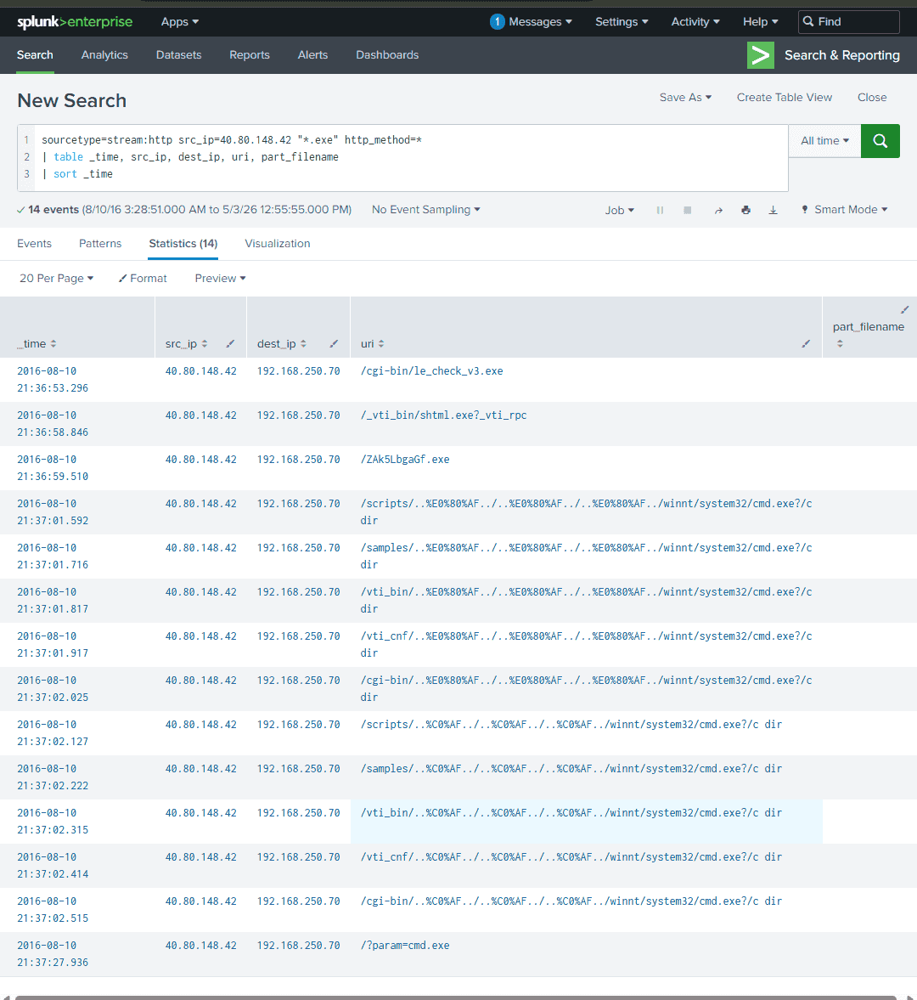


`..%E0%80%AF../..%E0%80%AF../winnt/system32/cmd.exe?/c dir`  directory traversal
Trong 14 gói tin này, hacker **không hề upload (đăng tải)** một file nào lên máy chủ cả. Những chữ `.exe` mà Splunk vớt được (như `shtml.exe`, `cmd.exe`, `le_check_v3.exe`) t


`40.80.148.42` 


`sourcetype="stream:http" http_method=GET dest_ip=23.22.63.114
| table timestamp  http_method uri dest_ip site`


Tìm trên sourcetype nên phải dùng sysmon


### Q8: Web Defacement: What is the MD5 hash of the executable uploaded? {#3557b0eb61a480279cf4f564d0b40869}


Dùng eventiD 1 ta tìm được 


index="botsv1" source="wineventlog:microsoft-windows-sysmon/operational" EventCode=1 Image="*3791.exe" host="we1149srv"  Image="C:\\inetpub\\wwwroot\\joomla\\3791.exe”


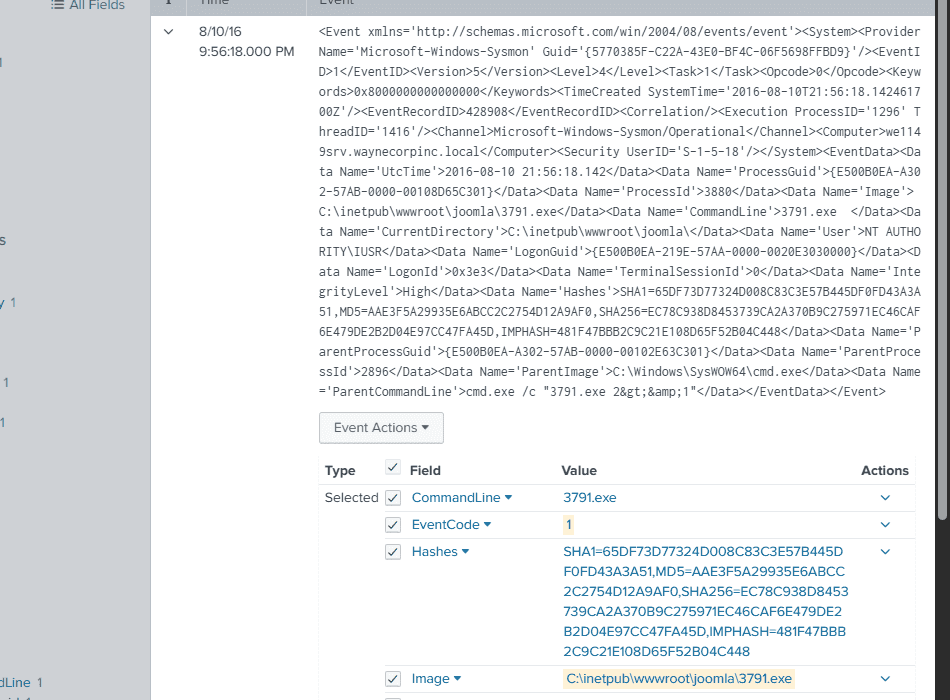


MD5=AAE3F5A29935E6ABCC2C2754D12A9AF0


ta phát hiện đây là meterpreter của Cobalt Strike - Rozena


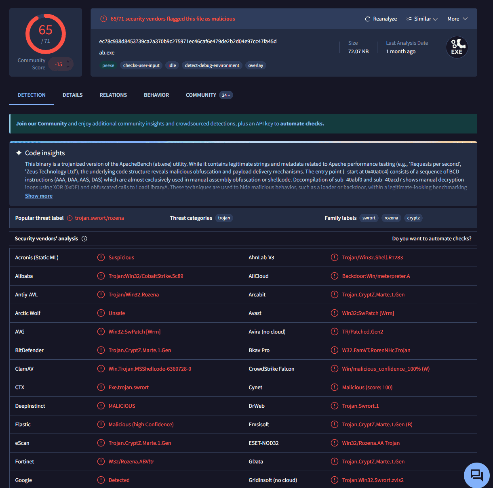


Kiểm tra xem 3791.exe đã làm những gì


index="botsv1" source="wineventlog:microsoft-windows-sysmon/operational" Image=*3791.exe host="we1149srv" | table  _time EventCode Image CommandLine  | sort  _time
| dedup EventCode


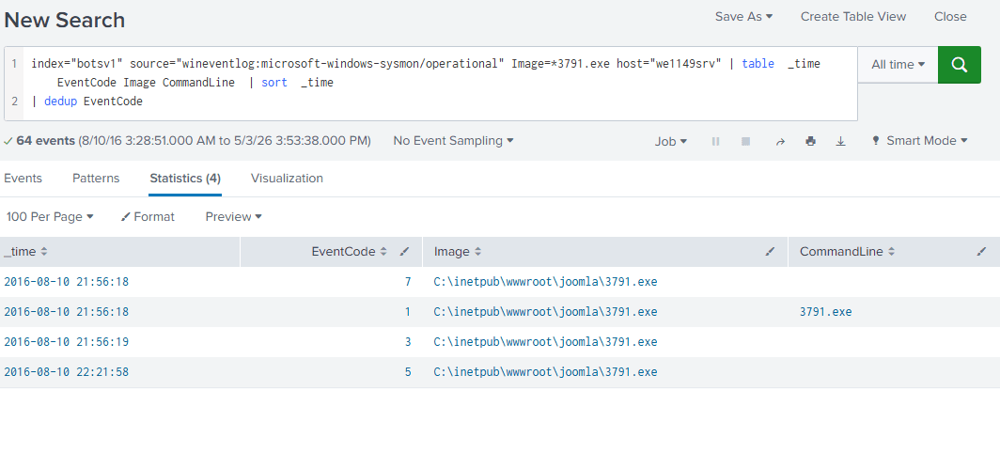


8/10/16


9:56:19.000 PM 


	kết nối tới 23.22.63.114 port 3791


index="botsv1" source="wineventlog:microsoft-windows-sysmon/operational" Image=*3791.exe host="we1149srv"  EventCode=7
| table _time host ImageLoaded


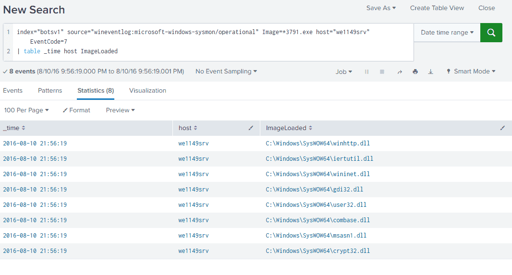


### Q9: Web Defacement: What was the correct password for admin access to the content management system running "imreallynotbatman.com"? {#3557b0eb61a4805fb1ebe6e6c1151bc9}


8/10/16


10:13:46.915 PM


index="botsv1" sourcetype=stream:http src_ip=23.22.63.114 http_method=POST
| rex field=form_data "passwd=(?&lt;password&gt;[^&]+)"
|stats count by password


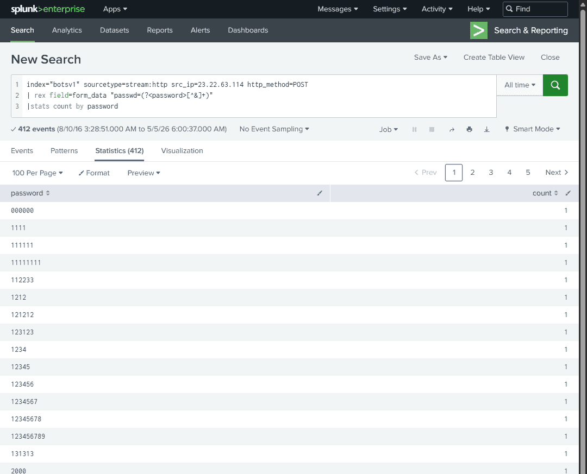


Hacker brute force rất nhiều mật khẩu. Ta tìm xem thằng nào ra response 200


batman


### Q10: Web Defacement: What is the name of the file that defaced the imreallynotbatman.com website? Please submit only the name of the file with the extension (For example, "notepad.exe" or "favicon.ico"). {#3557b0eb61a480baa9cae46e1bb13987}


từ câu 9 ở trên Ta tìm thấy kết quả cho câu 10 poisonivy-is-coming-for-you-batman.jpeg


### Q11: Web Defacement: This attack used dynamic DNS to resolve to the malicious IP. What is the fully qualified domain name (FQDN) associated with this attack? {#3557b0eb61a480d9a54bf7240a816358}


prankglassinebracket.jumpingcrab.com


 2016-08-10T22:06:21.377644Z 


	src_ip: 192.168.250.20


Host: prankglassinebracket.jumpingcrab.com:1337 ta đã phát hiện ra domain này ở những câu hỏi trước


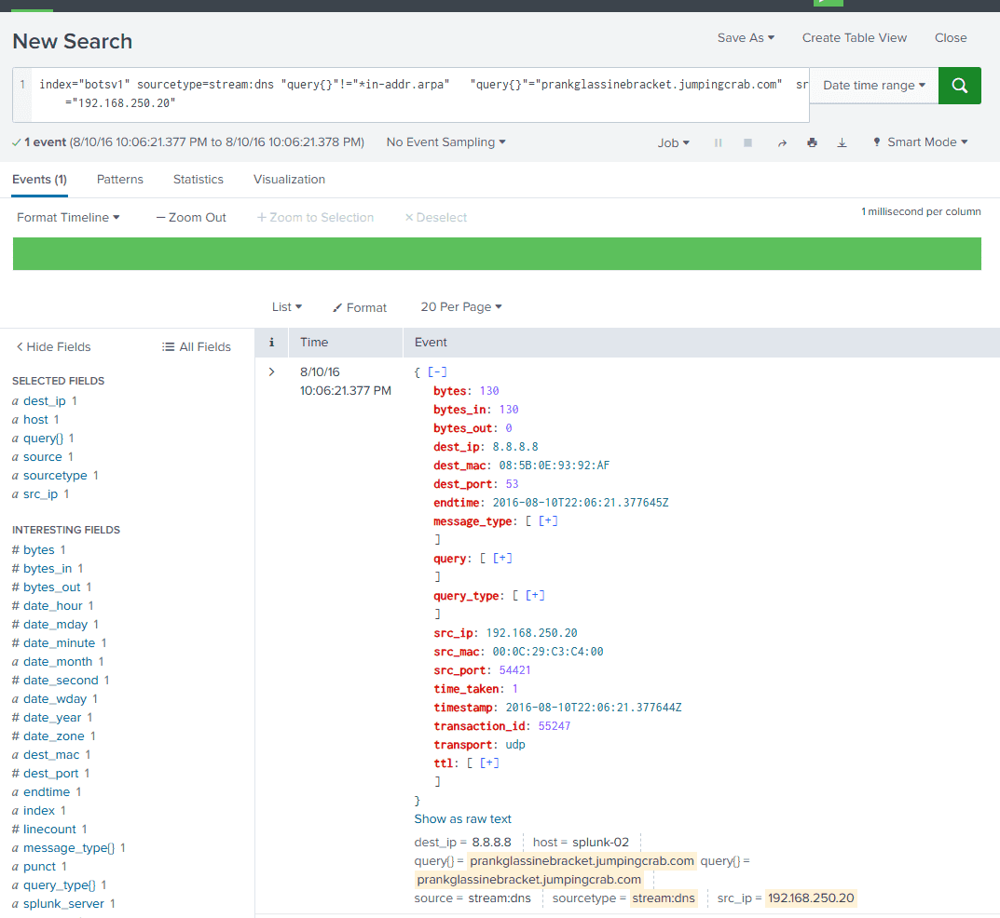


### Q12: Web Defacement: What IP address has Po1s0n1vy tied to domains that are pre-staged to attack Wayne Enterprises? {#3557b0eb61a480059844e05685364f4a}


Pre-staged là những máy chủ ảo VPS để chuẩn bị 


Như những câu hỏi trước thì chỉ có 2 ip tới Wayne Enterprises. Ta nhận kết quả


23.22.63.114


### Q13: Web Defacement: Based on the data gathered from this attack and common open-source intelligence sources for domain names, what is the email address most likely associated with the Po1s0n1vy APT group? {#3557b0eb61a480ecabb2cfde427b9198}


We use [whoxy.com](http://whoxy.com/) to check the [https://www.whoxy.com/po1s0n1vy.com](https://www.whoxy.com/po1s0n1vy.com) domain


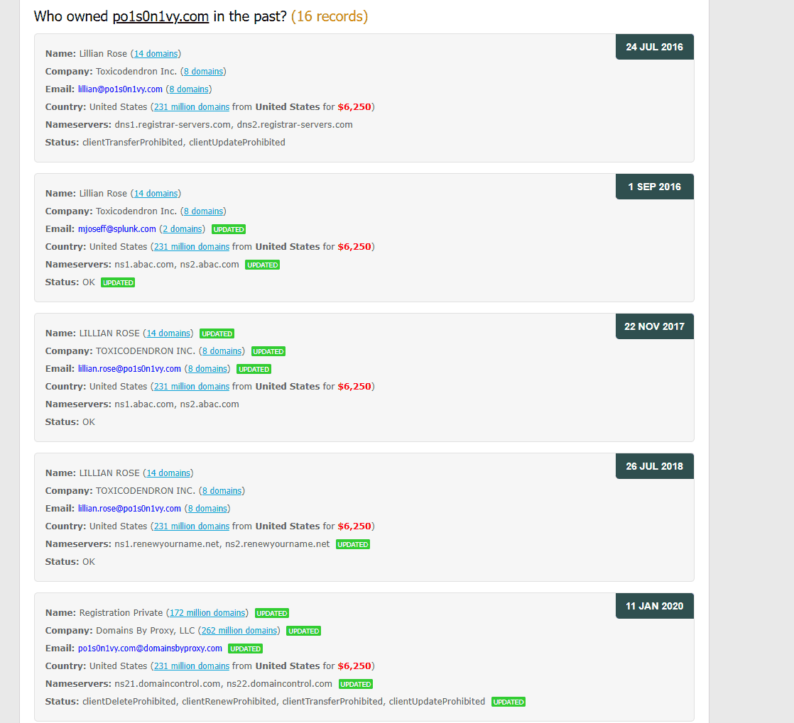


lillian.rose@po1s0n1vy.com


### Q14: Web Defacement: GCPD reported that common TTP (Tactics, Techniques, Procedures) for the Po1s0n1vy APT group, if initial compromise fails, is to send a spear-phishing email with custom malware attached to their intended target. This malware is usually connected to Po1s0n1vy's initial attack infrastructure. Using research techniques, provide the SHA256 hash of this malware. {#3557b0eb61a480558b50c3f1d819c397}


look up 23.22.63.114 in virus total, and look for malicious exe in **Communicating Files tab**


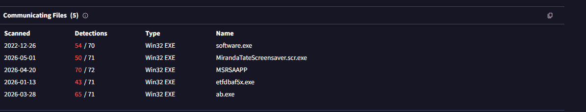


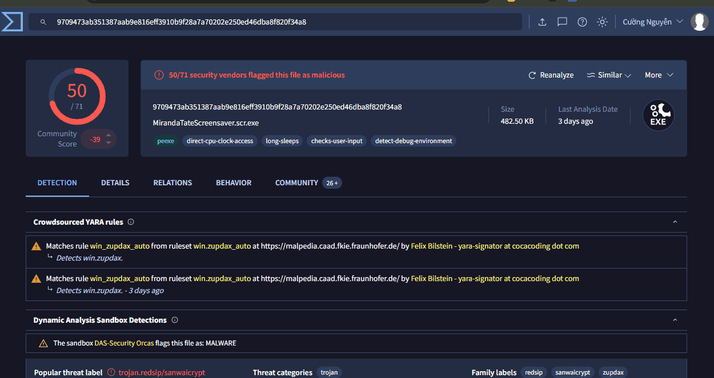


9709473ab351387aab9e816eff3910b9f28a7a70202e250ed46dba8f820f34a8


### Q15: Web Defacement: What is the special hex code associated with the customized malware discussed in the previous question? (Hint: It's not in Splunk) {#3557b0eb61a480feb7f2e5e0b1261b84}


Follow the virustotal link for the malware in community tab


53 74 65 76 65 20 42 72 61 6e 74 27 73 20 42 65 61 72 64 20 69 73 20 61 20 70 6f 77 65 72 66 75 6c 20 74 68 69 6e 67 2e 20 46 69 6e 64 20 74 68 69 73 20 6d 65 73 73 61 67 65 20 61 6e 64 20 61 73 6b 20 68 69 6d 20 74 6f 20 62 75 79 20 79 6f 75 20 61 20 62 65 65 72 21 21 21


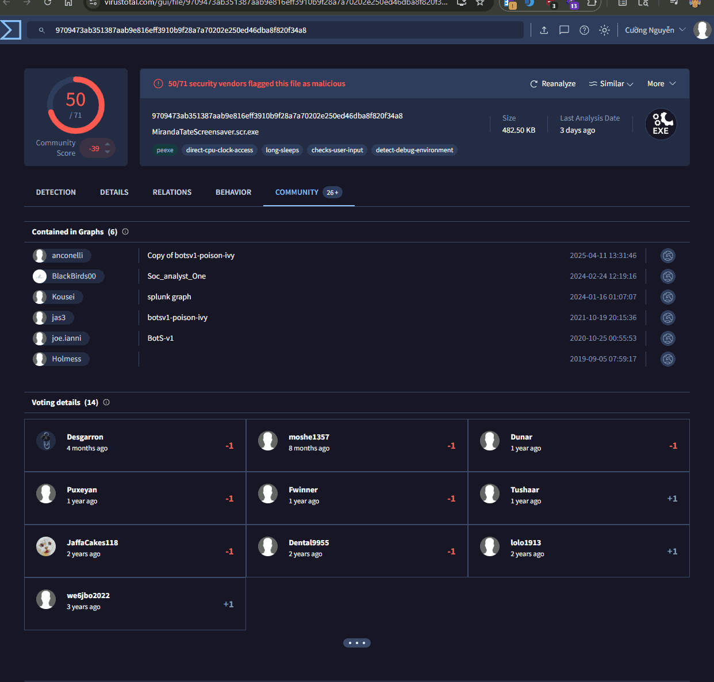


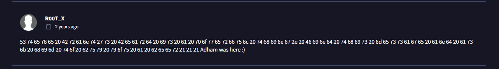


### Q16: Web Defacement: One of Po1s0n1vy's staged domains has some disjointed "unique" whois information. Concatenate the two codes together and submit them as a single answer. {#3557b0eb61a480d8a91fed5995d68495}


31 73 74 32 66 69 6E 64 67 65 74 73 66 72 65 65 62 65 65 72 66 72 6F 6D 72 79 61 6E 66 69 6E 64 68 69 6D 74 6F 67 65 74


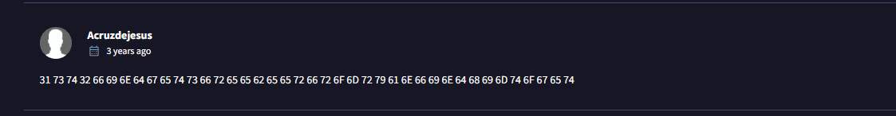


Same for privious question


### Q17: Web Defacement: One of the passwords in the brute force attack is James Brodsky's favorite Coldplay song. Hint: we are looking for a six-character word on this one. Which is it? {#3557b0eb61a480a2853fe7f9e82fe592}


I did research on google and the most famous song is Yellow


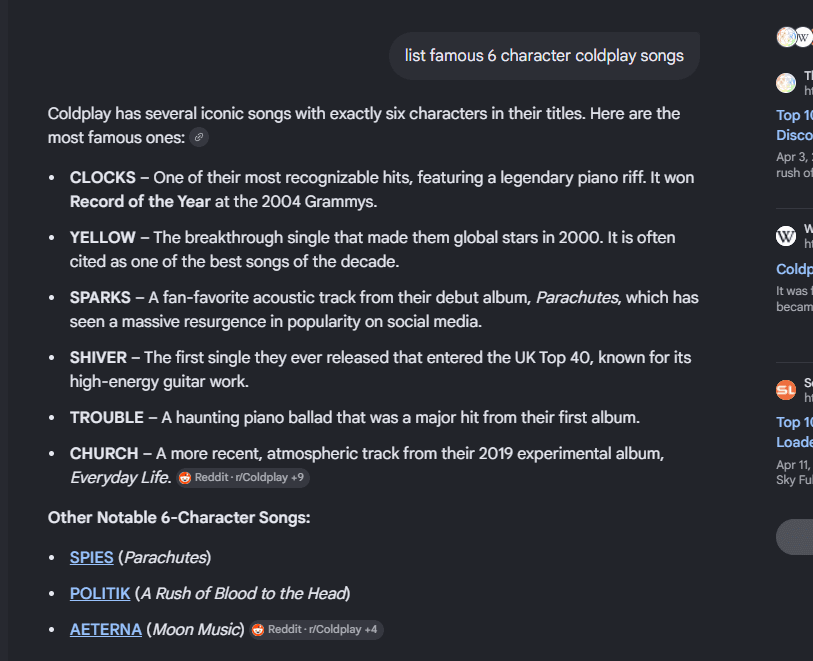


let’s check if it is indeed the answer


```powershell
index="botsv1" sourcetype=stream:http src_ip=23.22.63.114 http_method=POST 
| rex field=form_data "passwd=(?<password>[^&]+)" 
| search password="yellow" 
| table src_ip password
```


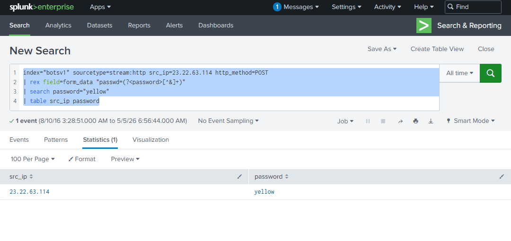


### Q18: Web Defacement: What was the average password length used in the password brute-forcing attempt? (Round to a closest whole integer. For example "5" not "5.23213") {#3557b0eb61a48073a855f438ed44c41d}


```powershell
index="botsv1" sourcetype=stream:http src_ip=23.22.63.114 http_method=POST 
| rex field=form_data "passwd=(?<password>[^&]+)" 
| eval pw_len= len(password) 
| stats avg(pw_len) as avg_len
| eval avg_len=round(avg_len, 0)
```

- **`eval pw_len = len(password)`**: Splunk sẽ tạo ra một cột ảo mới tên là `pw_len`, điền vào đó số lượng ký tự của từng mật khẩu (ví dụ: "yellow" -&gt; 6).
- **`stats avg(pw_len) as avg_length`**: Lấy tất cả các con số ở bước 3 cộng lại và chia đều, xuất ra một cột duy nhất tên là `avg_length`.
- **`eval avg_length = round(avg_length, 0)`**: Hàm `round(X, 0)` sẽ làm tròn số thập phân (X) về 0 chữ số thập phân

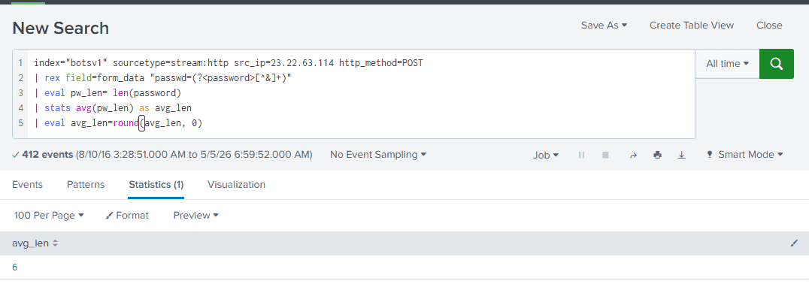


### Q19: Web Defacement: How many seconds elapsed between the brute force password scan identified the correct password and the compromised login? Round to 2 decimal places. {#3557b0eb61a48097894bd7d549f50c48}


```powershell
index=botsv1 sourcetype=stream:http http_method=POST uri_path="/joomla/administrator/index.php"  
| rex field=form_data "passwd=(?<password>\w+)" 
| search password=batman
| transaction password 
| table duration | eval rounded_duration = round(duration, 2)
```


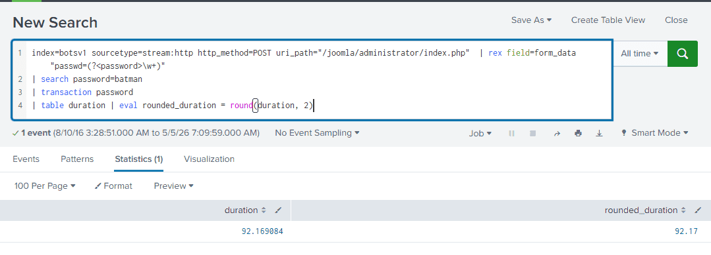


“password=(?&lt;password&gt;\w+)”


### Q20: Web Defacement: How many unique passwords were attempted in the brute force attempt? {#3557b0eb61a48034b629ecc64aa378b4}


```powershell
index=botsv1 sourcetype=stream:http http_method=POST uri_path="/joomla/administrator/index.php"  | rex field=form_data "passwd=(?<password>\w+)" 
| dedup password 
| table password
```


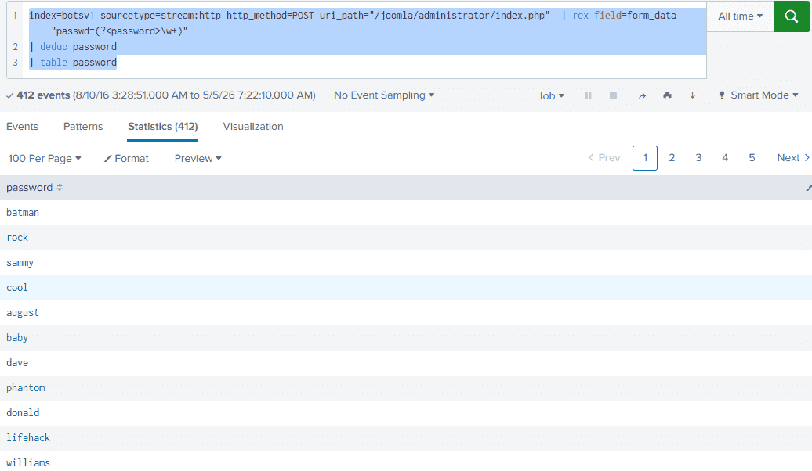


### Q21: Ransomware: What fully qualified domain name (FQDN) makes the Cerber ransomware attempt to direct the user to at the end of its encryption phase? {#3557b0eb61a480d3b7ccffb0ee3ede35}


192.168.250.100 là we8105desk


192.168.250.20 là thằng đi truy vấn malicious domain prankglassinebracket.jumpingcrab.com:1337


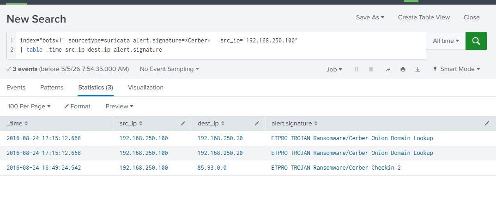

- **Hành vi của Cerber:** Khi lây nhiễm vào máy tính (ở đây là IP `192.168.250.100`), Cerber sẽ âm thầm mã hóa toàn bộ dữ liệu.
- **Giai đoạn kết thúc (End of encryption phase):** Sau khi mã hóa xong, nó sẽ đổi hình nền máy tính và thả các file "Thư tống tiền" (Ransom note) dạng TXT, HTML, VBS.
- **Mục đích:** Để ép nạn nhân trả tiền chuộc, mã độc sẽ tự động mở trình duyệt web lên và điều hướng nạn nhân đến một trang web thanh toán của hacker.
- **Đặc điểm của trang thanh toán:** Các trang này luôn nằm trên **Dark Web (mạng ẩn danh Tor)**, có đuôi là `.onion`. Tuy nhiên, vì máy nạn nhân thường không cài trình duyệt Tor, hacker sử dụng các dịch vụ **"Tor2Web Gateway"** (ví dụ: `.onion.to`, `.onion.cab`, `.onion.city`, v.v.) để nạn nhân có thể truy cập bằng Chrome/Firefox bình thường.

ta đi tìm các domain mà 192.168.250.100 đi tìm thời gian xung quanh đó


```powershell
index="botsv1" sourcetype=stream:dns src_ip=192.168.250.100 dest_ip=192.168.250.20 earliest="08/24/2016:17:15:00" latest="08/24/2016:17:16:00"
| stats count by query{}
```


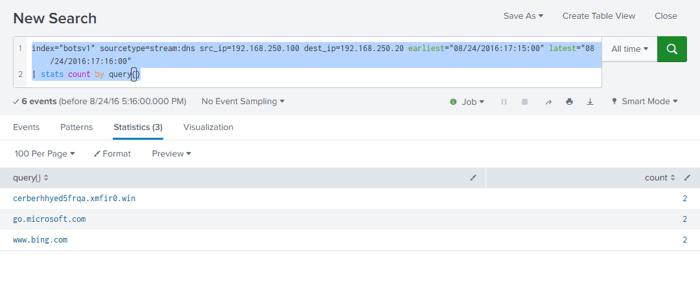


### Q22: Ransomware: What was the most likely IP address of we8105desk in 24AUG2016? {#3557b0eb61a480fb860de052479a8868}


192.168.250.100


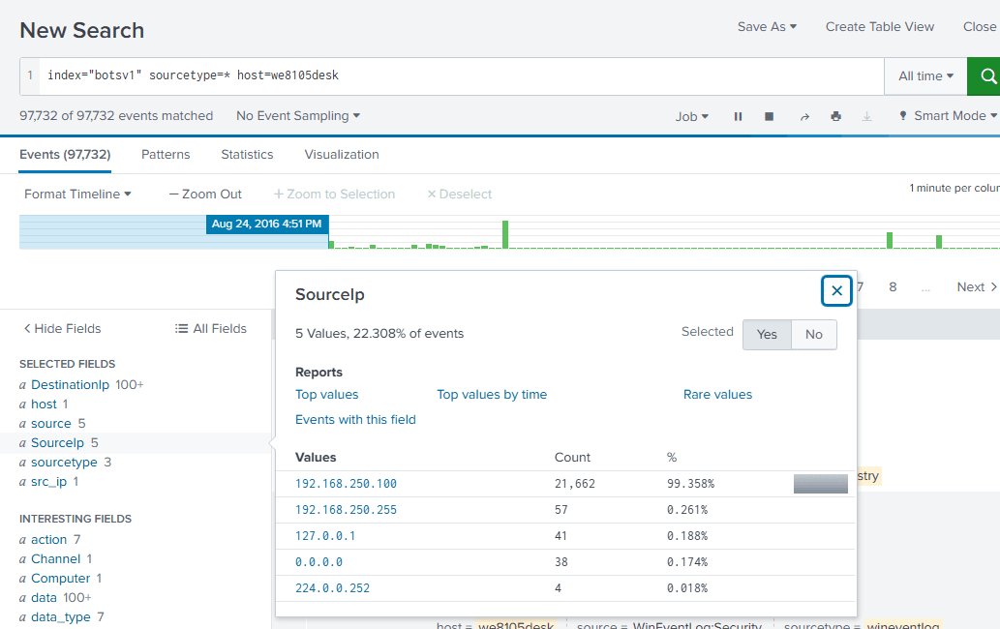


### Q23: Ransomware: Amongst the Suricata signatures that detected the Cerber malware, which one alerted the fewest number of times? Submit ONLY the signature ID value as the answer. (No punctuation, just 7 integers.) {#3557b0eb61a480bc9336f1975a58bbd1}


```powershell
index="botsv1" sourcetype=suricata alert.signature=*Cerber* src_ip="192.168.250.100" 
| table _time src_ip dest_ip alert.signature alert.signature_id
```


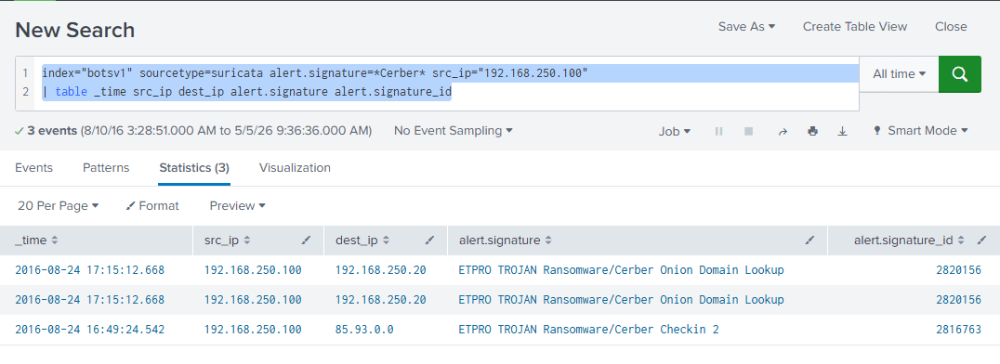


### Q24: Ransomware: The VBScript found in question 25 launches 121214.tmp. What is the ParentProcessId of this initial launch? {#3557b0eb61a480249773e2f6bf38333e}


```powershell
index="botsv1" source="wineventlog:microsoft-windows-sysmon/operational" EventCode=1 Image"*121214.tmp" parent_process="*vbs*"
| table Image CommandLine parent_process parent_process_id
```


3968


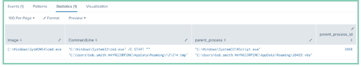


### Q25: Ransomware: During the initial Cerber infection a VB script is run. The entire script from this execution, pre-pended by the name of the launching .exe, can be found in a field in Splunk. What is the length in characters of the value of this field? {#3557b0eb61a48035b544f2ae0f46bad2}

- seach the Sysmon log for process creation and any field that contains .vbs extension.
- I then observed the parent processes and noticed `winword.exe`. I was confident that the script was run from the user opening a malicious document.
- The query returned a long command that contained a vbscript. I calculated the length of the field.
- Search query:

```powershell
index="botsv1" source="wineventlog:microsoft-windows-sysmon/operational" EventCode=1 vbs ParentImage="C:\\Program Files (x86)\\Microsoft Office\\Office14\\WINWORD.EXE"
| eval commandlen = len(CommandLine)
| table CommandLine commandlen
```


**`eval`** is **a command used to calculate expressions and store the result in a search results field**

- **Create new fields**: If the specified field name doesn't exist, Splunk creates it.
- **Overwrite existing fields**: If the field name already exists, the new calculated value replaces the old one.


**Answer: 4490**


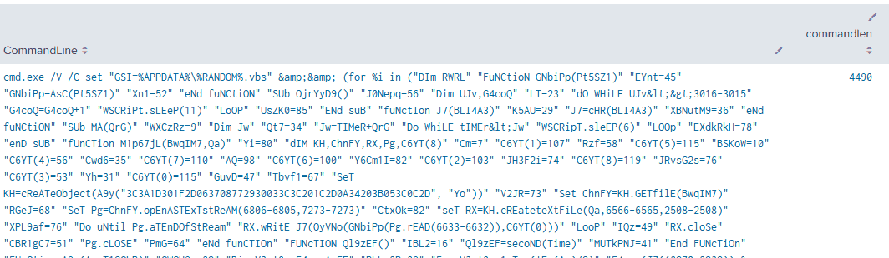


### Q26: Ransomware: The malware downloads a file that contains the Cerber ransomware crypto code. What is the name of that file? {#3557b0eb61a480b9967fd81d041b77e7}


mhtr.jpg


Từ câu 32 ta tìm được một file trong thời gian đó


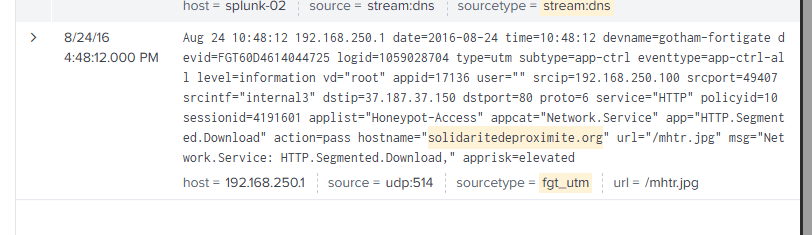


### Q27: Ransomware: Now that you know the name of the ransomware's encryptor file, what obfuscation technique does it likely use? {#3557b0eb61a4807aa927d204f58807b3}


• The malicious executable was embedded within a jpg file. This is a steganography technique.


Steganography


### Q28: Ransomware: What is the name of the USB key inserted by Bob Smith? {#3557b0eb61a4809da985f2291d7b47ea}


Ta thấy chỉ có một usb mà thôi nên phải là nó rồi


`index="botsv1" sourcetype="winregistry" FriendlyName`


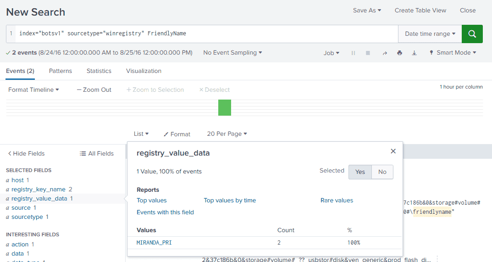


### Q29: Ransomware: Bob Smith's workstation (we8105desk) was connected to a file server during the ransomware outbreak. What is the IP address of the file server? {#3557b0eb61a480b9bfe8e1f484b4f832}


Ta tìm trong log smb


```powershell
index="botsv1" sourcetype=stream:smb src_ip=192.168.250.100 
| table _time src_ip dest_ip command{} 
| stats count by dest_ip
```


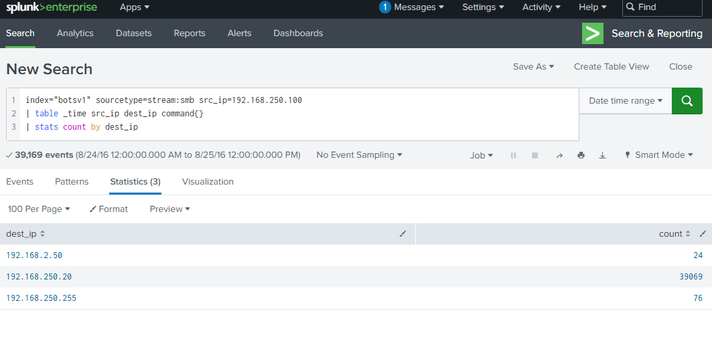


192.168.250.20


Số lượng nhiều 


### Q30: Ransomware: How many distinct PDFs did the ransomware encrypt on the remote file server? {#3557b0eb61a480428b8bdc2e54ef9715}


Thử bằng SMB và pdf nhưng không đúng kết quả


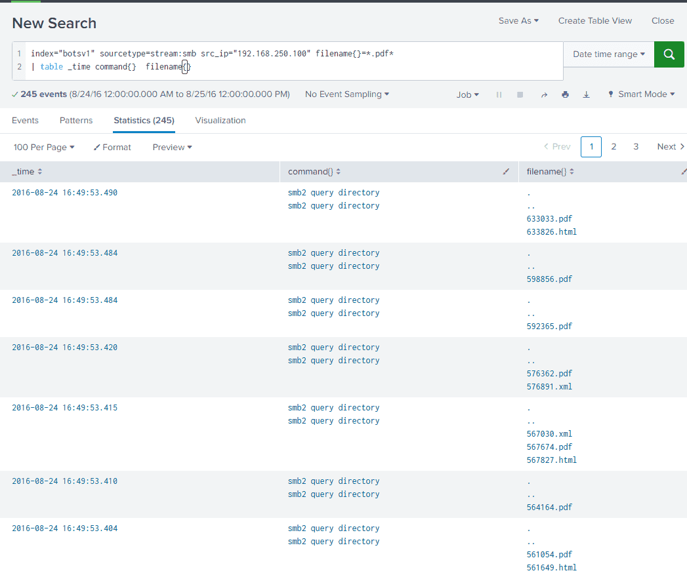


Event ID 5145 is **a Windows Security log event indicating a network share object (file or folder) was accessed or checked for access permissions**. It is a high-volume "Detailed File Share" audit event used to track **successful or failed** network access attempt

• **Subject:** Ai đang thực hiện hành động (Security ID, Account Name)


• **Network Information:** Địa chỉ IP nguồn và cổng (Source Address, Source Port).


• **Share Information:** Tên thư mục chia sẻ (Share Name) và đường dẫn (Share Path).


• **Access Request Information:** Loại quyền được yêu cầu (Read/Write) và Access Mask.


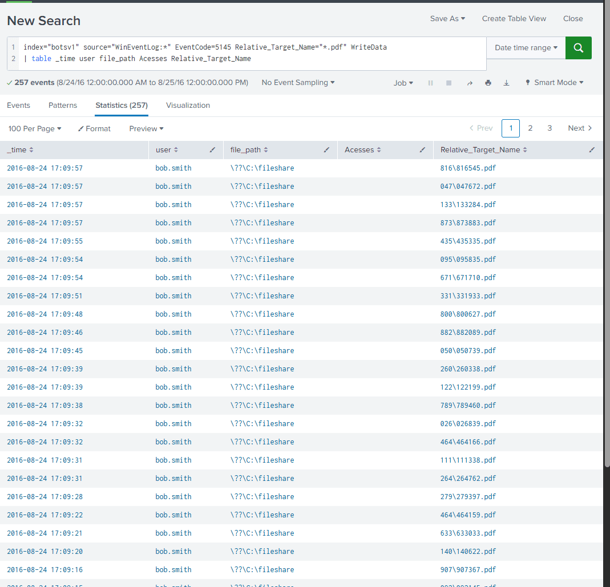


### Q31: Ransomware: The Cerber ransomware encrypts files located in Bob Smith's Windows profile. How many .txt files does it encrypt? {#3557b0eb61a480079e42e1d857393da7}


406


Ta tìm xem log ở đâu 


```powershell
index=botsv1 host="we8105desk" "*.txt" sourcetype=xmlwineventlog
```


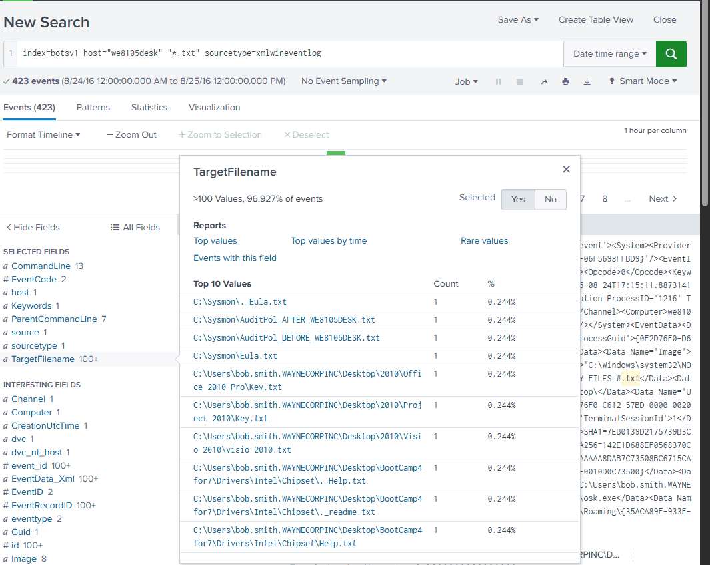


Tìm được đường dẫn của bob smith


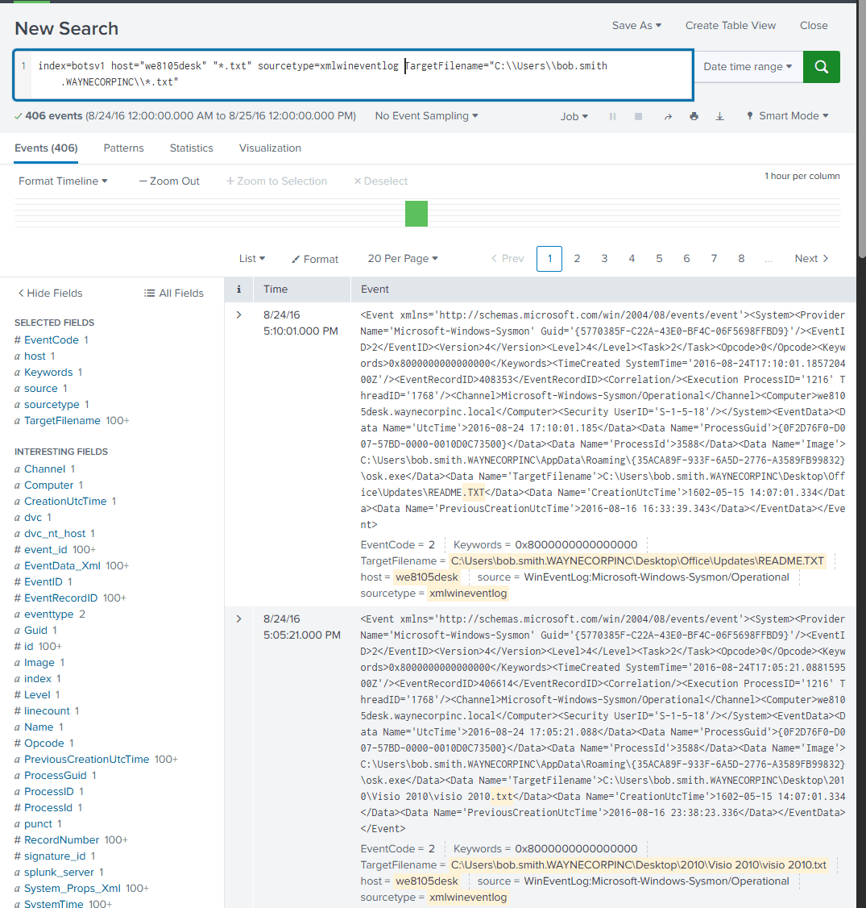


### Q32: Ransomware: What was the first suspicious domain visited by we8105desk in 24AUG2016? {#3557b0eb61a480c2bcf6c4072b6df9fd}


```powershell
index="botsv1" sourcetype=stream:dns src_ip=192.168.250.100   "query{}"!="*in-addr.arpa" "query{}"!="www.microsoft.com" | table  _time src_ip dest_ip query{}
```


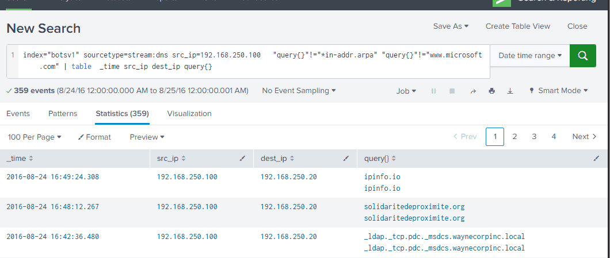

