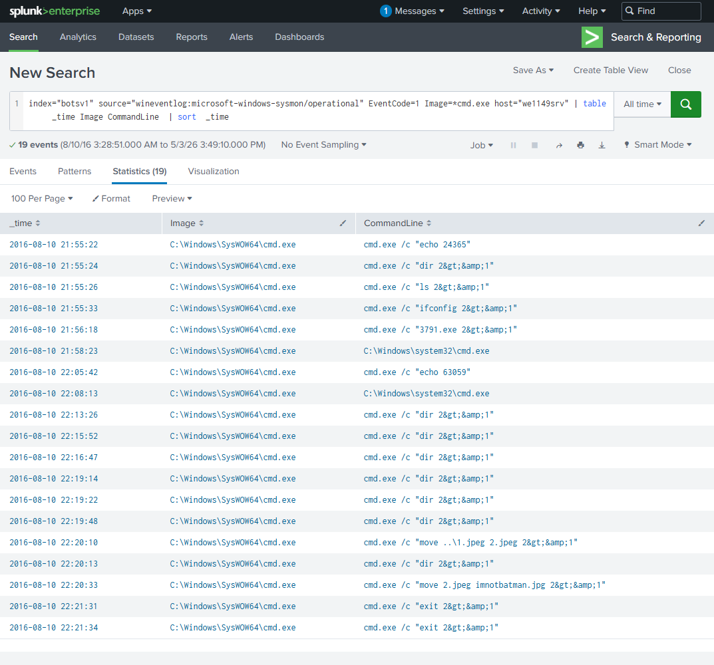
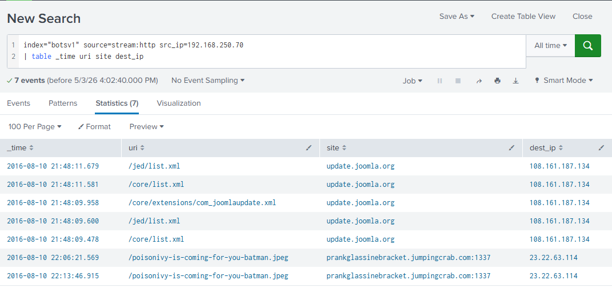

| [index](https://26d0ce7b-142b-447a-8379-4cff1c8bde34.cyberdefenders.network/en-US/app/search/search?q=%7C%20tstats%20count%20where%20index%3D*%20by%20index%2C%20sourcetype&display.page.search.mode=smart&dispatch.sample_ratio=1&workload_pool=&earliest=0&latest=now&display.page.search.tab=statistics&display.general.type=statistics&sid=1777808612.31#) | [sourcetype](https://26d0ce7b-142b-447a-8379-4cff1c8bde34.cyberdefenders.network/en-US/app/search/search?q=%7C%20tstats%20count%20where%20index%3D*%20by%20index%2C%20sourcetype&display.page.search.mode=smart&dispatch.sample_ratio=1&workload_pool=&earliest=0&latest=now&display.page.search.tab=statistics&display.general.type=statistics&sid=1777808612.31#) | [count](https://26d0ce7b-142b-447a-8379-4cff1c8bde34.cyberdefenders.network/en-US/app/search/search?q=%7C%20tstats%20count%20where%20index%3D*%20by%20index%2C%20sourcetype&display.page.search.mode=smart&dispatch.sample_ratio=1&workload_pool=&earliest=0&latest=now&display.page.search.tab=statistics&display.general.type=statistics&sid=1777808612.31#) |
| -------------------------------------------------------------------------------------------------------------------------------------------------------------------------------------------------------------------------------------------------------------------------------------------------------------------------------------------------------------- | ------------------------------------------------------------------------------------------------------------------------------------------------------------------------------------------------------------------------------------------------------------------------------------------------------------------------------------------------------------------- | -------------------------------------------------------------------------------------------------------------------------------------------------------------------------------------------------------------------------------------------------------------------------------------------------------------------------------------------------------------- |
| botsv1                                                                                                                                                                                                                                                                                                                                                         | fgt_event                                                                                                                                                                                                                                                                                                                                                           | 57                                                                                                                                                                                                                                                                                                                                                             |
| botsv1                                                                                                                                                                                                                                                                                                                                                         | fgt_traffic                                                                                                                                                                                                                                                                                                                                                         | 55279                                                                                                                                                                                                                                                                                                                                                          |
| botsv1                                                                                                                                                                                                                                                                                                                                                         | fgt_utm                                                                                                                                                                                                                                                                                                                                                             | 25586                                                                                                                                                                                                                                                                                                                                                          |
| botsv1                                                                                                                                                                                                                                                                                                                                                         | iis                                                                                                                                                                                                                                                                                                                                                                 | 22615                                                                                                                                                                                                                                                                                                                                                          |
| botsv1                                                                                                                                                                                                                                                                                                                                                         | nessus:scan                                                                                                                                                                                                                                                                                                                                                         | 65                                                                                                                                                                                                                                                                                                                                                             |
| botsv1                                                                                                                                                                                                                                                                                                                                                         | stream:dhcp                                                                                                                                                                                                                                                                                                                                                         | 16                                                                                                                                                                                                                                                                                                                                                             |
| botsv1                                                                                                                                                                                                                                                                                                                                                         | stream:dns                                                                                                                                                                                                                                                                                                                                                          | 7434                                                                                                                                                                                                                                                                                                                                                           |
| botsv1                                                                                                                                                                                                                                                                                                                                                         | stream:http                                                                                                                                                                                                                                                                                                                                                         | 23936                                                                                                                                                                                                                                                                                                                                                          |
| botsv1                                                                                                                                                                                                                                                                                                                                                         | stream:icmp                                                                                                                                                                                                                                                                                                                                                         | 12858                                                                                                                                                                                                                                                                                                                                                          |
| botsv1                                                                                                                                                                                                                                                                                                                                                         | stream:ip                                                                                                                                                                                                                                                                                                                                                           | 62083                                                                                                                                                                                                                                                                                                                                                          |
| botsv1                                                                                                                                                                                                                                                                                                                                                         | stream:ldap                                                                                                                                                                                                                                                                                                                                                         | 344                                                                                                                                                                                                                                                                                                                                                            |
| botsv1                                                                                                                                                                                                                                                                                                                                                         | stream:mapi                                                                                                                                                                                                                                                                                                                                                         | 7025                                                                                                                                                                                                                                                                                                                                                           |
| botsv1                                                                                                                                                                                                                                                                                                                                                         | stream:sip                                                                                                                                                                                                                                                                                                                                                          | 12                                                                                                                                                                                                                                                                                                                                                             |
| botsv1                                                                                                                                                                                                                                                                                                                                                         | stream:smb                                                                                                                                                                                                                                                                                                                                                          | 151568                                                                                                                                                                                                                                                                                                                                                         |
| botsv1                                                                                                                                                                                                                                                                                                                                                         | stream:snmp                                                                                                                                                                                                                                                                                                                                                         | 12                                                                                                                                                                                                                                                                                                                                                             |
| botsv1                                                                                                                                                                                                                                                                                                                                                         | stream:tcp                                                                                                                                                                                                                                                                                                                                                          | 28291                                                                                                                                                                                                                                                                                                                                                          |
| botsv1                                                                                                                                                                                                                                                                                                                                                         | suricata                                                                                                                                                                                                                                                                                                                                                            | 125584                                                                                                                                                                                                                                                                                                                                                         |
| botsv1                                                                                                                                                                                                                                                                                                                                                         | wineventlog:application                                                                                                                                                                                                                                                                                                                                             | 113                                                                                                                                                                                                                                                                                                                                                            |
| botsv1                                                                                                                                                                                                                                                                                                                                                         | wineventlog:security                                                                                                                                                                                                                                                                                                                                                | 87430                                                                                                                                                                                                                                                                                                                                                          |
| botsv1                                                                                                                                                                                                                                                                                                                                                         | wineventlog:system                                                                                                                                                                                                                                                                                                                                                  | 182                                                                                                                                                                                                                                                                                                                                                            |


## Artifact {#3557b0eb61a4806dbe91c1b9e71b314f}


| host      | IP                                                                                                                | exe  |
| --------- | ----------------------------------------------------------------------------------------------------------------- | ---- |
| we1149srv | 192.168.250.70                                                                                                    |      |
|           | 23.22.63.114 Host: [prankglassinebracket.jumpingcrab.com:1337](http://prankglassinebracket.jumpingcrab.com:1337/) | 3791 |
|           | <br/>`40.80.148.42`                                                                                               |      |


### Q1: This is a simple question to get you familiar with submitting answers. What is the name of the company that makes the software that you are using for this competition? Just a six-letter word with no punctuation. {#3557b0eb61a48066a490eebe5b308a32}


### Q2: Web Defacement: What content management system is [imreallynotbatman.com](http://imreallynotbatman.com/) likely using? (Please do not include punctuation such as . , ! ? in your answer. We are looking for alpha characters only.) {#3557b0eb61a48088a3adedce87d41b69}


sourcetype=* "http.hostname"="[imreallynotbatman.com](http://imreallynotbatman.com/)" và tìm http.url


joomla


### Q3: Web Defacement: What is the likely IP address of someone from the Po1s0n1vy group scanning imreallynotbatman.com for web application vulnerabilities? {#3557b0eb61a4809f9443e614676d931d}


sourcetype=suricata AND http.hostname="imreallynotbatman.com" event_type=alert alert.signature=_scan_


192.168.250.70 -splunk-02


Vì trước đó ta phát hiện hacker sử dụng cmd.exe để thực hiện hành vi. Như vậy phải có tiến trình gọi cmd đó. Ta dùng câu query sau


index="botsv1" source="wineventlog:microsoft-windows-sysmon/operational" EventCode=1 Image="*cmd.exe"   ParentImage!="C:\\Program Files\\SplunkUniversalForwarder\\bin\\splunk.exe" | table  _time host ParentImage CommandLine   | sort  _time


| 2016-08-10 21:58:23 | we1149srv | C:\inetpub\wwwroot\joomla\3791.exe | C:\Windows\system32\cmd.exe |
| ------------------- | --------- | ---------------------------------- | --------------------------- |


**`C:\Program Files (x86)\PHP\v5.5\php-cgi.exe`** **liên tục gọi** **`cmd.exe`**.

- **Bản chất:** `php-cgi.exe` là tiến trình xử lý mã PHP của máy chủ web. Trong điều kiện bình thường, tiến trình này chỉ xử lý code PHP trả về HTML. Nó **không bao giờ** tự động mở Command Prompt (`cmd.exe`) để gõ lệnh hệ thống.
- **Kết luận:** Hacker đã khai thác thành công một lỗ hổng **RCE (Remote Code Execution - Thực thi mã từ xa)** hoặc tải lên thành công một **Web Shell** (một tệp PHP độc hại đóng vai trò như một cửa hậu).

### Q4: Web Defacement: What company created the web vulnerability scanner used by Po1s0n1vy? Type the company name. (For example, "Microsoft" or "Oracle") {#3557b0eb61a480d7b1baf269481220eb}


Acunetix


### Q5: Web Defacement: What IP address is likely attempting a brute force password attack against imreallynotbatman.com? {#3557b0eb61a4802a8d56e8681643c3e8}


23.22.63.114


Trong log chỉ có 2 ip thì khong phải 40.80.148.42 phải là thằng này mà thôi


### Q6: Web Defacement: What was the first brute force password used? {#3557b0eb61a4800aaf66d78b48dc9db9}


Đi tìm ở suricata thì không thấy log đâu hết vì chỉ lưu metadata


```c++
sourcetype=stream:http dest_ip=192.168.250.70 src_ip=23.22.63.114 http_method=POST 
| sort _time 
|  table _time src_ip http_user_agent form_data
```


### Q7: Web Defacement: What is the name of the executable uploaded by Po1s0n1vy? Please include the file extension. (For example, "notepad.exe" or "favicon.ico") {#3557b0eb61a480028f5cc24188d86d85}


`..%E0%80%AF../..%E0%80%AF../winnt/system32/cmd.exe?/c dir`  directory traversal
Trong 14 gói tin này, hacker **không hề upload (đăng tải)** một file nào lên máy chủ cả. Những chữ `.exe` mà Splunk vớt được (như `shtml.exe`, `cmd.exe`, `le_check_v3.exe`) t


`40.80.148.42` 


`sourcetype="stream:http" http_method=GET dest_ip=23.22.63.114
| table timestamp  http_method uri dest_ip site`


Tìm trên sourcetype nên phải dùng sysmon


### Q8: Web Defacement: What is the MD5 hash of the executable uploaded? {#3557b0eb61a480279cf4f564d0b40869}


Dùng eventiD 1 ta tìm được 


index="botsv1" source="wineventlog:microsoft-windows-sysmon/operational" EventCode=1 Image="*3791.exe" host="we1149srv"  Image="C:\\inetpub\\wwwroot\\joomla\\3791.exe”


MD5=AAE3F5A29935E6ABCC2C2754D12A9AF0


ta phát hiện đây là meterpreter của Cobalt Strike - Rozena


Kiểm tra xem 3791.exe đã làm những gì


index="botsv1" source="wineventlog:microsoft-windows-sysmon/operational" Image=*3791.exe host="we1149srv" | table  _time EventCode Image CommandLine  | sort  _time
| dedup EventCode


8/10/16


9:56:19.000 PM 


	kết nối tới 23.22.63.114 port 3791


index="botsv1" source="wineventlog:microsoft-windows-sysmon/operational" Image=*3791.exe host="we1149srv"  EventCode=7
| table _time host ImageLoaded


### Q9: Web Defacement: What was the correct password for admin access to the content management system running "imreallynotbatman.com"? {#3557b0eb61a4805fb1ebe6e6c1151bc9}


hacker đã chạy những lệnh sau





index="botsv1" source=stream:http src_ip=192.168.250.70
| table _time uri site





8/10/16


10:13:46.915 PM


### Q10: Web Defacement: What is the name of the file that defaced the imreallynotbatman.com website? Please submit only the name of the file with the extension (For example, "notepad.exe" or "favicon.ico"). {#3557b0eb61a480baa9cae46e1bb13987}


từ câu 9 ở trên Ta tìm thấy kết quả cho câu 10 poisonivy-is-coming-for-you-batman.jpeg


### Q11: Web Defacement: This attack used dynamic DNS to resolve to the malicious IP. What is the fully qualified domain name (FQDN) associated with this attack? {#3557b0eb61a480d9a54bf7240a816358}


### Q12: Web Defacement: What IP address has Po1s0n1vy tied to domains that are pre-staged to attack Wayne Enterprises? {#3557b0eb61a480059844e05685364f4a}


### Q13: Web Defacement: Based on the data gathered from this attack and common open-source intelligence sources for domain names, what is the email address most likely associated with the Po1s0n1vy APT group? {#3557b0eb61a480ecabb2cfde427b9198}


### Q14: Web Defacement: GCPD reported that common TTP (Tactics, Techniques, Procedures) for the Po1s0n1vy APT group, if initial compromise fails, is to send a spear-phishing email with custom malware attached to their intended target. This malware is usually connected to Po1s0n1vy's initial attack infrastructure. Using research techniques, provide the SHA256 hash of this malware. {#3557b0eb61a480558b50c3f1d819c397}


### Q15: Web Defacement: What is the special hex code associated with the customized malware discussed in the previous question? (Hint: It's not in Splunk) {#3557b0eb61a480feb7f2e5e0b1261b84}


### Q16: Web Defacement: One of Po1s0n1vy's staged domains has some disjointed "unique" whois information. Concatenate the two codes together and submit them as a single answer. {#3557b0eb61a480d8a91fed5995d68495}


### Q17: Web Defacement: One of the passwords in the brute force attack is James Brodsky's favorite Coldplay song. Hint: we are looking for a six-character word on this one. Which is it? {#3557b0eb61a480a2853fe7f9e82fe592}


### Q18: Web Defacement: What was the average password length used in the password brute-forcing attempt? (Round to a closest whole integer. For example "5" not "5.23213") {#3557b0eb61a48073a855f438ed44c41d}


### Q19: Web Defacement: How many seconds elapsed between the brute force password scan identified the correct password and the compromised login? Round to 2 decimal places. {#3557b0eb61a48097894bd7d549f50c48}


### Q20: Web Defacement: How many unique passwords were attempted in the brute force attempt? {#3557b0eb61a48034b629ecc64aa378b4}


### Q21: Ransomware: What fully qualified domain name (FQDN) makes the Cerber ransomware attempt to direct the user to at the end of its encryption phase? {#3557b0eb61a480d3b7ccffb0ee3ede35}


### Q22: Ransomware: What was the most likely IP address of we8105desk in 24AUG2016? {#3557b0eb61a480fb860de052479a8868}


### Q23: Ransomware: Amongst the Suricata signatures that detected the Cerber malware, which one alerted the fewest number of times? Submit ONLY the signature ID value as the answer. (No punctuation, just 7 integers.) {#3557b0eb61a480bc9336f1975a58bbd1}


### Q24: Ransomware: The VBScript found in question 25 launches 121214.tmp. What is the ParentProcessId of this initial launch? {#3557b0eb61a480249773e2f6bf38333e}


### Q25: Ransomware: During the initial Cerber infection a VB script is run. The entire script from this execution, pre-pended by the name of the launching .exe, can be found in a field in Splunk. What is the length in characters of the value of this field? {#3557b0eb61a48035b544f2ae0f46bad2}


### Q26: Ransomware: The malware downloads a file that contains the Cerber ransomware crypto code. What is the name of that file? {#3557b0eb61a480b9967fd81d041b77e7}


### Q27: Ransomware: Now that you know the name of the ransomware's encryptor file, what obfuscation technique does it likely use? {#3557b0eb61a4807aa927d204f58807b3}


### Q28: Ransomware: What is the name of the USB key inserted by Bob Smith? {#3557b0eb61a4809da985f2291d7b47ea}


### Q29: Ransomware: Bob Smith's workstation (we8105desk) was connected to a file server during the ransomware outbreak. What is the IP address of the file server? {#3557b0eb61a480b9bfe8e1f484b4f832}


### Q30: Ransomware: How many distinct PDFs did the ransomware encrypt on the remote file server? {#3557b0eb61a480428b8bdc2e54ef9715}


### Q31: Ransomware: The Cerber ransomware encrypts files located in Bob Smith's Windows profile. How many .txt files does it encrypt? {#3557b0eb61a480079e42e1d857393da7}


### Q32: Ransomware: What was the first suspicious domain visited by we8105desk in 24AUG2016? {#3557b0eb61a480c2bcf6c4072b6df9fd}

